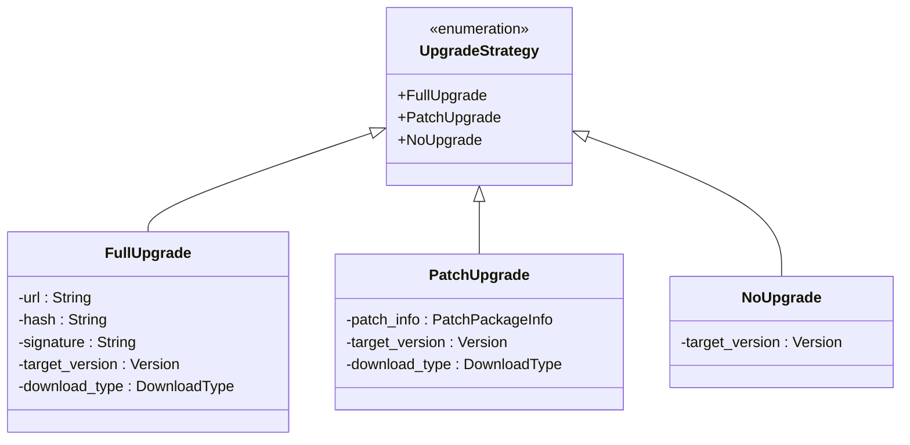
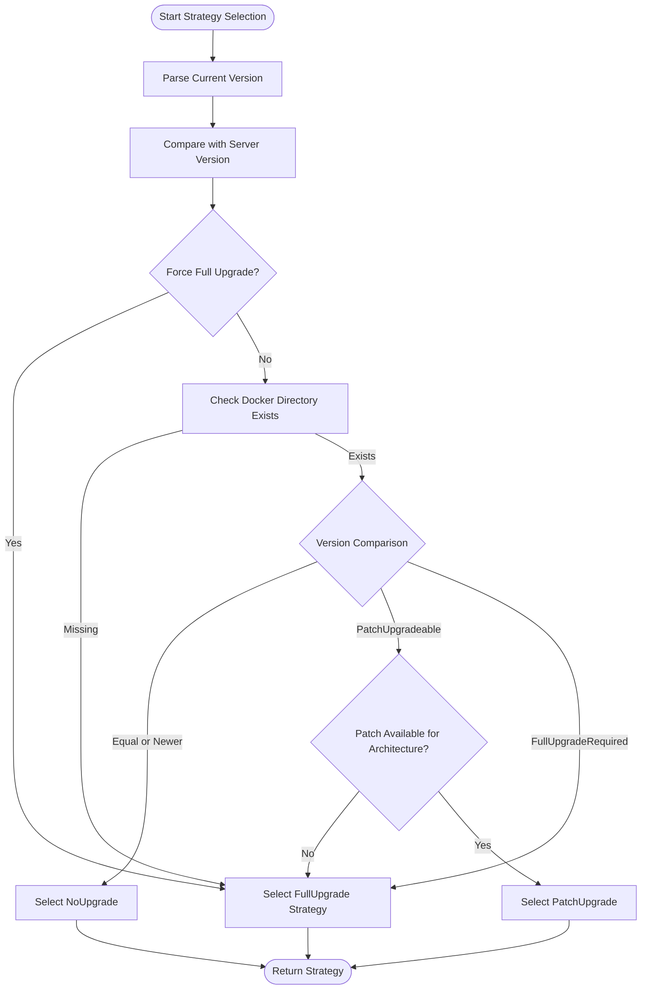

# Strategy Pattern Architecture

<cite>
**Referenced Files in This Document**   
- [upgrade_strategy.rs](file://client-core/src/upgrade_strategy.rs#L1-L462)
- [constants.rs](file://client-core/src/constants.rs#L1-L521)
- [version.rs](file://client-core/src/version.rs)
- [api_types.rs](file://client-core/src/api_types.rs)
- [architecture.rs](file://client-core/src/architecture.rs)
</cite>

## Table of Contents
1. [Introduction](#introduction)
2. [Core Components](#core-components)
3. [UpgradeStrategy Enum Design](#upgradestrategy-enum-design)
4. [Trait-Based Polymorphism and Execution](#trait-based-polymorphism-and-execution)
5. [Factory Pattern in UpgradeStrategyManager](#factory-pattern-in-upgradestrategymanager)
6. [Integration with Public API](#integration-with-public-api)
7. [Error Propagation and Async Considerations](#error-propagation-and-async-considerations)
8. [State Immutability and Strategy Selection](#state-immutability-and-strategy-selection)
9. [Code Examples and Implementation Details](#code-examples-and-implementation-details)
10. [Conclusion](#conclusion)

## Introduction
The upgrade system in the Duck Client repository employs a robust strategy pattern architecture to manage different types of software upgrades. This design enables flexible, extensible, and maintainable handling of full upgrades, patch upgrades, and cases where no upgrade is needed. The core of this system lies in the `UpgradeStrategy` enum and its associated manager, which together provide a clean abstraction for upgrade logic while encapsulating complexity from external components such as CLI and GUI interfaces.

This document provides a comprehensive analysis of how the strategy pattern is implemented, focusing on behavioral encapsulation, polymorphic execution, factory-based selection logic, and integration points across the codebase.

**Section sources**
- [upgrade_strategy.rs](file://client-core/src/upgrade_strategy.rs#L1-L462)

## Core Components
The upgrade strategy system consists of several key components that work together to determine and execute the appropriate upgrade path:

- **UpgradeStrategy**: An enum that represents the three possible upgrade behaviors (FullUpgrade, PatchUpgrade, NoUpgrade)
- **UpgradeStrategyManager**: A factory class responsible for selecting the correct strategy based on runtime conditions
- **EnhancedServiceManifest**: Data structure containing server-side version and package information
- **Architecture Detection**: Component that identifies the current system architecture (x86_64 or aarch64)
- **Version Comparison Logic**: System for analyzing version deltas and determining compatibility

These components are located primarily in the `client-core` crate, specifically within the `src/upgrade_strategy.rs` module, and are consumed by higher-level components in the `nuwax-cli` and `cli-ui` layers.

**Section sources**
- [upgrade_strategy.rs](file://client-core/src/upgrade_strategy.rs#L1-L462)
- [api_types.rs](file://client-core/src/api_types.rs)

## UpgradeStrategy Enum Design
The `UpgradeStrategy` enum serves as the central abstraction in the strategy pattern implementation. It defines three distinct variants, each representing a different behavioral strategy:

```rust
#[derive(Debug, Clone, PartialEq)]
pub enum UpgradeStrategy {
    FullUpgrade {
        url: String,
        hash: String,
        signature: String,
        target_version: Version,
        download_type: DownloadType,
    },
    PatchUpgrade {
        patch_info: PatchPackageInfo,
        target_version: Version,
        download_type: DownloadType,
    },
    NoUpgrade {
        target_version: Version,
    },
}
```

Each variant encapsulates the data required for its specific behavior:
- **FullUpgrade**: Contains metadata for downloading a complete service package, including URL, cryptographic signature, and version information
- **PatchUpgrade**: References a `PatchPackageInfo` object containing operations like file replacements and deletions
- **NoUpgrade**: Simply indicates the target version when no action is required

This design follows the principle of encapsulating behavior and data together, allowing consumers to interact with a unified interface regardless of the underlying strategy.



**Diagram sources**
- [upgrade_strategy.rs](file://client-core/src/upgrade_strategy.rs#L62-L90)

## Trait-Based Polymorphism and Execution
Although Rust does not use traditional inheritance-based polymorphism, the `UpgradeStrategy` enum achieves similar goals through pattern matching and method delegation. The enum implements methods that provide a common interface across all variants:

```rust
impl UpgradeStrategy {
    pub fn get_changed_files(&self) -> Vec<PathBuf> {
        let change_files = match self {
            UpgradeStrategy::FullUpgrade { .. } => vec!["data".to_string()],
            UpgradeStrategy::PatchUpgrade { patch_info, .. } => patch_info.get_changed_files(),
            UpgradeStrategy::NoUpgrade { .. } => vec![],
        };
        change_files.into_iter().map(PathBuf::from).collect()
    }
}
```

This method demonstrates runtime dispatch via match expressions, where the behavior is determined by the concrete variant at runtime. The `get_changed_files` method returns different sets of paths depending on whether a full upgrade (which only requires backing up the data directory) or a patch upgrade (which requires backing up modified files) is being performed.

The polymorphic interface allows external components to call `get_changed_files()` without knowing or caring about the specific strategy being used, promoting loose coupling and separation of concerns.

**Section sources**
- [upgrade_strategy.rs](file://client-core/src/upgrade_strategy.rs#L92-L102)

## Factory Pattern in UpgradeStrategyManager
The `UpgradeStrategyManager` class implements the factory pattern to select and instantiate the appropriate upgrade strategy based on multiple decision factors:

```rust
pub struct UpgradeStrategyManager {
    manifest: EnhancedServiceManifest,
    current_version: String,
    force_full: bool,
    architecture: Architecture,
}
```

The manager's `determine_strategy()` method contains the core decision logic:

```rust
pub fn determine_strategy(&self) -> Result<UpgradeStrategy> {
    // 1. Parse current version
    let current_ver = self.current_version.parse::<Version>()?;

    // 2. Compare with server version
    let base_comparison = current_ver.compare_detailed(&server_ver);

    // 3. Check for forced full upgrade
    if self.force_full {
        return self.select_full_upgrade_strategy();
    }

    // 4. Decision based on version comparison
    match base_comparison {
        VersionComparison::Equal | VersionComparison::Newer => {
            Ok(UpgradeStrategy::NoUpgrade { target_version: self.manifest.version.clone() })
        }
        VersionComparison::PatchUpgradeable => {
            if !self.has_patch_for_architecture() {
                self.select_full_upgrade_strategy()
            } else {
                self.select_patch_upgrade_strategy()
            }
        }
        VersionComparison::FullUpgradeRequired => {
            self.select_full_upgrade_strategy()
        }
    }
}
```

The selection process evaluates:
- Whether a full upgrade was explicitly forced
- Whether the working directory exists (missing implies full reinstall)
- The semantic version delta between current and target versions
- Architecture compatibility for available packages

This factory approach centralizes complex decision logic and ensures consistent strategy selection throughout the application.



**Diagram sources**
- [upgrade_strategy.rs](file://client-core/src/upgrade_strategy.rs#L104-L137)

## Integration with Public API
The strategy abstraction integrates seamlessly with the public API defined in `lib.rs`, allowing external components to interact with the upgrade system without knowledge of concrete types. The public interface exposes only high-level methods:

```rust
// Simplified public API
pub fn perform_upgrade(current_version: &str, force_full: bool) -> Result<()> {
    let manifest = fetch_service_manifest()?;
    let manager = UpgradeStrategyManager::new(
        current_version.to_string(),
        force_full,
        manifest
    );
    
    let strategy = manager.determine_strategy()?;
    
    match strategy {
        UpgradeStrategy::NoUpgrade { .. } => {
            info!("No upgrade needed");
            Ok(())
        }
        UpgradeStrategy::FullUpgrade { url, signature, .. } => {
            download_and_verify(&url, &signature)?;
            apply_full_upgrade()?;
            Ok(())
        }
        UpgradeStrategy::PatchUpgrade { patch_info, .. } => {
            download_and_verify(&patch_info.url, &patch_info.signature.unwrap())?;
            apply_patch_upgrade(&patch_info.operations)?;
            Ok(())
        }
    }
}
```

CLI and GUI components can use this API without needing to understand the internal details of each upgrade type. They simply receive a strategy object and can either process it directly or pass it to dedicated executor components.

This abstraction enables:
- Independent development of UI and backend logic
- Easy testing through strategy mocking
- Future extension with new strategy types (e.g., rollback, differential)
- Consistent error handling across all upgrade types

**Section sources**
- [upgrade_strategy.rs](file://client-core/src/upgrade_strategy.rs#L1-L462)

## Error Propagation and Async Considerations
The upgrade strategy system uses Rust's `Result<T, E>` type for error propagation, ensuring that all potential failure points are explicitly handled:

```rust
pub fn determine_strategy(&self) -> Result<UpgradeStrategy> {
    // Returns Result to propagate parsing and validation errors
    let current_ver = self.current_version.parse::<Version>()?;
    // ... rest of logic
}
```

While the current implementation appears synchronous, the design accommodates async operations through the use of `anyhow::Result` and compatibility with async runtimes. Future extensions could easily incorporate async methods for network operations:

```rust
// Potential async extension
async fn determine_strategy_async(&self) -> Result<UpgradeStrategy> {
    let current_ver = self.current_version.parse::<Version>()?;
    let network_score = self.assess_network_conditions().await?;
    // Incorporate real-time network conditions into decision
    // ...
}
```

Error handling is centralized in the manager, which converts lower-level errors (e.g., version parsing failures) into meaningful application errors that can be presented to users through CLI or GUI interfaces.

**Section sources**
- [upgrade_strategy.rs](file://client-core/src/upgrade_strategy.rs#L139-L175)

## State Immutability and Strategy Selection
The `UpgradeStrategyManager` maintains immutable state throughout its lifecycle, adhering to functional programming principles:

```rust
impl UpgradeStrategyManager {
    pub fn new(
        current_version: String,
        force_full: bool,
        manifest: EnhancedServiceManifest,
    ) -> Self {
        Self {
            manifest,
            current_version,
            force_full,
            architecture: Architecture::detect(),
        }
    }
    
    // All methods are &self (immutable reference)
    pub fn determine_strategy(&self) -> Result<UpgradeStrategy> { /* ... */ }
    pub fn select_full_upgrade_strategy(&self) -> Result<UpgradeStrategy> { /* ... */ }
}
```

This immutability ensures:
- Thread-safe access to the manager instance
- Predictable behavior since state cannot change after creation
- Easier testing and reasoning about code correctness
- Prevention of race conditions in concurrent environments

The decision factors (version, architecture, manifest data) are captured at construction time, making the strategy selection process a pure function of these inputs. This design also facilitates caching of strategy decisions when appropriate.

**Section sources**
- [upgrade_strategy.rs](file://client-core/src/upgrade_strategy.rs#L104-L137)

## Code Examples and Implementation Details
The following code examples illustrate key aspects of the implementation:

**Strategy Selection Example:**
```rust
let manager = UpgradeStrategyManager::new(
    "0.0.13".to_string(),
    false,
    create_test_manifest()
);

let strategy = manager.determine_strategy().unwrap();
// Returns PatchUpgrade when same base version with patch available
```

**Runtime Dispatch Example:**
```rust
match strategy {
    UpgradeStrategy::FullUpgrade { url, .. } => download(url).await?,
    UpgradeStrategy::PatchUpgrade { patch_info, .. } => apply_patch(&patch_info).await?,
    UpgradeStrategy::NoUpgrade { .. } => info!("Already up to date"),
}
```

**Architecture-Specific Package Selection:**
```rust
fn get_platform_package(&self) -> Result<PlatformPackageInfo> {
    match self.architecture {
        Architecture::X86_64 => platforms.x86_64.clone().ok_or("No x86_64 package"),
        Architecture::Aarch64 => platforms.aarch64.clone().ok_or("No aarch64 package"),
        _ => Err("Unsupported architecture".into()),
    }
}
```

These examples demonstrate how the system combines enum-based data modeling with pattern matching to achieve flexible, type-safe behavior selection.

**Section sources**
- [upgrade_strategy.rs](file://client-core/src/upgrade_strategy.rs#L437-L461)

## Conclusion
The strategy pattern architecture in the Duck Client upgrade system provides a robust, extensible solution for managing different upgrade types. By encapsulating behaviors within an enum and using a factory manager for selection, the system achieves excellent separation of concerns, type safety, and maintainability.

Key strengths of this implementation include:
- Clear separation between strategy definition and selection logic
- Polymorphic interface through enum methods and pattern matching
- Centralized decision-making in the factory component
- Immutable state ensuring predictable behavior
- Seamless integration with external components via abstract interfaces

This architecture allows the system to easily accommodate new upgrade strategies in the future while maintaining backward compatibility and providing a clean API for consumers.