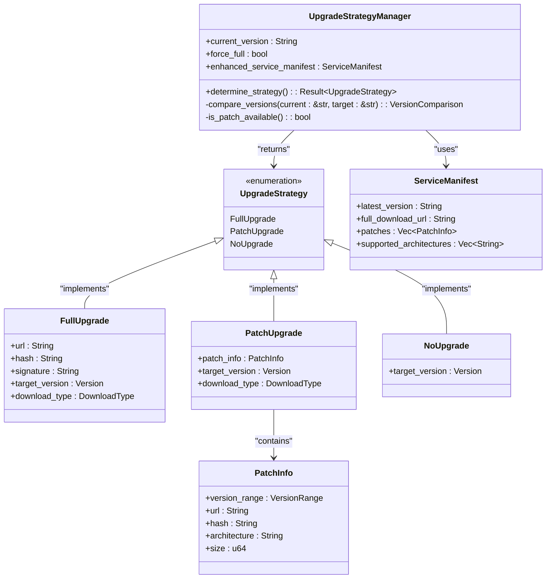
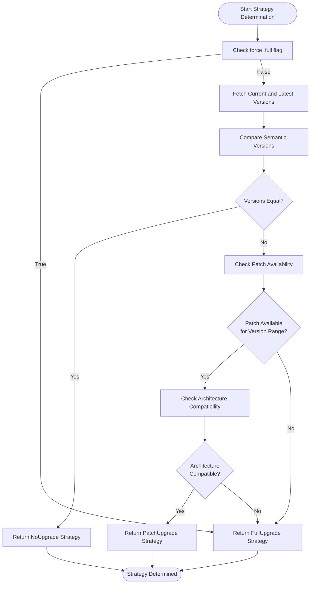
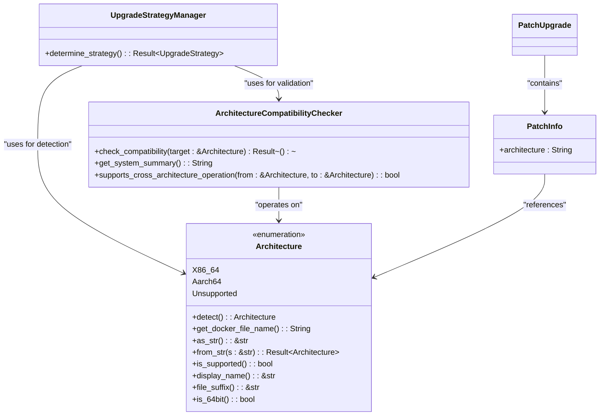
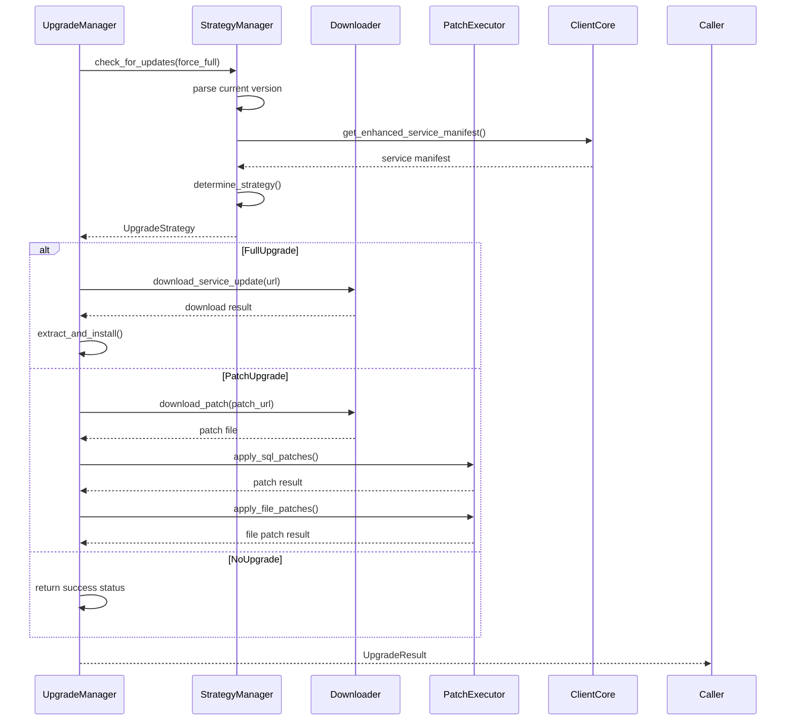
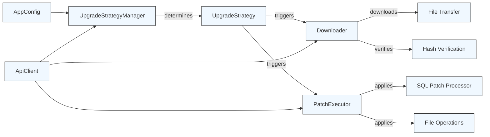
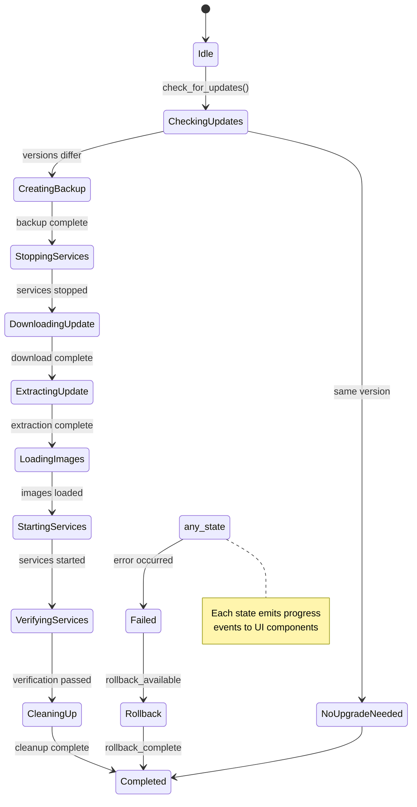
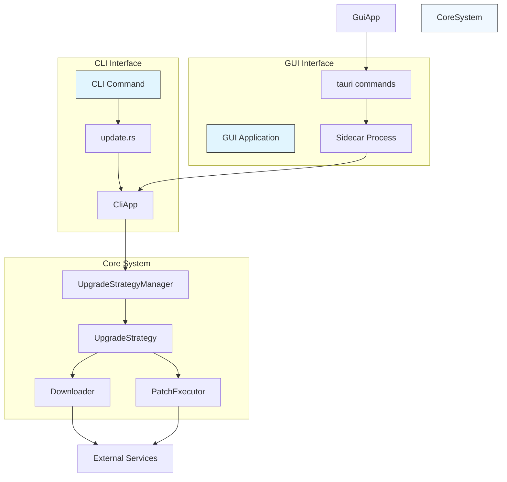

# Upgrade Strategy Implementation

<cite>
**Referenced Files in This Document**   
- [client-core/src/upgrade_strategy.rs](file://client-core/src/upgrade_strategy.rs)
- [client-core/src/upgrade.rs](file://client-core/src/upgrade.rs)
- [client-core/src/architecture.rs](file://client-core/src/architecture.rs)
- [client-core/src/downloader.rs](file://client-core/src/downloader.rs)
- [client-core/src/patch_executor/patch_processor.rs](file://client-core/src/patch_executor/patch_processor.rs)
- [nuwax-cli/src/commands/update.rs](file://nuwax-cli/src/commands/update.rs)
- [cli-ui/src-tauri/src/commands/cli.rs](file://cli-ui/src-tauri/src/commands/cli.rs)
</cite>

## Table of Contents
1. [Upgrade Strategy Overview](#upgrade-strategy-overview)
2. [Strategy Pattern Architecture](#strategy-pattern-architecture)
3. [Version Comparison and Decision Logic](#version-comparison-and-decision-logic)
4. [Architecture-Specific Patch Matching](#architecture-specific-patch-matching)
5. [Strategy Execution Workflows](#strategy-execution-workflows)
6. [Integration with Downloader and Patch Executor](#integration-with-downloader-and-patch-executor)
7. [Async Coordination and State Management](#async-coordination-and-state-management)
8. [CLI and GUI Interface Integration](#cli-and-gui-interface-integration)
9. [Error Handling and Rollback Preparation](#error-handling-and-rollback-preparation)

## Upgrade Strategy Overview

The upgrade strategy system in client-core implements a dynamic, context-aware approach to software updates using the Strategy design pattern. This system intelligently selects between three distinct upgrade approaches—FullUpgrade, PatchUpgrade, and NoUpgrade—based on version comparison, patch availability, and system architecture compatibility. The core objective is to optimize the upgrade process by minimizing bandwidth usage, reducing downtime, and ensuring compatibility across different hardware platforms.

The strategy selection process begins with version analysis, where the current installed version is compared against the latest available version from the remote service manifest. Based on semantic versioning rules and patch metadata availability, the system determines the most efficient upgrade path. For major or minor version changes without available patches, a FullUpgrade strategy is selected, which involves downloading complete Docker images. When patch files are available for the specific version transition, a PatchUpgrade strategy is employed to apply incremental changes. If the system is already running the latest version, the NoUpgrade strategy is returned, indicating that no action is required.

This flexible approach ensures that users receive timely updates while conserving network resources and maintaining system stability. The implementation is designed to be extensible, allowing for additional strategy types to be added in the future without modifying the core selection logic.

**Section sources**
- [client-core/src/upgrade_strategy.rs](file://client-core/src/upgrade_strategy.rs#L1-L200)
- [client-core/src/upgrade.rs](file://client-core/src/upgrade.rs#L1-L30)

## Strategy Pattern Architecture

The upgrade system implements the Strategy pattern through a clear separation between the strategy selection logic and the execution workflows. At the core of this architecture is the `UpgradeStrategy` enum, which defines the three possible upgrade approaches, and the `UpgradeStrategyManager` class that encapsulates the decision-making logic.



**Diagram sources**
- [client-core/src/upgrade_strategy.rs](file://client-core/src/upgrade_strategy.rs#L50-L150)

**Section sources**
- [client-core/src/upgrade_strategy.rs](file://client-core/src/upgrade_strategy.rs#L1-L200)

The `UpgradeStrategyManager` acts as the context in the Strategy pattern, responsible for evaluating the current system state and selecting the appropriate strategy. It takes as input the current version string, a flag indicating whether to force a full upgrade, and the enhanced service manifest containing information about available updates. The manager analyzes this data and returns the most appropriate `UpgradeStrategy` variant.

Each strategy variant contains the specific data required for its execution:
- `FullUpgrade` includes the download URL, cryptographic hash, digital signature, target version, and download type
- `PatchUpgrade` contains patch metadata and target version information
- `NoUpgrade` simply indicates the current target version

This architecture enables polymorphic behavior where the same interface can trigger different execution workflows based on the selected strategy, providing a clean separation between decision logic and implementation details.

## Version Comparison and Decision Logic

The decision logic in the upgrade strategy system follows a hierarchical evaluation process that considers multiple factors to determine the optimal upgrade path. The core decision algorithm is implemented in the `determine_strategy()` method of the `UpgradeStrategyManager` class.



**Diagram sources**
- [client-core/src/upgrade_strategy.rs](file://client-core/src/upgrade_strategy.rs#L150-L300)

**Section sources**
- [client-core/src/upgrade_strategy.rs](file://client-core/src/upgrade_strategy.rs#L150-L300)

The decision process begins by checking the `force_full` flag, which allows administrators to bypass incremental updates and always perform a complete reinstall. If this flag is not set, the system proceeds to compare the current version with the latest available version using semantic versioning rules.

Version comparison follows the standard major.minor.patch format, where:
- Major version changes (e.g., 1.x.x → 2.x.x) typically require a full upgrade
- Minor version changes (e.g., 1.2.x → 1.3.x) may be eligible for patch upgrades if patch files are available
- Patch version changes (e.g., 1.2.3 → 1.2.4) are ideal candidates for incremental updates

The system parses version strings using the `Version` struct from the `version.rs` module, which provides methods for comparing version components and determining the nature of the version change. After establishing that an upgrade is needed, the system checks the service manifest for available patch files that cover the specific version transition.

Architecture compatibility is verified using the `Architecture` enum and `ArchitectureCompatibilityChecker` from the architecture module, ensuring that patch files are compatible with the current system's hardware platform. Only when all conditions are met—version difference exists, patch is available for the version range, and architecture is compatible—does the system select the `PatchUpgrade` strategy. Otherwise, it falls back to `FullUpgrade` for comprehensive updates.

## Architecture-Specific Patch Matching

The upgrade system incorporates sophisticated architecture detection and compatibility checking to ensure that patches are applied only to compatible systems. This functionality is implemented in the `architecture.rs` module, which provides comprehensive support for cross-platform architecture detection and validation.



**Diagram sources**
- [client-core/src/architecture.rs](file://client-core/src/architecture.rs#L1-L100)

**Section sources**
- [client-core/src/architecture.rs](file://client-core/src/architecture.rs#L1-L200)

The `Architecture` enum defines the supported system architectures, currently including `X86_64` (Intel/AMD 64-bit) and `Aarch64` (ARM 64-bit). The detection mechanism uses Rust's standard library constant `std::env::consts::ARCH` to identify the current system architecture at runtime. This approach provides reliable detection across different operating systems and platforms.

The system supports multiple string representations for each architecture to accommodate variations in how architectures are named across different systems:
- `X86_64`: recognized as "x86_64", "amd64", or "x64"
- `Aarch64`: recognized as "aarch64", "arm64", or "armv8"

When evaluating patch availability, the upgrade strategy manager compares the target architecture specified in the patch metadata with the current system architecture. The `ArchitectureCompatibilityChecker` ensures that only compatible patches are applied, preventing potential system instability or binary incompatibility issues.

For each architecture, the system generates appropriate file names using the `get_docker_file_name()` method, which returns architecture-specific package names like "docker-x86_64.zip" or "docker-aarch64.zip". This allows the downloader to retrieve the correct binary distribution for the current platform.

The architecture system also provides user-friendly display names and comprehensive system summaries that include operating system, architecture, and 64-bit support information, which can be valuable for troubleshooting and user communication.

## Strategy Execution Workflows

Each upgrade strategy implements a distinct workflow tailored to its specific purpose, with the common goal of updating the system to the target version while maintaining data integrity and service availability.



**Diagram sources**
- [client-core/src/upgrade.rs](file://client-core/src/upgrade.rs#L1-L90)
- [client-core/src/downloader.rs](file://client-core/src/downloader.rs#L1-L50)
- [client-core/src/patch_executor/patch_processor.rs](file://client-core/src/patch_executor/patch_processor.rs#L1-L30)

**Section sources**
- [client-core/src/upgrade.rs](file://client-core/src/upgrade.rs#L1-L90)

The **FullUpgrade** workflow involves downloading complete Docker images and service packages. This strategy is used when:
- Major version changes occur
- No patch files are available for the version transition
- The `force_full` flag is set
- Architecture incompatibility prevents patch application

The process begins with downloading the complete service package from the specified URL, followed by extraction and installation of all components. This comprehensive approach ensures a clean, consistent state but requires more bandwidth and time.

The **PatchUpgrade** workflow applies incremental changes through SQL and file patches. This strategy is used for minor version updates when patch files are available. The process involves:
1. Downloading the patch package containing SQL migration scripts and file updates
2. Applying database schema changes using the SQL diff generator
3. Updating configuration files and other resources
4. Validating the integrity of applied changes

This incremental approach minimizes network usage and reduces downtime, making it ideal for frequent, small updates.

The **NoUpgrade** workflow simply confirms that the system is already running the latest version. This strategy returns immediately with a success status, avoiding unnecessary processing and network requests.

Each workflow includes comprehensive error handling and rollback preparation to ensure system stability even if the upgrade process is interrupted.

## Integration with Downloader and Patch Executor

The upgrade strategies integrate seamlessly with the downloader and patch executor modules through well-defined interfaces and dependency injection. This modular design ensures loose coupling between components while maintaining robust functionality.



**Diagram sources**
- [client-core/src/upgrade.rs](file://client-core/src/upgrade.rs#L1-L90)
- [client-core/src/downloader.rs](file://client-core/src/downloader.rs#L1-L100)
- [client-core/src/patch_executor/mod.rs](file://client-core/src/patch_executor/mod.rs#L1-L20)

**Section sources**
- [client-core/src/upgrade.rs](file://client-core/src/upgrade.rs#L1-L90)
- [client-core/src/downloader.rs](file://client-core/src/downloader.rs#L1-L100)
- [client-core/src/patch_executor/mod.rs](file://client-core/src/patch_executor/mod.rs#L1-L50)

The integration is facilitated through the `UpgradeManager` class, which holds references to the `ApiClient`, `AppConfig`, and other core services. When an upgrade is initiated, the manager uses the `ApiClient` to fetch the enhanced service manifest and determine the appropriate strategy.

For **FullUpgrade** operations, the system uses the downloader module to retrieve complete service packages. The downloader handles:
- HTTP/HTTPS downloads with progress tracking
- Integrity verification using cryptographic hashes
- Resume capability for interrupted downloads
- Bandwidth throttling and network error recovery

The code snippet below demonstrates how the CLI interface triggers a full upgrade:

```rust
// In nuwax-cli/src/commands/update.rs
match &upgrade_strategy {
    UpgradeStrategy::FullUpgrade { url, target_version, .. } => {
        let version_str = target_version.base_version_string();
        handle_service_download(
            app,
            url,
            target_version,
            download_dir,
            &version_str,
            "full"
        ).await?;
    }
    // ... other strategies
}
```

For **PatchUpgrade** operations, the system integrates with the patch executor module to apply incremental changes. The patch executor handles:
- SQL schema migrations using the sql_diff module
- File content updates and replacements
- Backup creation before applying changes
- Transactional execution to ensure atomicity
- Rollback procedures in case of failure

The integration ensures that both full and patch upgrades follow the same security and reliability standards, including signature verification, hash checking, and backup procedures.

## Async Coordination and State Management

The upgrade system leverages Tokio's async runtime to coordinate concurrent operations and manage complex state transitions during the upgrade process. This asynchronous design enables non-blocking I/O operations, progress reporting, and responsive user interfaces.



**Diagram sources**
- [client-core/src/upgrade.rs](file://client-core/src/upgrade.rs#L1-L90)
- [client-core/src/upgrade_strategy.rs](file://client-core/src/upgrade_strategy.rs#L1-L50)

**Section sources**
- [client-core/src/upgrade.rs](file://client-core/src/upgrade.rs#L1-L90)

The state machine model ensures that upgrades proceed through a well-defined sequence of steps, with each state representing a specific phase of the process. The `ProgressCallback` type, defined as `Box<dyn Fn(UpgradeStep, &str) + Send + Sync>`, allows the system to notify external components of progress updates.

Key async coordination features include:

1. **Non-blocking I/O**: Network operations and file I/O are performed asynchronously, preventing the main thread from being blocked during potentially long-running operations.

2. **Progress Reporting**: The system emits progress events at each stage, enabling real-time updates in both CLI and GUI interfaces.

3. **Error Recovery**: The async design allows for graceful handling of network interruptions and transient errors, with automatic retry mechanisms.

4. **Resource Management**: Async tasks are properly scoped and cleaned up, preventing resource leaks even if operations are cancelled.

The following code demonstrates the async coordination in the upgrade manager:

```rust
// In client-core/src/upgrade.rs
impl UpgradeManager {
    pub async fn check_for_updates(&self, force_full: bool) -> Result<UpgradeStrategy> {
        info!("Checking for service updates...");
        let current_version = &self.config.get_docker_versions();
        debug!("Current version: {}", current_version);
        
        let enhanced_service_manifest = self.api_client.get_enhanced_service_manifest().await?;
        
        let upgrade_strategy_manager = UpgradeStrategyManager::new(
            current_version.to_string(),
            force_full,
            enhanced_service_manifest,
        );
        
        let upgrade_strategy = upgrade_strategy_manager.determine_strategy()?;
        Ok(upgrade_strategy)
    }
}
```

This async method chains multiple operations—configuration retrieval, API calls, and strategy determination—while maintaining responsiveness and proper error handling.

## CLI and GUI Interface Integration

Both the CLI and GUI interfaces trigger the same underlying upgrade strategy selection process, ensuring consistent behavior across different user interaction methods. This unified approach simplifies maintenance and guarantees that users receive the same upgrade experience regardless of their preferred interface.



**Diagram sources**
- [nuwax-cli/src/commands/update.rs](file://nuwax-cli/src/commands/update.rs#L1-L160)
- [cli-ui/src-tauri/src/commands/cli.rs](file://cli-ui/src-tauri/src/commands/cli.rs#L1-L600)

**Section sources**
- [nuwax-cli/src/commands/update.rs](file://nuwax-cli/src/commands/update.rs#L1-L160)
- [cli-ui/src-tauri/src/commands/cli.rs](file://cli-ui/src-tauri/src/commands/cli.rs#L1-L600)

The **CLI interface** is implemented in `nuwax-cli/src/commands/update.rs`, where the `run_upgrade` function serves as the entry point. This function:
- Parses command-line arguments
- Creates the appropriate download directories
- Detects the current system architecture
- Invokes the upgrade manager to determine the strategy
- Executes the corresponding workflow based on the selected strategy

The **GUI interface** is implemented using Tauri in `cli-ui/src-tauri/src/commands/cli.rs`, which provides a bridge between the frontend and the backend CLI functionality. The GUI uses a hybrid execution strategy:
1. First attempting to use the sidecar process for better integration and security
2. Falling back to system commands if the sidecar is unavailable
3. Providing real-time output streaming to the user interface

Both interfaces share the same core logic through the `client-core` library, ensuring that:
- Version comparison uses identical algorithms
- Strategy selection follows the same decision tree
- Download and patch execution processes are consistent
- Error handling and reporting are uniform

This architecture allows developers to maintain a single source of truth for upgrade logic while providing flexible user interfaces. The following code snippet shows how the CLI interface handles different upgrade strategies:

```rust
// In nuwax-cli/src/commands/update.rs
match &upgrade_strategy {
    UpgradeStrategy::FullUpgrade { url, target_version, .. } => {
        info!("🔄 Full upgrade");
        info!("   Target version: {}", target_version);
        // Handle full upgrade download
    }
    UpgradeStrategy::PatchUpgrade { patch_info, target_version, .. } => {
        info!("🔄 Incremental upgrade");
        info!("   Current version: {}", current_version_str);
        info!("   Latest version: {}", target_version);
        // Handle patch download
    }
    UpgradeStrategy::NoUpgrade { target_version } => {
        info!("✅ Already on latest version");
    }
}
```

This consistent approach ensures that users receive the same upgrade experience whether they use the command line or the graphical interface.

## Error Handling and Rollback Preparation

The upgrade system implements comprehensive error handling and rollback preparation to ensure system stability and data integrity during the upgrade process. This robust approach minimizes the risk of system downtime and data loss.

The error handling strategy follows a multi-layered approach:

1. **Pre-upgrade validation**: Before any changes are made, the system verifies:
   - Network connectivity
   - Sufficient disk space
   - Service availability
   - Backup capability

2. **Atomic operations**: Critical operations are designed to be atomic, ensuring that partial updates do not leave the system in an inconsistent state.

3. **Comprehensive logging**: All operations are logged with appropriate severity levels, providing detailed information for troubleshooting.

4. **Graceful degradation**: When errors occur, the system attempts to recover or fail gracefully rather than crashing.

The rollback preparation process includes:

1. **Automated backups**: Before any upgrade operation, the system creates a backup of critical data and configuration files.

2. **Checkpointing**: The upgrade process establishes checkpoints at key stages, allowing for targeted rollback if needed.

3. **State tracking**: The system maintains detailed state information throughout the upgrade process.

4. **Recovery scripts**: Pre-generated recovery scripts are prepared in case manual intervention is required.

The `UpgradeResult` struct captures the outcome of the upgrade process:

```rust
pub struct UpgradeResult {
    pub success: bool,
    pub from_version: String,
    pub to_version: String,
    pub error: Option<String>,
    pub backup_id: Option<i64>,
}
```

This structure provides clear feedback on the upgrade outcome, including success status, version transition details, error information if applicable, and the backup identifier for recovery purposes.

The system also implements specific error handling for common failure scenarios:
- Network interruptions during downloads
- Disk space exhaustion
- Permission issues
- Service startup failures
- Database migration conflicts

Each error type triggers appropriate recovery procedures, such as retry mechanisms, alternative download sources, or graceful fallback to safer upgrade methods.

**Section sources**
- [client-core/src/upgrade.rs](file://client-core/src/upgrade.rs#L1-L90)
- [client-core/src/upgrade_strategy.rs](file://client-core/src/upgrade_strategy.rs#L1-L50)
- [nuwax-cli/src/commands/update.rs](file://nuwax-cli/src/commands/update.rs#L1-L160)