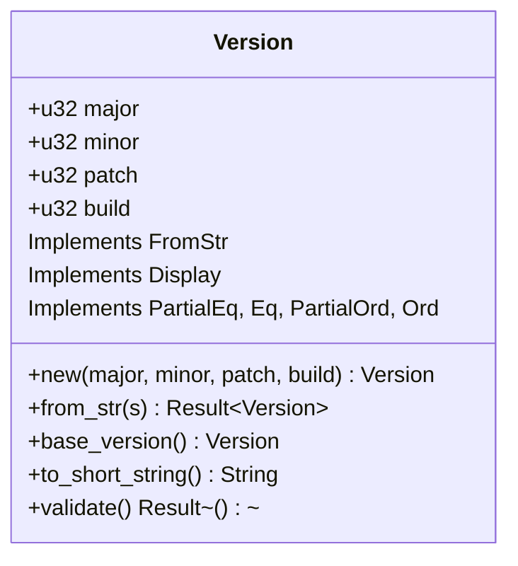
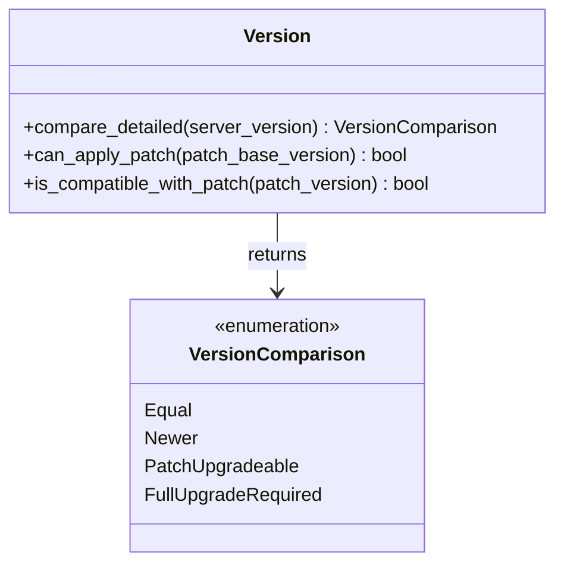
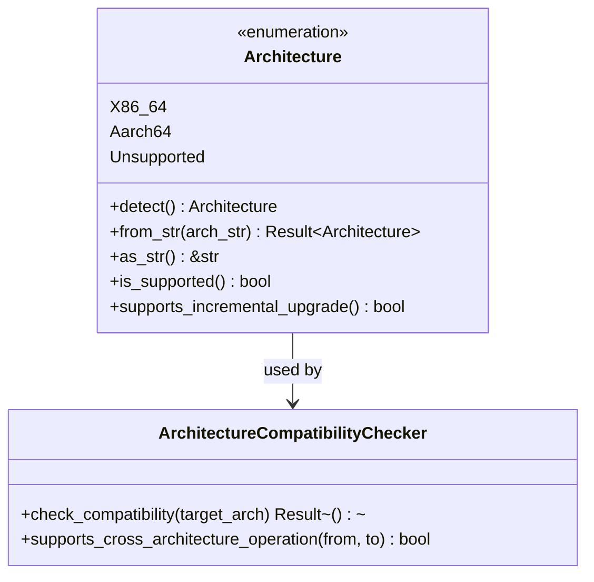
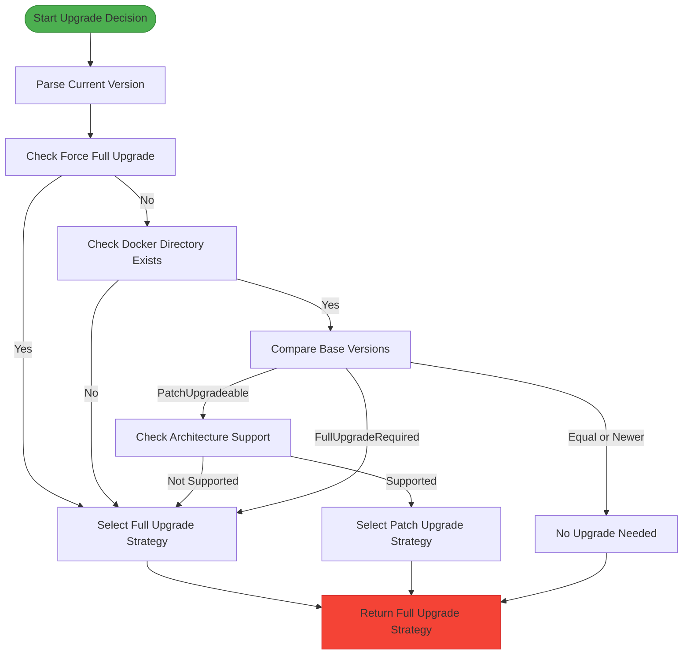

# Version Comparison Logic

<cite>
**Referenced Files in This Document**   
- [version.rs](file://client-core/src/version.rs)
- [upgrade_strategy.rs](file://client-core/src/upgrade_strategy.rs)
- [architecture.rs](file://client-core/src/architecture.rs)
</cite>

## Table of Contents
1. [Introduction](#introduction)
2. [Version Parsing and Structure](#version-parsing-and-structure)
3. [Version Comparison Logic](#version-comparison-logic)
4. [Architecture Handling in Upgrades](#architecture-handling-in-upgrades)
5. [Upgrade Strategy Decision Matrix](#upgrade-strategy-decision-matrix)
6. [Edge Cases and Validation](#edge-cases-and-validation)
7. [Debugging and Logging](#debugging-and-logging)

## Introduction
This document details the version comparison logic used to drive upgrade decisions in the Duck Client application. The system implements semantic versioning with support for major, minor, patch, and build numbers, enabling intelligent upgrade strategies that determine whether a full, patch, or no upgrade is required. The logic is implemented across multiple components, with the core version parsing and comparison in `version.rs`, upgrade strategy decisions in `upgrade_strategy.rs`, and architecture handling in `architecture.rs`. The system supports backward compatibility with legacy version formats and includes robust error handling for edge cases.

**Section sources**
- [version.rs](file://client-core/src/version.rs)
- [upgrade_strategy.rs](file://client-core/src/upgrade_strategy.rs)

## Version Parsing and Structure

The version management system is implemented in `version.rs` and provides a comprehensive solution for version parsing, comparison, and management. The core data structure is the `Version` struct, which supports four-segment version numbers in the format major.minor.patch.build.



**Diagram sources**
- [version.rs](file://client-core/src/version.rs#L36-L45)

The `Version` struct supports:
- **Four-segment version format**: major.minor.patch.build (e.g., 0.0.13.5)
- **Flexible parsing**: Accepts both three-segment (e.g., 1.2.3) and four-segment version strings
- **Semantic versioning**: Major, minor, and patch numbers follow standard semantic versioning principles
- **Build numbers**: The build segment represents patch levels or incremental updates

The parsing logic is implemented using the `winnow` parser combinator library and handles various input formats:

```rust
// Examples of supported version string formats
"0.0.13.5"  // Four-segment version
"1.2.3"     // Three-segment version (build defaults to 0)
"v0.0.13.5" // Version prefixed with 'v' or 'V'
```

The `from_str` method parses version strings and returns a `Result<Version, anyhow::Error>`, providing detailed error messages for invalid formats.

**Section sources**
- [version.rs](file://client-core/src/version.rs#L47-L105)

## Version Comparison Logic

The version comparison system implements a detailed decision matrix for upgrade eligibility through the `compare_detailed` method. This method returns a `VersionComparison` enum that determines the appropriate upgrade strategy.



**Diagram sources**
- [version.rs](file://client-core/src/version.rs#L208-L217)
- [version.rs](file://client-core/src/version.rs#L219-L263)

The `compare_detailed` method implements the following decision logic:

```rust
pub fn compare_detailed(&self, server_version: &Version) -> VersionComparison {
    if self == server_version {
        return VersionComparison::Equal;
    }

    // Compare base versions
    if self.can_apply_patch(server_version) {
        // Same base version, compare build level
        if self.build < server_version.build {
            VersionComparison::PatchUpgradeable
        } else {
            VersionComparison::Newer
        }
    } else {
        // Different base versions
        let self_base = self.base_version();
        let server_base = server_version.base_version();
        if self_base < server_base {
            VersionComparison::FullUpgradeRequired
        } else {
            VersionComparison::Newer
        }
    }
}
```

The decision matrix has four possible outcomes:
- **Equal**: Versions are identical, no upgrade needed
- **Newer**: Current version is newer than server version, no upgrade needed
- **PatchUpgradeable**: Same base version but higher build number available, patch upgrade possible
- **FullUpgradeRequired**: Different base versions, full upgrade required

The `base_version` method extracts the major.minor.patch components of a version, ignoring the build number:

```rust
pub fn base_version(&self) -> Version {
    Version::new_without_build(self.major, self.minor, self.patch)
}
```

This allows the system to determine if two versions share the same base, which is essential for patch applicability.

**Section sources**
- [version.rs](file://client-core/src/version.rs#L115-L130)
- [version.rs](file://client-core/src/version.rs#L219-L263)

## Architecture Handling in Upgrades

The system incorporates architecture awareness into the upgrade process through the `Architecture` enum and related components. This ensures that upgrades are compatible with the target system architecture.



**Diagram sources**
- [architecture.rs](file://client-core/src/architecture.rs#L44-L80)
- [architecture.rs](file://client-core/src/architecture.rs#L167-L218)

The `Architecture` enum supports:
- **X86_64**: Intel/AMD 64-bit architecture
- **Aarch64**: ARM 64-bit architecture
- **Unsupported**: Placeholder for unsupported architectures

The system automatically detects the current architecture using `std::env::consts::ARCH`:

```rust
pub fn detect() -> Self {
    let arch_str = std::env::consts::ARCH;
    Self::from_str(arch_str).unwrap_or_else(|_| {
        warn!("Detected unknown architecture: {}", arch_str);
        Self::Unsupported(arch_str.to_string())
    })
}
```

The architecture detection supports multiple string representations:
- **x86_64 variants**: "x86_64", "amd64", "x64"
- **aarch64 variants**: "aarch64", "arm64", "armv8"

The system is case-insensitive when parsing architecture strings and provides methods to convert between string representations and enum values.

**Section sources**
- [architecture.rs](file://client-core/src/architecture.rs#L82-L121)
- [architecture.rs](file://client-core/src/architecture.rs#L0-L44)

## Upgrade Strategy Decision Matrix

The upgrade strategy decision process is implemented in `upgrade_strategy.rs` and follows a comprehensive decision tree that considers version differences, architecture compatibility, and system state.



**Diagram sources**
- [upgrade_strategy.rs](file://client-core/src/upgrade_strategy.rs#L104-L199)

The decision process follows these steps:

1. **Parse current version**: Convert the current version string to a `Version` object
2. **Check force full flag**: If `force_full` is true, always select full upgrade
3. **Check Docker directory**: If the Docker directory or compose file doesn't exist, use full upgrade
4. **Compare versions**: Use `compare_detailed` to determine the version relationship
5. **Make decision**:
   - Equal or Newer: No upgrade needed
   - PatchUpgradeable: Check architecture support, then select patch or full upgrade
   - FullUpgradeRequired: Select full upgrade

The `UpgradeStrategyManager` orchestrates this decision process:

```rust
pub fn determine_strategy(&self) -> Result<UpgradeStrategy> {
    // 1. Parse current version
    let current_ver = self.current_version.parse::<Version>()?;
    
    // 2. Compare with server version
    let server_ver = self.manifest.version.clone();
    let base_comparison = current_ver.compare_detailed(&server_ver);
    
    // 3. Check force full upgrade
    if self.force_full {
        return self.select_full_upgrade_strategy();
    }
    
    // 4. Check Docker directory
    let work_dir = get_docker_work_dir();
    let compose_file_path = get_compose_file_path();
    if !work_dir.exists() || !compose_file_path.exists() {
        return self.select_full_upgrade_strategy();
    }
    
    // 5. Make decision based on comparison
    match base_comparison {
        VersionComparison::Equal | VersionComparison::Newer => {
            Ok(UpgradeStrategy::NoUpgrade {
                target_version: self.manifest.version.clone(),
            })
        }
        VersionComparison::PatchUpgradeable => {
            if !self.has_patch_for_architecture() {
                self.select_full_upgrade_strategy()
            } else {
                self.select_patch_upgrade_strategy()
            }
        }
        VersionComparison::FullUpgradeRequired => {
            self.select_full_upgrade_strategy()
        }
    }
}
```

The system supports three types of upgrade strategies:
- **FullUpgrade**: Complete replacement of the application
- **PatchUpgrade**: Incremental update with patch packages
- **NoUpgrade**: No action required

**Section sources**
- [upgrade_strategy.rs](file://client-core/src/upgrade_strategy.rs#L104-L199)

## Edge Cases and Validation

The version system includes comprehensive validation and error handling for edge cases and invalid inputs.

### Version Validation
The system validates version numbers to ensure they are within reasonable ranges:

```rust
pub fn validate(&self) -> Result<()> {
    if self.major > 999 || self.minor > 999 || self.patch > 999 || self.build > 9999 {
        return Err(anyhow::anyhow!("Version number too large, may not be valid"));
    }
    Ok(())
}
```

This prevents overflow issues and ensures version numbers remain manageable.

### Parsing Edge Cases
The system handles various parsing edge cases:

```rust
// Valid cases
assert!(Version::from_str("0.0.13.5").is_ok());  // Four-segment
assert!(Version::from_str("1.2.3").is_ok());     // Three-segment
assert!(Version::from_str("v0.0.13.5").is_ok()); // Prefixed with 'v'

// Invalid cases
assert!(Version::from_str("1.2").is_err());      // Too few segments
assert!(Version::from_str("1.2.3.4.5").is_err()); // Too many segments
assert!(Version::from_str("").is_err());         // Empty string
assert!(Version::from_str("a.b.c").is_err());    // Non-numeric
```

### Architecture Edge Cases
The architecture system handles edge cases such as unknown architectures:

```rust
pub fn detect() -> Self {
    let arch_str = std::env::consts::ARCH;
    Self::from_str(arch_str).unwrap_or_else(|_| {
        warn!("Detected unknown architecture: {}", arch_str);
        Self::Unsupported(arch_str.to_string())
    })
}
```

When an unknown architecture is detected, it's wrapped in the `Unsupported` variant with a warning message.

### Backward Compatibility
The system maintains backward compatibility with legacy version formats:
- Three-segment versions (major.minor.patch) are supported, with build defaulting to 0
- Version strings prefixed with 'v' or 'V' are accepted
- Case-insensitive architecture string parsing

**Section sources**
- [version.rs](file://client-core/src/version.rs#L171-L217)
- [version.rs](file://client-core/src/version.rs#L261-L308)
- [architecture.rs](file://client-core/src/architecture.rs#L82-L121)

## Debugging and Logging

The system includes comprehensive logging and debugging capabilities to aid in troubleshooting version mismatch issues.

### Logging Best Practices
The upgrade process includes detailed logging at each decision point:

```rust
info!("🔍 Starting upgrade strategy decision");
info!("   Current version: {}", self.current_version);
info!("   Server version: {}", self.manifest.version);
info!("   Target architecture: {}", self.architecture.as_str());
info!("   Force full: {}", self.force_full);
info!("📊 Current version details: {:?}", current_ver);
info!("📊 Server version details: {:?}", server_ver);
info!("📊 Base version comparison result: {:?}", base_comparison);
```

This provides a clear audit trail of the decision process.

### Debugging Tips for Version Mismatch Issues
When encountering version mismatch issues, consider the following:

1. **Check version string format**: Ensure version strings follow the expected format (major.minor.patch.build)
2. **Verify architecture compatibility**: Confirm that the target architecture is supported
3. **Examine build numbers**: Remember that build numbers affect patch applicability
4. **Review logs**: Check the detailed logs for decision process information
5. **Validate input**: Use the `validate()` method to check version number ranges

### Common Issues and Solutions
- **Issue**: "Version number too large" error
  - **Solution**: Ensure version components are within valid ranges (major/minor/patch ≤ 999, build ≤ 9999)

- **Issue**: "Unsupported architecture" error
  - **Solution**: Verify the system architecture is x86_64 or aarch64

- **Issue**: Unexpected full upgrade when patch should be available
  - **Solution**: Check that the base versions match and the architecture supports incremental upgrades

The system's comprehensive test suite provides additional confidence in the version comparison logic:

```rust
#[test]
fn test_detailed_comparison() {
    let current = Version::from_str("0.0.13.2").unwrap();
    
    // Same version
    let same = Version::from_str("0.0.13.2").unwrap();
    assert_eq!(current.compare_detailed(&same), VersionComparison::Equal);
    
    // Patch upgrade
    let patch_upgrade = Version::from_str("0.0.13.5").unwrap();
    assert_eq!(current.compare_detailed(&patch_upgrade), VersionComparison::PatchUpgradeable);
    
    // Full upgrade
    let full_upgrade = Version::from_str("0.0.14.0").unwrap();
    assert_eq!(current.compare_detailed(&full_upgrade), VersionComparison::FullUpgradeRequired);
    
    // Current version newer
    let older = Version::from_str("0.0.12.0").unwrap();
    assert_eq!(current.compare_detailed(&older), VersionComparison::Newer);
}
```

**Section sources**
- [upgrade_strategy.rs](file://client-core/src/upgrade_strategy.rs#L104-L199)
- [version.rs](file://client-core/src/version.rs#L345-L383)