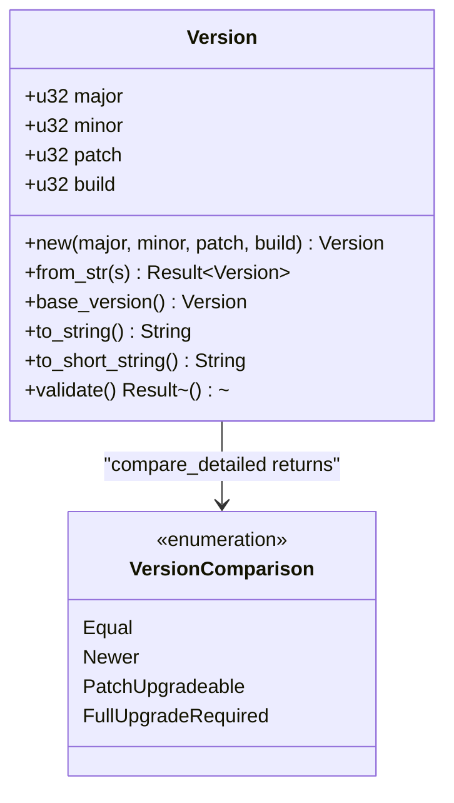
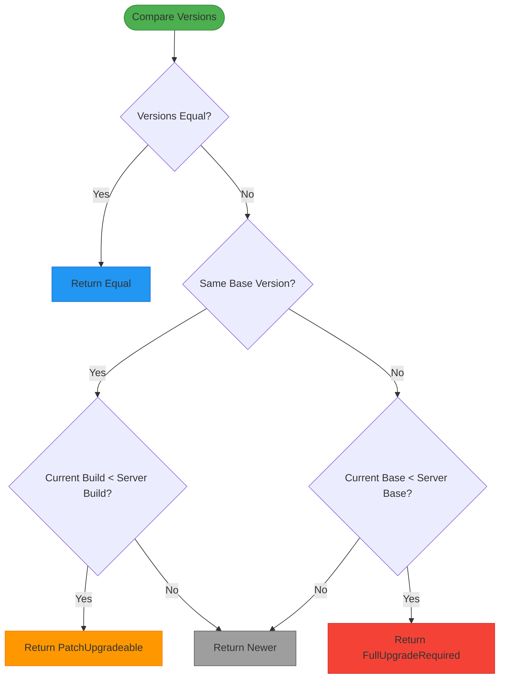
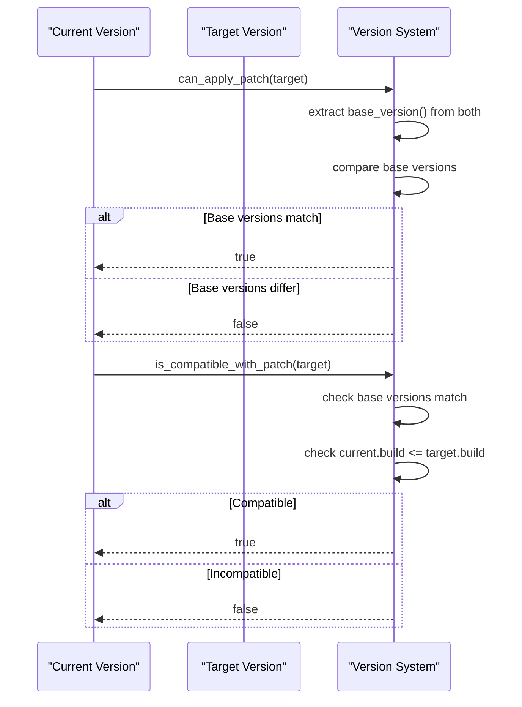

# Version Management System

<cite>
**Referenced Files in This Document**   
- [version.rs](file://client-core/src/version.rs#L0-L410)
- [upgrade_strategy.rs](file://client-core/src/upgrade_strategy.rs#L0-L463)
- [api_types.rs](file://client-core/src/api_types.rs#L0-L902)
</cite>

## Table of Contents
1. [Introduction](#introduction)
2. [Version Structure and Parsing](#version-structure-and-parsing)
3. [Version Comparison and Ordering](#version-comparison-and-ordering)
4. [Patch Upgrade Eligibility](#patch-upgrade-eligibility)
5. [Integration with Upgrade Strategy](#integration-with-upgrade-strategy)
6. [Version Validation and Constraints](#version-validation-and-constraints)
7. [Serialization and API Integration](#serialization-and-api-integration)
8. [Edge Cases and Error Handling](#edge-cases-and-error-handling)

## Introduction

The Version Management System is a core component of the duck_client application responsible for intelligent upgrade decisions through a robust semantic versioning model. This system enables the client to determine whether a full upgrade or a patch upgrade is appropriate based on version compatibility, architecture, and system state. The implementation centers around the `Version` struct in version.rs, which follows a four-segment semantic versioning scheme (major.minor.patch.build) to support fine-grained upgrade decisions.

The system integrates with the upgrade strategy module to make intelligent decisions about update applicability, ensuring backward compatibility while minimizing download sizes and downtime. It supports parsing from various string formats, detailed version comparisons, and validation of version constraints. The design emphasizes backward compatibility with existing three-segment version formats while extending functionality to support build-level patching.

**Section sources**
- [version.rs](file://client-core/src/version.rs#L0-L410)

## Version Structure and Parsing

The Version Management System implements a four-segment semantic versioning model (major.minor.patch.build) that extends traditional semantic versioning with an additional build segment for incremental patch tracking. This structure enables the system to distinguish between full releases and incremental patches within the same base version.



**Diagram sources**
- [version.rs](file://client-core/src/version.rs#L36-L217)

The `Version` struct contains four unsigned 32-bit integer fields representing the version segments. The system supports parsing from string representations through the `FromStr` trait implementation, accommodating various input formats:

- Four-segment format: "0.0.13.5" → Version { major: 0, minor: 0, patch: 13, build: 5 }
- Three-segment format: "1.2.3" → Version { major: 1, minor: 2, patch: 3, build: 0 }
- Optional "v" prefix: "v0.0.13.5" or "V0.0.13.2"

The parsing logic uses the winnow parser combinator library to process input strings, handling optional "v/V" prefixes and validating numeric components. The parser ensures complete consumption of input, rejecting strings with trailing characters after the version number. For three-segment inputs, the build component defaults to zero, maintaining backward compatibility with systems that don't utilize build-level patching.

```rust
// Example parsing scenarios
let v1 = Version::from_str("0.0.13.5").unwrap(); // Four-segment with build level
let v2 = Version::from_str("1.2.3").unwrap();    // Three-segment (build defaults to 0)
let v3 = Version::from_str("v0.1.2").unwrap();   // With "v" prefix
```

**Section sources**
- [version.rs](file://client-core/src/version.rs#L38-L87)
- [version.rs](file://client-core/src/version.rs#L89-L129)

## Version Comparison and Ordering

The Version Management System implements comprehensive comparison logic that follows semantic versioning principles with extensions for build-level patching. The system supports both standard comparison operators (>, <, ==) through trait implementations and a detailed comparison method that informs upgrade decisions.



**Diagram sources**
- [version.rs](file://client-core/src/version.rs#L219-L263)

The comparison hierarchy follows the standard semantic versioning order: major → minor → patch → build. When comparing two versions, the system first compares major versions, then minor if major is equal, then patch if minor is equal, and finally build if patch is equal. This ordering enables natural sorting of versions and supports range validation.

The `compare_detailed` method returns a `VersionComparison` enum that provides context-specific information for upgrade decisions:
- `Equal`: Versions are identical
- `Newer`: Current version is equal or newer than the target
- `PatchUpgradeable`: Same base version with higher build available
- `FullUpgradeRequired`: Different base version requires full upgrade

This detailed comparison enables the upgrade strategy module to make intelligent decisions about the appropriate upgrade path without duplicating version logic.

**Section sources**
- [version.rs](file://client-core/src/version.rs#L261-L308)
- [version.rs](file://client-core/src/version.rs#L305-L343)

## Patch Upgrade Eligibility

The system implements sophisticated patch eligibility rules that determine when incremental patches can be applied versus when a full upgrade is required. The key concept is the "base version," which consists of the major, minor, and patch segments, excluding the build number.



**Diagram sources**
- [version.rs](file://client-core/src/version.rs#L131-L169)

The `can_apply_patch` method determines whether a patch can be applied by comparing the base versions of the current and target versions. A patch can only be applied when the base versions are identical, ensuring that incremental changes are applied within the same release series.

The `is_compatible_with_patch` method adds an additional constraint: not only must the base versions match, but the current build level must be less than or equal to the target build level. This prevents downgrades and ensures that patches are applied in the correct sequence.

```rust
// Example patch eligibility scenarios
let current = Version::from_str("0.0.13.2").unwrap();
let patch_target = Version::from_str("0.0.13.0").unwrap();
let different_base = Version::from_str("0.0.14.0").unwrap();

assert!(current.can_apply_patch(&patch_target));           // Same base version
assert!(!current.can_apply_patch(&different_base));        // Different base version
assert!(current.is_compatible_with_patch(&Version::from_str("0.0.13.5").unwrap()));  // Higher build
assert!(!current.is_compatible_with_patch(&Version::from_str("0.0.13.1").unwrap())); // Lower build
```

These methods enable the system to validate version ranges against available updates, ensuring that only appropriate patches are offered to users.

**Section sources**
- [version.rs](file://client-core/src/version.rs#L131-L169)
- [version.rs](file://client-core/src/version.rs#L345-L383)

## Integration with Upgrade Strategy

The Version Management System integrates closely with the upgrade strategy module to determine the appropriate upgrade path based on version comparison, system architecture, and deployment state. The `UpgradeStrategyManager` uses version comparisons to decide between full upgrades, patch upgrades, or no upgrade.

```mermaid
graph TD
A[Start Upgrade Decision] --> B[Parse Current Version]
B --> C[Parse Server Version]
C --> D[compare_detailed()]
D --> E{Comparison Result}
E --> |Equal or Newer| F[NoUpgrade]
E --> |PatchUpgradeable| G{Has Patch for Architecture?}
G --> |Yes| H[Select PatchUpgrade]
G --> |No| I[Select FullUpgrade]
E --> |FullUpgradeRequired| I
I --> J[Check Force Full Flag]
J --> |True| K[Force FullUpgrade]
J --> |False| L[Check Docker Directory]
L --> |Missing| K
L --> |Exists| M[Return Strategy]
style F fill:#4CAF50
style H fill:#FF9800
style K fill:#F44336
```

**Diagram sources**
- [upgrade_strategy.rs](file://client-core/src/upgrade_strategy.rs#L154-L170)

The upgrade decision process follows these steps:
1. Parse the current client version and server manifest version
2. Perform detailed version comparison using `compare_detailed`
3. Handle special cases (force full upgrade, missing docker directory)
4. Select appropriate strategy based on comparison result and system state

When the comparison returns `PatchUpgradeable`, the system checks whether a patch package exists for the current architecture before selecting the patch upgrade strategy. If no patch is available, it falls back to a full upgrade. For `FullUpgradeRequired`, a full upgrade is always selected, as the base version has changed.

The system also considers external factors such as the presence of the docker directory and compose file. If these are missing, it defaults to a full upgrade strategy to ensure a complete installation.

**Section sources**
- [upgrade_strategy.rs](file://client-core/src/upgrade_strategy.rs#L0-L463)

## Version Validation and Constraints

The Version Management System includes validation rules to ensure version integrity and prevent invalid version numbers. The `validate` method checks that version components fall within reasonable ranges to prevent overflow and ensure compatibility with display and storage systems.

```rust
/// 验证版本号格式的有效性
pub fn validate(&self) -> Result<()> {
    // 通常版本号各部分都应该在合理范围内
    if self.major > 999 || self.minor > 999 || self.patch > 999 || self.build > 9999 {
        return Err(anyhow::anyhow!("版本号数值过大，可能不是有效的版本号"));
    }
    Ok(())
}
```

The validation rules impose the following constraints:
- Major, minor, and patch versions must be ≤ 999
- Build version must be ≤ 9999
- Version strings cannot be empty
- Input must be fully consumed during parsing (no trailing characters)

These constraints prevent common errors such as accidentally using timestamps or other large numbers as version components. The system also handles various edge cases in parsing, including invalid formats like "1.2" (too few segments) or "1.2.3.4.5" (too many segments).

The `base_version_string` method provides a string representation of the base version (major.minor.patch) for use in display and logging, while `to_short_string` omits the build component when it is zero, providing a cleaner display for base versions.

**Section sources**
- [version.rs](file://client-core/src/version.rs#L171-L217)
- [version.rs](file://client-core/src/version.rs#L381-L408)

## Serialization and API Integration

The Version Management System integrates with JSON serialization through Serde to support version transmission across API boundaries. The `version_from_str` deserialization function enables parsing of version strings directly from JSON payloads, ensuring consistent version handling throughout the system.

```rust
/// 版本号 serde 反序列化
pub fn version_from_str<'de, D>(deserializer: D) -> std::result::Result<Version, D::Error>
where
    D: Deserializer<'de>,
{
    let s = String::deserialize(deserializer)?;
    Version::from_str(&s).map_err(serde::de::Error::custom)
}
```

This deserialization function is used in the `EnhancedServiceManifest` struct in api_types.rs, where the version field is annotated with `#[serde(deserialize_with = "crate::version::version_from_str")]` to ensure proper parsing from string format in JSON responses.

The system stores version data locally for state tracking in several contexts:
- Current client version in configuration
- Last known server version in cache
- Upgrade history records
- Manifest version information

The `Display` trait implementation ensures consistent string formatting across the application, while the `PartialOrd` and `Ord` trait implementations enable sorting of version collections for display and processing.

**Section sources**
- [version.rs](file://client-core/src/version.rs#L219-L217)
- [api_types.rs](file://client-core/src/api_types.rs#L0-L902)

## Edge Cases and Error Handling

The Version Management System handles several edge cases and potential error conditions to ensure robust operation in production environments:

1. **Invalid version formats**: The parser rejects strings that don't conform to the expected format, including those with too few or too many segments, non-numeric components, or trailing characters after valid version text.

2. **Empty strings**: Version strings cannot be empty, and an appropriate error is returned when attempting to parse an empty string.

3. **Version overflow**: The validation method checks for unreasonably large version numbers that might indicate data corruption or misuse.

4. **Downgrade prevention**: The comparison logic correctly identifies when the current version is newer than the target, preventing accidental downgrades.

5. **Missing components**: The system gracefully handles the absence of patch packages for certain architectures by falling back to full upgrades.

6. **Missing deployment state**: When docker directories or compose files are missing, the system defaults to full upgrades to ensure a complete installation.

The test suite includes comprehensive coverage of these edge cases, with specific tests for invalid formats, version comparisons, and upgrade decision logic. The acceptance criteria test in version.rs verifies that all core functionality works as expected, providing confidence in the system's reliability.

**Section sources**
- [version.rs](file://client-core/src/version.rs#L261-L408)
- [upgrade_strategy.rs](file://client-core/src/upgrade_strategy.rs#L0-L463)