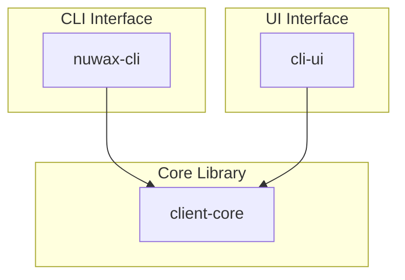
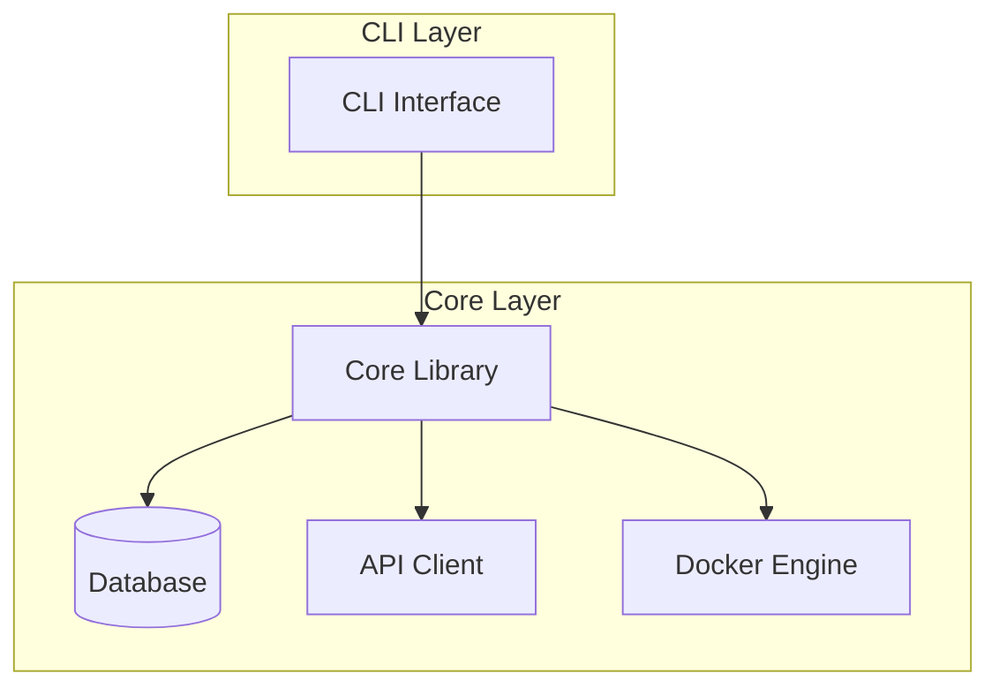
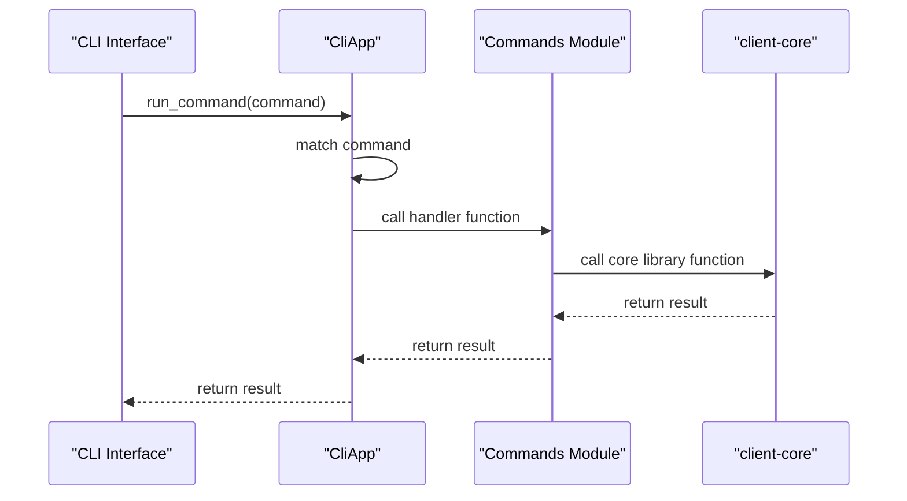
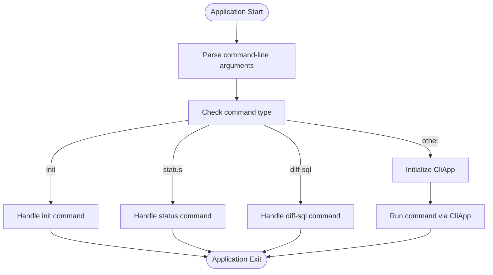
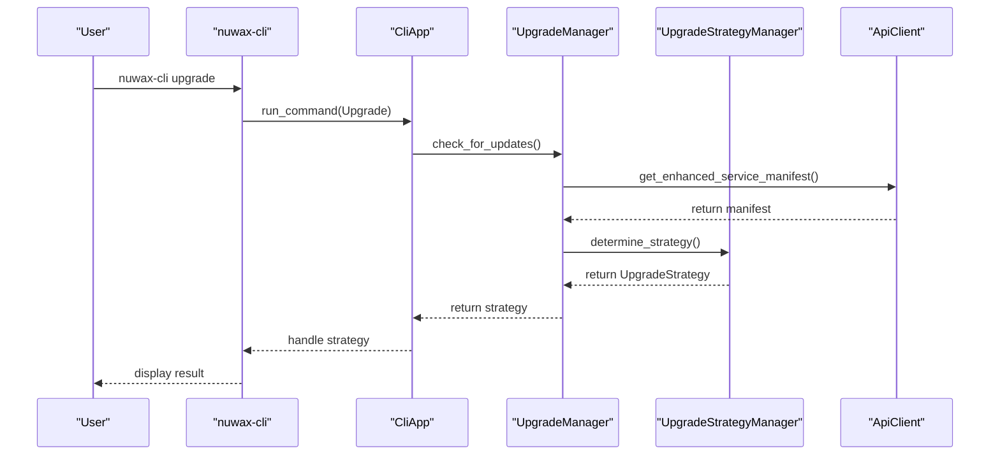
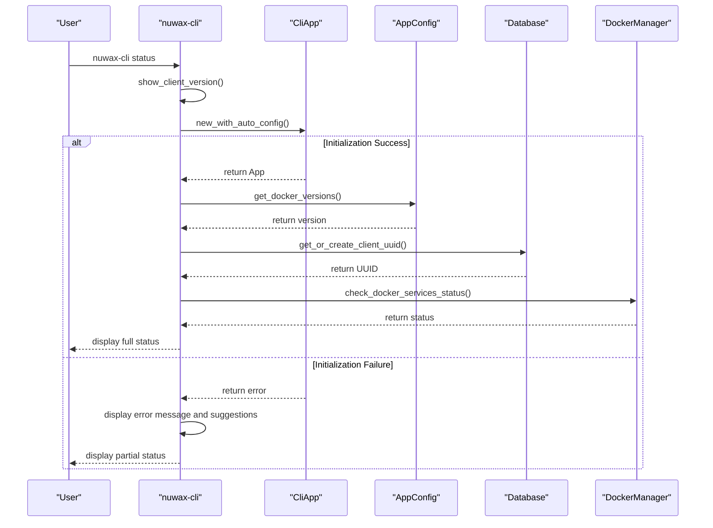
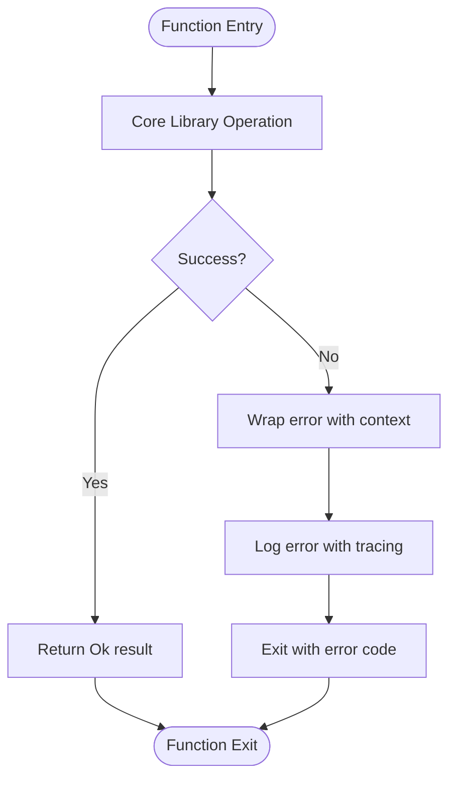
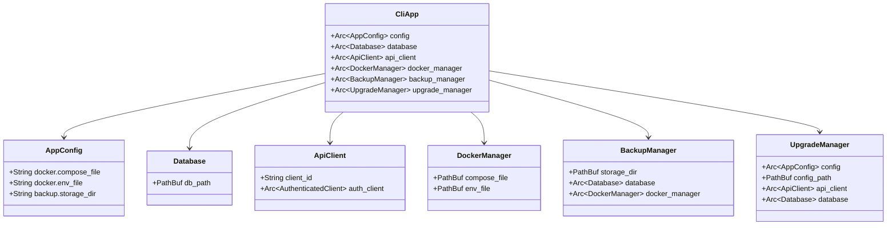

# CLI to Core Integration

<cite>
**Referenced Files in This Document**   
- [nuwax-cli/Cargo.toml](file://nuwax-cli/Cargo.toml#L1-L118)
- [nuwax-cli/src/main.rs](file://nuwax-cli/src/main.rs#L1-L103)
- [nuwax-cli/src/lib.rs](file://nuwax-cli/src/lib.rs#L1-L28)
- [nuwax-cli/src/app.rs](file://nuwax-cli/src/app.rs#L1-L147)
- [nuwax-cli/src/commands/update.rs](file://nuwax-cli/src/commands/update.rs#L1-L162)
- [nuwax-cli/src/commands/status.rs](file://nuwax-cli/src/commands/status.rs#L1-L139)
- [nuwax-cli/src/commands/mod.rs](file://nuwax-cli/src/commands/mod.rs#L1-L41)
- [client-core/src/upgrade.rs](file://client-core/src/upgrade.rs#L1-L90)
- [client-core/src/upgrade_strategy.rs](file://client-core/src/upgrade_strategy.rs#L1-L463)
- [client-core/src/version.rs](file://client-core/src/version.rs#L1-L263)
</cite>

## Table of Contents
1. [Introduction](#introduction)
2. [Project Structure](#project-structure)
3. [Core Components](#core-components)
4. [Architecture Overview](#architecture-overview)
5. [Detailed Component Analysis](#detailed-component-analysis)
6. [Command Initialization and Argument Parsing](#command-initialization-and-argument-parsing)
7. [Integration of Update and Status Commands](#integration-of-update-and-status-commands)
8. [Error Handling and Logging](#error-handling-and-logging)
9. [Configuration and Dependency Sharing](#configuration-and-dependency-sharing)
10. [Best Practices for Extending CLI Functionality](#best-practices-for-extending-cli-functionality)

## Introduction
This document provides a comprehensive analysis of the integration between the `nuwax-cli` command-line interface and the shared `client-core` library. It details how the CLI leverages the core library for service management, upgrades, and configuration operations. The analysis covers command initialization, argument parsing with Clap, delegation to core functions, error propagation, logging integration, and configuration sharing. The document also provides best practices for extending CLI functionality while maintaining a clean separation from core logic.

**Section sources**
- [nuwax-cli/Cargo.toml](file://nuwax-cli/Cargo.toml#L1-L118)

## Project Structure
The project structure reveals a modular architecture with three main components: `cli-ui` for the graphical interface, `client-core` for shared business logic, and `nuwax-cli` for the command-line interface. The `nuwax-cli` component acts as a client that depends on `client-core` to access core functionality. This separation allows for independent development and testing of the CLI interface and the underlying business logic.

**Diagram sources**
- [nuwax-cli/Cargo.toml](file://nuwax-cli/Cargo.toml#L1-L118)
- [client-core/Cargo.toml](file://client-core/Cargo.toml#L1-L10)

## Core Components
The core components of the CLI to Core integration are the `nuwax-cli` binary and the `client-core` library. The `nuwax-cli` component is responsible for parsing command-line arguments, handling user input, and presenting output. The `client-core` library provides the business logic for service management, upgrades, and configuration operations. The integration between these components is facilitated through a well-defined API that allows the CLI to delegate complex operations to the core library.

**Section sources**
- [nuwax-cli/Cargo.toml](file://nuwax-cli/Cargo.toml#L1-L118)
- [client-core/Cargo.toml](file://client-core/Cargo.toml#L1-L10)

## Architecture Overview
The architecture of the CLI to Core integration follows a layered pattern where the CLI acts as a thin client that delegates business logic to the core library. The CLI is responsible for command-line argument parsing, user interaction, and output formatting, while the core library handles the actual implementation of service management, upgrades, and configuration operations.

**Diagram sources**
- [nuwax-cli/src/main.rs](file://nuwax-cli/src/main.rs#L1-L103)
- [nuwax-cli/src/app.rs](file://nuwax-cli/src/app.rs#L1-L147)
- [client-core/src/lib.rs](file://client-core/src/lib.rs#L1-L10)

## Detailed Component Analysis

### CLI Application Structure
The `CliApp` struct in `nuwax-cli` serves as the main entry point for delegating commands to the core library. It encapsulates various managers from `client-core` such as `AppConfig`, `Database`, `ApiClient`, `DockerManager`, `BackupManager`, and `UpgradeManager`. These components are initialized in the `new_with_auto_config` method and stored as `Arc`-wrapped instances to enable shared ownership across asynchronous tasks.

```mermaid
classDiagram
class CliApp {
+Arc~AppConfig~ config
+Arc~Database~ database
+Arc~ApiClient~ api_client
+Arc~AuthenticatedClient~ authenticated_client
+Arc~DockerManager~ docker_manager
+Arc~BackupManager~ backup_manager
+Arc~UpgradeManager~ upgrade_manager
+new_with_auto_config() Result~Self~
+run_command(command : Commands) Result~()~
}
class AppConfig {
+String docker.compose_file
+String docker.env_file
+String backup.storage_dir
+get_docker_versions() String
+get_download_dir() PathBuf
}
class Database {
+connect(path : &Path) Result~Self~
+is_database_initialized() Result~bool~
+get_api_client_id() Result~String~
+get_or_create_client_uuid() Result~String~
}
class ApiClient {
+new(client_id : String, auth_client : Option~AuthenticatedClient~) Self
+get_enhanced_service_manifest() Result~EnhancedServiceManifest~
+download_service_update_optimized(path : &Path, version : Option~&str~, url : &str) Result~()~
}
class DockerManager {
+new(compose_file : PathBuf, env_file : PathBuf) Result~Self~
}
class BackupManager {
+new(storage_dir : PathBuf, database : Arc~Database~, docker_manager : Arc~DockerManager~) Result~Self~
}
class UpgradeManager {
+new(config : Arc~AppConfig~, config_path : PathBuf, api_client : Arc~ApiClient~, database : Arc~Database~) Self
+check_for_updates(force_full : bool) Result~UpgradeStrategy~
}
CliApp --> AppConfig : "uses"
CliApp --> Database : "uses"
CliApp --> ApiClient : "uses"
CliApp --> DockerManager : "uses"
CliApp --> BackupManager : "uses"
CliApp --> UpgradeManager : "uses"
```

**Diagram sources**
- [nuwax-cli/src/app.rs](file://nuwax-cli/src/app.rs#L1-L147)
- [client-core/src/config.rs](file://client-core/src/config.rs#L1-L50)
- [client-core/src/database.rs](file://client-core/src/database.rs#L1-L50)
- [client-core/src/api.rs](file://client-core/src/api.rs#L1-L50)
- [client-core/src/container/mod.rs](file://client-core/src/container/mod.rs#L1-L50)
- [client-core/src/backup.rs](file://client-core/src/backup.rs#L1-L50)
- [client-core/src/upgrade.rs](file://client-core/src/upgrade.rs#L1-L90)

### Command Delegation Pattern
The `run_command` method in `CliApp` implements a command delegation pattern where CLI commands are matched and delegated to appropriate handler functions. This pattern ensures a clean separation between command parsing and business logic execution. Each command is handled by a dedicated function in the `commands` module, which interacts with the appropriate core components.

**Diagram sources**
- [nuwax-cli/src/app.rs](file://nuwax-cli/src/app.rs#L1-L147)
- [nuwax-cli/src/commands/mod.rs](file://nuwax-cli/src/commands/mod.rs#L1-L41)

## Command Initialization and Argument Parsing
The command initialization process begins in `main.rs` where the `Cli::parse()` method from Clap is used to parse command-line arguments. The parsed arguments are then used to determine the appropriate command flow. Special commands like `init`, `status`, and `diff-sql` are handled directly in the main function, while other commands require application initialization through `CliApp::new_with_auto_config()`.

**Diagram sources**
- [nuwax-cli/src/main.rs](file://nuwax-cli/src/main.rs#L1-L103)

**Section sources**
- [nuwax-cli/src/main.rs](file://nuwax-cli/src/main.rs#L1-L103)

## Integration of Update and Status Commands

### Update Command Integration
The `update` command integration demonstrates how CLI inputs are transformed into core library function calls. When the user runs `nuwax-cli upgrade`, the CLI parses the arguments into `UpgradeArgs` and calls `run_upgrade` with a mutable reference to `CliApp`. The `run_upgrade` function then uses the `upgrade_manager` from `CliApp` to check for updates by calling `check_for_updates()` on the core library.

**Diagram sources**
- [nuwax-cli/src/commands/update.rs](file://nuwax-cli/src/commands/update.rs#L1-L162)
- [client-core/src/upgrade.rs](file://client-core/src/upgrade.rs#L1-L90)
- [client-core/src/upgrade_strategy.rs](file://client-core/src/upgrade_strategy.rs#L1-L463)

**Section sources**
- [nuwax-cli/src/commands/update.rs](file://nuwax-cli/src/commands/update.rs#L1-L162)
- [client-core/src/upgrade.rs](file://client-core/src/upgrade.rs#L1-L90)
- [client-core/src/upgrade_strategy.rs](file://client-core/src/upgrade_strategy.rs#L1-L463)

### Status Command Integration
The `status` command integration shows a different pattern where the command can be executed even if the application fails to initialize completely. This is achieved by first displaying basic client version information and then attempting to initialize `CliApp` for detailed status information. The `run_status_details` function retrieves information from multiple core components including configuration, database, and Docker manager.

**Diagram sources**
- [nuwax-cli/src/commands/status.rs](file://nuwax-cli/src/commands/status.rs#L1-L139)
- [nuwax-cli/src/app.rs](file://nuwax-cli/src/app.rs#L1-L147)

**Section sources**
- [nuwax-cli/src/commands/status.rs](file://nuwax-cli/src/commands/status.rs#L1-L139)

## Error Handling and Logging
Error handling in the CLI to Core integration follows a consistent pattern where errors are propagated from the core library to the CLI interface. The CLI uses `anyhow::Result` for error handling and `tracing` for logging. Errors from the core library are typically wrapped in `anyhow::Error` and may contain additional context. The CLI handles these errors by logging them with appropriate severity levels and exiting with a non-zero status code.

**Diagram sources**
- [nuwax-cli/src/main.rs](file://nuwax-cli/src/main.rs#L1-L103)
- [nuwax-cli/src/app.rs](file://nuwax-cli/src/app.rs#L1-L147)

**Section sources**
- [nuwax-cli/src/main.rs](file://nuwax-cli/src/main.rs#L1-L103)

## Configuration and Dependency Sharing
Configuration and dependency sharing between the CLI and core components is achieved through the `CliApp` struct, which acts as a dependency injection container. The `CliApp` initializes all core components with the necessary configuration and dependencies, then provides them to command handlers as needed. This approach ensures that configuration is loaded once and shared across all components, reducing redundancy and potential inconsistencies.

**Diagram sources**
- [nuwax-cli/src/app.rs](file://nuwax-cli/src/app.rs#L1-L147)
- [client-core/src/config.rs](file://client-core/src/config.rs#L1-L50)
- [client-core/src/database.rs](file://client-core/src/database.rs#L1-L50)
- [client-core/src/api.rs](file://client-core/src/api.rs#L1-L50)
- [client-core/src/container/mod.rs](file://client-core/src/container/mod.rs#L1-L50)
- [client-core/src/backup.rs](file://client-core/src/backup.rs#L1-L50)
- [client-core/src/upgrade.rs](file://client-core/src/upgrade.rs#L1-L90)

**Section sources**
- [nuwax-cli/src/app.rs](file://nuwax-cli/src/app.rs#L1-L147)

## Best Practices for Extending CLI Functionality
When extending CLI functionality, it is important to maintain a clean separation between the CLI interface and core logic. New commands should be implemented as thin wrappers around existing core functionality, with minimal business logic in the CLI layer. Command handlers should be placed in the appropriate module within `src/commands/` and exported through `mod.rs`. Error handling should follow the established pattern of propagating errors from the core library and logging them at the CLI level.

**Section sources**
- [nuwax-cli/src/commands/mod.rs](file://nuwax-cli/src/commands/mod.rs#L1-L41)
- [nuwax-cli/src/lib.rs](file://nuwax-cli/src/lib.rs#L1-L28)