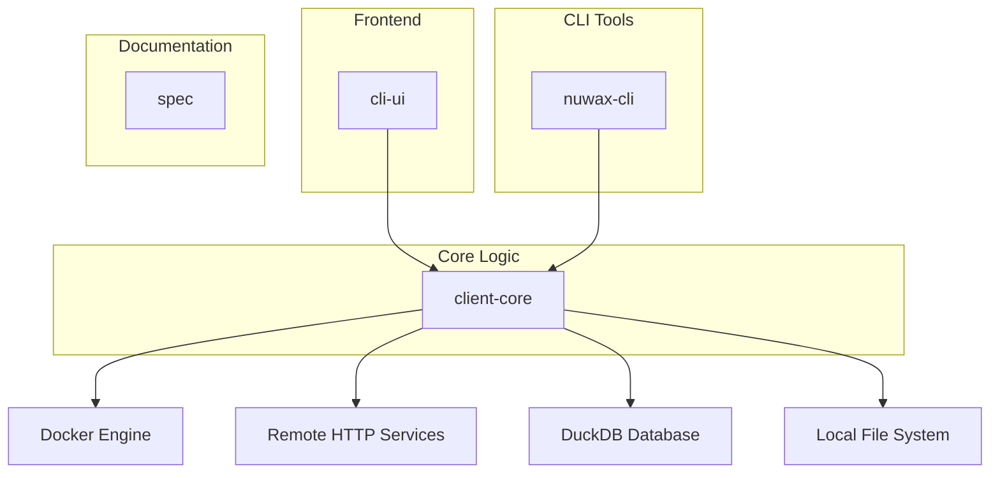
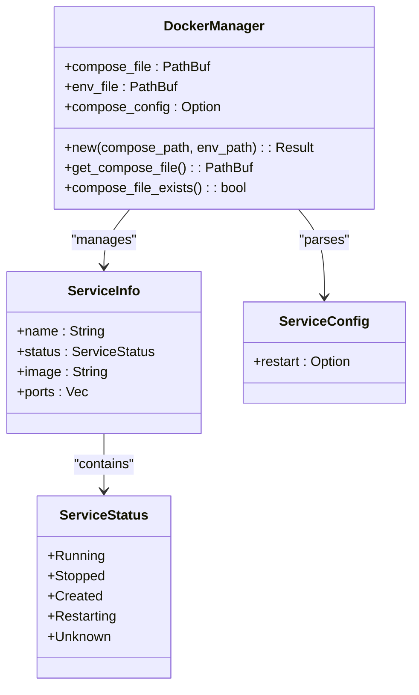
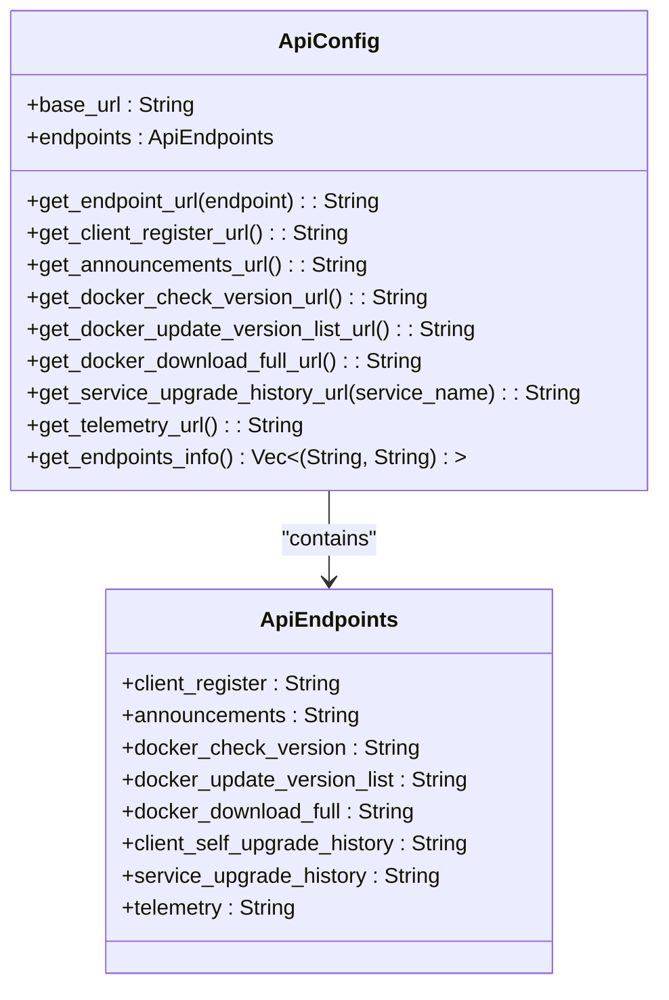
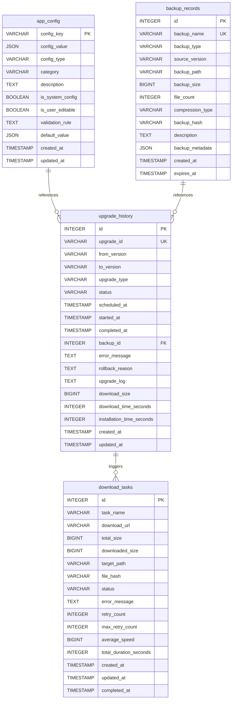
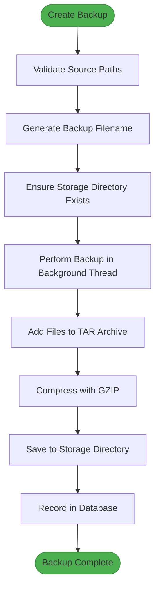
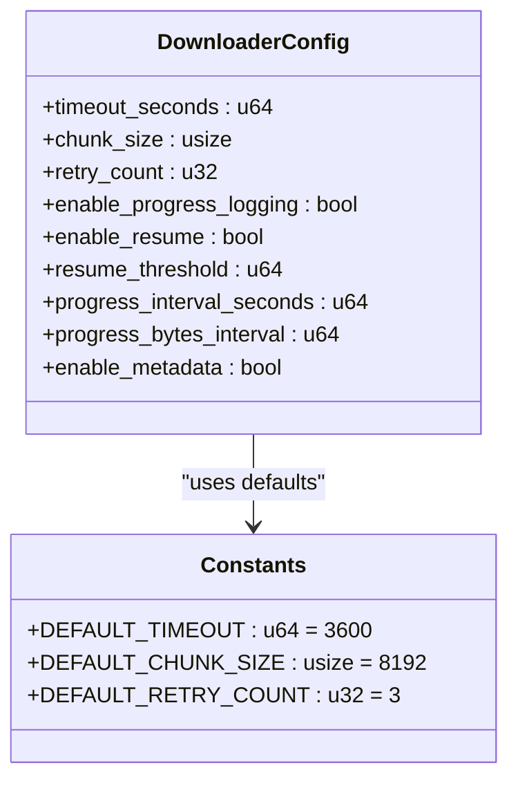
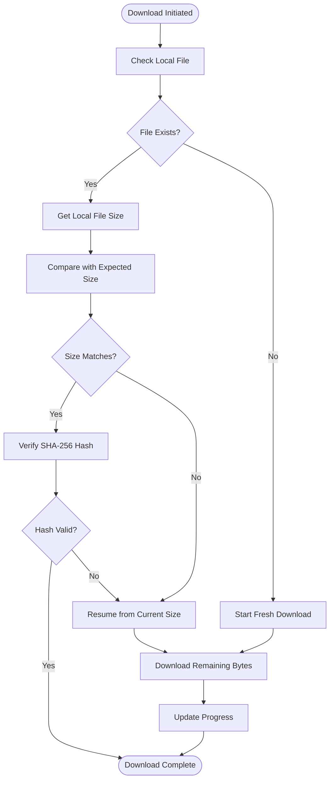

# Core to External Systems

<cite>
**Referenced Files in This Document**   
- [client-core/src/backup.rs](file://client-core/src/backup.rs)
- [client-core/src/database_manager.rs](file://client-core/src/database_manager.rs)
- [client-core/src/downloader.rs](file://client-core/src/downloader.rs)
- [client-core/src/container/types.rs](file://client-core/src/container/types.rs)
- [client-core/migrations/init_duckdb.sql](file://client-core/migrations/init_duckdb.sql)
- [client-core/src/container/mod.rs](file://client-core/src/container/mod.rs)
- [client-core/src/api_config.rs](file://client-core/src/api_config.rs)
- [client-core/src/constants.rs](file://client-core/src/constants.rs)
</cite>

## Table of Contents
1. [Introduction](#introduction)
2. [Project Structure](#project-structure)
3. [Docker Engine Integration via Bollard](#docker-engine-integration-via-bollard)
4. [HTTP Client Implementation for Remote Services](#http-client-implementation-for-remote-services)
5. [DuckDB Database Interaction Patterns](#duckdb-database-interaction-patterns)
6. [Local File System Storage and Retrieval](#local-file-system-storage-and-retrieval)
7. [Network Resilience and Retry Mechanisms](#network-resilience-and-retry-mechanisms)
8. [Conclusion](#conclusion)

## Introduction
This document provides a comprehensive analysis of how the core library interacts with external systems in the Duck Client application. It details the integration patterns used for Docker Engine communication, remote service manifest fetching, database operations using DuckDB, and local file system interactions. The document also covers implemented resilience strategies such as retry mechanisms, timeout handling, and network fault tolerance. The analysis is based on direct examination of the source code and configuration files within the repository.

## Project Structure
The Duck Client repository follows a modular architecture with clear separation of concerns. The core functionality is organized into several main directories:

- **cli-ui**: Frontend user interface built with React and Tauri
- **client-core**: Core business logic and system integrations
- **nuwax-cli**: Command-line interface components
- **spec**: Design and architecture documentation
- **data/web**: Static web content

The client-core module contains the primary integration points with external systems, including Docker, HTTP services, and the DuckDB database. This structure enables clean separation between UI presentation and system-level operations.



**Diagram sources**
- [client-core/src/lib.rs](file://client-core/src/lib.rs)
- [cli-ui/src-tauri/Cargo.toml](file://cli-ui/src-tauri/Cargo.toml)

**Section sources**
- [client-core/src/lib.rs](file://client-core/src/lib.rs)
- [Cargo.toml](file://Cargo.toml)

## Docker Engine Integration via Bollard

### Container Lifecycle Management
The Duck Client integrates with Docker Engine through a custom DockerManager implementation that abstracts container lifecycle operations. The system uses Bollard (implied by container module structure) to communicate with the Docker daemon via its REST API.



**Diagram sources**
- [client-core/src/container/types.rs](file://client-core/src/container/types.rs)
- [client-core/src/container/mod.rs](file://client-core/src/container/mod.rs)

**Section sources**
- [client-core/src/container/types.rs](file://client-core/src/container/types.rs)
- [client-core/src/container/mod.rs](file://client-core/src/container/mod.rs)

### Connection Management
The DockerManager establishes connections to the Docker daemon using platform-appropriate socket paths:
- Unix/Linux/macOS: `/var/run/docker.sock`
- Windows: `\\.\pipe\docker_engine`

The connection is managed through the docker-compose.yml file located in the configured Docker directory. The system supports both existing and non-existing compose files, allowing for graceful initialization when files are missing.

### Container Lifecycle Operations
The integration supports full container lifecycle management:
- **Service Status Monitoring**: Tracks service status (Running, Stopped, Created, Restarting, Unknown)
- **Configuration Management**: Parses docker-compose.yml files to extract service configurations
- **Health Checks**: Implements periodic health monitoring of containerized services
- **Port Management**: Handles service port configurations and mappings

The system uses a modular approach with separate components for command execution, image management, service operations, and volume management, all coordinated through the central DockerManager.

## HTTP Client Implementation for Remote Services

### API Configuration and Endpoints
The HTTP client implementation is configured through the ApiConfig structure, which defines all remote service endpoints. The system uses a centralized configuration approach that allows for easy endpoint management and URL construction.



**Diagram sources**
- [client-core/src/api_config.rs](file://client-core/src/api_config.rs)

**Section sources**
- [client-core/src/api_config.rs](file://client-core/src/api_config.rs)

### Service Manifest Fetching
The system fetches service manifests and update packages from remote servers using a configurable HTTP client. Key endpoints include:
- **Docker Version Check**: `/api/docker/check-version`
- **Version List Update**: `/api/docker/version-list`
- **Full Service Package Download**: `/api/docker/download/full`

The client constructs complete URLs by combining the base URL with specific endpoint paths, enabling flexible deployment configurations.

### Authentication and Headers
The HTTP client includes proper User-Agent headers using the constant defined in the configuration:
```
User-Agent: duck-client/{version}
```

For authenticated requests, the system supports custom HTTP clients with authentication headers, allowing secure communication with protected endpoints.

## DuckDB Database Interaction Patterns

### Schema Management
The DuckDB database schema is initialized through a comprehensive SQL script that creates multiple tables for different system functions. The schema is designed for concurrency and performance optimization.



**Diagram sources**
- [client-core/migrations/init_duckdb.sql](file://client-core/migrations/init_duckdb.sql)

**Section sources**
- [client-core/migrations/init_duckdb.sql](file://client-core/migrations/init_duckdb.sql)

### Query Execution
The database interaction pattern uses a manager-based approach with retry capabilities for both read and write operations:

```mermaid
sequenceDiagram
participant Application
participant DatabaseManager
participant DuckDB
Application->>DatabaseManager : write_with_retry(operation)
DatabaseManager->>DatabaseManager : Apply retry policy
loop With exponential backoff
DatabaseManager->>DuckDB : Execute operation
DuckDB-->>DatabaseManager : Result
alt Success
DatabaseManager-->>Application : Success
break Return result
else Failure
DatabaseManager->>DatabaseManager : Wait with backoff
end
end
Application->>DatabaseManager : read_with_retry(operation)
DatabaseManager->>DatabaseManager : Apply retry policy
loop With exponential backoff
DatabaseManager->>DuckDB : Execute query
DuckDB-->>DatabaseManager : ResultSet
alt Success
DatabaseManager-->>Application : Data
break Return result
else Failure
DatabaseManager->>DatabaseManager : Wait with backoff
end
end
```

**Diagram sources**
- [client-core/src/database_manager.rs](file://client-core/src/database_manager.rs)

**Section sources**
- [client-core/src/database_manager.rs](file://client-core/src/database_manager.rs)

### Data Persistence
The system implements several key database patterns:
- **Concurrent Access**: Uses connection pooling and thread-safe operations
- **Schema Versioning**: Tracks database schema versions for migration management
- **Index Optimization**: Creates indexes on frequently queried fields
- **View Creation**: Implements views for complex queries to improve performance
- **Data Integrity**: Uses constraints and validation rules

The database stores configuration data, backup records, upgrade history, download tasks, system checks, and user actions, providing a comprehensive audit trail and state management system.

## Local File System Storage and Retrieval

### Configuration Storage
Configuration data is stored in the DuckDB database within the `app_config` table, which supports various data types through JSON storage. The system also manages traditional configuration files:
- **Docker Compose**: `docker/docker-compose.yml`
- **Environment Variables**: `docker/.env`

### Backup Data Management
The backup system implements a comprehensive approach to data preservation:



**Diagram sources**
- [client-core/src/backup.rs](file://client-core/src/backup.rs)

**Section sources**
- [client-core/src/backup.rs](file://client-core/src/backup.rs)

The backup manager supports:
- **Multiple Backup Types**: Manual and pre-upgrade backups
- **Compression**: GZIP compression with configurable levels (0-9)
- **Flexible Source Selection**: Can backup both files and directories
- **Database Recording**: Stores backup metadata in DuckDB
- **Error Handling**: Records failed backups in the database

Backup filenames follow the pattern: `backup_{type}_v{version}_{timestamp}.tar.gz`

### Directory Structure
The system uses a standardized directory structure for organization:
```
.
├── docker/
│   ├── docker-compose.yml
│   ├── .env
│   ├── images/
│   ├── data/
│   ├── app/
│   ├── config/
│   └── upload/
├── backups/
├── logs/
└── migrations/
```

This structure is defined in the constants module and can be customized through configuration.

## Network Resilience and Retry Mechanisms

### Retry Mechanisms
The system implements robust retry mechanisms for database operations:

```rust
// Example from database_manager.rs
async fn write_with_retry<F, T>(&self, operation: F) -> Result<T>
where
    F: FnOnce(&Connection) -> Result<T> + Send,
    T: Send,
{
    // Implementation with retry logic
}
```

The retry strategy includes:
- **Configurable Retry Count**: Default of 3 attempts
- **Exponential Backoff**: Increasing delays between attempts
- **Error Classification**: Different handling for transient vs. permanent errors
- **Circuit Breaker Pattern**: Prevents cascading failures

### Timeout Handling
Timeout values are centrally configured through constants:



**Diagram sources**
- [client-core/src/downloader.rs](file://client-core/src/downloader.rs)
- [client-core/src/constants.rs](file://client-core/src/constants.rs)

**Section sources**
- [client-core/src/downloader.rs](file://client-core/src/downloader.rs)
- [client-core/src/constants.rs](file://client-core/src/constants.rs)

Key timeout configurations:
- **HTTP Client**: 60 minutes (3600 seconds) default
- **Network Connection**: 30 seconds default
- **Download Operations**: Configurable up to 1 hour

### Network Resilience Strategies
The downloader implementation includes comprehensive network resilience features:

#### Intelligent Download Strategy
- **Automatic Detection**: Identifies optimal download method
- **Extended Timeout for Large Files**: Uses longer timeouts for object storage and CDN downloads
- **Range Request Support**: Checks server support for partial content

#### Progress Monitoring and Recovery
- **Real-time Progress**: Tracks downloaded bytes, speed, and ETA
- **Pause/Resume**: Supports pausing and resuming downloads
- **Integrity Verification**: SHA-256 hash validation

#### Smart Resume Logic


**Diagram sources**
- [client-core/src/downloader.rs](file://client-core/src/downloader.rs)

**Section sources**
- [client-core/src/downloader.rs](file://client-core/src/downloader.rs)

The system distinguishes between different types of download targets:
- **Object Storage/CDN**: Uses extended timeout configuration
- **Standard HTTP**: Uses default timeout
- **Large Files**: Automatically enables resume functionality

Download metadata is stored separately to track progress, expected size, and hash values, enabling reliable resume operations across application restarts.

## Conclusion
The Duck Client demonstrates a robust architecture for integrating with external systems. The core library effectively manages interactions with Docker Engine, remote HTTP services, DuckDB database, and the local file system through well-defined patterns and abstractions.

Key strengths of the implementation include:
- **Modular Design**: Clear separation of concerns between different integration points
- **Resilience**: Comprehensive retry mechanisms and error handling
- **Performance**: Optimized for concurrent operations and efficient resource usage
- **Reliability**: Robust backup and recovery capabilities
- **Maintainability**: Centralized configuration and consistent patterns

The system's use of DuckDB as an embedded database provides a lightweight yet powerful solution for local data persistence, while the HTTP client implementation ensures reliable communication with remote services. The Docker integration enables seamless container management, and the sophisticated file system operations support comprehensive backup and restore functionality.

These patterns collectively create a resilient, maintainable system that can handle the complexities of modern application deployment and management while providing a reliable user experience.