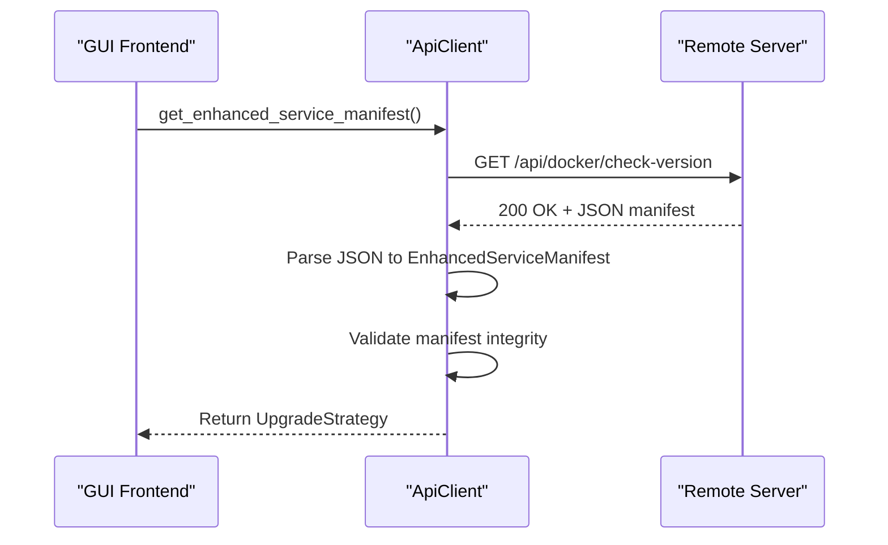
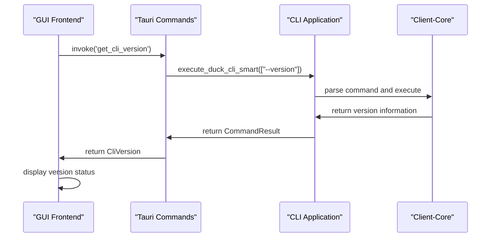
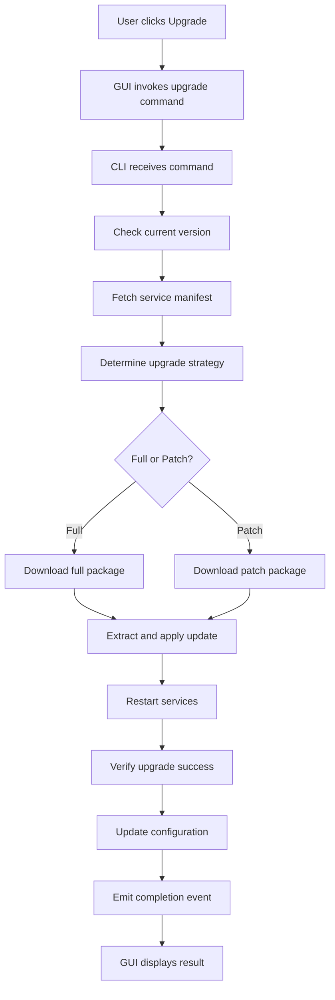
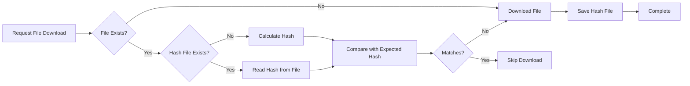

# Data Flow and Integration Patterns

<cite>
**Referenced Files in This Document**   
- [cli.rs](file://cli-ui/src-tauri/src/commands/cli.rs#L1-L627)
- [config.rs](file://cli-ui/src-tauri/src/commands/config.rs#L1-L200)
- [mod.rs](file://cli-ui/src-tauri/src/commands/mod.rs#L1-L5)
- [main.rs](file://nuwax-cli/src/main.rs#L1-L102)
- [lib.rs](file://nuwax-cli/src/lib.rs#L1-L27)
- [lib.rs](file://client-core/src/lib.rs#L1-L27)
- [api.rs](file://client-core/src/api.rs#L1-L976)
- [api_types.rs](file://client-core/src/api_types.rs#L1-L902)
- [upgrade.rs](file://client-core/src/upgrade.rs#L1-L89)
- [upgrade_strategy.rs](file://client-core/src/upgrade_strategy.rs#L1-L462)
</cite>

## Table of Contents
1. [Introduction](#introduction)
2. [Core Components Overview](#core-components-overview)
3. [Data Flow Architecture](#data-flow-architecture)
4. [Integration with External Systems](#integration-with-external-systems)
5. [Request-Response Cycle Analysis](#request-response-cycle-analysis)
6. [Message Passing with Tauri](#message-passing-with-tauri)
7. [Data Consistency and Caching](#data-consistency-and-caching)
8. [Conclusion](#conclusion)

## Introduction
This document provides a comprehensive analysis of the data flow and integration patterns in the Duck Client application. The system consists of three main components: a GUI frontend built with Tauri, a CLI interface, and a shared core library. These components communicate through well-defined interfaces using serialization/deserialization with Serde, enabling seamless data exchange across different layers of the application.

The architecture follows a layered approach where the GUI interacts with the backend through Tauri's invoke/emit system, the CLI provides direct access to core functionality, and the client-core library serves as the central business logic hub. This document will explore how data moves between these components, how external systems are integrated, and how various operations are executed across the system.

## Core Components Overview

The Duck Client application is structured into three primary components that work together to provide a complete user experience:

1. **GUI (cli-ui)**: A React-based frontend using Tauri for desktop integration, providing a visual interface for users.
2. **CLI (nuwax-cli)**: A command-line interface built with Rust and Clap, offering direct access to application functionality.
3. **Core Library (client-core)**: A shared Rust library containing the business logic, data models, and integration code used by both the GUI and CLI.

These components are connected through a well-defined API surface that enables consistent behavior across interfaces while maintaining separation of concerns.

**Section sources**
- [lib.rs](file://client-core/src/lib.rs#L1-L27)
- [lib.rs](file://nuwax-cli/src/lib.rs#L1-L27)

## Data Flow Architecture

The data flow in the Duck Client application follows a request-response pattern with bidirectional communication channels. When a user interacts with the GUI, events are propagated through Tauri's command system to the Rust backend, which then interacts with the core library to perform operations.

```mermaid
graph TD
GUI[GUI Frontend] --> |invoke()| Tauri[Tauri Command Layer]
Tauri --> |execute_duck_cli_smart| CLI[CLI Interface]
CLI --> |run_command| Core[Client-Core Library]
Core --> |API Client| External[External Systems]
External --> |HTTP Response| Core
Core --> |Result| CLI
CLI --> |CommandResult| Tauri
Tauri --> |emit()| GUI
style GUI fill:#f9f,stroke:#333
style Tauri fill:#bbf,stroke:#333
style CLI fill:#f96,stroke:#333
style Core fill:#6f9,stroke:#333
style External fill:#9cf,stroke:#333
```

**Diagram sources**
- [cli.rs](file://cli-ui/src-tauri/src/commands/cli.rs#L1-L627)
- [main.rs](file://nuwax-cli/src/main.rs#L1-L102)

The core data flow begins with user interaction in the GUI, which triggers a Tauri command invocation. The command is handled by the Rust backend in the `cli-ui/src-tauri` module, which then delegates to the CLI component. The CLI parses commands and routes them to the appropriate functionality in the client-core library, which performs the actual business logic and external system interactions.

**Section sources**
- [cli.rs](file://cli-ui/src-tauri/src/commands/cli.rs#L1-L627)
- [main.rs](file://nuwax-cli/src/main.rs#L1-L102)

## Integration with External Systems

The Duck Client integrates with several external systems through well-defined interfaces in the client-core library. These integrations are abstracted behind API clients that handle serialization, authentication, and error handling.

### Docker Engine Integration via Bollard
The application interacts with the Docker Engine through the Bollard library, which provides a Rust interface to the Docker API. This integration is managed through the container module in client-core, which handles container lifecycle operations, image management, and service orchestration.

### Remote Server Integration for Manifest Fetching
The application fetches service manifests and update information from remote servers using the API client in client-core. This client handles HTTP requests, response parsing, and error handling for various endpoints including version checking, announcement retrieval, and update package downloading.



**Diagram sources**
- [api.rs](file://client-core/src/api.rs#L1-L976)
- [api_types.rs](file://client-core/src/api_types.rs#L1-L902)

### Local File System Integration
Configuration, backups, and working directory management are handled through direct file system operations. The application uses Rust's standard library and Tokio for async file operations, with careful attention to cross-platform compatibility and error handling.

The configuration system stores user preferences and application state in JSON files within the application data directory. The backup system creates timestamped archives of important data, and the working directory system validates permissions and structure before allowing operations.

**Section sources**
- [config.rs](file://cli-ui/src-tauri/src/commands/config.rs#L1-L200)
- [api.rs](file://client-core/src/api.rs#L1-L976)

## Request-Response Cycle Analysis

The request-response cycle for key operations like status checking and upgrades follows a consistent pattern across the application, with data transformation occurring at each layer.

### Status Checking Operation
When a user requests status information, the following sequence occurs:



**Diagram sources**
- [cli.rs](file://cli-ui/src-tauri/src/commands/cli.rs#L1-L627)
- [main.rs](file://nuwax-cli/src/main.rs#L1-L102)

The data transformation begins with a simple function call from the GUI, which is converted to a command invocation with arguments. The CLI parses these arguments and routes them to the appropriate handler, which returns structured data that is serialized and sent back through the Tauri layer to the frontend.

### Upgrade Operation
The upgrade operation follows a more complex sequence involving multiple system interactions:



**Diagram sources**
- [upgrade.rs](file://client-core/src/upgrade.rs#L1-L89)
- [upgrade_strategy.rs](file://client-core/src/upgrade_strategy.rs#L1-L462)

During the upgrade process, the UpgradeStrategyManager analyzes the current version, target version, and system architecture to determine the optimal upgrade path. This decision-making process considers factors like network conditions, disk space, and risk assessment to provide the best user experience.

**Section sources**
- [upgrade.rs](file://client-core/src/upgrade.rs#L1-L89)
- [upgrade_strategy.rs](file://client-core/src/upgrade_strategy.rs#L1-L462)

## Message Passing with Tauri

The Tauri framework enables bidirectional communication between the frontend and backend through its invoke/emit system. This system allows the GUI to call Rust functions and receive results, while also enabling the backend to send real-time updates to the frontend.

### Invoke System for Command Execution
The invoke system is used for synchronous and asynchronous function calls from the frontend to the backend. When the GUI needs to perform an operation, it uses the `invoke` function with a command name and parameters:

```typescript
// Example from frontend
await invoke('execute_duck_cli_smart', {
  args: ['status'],
  working_dir: '/path/to/project'
});
```

This call is handled by a corresponding `#[command]` annotated function in Rust, which processes the request and returns a result that is automatically serialized and sent back to the frontend.

### Emit System for Real-time Updates
The emit system enables the backend to send events to the frontend in real-time. This is particularly useful for long-running operations like command execution or file downloads:

```rust
// Example from backend
let _ = app.emit("cli-output", &output);
let _ = app.emit("cli-error", &error);
let _ = app.emit("cli-complete", exit_code);
```

The frontend can listen for these events using event listeners:

```typescript
// Example from frontend
listen('cli-output', (event) => {
  // Update terminal display
});
```

This pattern enables real-time feedback during operations, improving the user experience by providing immediate visibility into ongoing processes.

**Section sources**
- [cli.rs](file://cli-ui/src-tauri/src/commands/cli.rs#L1-L627)
- [mod.rs](file://cli-ui/src-tauri/src/commands/mod.rs#L1-L5)

## Data Consistency and Caching

The Duck Client application employs several strategies to ensure data consistency and improve performance through caching.

### Data Consistency Mechanisms
The application uses a combination of validation, atomic operations, and transactional patterns to maintain data consistency:

1. **Configuration Validation**: Before saving configuration changes, the system validates directory permissions, existence, and writability.
2. **Atomic File Operations**: Critical file operations are performed atomically to prevent corruption during failures.
3. **Database Lock Detection**: The system checks for database locks before performing operations that could conflict.

### Caching Strategies
The application implements intelligent caching to reduce redundant operations and improve performance:

1. **File Hash Caching**: Downloaded files have their SHA256 hashes stored in `.hash` files, allowing the system to skip re-downloading when the local file matches the expected hash.
2. **Manifest Caching**: Service manifests are cached locally to reduce network requests during status checks.
3. **Configuration Caching**: Frequently accessed configuration values are kept in memory to avoid repeated file I/O.



**Diagram sources**
- [api.rs](file://client-core/src/api.rs#L1-L976)
- [api_types.rs](file://client-core/src/api_types.rs#L1-L902)

The caching system uses a multi-layer approach where the presence of a hash file indicates a previous successful download. When a file exists, the system first checks for a corresponding hash file before calculating the hash of the file itself, optimizing for the common case where files are already up-to-date.

**Section sources**
- [api.rs](file://client-core/src/api.rs#L1-L976)
- [api_types.rs](file://client-core/src/api_types.rs#L1-L902)

## Conclusion
The Duck Client application demonstrates a well-architected approach to data flow and integration across multiple components. By leveraging Tauri's invoke/emit system, Serde for serialization, and a shared core library, the application achieves consistency between the GUI and CLI interfaces while maintaining clean separation of concerns.

Key strengths of the architecture include:
- Clear separation between presentation, command handling, and business logic
- Robust error handling and validation at each layer
- Efficient caching strategies that reduce redundant operations
- Real-time feedback through bidirectional communication
- Comprehensive integration with external systems through well-defined APIs

The data flow patterns established in this application provide a solid foundation for future enhancements and demonstrate best practices in multi-component application design.