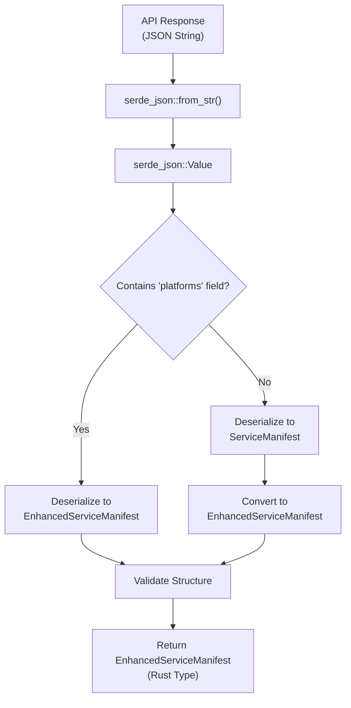
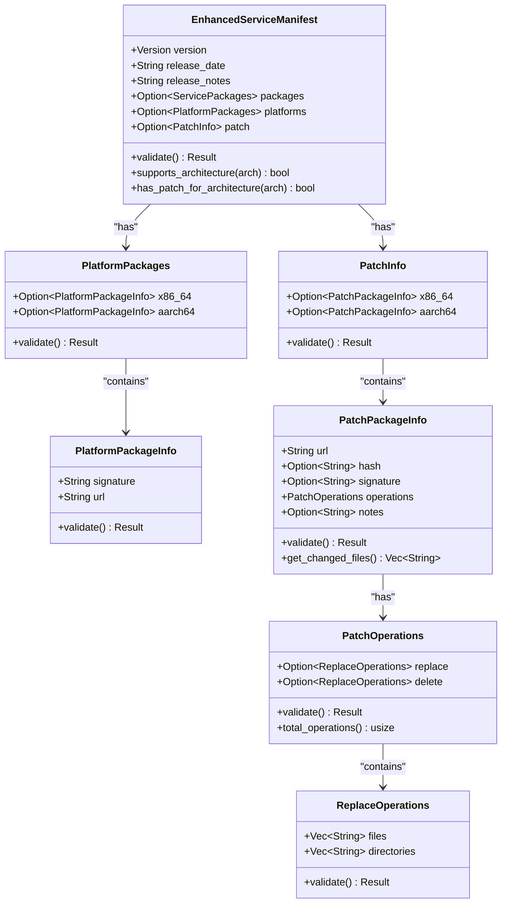
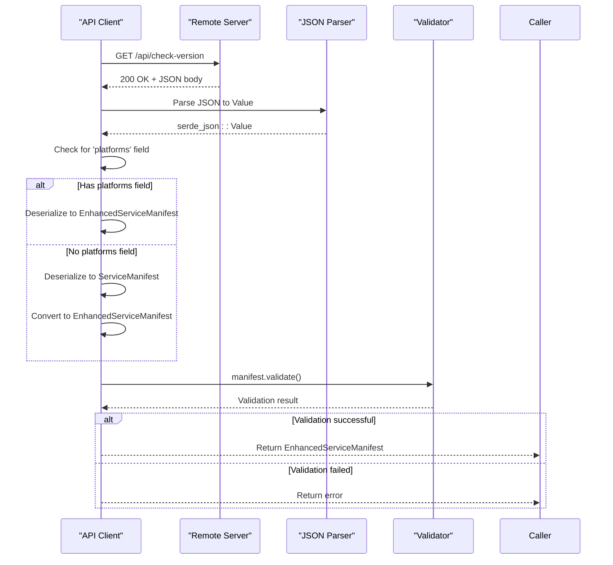
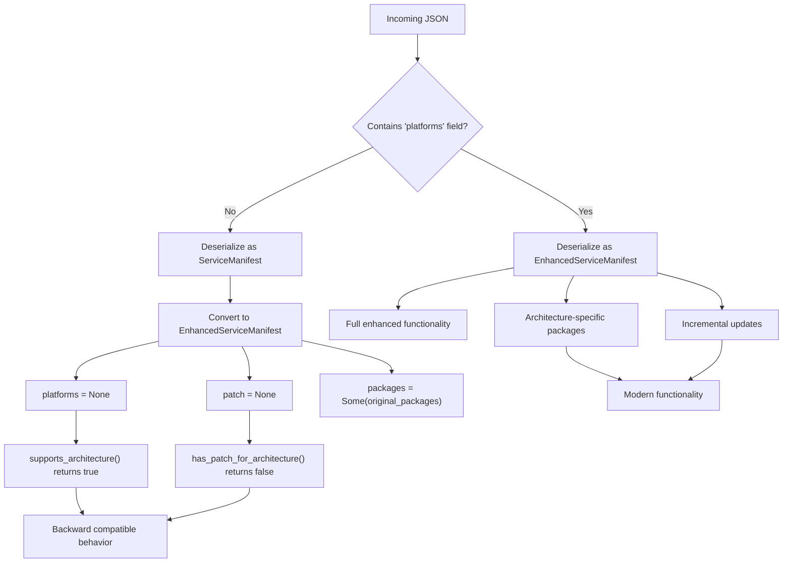
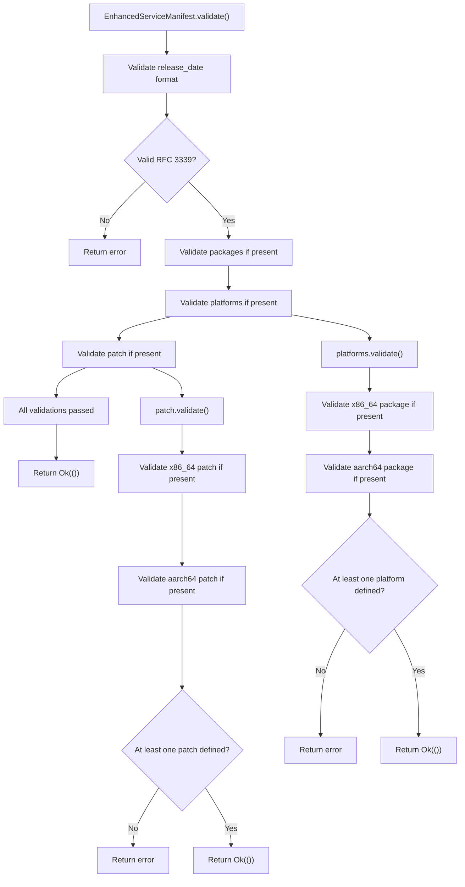

# Data Serialization and Message Passing

<cite>
**Referenced Files in This Document**   
- [api_types.rs](file://client-core/src/api_types.rs#L0-L902)
- [api.rs](file://client-core/src/api.rs#L590-L789)
- [upgrade_strategy.rs](file://client-core/src/upgrade_strategy.rs#L287-L314)
- [docker_upgrade_test.rs](file://nuwax-cli/tests/docker_upgrade_test.rs#L0-L154)
</cite>

## Table of Contents
1. [Data Serialization with Serde](#data-serialization-with-serde)
2. [EnhancedServiceManifest Structure](#enhancedservicemanifest-structure)
3. [Message Passing Patterns](#message-passing-patterns)
4. [Versioning and Backward Compatibility](#versioning-and-backward-compatibility)
5. [Data Validation](#data-validation)
6. [Type Consistency Best Practices](#type-consistency-best-practices)

## Data Serialization with Serde

The system utilizes Serde, Rust's powerful serialization framework, to convert between JSON data and Rust types for API communication and configuration management. This approach ensures type safety and efficient data handling across the application. The serialization process is primarily used for API responses, particularly for service manifest data that describes available updates and their metadata.

Serde is implemented through the `Deserialize` and `Serialize` traits applied to various data structures in the `api_types.rs` file. These types are automatically converted to and from JSON format when communicating with external services. The system handles both incoming API responses (deserialization) and outgoing requests (serialization), with a primary focus on deserialization of service manifest data.

The `EnhancedServiceManifest` struct serves as the primary data model for service updates, containing version information, release notes, platform-specific packages, and incremental update patches. This structure is designed to be flexible and extensible, accommodating both current and future requirements for service distribution.

**Diagram sources**
- [api.rs](file://client-core/src/api.rs#L590-L789)
- [api_types.rs](file://client-core/src/api_types.rs#L0-L902)

**Section sources**
- [api.rs](file://client-core/src/api.rs#L590-L789)
- [api_types.rs](file://client-core/src/api_types.rs#L0-L902)

## EnhancedServiceManifest Structure

The `EnhancedServiceManifest` struct represents the core data model for service updates, designed to support architecture-specific packages and incremental updates. This structure extends the legacy `ServiceManifest` format with additional fields while maintaining backward compatibility.

The data model includes several key components:
- **Version**: Uses a custom `Version` type with a deserialization function `version_from_str` to handle various version formats
- **Release metadata**: Includes release date (in RFC 3339 format) and release notes
- **Packages**: Optional field containing full and patch package information, maintained for backward compatibility
- **Platforms**: Optional field containing architecture-specific package information for x86_64 and aarch64
- **Patch**: Optional field containing incremental update information for different architectures

**Diagram sources**
- [api_types.rs](file://client-core/src/api_types.rs#L0-L902)

**Section sources**
- [api_types.rs](file://client-core/src/api_types.rs#L0-L902)

## Message Passing Patterns

The system implements a sophisticated message passing pattern for retrieving and processing service manifest data. The `get_enhanced_service_manifest` method in the API client serves as the primary entry point for this process, handling the complete workflow from HTTP request to validated Rust structure.

The message passing pattern follows these steps:
1. Send HTTP request to retrieve service manifest JSON
2. Parse JSON into `serde_json::Value` for preliminary inspection
3. Check for presence of 'platforms' field to determine format
4. Deserialize to appropriate type (EnhancedServiceManifest or ServiceManifest)
5. Convert legacy format to enhanced format if necessary
6. Validate the resulting structure
7. Return the validated EnhancedServiceManifest

This pattern enables seamless handling of both new and legacy manifest formats, ensuring backward compatibility while supporting new features. The system uses `serde_json::from_value` to deserialize from the parsed JSON value, avoiding the need to parse the JSON string multiple times.

**Diagram sources**
- [api.rs](file://client-core/src/api.rs#L590-L789)

**Section sources**
- [api.rs](file://client-core/src/api.rs#L590-L789)

## Versioning and Backward Compatibility

The system implements a comprehensive versioning strategy that maintains backward compatibility while introducing new features. The `EnhancedServiceManifest` structure is designed to coexist with the legacy `ServiceManifest` format, allowing smooth transition between versions.

Backward compatibility is achieved through several mechanisms:
- The `packages` field in `EnhancedServiceManifest` is optional but can contain legacy package information
- When a manifest lacks the 'platforms' field, it's treated as a legacy format and automatically converted
- The `supports_architecture` method returns true by default when no platforms are specified, maintaining compatibility with older clients
- Field names use Serde's `rename` attribute to ensure JSON compatibility (e.g., `x86_64` field mapping)

The versioning system handles both semantic versioning and incremental update versions. The `version` field uses a custom deserialization function `version_from_str` to parse various version formats, including those with pre-release and build metadata. This flexibility allows the system to handle different versioning schemes used across services.

**Diagram sources**
- [api.rs](file://client-core/src/api.rs#L590-L789)
- [api_types.rs](file://client-core/src/api_types.rs#L0-L902)

**Section sources**
- [api.rs](file://client-core/src/api.rs#L590-L789)
- [api_types.rs](file://client-core/src/api_types.rs#L0-L902)

## Data Validation

The system implements comprehensive data validation at multiple levels to ensure data integrity and security. Each data structure has a `validate` method that checks the validity of its fields and relationships, with validation cascading from parent to child structures.

Validation checks include:
- **Format validation**: Ensuring dates are in RFC 3339 format
- **URL validation**: Checking that URLs have valid schemes (http, https, or relative)
- **Presence validation**: Ensuring required fields are not empty
- **Structural validation**: Verifying that at least one platform or patch is defined when the container is present
- **Security validation**: Preventing dangerous file paths that could lead to directory traversal attacks

The validation process is invoked immediately after deserialization to catch issues early. This approach follows the principle of failing fast when invalid data is encountered, preventing corrupted data from propagating through the system.

**Diagram sources**
- [api_types.rs](file://client-core/src/api_types.rs#L0-L902)

**Section sources**
- [api_types.rs](file://client-core/src/api_types.rs#L0-L902)

## Type Consistency Best Practices

To maintain type consistency across the monorepo and prevent serialization errors, the system follows several best practices:

1. **Single Source of Truth**: Data structures are defined once in `api_types.rs` and reused throughout the codebase, eliminating duplication and ensuring consistency.

2. **Comprehensive Testing**: Extensive unit tests verify serialization/deserialization behavior, including edge cases and error conditions. Tests validate both successful parsing and proper error handling for invalid inputs.

3. **Defensive Validation**: All deserialized data is validated immediately to catch issues early. This includes format validation, structural validation, and security checks.

4. **Graceful Degradation**: The system handles missing or optional fields appropriately, providing sensible defaults when possible (e.g., default architecture support).

5. **Clear Error Messages**: Deserialization and validation errors provide descriptive messages that aid debugging and troubleshooting.

6. **Documentation Comments**: All data structures include clear documentation comments explaining their purpose and usage.

These practices ensure that data remains consistent and reliable throughout the system, minimizing the risk of serialization errors and data corruption.

**Section sources**
- [api_types.rs](file://client-core/src/api_types.rs#L0-L902)
- [api.rs](file://client-core/src/api.rs#L590-L789)
- [docker_upgrade_test.rs](file://nuwax-cli/tests/docker_upgrade_test.rs#L0-L154)