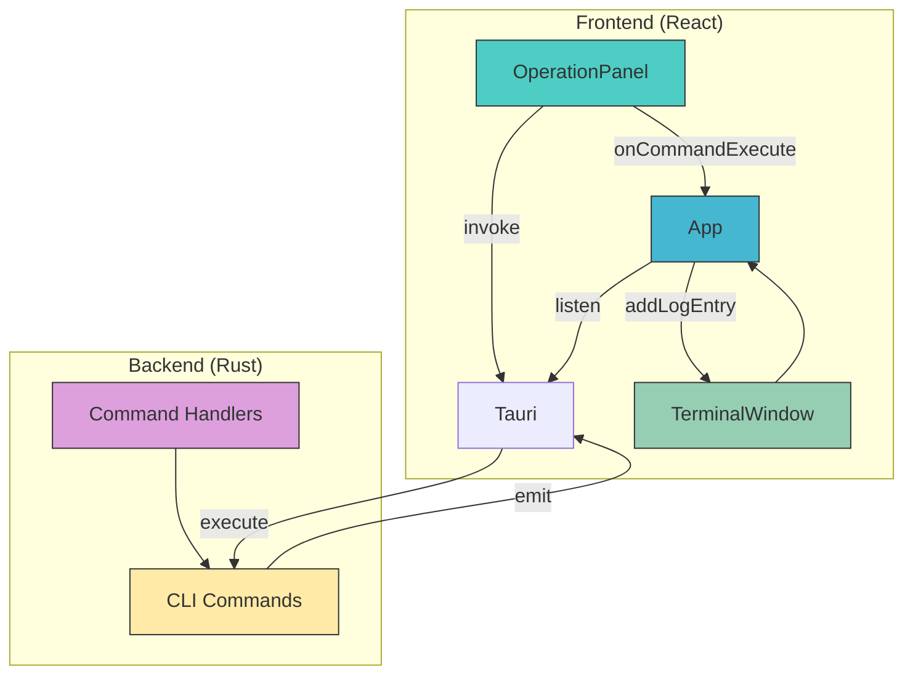
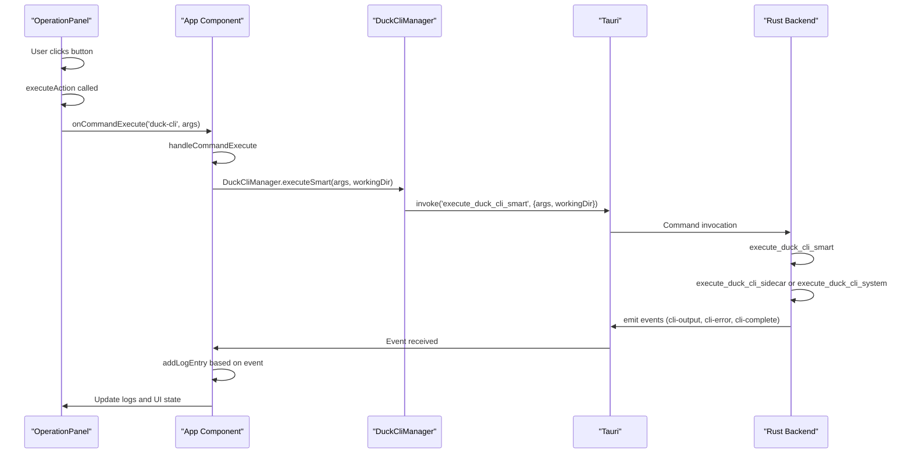

# GUI to Core Data Flow

<cite>
**Referenced Files in This Document**   
- [OperationPanel.tsx](file://cli-ui/src/components/OperationPanel.tsx)
- [tauri.ts](file://cli-ui/src/utils/tauri.ts)
- [cli.rs](file://cli-ui/src-tauri/src/commands/cli.rs)
- [mod.rs](file://cli-ui/src-tauri/src/commands/mod.rs)
- [lib.rs](file://cli-ui/src-tauri/src/lib.rs)
- [App.tsx](file://cli-ui/src/App.tsx)
- [index.ts](file://cli-ui/src/types/index.ts)
</cite>

## Table of Contents
1. [Introduction](#introduction)
2. [Architecture Overview](#architecture-overview)
3. [Command Invocation Flow](#command-invocation-flow)
4. [Data Serialization with Serde](#data-serialization-with-serde)
5. [Error Handling and Loading States](#error-handling-and-loading-states)
6. [Data Transformation Between Layers](#data-transformation-between-layers)
7. [Adding New Command Interfaces](#adding-new-command-interfaces)
8. [Conclusion](#conclusion)

## Introduction
This document details the data flow between the Tauri/React frontend and the Rust backend core library in the Duck Client application. It explains how user actions in the GUI trigger commands in the core library through Tauri's invoke/emit system, covering the complete lifecycle from user interaction to command execution and response handling. The documentation focuses on the secure communication patterns, data serialization using Serde, error handling, and type safety across the JavaScript-Rust boundary.

## Architecture Overview
The application follows a secure desktop architecture where the React frontend runs in a WebView and communicates with the Rust backend through Tauri's IPC mechanism. The core communication pattern uses Tauri's `invoke` for command requests from frontend to backend, and `emit`/`listen` for event-based responses from backend to frontend.



**Diagram sources**
- [OperationPanel.tsx](file://cli-ui/src/components/OperationPanel.tsx)
- [App.tsx](file://cli-ui/src/App.tsx)
- [cli.rs](file://cli-ui/src-tauri/src/commands/cli.rs)

**Section sources**
- [OperationPanel.tsx](file://cli-ui/src/components/OperationPanel.tsx#L0-L505)
- [App.tsx](file://cli-ui/src/App.tsx#L150-L499)
- [cli.rs](file://cli-ui/src-tauri/src/commands/cli.rs#L0-L627)

## Command Invocation Flow
The command invocation flow begins with user interactions in the OperationPanel component and flows through multiple layers to execute commands in the Rust backend.

### Frontend Command Trigger
User actions in the OperationPanel component trigger commands through the `executeAction` function. When a user clicks a button, the action is wrapped and executed:

```typescript
const executeAction = async (actionId: string, actionFn: (parameters?: ParameterInputResult) => Promise<void>, commandId?: string) => {
    if (isDisabled) {
      await DialogManager.showMessage('警告', '请先设置有效的工作目录', 'warning');
      return;
    }

    // Check if parameters are needed
    if (commandId && needsParameterInput(commandId)) {
      const config = getCommandConfig(commandId);
      if (config) {
        setCurrentCommand({
          actionId,
          config,
          actionFn
        });
        setParameterModalOpen(true);
        return;
      }
    }

    // Execute command directly (no parameters)
    setExecutingActions(prev => new Set(prev).add(actionId));
    
    try {
      await actionFn();
    } catch (error) {
      onLogMessage(`操作失败: ${error}`, 'error');
    } finally {
      setExecutingActions(prev => {
        const newSet = new Set(prev);
        newSet.delete(actionId);
        return newSet;
      });
    }
  };
```

The action functions are defined in the `actionButtons` array, where each button has an `action` property that contains the asynchronous function to execute when clicked.

### Command Execution Path
When a command is executed, it follows this path:

1. The action function calls `onCommandExecute` with the command name and arguments
2. This triggers `handleCommandExecute` in the App component
3. The App component calls `DuckCliManager.executeSmart` which invokes the Rust backend
4. The Rust backend executes the command and emits events back to the frontend



**Diagram sources**
- [OperationPanel.tsx](file://cli-ui/src/components/OperationPanel.tsx#L45-L82)
- [App.tsx](file://cli-ui/src/App.tsx#L350-L400)
- [cli.rs](file://cli-ui/src-tauri/src/commands/cli.rs#L300-L499)

**Section sources**
- [OperationPanel.tsx](file://cli-ui/src/components/OperationPanel.tsx#L45-L125)
- [App.tsx](file://cli-ui/src/App.tsx#L350-L400)

## Data Serialization with Serde
Data serialization between the frontend and backend is handled by Tauri's automatic serialization using Serde in Rust and JSON serialization in JavaScript.

### Backend Data Structures
The Rust backend defines data structures with Serde serialization attributes:

```rust
#[derive(Debug, Serialize, Deserialize)]
pub struct CommandResult {
    pub success: bool,
    pub exit_code: i32,
    pub stdout: String,
    pub stderr: String,
}

#[derive(Debug, Serialize, Deserialize)]
pub struct CliVersion {
    pub version: String,
    pub available: bool,
}

#[derive(Debug, Serialize, Deserialize)]
pub struct ProcessInfo {
    pub pid: u32,
    pub command: String,
    pub running: bool,
}
```

These structures are automatically serialized to JSON when returned from Tauri commands and deserialized when received from the frontend.

### Frontend Type Definitions
The frontend has corresponding TypeScript interfaces that mirror the Rust structures:

```typescript
export interface CommandResult {
  success: boolean;
  output: string;
  error?: string;
}
```

While the field names don't match exactly (output vs stdout/stderr), the DuckCliManager handles the transformation:

```typescript
static async executeSmart(
    args: string[], 
    workingDir?: string
  ): Promise<{ success: boolean; exit_code: number; stdout: string; stderr: string }> {
    try {
      return await invoke('execute_duck_cli_smart', { 
        args, 
        workingDir: workingDir || null 
      });
    } catch (error) {
      return {
        success: false,
        exit_code: -1,
        stdout: '',
        stderr: `智能执行失败: ${error}`
      };
    }
  }
```

The `invoke` function from `@tauri-apps/api/core` handles the JSON serialization of parameters and deserialization of responses automatically.

### Parameter Building and Serialization
Parameters are built and serialized in the OperationPanel component:

```typescript
const buildCommandArgs = (baseArgs: string[], parameters: ParameterInputResult, positionalParams: string[] = []): string[] => {
    const args = [...baseArgs];
    
    // Handle positional parameters
    positionalParams.forEach(paramName => {
      const value = parameters[paramName];
      if (value !== undefined && value !== null && value !== '') {
        args.push(value.toString());
      }
    });
    
    // Handle option parameters
    for (const [key, value] of Object.entries(parameters)) {
      if (positionalParams.includes(key)) continue;
      
      if (value === undefined || value === null || value === '') continue;
      
      if (typeof value === 'boolean') {
        if (value) {
          args.push(`--${key}`);
        }
      } else if (Array.isArray(value)) {
        value.forEach(v => {
          args.push(`--${key}`, v);
        });
      } else {
        const paramName = key === 'args' ? '' : `--${key}`;
        if (paramName) {
          args.push(paramName, value.toString());
        } else {
          args.push(value.toString());
        }
      }
    }
    
    return args;
  };
```

The resulting array of strings is serialized to JSON and sent to the Rust backend, where it's deserialized into a `Vec<String>`.

**Section sources**
- [cli.rs](file://cli-ui/src-tauri/src/commands/cli.rs#L100-L150)
- [index.ts](file://cli-ui/src/types/index.ts#L39-L43)
- [OperationPanel.tsx](file://cli-ui/src/components/OperationPanel.tsx#L250-L300)

## Error Handling and Loading States
The application implements comprehensive error handling and loading state management to provide feedback to users during command execution.

### Loading State Management
Loading states are managed using React state to show visual feedback during command execution:

```typescript
const [executingActions, setExecutingActions] = useState<Set<string>>(new Set());

// In executeAction
setExecutingActions(prev => new Set(prev).add(actionId));
// ... command execution ...
setExecutingActions(prev => {
  const newSet = new Set(prev);
  newSet.delete(actionId);
  return newSet;
});
```

The UI displays a spinner icon when a command is executing:

```tsx
{isExecuting ? (
  <div className="animate-spin rounded-full h-5 w-5 border-b-2 border-current"></div>
) : (
  button.icon
)}
```

### Error Handling Patterns
Error handling occurs at multiple levels:

1. **Frontend Level**: Try-catch blocks in action functions
2. **Backend Level**: Result types in Rust functions
3. **Communication Level**: Tauri's invoke/emit system

```typescript
try {
  await actionFn();
} catch (error) {
  onLogMessage(`操作失败: ${error}`, 'error');
} finally {
  // Always clean up loading state
  setExecutingActions(prev => {
    const newSet = new Set(prev);
    newSet.delete(actionId);
    return newSet;
  });
}
```

The Rust backend uses Rust's Result type for error handling:

```rust
pub async fn execute_duck_cli_sidecar(
    app: AppHandle,
    args: Vec<String>,
    working_dir: Option<String>,
) -> Result<CommandResult, String> {
    // ... command execution ...
    let (mut rx, mut _child) = cmd.spawn().map_err(|e| format!("执行命令失败: {e}"))?;
    // ... event handling ...
    Ok(CommandResult {
        success: exit_code == 0,
        exit_code,
        stdout,
        stderr,
    })
}
```

### Event-Based Error Reporting
Errors are reported in real-time using Tauri's emit/listen system:

```rust
// In Rust backend
CommandEvent::Stderr(data) => {
    let output = String::from_utf8_lossy(&data);
    stderr.push_str(&output);
    // Real-time send errors to frontend
    let _ = app.emit("cli-error", &output);
}
```

```typescript
// In App.tsx
unlistenError = await listen('cli-error', (event) => {
  const error = event.payload as string;
  if (error.trim()) {
    addLogEntryRef.current('error', error.trim());
  }
});
```

This allows errors to be displayed in the terminal window as they occur, rather than waiting for the entire command to complete.

**Section sources**
- [OperationPanel.tsx](file://cli-ui/src/components/OperationPanel.tsx#L84-L125)
- [App.tsx](file://cli-ui/src/App.tsx#L161-L197)
- [cli.rs](file://cli-ui/src-tauri/src/commands/cli.rs#L330-L370)

## Data Transformation Between Layers
Data transformation occurs at multiple points in the application to maintain type safety and provide a clean API between layers.

### TypeScript to Rust Transformation
The DuckCliManager class provides a clean TypeScript interface to the Rust backend:

```typescript
static async executeSmart(
    args: string[], 
    workingDir?: string
  ): Promise<{ success: boolean; exit_code: number; stdout: string; stderr: string }> {
    try {
      return await invoke('execute_duck_cli_smart', { 
        args, 
        workingDir: workingDir || null 
      });
    } catch (error) {
      return {
        success: false,
        exit_code: -1,
        stdout: '',
        stderr: `智能执行失败: ${error}`
      };
    }
  }
```

This transforms the JavaScript Promise-based API into a simple function call, handling error cases and providing default values.

### Response Transformation
The manager also transforms responses for use in the application:

```typescript
static async initialize(workingDir: string): Promise<{ success: boolean; output: string; error?: string }> {
    try {
      const result = await this.executeSmart(['init'], workingDir);
      return {
        success: result.success,
        output: result.stdout,
        error: result.success ? undefined : result.stderr
      };
    } catch (error) {
      return {
        success: false,
        output: '',
        error: `初始化失败: ${error}`
      };
    }
  }
```

This transforms the backend's `CommandResult` structure into a more application-friendly format with `output` and optional `error` fields.

### Event Data Transformation
Events are transformed as they pass between layers:

```typescript
// Listen for CLI output events
unlistenOutput = await listen('cli-output', (event) => {
  const output = event.payload as string;
  if (output.trim()) {
    addLogEntryRef.current('info', output.trim());
  }
});

// Listen for CLI error events
unlistenError = await listen('cli-error', (event) => {
  const error = event.payload as string;
  if (error.trim()) {
    addLogEntryRef.current('error', error.trim());
  }
});

// Listen for CLI completion events
unlistenComplete = await listen('cli-complete', (event) => {
  const exitCode = event.payload as number;
  setIsExecuting(false);
  
  if (exitCode === 0) {
    addLogEntryRef.current('success', `命令执行完成 (退出码: ${exitCode})`);
  } else {
    addLogEntryRef.current('error', `命令执行失败 (退出码: ${exitCode})`);
  }
});
```

This transforms raw event data into log entries with appropriate types and messages.

**Section sources**
- [tauri.ts](file://cli-ui/src/utils/tauri.ts#L200-L400)
- [App.tsx](file://cli-ui/src/App.tsx#L161-L241)
- [OperationPanel.tsx](file://cli-ui/src/components/OperationPanel.tsx#L431-L466)

## Adding New Command Interfaces
Adding new command interfaces requires modifications to both the frontend and backend while maintaining type safety across the boundary.

### Backend Command Implementation
To add a new command, define it in the Rust backend with the `#[command]` attribute:

```rust
#[command]
pub async fn new_command(
    app: AppHandle,
    param1: String,
    param2: i32,
    optional_param: Option<String>
) -> Result<NewCommandResult, String> {
    // Command implementation
    // Return Result with serialized response
}
```

Register the command in `lib.rs`:

```rust
.invoke_handler(tauri::generate_handler![
    greet,
    commands::new_command,
    // ... other commands
])
```

### Frontend Command Wrapper
Create a TypeScript wrapper in the DuckCliManager:

```typescript
static async newCommand(
    param1: string, 
    param2: number,
    optionalParam?: string,
    workingDir?: string
  ): Promise<NewCommandResult> {
    try {
      return await invoke('new_command', { 
        param1, 
        param2,
        optionalParam,
        workingDir: workingDir || null 
      });
    } catch (error) {
      return {
        success: false,
        message: `Command failed: ${error}`
      };
    }
  }
```

### Frontend Type Definitions
Define TypeScript interfaces that match the Rust structures:

```typescript
export interface NewCommandResult {
  success: boolean;
  message: string;
  data?: any;
}
```

### Integration with UI Components
Integrate the new command with UI components like OperationPanel:

```typescript
{
  id: 'new-command',
  title: 'New Command',
  description: 'Execute the new command',
  icon: <NewIcon className="h-5 w-5" />,
  variant: 'primary',
  action: async () => {
    onLogMessage('Executing new command...', 'info');
    await DuckCliManager.newCommand('value1', 42, undefined, workingDirectory);
  }
}
```

### Type Safety Considerations
To maintain type safety:
1. Use consistent naming conventions between Rust and TypeScript
2. Mirror data structures in both languages
3. Use the same error handling patterns
4. Validate inputs before sending to backend
5. Handle all possible error cases in the frontend

The existing architecture provides a solid foundation for adding new commands while maintaining the security and type safety benefits of the Tauri framework.

**Section sources**
- [cli.rs](file://cli-ui/src-tauri/src/commands/cli.rs#L0-L627)
- [lib.rs](file://cli-ui/src-tauri/src/lib.rs#L20-L40)
- [tauri.ts](file://cli-ui/src/utils/tauri.ts#L200-L400)
- [OperationPanel.tsx](file://cli-ui/src/components/OperationPanel.tsx#L300-L400)

## Conclusion
The Duck Client application implements a robust and secure data flow between the React frontend and Rust backend using Tauri's invoke/emit system. User actions in the GUI trigger commands that are serialized using Serde and passed to the backend, where they're executed and results are returned through event emissions. The architecture maintains type safety across the JavaScript-Rust boundary through carefully designed interfaces and data transformation layers. Error handling is implemented at multiple levels, providing comprehensive feedback to users. The pattern established in this application provides a solid foundation for adding new features while maintaining security and reliability.