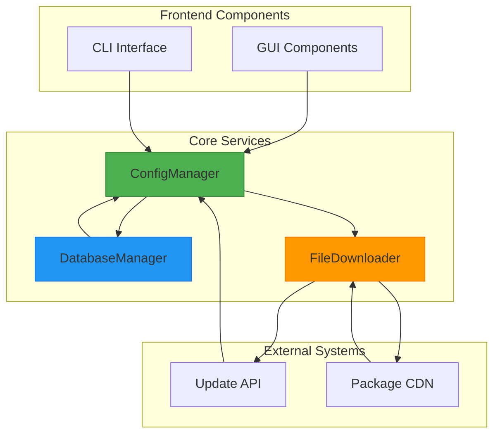
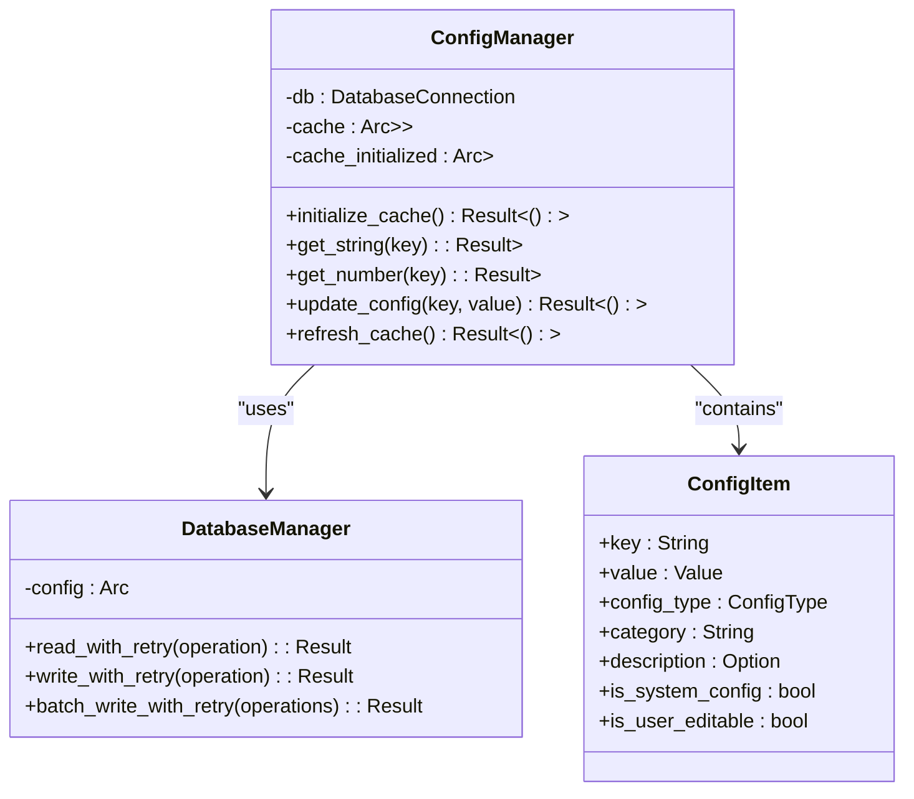
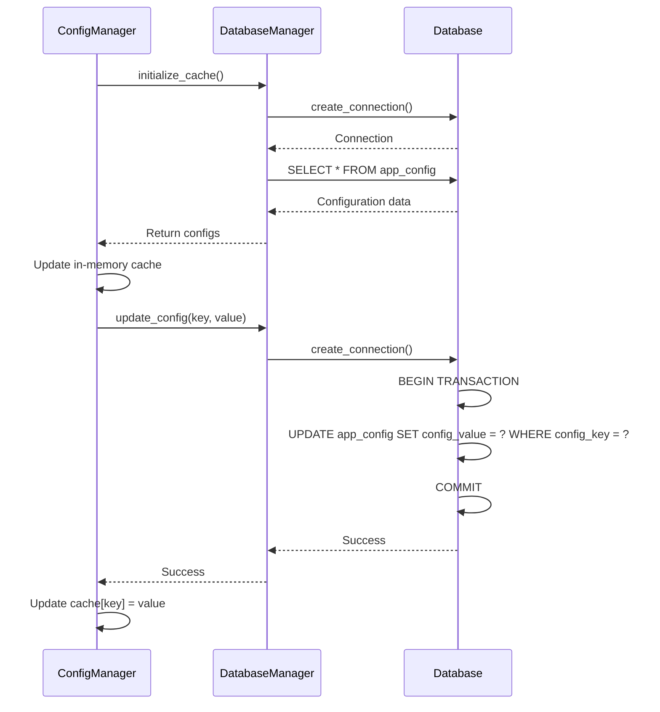
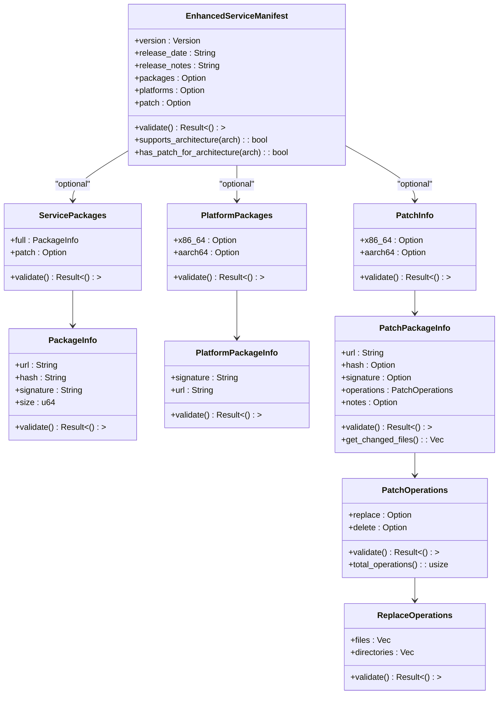
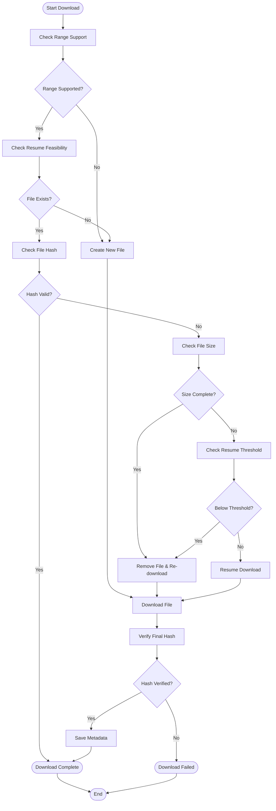
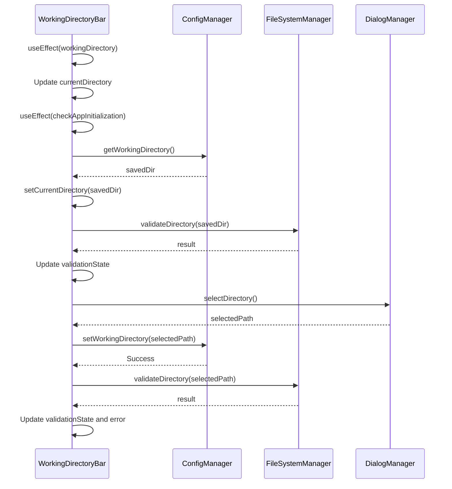
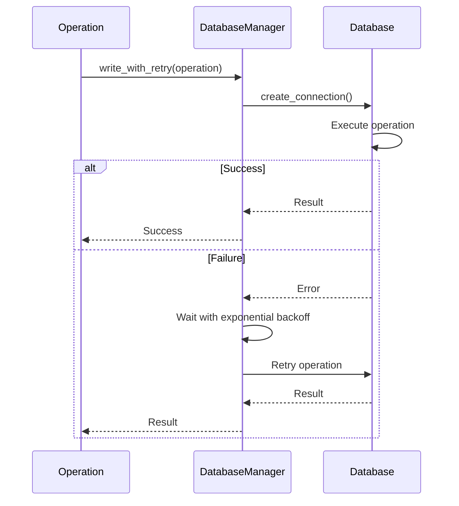

# State Synchronization and Caching

<cite>
**Referenced Files in This Document**   
- [config_manager.rs](file://client-core/src/config_manager.rs)
- [database_manager.rs](file://client-core/src/database_manager.rs)
- [api_types.rs](file://client-core/src/api_types.rs)
- [downloader.rs](file://client-core/src/downloader.rs)
- [WorkingDirectoryBar.tsx](file://cli-ui/src/components/WorkingDirectoryBar.tsx)
</cite>

## Table of Contents
1. [Introduction](#introduction)
2. [State Synchronization Architecture](#state-synchronization-architecture)
3. [Caching Mechanisms](#caching-mechanisms)
4. [Database and Configuration Coordination](#database-and-configuration-coordination)
5. [Service Manifest and Package Caching](#service-manifest-and-package-caching)
6. [UI State Synchronization](#ui-state-synchronization)
7. [Race Condition and Concurrency Handling](#race-condition-and-concurrency-handling)
8. [Conclusion](#conclusion)

## Introduction
This document provides a comprehensive analysis of the state synchronization and caching mechanisms in the Duck Client application. The system maintains consistent state across GUI, CLI, and core library components through a sophisticated architecture involving memory caching, database transactions, and event-driven updates. The document examines how service status, version information, and configuration settings are synchronized, and details the caching strategies for service manifests and downloaded packages to minimize network requests. Special attention is given to the coordination between the database manager and config manager for data consistency, including race condition prevention and file locking mechanisms.

## State Synchronization Architecture

The Duck Client application implements a multi-layered state synchronization architecture that ensures consistency across different components of the system. At the core of this architecture is the ConfigManager, which serves as the central authority for configuration data, and the DatabaseManager, which provides reliable data storage and retrieval capabilities.

The system maintains consistent state between the GUI, CLI, and core library through a combination of memory caching and database persistence. Configuration settings are stored in a DuckDB database and cached in memory for high-performance access. When configuration changes occur, they are first validated, then written to the database, and finally reflected in the in-memory cache.

Service status and version information are synchronized through a similar mechanism. The system periodically checks for updates and stores the latest service manifest in both the database and an in-memory cache. This ensures that all components of the application have access to the most current information without requiring repeated network requests.

**Diagram sources**
- [config_manager.rs](file://client-core/src/config_manager.rs)
- [database_manager.rs](file://client-core/src/database_manager.rs)
- [downloader.rs](file://client-core/src/downloader.rs)

**Section sources**
- [config_manager.rs](file://client-core/src/config_manager.rs)
- [database_manager.rs](file://client-core/src/database_manager.rs)

## Caching Mechanisms

The Duck Client employs a sophisticated caching strategy to reduce network requests and improve application performance. The caching system operates at multiple levels, from in-memory configuration caches to persistent file system caches for downloaded packages.

### Configuration Caching
The ConfigManager implements an in-memory cache using a thread-safe HashMap wrapped in an RwLock. This cache stores configuration items as ConfigItem structures, which include the key, value, type, category, and metadata about each configuration setting.

**Diagram sources**
- [config_manager.rs](file://client-core/src/config_manager.rs)

**Section sources**
- [config_manager.rs](file://client-core/src/config_manager.rs)

The configuration cache is initialized by loading all configuration items from the database into memory. Subsequent reads are served from the cache, significantly reducing database access. The cache is automatically initialized on first access through the ensure_cache_initialized method, which ensures that the cache is populated before any configuration queries are processed.

Cache invalidation is handled through explicit refresh operations. When configuration updates occur, the ConfigManager updates both the database and the in-memory cache atomically. For bulk updates, the entire cache is updated after the database transaction completes. The refresh_cache method allows for explicit cache invalidation when external changes are detected.

### Cache Initialization and Management
The cache initialization process follows a specific sequence to ensure data consistency:

1. Check if the cache has already been initialized
2. If not initialized, query the database for all configuration items
3. Parse the database results into ConfigItem structures
4. Populate the in-memory cache with the configuration items
5. Mark the cache as initialized

This initialization process is performed only once per application session, unless explicitly refreshed. The use of Arc<RwLock> allows multiple readers to access the cache simultaneously while ensuring exclusive access for writers, preventing race conditions during cache updates.

## Database and Configuration Coordination

The coordination between the DatabaseManager and ConfigManager is critical for maintaining data consistency across the application. This coordination involves transaction management, concurrency control, and error handling to ensure that configuration data remains consistent even under high load or in the presence of errors.

### DatabaseManager Design
The DatabaseManager is designed to handle both file-based and in-memory databases, with different concurrency strategies for each type. For file-based databases, each write operation creates a new connection, allowing for true concurrency. For in-memory databases, a single shared connection is protected by a Mutex to ensure data consistency.

**Diagram sources**
- [config_manager.rs](file://client-core/src/config_manager.rs)
- [database_manager.rs](file://client-core/src/database_manager.rs)

**Section sources**
- [config_manager.rs](file://client-core/src/config_manager.rs)
- [database_manager.rs](file://client-core/src/database_manager.rs)

The DatabaseManager implements a retry mechanism for handling transient errors, particularly write-write conflicts that can occur in concurrent environments. When a write operation fails due to a conflict, the system implements exponential backoff, waiting progressively longer between retry attempts. This approach balances responsiveness with the need to avoid overwhelming the database with repeated failed attempts.

### Transaction and Concurrency Control
The system uses a combination of database transactions and application-level locking to ensure data consistency. Write operations are wrapped in transactions that are retried on failure, while read operations can proceed concurrently. The ConfigManager ensures that cache updates are synchronized with database updates, preventing stale data from being served.

For file-based databases, DuckDB's built-in support for concurrent reads allows multiple readers to access the database simultaneously. Write operations are serialized to prevent conflicts. For in-memory databases, a single connection is shared among all operations, with a Mutex ensuring that only one operation can proceed at a time.

The batch_write_with_retry method allows multiple related updates to be performed as a single atomic operation. This is particularly important for configuration updates that involve multiple related settings, ensuring that the configuration remains consistent even if the application is interrupted during the update process.

## Service Manifest and Package Caching

The Duck Client implements a comprehensive caching strategy for service manifests and downloaded packages to minimize network requests and improve user experience. This strategy involves both in-memory caching of manifest data and persistent caching of downloaded packages on the file system.

### Service Manifest Structure
The system supports two formats for service manifests: a traditional format and an enhanced format that supports multiple architectures and incremental updates.

**Diagram sources**
- [api_types.rs](file://client-core/src/api_types.rs)

**Section sources**
- [api_types.rs](file://client-core/src/api_types.rs)

The EnhancedServiceManifest structure supports multiple architectures (x86_64 and aarch64) and incremental updates through patch information. This allows the system to download only the changes between versions when possible, significantly reducing bandwidth usage. The manifest includes validation methods to ensure the integrity of the data and methods to check architecture compatibility.

### Package Download and Caching
The FileDownloader class implements a sophisticated caching strategy for downloaded packages, including support for resumable downloads and integrity verification.

**Diagram sources**
- [downloader.rs](file://client-core/src/downloader.rs)

**Section sources**
- [downloader.rs](file://client-core/src/downloader.rs)

The downloader implements several key features for efficient package caching:

1. **Resumable Downloads**: The system checks if the server supports HTTP Range requests and uses this capability to resume interrupted downloads. This is particularly important for large package files that may take significant time to download.

2. **Integrity Verification**: Before resuming a download, the system verifies the integrity of the partially downloaded file by calculating its hash and comparing it to the expected value. If the hash doesn't match, the file is considered corrupted and is re-downloaded from the beginning.

3. **Metadata Management**: The downloader maintains metadata about each download in a separate .download file. This metadata includes the URL, expected size, expected hash, and the number of bytes already downloaded. This allows the system to resume downloads even after application restarts.

4. **Threshold-Based Resumption**: Small files below a configurable threshold (default 1MB) are always re-downloaded rather than resumed, as the overhead of checking resumability exceeds the benefit for small files.

5. **Object Storage Detection**: The system can detect URLs from common object storage providers (AWS S3, Aliyun OSS, Tencent COS, etc.) and CDN services, applying extended timeouts appropriate for large file downloads from these services.

## UI State Synchronization

The Duck Client's user interface components stay synchronized with backend state changes through a combination of prop-driven updates and independent initialization logic. The WorkingDirectoryBar component exemplifies this approach, demonstrating how UI elements maintain consistency with the application's underlying state.

### WorkingDirectoryBar Component Analysis
The WorkingDirectoryBar component manages the user's working directory selection and validation, serving as a critical interface between the user and the application's file system operations.

**Diagram sources**
- [WorkingDirectoryBar.tsx](file://cli-ui/src/components/WorkingDirectoryBar.tsx)

**Section sources**
- [WorkingDirectoryBar.tsx](file://cli-ui/src/components/WorkingDirectoryBar.tsx)

The component implements several key synchronization patterns:

1. **Prop-Driven Updates**: The component listens for changes to the workingDirectory prop through a useEffect hook. When the prop changes, the component updates its internal state to reflect the new directory, ensuring that it stays synchronized with the parent component's state.

2. **Independent Initialization**: The component includes logic to initialize itself if the main application has not yet done so. This ensures that the working directory functionality is available even if the component is rendered before the main application initialization completes.

3. **Configuration Persistence**: When the user selects a new working directory, the component saves this selection to the ConfigManager, ensuring that the choice persists across application restarts.

4. **Validation Feedback**: The component provides real-time feedback on the validity of the selected directory, using different visual states (valid, invalid, validating) to communicate the directory's status to the user.

The component's state management follows a clear flow:
- The current directory is stored in the component's state (currentDirectory)
- The validation state is tracked separately (validationState) with values for 'none', 'validating', 'valid', and 'invalid'
- Error messages are stored in a dedicated state variable (validationError)
- Visual elements (icons, colors, text) are derived from these state variables, ensuring consistency in the user interface

This approach allows the component to maintain a consistent state while providing a responsive user experience. The use of async/await in the validation and directory selection methods ensures that the UI remains responsive during potentially long-running operations.

## Race Condition and Concurrency Handling

The Duck Client application employs several strategies to handle race conditions and ensure data consistency in concurrent environments. These strategies operate at multiple levels, from database transactions to application-level synchronization primitives.

### Database-Level Concurrency Control
The DatabaseManager implements a robust concurrency model that handles the different characteristics of file-based and in-memory databases:

1. **File-Based Databases**: For file-based DuckDB databases, the system creates a new connection for each operation. This leverages DuckDB's built-in support for concurrent reads, allowing multiple readers to access the database simultaneously. Write operations are serialized to prevent conflicts.

2. **In-Memory Databases**: For in-memory databases, a single shared connection is protected by a Mutex. This ensures that only one operation can access the database at a time, preventing race conditions that could corrupt the in-memory data.

3. **Retry Mechanisms**: Both read and write operations include retry logic with exponential backoff. When an operation fails due to a transient error (such as a write-write conflict), the system waits for a short period and then retries the operation. The wait time increases exponentially with each retry attempt, preventing the system from overwhelming the database with repeated failed attempts.

**Diagram sources**
- [database_manager.rs](file://client-core/src/database_manager.rs)

**Section sources**
- [database_manager.rs](file://client-core/src/database_manager.rs)

### Application-Level Synchronization
At the application level, the ConfigManager uses several techniques to prevent race conditions:

1. **Thread-Safe Data Structures**: The in-memory cache is implemented using a HashMap wrapped in an RwLock, allowing multiple readers to access the cache simultaneously while ensuring exclusive access for writers.

2. **Atomic Updates**: When configuration updates occur, the system updates both the database and the in-memory cache within a single logical operation. This prevents scenarios where the database and cache contain inconsistent data.

3. **Initialization Guards**: The cache_initialized flag prevents multiple concurrent attempts to initialize the cache. The first call to ensure_cache_initialized will perform the initialization, while subsequent calls will wait for the initialization to complete.

4. **Validation Before Update**: Before updating a configuration value, the system validates that the user has permission to modify the setting and that the new value matches the expected type. This prevents invalid states from being written to the database.

The system also handles potential race conditions in the downloader component:

1. **Metadata File Locking**: The use of separate metadata files (.download) allows the system to track download progress without modifying the target file until the download is complete.

2. **Hash Verification**: Before resuming a download, the system verifies the integrity of the partially downloaded file. This prevents corruption that could occur if multiple processes attempted to write to the same file simultaneously.

3. **Threshold-Based Resumption**: By re-downloading small files rather than resuming them, the system avoids the complexity and potential race conditions associated with partial file updates for small files.

## Conclusion
The Duck Client application implements a comprehensive state synchronization and caching system that ensures data consistency across GUI, CLI, and core library components. The architecture combines in-memory caching for high-performance access with persistent database storage for reliability.

Key aspects of the system include:

1. **Centralized Configuration Management**: The ConfigManager serves as the single source of truth for configuration data, coordinating with the DatabaseManager to ensure data consistency.

2. **Sophisticated Caching**: The system employs multiple caching strategies, from in-memory configuration caches to persistent package caches, minimizing network requests and improving performance.

3. **Robust Concurrency Control**: The DatabaseManager implements appropriate concurrency models for both file-based and in-memory databases, with retry mechanisms to handle transient errors.

4. **Resumable Downloads**: The FileDownloader supports resumable downloads with integrity verification, allowing users to recover from interrupted downloads without starting over.

5. **UI-Backend Synchronization**: Components like WorkingDirectoryBar demonstrate how the UI stays synchronized with backend state through prop-driven updates and independent initialization logic.

6. **Race Condition Prevention**: The system uses thread-safe data structures, atomic updates, and initialization guards to prevent race conditions and ensure data consistency.

This architecture provides a solid foundation for a reliable and responsive application, balancing performance, consistency, and user experience. The modular design allows for future enhancements, such as event-driven updates to replace polling mechanisms and more sophisticated cache invalidation strategies.