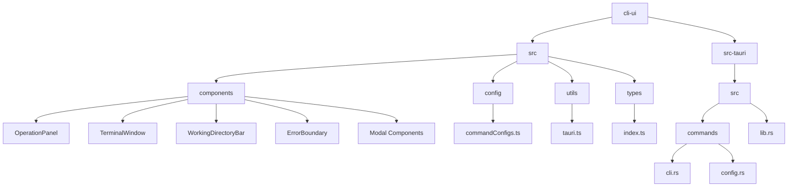
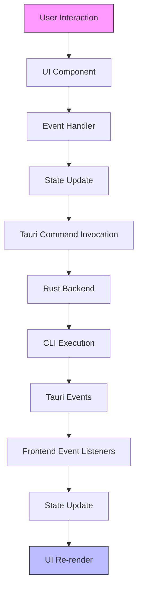
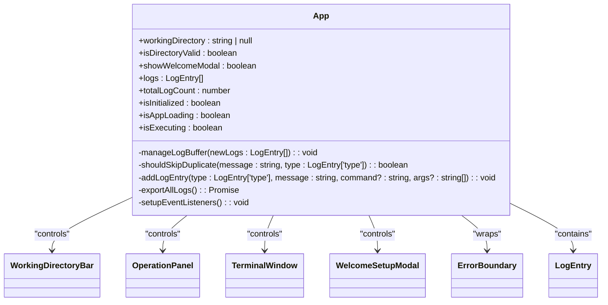
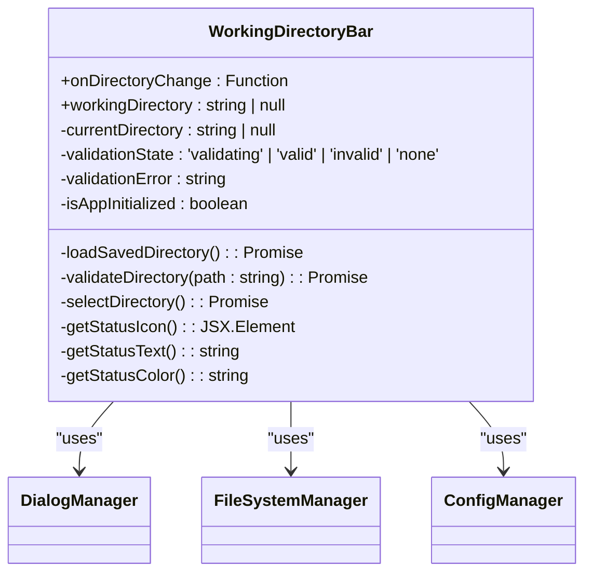
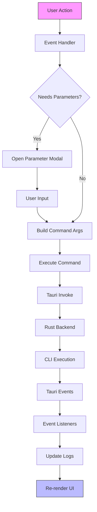
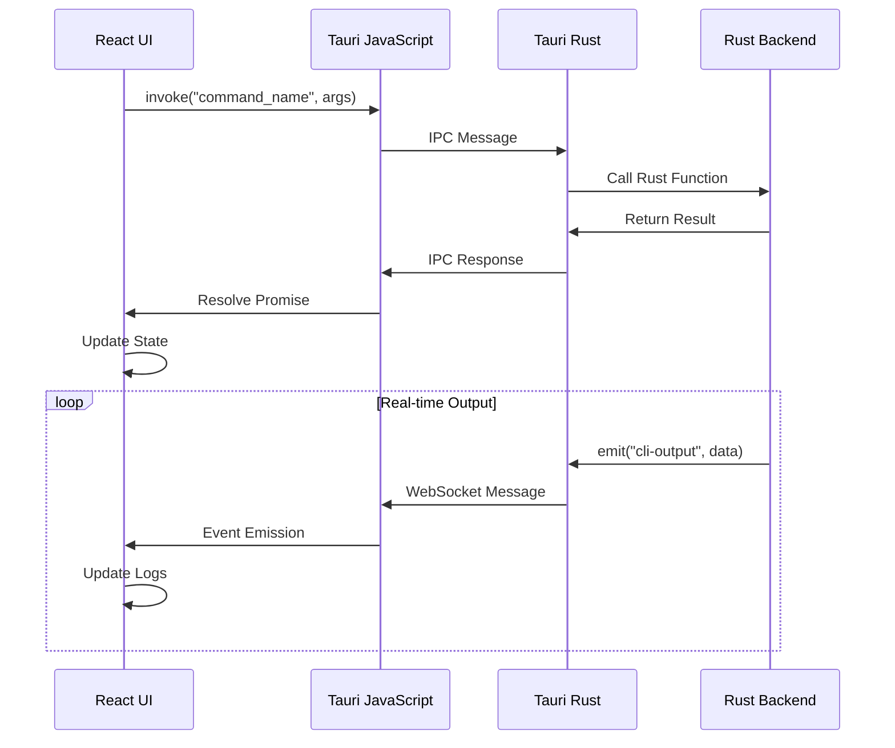
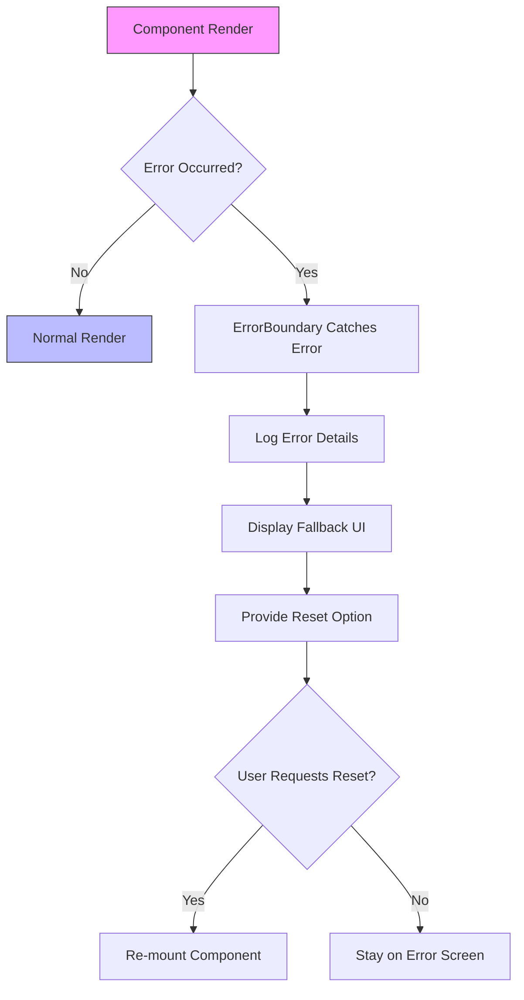

# GUI Component Architecture

<cite>
**Referenced Files in This Document**   
- [App.tsx](file://cli-ui/src/App.tsx)
- [OperationPanel.tsx](file://cli-ui/src/components/OperationPanel.tsx)
- [TerminalWindow.tsx](file://cli-ui/src/components/TerminalWindow.tsx)
- [WorkingDirectoryBar.tsx](file://cli-ui/src/components/WorkingDirectoryBar.tsx)
- [ErrorBoundary.tsx](file://cli-ui/src/components/ErrorBoundary.tsx)
- [tauri.ts](file://cli-ui/src/utils/tauri.ts)
- [commandConfigs.ts](file://cli-ui/src/config/commandConfigs.ts)
- [index.ts](file://cli-ui/src/types/index.ts)
- [cli.rs](file://cli-ui/src-tauri/src/commands/cli.rs)
- [config.rs](file://cli-ui/src-tauri/src/commands/config.rs)
- [mod.rs](file://cli-ui/src-tauri/src/commands/mod.rs)
- [lib.rs](file://cli-ui/src-tauri/src/lib.rs)
</cite>

## Table of Contents
1. [Introduction](#introduction)
2. [Project Structure](#project-structure)
3. [Core Components](#core-components)
4. [Architecture Overview](#architecture-overview)
5. [Detailed Component Analysis](#detailed-component-analysis)
6. [State Management and Event Flow](#state-management-and-event-flow)
7. [Tauri Integration and Backend Communication](#tauri-integration-and-backend-communication)
8. [Error Handling and Modal Management](#error-handling-and-modal-management)
9. [Extensibility and Best Practices](#extensibility-and-best-practices)
10. [Conclusion](#conclusion)

## Introduction
The GUI component architecture of the cli-ui application follows a modern React-based structure with Tauri integration for desktop functionality. The application provides a comprehensive interface for managing Docker services through the nuwax-cli tool, featuring a clean component hierarchy, robust state management, and seamless communication between frontend and backend systems. This document details the architecture starting from the root App component, examining key UI components, state management patterns, and the integration with Tauri commands that enable interaction with the Rust backend.

## Project Structure
The project follows a standard React-Tauri application structure with clear separation of concerns. The frontend components are organized in the cli-ui/src directory, while the Rust backend commands reside in cli-ui/src-tauri/src. The component-based architecture promotes reusability and maintainability, with specialized components handling specific UI concerns.



**Diagram sources**
- [App.tsx](file://cli-ui/src/App.tsx)
- [lib.rs](file://cli-ui/src-tauri/src/lib.rs)

## Core Components
The application's UI is built around several core components that work together to provide a cohesive user experience. The component hierarchy starts with App.tsx as the root component, which orchestrates the integration of major UI elements including OperationPanel, TerminalWindow, and WorkingDirectoryBar.

**Section sources**
- [App.tsx](file://cli-ui/src/App.tsx)
- [OperationPanel.tsx](file://cli-ui/src/components/OperationPanel.tsx)
- [TerminalWindow.tsx](file://cli-ui/src/components/TerminalWindow.tsx)
- [WorkingDirectoryBar.tsx](file://cli-ui/src/components/WorkingDirectoryBar.tsx)

## Architecture Overview
The application follows a unidirectional data flow pattern where state is managed at higher levels and passed down to child components through props. User interactions trigger events that flow upward or initiate actions that update the state and potentially communicate with the backend via Tauri commands.



**Diagram sources**
- [App.tsx](file://cli-ui/src/App.tsx)
- [tauri.ts](file://cli-ui/src/utils/tauri.ts)
- [cli.rs](file://cli-ui/src-tauri/src/commands/cli.rs)

## Detailed Component Analysis

### App Component Analysis
The App component serves as the root of the application, managing global state and coordinating the integration of major UI components. It handles application initialization, event listening, and state management for logs and working directory information.



**Diagram sources**
- [App.tsx](file://cli-ui/src/App.tsx)
- [types/index.ts](file://cli-ui/src/types/index.ts)

**Section sources**
- [App.tsx](file://cli-ui/src/App.tsx)

### OperationPanel Component Analysis
The OperationPanel component provides a set of actionable buttons for executing various commands on the Docker service. It manages the execution state of operations and handles parameter input for commands that require additional configuration.

```mermaid
classDiagram
class OperationPanel {
+workingDirectory : string | null
+isDirectoryValid : boolean
+executingActions : Set<string>
+parameterModalOpen : boolean
+backupSelectionModalOpen : boolean
+currentCommand : {actionId : string, config : CommandConfig, actionFn : Function} | null
-executeAction(actionId : string, actionFn : Function, commandId? : string) : Promise<void>
-handleParameterConfirm(parameters : ParameterInputResult) : Promise<void>
-handleParameterCancel() : void
-handleBackupSelectionConfirm(backupId : number, backupInfo : BackupRecord) : Promise<void>
-handleBackupSelectionCancel() : void
-buildCommandArgs(baseArgs : string[], parameters : ParameterInputResult, positionalParams : string[]) : string[]
}
OperationPanel --> ParameterInputModal : "uses"
OperationPanel --> BackupSelectionModal : "uses"
OperationPanel --> DialogManager : "uses"
OperationPanel --> UpdateManager : "uses"
OperationPanel --> CommandConfig : "uses"
OperationPanel --> ActionButton : "contains"
```

**Diagram sources**
- [OperationPanel.tsx](file://cli-ui/src/components/OperationPanel.tsx)
- [commandConfigs.ts](file://cli-ui/src/config/commandConfigs.ts)

**Section sources**
- [OperationPanel.tsx](file://cli-ui/src/components/OperationPanel.tsx)

### TerminalWindow Component Analysis
The TerminalWindow component displays the output logs from command execution, providing a console-like interface for monitoring the application's activities. It includes features for log management, export, and automatic scrolling.

```mermaid
classDiagram
class TerminalWindow {
+logs : LogEntry[]
+onClearLogs : Function
+isEnabled : boolean
+totalLogCount : number
+maxLogEntries : number
+onExportLogs : Function
-autoScroll : boolean
-userInteractedRef : Ref<boolean>
-isAutoScrollingRef : Ref<boolean>
-handleScroll() : void
-handleUserInteraction() : void
-scrollToBottom() : void
-exportLogs() : Promise<void>
-getMemoryUsage() : {currentLogs : number, percentage : number}
}
TerminalWindow --> LogEntry : "displays"
TerminalWindow --> DialogManager : "uses"
TerminalWindow --> Ref : "uses"
```

**Diagram sources**
- [TerminalWindow.tsx](file://cli-ui/src/components/TerminalWindow.tsx)
- [types/index.ts](file://cli-ui/src/types/index.ts)

**Section sources**
- [TerminalWindow.tsx](file://cli-ui/src/components/TerminalWindow.tsx)

### WorkingDirectoryBar Component Analysis
The WorkingDirectoryBar component manages the selection and validation of the working directory, which is essential for the application's operation. It provides a user interface for directory selection and displays the validation status.



**Diagram sources**
- [WorkingDirectoryBar.tsx](file://cli-ui/src/components/WorkingDirectoryBar.tsx)
- [tauri.ts](file://cli-ui/src/utils/tauri.ts)

**Section sources**
- [WorkingDirectoryBar.tsx](file://cli-ui/src/components/WorkingDirectoryBar.tsx)

## State Management and Event Flow

### State Management Patterns
The application employs React's useState and useRef hooks for state management, with a focus on maintaining a single source of truth for critical data. The App component manages global state such as logs and working directory information, which is then passed down to child components as props.

The logging system implements a circular buffer pattern to manage memory usage, automatically trimming old log entries when the maximum count is exceeded. This is achieved through the manageLogBuffer function which removes a batch of old entries when the log count exceeds the configured maximum.



**Diagram sources**
- [App.tsx](file://cli-ui/src/App.tsx)
- [OperationPanel.tsx](file://cli-ui/src/components/OperationPanel.tsx)
- [tauri.ts](file://cli-ui/src/utils/tauri.ts)

**Section sources**
- [App.tsx](file://cli-ui/src/App.tsx)
- [OperationPanel.tsx](file://cli-ui/src/components/OperationPanel.tsx)

### Event Handling Patterns
The application uses a combination of direct event handling and Tauri's event system for communication between frontend and backend. User interactions are handled by component event handlers, which may trigger Tauri commands to invoke Rust functions.

For real-time output from CLI commands, the application uses Tauri's event system with the listen function to subscribe to 'cli-output', 'cli-error', and 'cli-complete' events. These events are emitted by the Rust backend during command execution and are handled by the frontend to update the log display.

## Tauri Integration and Backend Communication

### Tauri Command Architecture
The application leverages Tauri's command system to bridge the React frontend with the Rust backend. The communication follows a request-response pattern where frontend JavaScript invokes Rust functions through the invoke method, and the Rust functions return results to the JavaScript caller.



**Diagram sources**
- [tauri.ts](file://cli-ui/src/utils/tauri.ts)
- [cli.rs](file://cli-ui/src-tauri/src/commands/cli.rs)
- [lib.rs](file://cli-ui/src-tauri/src/lib.rs)

**Section sources**
- [tauri.ts](file://cli-ui/src/utils/tauri.ts)
- [cli.rs](file://cli-ui/src-tauri/src/commands/cli.rs)

### Command Execution Flow
The command execution process involves several layers of abstraction that provide flexibility and error handling. The frontend uses utility classes in tauri.ts to abstract the Tauri command invocation, with different strategies for executing CLI commands.

The ShellManager class provides three methods for executing the nuwax-cli command:
1. executeDuckCli: Uses Tauri's sidecar feature for bundled binaries
2. executeSystemDuckCli: Uses the system's shell to execute the command
3. executeDuckCliSmart: Implements a fallback strategy, trying sidecar first and falling back to system execution if needed

This layered approach ensures maximum compatibility across different deployment scenarios and user environments.

## Error Handling and Modal Management

### Error Boundary Implementation
The application includes an ErrorBoundary component that wraps the main application to catch and handle JavaScript errors that occur during rendering. This prevents the entire application from crashing when a component encounters an error.

The ErrorBoundary uses React's error handling lifecycle methods to catch errors and display a fallback UI. It also provides functionality to log errors and potentially recover from them by resetting the component state.



**Section sources**
- [ErrorBoundary.tsx](file://cli-ui/src/components/ErrorBoundary.tsx)

### Modal Management
The application uses controlled modal components for user input and confirmation dialogs. The OperationPanel manages the state of two key modals:
1. ParameterInputModal: For collecting parameters for commands that require additional input
2. BackupSelectionModal: For selecting a backup to restore

The modal state is managed using React's useState hook, with the parent component (OperationPanel) controlling when modals are displayed and handling their confirmation/cancellation events. This pattern ensures that modal logic is centralized and consistent across the application.

## Extensibility and Best Practices

### Component Reusability
The application demonstrates several best practices for component reusability:
- **Single Responsibility**: Each component has a focused purpose (e.g., WorkingDirectoryBar only handles directory selection)
- **Controlled Components**: Components receive their state as props and communicate changes through callback functions
- **Type Safety**: TypeScript interfaces define clear contracts for component props and state
- **Configuration-Driven**: Command configurations are defined in a central file (commandConfigs.ts), making it easy to add new commands without modifying component code

### Adding New Features
To extend the UI with new features, follow these guidelines:
1. **Identify the appropriate component level**: Add new UI elements to the most specific component possible
2. **Define TypeScript interfaces**: Create types for new data structures in types/index.ts
3. **Use existing patterns**: Follow the established patterns for state management and event handling
4. **Leverage commandConfigs**: Add new command configurations to commandConfigs.ts to automatically integrate with the OperationPanel
5. **Implement Tauri commands**: Create new Rust functions in src-tauri/src/commands and expose them through the invoke system

The modular architecture makes it straightforward to add new operations by simply defining a new command configuration and implementing the corresponding backend functionality.

## Conclusion
The GUI component architecture of the cli-ui application demonstrates a well-structured React application with effective integration of Tauri for desktop functionality. The component hierarchy is logical and maintainable, with clear separation of concerns between different UI elements. The state management approach balances simplicity with functionality, using React hooks effectively while implementing patterns like the circular buffer for log management.

The integration with the Rust backend through Tauri commands is robust and flexible, with multiple execution strategies to ensure compatibility across different environments. The event-driven architecture for real-time command output provides a responsive user experience.

Key strengths of the architecture include:
- Clear component hierarchy with well-defined responsibilities
- Effective state management with memory optimization
- Robust error handling and user feedback mechanisms
- Flexible command system that supports easy extensibility
- Consistent patterns for user interaction and modal management

This architecture provides a solid foundation for future development while maintaining accessibility for users with varying levels of technical expertise.