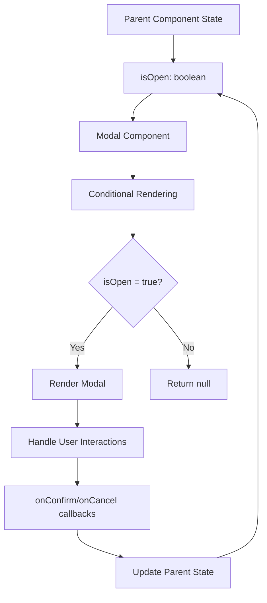
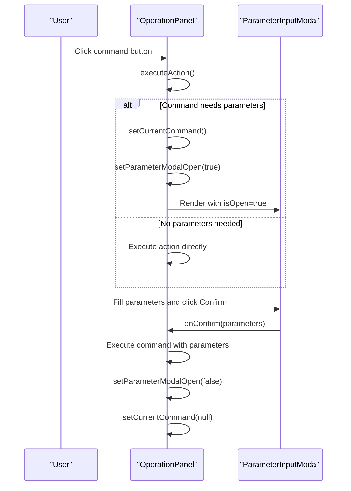
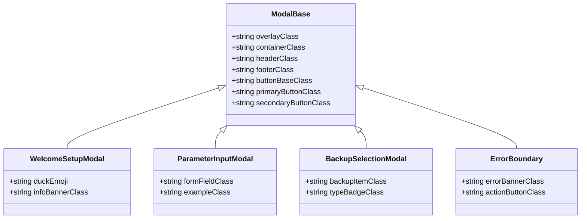
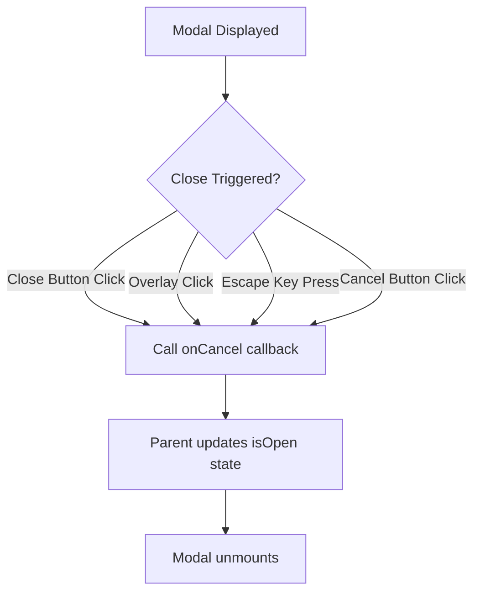
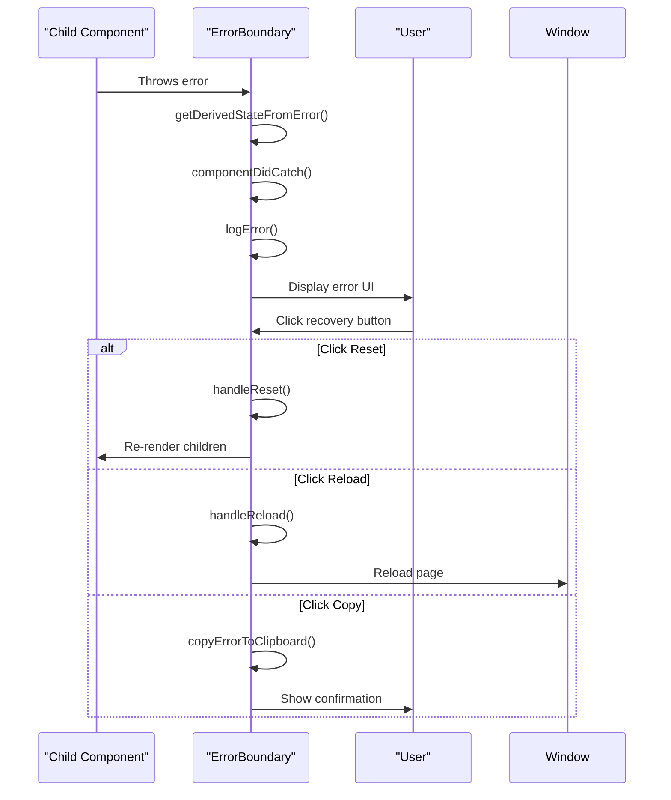
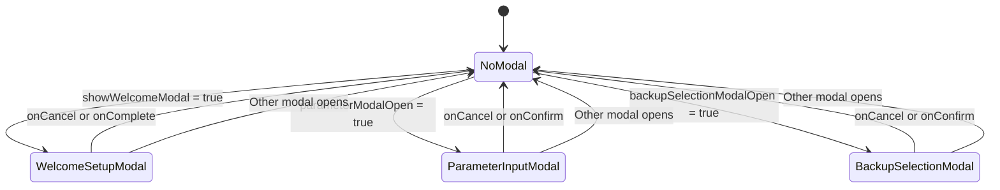

# Modal and Dialog System

<cite>
**Referenced Files in This Document**   
- [ParameterInputModal.tsx](file://cli-ui/src/components/ParameterInputModal.tsx)
- [WelcomeSetupModal.tsx](file://cli-ui/src/components/WelcomeSetupModal.tsx)
- [BackupSelectionModal.tsx](file://cli-ui/src/components/BackupSelectionModal.tsx)
- [ErrorBoundary.tsx](file://cli-ui/src/components/ErrorBoundary.tsx)
- [OperationPanel.tsx](file://cli-ui/src/components/OperationPanel.tsx)
- [App.tsx](file://cli-ui/src/App.tsx)
- [index.ts](file://cli-ui/src/types/index.ts)
</cite>

## Table of Contents
1. [Introduction](#introduction)
2. [Core Modal Components](#core-modal-components)
3. [Modal State Management and Triggering](#modal-state-management-and-triggering)
4. [Shared Modal Patterns](#shared-modal-patterns)
5. [Error Handling in Modals](#error-handling-in-modals)
6. [Accessibility and User Interaction](#accessibility-and-user-interaction)
7. [Modal Stacking and Z-Index Management](#modal-stacking-and-z-index-management)
8. [Creating New Modals](#creating-new-modals)
9. [Conclusion](#conclusion)

## Introduction
The Duck CLI GUI implements a comprehensive modal and dialog system to handle various user interactions, configuration tasks, and critical operations. This system provides a consistent user experience across different modal types while maintaining flexibility for specific use cases. The modals are designed to be accessible, responsive, and integrated with the application's state management system. This document details the architecture, implementation patterns, and best practices for working with the modal system in the Duck CLI GUI application.

## Core Modal Components

### WelcomeSetupModal
The WelcomeSetupModal component serves as the initial configuration interface when users first launch the application or when no working directory has been configured. This modal guides users through the process of selecting a working directory for the Duck CLI operations.

**Key Features:**
- Directory selection via system dialog or manual input
- Real-time directory validation with visual feedback
- Directory validation status indicators (valid/invalid)
- Recommended directory suggestions with one-click selection
- Working directory persistence through configuration manager

The modal displays informational guidance about working directory selection and validates the chosen directory for appropriate permissions and structure before saving it to the application configuration.

**Section sources**
- [WelcomeSetupModal.tsx](file://cli-ui/src/components/WelcomeSetupModal.tsx#L1-L227)

### ParameterInputModal
The ParameterInputModal is a dynamic parameter collection component used when executing commands that require user input. It renders form fields based on command configuration and collects parameter values before executing the associated action.

**Key Features:**
- Dynamic form generation based on CommandConfig parameters
- Support for multiple parameter types: text, number, boolean, select, and multiselect
- Parameter validation with custom rules and error messaging
- Default value initialization from command configuration
- Usage examples display for complex commands
- Real-time error validation and feedback

The modal accepts a CommandConfig object that defines the parameters needed, then renders appropriate input controls for each parameter type, handling both simple and complex input scenarios.

**Section sources**
- [ParameterInputModal.tsx](file://cli-ui/src/components/ParameterInputModal.tsx#L1-L288)
- [index.ts](file://cli-ui/src/types/index.ts#L38-L86)

### BackupSelectionModal
The BackupSelectionModal component enables users to select a backup for restoration, particularly before performing upgrades. It displays available backup records and allows selection of a specific backup version.

**Key Features:**
- Backup list retrieval from the Duck CLI manager
- Visual display of backup metadata (type, creation date, version, size)
- Backup type differentiation (Manual vs. PreUpgrade) with color coding
- File existence validation for each backup
- Loading states and error handling for backup retrieval
- Responsive design with scrollable content area

The modal fetches backup records from the backend when opened and presents them in a selectable list format, providing comprehensive information about each backup to inform the user's selection.

**Section sources**
- [BackupSelectionModal.tsx](file://cli-ui/src/components/BackupSelectionModal.tsx#L1-L303)

## Modal State Management and Triggering

### State Control and Lifecycle
Modals in the Duck CLI GUI are controlled through boolean state variables that determine their visibility. Each modal component accepts an `isOpen` prop that controls its display, following the controlled component pattern.

The primary state management occurs in parent components that maintain the modal visibility state:

**Section sources**
- [OperationPanel.tsx](file://cli-ui/src/components/OperationPanel.tsx#L45-L82)
- [App.tsx](file://cli-ui/src/App.tsx#L330-L365)

### Triggering Mechanisms
Modals are triggered by user interactions with application components, primarily through button clicks or automatic conditions. The triggering pattern follows a consistent approach across the application:

1. **Direct State Update**: Parent components update modal state directly
2. **Command-Based Triggering**: Commands that require parameters trigger the ParameterInputModal
3. **Application State Conditions**: Certain application states automatically trigger modals (e.g., missing configuration)

The OperationPanel component demonstrates the command-based triggering pattern, where commands that require parameters set the current command state and open the parameter modal:

**Section sources**
- [OperationPanel.tsx](file://cli-ui/src/components/OperationPanel.tsx#L84-L125)
- [ParameterInputModal.tsx](file://cli-ui/src/components/ParameterInputModal.tsx#L0-L51)

### Result Communication
Modals communicate results back to parent components through callback functions passed as props. This pattern ensures clean separation of concerns and predictable data flow:

- **onConfirm**: Called with modal-specific data when the user confirms the action
- **onCancel**: Called when the user cancels or closes the modal
- **onComplete**: Used in setup modals to indicate successful completion

For example, the ParameterInputModal returns collected parameter values to the parent component, which then executes the appropriate command with those parameters.

**Section sources**
- [ParameterInputModal.tsx](file://cli-ui/src/components/ParameterInputModal.tsx#L252-L288)
- [WelcomeSetupModal.tsx](file://cli-ui/src/components/WelcomeSetupModal.tsx#L204-L226)

## Shared Modal Patterns

### Styling Consistency
All modal components follow a consistent styling pattern that aligns with the application's design system:

- **Overlay**: Semi-transparent gray background (bg-gray-500 with opacity-75)
- **Container**: White background with rounded corners, shadow, and appropriate padding
- **Header**: Consistent title styling with close button in top-right corner
- **Content**: Structured layout with appropriate spacing and typography
- **Footer**: Action buttons with consistent styling and positioning

The z-index of 50 ensures modals appear above other application content.

**Section sources**
- [ParameterInputModal.tsx](file://cli-ui/src/components/ParameterInputModal.tsx#L203-L222)
- [BackupSelectionModal.tsx](file://cli-ui/src/components/BackupSelectionModal.tsx#L222-L242)
- [WelcomeSetupModal.tsx](file://cli-ui/src/components/WelcomeSetupModal.tsx#L102-L120)

### Close Behavior
All modals implement consistent close behavior through multiple mechanisms:

1. **Close Button**: X icon in the top-right corner
2. **Overlay Click**: Clicking the background overlay
3. **Escape Key**: Pressing the Escape key (implied by standard behavior)
4. **Action Buttons**: Cancel/Close buttons in the footer

The close behavior is standardized through the `onCancel` callback prop, which parent components implement to update the modal's visibility state.

**Section sources**
- [ParameterInputModal.tsx](file://cli-ui/src/components/ParameterInputModal.tsx#L203-L222)
- [BackupSelectionModal.tsx](file://cli-ui/src/components/BackupSelectionModal.tsx#L222-L242)

## Error Handling in Modals

### ErrorBoundary Component
The ErrorBoundary component serves as a global error handler that catches runtime errors within the component tree and displays a user-friendly error interface instead of crashing the application.

**Key Features:**
- Catches JavaScript errors anywhere in the component tree
- Displays a consistent error interface with error details
- Provides recovery options (reset, reload, copy error)
- Logs errors to local storage for debugging
- Includes development-mode details for easier troubleshooting

The ErrorBoundary wraps the entire application, ensuring that any unhandled errors in modals or other components are caught and handled gracefully.

**Section sources**
- [ErrorBoundary.tsx](file://cli-ui/src/components/ErrorBoundary.tsx#L1-L225)

### Modal-Specific Error Handling
Individual modals implement error handling appropriate to their functionality:

- **ParameterInputModal**: Validates input parameters and displays field-specific errors
- **BackupSelectionModal**: Handles API errors when retrieving backup lists
- **WelcomeSetupModal**: Validates directory selection and displays validation errors

Error states are managed locally within each modal component and displayed prominently to inform users of issues.

**Section sources**
- [ParameterInputModal.tsx](file://cli-ui/src/components/ParameterInputModal.tsx#L25-L45)
- [BackupSelectionModal.tsx](file://cli-ui/src/components/BackupSelectionModal.tsx#L85-L115)

## Accessibility and User Interaction

### Keyboard Navigation
The modal system implements standard keyboard navigation patterns to ensure accessibility:

- **Tab Navigation**: Users can tab through interactive elements in a logical order
- **Focus Management**: Initial focus is set to the first interactive element
- **Focus Trapping**: Focus remains within the modal while it is open
- **Escape Key**: Closes the modal (standard behavior)

All interactive elements include proper focus styling with visible focus rings (focus:ring-2 classes).

**Section sources**
- [ParameterInputModal.tsx](file://cli-ui/src/components/ParameterInputModal.tsx#L270-L276)
- [WelcomeSetupModal.tsx](file://cli-ui/src/components/WelcomeSetupModal.tsx#L131-L136)

### ARIA and Semantic HTML
While explicit ARIA attributes are not visible in the code, the modals use semantic HTML elements and proper labeling:

- **Dialog Roles**: Implicit through modal structure
- **Labeling**: Form fields are properly labeled
- **Status Messages**: Error and status messages are clearly presented
- **Interactive Elements**: Buttons and inputs have appropriate types and labels

The consistent use of heading levels (h3 for modal titles) provides proper document structure.

**Section sources**
- [ParameterInputModal.tsx](file://cli-ui/src/components/ParameterInputModal.tsx#L203-L222)
- [ErrorBoundary.tsx](file://cli-ui/src/components/ErrorBoundary.tsx#L132-L150)

## Modal Stacking and Z-Index Management

### Single Modal Constraint
The current implementation follows a single-modal-at-a-time pattern, preventing modal stacking:

- Only one modal type can be open at any given time
- Opening a new modal closes any existing modal
- State variables for different modals are mutually exclusive

This approach simplifies state management and prevents complex stacking issues, though it limits the ability to have nested modals.

**Section sources**
- [App.tsx](file://cli-ui/src/App.tsx#L330-L363)
- [OperationPanel.tsx](file://cli-ui/src/components/OperationPanel.tsx#L45-L82)

### Z-Index Strategy
The modal system uses a consistent z-index strategy to ensure proper layering:

- **z-50**: Applied to all modal containers
- **Fixed Positioning**: Modals use fixed positioning to appear above content
- **Overlay Layering**: Background overlay ensures modal content is focused

This simple strategy works effectively with the single-modal constraint, ensuring the active modal is always visible.

**Section sources**
- [ParameterInputModal.tsx](file://cli-ui/src/components/ParameterInputModal.tsx#L167-L201)
- [BackupSelectionModal.tsx](file://cli-ui/src/components/BackupSelectionModal.tsx#L167-L188)

## Creating New Modals

### Implementation Guidelines
When creating new modal components, follow these guidelines to maintain consistency with the existing system:

1. **Component Structure**: Create a new file in `cli-ui/src/components/` with the naming pattern `*Modal.tsx`
2. **Props Interface**: Define a props interface that extends the basic modal pattern:
   - `isOpen: boolean` - Controls visibility
   - `onConfirm: (data) => void` - Callback for successful completion
   - `onCancel: () => void` - Callback for cancellation
3. **Conditional Rendering**: Return null when `isOpen` is false
4. **Styling**: Use Tailwind classes consistent with existing modals
5. **Accessibility**: Ensure keyboard navigation and focus management
6. **Error Handling**: Implement appropriate error states and messaging

### Integration Pattern
Integrate new modals into the application by:

1. Importing the modal component in the parent component
2. Adding state to control modal visibility
3. Rendering the modal conditionally based on state
4. Implementing callback handlers to manage state changes
5. Connecting to appropriate triggers (button clicks, state changes, etc.)

The existing modal components serve as templates for new implementations, ensuring consistency across the application.

**Section sources**
- [ParameterInputModal.tsx](file://cli-ui/src/components/ParameterInputModal.tsx#L0-L51)
- [WelcomeSetupModal.tsx](file://cli-ui/src/components/WelcomeSetupModal.tsx#L1-L227)

## Conclusion
The modal and dialog system in the Duck CLI GUI provides a robust framework for user interactions, configuration, and critical operations. By following consistent patterns for state management, styling, and user interaction, the system ensures a cohesive user experience across different modal types. The implementation prioritizes accessibility, error handling, and clear communication between components. While the current single-modal constraint simplifies state management, future enhancements could consider supporting modal stacking for more complex workflows. The well-defined patterns and component structure make it straightforward to create new modals that integrate seamlessly with the existing system.