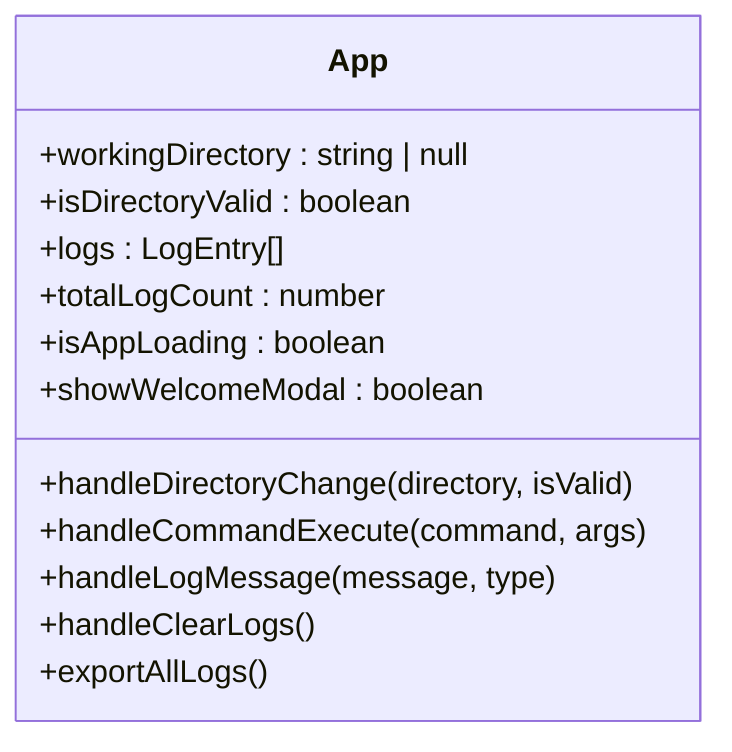
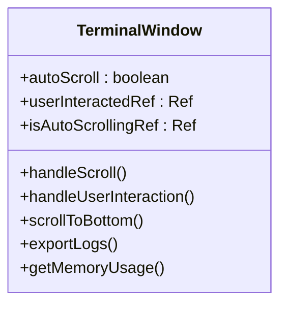
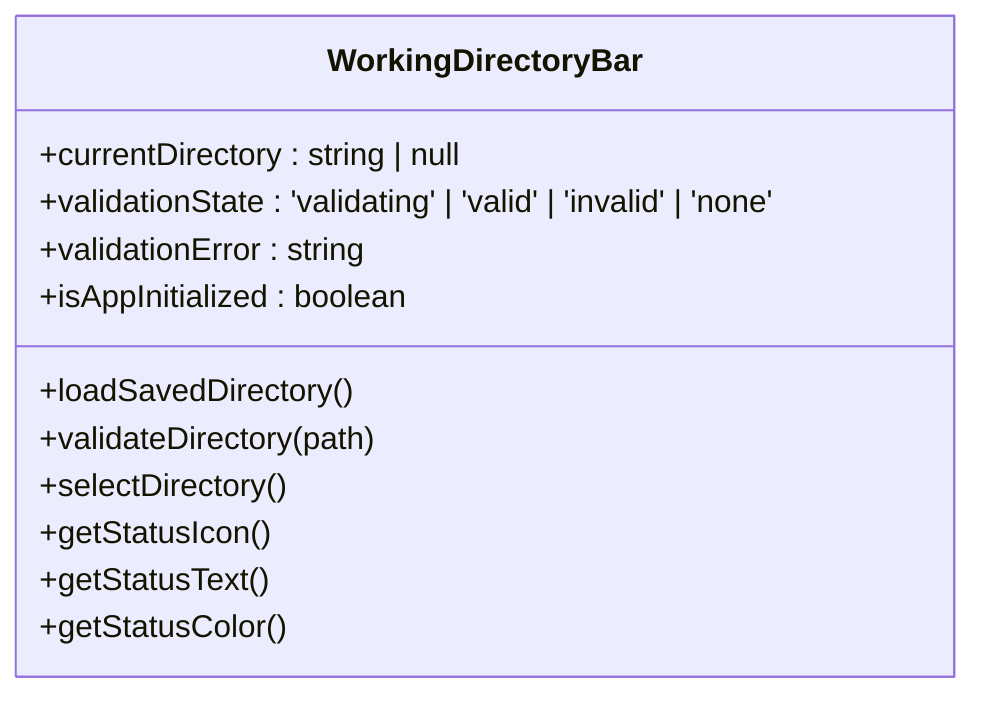
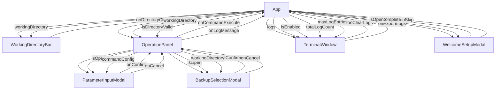
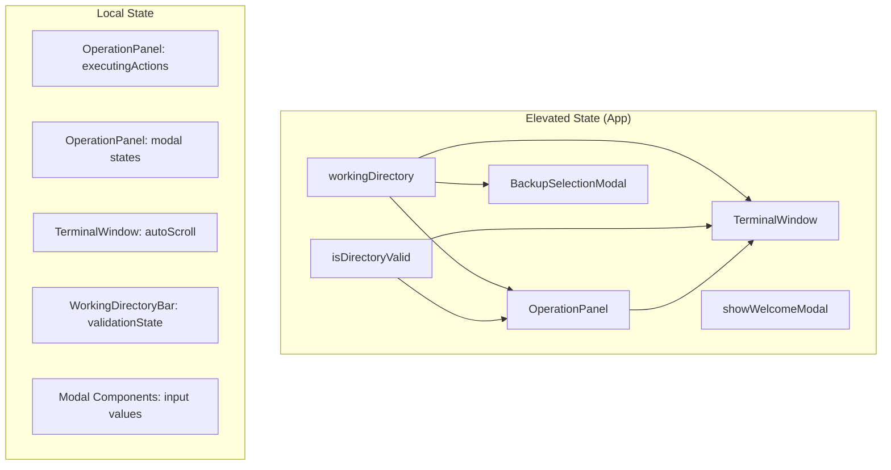
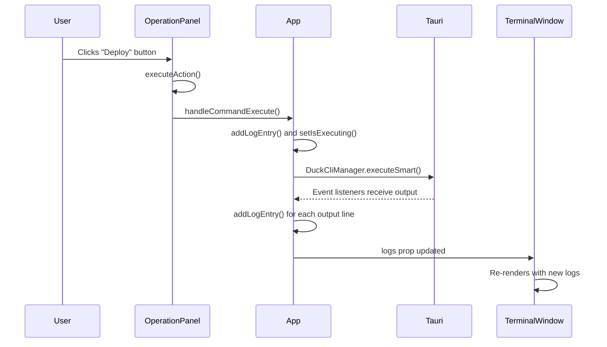
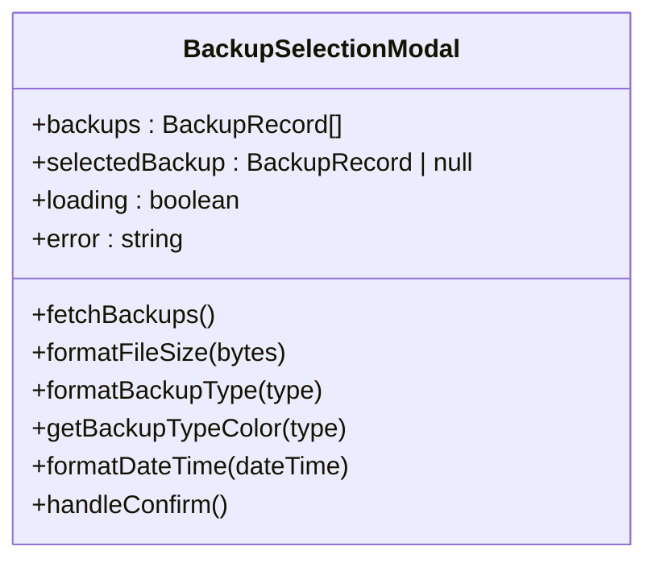
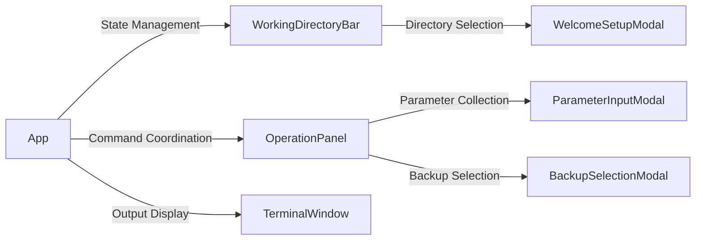

# React Component Hierarchy

<cite>
**Referenced Files in This Document**   
- [App.tsx](file://cli-ui/src/App.tsx)
- [OperationPanel.tsx](file://cli-ui/src/components/OperationPanel.tsx)
- [TerminalWindow.tsx](file://cli-ui/src/components/TerminalWindow.tsx)
- [WorkingDirectoryBar.tsx](file://cli-ui/src/components/WorkingDirectoryBar.tsx)
- [WelcomeSetupModal.tsx](file://cli-ui/src/components/WelcomeSetupModal.tsx)
- [ParameterInputModal.tsx](file://cli-ui/src/components/ParameterInputModal.tsx)
- [BackupSelectionModal.tsx](file://cli-ui/src/components/BackupSelectionModal.tsx)
</cite>

## Table of Contents
1. [Introduction](#introduction)
2. [Root Component: App](#root-component-app)
3. [Core UI Components](#core-ui-components)
4. [Component Relationships and Data Flow](#component-relationships-and-data-flow)
5. [State Management and Event Propagation](#state-management-and-event-propagation)
6. [Modal Components and User Interaction](#modal-components-and-user-interaction)
7. [Best Practices and Design Patterns](#best-practices-and-design-patterns)

## Introduction
This document provides a comprehensive analysis of the React component hierarchy within the cli-ui application. The application follows a clear parent-child relationship structure with App.tsx serving as the root component that orchestrates all major UI components. The architecture demonstrates proper separation of concerns, with distinct components handling specific responsibilities such as directory management, command execution, output display, and user interaction. The component hierarchy is designed to facilitate efficient state management and event propagation while maintaining reusability and maintainability.

## Root Component: App
The App component serves as the root of the component hierarchy and is responsible for managing the application's global state and coordinating communication between major UI components.



**Diagram sources**
- [App.tsx](file://cli-ui/src/App.tsx)

**Section sources**
- [App.tsx](file://cli-ui/src/App.tsx)

The App component manages several key states:
- **Working directory state**: Tracks the current working directory and its validation status
- **Log state**: Maintains a collection of log entries with circular buffering to prevent memory issues
- **Application state**: Controls loading status and modal visibility

The component initializes the application by checking for saved configuration and setting up Tauri event listeners for CLI output, errors, and completion events. It serves as the central hub for event handling, providing callback functions to child components for command execution and log management.

## Core UI Components

### OperationPanel
The OperationPanel component serves as the primary control interface, providing users with a set of actionable buttons for executing various commands.

```mermaid
classDiagram
class OperationPanel {
+executingActions : Set<string>
+parameterModalOpen : boolean
+backupSelectionModalOpen : boolean
+currentCommand : {actionId, config, actionFn} | null
+isDisabled : boolean
+executeAction(actionId, actionFn, commandId)
+handleParameterConfirm(parameters)
+handleParameterCancel()
+handleBackupSelectionConfirm(backupId, backupInfo)
+handleBackupSelectionCancel()
+buildCommandArgs(baseArgs, parameters, positionalParams)
}
```

**Diagram sources**
- [OperationPanel.tsx](file://cli-ui/src/components/OperationPanel.tsx)

**Section sources**
- [OperationPanel.tsx](file://cli-ui/src/components/OperationPanel.tsx)

The OperationPanel receives the following props from its parent App component:
- **workingDirectory**: Current working directory path
- **isDirectoryValid**: Validation status of the working directory
- **onCommandExecute**: Callback function for executing commands
- **onLogMessage**: Callback function for adding log messages

The component maintains local state to track:
- Currently executing actions to prevent duplicate execution
- Modal visibility for parameter input and backup selection
- Current command configuration when parameters are required

It renders a grid of action buttons, each representing a specific command or operation. The component handles both direct command execution and commands that require parameter input, delegating the parameter collection to the ParameterInputModal component.

### TerminalWindow
The TerminalWindow component displays command output and log information in a terminal-like interface.



**Diagram sources**
- [TerminalWindow.tsx](file://cli-ui/src/components/TerminalWindow.tsx)

**Section sources**
- [TerminalWindow.tsx](file://cli-ui/src/components/TerminalWindow.tsx)

The TerminalWindow receives the following props:
- **logs**: Array of log entries to display
- **onClearLogs**: Callback to clear all logs
- **isEnabled**: Boolean indicating if the terminal is enabled
- **totalLogCount**: Total number of logs generated (including trimmed ones)
- **maxLogEntries**: Maximum number of log entries to retain
- **onExportLogs**: Function to export logs to a file

The component implements auto-scrolling functionality that automatically scrolls to the bottom when new logs are added, unless the user has manually scrolled up. It provides controls for manual scrolling, clearing logs, and exporting logs to a file. The terminal displays different log types with appropriate styling and icons.

### WorkingDirectoryBar
The WorkingDirectoryBar component handles path navigation and directory validation.



**Diagram sources**
- [WorkingDirectoryBar.tsx](file://cli-ui/src/components/WorkingDirectoryBar.tsx)

**Section sources**
- [WorkingDirectoryBar.tsx](file://cli-ui/src/components/WorkingDirectoryBar.tsx)

The WorkingDirectoryBar receives:
- **onDirectoryChange**: Callback function to notify parent of directory changes
- **workingDirectory**: Optional prop to synchronize directory state

The component manages its own state for:
- Current directory selection
- Directory validation status
- Validation error messages

It provides a user interface for selecting a working directory through a file dialog and validates the selected directory using Tauri's file system utilities. The component displays the current directory path and validation status with appropriate visual indicators.

## Component Relationships and Data Flow



**Diagram sources**
- [App.tsx](file://cli-ui/src/App.tsx)
- [WorkingDirectoryBar.tsx](file://cli-ui/src/components/WorkingDirectoryBar.tsx)
- [OperationPanel.tsx](file://cli-ui/src/components/OperationPanel.tsx)
- [TerminalWindow.tsx](file://cli-ui/src/components/TerminalWindow.tsx)
- [WelcomeSetupModal.tsx](file://cli-ui/src/components/WelcomeSetupModal.tsx)
- [ParameterInputModal.tsx](file://cli-ui/src/components/ParameterInputModal.tsx)
- [BackupSelectionModal.tsx](file://cli-ui/src/components/BackupSelectionModal.tsx)

The component hierarchy follows a clear parent-child relationship with App as the root component. Data flows downward through props, while events and state changes flow upward through callback functions. The App component acts as the single source of truth for application state, which is then passed down to child components as needed.

The WorkingDirectoryBar component allows users to select and validate a working directory, communicating directory changes to the App component via the onDirectoryChange callback. The App component then propagates the updated directory information to other components that need it, such as OperationPanel and BackupSelectionModal.

The OperationPanel component serves as an intermediary for command execution, receiving user actions and forwarding them to the App component via the onCommandExecute callback. It also manages its own modals for parameter input and backup selection, handling the interaction with these components before forwarding the final command to the App component.

## State Management and Event Propagation

### State Management Strategy
The application employs a hybrid state management approach combining local component state with elevated state in the App component:



**Diagram sources**
- [App.tsx](file://cli-ui/src/App.tsx)
- [OperationPanel.tsx](file://cli-ui/src/components/OperationPanel.tsx)
- [TerminalWindow.tsx](file://cli-ui/src/components/TerminalWindow.tsx)
- [WorkingDirectoryBar.tsx](file://cli-ui/src/components/WorkingDirectoryBar.tsx)

State that affects multiple components or represents the overall application state is managed in the App component and passed down as props. State that is specific to a single component's UI behavior is managed locally within that component.

The App component uses useCallback to memoize callback functions, preventing unnecessary re-renders of child components. It also uses useRef to maintain references to functions for use in event listeners, avoiding potential stale closure issues.

### Event Propagation Pattern
The application follows a consistent event propagation pattern where child components communicate with parent components through callback props:



**Diagram sources**
- [App.tsx](file://cli-ui/src/App.tsx)
- [OperationPanel.tsx](file://cli-ui/src/components/OperationPanel.tsx)
- [TerminalWindow.tsx](file://cli-ui/src/components/TerminalWindow.tsx)

This unidirectional data flow ensures predictable state changes and makes the application easier to debug and test. Events always flow upward from child to parent, while data flows downward from parent to child.

## Modal Components and User Interaction

### WelcomeSetupModal
The WelcomeSetupModal component handles initial setup and directory selection when the application first launches.

```mermaid
classDiagram
class WelcomeSetupModal {
+selectedDirectory : string
+isValidating : boolean
+validationResult : {valid, error} | null
+handleSelectDirectory()
+validateDirectory(path)
+handleConfirm()
}
```

**Diagram sources**
- [WelcomeSetupModal.tsx](file://cli-ui/src/components/WelcomeSetupModal.tsx)

**Section sources**
- [WelcomeSetupModal.tsx](file://cli-ui/src/components/WelcomeSetupModal.tsx)

The modal displays a welcome message and guides users through selecting a working directory. It provides directory validation feedback and allows users to either confirm their selection or skip the setup process. Upon confirmation, it calls the onComplete callback with the selected directory, which triggers the App component to validate and set the working directory.

### ParameterInputModal
The ParameterInputModal component handles parameter input for commands that require user input.

```mermaid
classDiagram
class ParameterInputModal {
+parameters : ParameterInputResult
+errors : { [key : string] : string }
+updateParameter(name, value)
+validateParameters()
+renderParameterInput(param)
}
```

**Diagram sources**
- [ParameterInputModal.tsx](file://cli-ui/src/components/ParameterInputModal.tsx)

**Section sources**
- [ParameterInputModal.tsx](file://cli-ui/src/components/ParameterInputModal.tsx)

The modal receives a commandConfig prop that defines the parameters needed for a specific command. It dynamically renders input fields based on the parameter configuration, supporting various input types including text, number, boolean, select, and multiselect. The component handles input validation and provides real-time feedback on validation errors.

### BackupSelectionModal
The BackupSelectionModal component allows users to select a backup for restoration.



**Diagram sources**
- [BackupSelectionModal.tsx](file://cli-ui/src/components/BackupSelectionModal.tsx)

**Section sources**
- [BackupSelectionModal.tsx](file://cli-ui/src/components/BackupSelectionModal.tsx)

The modal fetches available backups from the backend using the DuckCliManager.getBackupList method. It displays a list of backups with relevant information such as creation time, version, file size, and backup type. Users can select a backup and confirm the restoration process, which triggers the rollback command through the OperationPanel.

## Best Practices and Design Patterns

### Separation of Concerns
The application demonstrates proper separation of concerns by dividing responsibilities among components:



**Diagram sources**
- [App.tsx](file://cli-ui/src/App.tsx)
- [WorkingDirectoryBar.tsx](file://cli-ui/src/components/WorkingDirectoryBar.tsx)
- [OperationPanel.tsx](file://cli-ui/src/components/OperationPanel.tsx)
- [TerminalWindow.tsx](file://cli-ui/src/components/TerminalWindow.tsx)
- [ParameterInputModal.tsx](file://cli-ui/src/components/ParameterInputModal.tsx)
- [BackupSelectionModal.tsx](file://cli-ui/src/components/BackupSelectionModal.tsx)
- [WelcomeSetupModal.tsx](file://cli-ui/src/components/WelcomeSetupModal.tsx)

Each component has a well-defined responsibility, making the codebase more maintainable and easier to understand. The App component focuses on state management and coordination, while specialized components handle specific UI tasks.

### Component Reusability
The modal components follow a reusable design pattern with consistent props:

```typescript
interface ModalProps {
  isOpen: boolean;
  onConfirm: () => void;
  onCancel: () => void;
}

// Shared pattern across:
// - WelcomeSetupModal
// - ParameterInputModal  
// - BackupSelectionModal
```

This consistent interface makes it easy to integrate new modal components and ensures a uniform user experience across the application.

### Error Handling and User Feedback
The application implements comprehensive error handling with user-friendly feedback:

- Visual indicators for directory validation status
- Real-time validation feedback in parameter input forms
- Clear error messages in modal dialogs
- Status indicators for command execution
- Toast notifications for important events

These patterns ensure users are always informed about the application's state and any issues that may occur during operation.