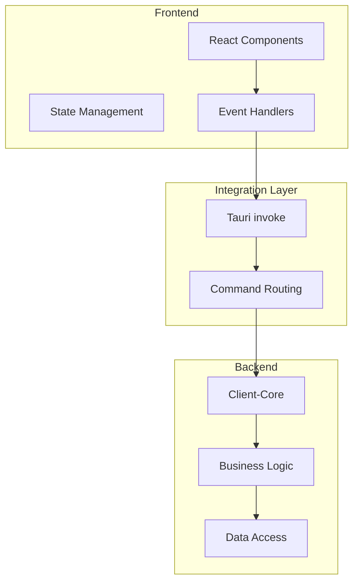
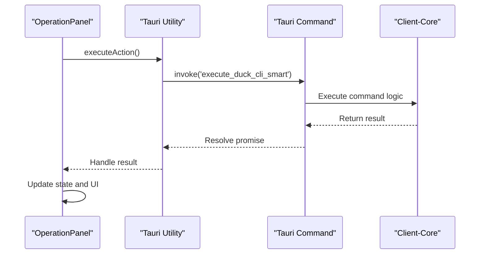
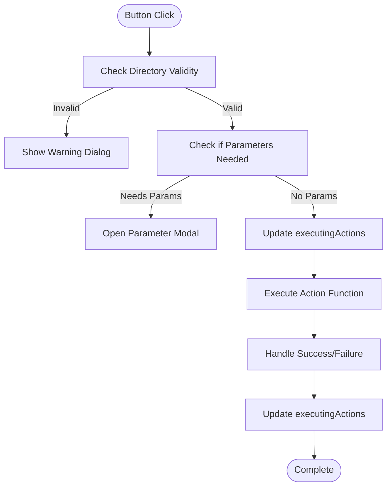
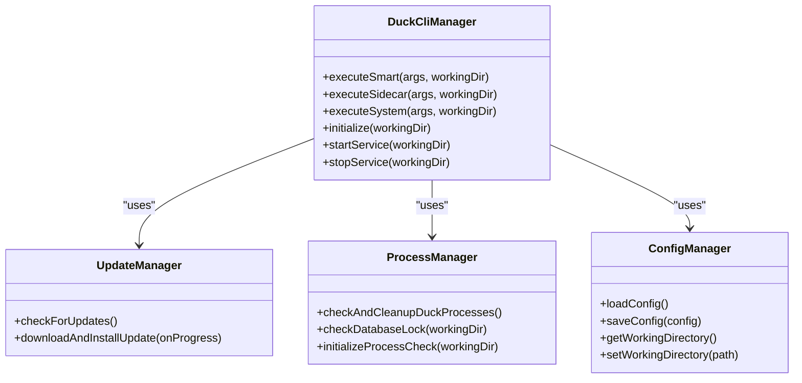
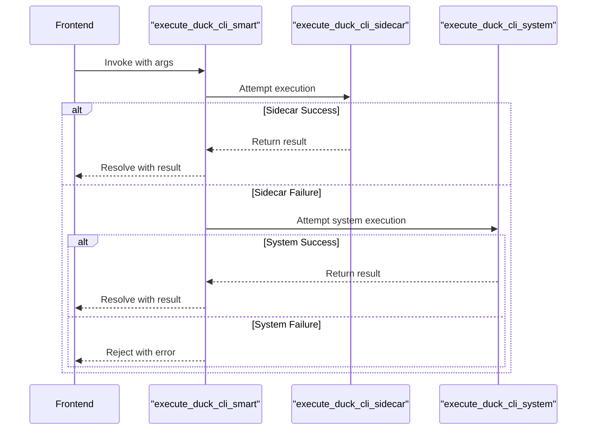
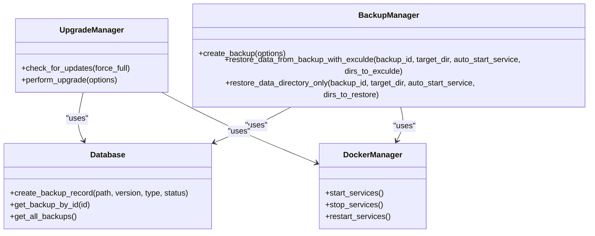
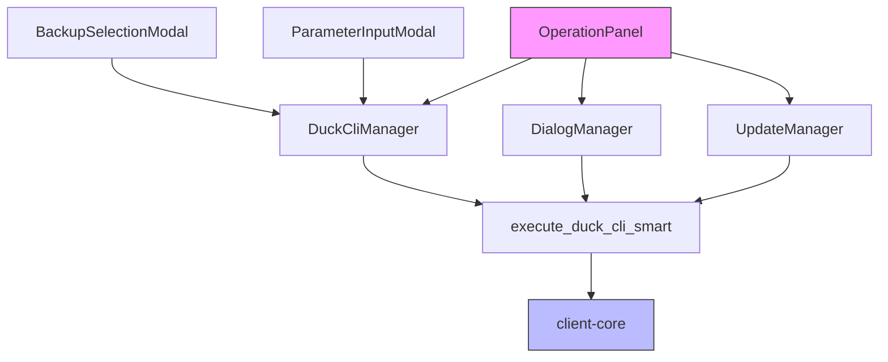

# State Management and Event Handling

<cite>
**Referenced Files in This Document**   
- [OperationPanel.tsx](file://cli-ui/src/components/OperationPanel.tsx)
- [tauri.ts](file://cli-ui/src/utils/tauri.ts)
- [mod.rs](file://cli-ui/src-tauri/src/commands/mod.rs)
- [cli.rs](file://cli-ui/src-tauri/src/commands/cli.rs)
- [lib.rs](file://client-core/src/lib.rs)
- [upgrade.rs](file://client-core/src/upgrade.rs)
- [backup.rs](file://client-core/src/backup.rs)
</cite>

## Table of Contents
1. [Introduction](#introduction)
2. [Project Structure](#project-structure)
3. [Core Components](#core-components)
4. [Architecture Overview](#architecture-overview)
5. [Detailed Component Analysis](#detailed-component-analysis)
6. [Dependency Analysis](#dependency-analysis)
7. [Performance Considerations](#performance-considerations)
8. [Troubleshooting Guide](#troubleshooting-guide)
9. [Conclusion](#conclusion)

## Introduction
This document provides a comprehensive analysis of state management and event handling patterns in the Duck Client GUI application. The system follows a modern React frontend architecture integrated with Tauri for backend communication, enabling a rich desktop application experience. The documentation focuses on how UI state is managed through React's useState hook, how user interactions trigger backend operations via Tauri's invoke system, and the complete flow from frontend events to backend execution in client-core. The analysis covers critical aspects including async state updates, error handling, race condition prevention, and performance optimization strategies.

## Project Structure
The Duck Client project follows a modular architecture with clear separation between frontend, backend, and core business logic components. The structure is organized into several key directories:

- **cli-ui**: Contains the React frontend application with components, utilities, and Tauri integration
- **client-core**: Houses the core business logic, data models, and service implementations in Rust
- **nuwax-cli**: Command-line interface implementation that can be invoked directly or through the UI
- **src-tauri**: Tauri-specific backend code that bridges the frontend and core logic
- **spec**: Design documentation and architectural specifications

The frontend uses React with TypeScript for UI components, while the backend leverages Rust for performance-critical operations. Tauri serves as the integration layer, allowing the React frontend to securely invoke Rust functions.



**Diagram sources**
- [OperationPanel.tsx](file://cli-ui/src/components/OperationPanel.tsx)
- [tauri.ts](file://cli-ui/src/utils/tauri.ts)
- [cli.rs](file://cli-ui/src-tauri/src/commands/cli.rs)

**Section sources**
- [OperationPanel.tsx](file://cli-ui/src/components/OperationPanel.tsx)
- [tauri.ts](file://cli-ui/src/utils/tauri.ts)

## Core Components
The core components of the state management and event handling system include the OperationPanel component for UI interactions, the Tauri utility classes for frontend-backend communication, and the command handlers in the Tauri backend. The OperationPanel manages UI state such as executing actions and modal visibility using React's useState hook. The Tauri utility classes provide a clean interface for invoking backend commands, while the command handlers in the Tauri backend route these invocations to the appropriate functions in client-core.

The system uses a class-based approach for utility functions, with specialized managers for different concerns:
- **DialogManager**: Handles user interactions and confirmation dialogs
- **UpdateManager**: Manages application updates and progress tracking
- **DuckCliManager**: Provides methods for executing CLI commands through Tauri
- **ProcessManager**: Handles process checking and cleanup operations

These components work together to create a responsive UI that accurately reflects the state of backend operations.

**Section sources**
- [OperationPanel.tsx](file://cli-ui/src/components/OperationPanel.tsx#L1-L199)
- [tauri.ts](file://cli-ui/src/utils/tauri.ts#L1-L199)

## Architecture Overview
The application follows a layered architecture where user interactions in the React frontend trigger state changes and invoke backend operations through Tauri. The architecture can be visualized as a flow from UI events to backend execution:

1. User interacts with a component (e.g., clicks a button in OperationPanel)
2. React event handler updates UI state (e.g., sets executingActions)
3. Handler calls tauri.invoke() through utility classes
4. Tauri command handler in Rust executes the requested operation
5. Results are returned to the frontend through the invoke promise
6. Frontend updates state and UI based on the results

This architecture ensures separation of concerns while maintaining a responsive user interface. The use of async/await throughout the stack enables non-blocking operations, and the event-driven model allows for real-time feedback during long-running operations.



**Diagram sources**
- [OperationPanel.tsx](file://cli-ui/src/components/OperationPanel.tsx)
- [tauri.ts](file://cli-ui/src/utils/tauri.ts)
- [cli.rs](file://cli-ui/src-tauri/src/commands/cli.rs)

## Detailed Component Analysis

### OperationPanel Analysis
The OperationPanel component serves as the primary interface for user actions in the application. It manages several pieces of UI state using React's useState hook:

- **executingActions**: A Set<string> that tracks which actions are currently being executed, enabling loading indicators
- **parameterModalOpen**: A boolean that controls the visibility of the parameter input modal
- **backupSelectionModalOpen**: A boolean that controls the visibility of the backup selection modal
- **currentCommand**: An object that stores context for the currently executing command

The component defines a collection of action buttons, each with an ID, title, description, icon, action function, and variant. When a user clicks a button, the executeAction function handles the interaction:



**Diagram sources**
- [OperationPanel.tsx](file://cli-ui/src/components/OperationPanel.tsx#L200-L500)

**Section sources**
- [OperationPanel.tsx](file://cli-ui/src/components/OperationPanel.tsx#L1-L506)

### Tauri Integration Analysis
The Tauri integration is implemented through utility classes in tauri.ts that provide a clean interface between the React frontend and the Tauri backend. The key classes include:

- **ShellManager**: Handles direct command execution
- **DialogManager**: Manages user dialogs and confirmations
- **FileSystemManager**: Provides file system operations
- **UpdateManager**: Handles application updates
- **ProcessManager**: Manages process checking and cleanup
- **ConfigManager**: Handles configuration storage and retrieval
- **DuckCliManager**: Centralizes CLI command execution

These classes use tauri.invoke() to communicate with the backend, abstracting the complexity of the Tauri API from the rest of the application. The DuckCliManager class implements a smart execution strategy that first attempts to use the Sidecar method and falls back to system commands if needed.



**Diagram sources**
- [tauri.ts](file://cli-ui/src/utils/tauri.ts#L600-L800)

**Section sources**
- [tauri.ts](file://cli-ui/src/utils/tauri.ts#L1-L919)

### Tauri Command Handler Analysis
The Tauri command handlers in cli.rs implement the backend logic for frontend invocations. These handlers are marked with the #[tauri::command] attribute and are automatically exposed to the frontend through tauri.invoke(). The key command handlers include:

- **execute_duck_cli_smart**: Implements the smart execution strategy with fallback
- **get_cli_version**: Retrieves the CLI version information
- **check_cli_available**: Checks if the CLI is available
- **check_and_cleanup_duck_processes**: Checks for and terminates conflicting processes
- **check_database_lock**: Determines if the database file is locked
- **debug_environment**: Provides debugging information about the environment

The execute_duck_cli_smart function implements a hybrid execution strategy that first attempts to use the Sidecar method and falls back to system commands if the Sidecar fails. This ensures maximum compatibility across different environments while maintaining security.



**Diagram sources**
- [cli.rs](file://cli-ui/src-tauri/src/commands/cli.rs#L200-L400)

**Section sources**
- [cli.rs](file://cli-ui/src-tauri/src/commands/cli.rs#L1-L628)

### Client-Core Business Logic Analysis
The client-core library contains the core business logic for the application, implemented in Rust for performance and safety. Key modules include:

- **upgrade.rs**: Handles service upgrades and update checking
- **backup.rs**: Manages data backup and restoration
- **container**: Interfaces with Docker for container management
- **database**: Handles database operations and backup records
- **api**: Communicates with external services

The UpgradeManager class in upgrade.rs coordinates the upgrade process, determining the appropriate strategy based on current and target versions. The BackupManager class in backup.rs handles both backup creation and restoration, with support for different backup types and compression levels.



**Diagram sources**
- [upgrade.rs](file://client-core/src/upgrade.rs#L1-L89)
- [backup.rs](file://client-core/src/backup.rs#L1-L199)

**Section sources**
- [upgrade.rs](file://client-core/src/upgrade.rs#L1-L90)
- [backup.rs](file://client-core/src/backup.rs#L1-L624)

## Dependency Analysis
The state management and event handling system has a clear dependency hierarchy that flows from the UI to the core business logic:



The frontend components depend on the Tauri utility classes, which in turn depend on the Tauri command handlers. The command handlers depend on the client-core library for business logic. This dependency structure ensures that UI concerns are separated from business logic, making the system more maintainable and testable.

**Diagram sources**
- [OperationPanel.tsx](file://cli-ui/src/components/OperationPanel.tsx)
- [tauri.ts](file://cli-ui/src/utils/tauri.ts)
- [cli.rs](file://cli-ui/src-tauri/src/commands/cli.rs)

**Section sources**
- [OperationPanel.tsx](file://cli-ui/src/components/OperationPanel.tsx#L1-L506)
- [tauri.ts](file://cli-ui/src/utils/tauri.ts#L1-L919)
- [cli.rs](file://cli-ui/src-tauri/src/commands/cli.rs#L1-L628)

## Performance Considerations
The state management and event handling system includes several performance optimizations:

1. **Async Operations**: All backend interactions are performed asynchronously to prevent UI blocking
2. **Loading States**: The executingActions state provides visual feedback during operations
3. **Error Boundaries**: The ErrorBoundary component prevents crashes from propagating
4. **Connection Pooling**: Database connections are managed efficiently
5. **Background Tasks**: Long-running operations are offloaded to background threads

To minimize re-renders, the system uses React's useState with functional updates and avoids unnecessary state changes. The Set data structure for executingActions allows for efficient addition and removal of action IDs.

For high-frequency operations, consider implementing debouncing or throttling to prevent overwhelming the backend. Additionally, caching frequently accessed data can reduce redundant operations and improve responsiveness.

## Troubleshooting Guide
Common issues in the state management and event handling system include:

**Race Conditions**: When multiple operations are triggered simultaneously, ensure proper state management by using functional updates:
```typescript
setExecutingActions(prev => new Set(prev).add(actionId));
```

**Stale Closures**: In async functions, ensure access to current state by using the callback form of state setters rather than relying on closure values.

**Unhandled Promise Rejections**: Always wrap tauri.invoke() calls in try-catch blocks and provide appropriate error handling:
```typescript
try {
    await actionFn();
} catch (error) {
    onLogMessage(`操作失败: ${error}`, 'error');
}
```

**Process Conflicts**: The system includes process checking and cleanup functionality to prevent conflicts with existing CLI instances.

**Environment Issues**: The debug_environment command provides detailed information about the execution environment, helping diagnose command availability issues.

**Section sources**
- [OperationPanel.tsx](file://cli-ui/src/components/OperationPanel.tsx#L1-L506)
- [tauri.ts](file://cli-ui/src/utils/tauri.ts#L1-L919)
- [cli.rs](file://cli-ui/src-tauri/src/commands/cli.rs#L1-L628)

## Conclusion
The Duck Client application implements a robust state management and event handling system that effectively bridges the React frontend with the Rust backend through Tauri. The architecture follows best practices with clear separation of concerns, proper async handling, and comprehensive error management. Key strengths include the smart execution strategy for CLI commands, the responsive UI state management, and the well-structured dependency hierarchy. The system provides a solid foundation for a desktop application with complex backend operations while maintaining a responsive and user-friendly interface.