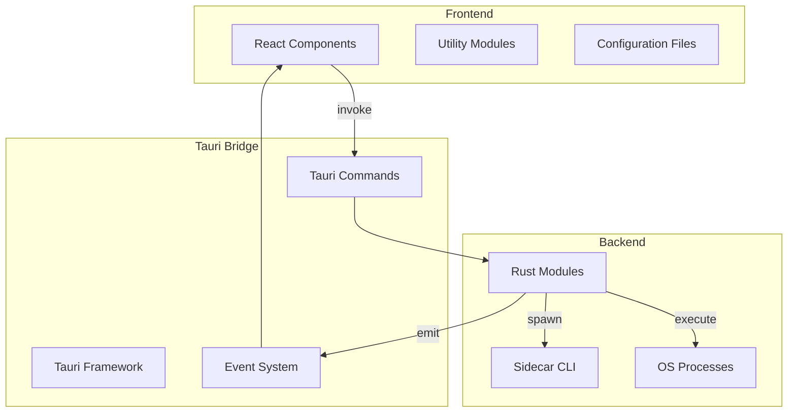
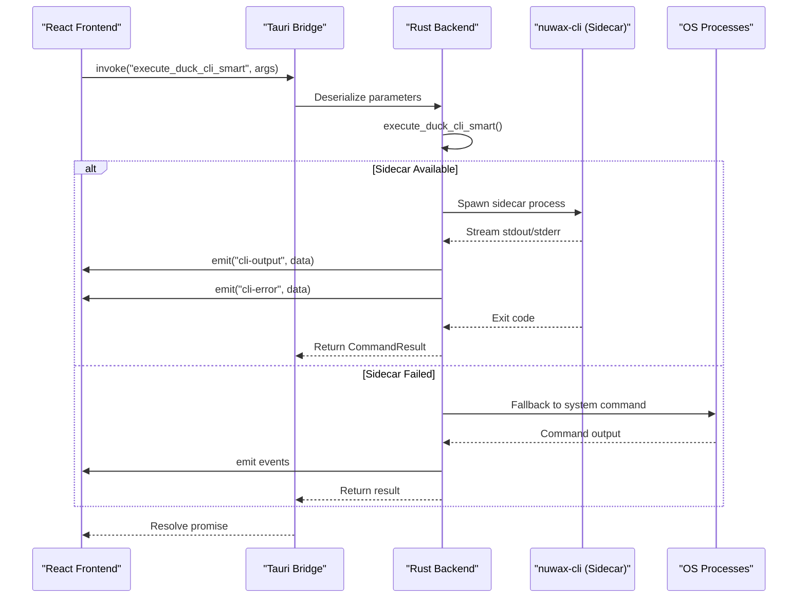
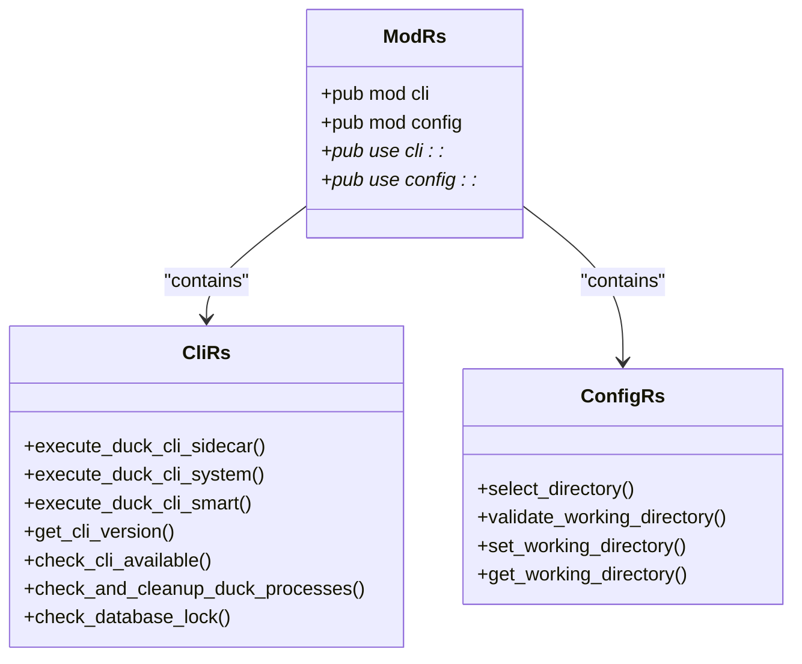
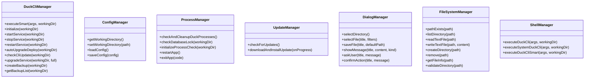
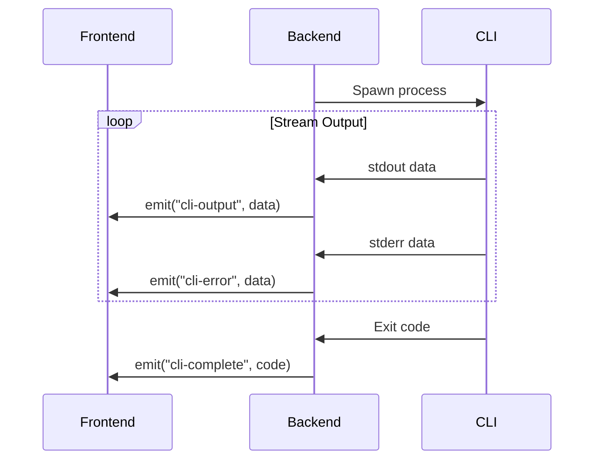
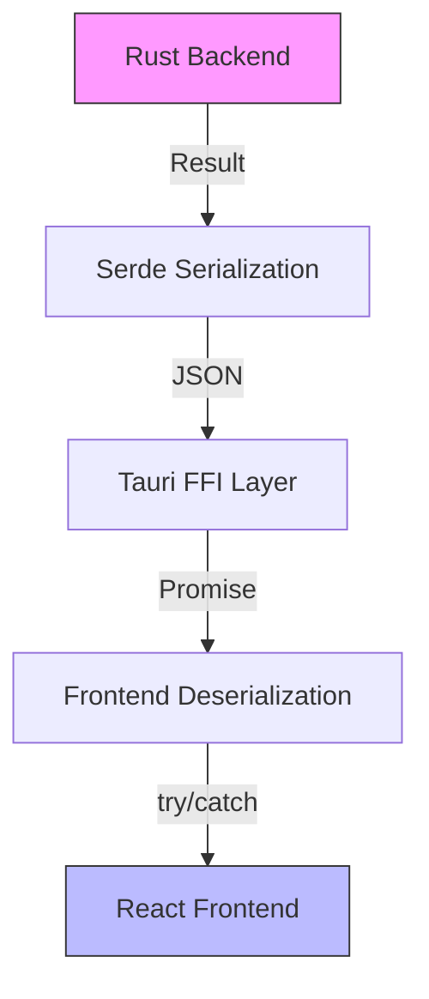

# UI-Backend Integration via Tauri Commands

<cite>
**Referenced Files in This Document**   
- [OperationPanel.tsx](file://cli-ui/src/components/OperationPanel.tsx)
- [tauri.ts](file://cli-ui/src/utils/tauri.ts)
- [mod.rs](file://cli-ui/src-tauri/src/commands/mod.rs)
- [cli.rs](file://cli-ui/src-tauri/src/commands/cli.rs)
- [config.rs](file://cli-ui/src-tauri/src/commands/config.rs)
- [main.rs](file://cli-ui/src-tauri/src/main.rs)
</cite>

## Table of Contents
1. [Introduction](#introduction)
2. [Project Structure](#project-structure)
3. [Core Components](#core-components)
4. [Architecture Overview](#architecture-overview)
5. [Detailed Component Analysis](#detailed-component-analysis)
6. [Command Definition and Implementation](#command-definition-and-implementation)
7. [Frontend Integration and Abstraction](#frontend-integration-and-abstraction)
8. [Bidirectional Communication and Event Handling](#bidirectional-communication-and-event-handling)
9. [Error Handling and Security Considerations](#error-handling-and-security-considerations)
10. [Troubleshooting Guide](#troubleshooting-guide)

## Introduction
This document provides a comprehensive analysis of the integration mechanism between the React frontend and Rust backend in the Duck Client application using Tauri commands. The system enables secure, type-safe communication between the UI layer and native backend functionality, allowing the application to execute CLI operations, manage configurations, and handle system processes. The integration follows a structured pattern where commands are defined in Rust modules, exposed through Tauri's FFI layer, and consumed by the frontend via a typed utility abstraction.

## Project Structure
The project follows a standard Tauri application structure with a clear separation between the frontend UI components and the backend Rust logic. The `cli-ui` directory contains the React frontend implementation, while the `src-tauri` directory houses the Rust backend code that interfaces with system resources and external processes.



**Diagram sources**
- [main.rs](file://cli-ui/src-tauri/src/main.rs)
- [mod.rs](file://cli-ui/src-tauri/src/commands/mod.rs)

**Section sources**
- [main.rs](file://cli-ui/src-tauri/src/main.rs)
- [mod.rs](file://cli-ui/src-tauri/src/commands/mod.rs)

## Core Components
The integration system consists of several core components that work together to enable seamless communication between the frontend and backend:

- **Tauri Commands**: Rust functions exposed to the frontend via the `#[command]` macro
- **Command Modules**: Organized Rust modules (`cli.rs`, `config.rs`) that group related functionality
- **Frontend Utility**: TypeScript classes that abstract Tauri's `invoke` calls with type safety
- **Event System**: Real-time communication channel for streaming command output
- **Error Handling**: Structured error propagation across the FFI boundary

These components form a robust integration layer that allows the React frontend to securely execute system-level operations while maintaining a clean separation of concerns.

**Section sources**
- [tauri.ts](file://cli-ui/src/utils/tauri.ts)
- [cli.rs](file://cli-ui/src-tauri/src/commands/cli.rs)
- [config.rs](file://cli-ui/src-tauri/src/commands/config.rs)

## Architecture Overview
The application architecture follows a layered pattern where the React frontend communicates with the Rust backend through Tauri's command system. Commands are defined in Rust modules and exposed to the frontend, which invokes them asynchronously. The backend can also emit events back to the frontend for real-time updates, such as command output or progress updates.



**Diagram sources**
- [cli.rs](file://cli-ui/src-tauri/src/commands/cli.rs)
- [tauri.ts](file://cli-ui/src/utils/tauri.ts)

## Detailed Component Analysis

### Command Module Structure
The backend command system is organized into modular components that group related functionality. The `mod.rs` file serves as the command registry, exporting all available commands to the Tauri application.



**Diagram sources**
- [mod.rs](file://cli-ui/src-tauri/src/commands/mod.rs)
- [cli.rs](file://cli-ui/src-tauri/src/commands/cli.rs)
- [config.rs](file://cli-ui/src-tauri/src/commands/config.rs)

### Command Definition and Implementation

#### Command Definition in mod.rs
The `mod.rs` file in the commands directory serves as the central registry for all Tauri commands. It uses Rust's module system to organize commands into logical groups and re-exports them for use by the Tauri application.

```rust
pub mod cli;
pub mod config;

pub use cli::*;
pub use config::*;
```

This structure allows the main application to import all commands through a single module path, simplifying the command registration process in Tauri.

**Section sources**
- [mod.rs](file://cli-ui/src-tauri/src/commands/mod.rs)

#### Command Implementation in cli.rs
The `cli.rs` file contains implementations for commands related to CLI execution, process management, and system integration. Key aspects include:

- **Command Functions**: Functions annotated with `#[command]` macro to expose them to the frontend
- **Parameter Serialization**: Automatic serialization/deserialization of parameters using Serde
- **Async Execution**: All commands are async to prevent blocking the main thread
- **Error Handling**: Structured error types that provide meaningful feedback

```rust
#[command]
pub async fn execute_duck_cli_sidecar(
    app: AppHandle,
    args: Vec<String>,
    working_dir: Option<String>,
) -> Result<CommandResult, String> {
    // Implementation details
}
```

The command functions follow a consistent pattern:
1. Accept parameters that are automatically deserialized from JSON
2. Perform the requested operation using appropriate system APIs
3. Return a result that is serialized back to JSON for the frontend

**Section sources**
- [cli.rs](file://cli-ui/src-tauri/src/commands/cli.rs)

#### Command Implementation in config.rs
The `config.rs` file implements commands for working directory management and configuration persistence. These commands handle file system operations and user preferences.

```rust
#[command]
pub async fn set_working_directory(app: AppHandle, path: String) -> Result<(), String> {
    // Validate directory
    let validation = validate_working_directory(app.clone(), path.clone()).await?;
    
    if !validation.valid {
        return Err(validation.error.unwrap_or("Directory invalid".to_string()));
    }
    
    // Save configuration
    let config = WorkingDirectoryConfig {
        path: path.clone(),
        last_updated: get_current_rfc3339_timestamp(),
        user_selected: true,
    };
    
    // Persist to app data directory
    let config_dir = app.path().app_data_dir()?;
    let config_file = config_dir.join("working_directory.json");
    let config_json = serde_json::to_string_pretty(&config)?;
    
    fs::write(&config_file, &config_json)?;
    
    Ok(())
}
```

The configuration commands demonstrate proper error handling and validation, ensuring that only valid directory paths are stored.

**Section sources**
- [config.rs](file://cli-ui/src-tauri/src/commands/config.rs)

## Frontend Integration and Abstraction

### Tauri Utility Abstraction
The frontend utility `tauri.ts` provides a typed abstraction over Tauri's raw `invoke` API, enhancing type safety and error handling.



**Diagram sources**
- [tauri.ts](file://cli-ui/src/utils/tauri.ts)

### Type Safety and Error Mapping
The utility classes provide strong typing and structured error handling:

```typescript
export class DuckCliManager {
  static async executeSmart(
    args: string[], 
    workingDir?: string
  ): Promise<{ success: boolean; exit_code: number; stdout: string; stderr: string }> {
    try {
      return await invoke('execute_duck_cli_smart', { 
        args, 
        workingDir: workingDir || null 
      });
    } catch (error) {
      return {
        success: false,
        exit_code: -1,
        stdout: '',
        stderr: `Smart execution failed: ${error}`
      };
    }
  }
}
```

Key benefits include:
- **Type Safety**: Return types are explicitly defined
- **Error Mapping**: Errors are caught and transformed into structured responses
- **Default Values**: Optional parameters are handled gracefully
- **Consistent Interface**: All methods follow the same pattern

**Section sources**
- [tauri.ts](file://cli-ui/src/utils/tauri.ts)

### Operation Panel Integration
The `OperationPanel.tsx` component demonstrates how the utility classes are used in practice:

```typescript
const executeAction = async (actionId: string, actionFn: () => Promise<void>) => {
  if (isDisabled) {
    await DialogManager.showMessage('Warning', 'Please set a valid working directory', 'warning');
    return;
  }
  
  setExecutingActions(prev => new Set(prev).add(actionId));
  
  try {
    await actionFn();
  } catch (error) {
    onLogMessage(`Operation failed: ${error}`, 'error');
  } finally {
    setExecutingActions(prev => {
      const newSet = new Set(prev);
      newSet.delete(actionId);
      return newSet;
    });
  }
};
```

The component uses the `DuckCliManager` to execute commands and the `DialogManager` for user interaction, demonstrating a clean separation of concerns.

**Section sources**
- [OperationPanel.tsx](file://cli-ui/src/components/OperationPanel.tsx)

## Bidirectional Communication and Event Handling

### Real-time Output Streaming
The system supports bidirectional communication through Tauri's event system, allowing the backend to stream output to the frontend in real-time.



The `execute_duck_cli_sidecar` function demonstrates this pattern:

```rust
let (mut rx, mut _child) = cmd.spawn()?;
while let Some(event) = rx.recv().await {
    match event {
        CommandEvent::Stdout(data) => {
            let output = String::from_utf8_lossy(&data);
            stdout.push_str(&output);
            let _ = app.emit("cli-output", &output);
        }
        CommandEvent::Stderr(data) => {
            let output = String::from_utf8_lossy(&data);
            stderr.push_str(&output);
            let _ = app.emit("cli-error", &output);
        }
        CommandEvent::Terminated(payload) => {
            exit_code = payload.code.unwrap_or(-1);
            let _ = app.emit("cli-complete", exit_code);
            break;
        }
    }
}
```

**Section sources**
- [cli.rs](file://cli-ui/src-tauri/src/commands/cli.rs)

### Progress Reporting
The system supports progress reporting for long-running operations through callback functions:

```typescript
static async downloadAndInstallUpdate(
  onProgress?: (downloaded: number, total: number) => void
): Promise<void> {
  await update.downloadAndInstall((event: any) => {
    switch (event.event) {
      case 'Started':
        if (onProgress) onProgress(0, totalSize);
        break;
      case 'Progress':
        if (onProgress) onProgress(downloadedSize, totalSize);
        break;
      case 'Finished':
        if (onProgress) onProgress(totalSize, totalSize);
        break;
    }
  });
}
```

This pattern allows the frontend to display progress bars and other visual indicators for operations like updates.

**Section sources**
- [tauri.ts](file://cli-ui/src/utils/tauri.ts)

## Error Handling and Security Considerations

### Error Handling Across FFI Boundary
The system implements robust error handling across the FFI boundary:



Key principles:
- **Structured Errors**: Backend returns `Result<T, String>` where errors are descriptive strings
- **Automatic Serialization**: Serde handles conversion between Rust types and JSON
- **Promise-based**: Frontend uses async/await with try/catch for error handling
- **User-friendly Messages**: Errors are presented in a user-friendly manner

**Section sources**
- [cli.rs](file://cli-ui/src-tauri/src/commands/cli.rs)
- [tauri.ts](file://cli-ui/src/utils/tauri.ts)

### Security Considerations
The system addresses several security concerns:

#### Command Injection Prevention
- **Parameter Validation**: All input parameters are validated before use
- **Whitelisted Commands**: Only predefined commands can be executed
- **Sandboxed Execution**: Commands run in a controlled environment

```rust
// Working directory is validated before use
let validation = validate_working_directory(app.clone(), path.clone()).await?;
if !validation.valid {
    return Err(validation.error.unwrap_or("Directory invalid".to_string()));
}
```

#### Input Validation
- **Directory Validation**: Checks for existence, readability, and writability
- **Path Sanitization**: Uses PathBuf for safe path operations
- **Permission Checks**: Verifies user has appropriate permissions

```rust
// Enhanced environment variables are carefully constructed
let enhanced_env = get_user_environment();
for (key, value) in enhanced_env {
    cmd = cmd.env(key, value);
}
```

#### Process Management
- **Process Cleanup**: Checks for and terminates conflicting processes
- **Database Lock Detection**: Prevents concurrent access to database files
- **Resource Management**: Properly cleans up temporary files and resources

**Section sources**
- [cli.rs](file://cli-ui/src-tauri/src/commands/cli.rs)
- [config.rs](file://cli-ui/src-tauri/src/commands/config.rs)

## Troubleshooting Guide

### Common Integration Issues

#### Command Not Found
**Symptoms**: `invoke` calls fail with "command not found" errors
**Causes**:
- Command not properly exported in `mod.rs`
- Typo in command name
- Tauri configuration not including the command

**Solutions**:
1. Verify the command is exported in `mod.rs`
2. Check for typos in the command name
3. Ensure the command is included in `tauri.conf.json`

```rust
// Ensure command is exported
pub use cli::*;
pub use config::*;
```

#### Serialization Errors
**Symptoms**: `invoke` calls fail with JSON parsing errors
**Causes**:
- Parameter types don't implement `Serialize`/`Deserialize`
- Complex types not properly annotated
- Circular references in data structures

**Solutions**:
1. Ensure all parameter types derive `Serialize` and `Deserialize`
2. Use `#[serde]` attributes to control serialization
3. Simplify complex types or use wrapper types

```rust
#[derive(Debug, Serialize, Deserialize)]
pub struct CommandResult {
    pub success: bool,
    pub exit_code: i32,
    pub stdout: String,
    pub stderr: String,
}
```

#### Unresponsive UI
**Symptoms**: UI freezes during command execution
**Causes**:
- Blocking operations on the main thread
- Long-running synchronous code
- Missing async/await keywords

**Solutions**:
1. Ensure all command functions are `async`
2. Use non-blocking I/O operations
3. Implement progress reporting for long operations

```rust
#[command]
pub async fn execute_duck_cli_smart(...) -> Result<CommandResult, String> {
    // Async function prevents UI blocking
}
```

#### Environment Issues
**Symptoms**: Commands fail due to missing dependencies or environment variables
**Causes**:
- PATH not properly configured
- Required tools not installed
- Environment variables not inherited

**Solutions**:
1. Use `get_user_environment()` to enhance environment variables
2. Provide clear error messages about missing dependencies
3. Implement fallback mechanisms

```rust
// Enhanced environment includes common Docker paths
fn get_user_environment() -> std::collections::HashMap<String, String> {
    // Implementation adds Docker paths to PATH
}
```

**Section sources**
- [cli.rs](file://cli-ui/src-tauri/src/commands/cli.rs)
- [tauri.ts](file://cli-ui/src/utils/tauri.ts)
- [OperationPanel.tsx](file://cli-ui/src/components/OperationPanel.tsx)