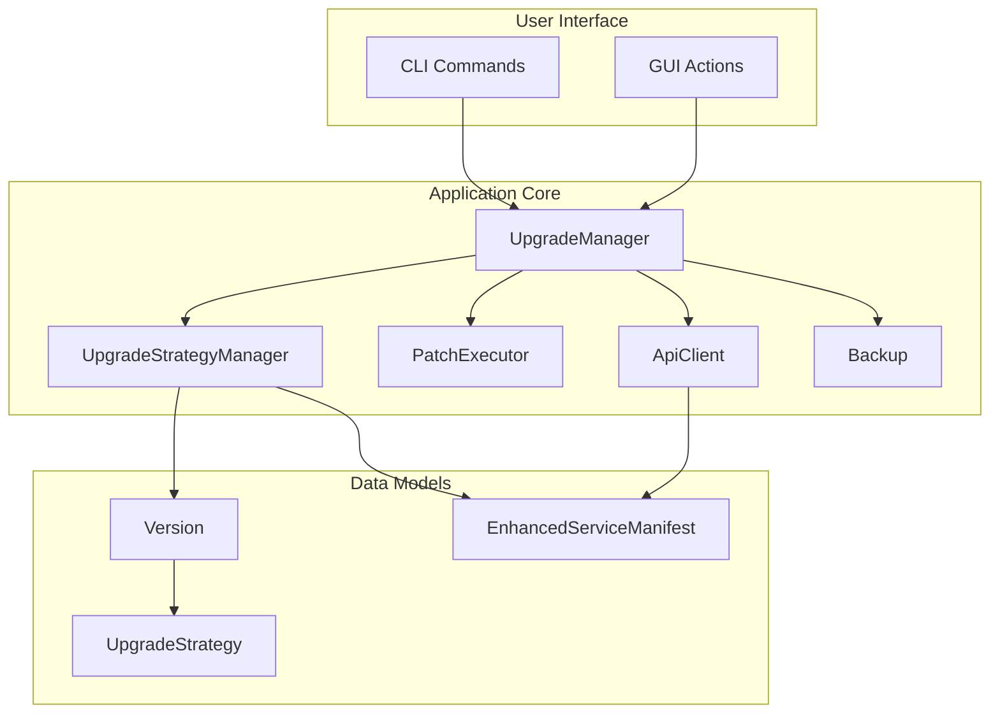
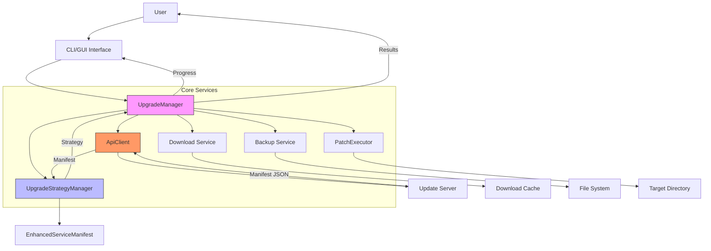
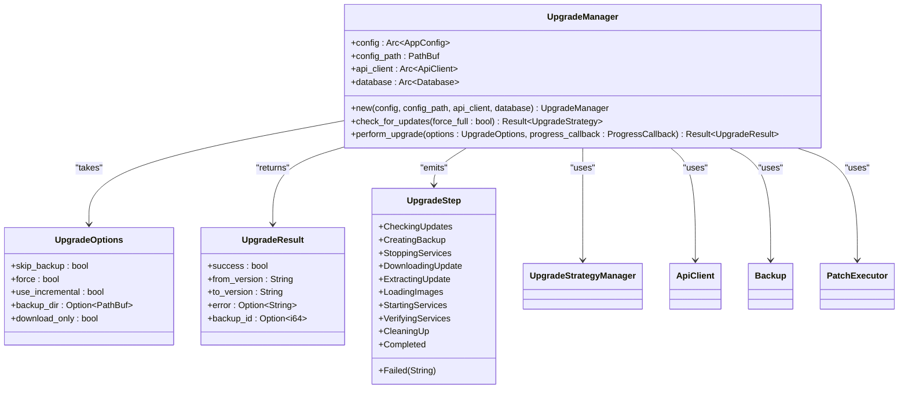
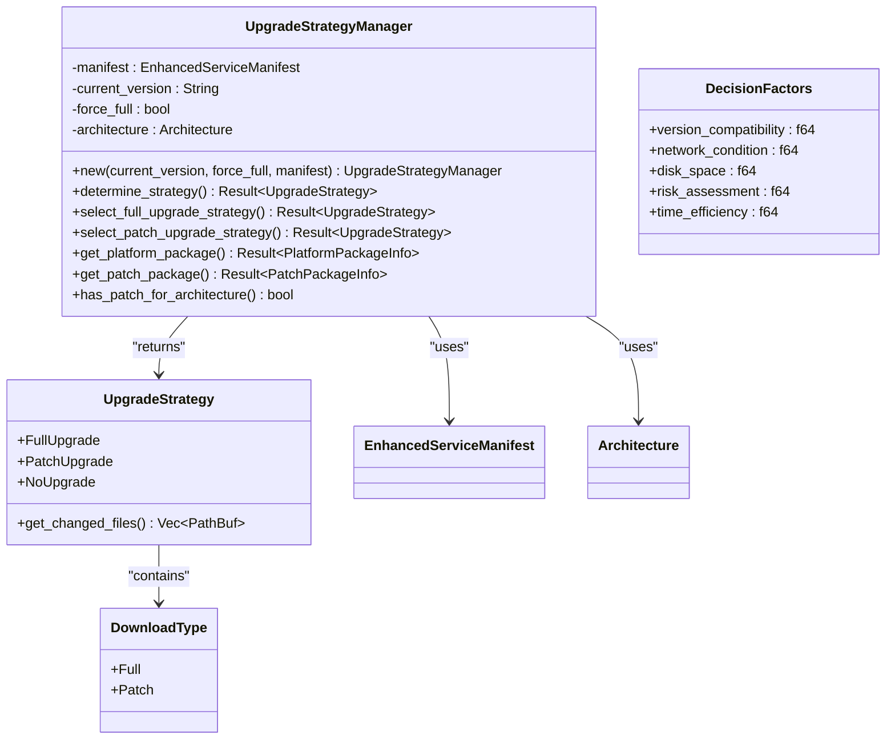
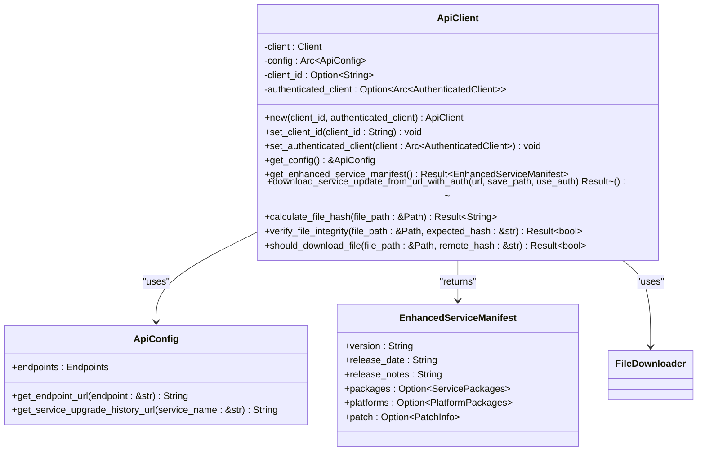
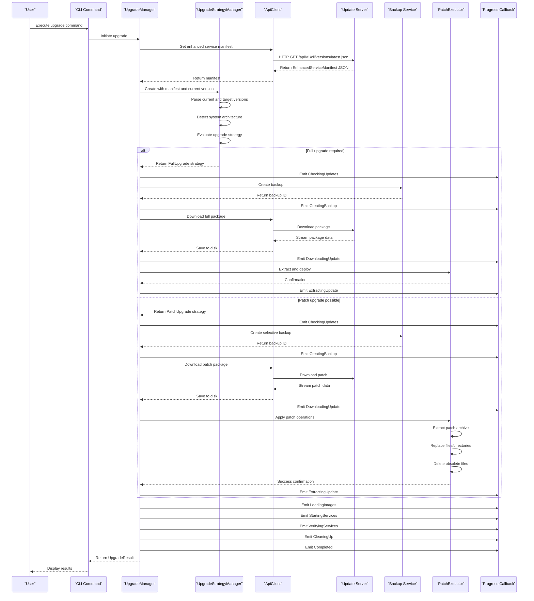
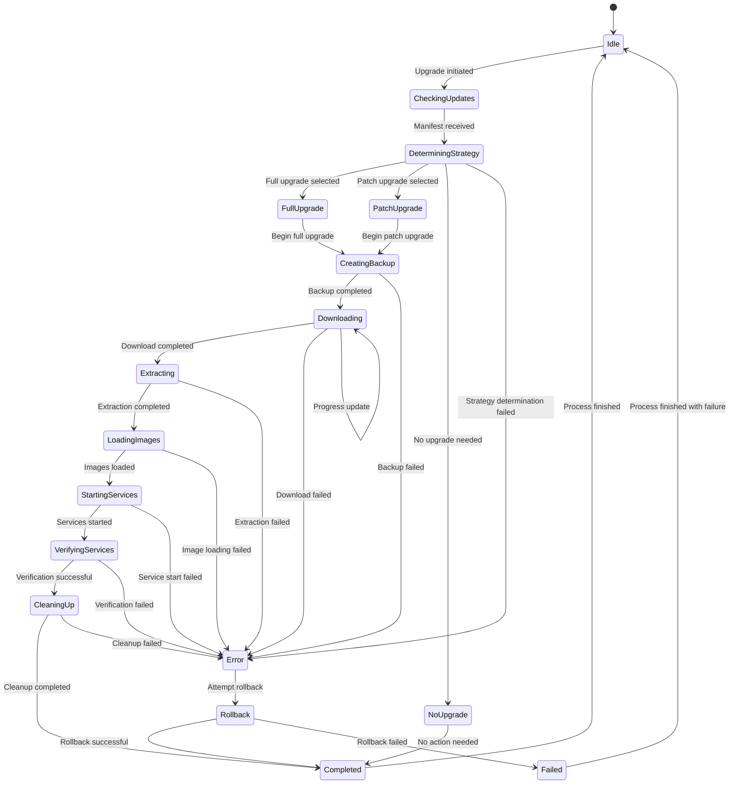
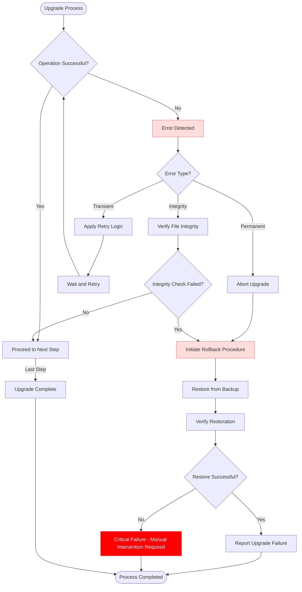
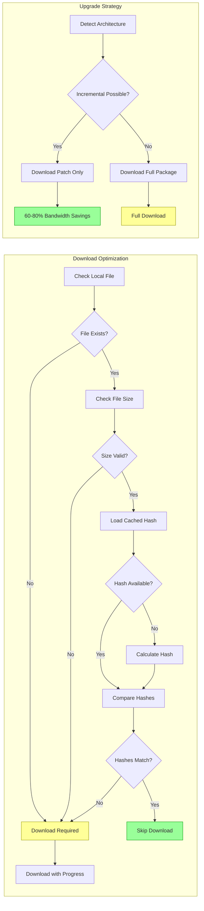

# Data Flow and Processing Pipeline

<cite>
**Referenced Files in This Document**   
- [upgrade.rs](file://client-core/src/upgrade.rs)
- [upgrade_strategy.rs](file://client-core/src/upgrade_strategy.rs)
- [api.rs](file://client-core/src/api.rs)
- [version.rs](file://client-core/src/version.rs)
- [backup.rs](file://client-core/src/backup.rs)
- [patch_executor/mod.rs](file://client-core/src/patch_executor/mod.rs)
- [patch_executor/patch_processor.rs](file://client-core/src/patch_executor/patch_processor.rs)
- [api_types.rs](file://client-core/src/api_types.rs)
- [architecture.rs](file://client-core/src/architecture.rs)
- [update.rs](file://nuwax-cli/src/commands/update.rs)
- [spec/upgrade-architecture-enhancement.md](file://spec/upgrade-architecture-enhancement.md)
</cite>

## Table of Contents
1. [Introduction](#introduction)
2. [Project Structure](#project-structure)
3. [Core Components](#core-components)
4. [Architecture Overview](#architecture-overview)
5. [Detailed Component Analysis](#detailed-component-analysis)
6. [Upgrade Data Flow Pipeline](#upgrade-data-flow-pipeline)
7. [State Transition Diagram](#state-transition-diagram)
8. [Error Handling and Rollback](#error-handling-and-rollback)
9. [Performance Optimizations](#performance-optimizations)
10. [Conclusion](#conclusion)

## Introduction
This document provides a comprehensive analysis of the end-to-end data flow for the upgrade process in duck_client. The upgrade system implements a sophisticated pipeline that supports both full and incremental upgrades with architecture-specific packages. The process begins with user initiation through CLI commands or GUI actions and proceeds through version checking, strategy selection, download, backup creation, patch application, and verification. The system transforms data at each stage, parsing version strings into Version objects, deserializing manifests into EnhancedServiceManifest structures, and executing patch operations through the PatchExecutor. Special attention is given to error handling, rollback procedures, data consistency guarantees, and performance optimizations such as parallel downloads and incremental processing.

## Project Structure
The duck_client repository follows a modular architecture with distinct components for different concerns. The core functionality is organized into several key modules:

- **cli-ui**: Frontend interface built with React and Tauri for user interaction
- **client-core**: Core business logic and data processing in Rust
- **nuwax-cli**: Command-line interface implementation
- **spec**: Design documentation and architectural specifications

The upgrade functionality is primarily implemented in the client-core module, with specific components for version management, strategy selection, and patch execution. The separation of concerns allows for clean interfaces between the user interface, business logic, and external service interactions.

**Diagram sources**
- [upgrade.rs](file://client-core/src/upgrade.rs)
- [upgrade_strategy.rs](file://client-core/src/upgrade_strategy.rs)
- [api_types.rs](file://client-core/src/api_types.rs)

**Section sources**
- [upgrade.rs](file://client-core/src/upgrade.rs)
- [upgrade_strategy.rs](file://client-core/src/upgrade_strategy.rs)
- [api_types.rs](file://client-core/src/api_types.rs)

## Core Components
The upgrade process relies on several key components that work together to provide a robust and efficient update mechanism. The UpgradeManager serves as the central coordinator, orchestrating the entire upgrade workflow. It interacts with the UpgradeStrategyManager to determine the optimal upgrade approach based on current and target versions, system architecture, and user preferences.

The EnhancedServiceManifest data structure contains comprehensive information about available upgrades, including full packages, architecture-specific packages, and incremental patch information. The Version class provides sophisticated version comparison capabilities, enabling the system to determine whether a full upgrade or incremental patch is appropriate.

The PatchExecutor handles the application of incremental updates, processing file replacement and deletion operations as specified in the patch manifest. The ApiClient facilitates communication with the update server, downloading manifests and upgrade packages while handling authentication and error conditions.

**Section sources**
- [upgrade.rs](file://client-core/src/upgrade.rs)
- [upgrade_strategy.rs](file://client-core/src/upgrade_strategy.rs)
- [api_types.rs](file://client-core/src/api_types.rs)
- [version.rs](file://client-core/src/version.rs)

## Architecture Overview
The upgrade architecture follows a layered design pattern with clear separation of concerns. At the highest level, user interactions through the CLI or GUI trigger the upgrade process. The UpgradeManager coordinates the workflow, delegating specific responsibilities to specialized components.

The system implements a strategy pattern for upgrade selection, allowing for flexible decision-making based on various factors including version compatibility, network conditions, and user preferences. The architecture supports both full and incremental upgrades, with the ability to fall back to alternative strategies when necessary.

Security is integrated throughout the architecture, with digital signature verification and SHA-256 hash validation ensuring the integrity of downloaded packages. The system also implements comprehensive telemetry and error reporting to support monitoring and troubleshooting.

**Diagram sources**
- [upgrade.rs](file://client-core/src/upgrade.rs)
- [upgrade_strategy.rs](file://client-core/src/upgrade_strategy.rs)
- [api.rs](file://client-core/src/api.rs)
- [spec/upgrade-architecture-enhancement.md](file://spec/upgrade-architecture-enhancement.md)

## Detailed Component Analysis

### Upgrade Manager Analysis
The UpgradeManager is the central orchestrator of the upgrade process, responsible for coordinating all aspects of the upgrade workflow. It provides a clean API for initiating upgrades and handles the complex interactions between various components.

**Diagram sources**
- [upgrade.rs](file://client-core/src/upgrade.rs)

**Section sources**
- [upgrade.rs](file://client-core/src/upgrade.rs)

### Upgrade Strategy Manager Analysis
The UpgradeStrategyManager implements the core decision logic for determining the appropriate upgrade approach. It evaluates multiple factors including version compatibility, system architecture, and user preferences to select between full upgrades, incremental patches, or no upgrade.

**Diagram sources**
- [upgrade_strategy.rs](file://client-core/src/upgrade_strategy.rs)

**Section sources**
- [upgrade_strategy.rs](file://client-core/src/upgrade_strategy.rs)

### API Client Analysis
The ApiClient component handles all communication with the update server, providing methods for retrieving manifests, downloading packages, and reporting telemetry. It implements robust error handling and retry logic to ensure reliable operation in various network conditions.

**Diagram sources**
- [api.rs](file://client-core/src/api.rs)
- [api_types.rs](file://client-core/src/api_types.rs)

**Section sources**
- [api.rs](file://client-core/src/api.rs)
- [api_types.rs](file://client-core/src/api_types.rs)

## Upgrade Data Flow Pipeline
The upgrade process follows a well-defined pipeline that transforms data through multiple stages, from user initiation to successful completion. Each stage processes and enriches the data, passing it to the next stage in the pipeline.

**Diagram sources**
- [upgrade.rs](file://client-core/src/upgrade.rs)
- [upgrade_strategy.rs](file://client-core/src/upgrade_strategy.rs)
- [api.rs](file://client-core/src/api.rs)
- [backup.rs](file://client-core/src/backup.rs)
- [patch_executor/patch_processor.rs](file://client-core/src/patch_executor/patch_processor.rs)

**Section sources**
- [upgrade.rs](file://client-core/src/upgrade.rs)
- [upgrade_strategy.rs](file://client-core/src/upgrade_strategy.rs)
- [api.rs](file://client-core/src/api.rs)
- [backup.rs](file://client-core/src/backup.rs)
- [patch_executor/patch_processor.rs](file://client-core/src/patch_executor/patch_processor.rs)

## State Transition Diagram
The upgrade process can be modeled as a state machine with well-defined transitions between states. Each state represents a specific phase of the upgrade workflow, and transitions occur based on the success or failure of operations.

**Diagram sources**
- [upgrade.rs](file://client-core/src/upgrade.rs)
- [upgrade_strategy.rs](file://client-core/src/upgrade_strategy.rs)
- [backup.rs](file://client-core/src/backup.rs)
- [patch_executor/patch_processor.rs](file://client-core/src/patch_executor/patch_processor.rs)

**Section sources**
- [upgrade.rs](file://client-core/src/upgrade.rs)
- [upgrade_strategy.rs](file://client-core/src/upgrade_strategy.rs)
- [backup.rs](file://client-core/src/backup.rs)
- [patch_executor/patch_processor.rs](file://client-core/src/patch_executor/patch_processor.rs)

## Error Handling and Rollback
The upgrade system implements comprehensive error handling and rollback procedures to ensure data consistency and system reliability. Each stage of the upgrade process includes specific error detection and recovery mechanisms.

When an error occurs during the upgrade process, the system attempts to rollback to the previous state using the backup created at the beginning of the process. The rollback procedure restores the system to its pre-upgrade state, minimizing the impact of failed upgrades.

The system distinguishes between different types of errors, including network failures, file system errors, and integrity verification failures. For transient errors such as network timeouts, the system implements retry logic with exponential backoff. For permanent errors such as corrupted downloads or failed integrity checks, the system aborts the upgrade and initiates rollback.

**Diagram sources**
- [upgrade.rs](file://client-core/src/upgrade.rs)
- [backup.rs](file://client-core/src/backup.rs)
- [patch_executor/patch_processor.rs](file://client-core/src/patch_executor/patch_processor.rs)

**Section sources**
- [upgrade.rs](file://client-core/src/upgrade.rs)
- [backup.rs](file://client-core/src/backup.rs)
- [patch_executor/patch_processor.rs](file://client-core/src/patch_executor/patch_processor.rs)

## Performance Optimizations
The upgrade system incorporates several performance optimizations to minimize bandwidth usage, reduce upgrade time, and improve user experience. The most significant optimization is the support for incremental upgrades, which can reduce download sizes by 60-80% compared to full upgrades.

The system implements intelligent download decisions using file hash comparison, avoiding unnecessary downloads when the local file already matches the remote version. This is further enhanced by caching hash values in .hash files, eliminating the need to recalculate hashes on subsequent checks.

For large downloads, the system uses streaming to minimize memory usage, writing data directly to disk as it is received. Progress reporting is optimized to avoid excessive logging, with updates displayed at strategic intervals rather than for every small increment.

The architecture detection feature ensures that users download only the packages relevant to their system architecture, avoiding the transfer of unnecessary files. This is particularly beneficial for users on ARM-based systems who would otherwise download x86_64 packages or vice versa.

**Diagram sources**
- [api.rs](file://client-core/src/api.rs)
- [upgrade_strategy.rs](file://client-core/src/upgrade_strategy.rs)
- [spec/upgrade-architecture-enhancement.md](file://spec/upgrade-architecture-enhancement.md)

**Section sources**
- [api.rs](file://client-core/src/api.rs)
- [upgrade_strategy.rs](file://client-core/src/upgrade_strategy.rs)
- [spec/upgrade-architecture-enhancement.md](file://spec/upgrade-architecture-enhancement.md)

## Conclusion
The duck_client upgrade system represents a sophisticated and robust implementation of software update functionality. By combining multiple architectural patterns and optimization techniques, it provides a reliable and efficient upgrade experience for users. The system's modular design allows for clear separation of concerns, making it maintainable and extensible.

Key strengths of the system include its support for both full and incremental upgrades, architecture-specific packages, comprehensive error handling, and intelligent download decisions. The use of digital signatures and hash verification ensures the security and integrity of downloaded packages.

The system's performance optimizations, particularly the incremental upgrade capability, significantly reduce bandwidth usage and upgrade times. The progress reporting and state management provide users with clear feedback throughout the upgrade process.

Future enhancements could include support for parallel patch application, more sophisticated network condition detection, and enhanced telemetry for monitoring upgrade success rates across the user base.