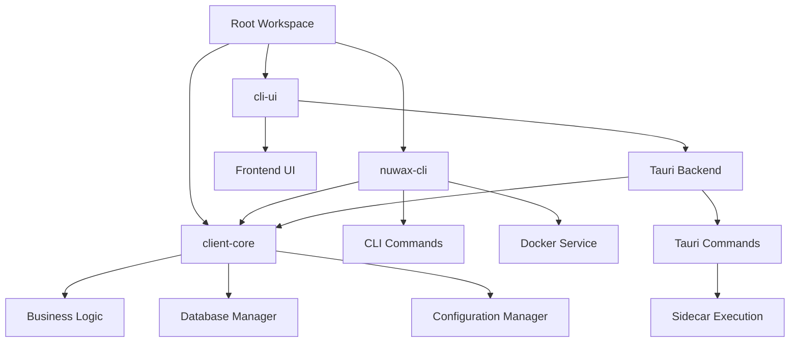
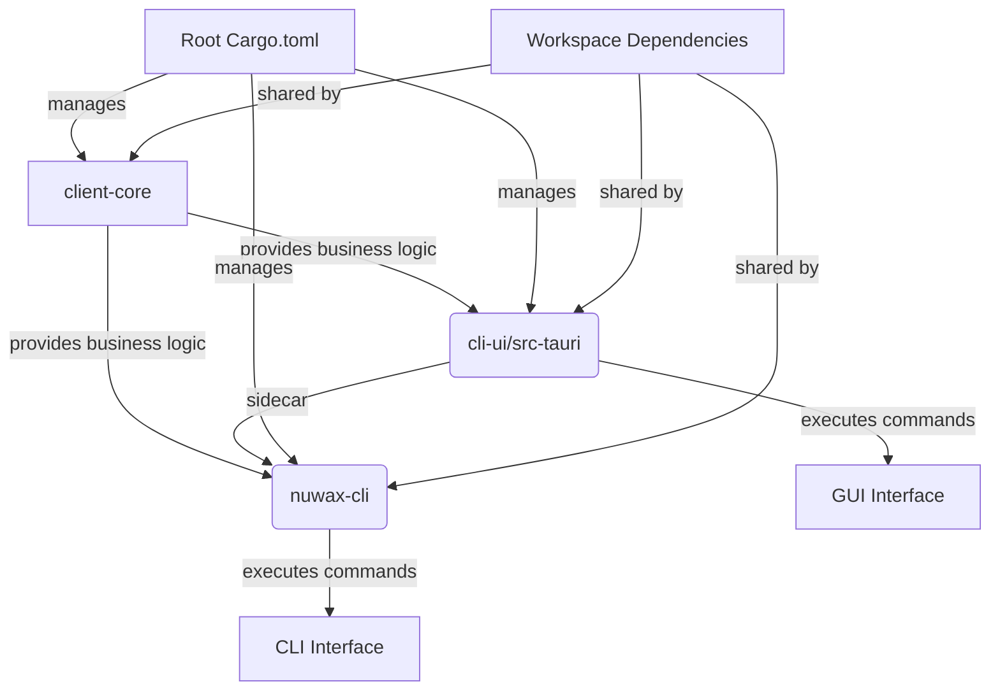
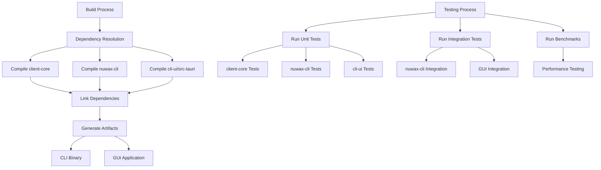
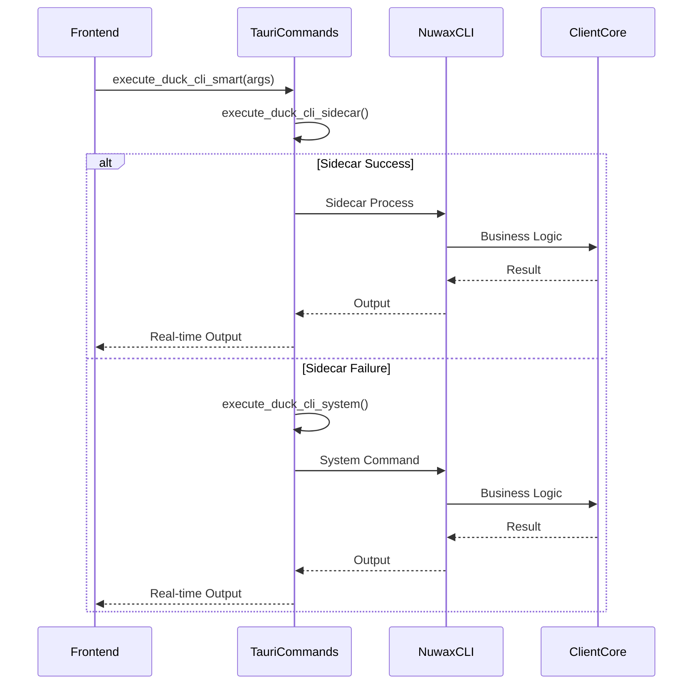

# Monorepo Structure and Dependency Management

<cite>
**Referenced Files in This Document**   
- [Cargo.toml](file://Cargo.toml)
- [client-core/Cargo.toml](file://client-core/Cargo.toml)
- [nuwax-cli/Cargo.toml](file://nuwax-cli/Cargo.toml)
- [cli-ui/src-tauri/Cargo.toml](file://cli-ui/src-tauri/Cargo.toml)
- [client-core/src/lib.rs](file://client-core/src/lib.rs)
- [nuwax-cli/src/lib.rs](file://nuwax-cli/src/lib.rs)
- [nuwax-cli/src/main.rs](file://nuwax-cli/src/main.rs)
- [client-core/src/database_manager.rs](file://client-core/src/database_manager.rs)
- [client-core/src/version.rs](file://client-core/src/version.rs)
- [cli-ui/src-tauri/src/commands/cli.rs](file://cli-ui/src-tauri/src/commands/cli.rs)
- [cli-ui/src-tauri/src/commands/mod.rs](file://cli-ui/src-tauri/src/commands/mod.rs)
</cite>

## Table of Contents
1. [Project Structure](#project-structure)
2. [Workspace Configuration and Shared Dependencies](#workspace-configuration-and-shared-dependencies)
3. [Core Components and Business Logic](#core-components-and-business-logic)
4. [Dependency Graph and Integration Points](#dependency-graph-and-integration-points)
5. [Build Process and Testing Strategy](#build-process-and-testing-strategy)
6. [Version Coordination and Feature Flags](#version-coordination-and-feature-flags)
7. [API Contracts and Cross-Crate Communication](#api-contracts-and-cross-crate-communication)
8. [Best Practices for Dependency Management](#best-practices-for-dependency-management)
9. [Workspace Tooling and Cargo Commands](#workspace-tooling-and-cargo-commands)

## Project Structure

The duck_client monorepo follows a well-organized structure with three main components: `client-core`, `nuwax-cli`, and `cli-ui`. The root workspace contains the primary `Cargo.toml` that manages the entire project configuration.



**Diagram sources**
- [Cargo.toml](file://Cargo.toml)
- [project_structure](file://project_structure)

**Section sources**
- [Cargo.toml](file://Cargo.toml)
- [project_structure](file://project_structure)

## Workspace Configuration and Shared Dependencies

The root `Cargo.toml` file serves as the central configuration point for the monorepo, defining workspace members and shared dependencies. This approach ensures consistent dependency versions across all crates and simplifies dependency management.

```toml
[workspace]
resolver = "2"
members = ["client-core", "nuwax-cli", "cli-ui/src-tauri"]

[workspace.dependencies]
tokio = { version = "1", features = ["macros", "net", "rt", "rt-multi-thread"] }
serde = { version = "1.0", features = ["derive"] }
anyhow = "1.0"
thiserror = "2.0"
```

The workspace uses Cargo's workspace dependency feature, allowing individual crates to reference shared dependencies with the `{ workspace = true }` syntax. This eliminates version drift and ensures all components use the same dependency versions.

**Section sources**
- [Cargo.toml](file://Cargo.toml#L1-L136)

## Core Components and Business Logic

The `client-core` crate serves as the shared business logic layer for the entire application. It contains core functionality that is reused by both the CLI and GUI interfaces.

```mermaid
classDiagram
class DatabaseManager {
+new(db_path) Result~DatabaseManager~
+new_memory() Result~DatabaseManager~
+init_database() Result~()~
+read_with_retry(operation) Result~R~
+write_with_retry(operation) Result~R~
+batch_write_with_retry(operations) Result~R~
+health_check() Result~HealthStatus~
}
class ConfigManager {
+load_config(path) Result~Config~
+save_config(config, path) Result~()~
+get_config_value(key) Option~String~
+set_config_value(key, value) Result~()~
}
class Version {
+major : u32
+minor : u32
+patch : u32
+build : u32
+from_str(s) Result~Version~
+new(major, minor, patch, build) Version
+compare(other) Ordering
}
class DatabaseManager --> ConfigManager : "uses"
DatabaseManager --> Version : "references"
ConfigManager --> Version : "references"
```

**Diagram sources**
- [client-core/src/database_manager.rs](file://client-core/src/database_manager.rs#L0-L783)
- [client-core/src/config_manager.rs](file://client-core/src/config_manager.rs)
- [client-core/src/version.rs](file://client-core/src/version.rs#L38-L87)

**Section sources**
- [client-core/src/lib.rs](file://client-core/src/lib.rs#L0-L27)
- [client-core/src/database_manager.rs](file://client-core/src/database_manager.rs#L0-L783)

## Dependency Graph and Integration Points

The dependency graph shows how components are interconnected, with `client-core` serving as the central shared library. Both `nuwax-cli` and `cli-ui` depend on `client-core` for business logic, while the Tauri backend in `cli-ui` also handles command execution.



The `nuwax-cli` crate depends on `client-core` with specific feature flags:
```toml
[dependencies]
client-core = { path = "../client-core", features = ["indicatif"] }
```

This feature enables progress indicators in the CLI interface while keeping the core library lightweight for other consumers.

**Diagram sources**
- [Cargo.toml](file://Cargo.toml#L1-L136)
- [client-core/Cargo.toml](file://client-core/Cargo.toml#L0-L61)
- [nuwax-cli/Cargo.toml](file://nuwax-cli/Cargo.toml#L0-L118)

**Section sources**
- [nuwax-cli/Cargo.toml](file://nuwax-cli/Cargo.toml#L0-L118)
- [client-core/Cargo.toml](file://client-core/Cargo.toml#L0-L61)

## Build Process and Testing Strategy

The monorepo supports workspace-level testing and building, allowing for efficient development workflows. The build process leverages Cargo's workspace features to manage dependencies and compilation.

For testing, the workspace supports both unit tests and integration tests:
- `client-core` contains comprehensive unit tests for business logic
- `nuwax-cli` includes integration tests for CLI commands
- Workspace-level tests can be run with `cargo test --workspace`

The `nuwax-cli` crate includes benchmarking capabilities for performance testing:
```toml
[dev-dependencies]
criterion = { version = "0.5", features = ["html_reports", "async_tokio"] }
pprof = { version = "0.15", features = ["criterion", "flamegraph"] }
```



**Diagram sources**
- [nuwax-cli/Cargo.toml](file://nuwax-cli/Cargo.toml#L0-L118)
- [client-core/Cargo.toml](file://client-core/Cargo.toml#L0-L61)

**Section sources**
- [nuwax-cli/Cargo.toml](file://nuwax-cli/Cargo.toml#L0-L118)
- [client-core/Cargo.toml](file://client-core/Cargo.toml#L0-L61)

## Version Coordination and Feature Flags

Version coordination across the monorepo is managed through the workspace dependency system, ensuring all components use compatible versions of shared libraries. The `client-core` crate uses semantic versioning with a custom `Version` struct that supports four-part version numbers.

Feature flags are used strategically to enable optional functionality without increasing the dependency footprint for all consumers:

```toml
# In nuwax-cli/Cargo.toml
[dependencies]
client-core = { path = "../client-core", features = ["indicatif"] }

# In client-core/Cargo.toml
[dependencies]
indicatif = { workspace = true, optional = true }
```

This approach allows `nuwax-cli` to enable progress indicators while other consumers can opt out. The workspace dependency system ensures that when `indicatif` is enabled, all components use the same version.

**Section sources**
- [client-core/Cargo.toml](file://client-core/Cargo.toml#L0-L61)
- [nuwax-cli/Cargo.toml](file://nuwax-cli/Cargo.toml#L0-L118)
- [client-core/src/version.rs](file://client-core/src/version.rs#L38-L87)

## API Contracts and Cross-Crate Communication

The API contracts between crates are designed to be clear and maintainable, with `client-core` exposing a well-defined public interface through its `lib.rs` file:

```rust
pub mod api;
pub mod api_config;
pub mod api_types;
pub mod database_manager;
pub mod config_manager;
// ... other modules

pub use database_manager::DatabaseManager;
pub use error::*;
```

The `nuwax-cli` crate re-exports selected functionality from `client-core` to provide a cohesive interface:

```rust
// In nuwax-cli/src/lib.rs
pub use client_core::{config_manager::ConfigManager, database_manager::DatabaseManager};
```

For Tauri integration, the `cli-ui` backend uses command pattern to expose functionality to the frontend:

```rust
// In cli-ui/src-tauri/src/commands/cli.rs
#[command]
pub async fn execute_duck_cli_smart(
    app: AppHandle,
    args: Vec<String>,
    working_dir: Option<String>,
) -> Result<CommandResult, String>
```

This command can execute CLI operations either through a sidecar process or system command, providing flexibility in deployment.



**Diagram sources**
- [cli-ui/src-tauri/src/commands/cli.rs](file://cli-ui/src-tauri/src/commands/cli.rs#L0-L627)
- [nuwax-cli/src/main.rs](file://nuwax-cli/src/main.rs#L0-L102)
- [client-core/src/lib.rs](file://client-core/src/lib.rs#L0-L27)

**Section sources**
- [cli-ui/src-tauri/src/commands/cli.rs](file://cli-ui/src-tauri/src/commands/cli.rs#L0-L627)
- [nuwax-cli/src/lib.rs](file://nuwax-cli/src/lib.rs#L0-L27)

## Best Practices for Dependency Management

The monorepo follows several best practices for dependency management:

1. **Centralized Dependency Management**: All shared dependencies are defined in the root `Cargo.toml` using the `[workspace.dependencies]` section.

2. **Version Pinning**: Critical dependencies are pinned to specific versions when necessary:
```toml
tracing-appender = "=0.2.2"
serde_yaml = "=0.9.33"
```

3. **Feature Flag Strategy**: Optional features are exposed through feature flags, allowing consumers to enable only what they need.

4. **Avoiding Circular Dependencies**: The dependency graph is carefully designed to prevent circular references, with `client-core` containing only shared business logic without dependencies on application-specific code.

5. **Dependency Isolation**: Each crate declares only the dependencies it directly uses, even when they are transitive dependencies through other workspace crates.

6. **Regular Audits**: The workspace uses `cargo-audit` and similar tools to ensure dependency security.

When adding new dependencies, the following guidelines should be followed:
- Add shared dependencies to the root `Cargo.toml` workspace dependencies
- Use version constraints appropriately (avoid overly restrictive versions)
- Consider the impact on compile times and binary size
- Document the purpose of the dependency in comments

**Section sources**
- [Cargo.toml](file://Cargo.toml#L1-L136)
- [client-core/Cargo.toml](file://client-core/Cargo.toml#L0-L61)
- [nuwax-cli/Cargo.toml](file://nuwax-cli/Cargo.toml#L0-L118)

## Workspace Tooling and Cargo Commands

The monorepo supports various Cargo commands for efficient development:

```bash
# Build all workspace members
cargo build --workspace

# Run tests for all workspace members
cargo test --workspace

# Check all workspace members
cargo check --workspace

# Format all workspace members
cargo fmt --workspace

# Update dependencies for all workspace members
cargo update --workspace

# Build specific member
cargo build -p nuwax-cli

# Run specific member
cargo run -p nuwax-cli -- --help

# Run benchmarks
cargo bench -p nuwax-cli
```

For the Tauri application, additional commands are available through the Tauri CLI:

```bash
# Build the Tauri application
cd cli-ui && npm run tauri build

# Run the Tauri application in development mode
cd cli-ui && npm run tauri dev
```

The workspace also supports custom profiles for different build configurations:

```toml
# In individual Cargo.toml files
[profile.release]
lto = true
codegen-units = 1
panic = "abort"
```

These profiles optimize the final binaries for production use while maintaining fast compilation during development.

**Section sources**
- [Cargo.toml](file://Cargo.toml#L1-L136)
- [nuwax-cli/Cargo.toml](file://nuwax-cli/Cargo.toml#L0-L118)
- [client-core/Cargo.toml](file://client-core/Cargo.toml#L0-L61)