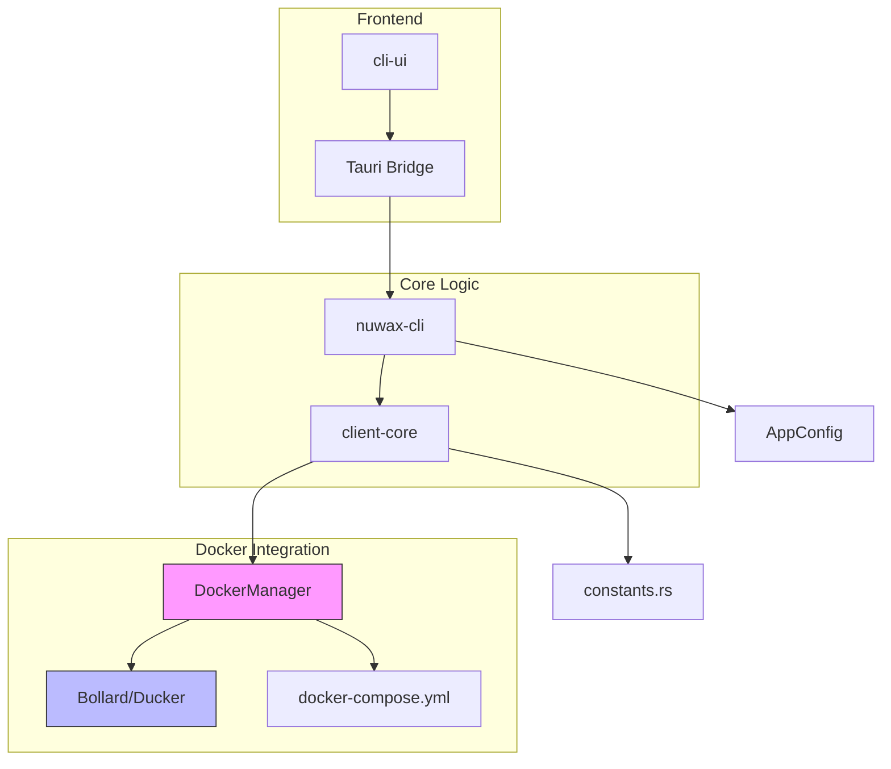
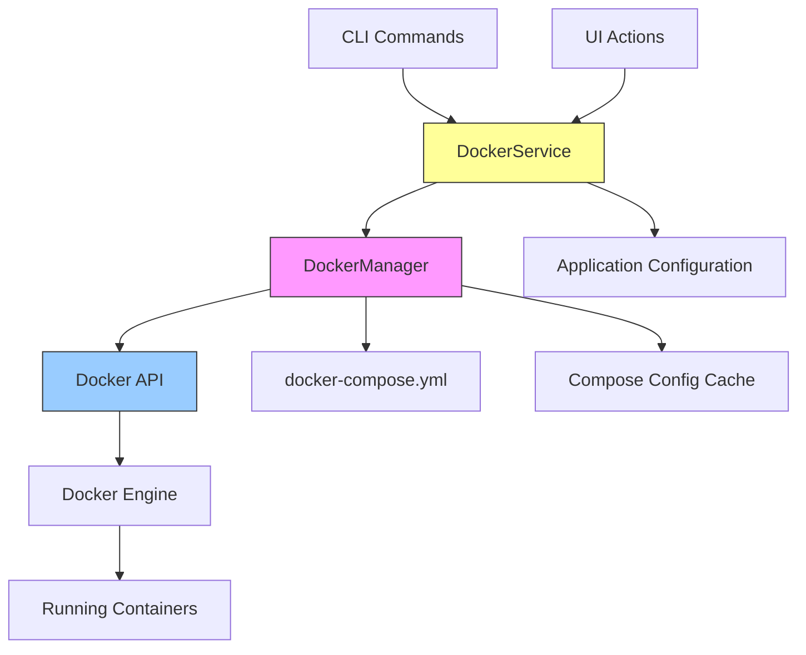
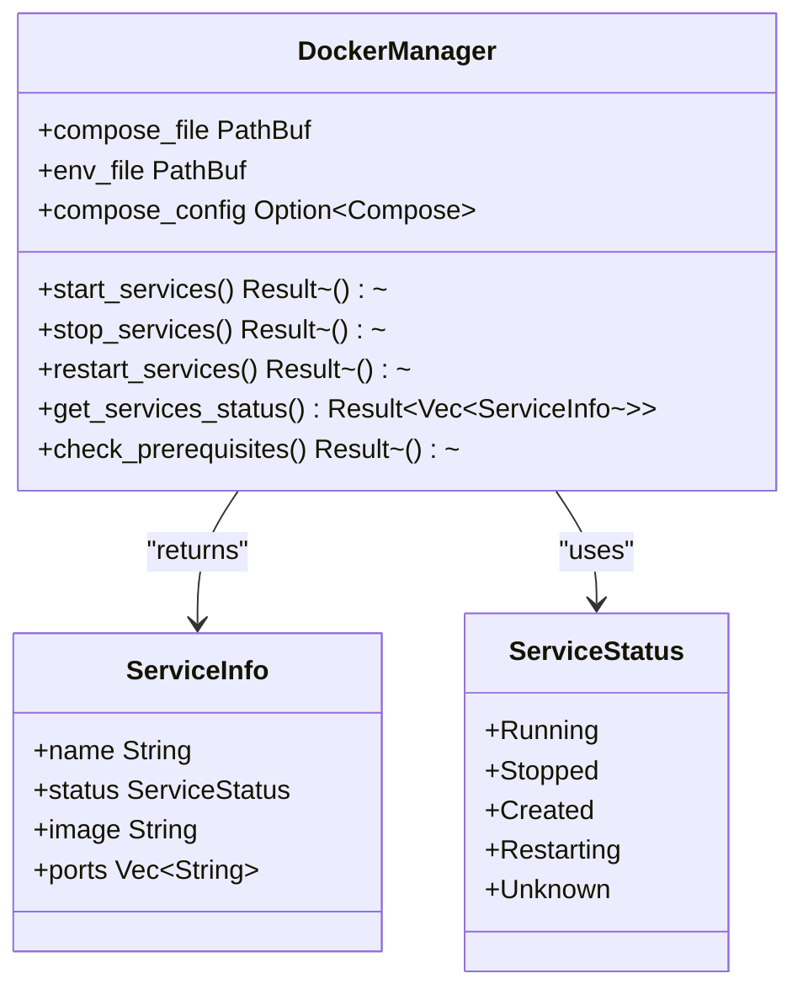
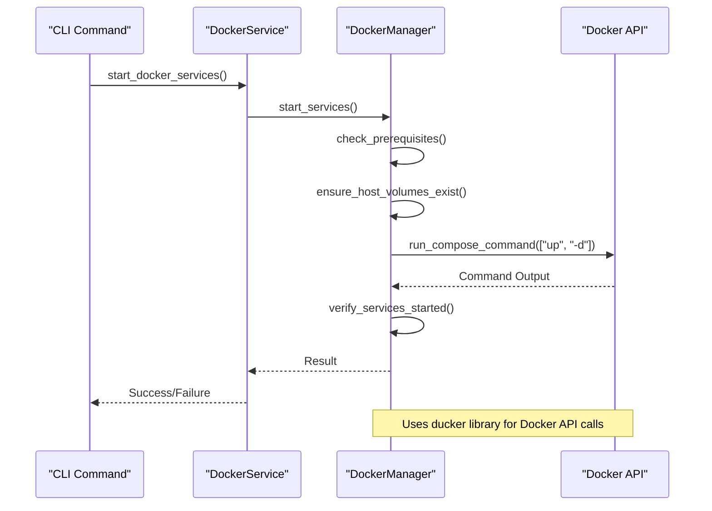
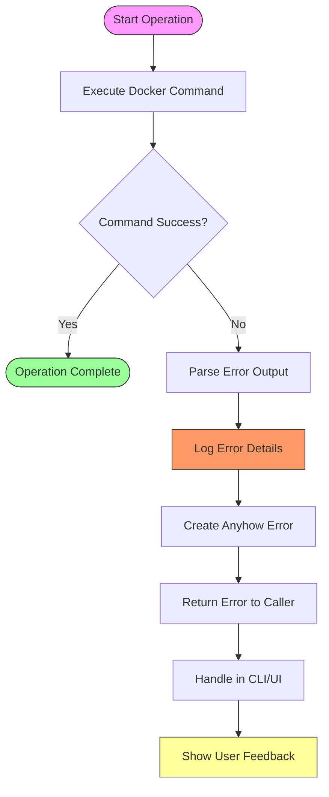
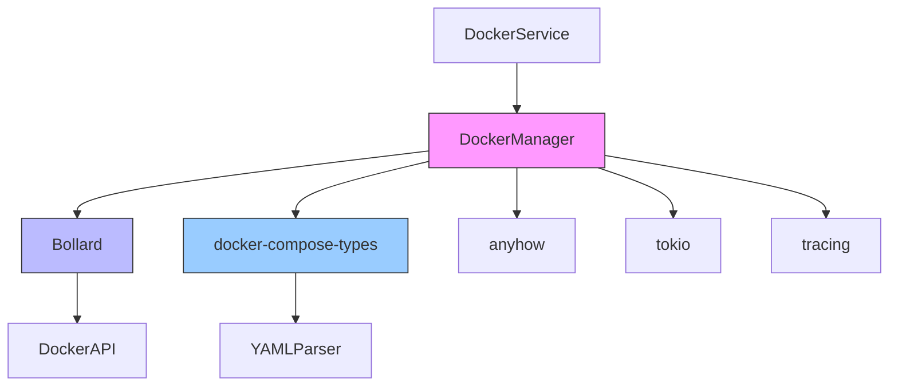
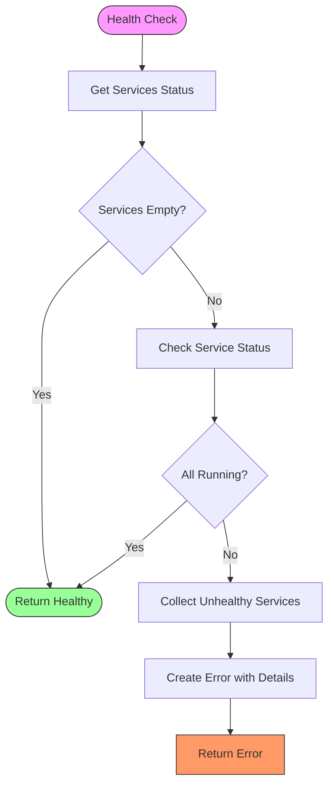

# Docker Engine Integration

<cite>
**Referenced Files in This Document**   
- [service.rs](file://client-core/src/container/service.rs#L1-L510)
- [command.rs](file://client-core/src/container/command.rs#L1-L139)
- [config.rs](file://client-core/src/container/config.rs#L1-L239)
- [types.rs](file://client-core/src/container/types.rs#L1-L59)
- [constants.rs](file://client-core/src/constants.rs#L322-L521)
- [docker_service.rs](file://nuwax-cli/src/commands/docker_service.rs#L1-L500)
</cite>

## Table of Contents
1. [Introduction](#introduction)
2. [Project Structure](#project-structure)
3. [Core Components](#core-components)
4. [Architecture Overview](#architecture-overview)
5. [Detailed Component Analysis](#detailed-component-analysis)
6. [Dependency Analysis](#dependency-analysis)
7. [Performance Considerations](#performance-considerations)
8. [Troubleshooting Guide](#troubleshooting-guide)
9. [Conclusion](#conclusion)

## Introduction
This document provides a comprehensive overview of the Docker Engine integration within the `duck_client` repository, focusing on container lifecycle management, service orchestration, health checks, and configuration. The integration is primarily facilitated through the Bollard-based `DockerManager` in the `client-core` module, with orchestration logic implemented in `nuwax-cli`. The system enables robust container operations including start, stop, restart, inspect, and logs retrieval, with comprehensive error handling and retry mechanisms.

## Project Structure
The project is organized into multiple modules, each serving a distinct purpose in the Docker integration ecosystem:

- **cli-ui**: Frontend interface built with React and Tauri for user interaction
- **client-core**: Core business logic and container abstraction layer
- **nuwax-cli**: Command-line interface and service orchestration module
- **spec**: Design and architecture documentation

The Docker integration is primarily implemented in `client-core/src/container` and orchestrated through `nuwax-cli/src/commands/docker_service.rs`.



**Diagram sources**
- [client-core/src/container/service.rs](file://client-core/src/container/service.rs#L1-L510)
- [nuwax-cli/src/commands/docker_service.rs](file://nuwax-cli/src/commands/docker_service.rs#L1-L500)

**Section sources**
- [client-core/src/container/service.rs](file://client-core/src/container/service.rs#L1-L510)
- [nuwax-cli/src/commands/docker_service.rs](file://nuwax-cli/src/commands/docker_service.rs#L1-L500)

## Core Components
The Docker integration is built around several core components that work together to manage container lifecycle operations:

- **DockerManager**: Central component in `client-core` responsible for container operations
- **DockerService**: Orchestration layer in `nuwax-cli` that coordinates Docker operations
- **Bollard/Ducker**: Rust Docker API client library used for low-level container management
- **docker-compose.yml**: Configuration file defining services, networks, and volumes

The `DockerManager` struct serves as the primary interface for container operations, providing methods for starting, stopping, restarting, and inspecting containers. It abstracts the underlying Docker API complexity and provides a clean interface for higher-level modules.

**Section sources**
- [client-core/src/container/types.rs](file://client-core/src/container/types.rs#L1-L59)
- [client-core/src/container/service.rs](file://client-core/src/container/service.rs#L1-L510)

## Architecture Overview
The Docker integration follows a layered architecture with clear separation of concerns:



**Diagram sources**
- [client-core/src/container/service.rs](file://client-core/src/container/service.rs#L1-L510)
- [nuwax-cli/src/commands/docker_service.rs](file://nuwax-cli/src/commands/docker_service.rs#L1-L500)

## Detailed Component Analysis

### DockerManager Analysis
The `DockerManager` struct is the core component responsible for container lifecycle management. It provides a high-level interface for Docker operations while handling low-level API interactions.

#### Container Lifecycle Management
The `DockerManager` implements comprehensive container lifecycle operations:



**Diagram sources**
- [client-core/src/container/types.rs](file://client-core/src/container/types.rs#L1-L59)
- [client-core/src/container/service.rs](file://client-core/src/container/service.rs#L1-L510)

**Section sources**
- [client-core/src/container/service.rs](file://client-core/src/container/service.rs#L1-L510)
- [client-core/src/container/types.rs](file://client-core/src/container/types.rs#L1-L59)

### Service Orchestration Logic
The interaction between `nuwax-cli` and `client-core` follows a clear orchestration pattern where the CLI commands invoke the core container abstraction.

#### Service Orchestration Flow


**Diagram sources**
- [nuwax-cli/src/commands/docker_service.rs](file://nuwax-cli/src/commands/docker_service.rs#L1-L500)
- [client-core/src/container/service.rs](file://client-core/src/container/service.rs#L1-L510)

**Section sources**
- [nuwax-cli/src/commands/docker_service.rs](file://nuwax-cli/src/commands/docker_service.rs#L1-L500)
- [client-core/src/container/service.rs](file://client-core/src/container/service.rs#L1-L510)

### Error Handling for Docker API Failures
The system implements robust error handling for Docker API failures, providing meaningful error messages and recovery options.

#### Error Handling Flow


**Diagram sources**
- [client-core/src/container/service.rs](file://client-core/src/container/service.rs#L1-L510)
- [client-core/src/container/command.rs](file://client-core/src/container/command.rs#L1-L139)

**Section sources**
- [client-core/src/container/service.rs](file://client-core/src/container/service.rs#L1-L510)
- [client-core/src/container/command.rs](file://client-core/src/container/command.rs#L1-L139)

## Dependency Analysis
The Docker integration components have well-defined dependencies that ensure modularity and maintainability.



**Diagram sources**
- [client-core/Cargo.toml](file://client-core/Cargo.toml)
- [nuwax-cli/Cargo.toml](file://nuwax-cli/Cargo.toml)

## Performance Considerations
The Docker integration includes several performance optimizations:

- **Configuration Caching**: The `docker-compose.yml` configuration is cached for 30 seconds to avoid repeated parsing
- **Asynchronous Operations**: All Docker operations are performed asynchronously using Tokio
- **Batch Operations**: Container status checks are performed in batch rather than individually
- **Connection Reuse**: Docker connections are reused across operations

The system uses a global cache instance to store parsed `docker-compose.yml` configurations:

```rust
static COMPOSE_CACHE: once_cell::sync::Lazy<Cache<(String, String), CacheEntry>> =
    once_cell::sync::Lazy::new(|| {
        Cache::new(100) // 最多缓存100个不同的配置组合
    });
```

This caching mechanism significantly reduces the overhead of repeatedly parsing the same configuration file.

**Section sources**
- [client-core/src/container/config.rs](file://client-core/src/container/config.rs#L1-L239)

## Troubleshooting Guide
This section provides guidance for common Docker integration issues and their solutions.

### Common Issues and Solutions

**Permission Errors**
- **Symptom**: "Permission denied" when accessing Docker socket
- **Solution**: Ensure the user is in the docker group or run with appropriate permissions
- **Verification**: Test with `docker --version` command

**Network Conflicts**
- **Symptom**: Port conflicts or network connectivity issues
- **Solution**: Check port mappings in `docker-compose.yml` and ensure ports are available
- **Verification**: Use `docker ps` to check port mappings

**Image Pull Failures**
- **Symptom**: "Image not found" or pull timeouts
- **Solution**: Verify internet connectivity and registry access
- **Configuration**: Check registry credentials and network settings

**Service Startup Failures**
- **Symptom**: Services fail to start or remain in "starting" state
- **Solution**: Check logs with `docker logs <container>` and verify resource limits
- **Configuration**: Adjust memory and CPU limits in `docker-compose.yml`

### Health Check Implementation
The system implements comprehensive health checks to ensure service reliability:



**Diagram sources**
- [client-core/src/container/service.rs](file://client-core/src/container/service.rs#L1-L510)

**Section sources**
- [client-core/src/container/service.rs](file://client-core/src/container/service.rs#L1-L510)
- [nuwax-cli/src/commands/docker_service.rs](file://nuwax-cli/src/commands/docker_service.rs#L1-L500)

## Conclusion
The Docker Engine integration in `duck_client` provides a robust and comprehensive solution for container lifecycle management. The architecture effectively separates concerns between the orchestration layer (`nuwax-cli`) and the core container abstraction (`client-core`), enabling clean and maintainable code. The system implements best practices in error handling, performance optimization, and configuration management, making it suitable for production use. The integration with Bollard provides reliable access to Docker API functionality, while the use of `docker-compose.yml` ensures compatibility with standard Docker workflows.