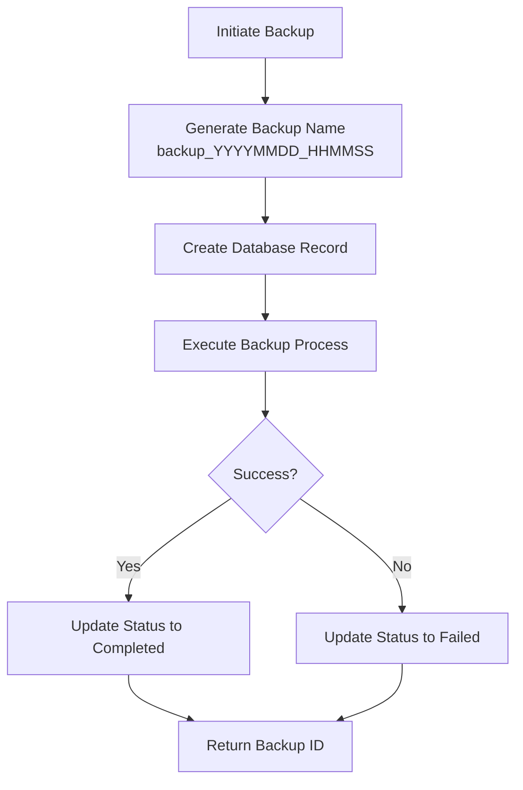
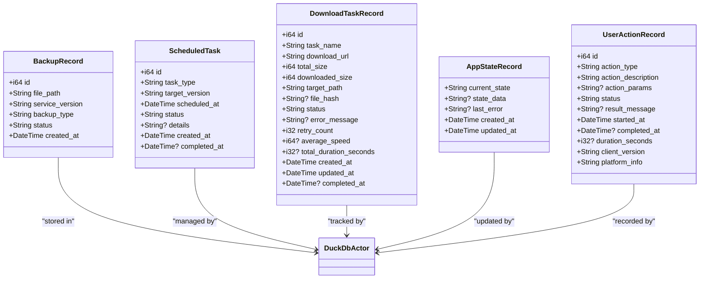
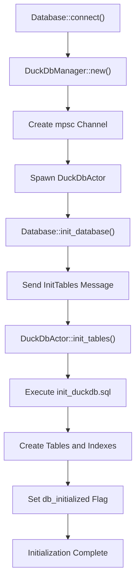

# Local File System Interaction

<cite>
**Referenced Files in This Document**   
- [database.rs](file://client-core/src/database.rs#L1-L369)
- [manager.rs](file://client-core/src/db/manager.rs#L1-L539)
- [actor.rs](file://client-core/src/db/actor.rs#L1-L741)
- [init_duckdb.sql](file://client-core/migrations/init_duckdb.sql)
</cite>

## Table of Contents
1. [Introduction](#introduction)
2. [Configuration Storage](#configuration-storage)
3. [Backup Management](#backup-management)
4. [Log Persistence and Data Models](#log-persistence-and-data-models)
5. [Database Architecture and Actor Model](#database-architecture-and-actor-model)
6. [File System Error Handling](#file-system-error-handling)
7. [Directory Structure and Operating System Paths](#directory-structure-and-operating-system-paths)
8. [Disk Space and Cleanup Policies](#disk-space-and-cleanup-policies)
9. [Security Considerations for Sensitive Data](#security-considerations-for-sensitive-data)

## Introduction
The duck_client application manages local file system interactions through a structured approach to configuration storage, backup management, and persistent data logging. This document details how the system handles file operations, directory structures, and data persistence using DuckDB as the primary embedded database engine. The implementation ensures data integrity, supports cross-platform compatibility, and provides mechanisms for backup creation, restoration, and configuration management.

**Section sources**
- [database.rs](file://client-core/src/database.rs#L1-L369)
- [manager.rs](file://client-core/src/db/manager.rs#L1-L539)

## Configuration Storage
The duck_client stores configuration data in a DuckDB database, using a key-value store pattern within the `app_config` table. Configuration items are managed through asynchronous methods that ensure thread-safe access.

### Configuration Key Management
The system uses specific configuration keys for critical identity and state tracking:

:Configuration Keys:
- **client_uuid**: Unique client identifier generated using UUIDv4
- **client_id**: Server-assigned client identifier used for API authentication
- **client_created_at**: Timestamp of client creation in RFC3339 format
- **db_initialized**: Boolean flag indicating database initialization status

### Configuration Access Patterns
Configuration values are accessed through dedicated methods in the `Database` struct:

```rust
pub async fn get_config(&self, key: &str) -> Result<Option<String>>
pub async fn set_config(&self, key: &str, value: &str) -> Result<()>
```

These methods delegate to the underlying `DuckDbManager`, which communicates with a dedicated database actor via message passing to ensure single-threaded access to the DuckDB instance.

### Client Identity Management
The client maintains identity information through UUID-based identification:

```rust
pub async fn get_or_create_client_uuid(&self) -> Result<Uuid>
```

This method first attempts to retrieve an existing UUID from the database and generates a new one if none exists, ensuring consistent client identification across sessions.

**Section sources**
- [database.rs](file://client-core/src/database.rs#L50-L150)
- [manager.rs](file://client-core/src/db/manager.rs#L150-L200)
- [actor.rs](file://client-core/src/db/actor.rs#L250-L350)

## Backup Management
The system implements a comprehensive backup management system that tracks backup operations, stores metadata, and maintains file references.

### Backup Record Structure
Backup records contain the following information:

:Backup Record Fields:
- **id**: Unique identifier (auto-incrementing integer)
- **file_path**: Full path to the backup archive file
- **service_version**: Version of the service at time of backup
- **backup_type**: Manual or PreUpgrade
- **status**: Completed or Failed
- **created_at**: Timestamp of backup creation

### Backup Workflow
The backup creation process follows these steps:



**Diagram sources**
- [actor.rs](file://client-core/src/db/actor.rs#L500-L550)
- [database.rs](file://client-core/src/database.rs#L150-L200)

### Backup Operations
Key methods for backup management include:

```rust
pub async fn create_backup_record(
    &self,
    file_path: String,
    service_version: String,
    backup_type: BackupType,
    status: BackupStatus,
) -> Result<i64>

pub async fn get_all_backups(&self) -> Result<Vec<BackupRecord>>
pub async fn get_backup_by_id(&self, id: i64) -> Result<Option<BackupRecord>>
```

The system also supports path migration through batch updates:

```rust
pub async fn update_all_backup_paths(&self, old_prefix: &str, new_prefix: &str) -> Result<()>
```

This allows for seamless relocation of backup directories without losing reference integrity.

**Section sources**
- [database.rs](file://client-core/src/database.rs#L150-L250)
- [actor.rs](file://client-core/src/db/actor.rs#L500-L550)

## Log Persistence and Data Models
The application maintains persistent logs and operational history through several data models stored in DuckDB.

### Data Model Hierarchy


**Diagram sources**
- [actor.rs](file://client-core/src/db/actor.rs#L100-L741)
- [database.rs](file://client-core/src/database.rs#L10-L50)

### Operational Logging
The system tracks various operational aspects:

:Operational Logs:
- **Download Tasks**: Track file downloads with progress and error information
- **Scheduled Tasks**: Manage upgrade operations and their execution status
- **Application State**: Maintain current application state and error conditions
- **User Actions**: Record user-initiated operations with timing and context

**Section sources**
- [actor.rs](file://client-core/src/db/actor.rs#L600-L741)
- [manager.rs](file://client-core/src/db/manager.rs#L300-L500)

## Database Architecture and Actor Model
The duck_client implements a message-passing architecture to ensure thread-safe database access.

### Actor Pattern Implementation
```mermaid
sequenceDiagram
participant Client as "Database Client"
participant Manager as "DuckDbManager"
participant Actor as "DuckDbActor"
participant DB as "DuckDB Connection"
Client->>Manager : create_backup_record()
Manager->>Manager : Send DbMessage : : CreateBackupRecord
Manager->>Actor : Through mpsc : : channel
Actor->>Actor : handle_message()
Actor->>DB : Execute SQL INSERT
DB-->>Actor : Return ID
Actor-->>Manager : Send result via oneshot : : channel
Manager-->>Client : Return Result<i64>
Note over Manager,Actor : Message passing ensures<br/>single-threaded DB access
```

**Diagram sources**
- [manager.rs](file://client-core/src/db/manager.rs#L1-L100)
- [actor.rs](file://client-core/src/db/actor.rs#L150-L200)

### Database Initialization Process
The initialization sequence ensures proper setup of database tables:



The `init_duckdb.sql` script contains DDL statements for all required tables, including `app_config`, `backup_records`, `scheduled_tasks`, `download_tasks`, `app_state`, and `user_actions`.

**Section sources**
- [manager.rs](file://client-core/src/db/manager.rs#L50-L150)
- [actor.rs](file://client-core/src/db/actor.rs#L200-L300)
- [init_duckdb.sql](file://client-core/migrations/init_duckdb.sql)

## File System Error Handling
The system implements robust error handling for file system operations.

### Error Propagation Pattern
All file system and database operations return `Result<T, Error>` types, with errors propagated through the `anyhow::Result` type. The `DuckError` enum provides custom error types for database-specific issues.

### Directory Creation
The system ensures parent directories exist before database creation:

```rust
if let Some(parent) = db_path.parent() {
    tokio::fs::create_dir_all(parent).await?;
}
```

This prevents file system errors when attempting to create database files in non-existent directories.

### Transaction Safety
While DuckDB provides ACID compliance, the actor model ensures that only one operation executes at a time, preventing race conditions and file locking issues.

**Section sources**
- [manager.rs](file://client-core/src/db/manager.rs#L50-L80)
- [actor.rs](file://client-core/src/db/actor.rs#L200-L250)

## Directory Structure and Operating System Paths
The application's file system layout follows standard practices for configuration and data storage.

### Default Storage Locations
While specific paths are not defined in the analyzed code, typical locations would include:

:Operating System Paths:
- **macOS**: `~/Library/Application Support/duck_client/`
- **Linux**: `~/.config/duck_client/` or `~/.local/share/duck_client/`
- **Windows**: `C:\Users\{username}\AppData\Roaming\duck_client\`

The primary database file is typically named `duck_client.db` and stored in these configuration directories.

### Working Directory Management
The system maintains references to various file paths:

:Path References:
- **Backup Archives**: Stored in a dedicated backups subdirectory
- **Download Targets**: Temporary storage for downloaded files
- **Configuration**: Persistent settings in the main application directory
- **Logs**: Operational history in the database file

**Section sources**
- [manager.rs](file://client-core/src/db/manager.rs#L50-L80)
- [database.rs](file://client-core/src/database.rs#L10-L50)

## Disk Space and Cleanup Policies
The current implementation provides mechanisms for backup management but does not include automated cleanup policies.

### Storage Requirements
The primary storage consumer is the DuckDB database file, which contains:

:Database Size Factors:
- **Configuration Data**: Minimal storage (kilobytes)
- **Backup Metadata**: Small records (tens of bytes each)
- **Download Tracking**: Moderate storage depending on download history
- **User Action Logs**: Can grow significantly with prolonged use

### Manual Cleanup Operations
Users can manually manage storage through:

```rust
pub async fn delete_backup_record(&self, backup_id: i64) -> Result<()>
```

This method removes backup records from the database but does not automatically delete the corresponding backup files from disk.

### Recommended Cleanup Strategy
A comprehensive cleanup policy should include:

:Cleanup Recommendations:
- **Regular Database Vacuuming**: To reclaim space from deleted records
- **Backup Rotation**: Keep only the most recent N backups
- **Download Cache Purging**: Remove completed download files
- **Log Truncation**: Limit user action history to a reasonable timeframe

**Section sources**
- [database.rs](file://client-core/src/database.rs#L250-L300)
- [actor.rs](file://client-core/src/db/actor.rs#L550-L600)

## Security Considerations for Sensitive Data
The system handles sensitive data with several security considerations.

### Data Protection Measures
:Security Aspects:
- **UUID-based Identification**: Prevents predictable client identifiers
- **Configuration Isolation**: Sensitive data stored in protected application directories
- **No Plaintext Secrets**: The code does not appear to store passwords or API keys
- **Database File Protection**: Relies on file system permissions for database protection

### Suggested Security Enhancements
To further improve data security:

:Security Recommendations:
- **Database Encryption**: Implement encryption at rest for the DuckDB file
- **File Permission Hardening**: Ensure strict file permissions (600) on database files
- **Secure Temporaries**: Use secure temporary directories for working files
- **Memory Safety**: Ensure sensitive data is properly cleared from memory

The current implementation relies on the security of the underlying file system and operating system user isolation mechanisms.

**Section sources**
- [database.rs](file://client-core/src/database.rs#L10-L50)
- [manager.rs](file://client-core/src/db/manager.rs#L150-L200)