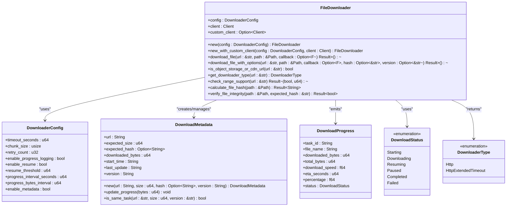

# OSS Storage Integration

<cite>
**Referenced Files in This Document**   
- [downloader.rs](file://client-core/src/downloader.rs)
- [update.rs](file://nuwax-cli/src/commands/update.rs)
- [patch_processor.rs](file://client-core/src/patch_executor/patch_processor.rs)
- [api_types.rs](file://client-core/src/api_types.rs)
- [config_manager.rs](file://client-core/src/config_manager.rs)
- [docker-compose.yml](file://client-core/fixtures/docker-compose.yml)
</cite>

## Table of Contents
1. [Introduction](#introduction)
2. [Project Structure](#project-structure)
3. [Core Components](#core-components)
4. [Architecture Overview](#architecture-overview)
5. [Detailed Component Analysis](#detailed-component-analysis)
6. [Dependency Analysis](#dependency-analysis)
7. [Performance Considerations](#performance-considerations)
8. [Troubleshooting Guide](#troubleshooting-guide)
9. [Conclusion](#conclusion)

## Introduction
This document provides comprehensive documentation for the Object Storage Service (OSS) integration within the duck_client application. The system is designed to handle large update packages and patch files through robust download mechanisms that support resumable transfers, integrity verification, and performance optimization. The implementation focuses on reliability for large file transfers, with features including signed URL construction, chunked downloads, hash-based integrity checks, and digital signature validation. This documentation details the architecture, functionality, and configuration of the downloader module and its integration into upgrade workflows.

## Project Structure
The project follows a modular architecture with distinct components for different responsibilities. The core functionality for OSS integration resides in the client-core module, specifically within the downloader component. The CLI interface (nuwax-cli) orchestrates upgrade workflows, while the UI layer (cli-ui) provides user interaction. Configuration management is centralized through the config_manager, and patch execution is handled by dedicated modules.

**Diagram sources**
- [downloader.rs](file://client-core/src/downloader.rs)
- [update.rs](file://nuwax-cli/src/commands/update.rs)

**Section sources**
- [downloader.rs](file://client-core/src/downloader.rs)
- [update.rs](file://nuwax-cli/src/commands/update.rs)

## Core Components
The OSS integration system comprises several key components that work together to provide reliable file downloads for update packages. The FileDownloader class is the central component responsible for managing downloads, supporting both standard HTTP and extended timeout connections for object storage services. It implements resumable downloads through HTTP Range requests and maintains download state through metadata files. The system integrates with upgrade workflows through the update command, which coordinates the download of service packages. Integrity verification is performed using SHA-256 hashes and digital signatures, with the patch processor handling validation of downloaded packages.

**Section sources**
- [downloader.rs](file://client-core/src/downloader.rs#L1-L100)
- [update.rs](file://nuwax-cli/src/commands/update.rs#L1-L50)
- [patch_processor.rs](file://client-core/src/patch_executor/patch_processor.rs#L1-L30)

## Architecture Overview
The OSS integration architecture follows a layered approach with clear separation of concerns. At the foundation is the HTTP client layer, which handles network communication with OSS providers. Above this, the downloader module provides abstraction for different storage providers and implements advanced download features. The configuration manager stores settings for download behavior and credentials. The upgrade workflow orchestrator coordinates the download process, while the patch executor handles post-download validation and processing.

**Diagram sources**
- [downloader.rs](file://client-core/src/downloader.rs#L1-L50)
- [update.rs](file://nuwax-cli/src/commands/update.rs#L1-L30)
- [patch_processor.rs](file://client-core/src/patch_executor/patch_processor.rs#L1-L20)

## Detailed Component Analysis

### File Downloader Analysis
The FileDownloader implementation provides comprehensive functionality for downloading files from OSS providers with support for resumable transfers and integrity verification. It automatically detects the type of storage provider based on the URL and configures appropriate timeouts and headers.

#### Class Diagram for Downloader Components

**Diagram sources**
- [downloader.rs](file://client-core/src/downloader.rs#L50-L200)

**Section sources**
- [downloader.rs](file://client-core/src/downloader.rs#L1-L300)

### Upgrade Workflow Integration
The downloader is integrated into the upgrade workflow through the update command, which orchestrates the download of service packages from OSS providers. The workflow handles both full upgrades and patch-based updates, with appropriate download strategies for each.

#### Sequence Diagram for Upgrade Process

**Diagram sources**
- [update.rs](file://nuwax-cli/src/commands/update.rs#L1-L160)
- [downloader.rs](file://client-core/src/downloader.rs#L500-L1000)
- [patch_processor.rs](file://client-core/src/patch_executor/patch_processor.rs#L100-L200)

**Section sources**
- [update.rs](file://nuwax-cli/src/commands/update.rs#L1-L160)

### Integrity Verification Analysis
The system implements a multi-layered approach to file integrity verification, combining cryptographic hash checks with digital signature validation to ensure downloaded packages have not been tampered with.

#### Flowchart for Integrity Verification

**Diagram sources**
- [patch_processor.rs](file://client-core/src/patch_executor/patch_processor.rs#L130-L180)
- [api_types.rs](file://client-core/src/api_types.rs#L800-L830)

**Section sources**
- [patch_processor.rs](file://client-core/src/patch_executor/patch_processor.rs#L130-L180)

## Dependency Analysis
The OSS integration system has well-defined dependencies between components, with clear interfaces and minimal coupling. The downloader module depends on external crates for HTTP functionality, cryptographic operations, and asynchronous I/O, while maintaining independence from the UI and business logic layers.

**Diagram sources**
- [downloader.rs](file://client-core/src/downloader.rs#L1-L20)
- [config_manager.rs](file://client-core/src/config_manager.rs#L1-L20)
- [patch_processor.rs](file://client-core/src/patch_executor/patch_processor.rs#L1-L20)

**Section sources**
- [downloader.rs](file://client-core/src/downloader.rs#L1-L50)
- [config_manager.rs](file://client-core/src/config_manager.rs#L1-L50)
- [patch_processor.rs](file://client-core/src/patch_executor/patch_processor.rs#L1-L50)

## Performance Considerations
The downloader implementation includes several performance optimizations for handling large update packages. The default configuration sets a 60-minute timeout for downloads, with an 8KB chunk size for streaming data. Progress updates are throttled to reduce logging overhead, with metadata saved only every 500MB or 5 minutes to minimize disk I/O. The system automatically detects object storage providers and applies extended timeouts for these services. For files larger than 1MB, the resumable download feature is enabled by default, allowing interrupted downloads to be resumed from the point of failure. Bandwidth usage is not explicitly limited, but the chunked download approach naturally limits memory usage during transfers.

**Section sources**
- [downloader.rs](file://client-core/src/downloader.rs#L130-L170)

## Troubleshooting Guide
When encountering issues with OSS downloads, several common problems and their solutions should be considered. For failed downloads, check network connectivity and ensure the OSS URL is accessible. If resumable downloads are not working, verify that the server supports HTTP Range requests by checking for the Accept-Ranges header in responses. For integrity verification failures, confirm that the expected hash matches the actual file content, and ensure the digital signature is in valid base64 format. If metadata files (.download) become corrupted, they can be safely deleted to force a fresh download. For authentication issues with private OSS buckets, ensure credentials are properly configured in environment variables or configuration files. Monitoring logs can provide insight into the download process, with detailed information about HTTP requests, progress updates, and error conditions.

**Section sources**
- [downloader.rs](file://client-core/src/downloader.rs#L300-L400)
- [patch_processor.rs](file://client-core/src/patch_executor/patch_processor.rs#L150-L180)

## Conclusion
The OSS integration in duck_client provides a robust solution for downloading large update packages and patch files. The system's architecture supports reliable transfers through resumable downloads, ensures file integrity through cryptographic verification, and integrates seamlessly with upgrade workflows. By automatically detecting object storage providers and applying appropriate configurations, the downloader simplifies the process of working with various OSS services. The implementation demonstrates best practices in error handling, progress tracking, and performance optimization for large file transfers. Future enhancements could include bandwidth throttling, parallel downloads for segmented files, and more comprehensive digital signature verification with certificate chain validation.