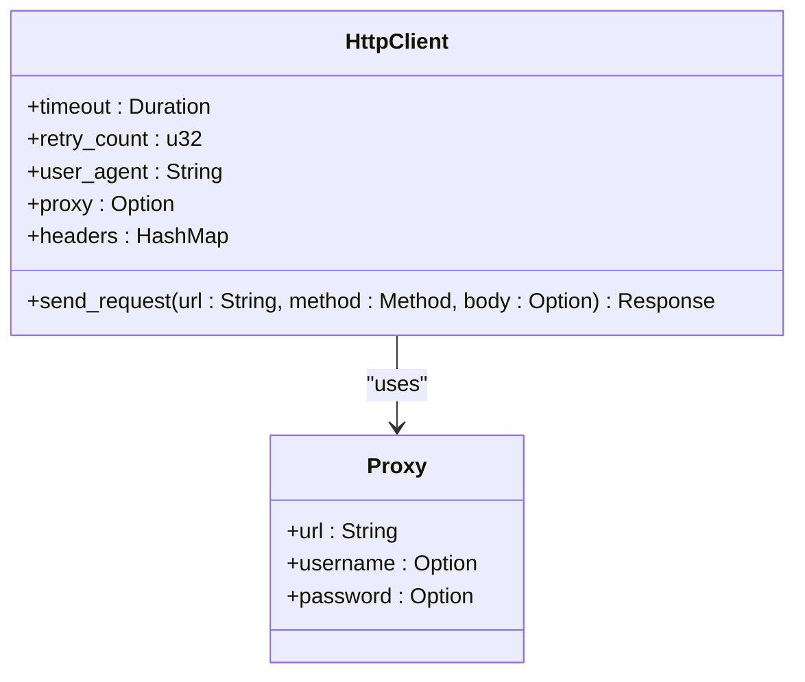
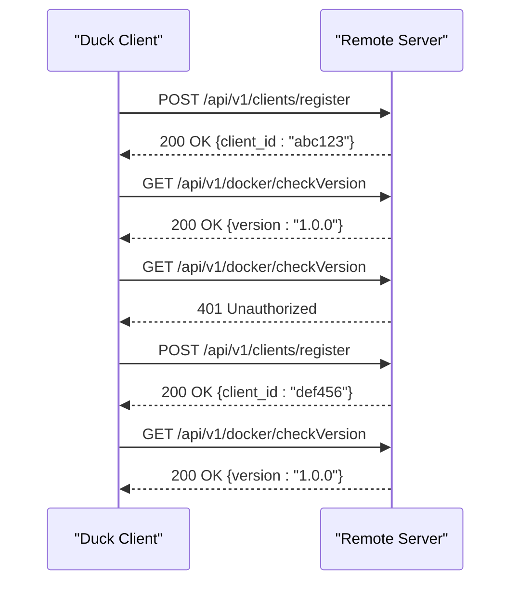
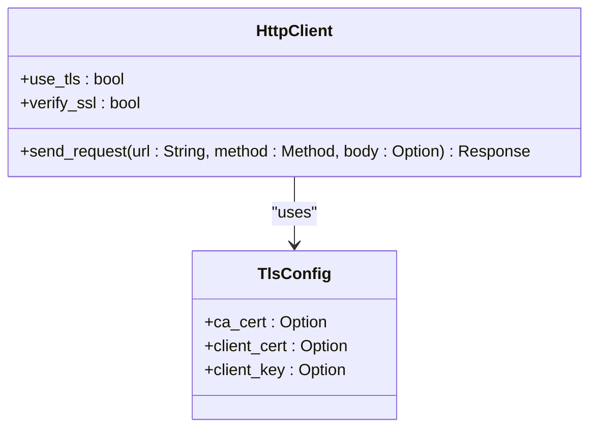
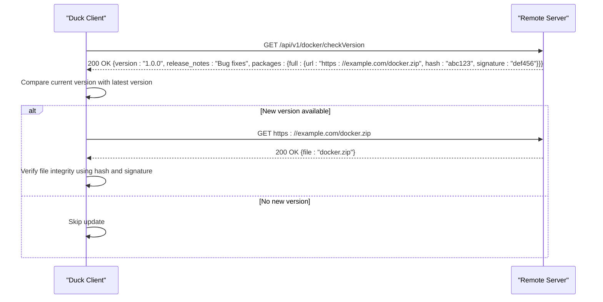
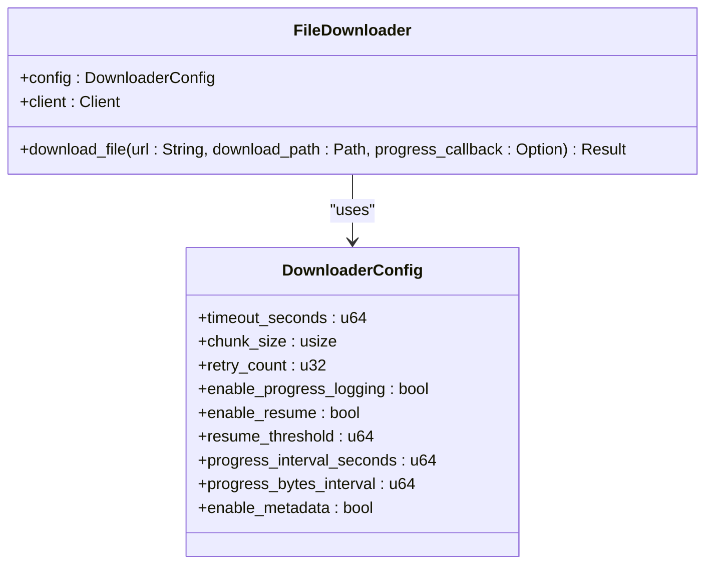
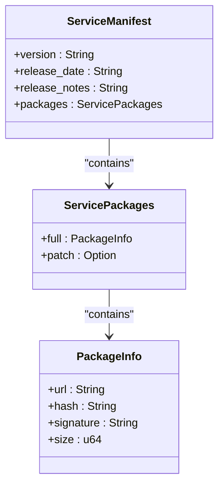
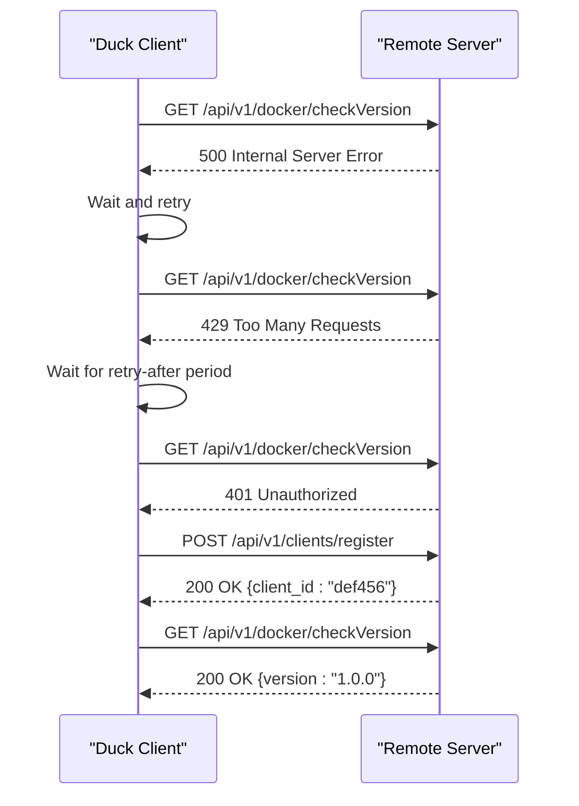
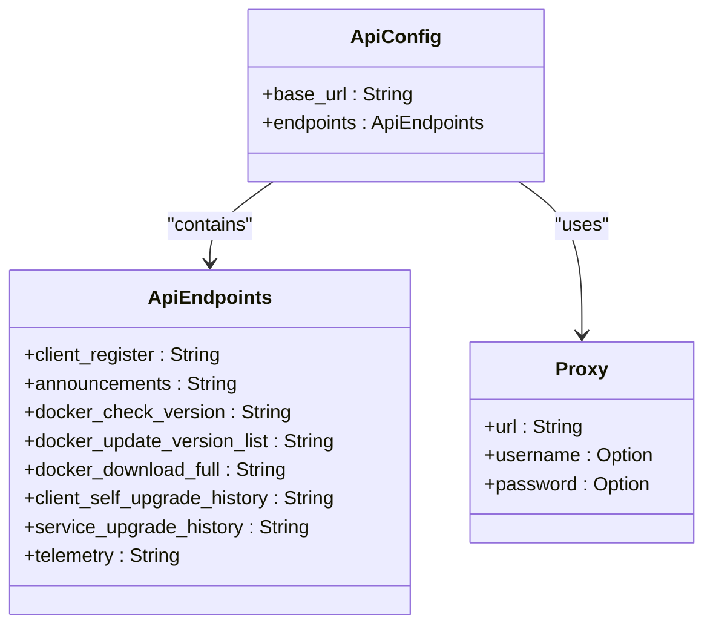
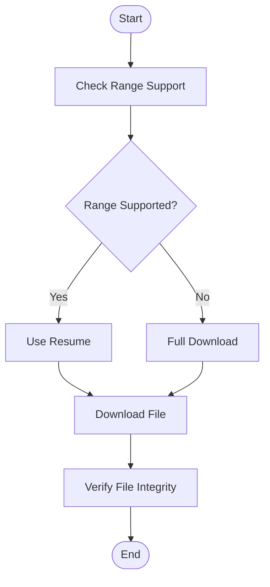

# Remote Server Communication

<cite>
**Referenced Files in This Document**   
- [client-core/src/downloader.rs](file://client-core/src/downloader.rs)
- [client-core/src/constants.rs](file://client-core/src/constants.rs)
- [client-core/src/authenticated_client.rs](file://client-core/src/authenticated_client.rs)
- [client-core/src/api.rs](file://client-core/src/api.rs)
- [client-core/src/api_config.rs](file://client-core/src/api_config.rs)
- [client-core/src/api_types.rs](file://client-core/src/api_types.rs)
</cite>

## Table of Contents
1. [Introduction](#introduction)
2. [Core Components](#core-components)
3. [HTTP Client Implementation](#http-client-implementation)
4. [Authentication Mechanisms](#authentication-mechanisms)
5. [Secure Communication via TLS](#secure-communication-via-tls)
6. [Request Flow for Version Checks and Manifest Downloads](#request-flow-for-version-checks-and-manifest-downloads)
7. [Package Retrieval with Retry Logic and Timeout Handling](#package-retrieval-with-retry-logic-and-timeout-handling)
8. [Request/Response Payloads for Manifest Fetching and Signature Verification](#requestresponse-payloads-for-manifest-fetching-and-signature-verification)
9. [Handling Server Unavailability, Rate Limiting, and Authentication Failures](#handling-server-unavailability-rate-limiting-and-authentication-failures)
10. [Configuration of Server Endpoints, Custom Headers, and Proxy Settings](#configuration-of-server-endpoints-custom-headers-and-proxy-settings)
11. [Debugging Network Issues and Validating Server Connectivity](#debugging-network-issues-and-validating-server-connectivity)

## Introduction
This document provides a comprehensive overview of the remote server communication system used by the Duck Client to fetch service manifests and update packages. The system is designed to ensure reliable, secure, and efficient communication with remote servers, supporting features such as version checks, manifest downloads, and package retrieval. The implementation includes robust error handling, retry logic, and timeout management to handle various network conditions and server responses. This document will detail the HTTP client implementation, authentication mechanisms, secure communication via TLS, request flows, and configuration options, providing a complete understanding of the system's functionality and design.

## Core Components
The remote server communication system is composed of several core components that work together to provide a seamless and secure experience for fetching service manifests and update packages. These components include the HTTP client, authentication mechanisms, secure communication via TLS, and the request flow for version checks, manifest downloads, and package retrieval. Each component is designed to handle specific aspects of the communication process, ensuring reliability, security, and efficiency.

**Section sources**
- [client-core/src/downloader.rs](file://client-core/src/downloader.rs#L1-L1327)
- [client-core/src/constants.rs](file://client-core/src/constants.rs#L1-L522)
- [client-core/src/authenticated_client.rs](file://client-core/src/authenticated_client.rs#L1-L227)
- [client-core/src/api.rs](file://client-core/src/api.rs#L1-L976)
- [client-core/src/api_config.rs](file://client-core/src/api_config.rs#L1-L125)
- [client-core/src/api_types.rs](file://client-core/src/api_types.rs#L1-L902)

## HTTP Client Implementation
The HTTP client implementation in the Duck Client is built using the `reqwest` library, which provides a high-level, asynchronous API for making HTTP requests. The client is configured with default settings for timeout, retry count, and user agent, ensuring that requests are handled efficiently and securely. The client is also capable of handling custom headers and proxy settings, allowing for flexible configuration based on the environment.

**Diagram sources**
- [client-core/src/constants.rs](file://client-core/src/constants.rs#L200-L220)
- [client-core/src/api.rs](file://client-core/src/api.rs#L1-L976)

**Section sources**
- [client-core/src/constants.rs](file://client-core/src/constants.rs#L200-L220)
- [client-core/src/api.rs](file://client-core/src/api.rs#L1-L976)

## Authentication Mechanisms
The Duck Client uses a client ID-based authentication mechanism to secure communication with the remote server. The client ID is generated during the initial registration process and is included in the `X-Client-ID` header of each request. If a request fails due to authentication issues (401 Unauthorized), the client automatically attempts to re-register and obtain a new client ID. This ensures that the client can continue to communicate with the server even if the client ID becomes invalid.

**Diagram sources**
- [client-core/src/authenticated_client.rs](file://client-core/src/authenticated_client.rs#L1-L227)
- [client-core/src/api.rs](file://client-core/src/api.rs#L1-L976)

**Section sources**
- [client-core/src/authenticated_client.rs](file://client-core/src/authenticated_client.rs#L1-L227)
- [client-core/src/api.rs](file://client-core/src/api.rs#L1-L976)

## Secure Communication via TLS
The Duck Client ensures secure communication with the remote server by using TLS (Transport Layer Security) for all HTTP requests. The `reqwest` client is configured to use TLS by default, and the client verifies the server's SSL certificate to prevent man-in-the-middle attacks. This ensures that all data transmitted between the client and the server is encrypted and secure.

**Diagram sources**
- [client-core/src/constants.rs](file://client-core/src/constants.rs#L200-L220)
- [client-core/src/api.rs](file://client-core/src/api.rs#L1-L976)

**Section sources**
- [client-core/src/constants.rs](file://client-core/src/constants.rs#L200-L220)
- [client-core/src/api.rs](file://client-core/src/api.rs#L1-L976)

## Request Flow for Version Checks and Manifest Downloads
The request flow for version checks and manifest downloads involves several steps, including checking the current version, fetching the service manifest, and downloading the update package. The client first sends a request to the `/api/v1/docker/checkVersion` endpoint to check the current version of the Docker service. If a new version is available, the client fetches the service manifest from the same endpoint, which contains information about the latest version, release notes, and download URLs. The client then uses the download URL to retrieve the update package.

**Diagram sources**
- [client-core/src/api.rs](file://client-core/src/api.rs#L1-L976)
- [client-core/src/api_types.rs](file://client-core/src/api_types.rs#L1-L902)

**Section sources**
- [client-core/src/api.rs](file://client-core/src/api.rs#L1-L976)
- [client-core/src/api_types.rs](file://client-core/src/api_types.rs#L1-L902)

## Package Retrieval with Retry Logic and Timeout Handling
The package retrieval process in the Duck Client is designed to handle various network conditions and server responses. The client uses a `FileDownloader` class to manage the download process, which supports features such as retry logic, timeout handling, and progress tracking. The `FileDownloader` is configured with default settings for timeout, retry count, and chunk size, ensuring that downloads are handled efficiently and reliably. If a download fails, the client automatically retries the request up to the specified number of times before giving up.

**Diagram sources**
- [client-core/src/downloader.rs](file://client-core/src/downloader.rs#L1-L1327)
- [client-core/src/api.rs](file://client-core/src/api.rs#L1-L976)

**Section sources**
- [client-core/src/downloader.rs](file://client-core/src/downloader.rs#L1-L1327)
- [client-core/src/api.rs](file://client-core/src/api.rs#L1-L976)

## Request/Response Payloads for Manifest Fetching and Signature Verification
The request and response payloads for manifest fetching and signature verification are defined in the `api_types.rs` file. The `ServiceManifest` struct represents the response from the `/api/v1/docker/checkVersion` endpoint, containing information about the latest version, release notes, and download URLs. The `PackageInfo` struct contains the URL, hash, and signature of the update package, which are used to verify the integrity and authenticity of the downloaded file.

**Diagram sources**
- [client-core/src/api_types.rs](file://client-core/src/api_types.rs#L1-L902)

**Section sources**
- [client-core/src/api_types.rs](file://client-core/src/api_types.rs#L1-L902)

## Handling Server Unavailability, Rate Limiting, and Authentication Failures
The Duck Client is designed to handle various server issues, including server unavailability, rate limiting, and authentication failures. If a request fails due to server unavailability, the client automatically retries the request up to the specified number of times before giving up. If the server returns a 429 Too Many Requests response, the client waits for the specified retry-after period before retrying the request. If a request fails due to authentication issues (401 Unauthorized), the client automatically attempts to re-register and obtain a new client ID.

**Diagram sources**
- [client-core/src/authenticated_client.rs](file://client-core/src/authenticated_client.rs#L1-L227)
- [client-core/src/api.rs](file://client-core/src/api.rs#L1-L976)

**Section sources**
- [client-core/src/authenticated_client.rs](file://client-core/src/authenticated_client.rs#L1-L227)
- [client-core/src/api.rs](file://client-core/src/api.rs#L1-L976)

## Configuration of Server Endpoints, Custom Headers, and Proxy Settings
The Duck Client allows for flexible configuration of server endpoints, custom headers, and proxy settings. The server endpoints are defined in the `ApiConfig` struct, which includes the base URL and a list of endpoints for various API functions. Custom headers can be added to requests using the `build_request` method, and proxy settings can be configured using the `Proxy` struct. This allows the client to adapt to different environments and network conditions.

**Diagram sources**
- [client-core/src/api_config.rs](file://client-core/src/api_config.rs#L1-L125)
- [client-core/src/constants.rs](file://client-core/src/constants.rs#L200-L220)

**Section sources**
- [client-core/src/api_config.rs](file://client-core/src/api_config.rs#L1-L125)
- [client-core/src/constants.rs](file://client-core/src/constants.rs#L200-L220)

## Debugging Network Issues and Validating Server Connectivity
To debug network issues and validate server connectivity, the Duck Client provides several tools and methods. The `check_range_support` method in the `FileDownloader` class can be used to check if the server supports range requests, which is necessary for resuming interrupted downloads. The `is_object_storage_or_cdn_url` method can be used to determine if the download URL is from an object storage or CDN service, which may require different timeout settings. Additionally, the client logs detailed information about each request and response, including headers and status codes, which can be used to diagnose issues.

**Diagram sources**
- [client-core/src/downloader.rs](file://client-core/src/downloader.rs#L1-L1327)

**Section sources**
- [client-core/src/downloader.rs](file://client-core/src/downloader.rs#L1-L1327)