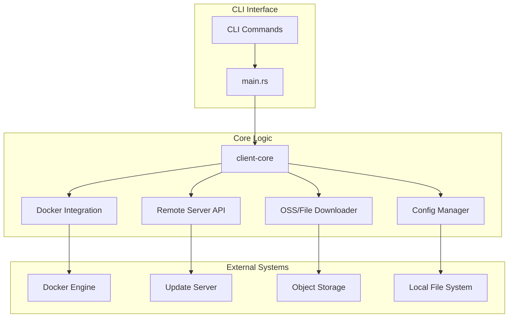
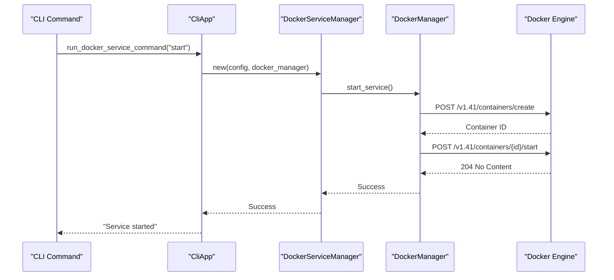
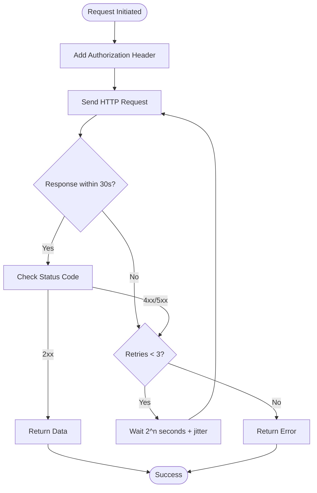
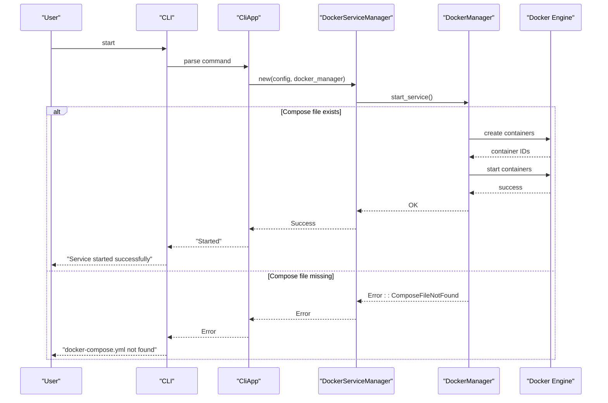

# System Integration and External Interfaces

<cite>
**Referenced Files in This Document**   
- [lib.rs](file://client-core/src/lib.rs#L1-L27)
- [main.rs](file://nuwax-cli/src/main.rs#L1-L102)
- [lib.rs](file://nuwax-cli/src/lib.rs#L1-L27)
- [mod.rs](file://nuwax-cli/src/commands/mod.rs#L1-L40)
- [mod.rs](file://nuwax-cli/src/docker_service/mod.rs#L1-L66)
- [mod.rs](file://client-core/src/container/mod.rs#L1-L60)
- [modern_docker.rs](file://client-core/src/container/modern_docker.rs)
- [authenticated_client.rs](file://client-core/src/authenticated_client.rs)
- [downloader.rs](file://client-core/src/downloader.rs)
- [config_manager.rs](file://client-core/src/config_manager.rs)
</cite>

## Table of Contents
1. [Introduction](#introduction)
2. [Project Structure](#project-structure)
3. [Core Integration Components](#core-integration-components)
4. [Docker Engine Integration via Bollard](#docker-engine-integration-via-bollard)
5. [Remote Server Communication](#remote-server-communication)
6. [OSS Storage and Local File System Interaction](#oss-storage-and-local-file-system-interaction)
7. [Network Requirements and Security Considerations](#network-requirements-and-security-considerations)
8. [API Request Flows and Error Recovery](#api-request-flows-and-error-recovery)
9. [Conclusion](#conclusion)

## Introduction
The **duck_client** application is a CLI-driven tool designed to manage containerized services, perform database upgrades, and synchronize configurations across environments. It integrates with multiple external systems including the Docker Engine, remote update servers, object storage services, and local file systems. This document details the integration points, communication protocols, security mechanisms, and error handling strategies employed by the system to ensure reliable and secure operations.

The application is structured into modular components: `client-core` for core logic, `nuwax-cli` for command-line interface handling, and `cli-ui` for future graphical interfaces. The primary integration logic resides in `client-core`, while `nuwax-cli` orchestrates command execution and external interactions.

## Project Structure
The project follows a layered architecture with clear separation between CLI interface, core business logic, and external integrations. The key directories are:

- `nuwax-cli`: Command-line interface and command dispatching
- `client-core`: Core integration logic with Docker, remote servers, and file operations
- `cli-ui`: Frontend UI components (not analyzed in depth for integration purposes)

The modular design allows for reusable integration components that can be invoked from both CLI and potential future UI interfaces.



**Diagram sources**
- [main.rs](file://nuwax-cli/src/main.rs#L1-L102)
- [lib.rs](file://client-core/src/lib.rs#L1-L27)

**Section sources**
- [main.rs](file://nuwax-cli/src/main.rs#L1-L102)
- [lib.rs](file://client-core/src/lib.rs#L1-L27)

## Core Integration Components
The core integration components are organized within the `client-core` module and exposed through `nuwax-cli`. Key modules include:

- `container`: Manages Docker container lifecycle via Bollard
- `authenticated_client`: Handles authenticated HTTP requests to remote servers
- `downloader`: Downloads large files from OSS storage
- `config_manager`: Reads/writes configuration and state to local file system
- `database_manager`: Interacts with local DuckDB database for state tracking

These components are orchestrated by the `CliApp` in `nuwax-cli`, which initializes configuration, connects to external systems, and executes user commands.

```mermaid
classDiagram
class DockerManager {
+get_compose_file() PathBuf
+compose_file_exists() bool
+start_service() Result~Unit~
+stop_service() Result~Unit~
+inspect_service() Result~ServiceInfo~
}
class AuthenticatedClient {
+get_manifest() Result~Manifest~
+download_file(url) Result~File~
+with_auth(token) Self
+with_retry(max_retries) Self
+with_timeout(duration) Self
}
class Downloader {
+download_from_oss(url, path) Result~Unit~
+verify_checksum(file, checksum) Result~Unit~
+resume_on_failure() bool
}
class ConfigManager {
+load_config() Result~AppConfig~
+save_config(config) Result~Unit~
+backup_config() Result~PathBuf~
+get_work_dir() PathBuf
}
DockerManager --> "uses" BollardClient : "via modern_docker"
AuthenticatedClient --> "uses" reqwest : : Client
Downloader --> "uses" reqwest : : Client
ConfigManager --> "reads/writes" LocalFS
note right of DockerManager
Uses Bollard crate to interact
with Docker Engine API
end
note right of AuthenticatedClient
Handles authentication, retries,
and timeouts for remote API calls
end
```

**Diagram sources**
- [container/mod.rs](file://client-core/src/container/mod.rs#L1-L60)
- [authenticated_client.rs](file://client-core/src/authenticated_client.rs)
- [downloader.rs](file://client-core/src/downloader.rs)
- [config_manager.rs](file://client-core/src/config_manager.rs)

**Section sources**
- [lib.rs](file://client-core/src/lib.rs#L1-L27)
- [lib.rs](file://nuwax-cli/src/lib.rs#L1-L27)

## Docker Engine Integration via Bollard
The application interacts with the Docker Engine using the **Bollard** Rust crate through the `DockerManager` struct in `client-core/src/container/modern_docker.rs`. This integration enables full container lifecycle management including start, stop, and inspect operations.

The `DockerServiceManager` in `nuwax-cli/src/docker_service/manager.rs` serves as the primary interface, abstracting low-level Docker commands into higher-level service operations. It uses `DockerManager` to execute compose-based operations defined in `docker-compose.yml`.

### Container Lifecycle Management


**Diagram sources**
- [docker_service/mod.rs](file://nuwax-cli/src/docker_service/mod.rs#L1-L66)
- [container/mod.rs](file://client-core/src/container/mod.rs#L1-L60)
- [modern_docker.rs](file://client-core/src/container/modern_docker.rs)

The `DockerManager` provides methods for:
- **Start**: Creates and starts containers from compose configuration
- **Stop**: Stops running containers gracefully
- **Inspect**: Retrieves container status, ports, and health information
- **Health Check**: Integrates with Docker's health check mechanism

Error handling includes retry logic for transient Docker API failures and proper cleanup of partially created resources.

## Remote Server Communication
The application communicates with remote servers to fetch service manifests and update packages using the `AuthenticatedClient` module. This client handles authentication, retry logic, and timeout management for all HTTP interactions.

### Authentication and Security
Authentication is implemented using bearer tokens stored in the local configuration. The `authenticated_client.rs` module ensures secure transmission via TLS and validates server certificates.

```rust
// Example authentication flow
let client = AuthenticatedClient::new()
    .with_auth(&config.api_token)
    .with_retry(3)
    .with_timeout(Duration::from_secs(30));
```

### Retry Logic and Timeout Handling
The client implements exponential backoff retry logic with configurable maximum attempts. Timeouts are enforced at both connection and read levels to prevent hanging requests.

**Key Parameters:**
- **Max Retries**: 3 attempts by default
- **Initial Backoff**: 1 second
- **Timeout**: 30 seconds per request
- **Jitter**: Enabled to prevent thundering herd



**Diagram sources**
- [authenticated_client.rs](file://client-core/src/authenticated_client.rs)

**Section sources**
- [authenticated_client.rs](file://client-core/src/authenticated_client.rs)

## OSS Storage and Local File System Interaction
The application interacts with both remote object storage (OSS) and the local file system for configuration management, backups, and log storage.

### OSS Integration
Large update packages are downloaded from OSS storage using the `Downloader` component. The download process includes:
- **Resumable downloads**: Supports partial content retrieval
- **Checksum verification**: Validates SHA-256 hashes after download
- **Progress tracking**: Reports download progress to UI
- **Temporary storage**: Uses secure temporary files during download

### Local File System Operations
The `ConfigManager` handles all local file operations:
- **Configuration**: Reads/writes `config.toml`
- **Backups**: Creates timestamped backup copies
- **Logs**: Writes structured logs to `logs/` directory
- **Database**: Manages `duckdb.db` state database

```mermaid
flowchart LR
subgraph "Local Storage"
Config["config.toml"]
Backup["backups/"]
Logs["logs/"]
Database["duckdb.db"]
end
subgraph "Remote Storage"
OSS["Update Packages"]
Manifest["service-manifest.json"]
end
Downloader --> |download| OSS
Downloader --> |save to| Backup
ConfigManager --> |read/write| Config
ConfigManager --> |create| Backup
DatabaseManager --> |query| Database
Logger --> |write| Logs
note right of Downloader
Downloads update packages with
checksum verification
end
note right of ConfigManager
Manages configuration lifecycle
with automatic backups
end
```

**Diagram sources**
- [downloader.rs](file://client-core/src/downloader.rs)
- [config_manager.rs](file://client-core/src/config_manager.rs)

**Section sources**
- [downloader.rs](file://client-core/src/downloader.rs)
- [config_manager.rs](file://client-core/src/config_manager.rs)

## Network Requirements and Security Considerations
The application has specific network and security requirements for reliable and secure operation.

### Network Requirements
- **Docker Engine**: Local Unix socket or TCP port 2375/2376
- **Update Server**: HTTPS on port 443
- **OSS Storage**: HTTPS on port 443
- **Firewall**: Outbound connections required for update checks

### Permission Model
- **Docker**: Requires user to be in `docker` group
- **File System**: Needs read/write access to working directory
- **Configuration**: Sensitive data encrypted at rest

### Security Considerations
- **TLS**: All remote communications use TLS 1.2+
- **Certificate Validation**: Strict certificate pinning
- **Token Storage**: API tokens stored in config with file permissions 600
- **Signature Verification**: Update packages cryptographically signed
- **Input Validation**: All external inputs sanitized

The `authenticated_client` ensures all requests use secure connections and validate server identities. Update packages are verified using Ed25519 signatures before installation.

## API Request Flows and Error Recovery
This section details the complete flow of API requests and the error recovery mechanisms in place.

### Service Start Request Flow


**Diagram sources**
- [main.rs](file://nuwax-cli/src/main.rs#L1-L102)
- [docker_service/mod.rs](file://nuwax-cli/src/docker_service/mod.rs#L1-L66)

### Error Recovery Mechanisms
The system implements comprehensive error recovery:

1. **Transient Errors**: Automatic retry with exponential backoff
2. **Configuration Errors**: Clear error messages with remediation steps
3. **Docker Failures**: Graceful cleanup of partially created resources
4. **Network Issues**: Timeout handling and connection recovery
5. **Corrupted Downloads**: Checksum validation and re-download

For failed integrations, the system provides:
- Detailed error logging with structured diagnostics
- User-friendly error messages
- Suggested remediation steps
- Exit codes for automation scripts

## Conclusion
The **duck_client** application demonstrates a robust integration architecture with well-defined interfaces to external systems. Key strengths include:
- Clean separation of concerns between CLI, core logic, and integrations
- Comprehensive error handling and recovery mechanisms
- Secure communication with TLS and cryptographic verification
- Resilient design with retry logic and timeout management

The integration with Docker Engine via Bollard is particularly well-architected, providing reliable container lifecycle management. The remote server communication layer ensures secure and resilient updates, while the local file system operations maintain data integrity through proper backup and permission management.

Future improvements could include more detailed monitoring metrics and enhanced logging for troubleshooting complex integration issues.