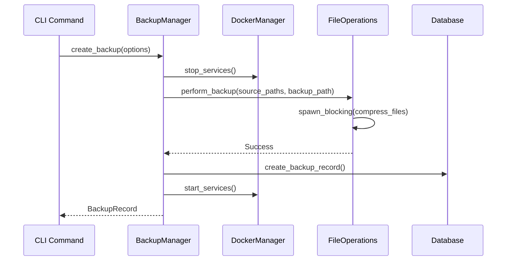
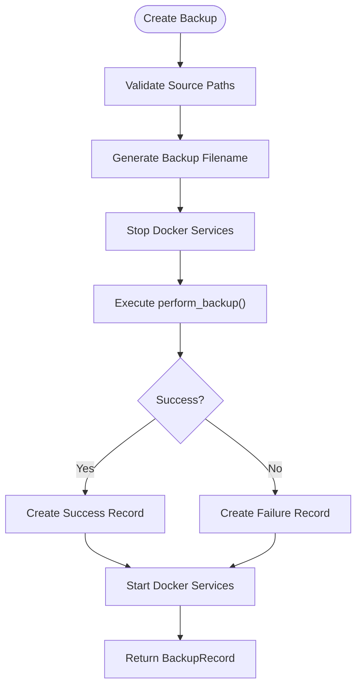
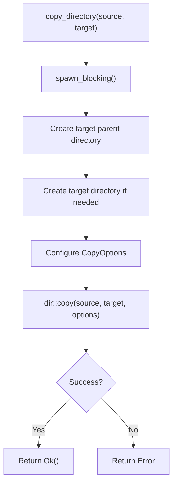
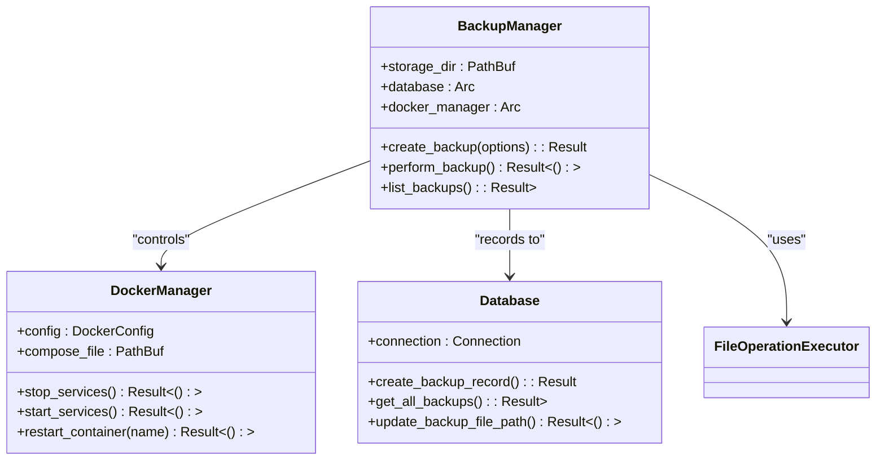

# Automatic Backup Process

<cite>
**Referenced Files in This Document**   
- [backup.rs](file://client-core/src/backup.rs)
- [file_operations.rs](file://client-core/src/patch_executor/file_operations.rs)
- [manager.rs](file://nuwax-cli/src/docker_service/manager.rs)
- [docker_service.rs](file://nuwax-cli/src/commands/docker_service.rs)
- [auto_upgrade_deploy.rs](file://nuwax-cli/src/commands/auto_upgrade_deploy.rs)
</cite>

## Table of Contents
1. [Introduction](#introduction)
2. [Backup Process Overview](#backup-process-overview)
3. [Backup Manager Implementation](#backup-manager-implementation)
4. [File Operations and Atomicity](#file-operations-and-atomicity)
5. [Docker Service Integration](#docker-service-integration)
6. [Storage Locations and Naming Conventions](#storage-locations-and-naming-conventions)
7. [CLI Command Integration](#cli-command-integration)
8. [Error Handling and Common Issues](#error-handling-and-common-issues)
9. [Performance Considerations](#performance-considerations)
10. [Best Practices](#best-practices)

## Introduction
The automatic backup process is a critical component of the system's upgrade safety mechanism. This document provides a comprehensive analysis of the pre-upgrade backup system, detailing how it captures the complete service state including configurations, databases, and mounted volumes. The implementation ensures data integrity through atomic operations and maintains container state consistency through Docker service integration.

**Section sources**
- [backup.rs](file://client-core/src/backup.rs#L0-L624)

## Backup Process Overview
The automatic backup process is triggered before any upgrade operation to ensure data safety and provide rollback capabilities. The system captures the complete service state through a coordinated process that includes stopping services, creating snapshots of critical data, and recording metadata in a database.

The backup workflow follows these key steps:
1. Service state preparation and container shutdown
2. Configuration and data snapshot creation
3. Compression and storage of backup files
4. Database recording of backup metadata
5. Service restart after successful backup

This process ensures that all critical components are captured in a consistent state, providing a reliable recovery point in case of upgrade failures.



**Diagram sources**
- [backup.rs](file://client-core/src/backup.rs#L60-L155)
- [manager.rs](file://nuwax-cli/src/docker_service/manager.rs#L440-L474)

**Section sources**
- [backup.rs](file://client-core/src/backup.rs#L60-L155)

## Backup Manager Implementation
The BackupManager struct is the core component responsible for orchestrating the backup process. It coordinates between the file system, database, and Docker services to create consistent snapshots.

### Backup Options Structure
The BackupOptions struct defines the parameters for backup operations:

```rust
pub struct BackupOptions {
    pub backup_type: BackupType,
    pub service_version: String,
    pub work_dir: PathBuf,
    pub source_paths: Vec<PathBuf>,
    pub compression_level: u32,
}
```

**Key fields:**
- **backup_type**: Distinguishes between manual and pre-upgrade backups
- **service_version**: Records the version at time of backup
- **source_paths**: Specifies directories and files to include
- **compression_level**: Controls compression ratio (0-9)

### Backup Creation Process
The `create_backup` method implements the main backup workflow:



**Diagram sources**
- [backup.rs](file://client-core/src/backup.rs#L60-L94)

**Section sources**
- [backup.rs](file://client-core/src/backup.rs#L60-L155)

## File Operations and Atomicity
The system uses the FileOperationExecutor from file_operations.rs to ensure atomic copy operations and directory synchronization during the backup process.

### Atomic File Replacement
The atomic_file_replace method ensures data integrity during file operations:

```rust
async fn atomic_file_replace(&self, source: &Path, target: &Path) -> Result<()> {
    // Ensure target directory exists
    if let Some(parent) = target.parent() {
        fs::create_dir_all(parent).await?;
    }

    // Use temporary file for atomic replacement
    let temp_file = NamedTempFile::new_in(target.parent().unwrap_or_else(|| Path::new(".")))?;

    // Copy content
    let source_content = fs::read(source).await?;
    fs::write(temp_file.path(), source_content).await?;

    // Atomic move
    temp_file.persist(target)?;

    Ok(())
}
```

### Directory Synchronization
The copy_directory method handles recursive directory copying with proper error handling:



**Diagram sources**
- [file_operations.rs](file://client-core/src/patch_executor/file_operations.rs#L269-L305)

**Section sources**
- [file_operations.rs](file://client-core/src/patch_executor/file_operations.rs#L0-L524)

## Docker Service Integration
The backup process integrates with the Docker service manager to ensure container state consistency during the backup window.

### Service Lifecycle Management
The BackupManager uses DockerManager to control service state:

```rust
// In backup.rs
pub async fn create_backup(&self, options: BackupOptions) -> Result<BackupRecord> {
    // ... preparation code ...
    
    // Stop services to ensure consistent state
    self.docker_manager.stop_services().await?;
    
    // Perform backup operations
    match self.perform_backup(&need_backup_paths, &backup_path, options.compression_level).await {
        Ok(_) => {
            // Start services after successful backup
            self.docker_manager.start_services().await?;
            // ... record success ...
        }
        Err(e) => {
            // Ensure services are started even on failure
            self.docker_manager.start_services().await?;
            // ... record failure ...
        }
    }
}
```

### Docker Manager Methods
Key methods from DockerManager ensure proper service coordination:

- **stop_services()**: Stops all running containers gracefully
- **start_services()**: Restarts containers after backup completion
- **restart_container()**: Individual container restart capability

The integration ensures that data is captured in a consistent state with no active writes during the backup process.



**Diagram sources**
- [backup.rs](file://client-core/src/backup.rs#L49-L58)
- [manager.rs](file://nuwax-cli/src/docker_service/manager.rs#L440-L474)

**Section sources**
- [backup.rs](file://client-core/src/backup.rs#L49-L58)
- [manager.rs](file://nuwax-cli/src/docker_service/manager.rs#L440-L474)

## Storage Locations and Naming Conventions
The system uses a structured approach to backup storage locations and naming conventions to ensure organization and easy identification.

### Storage Directory Management
The backup storage directory is configurable and can be migrated:

```rust
/// 检查并迁移备份存储目录
pub async fn migrate_storage_directory(&self, new_storage_dir: &Path) -> Result<()> {
    if new_storage_dir == self.storage_dir {
        return Ok(()); // No change
    }
    
    // Create new directory
    tokio::fs::create_dir_all(new_storage_dir).await?;
    
    // Move all backup files
    let backups = self.list_backups().await?;
    for backup in backups {
        let old_path = PathBuf::from(&backup.file_path);
        if old_path.exists() {
            let filename = old_path.file_name().ok_or_else(|| DuckError::Backup("无法获取备份文件名".to_string()))?;
            let new_path = new_storage_dir.join(filename);
            
            // Move file
            tokio::fs::rename(&old_path, &new_path).await?;
            
            // Update database record
            self.database.update_backup_file_path(backup.id, new_path.to_string_lossy().to_string()).await?;
        }
    }
    
    Ok(())
}
```

### Naming Convention
Backups use a human-readable naming convention that includes type, version, and timestamp:

```rust
let backup_filename = format!(
    "backup_{}_v{}_{}.tar.gz",
    backup_type_str, options.service_version, timestamp
);
```

**Components:**
- **backup**: Fixed prefix
- **type**: "manual" or "pre-upgrade"
- **version**: Service version identifier
- **timestamp**: ISO format date and time
- **.tar.gz**: Compression format

### Example Backup Filenames
- `backup_pre-upgrade_v1.2.3_2023-12-01_14-30-25.tar.gz`
- `backup_manual_v1.2.3_2023-12-02_09-15-45.tar.gz`

**Section sources**
- [backup.rs](file://client-core/src/backup.rs#L60-L94)
- [backup.rs](file://client-core/src/backup.rs#L490-L528)

## CLI Command Integration
The backup system is accessible through CLI commands and the Tauri command layer, providing both programmatic and user interfaces.

### CLI Command Implementation
The backup command in nuwax-cli orchestrates the backup process:

```rust
// In nuwax-cli/src/commands/backup.rs
match backup_manager.create_backup(backup_options).await {
    Ok(backup_record) => {
        info!("✅ Backup created successfully: {}", backup_record.file_path);
        info!("📝 Backup ID: {}", backup_record.id);
        info!("📏 Backup service version: {}", backup_record.service_version);
    }
    Err(e) => {
        error!("❌ Backup creation failed: {}", e);
        return Err(e);
    }
}
```

### Tauri Command Layer
The system exposes backup functionality through the Tauri command layer, allowing integration with the frontend UI components like BackupSelectionModal.tsx and OperationPanel.tsx.

### Auto Upgrade Integration
The pre-upgrade backup is automatically triggered in the upgrade process:

```rust
// In auto_upgrade_deploy.rs
async fn get_latest_backup_id(app: &CliApp) -> Result<Option<i64>> {
    let backup_manager = client_core::backup::BackupManager::new(
        app.config.get_backup_dir(),
        app.database.clone(),
        app.docker_manager.clone(),
    )?;
    
    match backup_manager.list_backups().await {
        Ok(backups) => {
            if backups.is_empty() {
                info!("📁 No backup records found");
                Ok(None)
            } else {
                // Get the latest backup
                let latest_backup = backups
                    .iter()
                    .max_by(|a, b| a.created_at.cmp(&b.created_at));
                // ... return latest backup ID
            }
        }
    }
}
```

**Section sources**
- [backup.rs](file://client-core/src/backup.rs#L375-L419)
- [auto_upgrade_deploy.rs](file://nuwax-cli/src/commands/auto_upgrade_deploy.rs#L1071-L1099)

## Error Handling and Common Issues
The system implements comprehensive error handling to address common issues that may occur during the backup process.

### Error Types and Handling
The backup process handles several common failure scenarios:

#### Insufficient Disk Space
The system estimates backup size before creation:

```rust
pub async fn estimate_backup_size(&self, source_dir: &Path) -> Result<u64> {
    let source_dir = source_dir.to_path_buf();
    
    let total_size = tokio::task::spawn_blocking(move || {
        let mut total = 0u64;
        for entry in WalkDir::new(&source_dir).into_iter().flatten() {
            if entry.path().is_file() {
                if let Ok(metadata) = entry.metadata() {
                    total += metadata.len();
                }
            }
        }
        total
    }).await?;
    
    // Account for compression (30-50% of original size)
    Ok(total_size / 2)
}
```

#### File Permission Errors
The system handles permission issues through proper error propagation:

```rust
// In file_operations.rs
async fn safe_remove_directory(&self, path: &Path) -> Result<()> {
    let path_clone = path.to_owned();
    tokio::task::spawn_blocking(move || remove_dir_all(&path_clone))
        .await
        .map_err(|e| PatchExecutorError::custom(format!("删除目录任务失败: {e}")))??;
    Ok(())
}
```

#### Partial Copy Failures
The system uses atomic operations to prevent partial copies:

```rust
// Using NamedTempFile for atomic replacement
let temp_file = NamedTempFile::new_in(target.parent().unwrap_or_else(|| Path::new(".")))?;
// Write to temp file
temp_file.persist(target)?; // Atomic move
```

### Backup Failure Recovery
When a backup fails, the system ensures services are restarted:

```rust
match self.perform_backup(&need_backup_paths, &backup_path, options.compression_level).await {
    Ok(_) => {
        // Record success and start services
        self.database.create_backup_record(/* completed */).await?;
        self.docker_manager.start_services().await?;
    }
    Err(e) => {
        // Record failure but still start services
        self.database.create_backup_record(/* failed */).await?;
        self.docker_manager.start_services().await?;
        return Err(e);
    }
}
```

**Section sources**
- [backup.rs](file://client-core/src/backup.rs#L96-L129)
- [file_operations.rs](file://client-core/src/patch_executor/file_operations.rs#L232-L267)

## Performance Considerations
The backup system implements several performance optimizations to handle large datasets efficiently.

### Background Processing
The system uses spawn_blocking to prevent async runtime blocking:

```rust
tokio::task::spawn_blocking(move || {
    let file = File::create(&backup_path)?;
    let compression = Compression::new(compression_level);
    let encoder = GzEncoder::new(file, compression);
    let mut archive = Builder::new(encoder);
    
    // Process files in blocking task
    for source_path in &source_paths {
        // ... archive processing ...
    }
    
    archive.finish()?;
    Ok::<(), anyhow::Error>(())
}).await??;
```

### Compression Level Configuration
Users can configure compression levels (0-9) to balance speed and size:

```rust
pub struct BackupOptions {
    // ... other fields ...
    pub compression_level: u32, // 0-9, where 0 is no compression, 9 is maximum
}
```

### Size Estimation
The system estimates backup size before creation to prevent disk space issues:

```rust
pub async fn estimate_backup_size(&self, source_dir: &Path) -> Result<u64> {
    // Walk directory tree to calculate total size
    // Return estimated compressed size (50% of original)
    Ok(total_size / 2)
}
```

For large databases, it's recommended to use lower compression levels (1-3) to reduce CPU usage and backup time.

**Section sources**
- [backup.rs](file://client-core/src/backup.rs#L126-L155)
- [backup.rs](file://client-core/src/backup.rs#L530-L568)

## Best Practices
To ensure data integrity and optimal performance during the backup window, follow these best practices:

### Pre-Backup Checklist
1. **Verify sufficient disk space**: Ensure at least 2x the estimated backup size is available
2. **Check file permissions**: Confirm read access to all source directories
3. **Schedule during low activity**: Perform backups during periods of low system usage
4. **Monitor system resources**: Watch CPU, memory, and disk I/O during backup

### Configuration Recommendations
- **Compression level**: Use level 3 for balanced performance and size
- **Backup frequency**: Regular manual backups in addition to pre-upgrade backups
- **Storage location**: Use fast storage (SSD) for backup operations
- **Retention policy**: Implement a backup rotation strategy to manage disk usage

### Monitoring and Verification
After backup completion:
1. Verify the backup file integrity
2. Check database records for successful backup entries
3. Validate file sizes match expectations
4. Test restore procedures periodically

These practices ensure reliable backups and quick recovery in case of upgrade failures.

**Section sources**
- [backup.rs](file://client-core/src/backup.rs#L530-L568)
- [file_operations.rs](file://client-core/src/patch_executor/file_operations.rs#L0-L524)