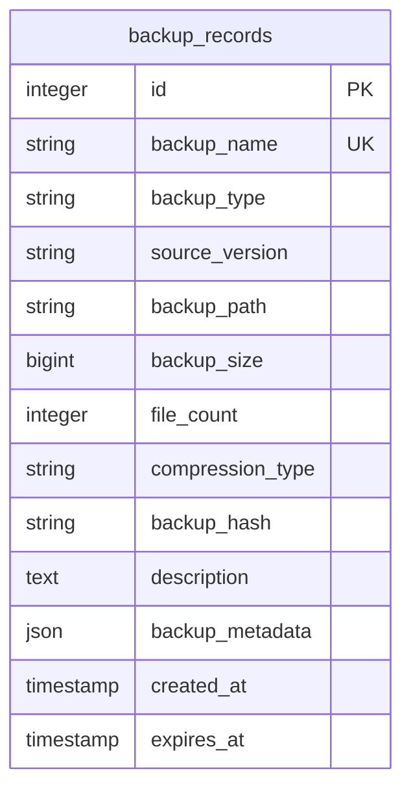
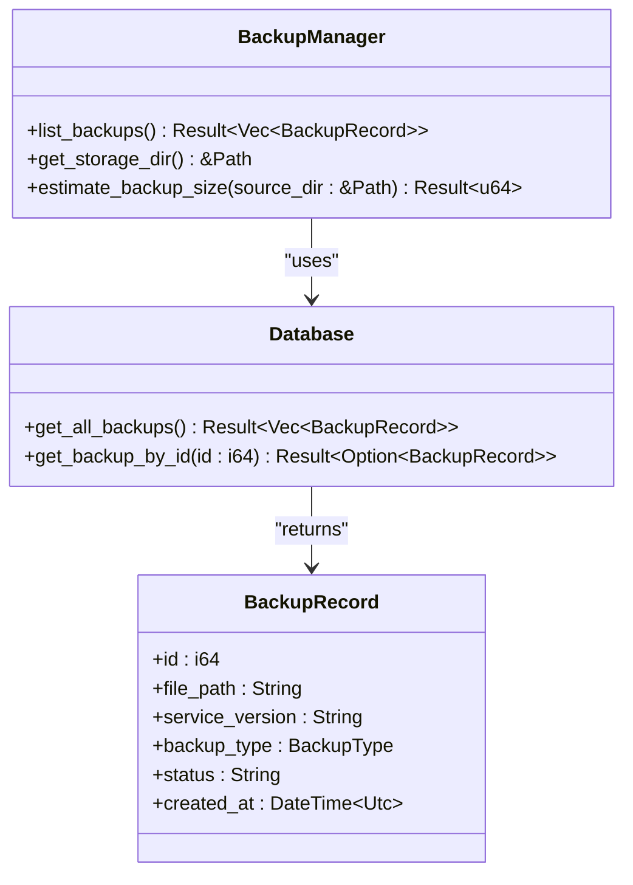
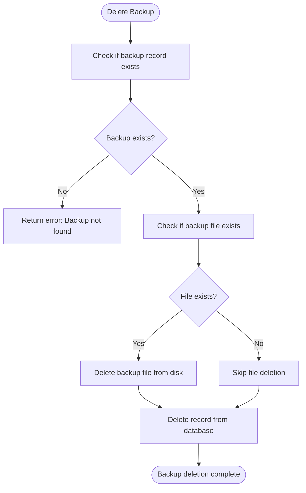
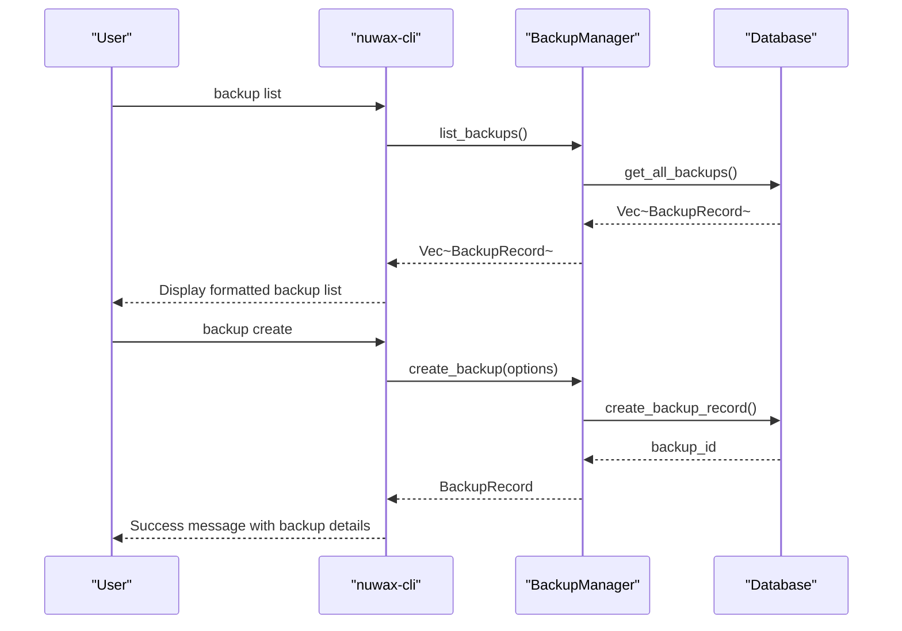
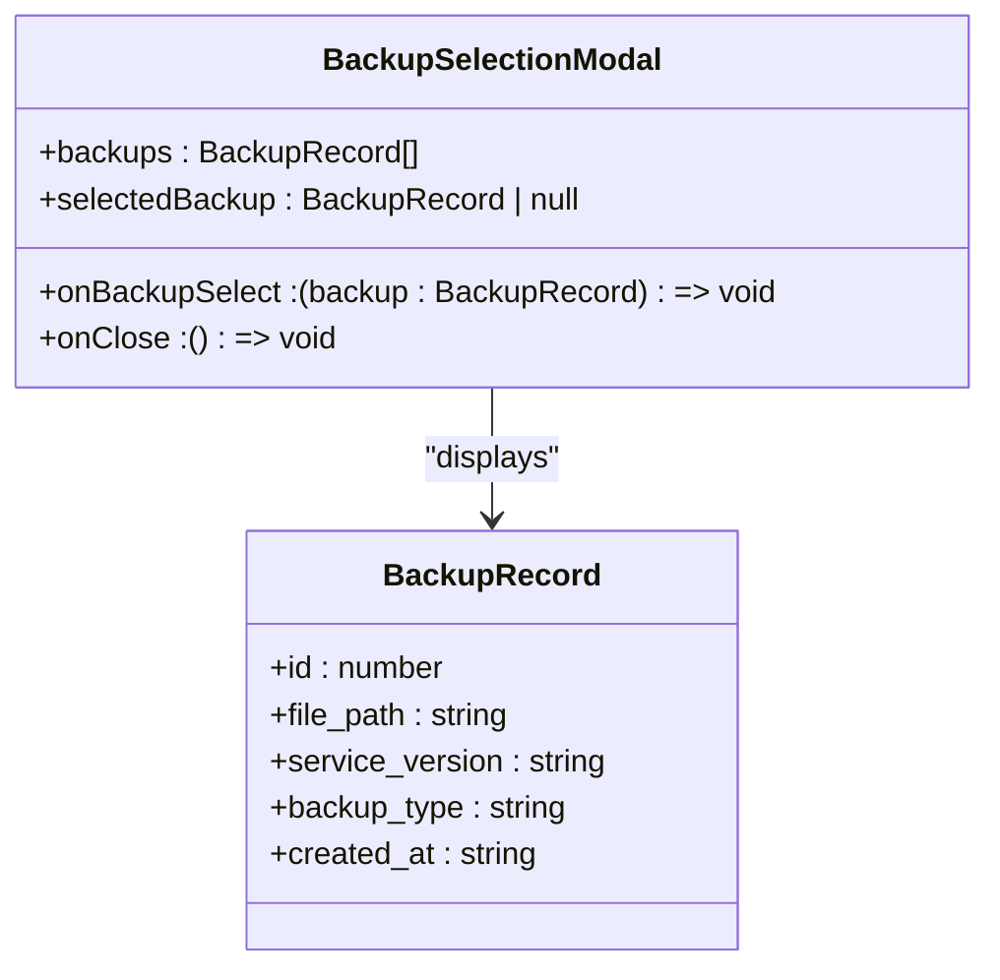
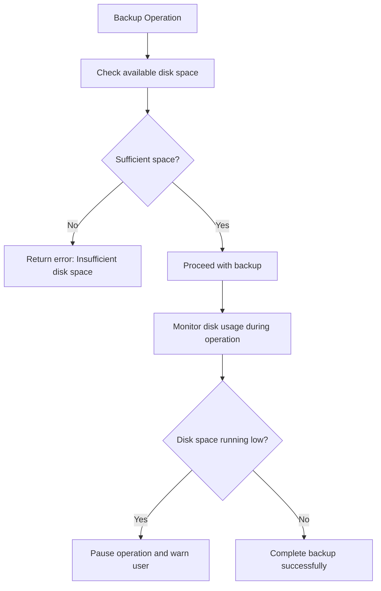
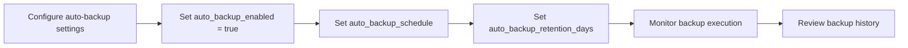

# Backup Management

<cite>
**Referenced Files in This Document**   
- [backup.rs](file://client-core/src/backup.rs#L1-L624)
- [database.rs](file://client-core/src/database.rs#L187-L368)
- [init_duckdb.sql](file://client-core/migrations/init_duckdb.sql#L158-L188)
- [backup.rs](file://nuwax-cli/src/commands/backup.rs#L417-L796)
- [BackupSelectionModal.tsx](file://cli-ui/src/components/BackupSelectionModal.tsx)
- [config_manager.rs](file://client-core/src/config_manager.rs#L545-L626)
- [actor.rs](file://client-core/src/db/actor.rs#L73-L111)
</cite>

## Table of Contents
1. [Backup Metadata and Database Schema](#backup-metadata-and-database-schema)
2. [Backup Enumeration and Inspection](#backup-enumeration-and-inspection)
3. [Retention Policies and Cleanup Operations](#retention-policies-and-cleanup-operations)
4. [CLI Backup Management](#cli-backup-management)
5. [GUI Backup Selection Interface](#gui-backup-selection-interface)
6. [Common Issues and Error Handling](#common-issues-and-error-handling)
7. [Best Practices for Backup Maintenance](#best-practices-for-backup-maintenance)

## Backup Metadata and Database Schema

The backup system stores comprehensive metadata for each backup in the DuckDB database, enabling detailed tracking and management of backup records. The schema is designed to capture essential information about each backup, including its type, source version, file location, and creation timestamp.

**Diagram sources**
- [init_duckdb.sql](file://client-core/migrations/init_duckdb.sql#L158-L188)

The `backup_records` table contains the following key fields:
- **id**: Primary key for the backup record
- **backup_name**: Unique identifier for the backup
- **backup_type**: Type of backup (manual, pre-upgrade)
- **source_version**: Service version at the time of backup
- **backup_path**: File system path to the backup file
- **created_at**: Timestamp when the backup was created
- **expires_at**: Optional expiration timestamp for retention policies

The system also maintains a JSON field `backup_metadata` for storing additional metadata that may be needed for future extensions or specific backup types.

**Section sources**
- [init_duckdb.sql](file://client-core/migrations/init_duckdb.sql#L158-L188)

## Backup Enumeration and Inspection

The backup system provides comprehensive functionality for listing and inspecting available backups through both CLI and GUI interfaces. The core functionality is implemented in the `BackupManager` class, which serves as the primary interface for backup operations.

**Diagram sources**
- [backup.rs](file://client-core/src/backup.rs#L500-L520)
- [database.rs](file://client-core/src/database.rs#L228-L267)

The `list_backups` method in `BackupManager` retrieves all backup records from the database by calling the `get_all_backups` method on the `Database` instance. This method returns a vector of `BackupRecord` objects, each containing the metadata for a specific backup.

The `BackupRecord` struct includes the following key properties:
- **id**: Unique identifier for the backup
- **file_path**: Path to the backup file on disk
- **service_version**: Version of the service when the backup was created
- **backup_type**: Enum indicating whether the backup was manual or pre-upgrade
- **created_at**: Timestamp of when the backup was created

**Section sources**
- [backup.rs](file://client-core/src/backup.rs#L500-L520)
- [database.rs](file://client-core/src/database.rs#L228-L267)

## Retention Policies and Cleanup Operations

The backup system implements retention policies to manage disk space and ensure that backups do not accumulate indefinitely. While the core retention logic is not fully implemented in the current codebase, the database schema includes an `expires_at` field in the `backup_records` table, indicating that time-based retention is a planned feature.

**Diagram sources**
- [backup.rs](file://client-core/src/backup.rs#L505-L515)
- [database.rs](file://client-core/src/database.rs#L308-L315)

The `delete_backup` method in `BackupManager` handles the deletion of backups by:
1. Retrieving the backup record from the database using `get_backup_by_id`
2. Checking if the backup file exists on disk
3. Deleting the file from the file system if it exists
4. Removing the record from the database using `delete_backup_record`

The system also includes functionality for migrating the backup storage directory, which updates both the file system location and the database record to maintain consistency.

**Section sources**
- [backup.rs](file://client-core/src/backup.rs#L490-L528)
- [database.rs](file://client-core/src/database.rs#L308-L315)

## CLI Backup Management

The command-line interface provides users with direct access to backup functionality through the `nuwax-cli` tool. The CLI commands enable users to list, create, and manage backups from the terminal.

**Diagram sources**
- [backup.rs](file://nuwax-cli/src/commands/backup.rs#L417-L796)
- [backup.rs](file://client-core/src/backup.rs#L100-L200)

The `run_list_backups` function in the CLI implementation displays all available backups in a formatted table that includes:
- Backup ID
- Backup type (manual, pre-upgrade)
- Creation timestamp
- Service version
- File size
- File status (available or missing)
- Filename

The CLI also performs validation on backup files, checking if they exist on disk and displaying appropriate status indicators (✅ available, ❌ file missing).

**Section sources**
- [backup.rs](file://nuwax-cli/src/commands/backup.rs#L417-L796)

## GUI Backup Selection Interface

The graphical user interface provides a visual way to select and manage backups through the `BackupSelectionModal.tsx` component. This modal interface allows users to view available backups and select one for restoration operations.

**Diagram sources**
- [BackupSelectionModal.tsx](file://cli-ui/src/components/BackupSelectionModal.tsx)

The `BackupSelectionModal` component receives a list of available backups and provides a user-friendly interface for selecting one. It displays key information about each backup, including the creation date, service version, and backup type, allowing users to make informed decisions about which backup to use for restoration.

While the exact implementation details of the component are not available in the provided code, the interface is designed to work with the same `BackupRecord` data structure used by the CLI and core backup system, ensuring consistency across different interfaces.

**Section sources**
- [BackupSelectionModal.tsx](file://cli-ui/src/components/BackupSelectionModal.tsx)

## Common Issues and Error Handling

The backup system includes several mechanisms to handle common issues that may arise during backup operations, such as orphaned backup directories, metadata corruption, and disk space exhaustion.

### Orphaned Backup Directories
Orphaned backup directories can occur when backup files are moved or deleted outside the application's control. The system handles this by:
- Checking the existence of backup files when listing backups
- Marking missing files with appropriate status indicators
- Allowing deletion of database records even if the file is already missing

### Metadata Corruption
Metadata corruption is mitigated through:
- Using a robust database (DuckDB) for storing backup metadata
- Implementing proper error handling in database operations
- Validating data before insertion and after retrieval

### Disk Space Exhaustion
Disk space issues are addressed through:
- The `estimate_backup_size` method, which calculates the expected size of a backup
- The ability to migrate backup storage to different directories
- Planned retention policies to automatically remove old backups

**Diagram sources**
- [backup.rs](file://client-core/src/backup.rs#L530-L568)

**Section sources**
- [backup.rs](file://client-core/src/backup.rs#L530-L568)

## Best Practices for Backup Maintenance

To ensure reliable backup operations and efficient storage management, the following best practices are recommended:

### Automating Backup Maintenance
Although the current implementation does not include automated scheduling, the system provides configuration options for automatic backups:
- **auto_backup_enabled**: Boolean flag to enable/disable automatic backups
- **auto_backup_schedule**: Cron expression for backup frequency
- **auto_backup_retention_days**: Number of days to retain backups

**Diagram sources**
- [config_manager.rs](file://client-core/src/config_manager.rs#L590-L626)

### Monitoring Storage Usage
Regular monitoring of storage usage is essential for maintaining system health:
- Use the `estimate_backup_size` method to predict backup sizes
- Track total backup storage consumption
- Set up alerts for low disk space conditions
- Regularly review backup statistics and cleanup old backups

### Regular Backup Verification
To ensure backup integrity:
- Periodically verify that backup files exist and are accessible
- Test restoration procedures with non-critical backups
- Monitor backup creation success/failure rates
- Review backup logs for errors or warnings

**Section sources**
- [config_manager.rs](file://client-core/src/config_manager.rs#L590-L626)