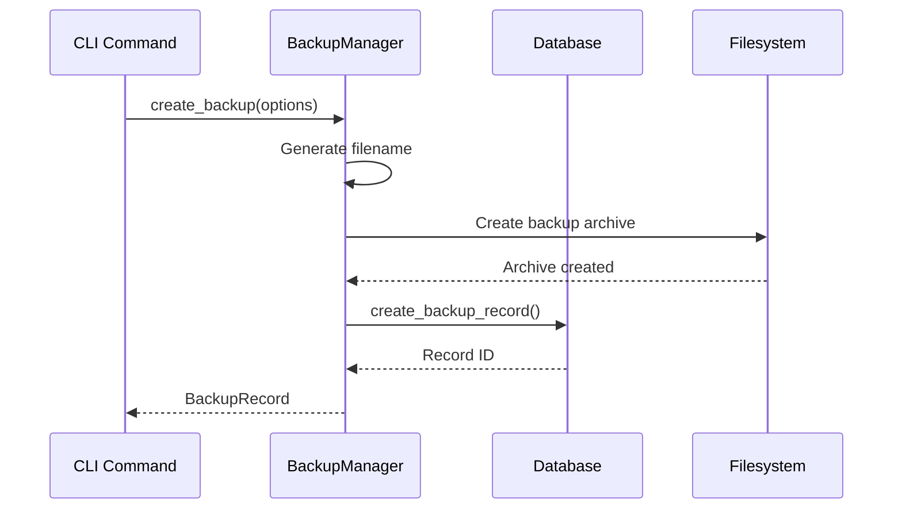
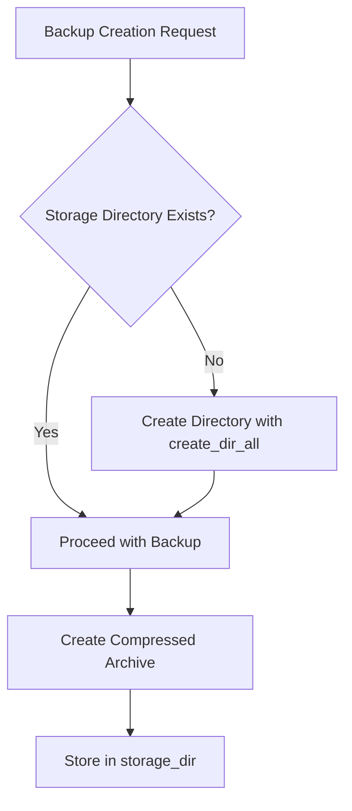
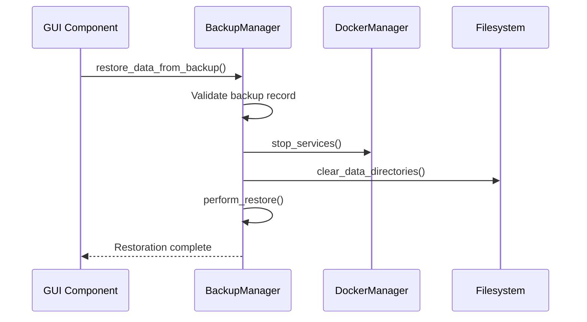
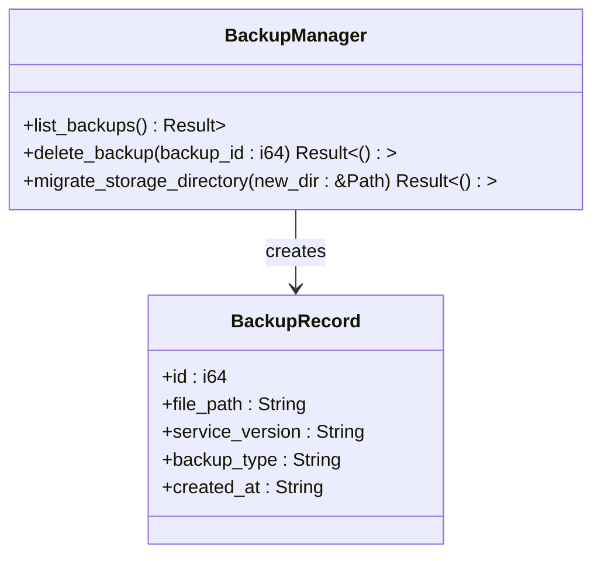
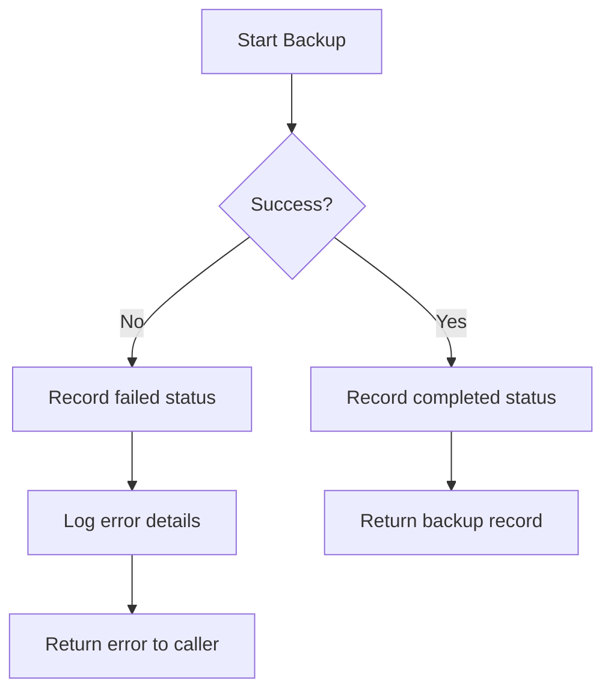
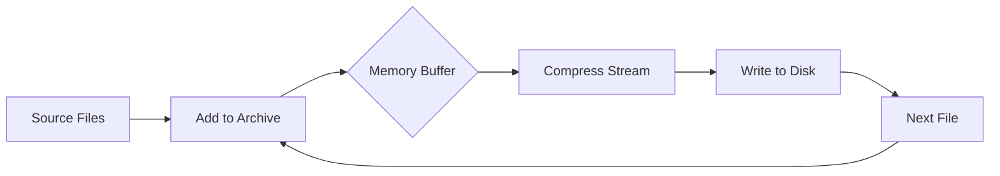

# Backup and Rollback System

<cite>
**Referenced Files in This Document**   
- [backup.rs](file://client-core/src/backup.rs#L60-L624)
- [BackupSelectionModal.tsx](file://cli-ui/src/components/BackupSelectionModal.tsx#L0-L302)
- [init_duckdb.sql](file://client-core/migrations/init_duckdb.sql#L158-L188)
- [database.rs](file://client-core/src/database.rs#L187-L226)
- [actor.rs](file://client-core/src/db/actor.rs#L300-L373)
</cite>

## Table of Contents
1. [Introduction](#introduction)
2. [Backup Creation Process](#backup-creation-process)
3. [Backup Storage and Naming](#backup-storage-and-naming)
4. [Backup Restoration and Rollback](#backup-restoration-and-rollback)
5. [Retention and Management](#retention-and-management)
6. [CLI and GUI Integration](#cli-and-gui-integration)
7. [Error Handling and Recovery](#error-handling-and-recovery)
8. [Performance Considerations](#performance-considerations)

## Introduction
The Backup and Rollback System ensures safe upgrades by automatically creating backups before any upgrade operation and providing one-click rollback capability. This system captures service state, configurations, and databases, enabling full recovery when upgrades fail. The implementation is primarily located in `backup.rs` and integrates with both CLI commands and GUI components for comprehensive backup management.

**Section sources**
- [backup.rs](file://client-core/src/backup.rs#L60-L94)

## Backup Creation Process

The backup system automatically triggers before any upgrade operation, ensuring service state, configurations, and databases are preserved. The process begins with the `create_backup` method in the `BackupManager` struct, which validates source paths and generates a human-readable backup filename.



**Diagram sources**
- [backup.rs](file://client-core/src/backup.rs#L60-L94)

**Section sources**
- [backup.rs](file://client-core/src/backup.rs#L60-L129)

### Backup Implementation Details
The backup creation process follows these steps:
1. Validate that all source paths exist
2. Generate a backup filename with timestamp and version information
3. Create a compressed tar.gz archive containing the specified data
4. Record the backup in the database with metadata

The filename follows the pattern: `backup_{type}_v{version}_{timestamp}.tar.gz`, where:
- `{type}` is either "manual" or "pre-upgrade"
- `{version}` is the service version at time of backup
- `{timestamp}` is in YYYY-MM-DD_HH-MM-SS format

During backup creation, the system uses `tokio::task::spawn_blocking` to perform the archive creation in a background thread, preventing the async runtime from being blocked by I/O operations.

```rust
let backup_filename = format!(
    "backup_{}_v{}_{}.tar.gz",
    backup_type_str, options.service_version, timestamp
);
let backup_path = self.storage_dir.join(&backup_filename);
```

**Section sources**
- [backup.rs](file://client-core/src/backup.rs#L60-L94)

## Backup Storage and Naming

### Storage Location
Backups are stored in a designated directory specified by the `storage_dir` field in the `BackupManager`. This directory is created automatically if it doesn't exist, ensuring the backup system can operate immediately after initialization.



**Diagram sources**
- [backup.rs](file://client-core/src/backup.rs#L60-L94)

### Naming Convention
The system uses a consistent naming convention for backup files that includes:
- Backup type (manual or pre-upgrade)
- Service version
- Timestamp in human-readable format

This naming scheme enables easy identification and sorting of backups by type, version, and creation time.

### Database Schema
Backup metadata is stored in the `backup_records` table with the following schema:

```sql
CREATE TABLE IF NOT EXISTS backup_records (
    id INTEGER PRIMARY KEY DEFAULT nextval('backup_records_seq'),
    backup_name VARCHAR NOT NULL UNIQUE,
    backup_type VARCHAR NOT NULL,
    source_version VARCHAR,
    backup_path VARCHAR NOT NULL,
    backup_size BIGINT,
    file_count INTEGER,
    compression_type VARCHAR DEFAULT 'gzip',
    backup_hash VARCHAR,
    description TEXT,
    backup_metadata JSON,
    created_at TIMESTAMP NOT NULL DEFAULT CURRENT_TIMESTAMP,
    expires_at TIMESTAMP
);
```

**Diagram sources**
- [init_duckdb.sql](file://client-core/migrations/init_duckdb.sql#L158-L188)

**Section sources**
- [init_duckdb.sql](file://client-core/migrations/init_duckdb.sql#L158-L188)
- [backup.rs](file://client-core/src/backup.rs#L60-L94)

## Backup Restoration and Rollback

### One-Click Rollback Implementation
The rollback system provides a one-click restoration capability that recovers from the most recent backup when upgrades fail. The process is initiated through the `restore_data_from_backup_with_exculde` method, which handles the complete restoration workflow.



**Diagram sources**
- [backup.rs](file://client-core/src/backup.rs#L188-L232)

**Section sources**
- [backup.rs](file://client-core/src/backup.rs#L188-L232)

### Restoration Process
The restoration process follows these steps:
1. Retrieve the backup record from the database
2. Verify the backup file exists
3. Stop all running services to prevent data corruption
4. Clear existing data directories while preserving configuration files
5. Extract the backup archive to the target directory
6. Restart services if requested

The system uses intelligent restoration that can exclude specific directories, allowing for selective recovery of data while preserving current configurations.

```rust
// Stop services before restoration
self.docker_manager.stop_services().await?;

// Clear data directories but preserve configuration
self.clear_data_directories(target_dir, dirs_to_exculde).await?;

// Perform the actual restoration
self.perform_restore(&backup_path, target_dir, dirs_to_exculde).await?;
```

**Section sources**
- [backup.rs](file://client-core/src/backup.rs#L188-L232)

## Retention and Management

### Backup Listing and Deletion
The system provides comprehensive backup management capabilities, including listing all available backups and deleting obsolete ones.



**Diagram sources**
- [backup.rs](file://client-core/src/backup.rs#L490-L528)

**Section sources**
- [backup.rs](file://client-core/src/backup.rs#L490-L528)

### Storage Directory Migration
The system supports migration of backup storage directories through the `migrate_storage_directory` method. This feature allows administrators to move backups to different storage locations without losing metadata references.

```rust
pub async fn migrate_storage_directory(&self, new_storage_dir: &Path) -> Result<()> {
    if new_storage_dir == self.storage_dir {
        return Ok(()); // No change
    }

    // Create new directory
    tokio::fs::create_dir_all(new_storage_dir).await?;

    // Get all backup records
    let backups = self.list_backups().await?;

    for backup in backups {
        let old_path = PathBuf::from(&backup.file_path);
        if old_path.exists() {
            let filename = old_path.file_name().unwrap();
            let new_path = new_storage_dir.join(filename);

            // Move file
            tokio::fs::rename(&old_path, &new_path).await?;

            // Update database path
            self.database.update_backup_file_path(backup.id, new_path.to_string_lossy().to_string()).await?;
        }
    }
    Ok(())
}
```

**Section sources**
- [backup.rs](file://client-core/src/backup.rs#L490-L528)

## CLI and GUI Integration

### GUI Backup Selection Modal
The GUI provides a user-friendly interface for selecting backups through the `BackupSelectionModal` component. This modal displays all available backups with their metadata and allows users to select which backup to restore.

```mermaid
flowchart TD
A[Open BackupSelectionModal] --> B[Fetch backups via DuckCliManager]
B --> C{Backups Available?}
C --> |No| D[Display "No backups" message]
C --> |Yes| E[Display backup list]
E --> F[User selects backup]
F --> G[Display backup details]
G --> H[Confirm restoration]
```

**Diagram sources**
- [BackupSelectionModal.tsx](file://cli-ui/src/components/BackupSelectionModal.tsx#L0-L302)

**Section sources**
- [BackupSelectionModal.tsx](file://cli-ui/src/components/BackupSelectionModal.tsx#L0-L302)

### Backup Data Structure
The backup records are shared between the backend and frontend through a consistent data structure:

```typescript
interface BackupRecord {
  id: number;
  backup_type: 'Manual' | 'PreUpgrade';
  created_at: string;
  service_version: string;
  file_path: string;
  file_size?: number;
  file_exists: boolean;
}
```

The GUI displays key information including backup ID, type, creation time, service version, file size, and file path, allowing users to make informed decisions about which backup to restore.

**Section sources**
- [BackupSelectionModal.tsx](file://cli-ui/src/components/BackupSelectionModal.tsx#L0-L302)

## Error Handling and Recovery

### Backup Creation Error Handling
The system implements comprehensive error handling for backup operations, ensuring failures are properly recorded and communicated.



When a backup fails, the system still creates a record in the database with a "failed" status, preserving the attempt history for troubleshooting.

```rust
match self.perform_backup(&need_backup_paths, &backup_path, options.compression_level).await {
    Ok(_) => {
        // Record successful backup
        let record_id = self.database.create_backup_record(... BackupStatus::Completed).await?;
    }
    Err(e) => {
        // Record failed backup
        self.database.create_backup_record(... BackupStatus::Failed).await?;
        Err(e)
    }
}
```

**Section sources**
- [backup.rs](file://client-core/src/backup.rs#L96-L129)

### Common Issues and Solutions
The system addresses several common backup and restoration issues:

**Incomplete Backups**: If a backup operation is interrupted, the system marks it as failed in the database. The incomplete file may remain on disk but is not considered valid for restoration.

**Corrupted Archives**: During restoration, the system validates the archive integrity. Corrupted archives fail during extraction and trigger appropriate error handling.

**Conflicts During Rollback**: The system stops all services before restoration to prevent file locking conflicts. It also ensures parent directories exist before extracting files.

**Disk Space Issues**: While explicit disk space checking is not shown in the provided code, the system would encounter I/O errors during backup creation if insufficient space is available, which are propagated as appropriate error types.

**Permission Problems**: File operations may fail due to permission issues, which are caught and converted to `DuckError::Backup` variants with descriptive messages.

**Section sources**
- [backup.rs](file://client-core/src/backup.rs#L346-L413)

## Performance Considerations

### Large Data Set Handling
The backup system is designed to handle large data sets efficiently through several mechanisms:

1. **Background Processing**: Archive creation and extraction are performed in blocking tasks to prevent async runtime blocking
2. **Streaming Compression**: The system uses streaming compression (gzip) which doesn't require loading entire files into memory
3. **Incremental Processing**: The tar archive is built incrementally, processing one file at a time



**Diagram sources**
- [backup.rs](file://client-core/src/backup.rs#L188-L232)

### Size Estimation
The system includes functionality to estimate backup sizes before creation:

```rust
pub async fn estimate_backup_size(&self, source_dir: &Path) -> Result<u64> {
    let total_size = tokio::task::spawn_blocking(move || {
        let mut total = 0u64;
        for entry in WalkDir::new(&source_dir).into_iter().flatten() {
            if entry.path().is_file() {
                if let Ok(metadata) = entry.metadata() {
                    total += metadata.len();
                }
            }
        }
        total
    }).await?;
    
    // Estimate compressed size (30-50% of original)
    Ok(total_size / 2)
}
```

This estimation helps users anticipate storage requirements and potential backup durations.

**Section sources**
- [backup.rs](file://client-core/src/backup.rs#L530-L568)

### Best Practices for Backup Verification
To ensure backup reliability, the following best practices are recommended:

1. **Regular Testing**: Periodically test restoration from backups to verify integrity
2. **Multiple Copies**: Maintain backup copies in different locations when possible
3. **Monitoring**: Monitor backup success/failure rates and investigate failures promptly
4. **Retention Policy**: Implement a retention policy that balances storage costs with recovery needs
5. **Validation**: After restoration, validate service functionality to ensure complete recovery

The system's design supports these practices through reliable backup creation, comprehensive metadata storage, and straightforward restoration processes.

**Section sources**
- [backup.rs](file://client-core/src/backup.rs#L60-L624)