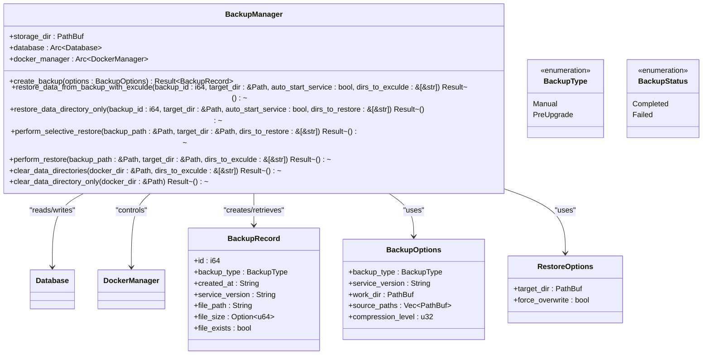
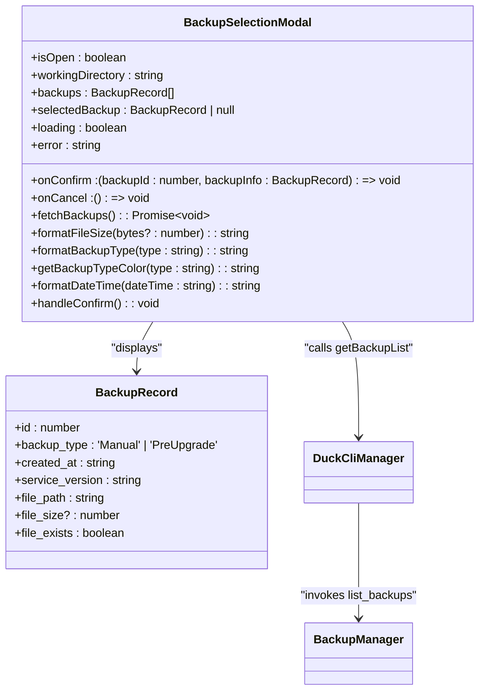
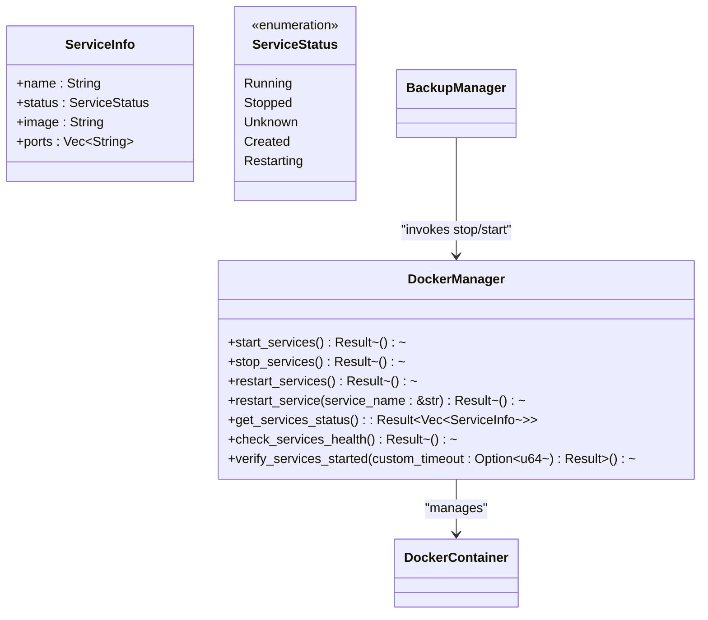
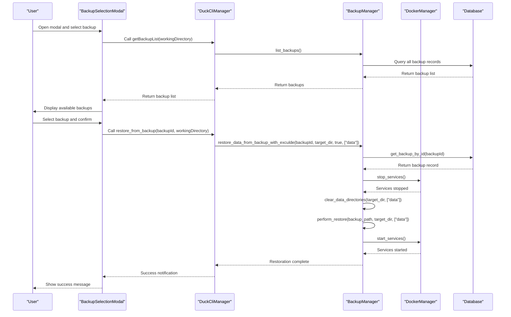
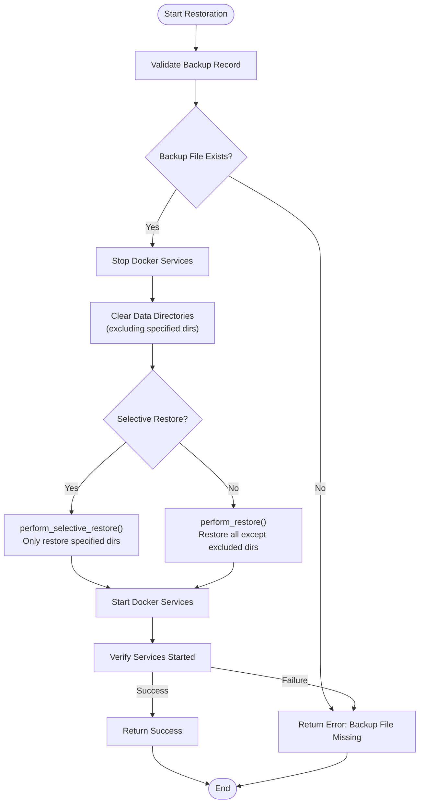
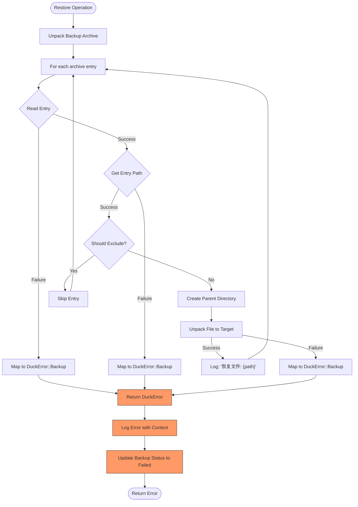
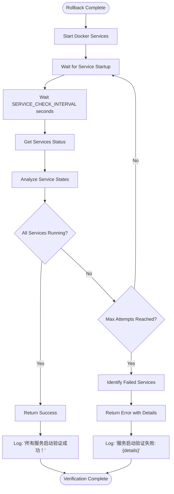

# One-Click Rollback

<cite>
**Referenced Files in This Document**   
- [backup.rs](file://client-core/src/backup.rs)
- [BackupSelectionModal.tsx](file://cli-ui/src/components/BackupSelectionModal.tsx)
- [service.rs](file://client-core/src/container/service.rs)
- [error.rs](file://client-core/src/error.rs)
</cite>

## Table of Contents
1. [Introduction](#introduction)
2. [Core Components](#core-components)
3. [Rollback Workflow](#rollback-workflow)
4. [Error Handling and Recovery](#error-handling-and-recovery)
5. [Common Issues and Troubleshooting](#common-issues-and-troubleshooting)
6. [Verification and Monitoring](#verification-and-monitoring)

## Introduction
The One-Click Rollback feature enables users to recover from failed upgrades by restoring the system to a previous stable state using saved backups. This functionality integrates a graphical user interface (GUI) for backup selection with a robust backend system that handles service shutdown, state restoration, and restart validation. The rollback process ensures data integrity by restoring Docker volumes, configuration files, and database snapshots from compressed archives. This document details the implementation, workflow, error handling, and best practices for using the rollback system effectively.

## Core Components

### Backup Management System
The core rollback logic is implemented in the `BackupManager` struct defined in `backup.rs`. This component orchestrates the entire restoration process, including service lifecycle management, file restoration, and post-recovery validation.



**Diagram sources**
- [backup.rs](file://client-core/src/backup.rs#L49-L155)

**Section sources**
- [backup.rs](file://client-core/src/backup.rs#L49-L155)

### GUI Interface: BackupSelectionModal
The `BackupSelectionModal.tsx` component provides a user-friendly interface for selecting backups to restore. It displays available backups with metadata such as creation time, version, size, and type, allowing users to make informed decisions about which backup to use.



**Diagram sources**
- [BackupSelectionModal.tsx](file://cli-ui/src/components/BackupSelectionModal.tsx#L10-L302)

**Section sources**
- [BackupSelectionModal.tsx](file://cli-ui/src/components/BackupSelectionModal.tsx#L10-L302)

### Service Lifecycle Management
The `DockerManager` in `service.rs` handles the container lifecycle operations required during rollback. It provides methods to start, stop, and restart services, ensuring proper state transitions during the restoration process.



**Diagram sources**
- [service.rs](file://client-core/src/container/service.rs#L11-L71)

**Section sources**
- [service.rs](file://client-core/src/container/service.rs#L11-L71)

## Rollback Workflow

### Complete Rollback Sequence
The rollback process follows a well-defined sequence of operations to ensure system stability and data integrity.



**Diagram sources**
- [backup.rs](file://client-core/src/backup.rs#L224-L284)
- [BackupSelectionModal.tsx](file://cli-ui/src/components/BackupSelectionModal.tsx#L130-L150)
- [service.rs](file://client-core/src/container/service.rs#L11-L47)

**Section sources**
- [backup.rs](file://client-core/src/backup.rs#L224-L284)
- [BackupSelectionModal.tsx](file://cli-ui/src/components/BackupSelectionModal.tsx#L130-L150)
- [service.rs](file://client-core/src/container/service.rs#L11-L47)

### Selective Restoration Logic
The system supports selective restoration, allowing specific directories to be excluded from the rollback process. This is particularly useful when preserving user data while restoring configuration files.



**Diagram sources**
- [backup.rs](file://client-core/src/backup.rs#L244-L284)

**Section sources**
- [backup.rs](file://client-core/src/backup.rs#L244-L284)

## Error Handling and Recovery

### Error Type Hierarchy
The system uses a comprehensive error handling mechanism centered around the `DuckError` enum, which categorizes different types of failures that can occur during rollback operations.

```mermaid
classDiagram
class DuckError {
<<enumeration>>
Config(toml : : de : : Error)
DuckDb(String)
Http(reqwest : : Error)
Io(std : : io : : Error)
Uuid(uuid : : Error)
Serde(serde_json : : Error)
Join(tokio : : task : : JoinError)
Zip(zip : : result : : ZipError)
WalkDir(walkdir : : Error)
StripPrefix(std : : path : : StripPrefixError)
Template(String)
Docker(String)
Backup(String)
Upgrade(String)
ClientNotRegistered
InvalidResponse(String)
Custom(String)
ConfigNotFound
Api(String)
DockerService(String)
BadRequest(String)
VersionParse(String)
ServiceUpgradeParse(String)
}
class Result[T, E] {
Ok(T)
Err(E)
}
BackupManager --> DuckError : "returns"
DockerManager --> DuckError : "returns"
Result --> DuckError : "specialization"
style DuckError fill : #f9f,stroke : #333,stroke-width : 1px
```

**Diagram sources**
- [error.rs](file://client-core/src/error.rs#L3-L109)

**Section sources**
- [error.rs](file://client-core/src/error.rs#L3-L109)

### Restoration Error Handling
When restoration fails, the system follows a structured error handling approach that provides meaningful feedback and maintains system stability.



**Diagram sources**
- [backup.rs](file://client-core/src/backup.rs#L346-L413)

**Section sources**
- [backup.rs](file://client-core/src/backup.rs#L346-L413)

## Common Issues and Troubleshooting

### Known Issues and Solutions
The following table outlines common issues encountered during rollback operations and their recommended solutions:

| Issue | Cause | Solution | Detection Method |
|-------|-------|----------|------------------|
| Corrupted Backup Archives | File system errors, incomplete backups, or storage issues | Verify backup integrity before restoration; implement checksum validation | Attempt to read archive header and validate entry count |
| Version Incompatibilities | Attempting to restore a backup created with a different software version | Ensure version compatibility between backup and current system; implement version validation | Compare service_version in backup record with current version |
| Running Container Conflicts | Services still running during restoration attempt | Ensure proper service shutdown before restoration; implement timeout and retry logic | Check service status via get_services_status() before proceeding |
| Permission Issues | Insufficient file system permissions for restoration | Ensure proper directory permissions; run with appropriate privileges | Catch Io errors during file operations |
| Disk Space Insufficiency | Insufficient space for extracted backup | Check available disk space before restoration; provide space estimation | Use estimate_backup_size() and compare with available space |

**Section sources**
- [backup.rs](file://client-core/src/backup.rs#L530-L568)
- [service.rs](file://client-core/src/container/service.rs#L450-L474)

## Verification and Monitoring

### Post-Rollback Validation
After completing the rollback process, the system performs comprehensive validation to ensure successful restoration and service operation.



**Diagram sources**
- [service.rs](file://client-core/src/container/service.rs#L450-L474)

**Section sources**
- [service.rs](file://client-core/src/container/service.rs#L450-L474)