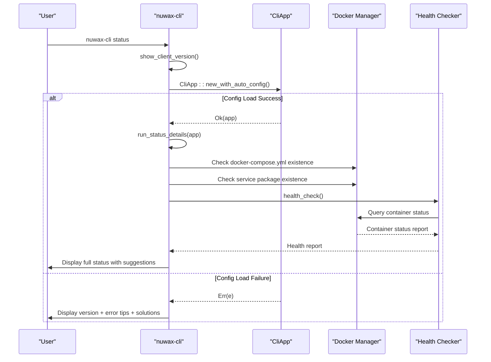
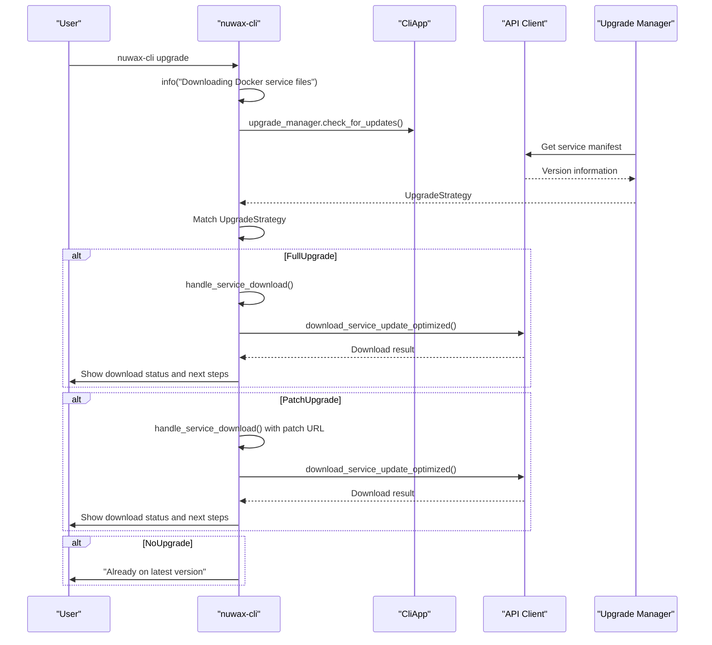
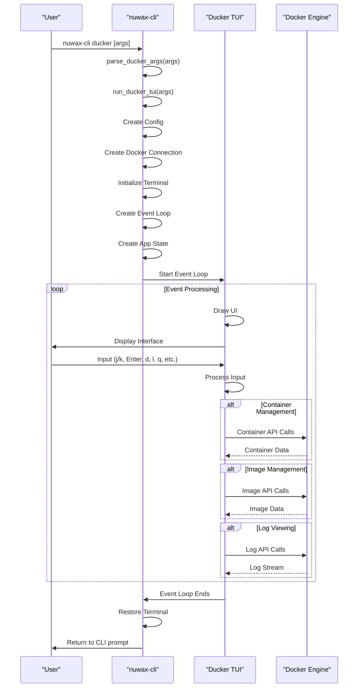
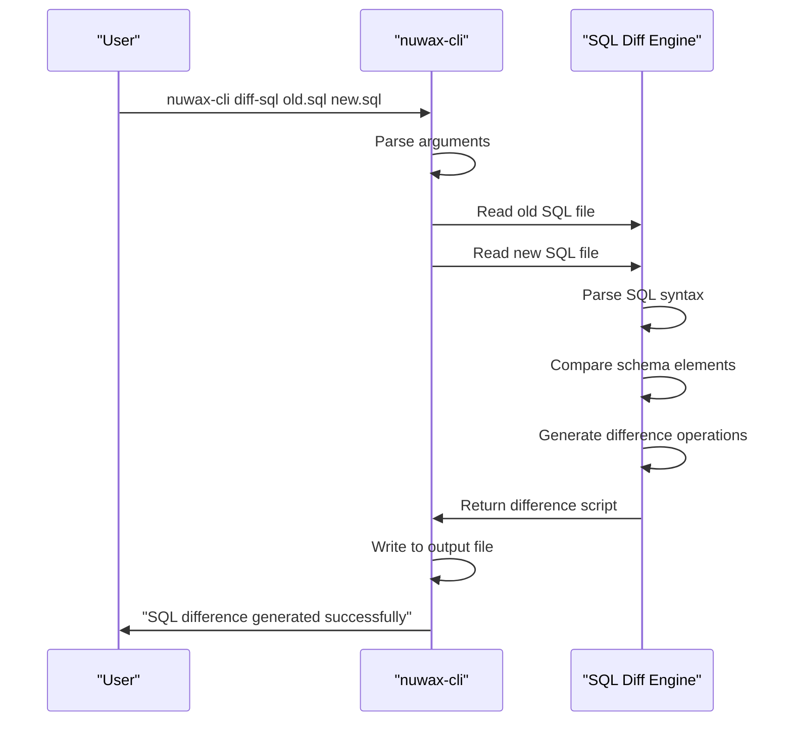
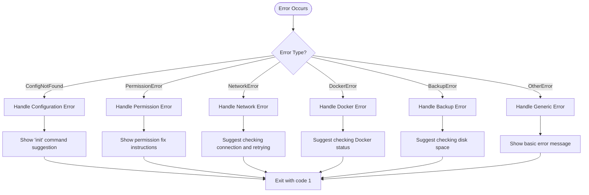

# CLI Interface Reference

<cite>
**Referenced Files in This Document**   
- [main.rs](file://nuwax-cli/src/main.rs)
- [cli.rs](file://nuwax-cli/src/cli.rs)
- [commands/mod.rs](file://nuwax-cli/src/commands/mod.rs)
- [commands/status.rs](file://nuwax-cli/src/commands/status.rs)
- [commands/backup.rs](file://nuwax-cli/src/commands/backup.rs)
- [commands/update.rs](file://nuwax-cli/src/commands/update.rs)
- [commands/docker_service.rs](file://nuwax-cli/src/commands/docker_service.rs)
- [commands/ducker.rs](file://nuwax-cli/src/commands/ducker.rs)
- [commands/auto_backup.rs](file://nuwax-cli/src/commands/auto_backup.rs)
- [commands/auto_upgrade_deploy.rs](file://nuwax-cli/src/commands/auto_upgrade_deploy.rs)
- [commands/diff_sql.rs](file://nuwax-cli/src/commands/diff_sql.rs)
</cite>

## Table of Contents
1. [Introduction](#introduction)
2. [Command Structure and Initialization](#command-structure-and-initialization)
3. [Core Commands](#core-commands)
4. [Status Command](#status-command)
5. [Backup and Rollback Commands](#backup-and-rollback-commands)
6. [Update and Upgrade Commands](#update-and-upgrade-commands)
7. [Docker Service Management](#docker-service-management)
8. [Ducker Integration](#ducker-integration)
9. [Auto Backup System](#auto-backup-system)
10. [Auto Upgrade Deploy System](#auto-upgrade-deploy-system)
11. [SQL Diff Utility](#sql-diff-utility)
12. [Configuration and Error Handling](#configuration-and-error-handling)

## Introduction
The nuwax-cli is a comprehensive command-line interface tool designed for managing Docker-based services, performing system upgrades, and maintaining data integrity through backup and recovery operations. Built with Rust and leveraging the Clap library for argument parsing, this CLI provides a robust set of commands for system administrators and developers to manage application deployments, service states, and data persistence. The interface is structured around a modular command system that separates concerns into distinct functional areas including status monitoring, backup management, Docker service control, and automated upgrade workflows. The tool integrates tightly with the underlying client-core functionality to provide a seamless experience for managing complex deployment scenarios, from initial setup to incremental upgrades and disaster recovery.

## Command Structure and Initialization

```mermaid
flowchart TD
Start([CLI Execution]) --> ParseArgs["Parse Command Line Arguments"]
ParseArgs --> CheckCommand{"Command Type?"}
CheckCommand --> |Init| HandleInit["Handle Init Command"]
CheckCommand --> |Status| HandleStatus["Handle Status Command"]
CheckCommand --> |DiffSql| HandleDiffSql["Handle Diff-SQL Command"]
CheckCommand --> |Other| LoadConfig["Load Configuration"]
HandleInit --> ExitSuccess
HandleStatus --> ShowVersion
ShowVersion --> TryLoadApp["Try Load App Configuration"]
TryLoadApp --> |Success| ShowStatusDetails
TryLoadApp --> |Fail| ShowErrorTips
ShowStatusDetails --> ExitSuccess
ShowErrorTips --> ExitSuccess
HandleDiffSql --> RunDiffSql
RunDiffSql --> ExitSuccessOrError
LoadConfig --> |Success| RunCommand["Run Command via App"]
LoadConfig --> |Fail| ShowInitRequired
RunCommand --> ExitSuccessOrError
ShowInitRequired --> ExitError
ExitSuccess --> [Exit 0]
ExitSuccessOrError --> [Exit 0 or 1]
ExitError --> [Exit 1]
```

**Diagram sources**
- [main.rs](file://nuwax-cli/src/main.rs#L15-L102)

**Section sources**
- [main.rs](file://nuwax-cli/src/main.rs#L15-L102)
- [cli.rs](file://nuwax-cli/src/cli.rs#L100-L220)

## Core Commands

The nuwax-cli implements a hierarchical command structure using Clap's subcommand system. The main entry point defines the top-level commands and their associated options, while individual command implementations are organized in separate modules. This design allows for clear separation of concerns and makes the codebase maintainable as new features are added. The command parsing system handles special cases like the `init`, `status`, and `diff-sql` commands that have unique initialization requirements separate from the main application configuration.

```mermaid
classDiagram
class Cli {
+config : PathBuf
+verbose : bool
+command : Commands
}
class Commands {
+Status
+Init{force : bool}
+CheckUpdate(CheckUpdateCommand)
+ApiInfo
+Upgrade{args : UpgradeArgs}
+Backup
+ListBackups
+Rollback{backup_id : Option<i64>, force : bool, list_json : bool, rollback_data : bool}
+RollbackDataOnly{backup_id : Option<i64>, force : bool}
+DockerService(DockerServiceCommand)
+Ducker{args : Vec<String>}
+AutoBackup(AutoBackupCommand)
+AutoUpgradeDeploy(AutoUpgradeDeployCommand)
+Cache(CacheCommand)
+DiffSql{old_sql : PathBuf, new_sql : PathBuf, old_version : Option<String>, new_version : Option<String>, output : String}
}
class UpgradeArgs {
+force : bool
+check : bool
}
class AutoBackupCommand {
+Run
+Status
}
class AutoUpgradeDeployCommand {
+Run{port : Option<u16>}
+DelayTimeDeploy{time : u32, unit : String}
+Status
}
class CheckUpdateCommand {
+Check
+Install{version : Option<String>, force : bool}
}
class DockerServiceCommand {
+Start
+Stop
+Restart
+Status
+RestartContainer{container_name : String}
+LoadImages
+SetupTags
+ArchInfo
+ListImages
+CheckMountDirs
}
class CacheCommand {
+Clear
+Status
+CleanDownloads{keep : u32}
}
Cli --> Commands : "contains"
Commands --> UpgradeArgs : "contains"
Commands --> AutoBackupCommand : "contains"
Commands --> AutoUpgradeDeployCommand : "contains"
Commands --> CheckUpdateCommand : "contains"
Commands --> DockerServiceCommand : "contains"
Commands --> CacheCommand : "contains"
```

**Diagram sources**
- [cli.rs](file://nuwax-cli/src/cli.rs#L50-L220)

**Section sources**
- [cli.rs](file://nuwax-cli/src/cli.rs#L50-L220)
- [commands/mod.rs](file://nuwax-cli/src/commands/mod.rs#L1-L40)

## Status Command

The status command provides comprehensive system information about the current state of the application and its services. It displays client version information, Docker service versions, configuration file status, and service health. The command has special handling in the main execution flow to ensure it can provide basic information even when the full application configuration cannot be loaded. This makes it a reliable tool for diagnosing configuration issues and understanding the current deployment state.



**Diagram sources**
- [main.rs](file://nuwax-cli/src/main.rs#L30-L78)
- [commands/status.rs](file://nuwax-cli/src/commands/status.rs#L10-L138)

**Section sources**
- [main.rs](file://nuwax-cli/src/main.rs#L30-L78)
- [commands/status.rs](file://nuwax-cli/src/commands/status.rs#L10-L138)

## Backup and Rollback Commands

The backup system provides comprehensive data protection through manual and automated backup operations. The system creates compressed archives of critical directories (data and app) and maintains a database record of all backup operations. The rollback functionality allows restoration from any available backup with options to restore all data or only the data directory. The system includes interactive selection for backup restoration and JSON output for GUI integration.

```mermaid
flowchart TD
BackupStart([Backup Command]) --> CheckCompose["Validate docker-compose.yml"]
CheckCompose --> CheckStatus["Check Docker Service Status"]
CheckStatus --> |Services Running| ShowWarning["Show Warning: Stop Services First"]
CheckStatus --> |Services Stopped| CreateBackup["Create Backup Archive"]
CreateBackup --> RecordBackup["Record Backup in Database"]
RecordBackup --> ShowSuccess["Show Success Message"]
RollbackStart([Rollback Command]) --> CheckJson["Check --list-json flag"]
CheckJson --> |True| OutputJson["Output JSON List"]
CheckJson --> |False| CheckId["Check backup_id provided"]
CheckId --> |False| InteractiveSelect["Interactive Backup Selection"]
CheckId --> |True| UseProvidedId["Use Provided backup_id"]
InteractiveSelect --> ConfirmSelection["User Confirms Selection"]
UseProvidedId --> ConfirmAction["Confirm Rollback Action"]
ConfirmSelection --> RestoreData["Restore Data from Backup"]
ConfirmAction --> RestoreData
RestoreData --> SetPermissions["Set MySQL Directory Permissions"]
SetPermissions --> ShowCompletion["Show Completion Message"]
OutputJson --> [JSON Output]
ShowSuccess --> [Exit]
ShowCompletion --> [Exit]
```

**Diagram sources**
- [commands/backup.rs](file://nuwax-cli/src/commands/backup.rs#L200-L800)

**Section sources**
- [commands/backup.rs](file://nuwax-cli/src/commands/backup.rs#L200-L800)

## Update and Upgrade Commands

The update system handles downloading and preparing Docker service packages for deployment. It supports both full and incremental (patch) upgrades, with intelligent download strategies that check existing files before downloading. The system can perform version checks without downloading and provides detailed information about available upgrades. The upgrade process separates the download phase from the deployment phase, allowing administrators to download packages during off-peak hours and deploy them at convenient times.



**Diagram sources**
- [commands/update.rs](file://nuwax-cli/src/commands/update.rs#L100-L160)
- [commands/docker_service.rs](file://nuwax-cli/src/commands/docker_service.rs#L336-L435)

**Section sources**
- [commands/update.rs](file://nuwax-cli/src/commands/update.rs#L100-L160)
- [commands/docker_service.rs](file://nuwax-cli/src/commands/docker_service.rs#L336-L435)

## Docker Service Management

The Docker service management commands provide comprehensive control over Docker containers and services. These commands allow users to start, stop, restart, and check the status of services, as well as perform advanced operations like loading images, setting tags, and checking mount directories. The system uses a DockerService manager to encapsulate Docker operations and provides detailed status reports with container health information, port mappings, and access URLs.

```mermaid
classDiagram
class DockerServiceCommand {
+Start
+Stop
+Restart
+Status
+RestartContainer{container_name : String}
+LoadImages
+SetupTags
+ArchInfo
+ListImages
+CheckMountDirs
}
class DockerService {
-app_config : AppConfig
-docker_manager : DockerManager
+deploy_services() Result
+start_services() Result
+stop_services() Result
+restart_services() Result
+health_check() Result~HealthReport~
+load_images() Result~ImageLoadResult~
+setup_image_tags_with_mappings() Result~ImageTagResult~
+list_docker_images_with_ducker() Result~Vec<String>~
+ensure_compose_mount_directories() Result
+restart_container() Result
}
class HealthReport {
+check_time : DateTime
+containers : Vec~ContainerInfo~
+errors : Vec~String~
+finalize() Status
+get_running_count() usize
+get_total_count() usize
+is_all_healthy() bool
}
class ContainerInfo {
+name : String
+image : String
+status : ContainerStatus
+ports : Vec~String~
+is_persistent_service() bool
+is_oneshot() bool
}
class ContainerStatus {
+Running
+Stopped
+Starting
+Completed
+Unknown
}
class ImageLoadResult {
+success_count() usize
+failure_count() usize
+loaded_images : Vec~String~
+failed_images : Vec~(String, String)~
+image_mappings : HashMap~String, String~
}
class ImageTagResult {
+success_count() usize
+failure_count() usize
+tagged_images : Vec~(String, String)~
+failed_tags : Vec~(String, String, String)~
}
DockerServiceCommand --> DockerService : "executed by"
DockerService --> HealthReport : "returns"
DockerService --> ContainerInfo : "contains"
DockerService --> ImageLoadResult : "returns"
DockerService --> ImageTagResult : "returns"
HealthReport --> ContainerInfo : "contains"
ContainerInfo --> ContainerStatus : "has"
```

**Diagram sources**
- [commands/docker_service.rs](file://nuwax-cli/src/commands/docker_service.rs#L1-L535)

**Section sources**
- [commands/docker_service.rs](file://nuwax-cli/src/commands/docker_service.rs#L1-L535)

## Ducker Integration

The ducker command integrates a full-featured Docker TUI (Text User Interface) directly into the nuwax-cli tool. This integration allows users to manage Docker containers, images, networks, and volumes through an interactive terminal interface without requiring a separate ducker installation. The implementation parses ducker-specific arguments and launches the TUI with appropriate configuration, while sharing the same logging system as the parent CLI application.



**Diagram sources**
- [commands/ducker.rs](file://nuwax-cli/src/commands/ducker.rs#L1-L200)

**Section sources**
- [commands/ducker.rs](file://nuwax-cli/src/commands/ducker.rs#L1-L200)

## Auto Backup System

The auto backup system provides automated backup capabilities that can be triggered manually or potentially integrated with external scheduling systems. The backup process follows a safe sequence: checking service status, stopping services if running, performing the backup, and then restarting services. This ensures data consistency by preventing writes during the backup operation. The system maintains configuration in the application database and provides status reporting on backup history and execution times.

```mermaid
flowchart TD
AutoBackupStart([Auto-Backup Command]) --> CheckCommand{"Command Type?"}
CheckCommand --> |Run| ExecuteBackup["Execute Backup Process"]
CheckCommand --> |Status| ShowStatus["Show Backup Status"]
ExecuteBackup --> CheckService["Check Docker Service Status"]
CheckService --> |Running| StopService["Stop Docker Services"]
CheckService --> |Not Running| ProceedBackup["Proceed with Backup"]
StopService --> WaitStopped["Wait for Services to Stop"]
WaitStopped --> CreateBackup["Create Backup"]
ProceedBackup --> CreateBackup
CreateBackup --> RecordTime["Record Backup Time and Status"]
RecordTime --> |Was Running| RestartService["Restart Docker Services"]
RecordTime --> |Was Not Running| Complete["Complete"]
RestartService --> WaitStarted["Wait for Services to Start"]
WaitStarted --> Complete
Complete --> [Exit]
ShowStatus --> ListBackups["List All Backups"]
ListBackups --> ShowOperations["Show Available Operations"]
ShowOperations --> [Exit]
```

**Diagram sources**
- [commands/auto_backup.rs](file://nuwax-cli/src/commands/auto_backup.rs#L1-L430)

**Section sources**
- [commands/auto_backup.rs](file://nuwax-cli/src/commands/auto_backup.rs#L1-L430)

## Auto Upgrade Deploy System

The auto upgrade deploy system orchestrates the complete upgrade process from version detection to service deployment. It handles both initial deployments and upgrades, with appropriate safeguards like data backups before upgrades. The system intelligently determines the deployment type, performs necessary preparations, downloads the appropriate service package, and deploys it with optional custom configuration like frontend port settings. The process includes comprehensive status reporting and error handling throughout each step.

```mermaid
flowchart TD
DeployStart([Auto-Upgrade-Deploy Command]) --> CheckCommand{"Command Type?"}
CheckCommand --> |Run| ExecuteDeploy["Execute Deploy Process"]
CheckCommand --> |Status| ShowDeployStatus["Show Deploy Status"]
ExecuteDeploy --> GetVersion["Get Latest Version Info"]
GetVersion --> DownloadPackage["Download Service Package"]
DownloadPackage --> CheckDeployment{"First Deployment?"}
CheckDeployment --> |Yes| CheckBackups["Check for Historical Backups"]
CheckDeployment --> |No| StopServices["Stop Running Services"]
CheckBackups --> |Has Backups| PlanRestore["Plan Data Restoration"]
CheckBackups --> |No Backups| PlanNew["Plan New Initialization"]
PlanRestore --> ExtractPackage["Extract Service Package"]
PlanNew --> ExtractPackage
StopServices --> BackupData["Create Data Backup"]
BackupData --> BackupSQL["Backup Current SQL Files"]
BackupSQL --> ExtractPackage
ExtractPackage --> |Is Upgrade| BackupDataDir["Backup Data Directory"]
ExtractPackage --> CleanupFiles["Cleanup Existing Files"]
CleanupFiles --> DeployServices["Deploy Services"]
DeployServices --> |Has Backup| RestoreData["Restore Data from Backup"]
DeployServices --> ShowSuccess["Show Success Message"]
RestoreData --> ShowSuccess
ShowSuccess --> [Exit]
ShowDeployStatus --> [Show Status Info]
[Show Status Info] --> [Exit]
```

**Diagram sources**
- [commands/auto_upgrade_deploy.rs](file://nuwax-cli/src/commands/auto_upgrade_deploy.rs#L1-L200)

**Section sources**
- [commands/auto_upgrade_deploy.rs](file://nuwax-cli/src/commands/auto_upgrade_deploy.rs#L1-L200)

## SQL Diff Utility

The SQL diff utility provides a standalone tool for comparing two SQL schema files and generating a difference script. This command is special in that it doesn't require the application to be initialized or configured, making it useful for external integration and automation. The tool can compare schema versions, generate upgrade scripts, and output the results to a specified file. It supports optional version metadata to include in the generated difference comments.



**Diagram sources**
- [main.rs](file://nuwax-cli/src/main.rs#L78-L97)
- [commands/diff_sql.rs](file://nuwax-cli/src/commands/diff_sql.rs)

**Section sources**
- [main.rs](file://nuwax-cli/src/main.rs#L78-L97)
- [commands/diff_sql.rs](file://nuwax-cli/src/commands/diff_sql.rs)

## Configuration and Error Handling

The nuwax-cli implements a robust configuration and error handling system that provides clear feedback to users while maintaining system stability. The application uses a tiered approach to command execution, with special handling for initialization, status, and file operations that can proceed without full configuration. Error messages are contextual and include actionable suggestions for resolution. The system distinguishes between configuration errors, permission issues, network problems, and operational failures, providing appropriate exit codes and diagnostic information for each scenario.



**Section sources**
- [main.rs](file://nuwax-cli/src/main.rs#L15-L102)
- [commands/status.rs](file://nuwax-cli/src/commands/status.rs#L30-L70)