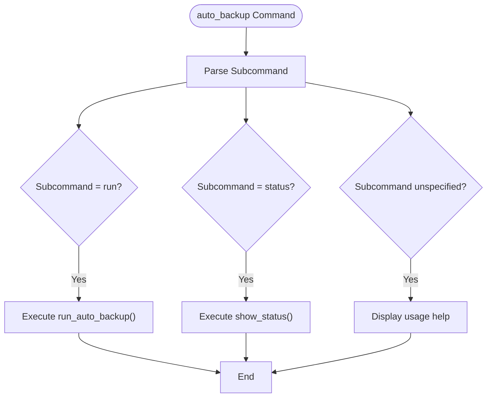
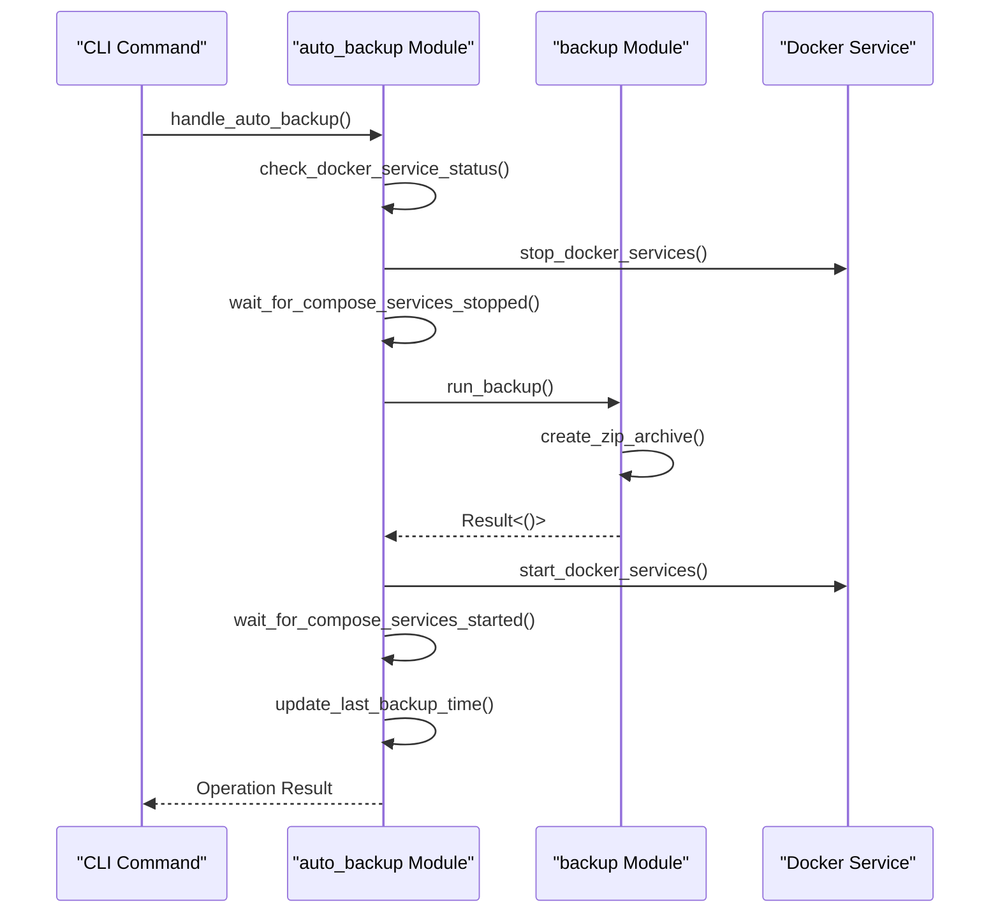
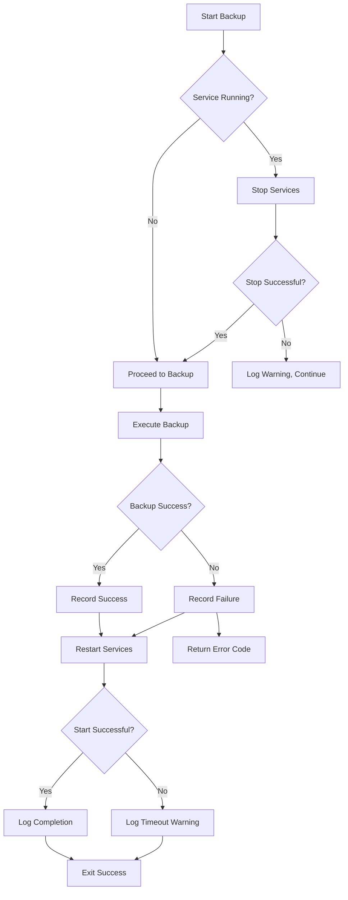
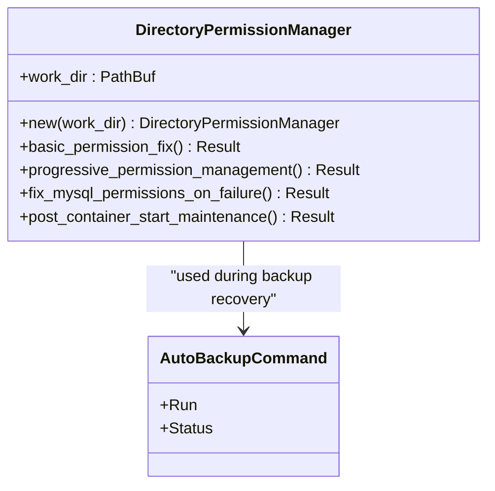

# auto_backup

<cite>
**Referenced Files in This Document**   
- [auto_backup.rs](file://nuwax-cli/src/commands/auto_backup.rs)
- [constants.rs](file://client-core/src/constants.rs)
- [directory_permissions.rs](file://nuwax-cli/src/docker_service/directory_permissions.rs)
</cite>

## Table of Contents
1. [Introduction](#introduction)
2. [Command Syntax and Configuration](#command-syntax-and-configuration)
3. [Backup Workflow Integration](#backup-workflow-integration)
4. [Scheduling Automatic Backups](#scheduling-automatic-backups)
5. [Error Handling and Failure Recovery](#error-handling-and-failure-recovery)
6. [Integration with Upgrade Pipeline](#integration-with-upgrade-pipeline)
7. [Common Issues and Troubleshooting](#common-issues-and-troubleshooting)

## Introduction

The `auto_backup` command is a critical component of the Duck Client system designed to ensure data integrity by automatically triggering backup operations before high-risk actions such as system upgrades. It provides a reliable mechanism for safeguarding application data, particularly in production environments where downtime or data loss can have significant consequences.

This command orchestrates a complete backup workflow that includes stopping Docker services, performing the backup, and restarting services—all while maintaining compatibility across platforms and handling edge cases like service failures and permission issues. The implementation is tightly integrated with the client-core's backup module and follows a structured execution flow to minimize risk during maintenance operations.

**Section sources**
- [auto_backup.rs](file://nuwax-cli/src/commands/auto_backup.rs#L1-L431)

## Command Syntax and Configuration

The `auto_backup` command supports multiple subcommands for managing automatic backup behavior:

```bash
nuwax-cli auto-backup run           # Execute backup immediately
nuwax-cli auto-backup status       # Show backup status and history
```

### Configuration Options

The behavior of the auto backup system is controlled through configurable parameters stored in the application database:

**AutoBackupConfig Structure**
- `enabled`: **bool** - Whether automatic backups are enabled
- `cron_expression`: **String** - Cron expression for scheduling (default: `"0 2 * * *"`)
- `last_backup_time`: **Option<DateTime<UTC>>** - Timestamp of last successful backup
- `backup_retention_days`: **i32** - Number of days to retain backup files (default: 7)
- `backup_directory`: **String** - Path to store backup archives (default: `"./backups"`)

Default values are defined in the constants module and can be overridden via configuration.



**Diagram sources**
- [auto_backup.rs](file://nuwax-cli/src/commands/auto_backup.rs#L25-L431)

**Section sources**
- [auto_backup.rs](file://nuwax-cli/src/commands/auto_backup.rs#L1-L431)

## Backup Workflow Integration

The `auto_backup` command integrates directly with the core backup module through shared business logic, ensuring consistent behavior across manual and automated backup operations.

### Execution Flow

The backup process follows a strict sequence to ensure data consistency:

1. **Service Status Check**: Determine if Docker services are currently running
2. **Service Stop**: Gracefully stop all Docker containers if they are active
3. **Backup Execution**: Invoke the core backup routine to create archive
4. **Service Restart**: Bring services back online after backup completion
5. **Status Update**: Record outcome and timestamp in configuration database



**Diagram sources**
- [auto_backup.rs](file://nuwax-cli/src/commands/auto_backup.rs#L50-L150)
- [auto_backup.rs](file://nuwax-cli/src/commands/auto_backup.rs#L200-L300)

**Section sources**
- [auto_backup.rs](file://nuwax-cli/src/commands/auto_backup.rs#L50-L350)

## Scheduling Automatic Backups

While the `auto_backup` command provides the execution logic, scheduling must be handled externally using system-level cron (Linux/macOS) or Task Scheduler (Windows), as the built-in cron functionality is not yet implemented.

### Production Scheduling Example

To schedule daily backups at 2:00 AM:

**Linux/macOS (crontab entry):**
```bash
0 2 * * * /path/to/nuwax-cli auto-backup run >> /var/log/nuwax-backup.log 2>&1
```

**Windows (PowerShell):**
```powershell
$action = New-ScheduledTaskAction -Execute "nuwax-cli" -Argument "auto-backup run"
$trigger = New-ScheduledTaskTrigger -Daily -At 2:00AM
Register-ScheduledTask -TaskName "DuckClientBackup" -Action $action -Trigger $trigger
```

The default cron expression `0 2 * * *` reflects this daily early-morning schedule, minimizing impact on production workloads.

**Section sources**
- [auto_backup.rs](file://nuwax-cli/src/commands/auto_backup.rs#L15-L20)
- [constants.rs](file://client-core/src/constants.rs#L480-L483)

## Error Handling and Failure Recovery

The `auto_backup` command implements comprehensive error handling to maintain system stability even when backup operations fail.

### Error Handling Strategy

When a backup fails, the system:
1. Logs detailed error information
2. Attempts to restart Docker services regardless of backup outcome
3. Records failure status in the configuration database
4. Returns appropriate exit codes for monitoring systems

Common failure scenarios include:
- Insufficient disk space for backup archive
- Failed Docker volume snapshots
- Permission denied errors on host volumes
- Network issues during distributed operations

The command ensures services are always restarted after backup attempts, preventing extended downtime due to backup failures.



**Diagram sources**
- [auto_backup.rs](file://nuwax-cli/src/commands/auto_backup.rs#L50-L150)

**Section sources**
- [auto_backup.rs](file://nuwax-cli/src/commands/auto_backup.rs#L100-L150)

## Integration with Upgrade Pipeline

The `auto_backup` command plays a crucial role in the upgrade pipeline by ensuring data integrity before any system modifications occur.

### Pre-Upgrade Data Protection

Before executing an upgrade via `auto_upgrade_deploy`, the system should:
1. Trigger `auto_backup run` to create current state snapshot
2. Verify backup completion and success status
3. Proceed with upgrade only if backup was successful

This integration prevents irreversible data corruption during failed upgrades and enables safe rollback procedures.

The `run_auto_backup_with_upgrade_strategy` function specifically supports this use case by accepting an `UpgradeStrategy` parameter, allowing coordinated execution between backup and upgrade workflows.

**Section sources**
- [auto_backup.rs](file://nuwax-cli/src/commands/auto_backup.rs#L200-L350)

## Common Issues and Troubleshooting

### Permission Errors on Host Volumes

A common issue occurs when Docker containers cannot access mounted volumes due to incorrect file permissions, especially on Unix-like systems.

#### Symptoms
- MySQL container fails to start after backup
- "Permission denied" errors in container logs
- Configuration files being ignored (e.g., world-writable mysql.cnf)

#### Root Cause
Host directory permissions may not match the expected UID/GID of services running inside containers.

#### Solutions

**Automatic Repair:**
```bash
# Run built-in permission fix
nuwax-cli docker-service permission-fix
```

**Manual Permission Settings:**
```bash
# Set proper permissions on data directories
chmod -R 775 ./data/mysql ./logs/mysql ./config
chmod 644 ./config/mysql.cnf
```

**Windows-Specific Guidance:**
For Windows hosts, use Git Bash or WSL:
```bash
# In Git Bash
chmod +x ./scripts/*.sh
```

Or use PowerShell with WSL integration:
```powershell
bash -c "chmod +x '/path/to/script.sh'"
```

The system includes a `DirectoryPermissionManager` that handles cross-platform permission management, including special handling for MySQL configuration files to prevent them from being ignored due to overly permissive settings.



**Diagram sources**
- [directory_permissions.rs](file://nuwax-cli/src/docker_service/directory_permissions.rs#L10-L50)
- [auto_backup.rs](file://nuwax-cli/src/commands/auto_backup.rs#L1-L20)

**Section sources**
- [directory_permissions.rs](file://nuwax-cli/src/docker_service/directory_permissions.rs#L1-L831)
- [auto_backup.rs](file://nuwax-cli/src/commands/auto_backup.rs#L1-L431)