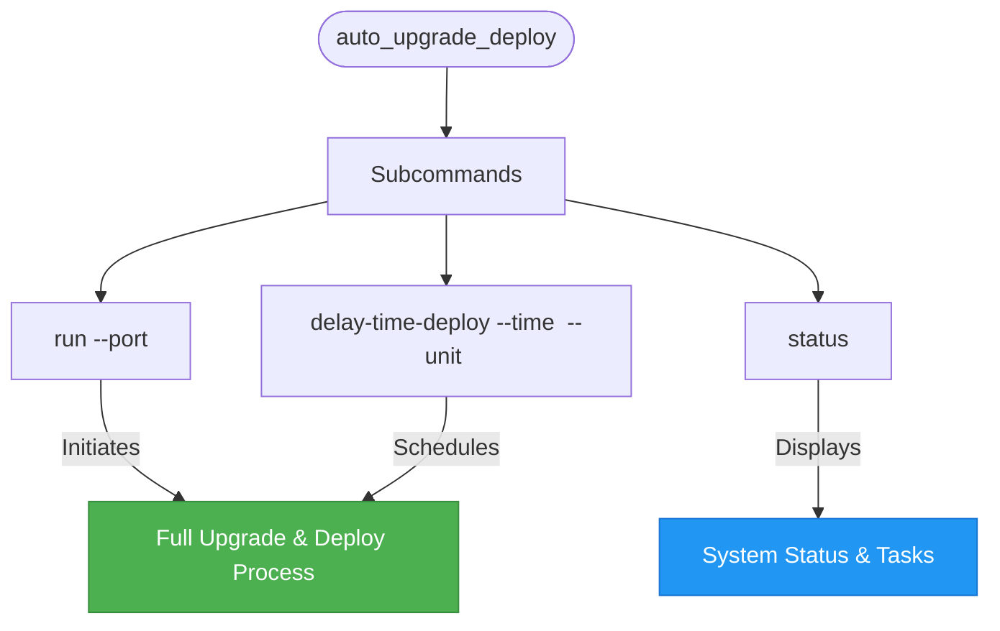
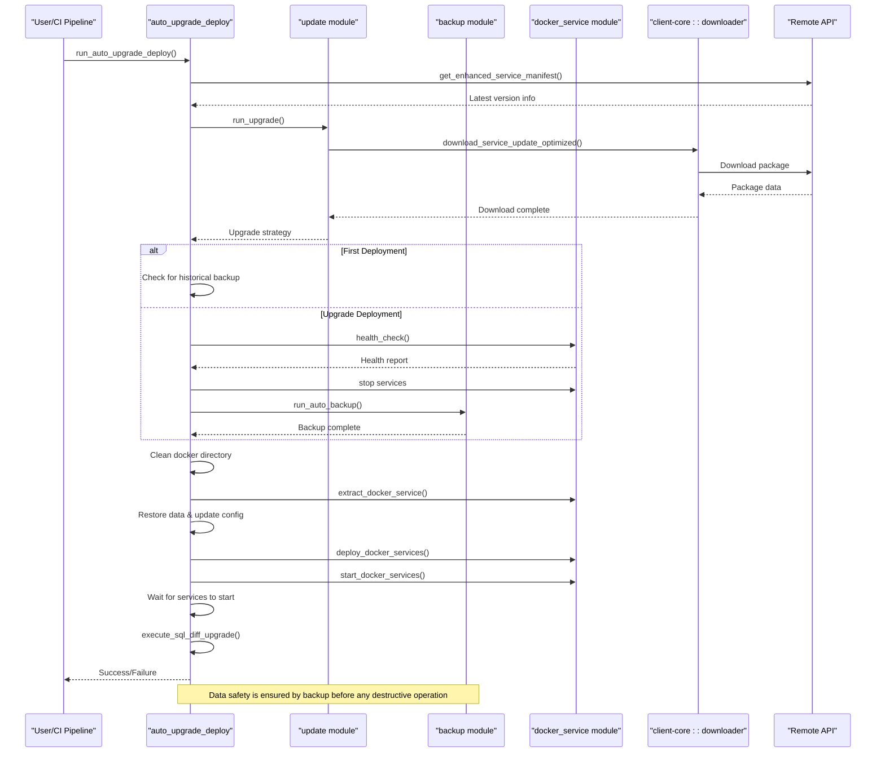
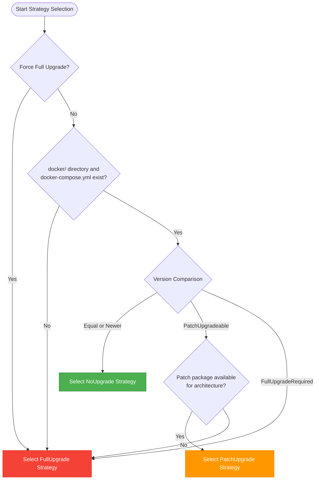
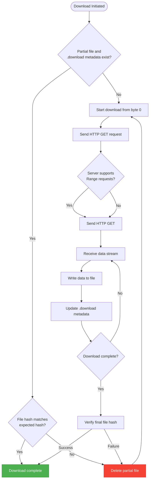

# auto_upgrade_deploy

<cite>
**Referenced Files in This Document**   
- [auto_upgrade_deploy.rs](file://nuwax-cli/src/commands/auto_upgrade_deploy.rs#L1-L1127)
- [upgrade.rs](file://client-core/src/upgrade.rs#L1-L89)
- [upgrade_strategy.rs](file://client-core/src/upgrade_strategy.rs#L1-L462)
- [downloader.rs](file://client-core/src/downloader.rs#L1-L1327)
- [update.rs](file://nuwax-cli/src/commands/update.rs#L1-L161)
- [docker_service.rs](file://nuwax-cli/src/commands/docker_service.rs#L1-L1000)
</cite>

## Table of Contents
1. [Introduction](#introduction)
2. [Command Structure and Supported Options](#command-structure-and-supported-options)
3. [Upgrade Lifecycle Automation](#upgrade-lifecycle-automation)
4. [Intelligent Upgrade Strategy Selection](#intelligent-upgrade-strategy-selection)
5. [Integration with docker_service and ducker Modules](#integration-with-docker_service-and-ducker-modules)
6. [Failure Handling and Resilience](#failure-handling-and-resilience)
7. [Performance and Downtime Minimization](#performance-and-downtime-minimization)
8. [Real-World CI/CD Pipeline Example](#real-world-cicd-pipeline-example)
9. [Conclusion](#conclusion)

## Introduction

The `auto_upgrade_deploy` command is a core automation utility within the Duck Client system, designed to streamline and secure the entire application upgrade lifecycle. It orchestrates a sequence of operations including version checking, intelligent strategy selection, downloading, backup creation, service deployment, and post-upgrade verification. This command serves as the primary interface for zero-downtime deployments and is critical for maintaining system stability and data integrity during updates. It integrates deeply with the `client-core` module's intelligent upgrade system and coordinates with Docker management components to ensure service availability.

**Section sources**
- [auto_upgrade_deploy.rs](file://nuwax-cli/src/commands/auto_upgrade_deploy.rs#L1-L1127)

## Command Structure and Supported Options

The `auto_upgrade_deploy` command provides a structured interface for initiating automated upgrades. Its primary subcommands are:

- **`run`**: Executes the full automated upgrade and deployment process immediately.
- **`delay-time-deploy`**: Schedules an upgrade to occur after a specified delay.
- **`status`**: Displays the current status of the auto-upgrade system, including pending tasks and service health.

The command supports several options to control upgrade behavior, although these are primarily managed through the underlying `UpgradeArgs` structure used by the `update` module:

- **`--force-full-upgrade`**: When passed to the `update` command, this forces a full upgrade even if a patch upgrade is available. This option is not directly exposed in `auto_upgrade_deploy` but can be used in the initial version check phase.
- **`--skip-backup`**: This option is not directly supported by `auto_upgrade_deploy`. The command always performs a backup before an upgrade deployment to ensure data safety, as skipping backups would violate its core design principle of data protection.

The command accepts a `--port` parameter for the `run` subcommand to specify a custom frontend port for the new deployment.



**Diagram sources**
- [auto_upgrade_deploy.rs](file://nuwax-cli/src/commands/auto_upgrade_deploy.rs#L1-L1127)

**Section sources**
- [auto_upgrade_deploy.rs](file://nuwax-cli/src/commands/auto_upgrade_deploy.rs#L1-L1127)

## Upgrade Lifecycle Automation

The `auto_upgrade_deploy` command automates a comprehensive upgrade lifecycle, ensuring a reliable and repeatable process. The sequence of operations is as follows:

1.  **Version Check and Download**: The command first checks for the latest version by querying the `enhanced_service_manifest` from the API client. It then downloads the latest Docker service package using the logic from the `update::run_upgrade` function. This download is performed without immediately extracting the package.

2.  **Deployment Type Detection**: The system determines if this is a first-time deployment or an upgrade. This is done by checking for the existence of the `docker-compose.yml` file. If the file is missing, it is considered a first deployment, even if a `docker` directory exists.

3.  **Service Stop and Backup (Upgrade Only)**: For upgrade deployments, the command checks the health of the current Docker services. If services are running, it stops them and waits for them to shut down completely. After the services are stopped, a data backup is created using the `auto_backup` module. This ensures a restore point before any changes are made.

4.  **Package Extraction and Cleanup**: The downloaded service package is extracted. Before extraction, the existing `docker` directory is cleaned up. For a full upgrade, the entire directory is removed. For a patch upgrade, only the files and directories specified in the patch manifest are removed.

5.  **Data Restoration and Configuration Update**: If a backup was created (upgrade) or a historical backup is found (first deployment), the data is restored. The configuration file (`config.toml`) is then updated to reflect the new Docker service version.

6.  **Service Deployment and Startup**: The command deploys the new Docker services, potentially on a custom port, and then starts them. It waits for the services to become fully operational.

7.  **Database Schema Upgrade**: After the services are running, an SQL schema difference is generated between the old and new `init_mysql.sql` files. If there are meaningful changes, this SQL script is executed against the MySQL container to upgrade the database schema.



**Diagram sources**
- [auto_upgrade_deploy.rs](file://nuwax-cli/src/commands/auto_upgrade_deploy.rs#L1-L1127)
- [update.rs](file://nuwax-cli/src/commands/update.rs#L1-L161)
- [docker_service.rs](file://nuwax-cli/src/commands/docker_service.rs#L1-L1000)

**Section sources**
- [auto_upgrade_deploy.rs](file://nuwax-cli/src/commands/auto_upgrade_deploy.rs#L1-L1127)

## Intelligent Upgrade Strategy Selection

The decision between a full upgrade and a patch upgrade is managed by the `UpgradeStrategyManager` in the `client-core` module, which is invoked by the `auto_upgrade_deploy` command during the initial version check.

The logic for strategy selection is as follows:

1.  **Force Full Upgrade**: If the `force` flag is set (e.g., via `--force` in the `update` command), a `FullUpgrade` strategy is selected immediately.
2.  **Missing Docker Directory**: If the `docker` directory or `docker-compose.yml` file is missing, a `FullUpgrade` is chosen to ensure a complete setup.
3.  **Version Comparison**: The current version is compared to the target server version. The comparison can result in:
    -   **`Equal` or `Newer`**: A `NoUpgrade` strategy is returned.
    -   **`PatchUpgradeable`**: The system checks if a patch package is available for the current system architecture (x86_64 or aarch64). If available, a `PatchUpgrade` strategy is selected; otherwise, it falls back to a `FullUpgrade`.
    -   **`FullUpgradeRequired`**: A `FullUpgrade` strategy is selected.

The `UpgradeStrategy` enum contains all the necessary information for the next steps, including the download URL, file hash, and target version. This allows the `auto_upgrade_deploy` command to proceed with the correct download and deployment logic.



**Diagram sources**
- [upgrade_strategy.rs](file://client-core/src/upgrade_strategy.rs#L1-L462)

**Section sources**
- [upgrade_strategy.rs](file://client-core/src/upgrade_strategy.rs#L1-L462)

## Integration with docker_service and ducker Modules

The `auto_upgrade_deploy` command relies heavily on the `docker_service` module for all Docker-related operations, ensuring service availability and proper orchestration.

Key integration points include:

-   **Service Control**: The command uses `docker_service::health_check()`, `start_docker_services()`, and `stop_docker_services()` to manage the lifecycle of Docker containers. This ensures that services are only stopped when necessary and are properly started after deployment.
-   **Deployment**: The `deploy_docker_services()` function is called to create and configure the new Docker services based on the extracted `docker-compose.yml` file.
-   **File Management**: The `extract_docker_service_with_upgrade_strategy()` function handles the extraction of the downloaded package, applying the correct logic based on whether it's a full or patch upgrade.
-   **Health Monitoring**: The `HealthChecker` class is used to verify the operational status of the services before and after the upgrade process.

The `ducker` module (likely a typo or internal name for Docker utilities) provides lower-level utilities, such as `wait_for_compose_services_started` and `wait_for_compose_services_stopped`, which are used to synchronize the upgrade process with the actual state of the Docker services, preventing race conditions.

This integration ensures that the upgrade process is atomic and that the system is only considered upgraded once all services are confirmed to be running and healthy.

**Section sources**
- [auto_upgrade_deploy.rs](file://nuwax-cli/src/commands/auto_upgrade_deploy.rs#L1-L1127)
- [docker_service.rs](file://nuwax-cli/src/commands/docker_service.rs#L1-L1000)

## Failure Handling and Resilience

The `auto_upgrade_deploy` command implements robust failure handling to maintain system stability:

-   **Data Protection**: Before any destructive operation (like cleaning the `docker` directory), the `data` directory is backed up to a temporary location. If the extraction or deployment fails, this backup is restored, ensuring no data loss.
-   **Rollback on Failure**: If the package extraction fails, the command attempts to roll back by restoring the data from the latest backup or the temporary backup. This allows the system to return to its pre-upgrade state.
-   **Resilient Directory Cleanup**: The `safe_remove_docker_directory` function implements a retry mechanism with a sleep interval to handle the "Directory not empty" error, which can occur due to file system delays. It will attempt up to three times before failing.
-   **Network Resilience**: The underlying `FileDownloader` in `client-core` supports **resumable downloads**. If a download is interrupted, the system checks for a partial file and a `.download` metadata file. If the server supports HTTP Range requests (which is assumed for object storage like OSS), the download will resume from the last byte. The metadata file stores the download URL, expected size, and the number of bytes already downloaded, enabling this resume capability. For downloads smaller than 1MB, the system will re-download the entire file instead of resuming.

These mechanisms ensure that transient failures (network issues, temporary file locks) do not result in a corrupted or unusable system state.



**Diagram sources**
- [downloader.rs](file://client-core/src/downloader.rs#L1-L1327)

**Section sources**
- [downloader.rs](file://client-core/src/downloader.rs#L1-L1327)
- [auto_upgrade_deploy.rs](file://nuwax-cli/src/commands/auto_upgrade_deploy.rs#L1-L1127)

## Performance and Downtime Minimization

The `auto_upgrade_deploy` command is designed to minimize downtime through several strategies:

-   **Intelligent Upgrades**: By default, the system prefers patch upgrades (`PatchUpgrade`) when possible. Patch upgrades only replace changed files, which are typically much smaller than a full Docker package, resulting in significantly faster downloads and extractions.
-   **Parallel Operations**: While the current implementation is largely sequential for safety, the use of async/await allows for non-blocking I/O operations. Future optimizations could parallelize tasks like downloading and stopping services.
-   **Efficient Backups**: The backup process is only triggered for upgrade deployments and focuses on critical data. The system does not perform a full backup of the entire application, which would be time-consuming.
-   **Optimized Downloads**: The `FileDownloader` uses an 8KB chunk size for streaming and only logs progress at configurable intervals (default 10 seconds or 100MB), reducing I/O overhead during the download.
-   **Pre-Download**: The service package is downloaded before stopping the current services. This means the downtime window is primarily limited to the time required to stop the old services, extract the new package, and start the new services, excluding the download time.

The total downtime is therefore the sum of the service stop time, cleanup time, extraction time, and service start time. By keeping the upgrade packages small and focused, this downtime is kept to a minimum.

**Section sources**
- [auto_upgrade_deploy.rs](file://nuwax-cli/src/commands/auto_upgrade_deploy.rs#L1-L1127)
- [downloader.rs](file://client-core/src/downloader.rs#L1-L1327)

## Real-World CI/CD Pipeline Example

The `auto_upgrade_deploy` command can be seamlessly integrated into a CI/CD pipeline for automated deployments. Here is an example using a GitHub Actions workflow:

```yaml
name: Deploy to Production

on:
  push:
    branches: [ main ]

jobs:
  deploy:
    runs-on: ubuntu-latest
    steps:
    - name: Checkout code
      uses: actions/checkout@v4

    - name: Set up Duck Client
      run: |
        # Install the nuwax-cli binary
        curl -L https://example.com/duck-client/latest -o nuwax-cli
        chmod +x nuwax-cli
        sudo mv nuwax-cli /usr/local/bin/

    - name: Run Auto Upgrade Deploy
      run: |
        # Execute the full automated upgrade process
        nuwax-cli auto-upgrade-deploy run --port 8080
      env:
        # Authentication details for the API
        NUWAX_API_TOKEN: ${{ secrets.NUWAX_API_TOKEN }}
        NUWAX_API_URL: ${{ secrets.NUWAX_API_URL }}

    - name: Verify Deployment
      run: |
        # Check the status and health of the deployed services
        nuwax-cli auto-upgrade-deploy status
        nuwax-cli docker-service status
```

In this example, every push to the `main` branch triggers a deployment. The pipeline checks out the code, installs the `nuwax-cli` tool, and executes `auto_upgrade_deploy run`. The command automatically checks for the latest version, downloads it, backs up the current data, deploys the new version, and starts the services. The final step verifies the deployment's success. This provides a fully automated, reliable, and safe deployment process.

**Section sources**
- [auto_upgrade_deploy.rs](file://nuwax-cli/src/commands/auto_upgrade_deploy.rs#L1-L1127)

## Conclusion

The `auto_upgrade_deploy` command is a sophisticated automation tool that encapsulates the entire application upgrade process. By integrating with the `client-core`'s intelligent upgrade system, it makes data-driven decisions between full and patch upgrades. Its deep integration with the `docker_service` module ensures safe and reliable service orchestration, while its robust failure handling and resumable download capabilities provide resilience against common operational issues. The command is designed for both interactive use and integration into automated CI/CD pipelines, making it a cornerstone of the Duck Client's deployment strategy. Its focus on data safety, minimal downtime, and operational simplicity makes it a powerful tool for maintaining a stable and up-to-date application environment.