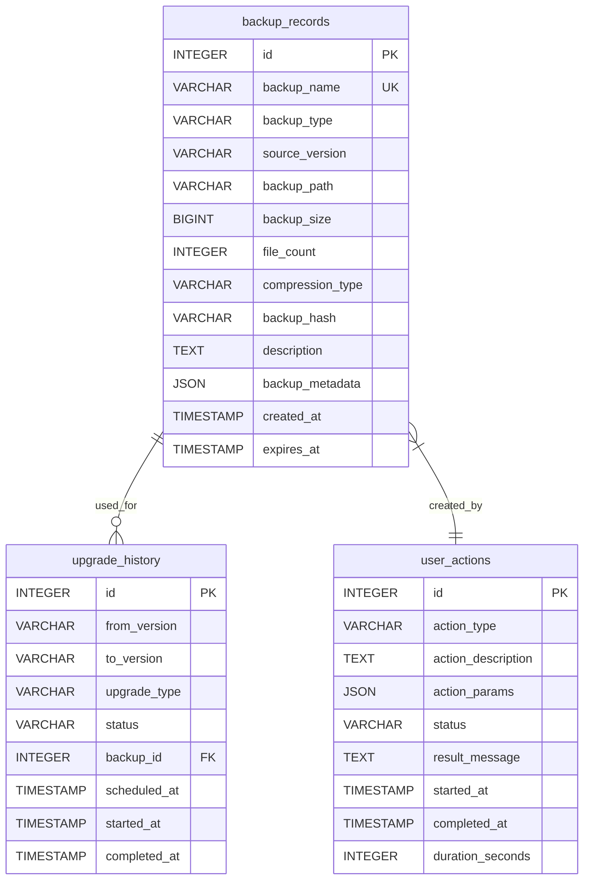
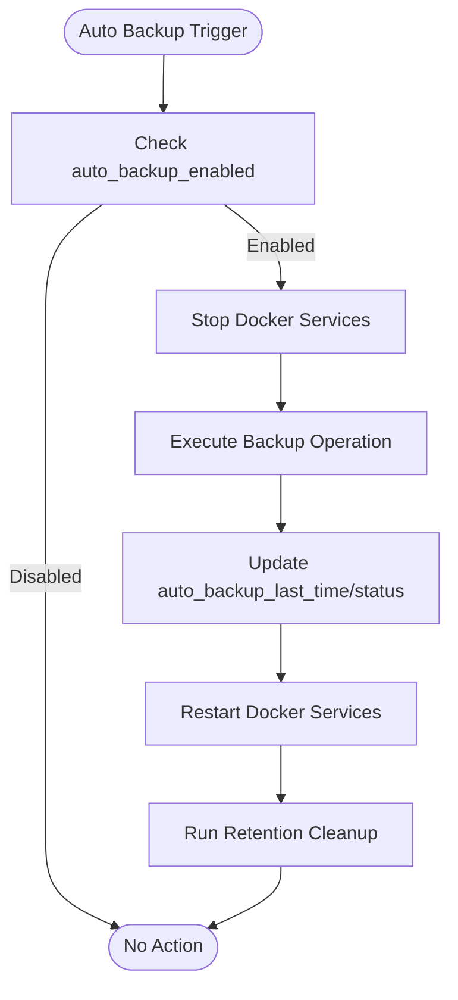
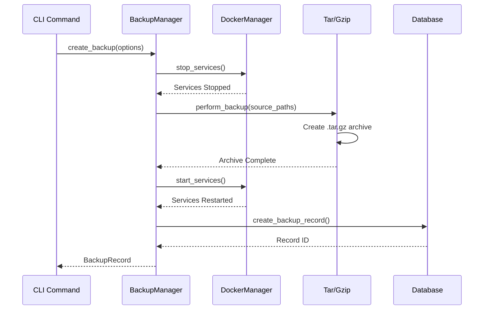
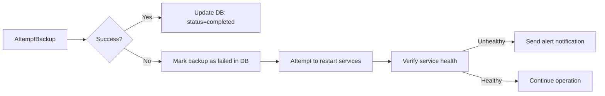

# backup

<cite>
**Referenced Files in This Document**   
- [backup.rs](file://client-core/src/backup.rs)
- [auto_backup.rs](file://nuwax-cli/src/commands/auto_backup.rs)
- [actor.rs](file://client-core/src/db/actor.rs)
- [init_duckdb.sql](file://client-core/migrations/init_duckdb.sql)
</cite>

## Table of Contents
1. [Introduction](#introduction)
2. [Core Components](#core-components)
3. [Backup Metadata Storage and Indexing](#backup-metadata-storage-and-indexing)
4. [Backup Scheduling and Storage Management](#backup-scheduling-and-storage-management)
5. [Docker Volume Interaction and Snapshot Consistency](#docker-volume-interaction-and-snapshot-consistency)
6. [Command-Line Interface and Usage Examples](#command-line-interface-and-usage-examples)
7. [Error Handling and Recovery Procedures](#error-handling-and-recovery-procedures)
8. [Security Considerations](#security-considerations)

## Introduction
The **backup** command provides a comprehensive solution for creating manual and automated backups of Docker service data and configurations. It ensures data integrity by leveraging consistent snapshots through coordinated service lifecycle management. The system integrates tightly with Docker volumes, database metadata tracking, and rollback mechanisms to support reliable backup and restore operations. This document details the architecture, implementation, and operational best practices for the backup functionality.

## Core Components

The backup system is composed of several key components that work together to provide robust data protection:

- **BackupManager**: Orchestrates backup creation, restoration, and deletion operations.
- **Database Actor (DuckDbActor)**: Manages persistent storage of backup metadata in DuckDB.
- **AutoBackup Command**: Handles scheduled backup execution and status reporting.
- **Backup Records Table**: Stores metadata about each backup including paths, types, versions, and timestamps.

These components interact through well-defined interfaces to ensure consistency and reliability during backup operations.

**Section sources**
- [backup.rs](file://client-core/src/backup.rs#L1-L624)
- [auto_backup.rs](file://nuwax-cli/src/commands/auto_backup.rs#L1-L431)
- [actor.rs](file://client-core/src/db/actor.rs#L1-L742)

## Backup Metadata Storage and Indexing

Backup metadata is stored in a DuckDB database using a dedicated `backup_records` table. This table captures essential information about each backup, enabling efficient querying, indexing, and integration with other systems such as rollback and audit logging.



**Diagram sources**
- [init_duckdb.sql](file://client-core/migrations/init_duckdb.sql#L1-L452)
- [actor.rs](file://client-core/src/db/actor.rs#L1-L742)

### Schema Details

The `backup_records` table includes the following fields:

- **id**: Unique identifier (auto-incremented)
- **backup_name**: Human-readable name with timestamp
- **backup_type**: Type of backup (`FULL`, `INCREMENTAL`, `DATA_ONLY`)
- **source_version**: Service version at time of backup
- **backup_path**: Full filesystem path to the backup archive
- **backup_size**: Size of the backup file in bytes
- **compression_type**: Compression algorithm used (`gzip` default)
- **created_at**: Timestamp when backup was created
- **expires_at**: Optional expiration timestamp for retention policies

Indexes are defined on `created_at` and `backup_type` to optimize queries for recent backups and type-based filtering.

**Section sources**
- [init_duckdb.sql](file://client-core/migrations/init_duckdb.sql#L1-L452)
- [actor.rs](file://client-core/src/db/actor.rs#L1-L742)

## Backup Scheduling and Storage Management

Automatic backups are managed through a cron-based scheduling system configured via application settings. The system supports retention policies, directory migration, and size estimation to ensure efficient storage utilization.

### Configuration Parameters

The following configuration keys control automatic backup behavior:

- **auto_backup_enabled**: Boolean flag to enable/disable auto-backups
- **auto_backup_schedule**: Cron expression for backup timing (default: `"0 2 * * *"`)
- **auto_backup_retention_days**: Number of days to retain backups
- **auto_backup_directory**: Target directory for backup files
- **auto_backup_last_time**: Timestamp of last successful run
- **auto_backup_last_status**: Status of last execution



**Diagram sources**
- [auto_backup.rs](file://nuwax-cli/src/commands/auto_backup.rs#L1-L431)

### Best Practices

1. **Schedule During Off-Peak Hours**: Use cron expressions like `0 2 * * *` to run backups at 2 AM.
2. **Monitor Disk Space**: Regularly check available space in the backup directory.
3. **Test Restore Procedures**: Periodically validate backup integrity by performing test restores.
4. **Enable Verification**: Set `backup.verify_after_backup = true` to validate archives post-creation.
5. **Use Separate Storage**: Store backups on different physical drives or network locations.

**Section sources**
- [auto_backup.rs](file://nuwax-cli/src/commands/auto_backup.rs#L1-L431)
- [init_duckdb.sql](file://client-core/migrations/init_duckdb.sql#L1-L452)

## Docker Volume Interaction and Snapshot Consistency

To ensure data consistency, the backup system follows a strict sequence: stop services → create snapshot → restart services. This guarantees that all Docker-managed volumes are in a stable state during archiving.

### Consistent Snapshot Workflow



**Diagram sources**
- [backup.rs](file://client-core/src/backup.rs#L1-L624)
- [auto_backup.rs](file://nuwax-cli/src/commands/auto_backup.rs#L1-L431)

### Key Implementation Details

- **Service Coordination**: Uses `DockerManager::stop_services()` and `start_services()` to control container lifecycle.
- **Path Handling**: Supports both individual files and entire directories via `source_paths`.
- **Cross-Platform Paths**: Normalizes path separators to Unix-style (`/`) even on Windows.
- **Background Processing**: Uses `tokio::task::spawn_blocking` to avoid blocking async runtime during I/O-heavy operations.

When backing up directories, the system preserves the top-level directory name in the archive (e.g., `data/`, `app/`) to maintain structural integrity upon restore.

**Section sources**
- [backup.rs](file://client-core/src/backup.rs#L1-L624)

## Command-Line Interface and Usage Examples

The backup system exposes both manual and automated commands through the CLI interface.

### Manual Backup Example

```bash
# Create a manual backup
nuwax-cli backup create --type manual --version v1.2.0

# List all backups
nuwax-cli backup list

# Delete a specific backup
nuwax-cli backup delete --id 123
```

### Automated Backup Configuration

```bash
# Enable automatic backups
nuwax-cli auto-backup enabled --enable true

# Show current status
nuwax-cli auto-backup status

# Run immediately (bypass schedule)
nuwax-cli auto-backup run
```

### Backup Options

The `BackupOptions` struct defines configurable parameters:

- **backup_type**: Either `Manual` or `PreUpgrade`
- **service_version**: Current service version string
- **work_dir**: Base working directory
- **source_paths**: Vector of `PathBuf` entries to include
- **compression_level**: Gzip level (0–9, default 6)

Example usage in code:
```rust
let options = BackupOptions {
    backup_type: BackupType::Manual,
    service_version: "v1.2.0".to_string(),
    work_dir: "/opt/duck".into(),
    source_paths: vec!["/opt/duck/data".into(), "/opt/duck/config".into()],
    compression_level: 6,
};
```

**Section sources**
- [backup.rs](file://client-core/src/backup.rs#L1-L624)
- [auto_backup.rs](file://nuwax-cli/src/commands/auto_backup.rs#L1-L431)

## Error Handling and Recovery Procedures

The system implements comprehensive error handling to manage failures gracefully and maintain data integrity.

### Common Error Conditions

| Error Condition | Detection Mechanism | Recovery Procedure |
|----------------|---------------------|--------------------|
| Locked Files | Filesystem access check during backup | Retry after service stop, or fail fast |
| Read-Only Filesystem | Write attempt to backup directory | Log error, abort backup |
| Incomplete Archive | Post-backup verification failure | Delete partial file, mark as failed |
| Missing Backup File | Restore requested but file not found | Return `anyhow::anyhow!("backup file does not exist")` |
| Database Write Failure | `set_config()` or `create_backup_record()` returns `Err` | Log warning, continue operation |

### Recovery Workflow



All errors are logged using `tracing::error!` and recorded in the `user_actions` table for audit purposes. Failed backups are retained in the database with `status = Failed` for diagnostic review.

**Section sources**
- [backup.rs](file://client-core/src/backup.rs#L1-L624)
- [actor.rs](file://client-core/src/db/actor.rs#L1-L742)

## Security Considerations

The backup system incorporates several security measures to protect sensitive data.

### Access Control

- Backup files are stored in application-controlled directories with standard filesystem permissions.
- Configuration values in `app_config` can be marked `is_user_editable = FALSE` to prevent modification.
- Audit logs in `user_actions` track who performed backups and when.

### Encryption and Integrity

While native encryption is not currently implemented, the system supports external mechanisms:

- **Filesystem Encryption**: Recommend using encrypted volumes (e.g., LUKS, BitLocker).
- **Hash Verification**: Backup archives can be verified using `backup_hash` field.
- **Secure Deletion**: Use secure erase tools for decommissioned backup media.

### Best Practices

1. **Restrict Directory Permissions**: Ensure backup directories are only accessible by the application user.
2. **Enable Audit Logging**: Monitor `user_actions` for unauthorized backup attempts.
3. **Use Secure Transport**: When transferring backups offsite, use encrypted channels (SCP, HTTPS).
4. **Regular Audits**: Periodically verify backup integrity and access logs.

Future enhancements could include native AES-256 encryption support and digital signature verification.

**Section sources**
- [init_duckdb.sql](file://client-core/migrations/init_duckdb.sql#L1-L452)
- [actor.rs](file://client-core/src/db/actor.rs#L1-L742)