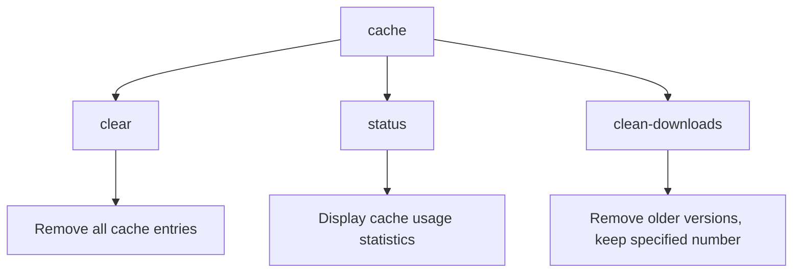
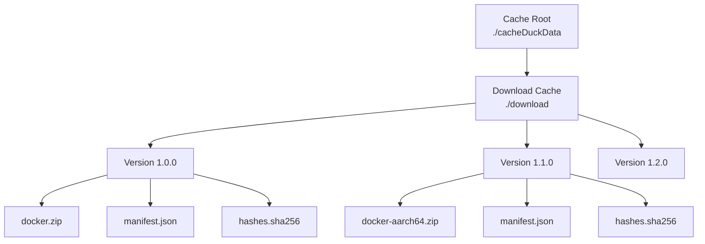
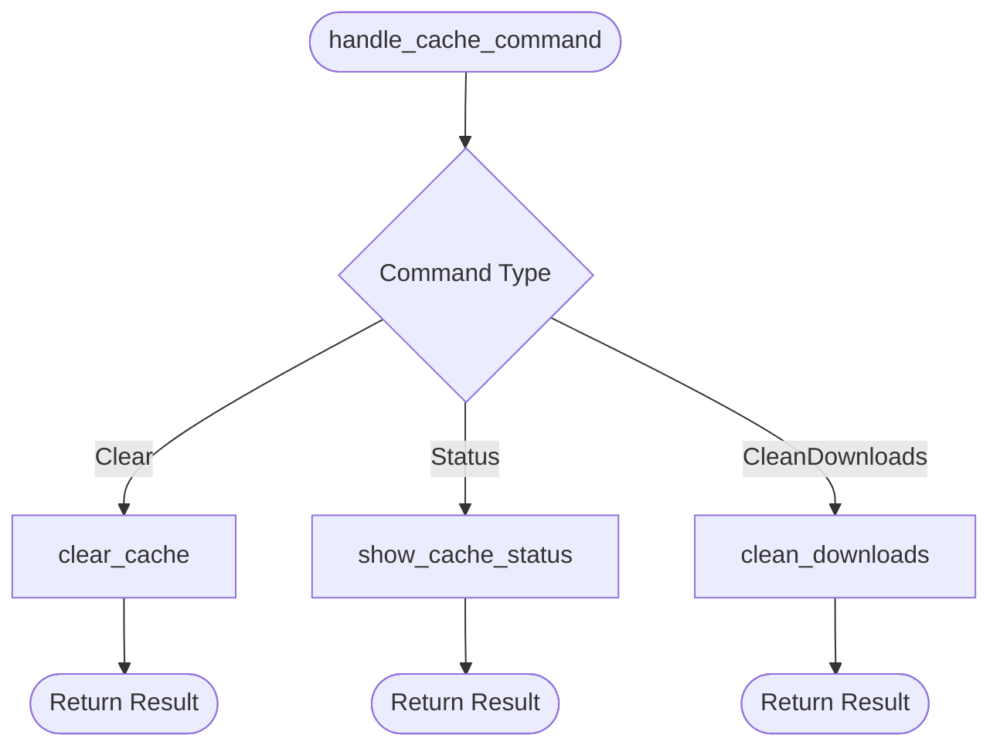
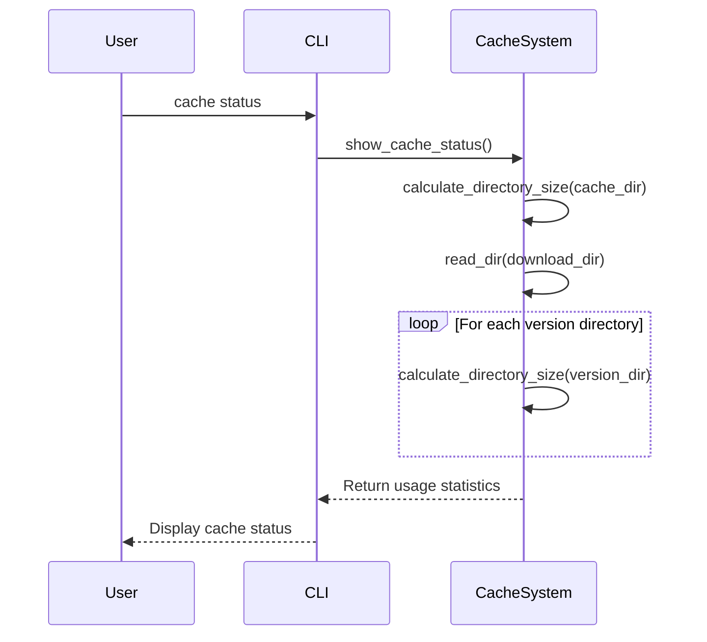

# cache

<cite>
**Referenced Files in This Document**   
- [cache.rs](file://nuwax-cli/src/commands/cache.rs)
- [constants.rs](file://client-core/src/constants.rs)
- [config.rs](file://client-core/src/config.rs)
</cite>

## Table of Contents
1. [Introduction](#introduction)
2. [Cache Command Overview](#cache-command-overview)
3. [Cache Directory Structure](#cache-directory-structure)
4. [Subcommands and Functionality](#subcommands-and-functionality)
5. [Cache Inspection](#cache-inspection)
6. [Cache Cleanup and Invalidation](#cache-cleanup-and-invalidation)
7. [Cache Validation and Integrity](#cache-validation-and-integrity)
8. [Performance and Optimization](#performance-and-optimization)
9. [Troubleshooting Common Issues](#troubleshooting-common-issues)
10. [Usage Examples](#usage-examples)

## Introduction

The `cache` command in the Duck Client system provides comprehensive management of local caches used for update packages, manifests, and Docker images. This functionality is critical for improving performance, reducing bandwidth usage, and enabling operations in air-gapped environments. The cache system is designed to store frequently accessed data locally, minimizing redundant downloads and accelerating deployment operations.

The cache implementation is part of the nuwax-cli component and integrates with the client-core's download system to ensure consistent handling of cached artifacts. The system supports cryptographic validation of cached content and provides tools for monitoring, cleaning, and optimizing cache usage.

**Section sources**
- [cache.rs](file://nuwax-cli/src/commands/cache.rs#L0-L236)
- [constants.rs](file://client-core/src/constants.rs#L174-L212)

## Cache Command Overview

The cache command provides a CLI interface for managing the local cache system. It allows users to inspect cache contents, clean up stale entries, and optimize storage usage. The command is implemented in the `nuwax-cli` package and interacts with configuration settings defined in the client-core library.

The cache system serves multiple purposes:
- **Performance optimization**: By storing frequently accessed update packages and Docker images locally
- **Bandwidth reduction**: Preventing redundant downloads of the same content
- **Air-gapped deployment**: Enabling pre-population of caches in environments without internet access
- **Version management**: Maintaining multiple versions of update packages for rollback capabilities

The command structure follows a subcommand pattern, with distinct operations for different cache management tasks.



**Diagram sources**
- [cache.rs](file://nuwax-cli/src/commands/cache.rs#L0-L34)

## Cache Directory Structure

The cache system organizes data in a hierarchical directory structure rooted in the `cacheDuckData` directory. This structure is defined in the configuration constants and follows a consistent pattern across platforms.

The primary cache directories are:
- **Cache root**: `./cacheDuckData` - The main cache directory
- **Download cache**: `./cacheDuckData/download` - Stores downloaded update packages and Docker images
- **Version-specific storage**: `./cacheDuckData/download/{version}` - Contains versioned update packages

Each version directory within the download cache typically contains:
- Full Docker service packages (e.g., `docker.zip`, `docker-aarch64.zip`)
- Update manifests and metadata files
- Cryptographic hashes for content validation

The directory structure is created and managed through configuration functions that ensure the necessary directories exist when the system initializes.



**Diagram sources**
- [constants.rs](file://client-core/src/constants.rs#L174-L212)
- [config.rs](file://client-core/src/config.rs#L336-L371)

## Subcommands and Functionality

The cache command supports three primary subcommands for managing cache contents:

### Clear Subcommand
Removes all files and directories within the cache root directory. This operation is recursive and affects all cached data.

### Status Subcommand
Displays detailed information about cache usage, including:
- Total cache size
- Breakdown of download cache by version
- Size of individual version directories

### CleanDownloads Subcommand
Cleans the download cache by removing older versions while preserving the specified number of most recent versions. This helps manage disk space while maintaining rollback capability.

The command implementation uses pattern matching to route to the appropriate handler function based on the subcommand provided.



**Diagram sources**
- [cache.rs](file://nuwax-cli/src/commands/cache.rs#L0-L34)

## Cache Inspection

The `status` subcommand provides detailed insights into cache usage and organization. When executed, it displays:

- The location of the cache root directory
- Total size of the cache in megabytes
- Detailed breakdown of the download cache by version
- Size of each version directory in the download cache

The inspection process works by:
1. Calculating the total size of the cache directory
2. Enumerating all version directories in the download cache
3. Calculating the size of each version directory
4. Presenting the information in a human-readable format

This functionality helps users understand their cache usage patterns and identify opportunities for optimization.



**Diagram sources**
- [cache.rs](file://nuwax-cli/src/commands/cache.rs#L69-L115)

## Cache Cleanup and Invalidation

The cache system provides two primary methods for cleanup and invalidation:

### Complete Cache Clearing
The `clear` subcommand removes all contents of the cache directory, including:
- All versioned download packages
- Temporary files
- Metadata and manifest files

This operation is useful when the cache becomes corrupted or when maximum disk space recovery is needed.

### Selective Download Cleaning
The `clean-downloads` subcommand implements a retention policy for versioned packages:
1. Identifies all version directories in the download cache
2. Sorts them by modification time (newest first)
3. Preserves the specified number of most recent versions
4. Removes all older versions

This approach balances disk space management with the need to maintain rollback capability.

The cleanup process includes error handling for:
- Failed directory size calculations
- Permission issues during file removal
- Partial cleanup scenarios

```mermaid
flowchart TD
A["clean_downloads"] --> B["Read download directory"]
B --> C["Collect version directories"]
C --> D["Sort by modification time"]
D --> E["Keep N newest versions"]
loop For each old version
E --> F["Calculate directory size"]
F --> G["Remove directory"]
G --> H["Update counters"]
end
H --> I["Report results"]
```

**Diagram sources**
- [cache.rs](file://nuwax-cli/src/commands/cache.rs#L117-L218)

## Cache Validation and Integrity

The cache system integrates with the download subsystem to ensure data integrity through cryptographic validation. While the cache command itself doesn't perform validation, it relies on the underlying system that:

- Stores cryptographic hashes of downloaded content
- Verifies file integrity upon download
- Uses signature verification for update packages

The download system, which populates the cache, implements hash-based validation using SHA-256 or similar algorithms. When files are downloaded, their hashes are compared against expected values to detect corruption or tampering.

For air-gapped deployments, the validation system ensures that pre-populated cache entries can be verified against known good hashes, maintaining security even without internet connectivity.

The cache directory structure supports metadata storage alongside downloaded files, allowing the system to maintain information about:
- Download timestamps
- Source URLs
- Cryptographic signatures
- Version information

**Section sources**
- [downloader.rs](file://client-core/src/downloader.rs#L527-L574)
- [cache.rs](file://nuwax-cli/src/commands/cache.rs#L213-L236)

## Performance and Optimization

The cache system is designed with performance considerations to minimize I/O overhead and maximize cache hit rates:

### I/O Optimization
- Uses efficient directory traversal with the `walkdir` crate
- Minimizes file system calls through batch operations
- Implements size calculation without loading file contents

### Cache Hit Rate Optimization
- Retains multiple versions to support rollback scenarios
- Organizes files by version for quick access
- Uses predictable directory structure for easy automation

### Recommendations
1. **Regular maintenance**: Periodically run `clean-downloads` to remove outdated versions
2. **Monitor growth**: Use `status` command to track cache size trends
3. **Disk space planning**: Allocate sufficient space for the cache directory based on update frequency
4. **Backup strategy**: Consider backing up critical versioned packages before cleanup operations

The system balances performance by avoiding overly aggressive cleanup while preventing unbounded growth.

**Section sources**
- [cache.rs](file://nuwax-cli/src/commands/cache.rs#L213-L236)
- [constants.rs](file://client-core/src/constants.rs#L174-L212)

## Troubleshooting Common Issues

### Corrupted Cache Entries
Symptoms:
- Failed update operations
- Docker image loading errors
- Verification failures

Solutions:
1. Use `cache status` to identify problematic versions
2. Remove specific version directories manually if needed
3. Run `cache clear` for complete reset
4. Re-download required packages

### Disk Space Exhaustion
Symptoms:
- System warnings about low disk space
- Failed download operations
- Slow performance

Solutions:
1. Run `cache status` to assess cache size
2. Use `cache clean-downloads --keep 2` to retain only recent versions
3. Consider relocating cache to a larger drive
4. Implement regular cleanup in maintenance scripts

### Permission Issues
Symptoms:
- Failed cache operations
- Access denied errors
- Incomplete cleanup

Solutions:
1. Ensure proper ownership of cache directory
2. Run cache commands with appropriate privileges
3. Check file system permissions on the cache location

**Section sources**
- [cache.rs](file://nuwax-cli/src/commands/cache.rs#L31-L67)
- [directory_permissions.rs](file://nuwax-cli/src/docker_service/directory_permissions.rs#L0-L43)

## Usage Examples

### Basic Cache Inspection
```bash
# Display current cache status and usage
nuwax-cli cache status
```

### Complete Cache Cleanup
```bash
# Remove all cached data
nuwax-cli cache clear
```

### Selective Download Cleaning
```bash
# Keep only the 2 most recent versions, remove older ones
nuwax-cli cache clean-downloads --keep 2
```

### Air-Gapped Environment Preparation
```bash
# On internet-connected machine
nuwax-cli update check
nuwax-cli update download --version 1.2.0

# Copy cache directory to air-gapped system
scp -r ./cacheDuckData user@airgapped-system:/path/to/duck_client/

# On air-gapped system, the cached packages are now available for deployment
```

### Automated Maintenance Script
```bash
#!/bin/bash
# Weekly cache maintenance
echo "Starting cache maintenance..."
nuwax-cli cache status
nuwax-cli cache clean-downloads --keep 3
echo "Cache maintenance completed."
```

**Section sources**
- [cache.rs](file://nuwax-cli/src/commands/cache.rs#L0-L236)
- [cli.ts](file://nuwax-cli/src/cli.rs#L0-L100)