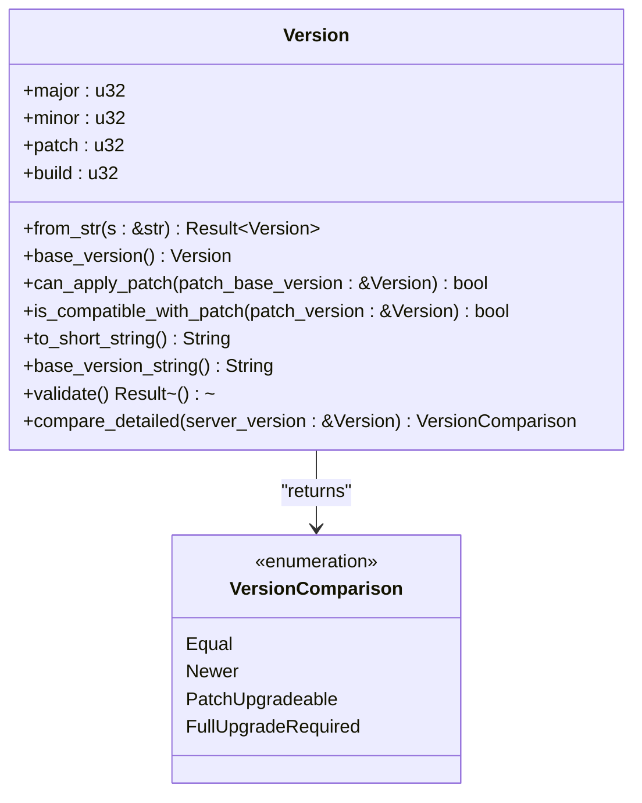
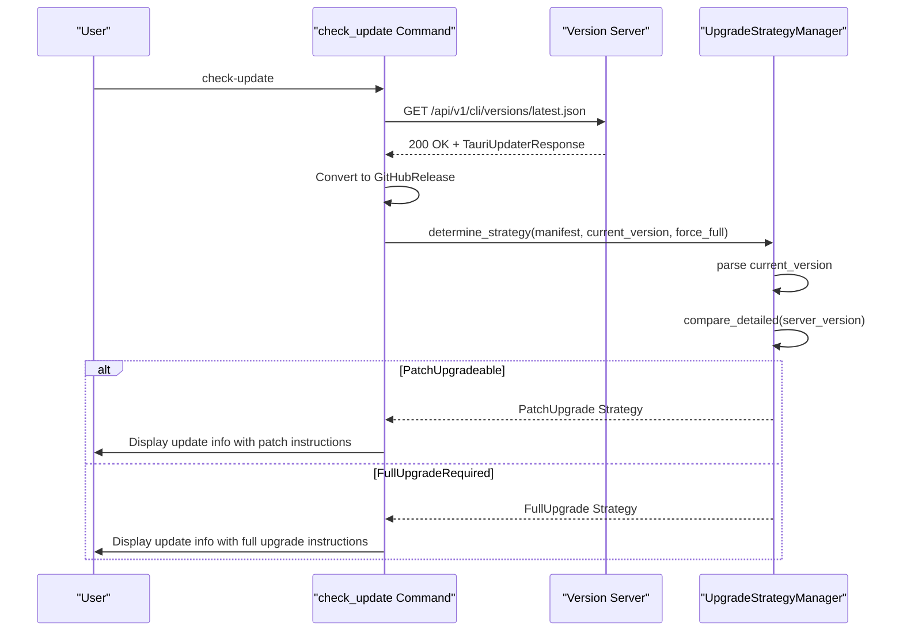
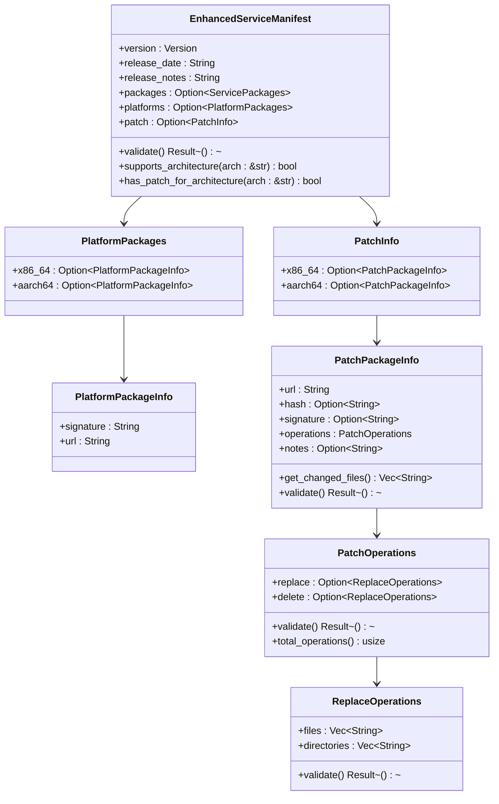

# check_update

<cite>
**Referenced Files in This Document**   
- [check_update.rs](file://nuwax-cli/src/commands/check_update.rs#L0-L814)
- [version.rs](file://client-core/src/version.rs#L0-L410)
- [upgrade_strategy.rs](file://client-core/src/upgrade_strategy.rs#L0-L463)
- [api_types.rs](file://client-core/src/api_types.rs#L0-L902)
- [authenticated_client.rs](file://client-core/src/authenticated_client.rs#L0-L200)
</cite>

## Table of Contents
1. [Introduction](#introduction)
2. [Command Functionality and Role](#command-functionality-and-role)
3. [Command Options](#command-options)
4. [Version Comparison and Semantic Versioning](#version-comparison-and-semantic-versioning)
5. [Output Formats and Examples](#output-formats-and-examples)
6. [Integration with Upgrade Strategy](#integration-with-upgrade-strategy)
7. [Network Error Handling and Resilience](#network-error-handling-and-resilience)
8. [Authentication Requirements](#authentication-requirements)
9. [Rate Limiting Considerations](#rate-limiting-considerations)
10. [Timeout Settings](#timeout-settings)
11. [Verbose Output and Logging](#verbose-output-and-logging)
12. [Patch Size Estimates and Architecture-Specific Availability](#patch-size-estimates-and-architecture-specific-availability)

## Introduction
The `check_update` command is a critical component of the Nuwax CLI tool, responsible for determining whether a newer version of the application is available. It plays a vital role in maintaining system security, stability, and feature parity by enabling users to stay up-to-date with the latest releases. This document provides a comprehensive analysis of the command's implementation, covering its architecture, functionality, integration points, and operational characteristics. The analysis is based on a thorough examination of the relevant source code files, including the command implementation, version management, upgrade strategy, and API type definitions.

## Command Functionality and Role
The `check_update` command serves as the primary mechanism for querying remote servers to determine the availability of software updates. Its core responsibility is to compare the local application version with the latest version available on remote servers and report the results to the user. The command is implemented in the `nuwax-cli/src/commands/check_update.rs` file and is designed to be robust and resilient by utilizing multiple update sources. The primary source is a dedicated version check server, with GitHub's API serving as a fallback. This dual-source approach ensures high availability and reliability, as the command can fall back to GitHub if the primary server is unreachable. The command orchestrates the entire update check process, from initiating network requests to parsing responses and presenting the results in a user-friendly format. It is designed to be non-intrusive, providing clear and concise information about the current and latest versions, as well as instructions for installing updates when available.

**Section sources**
- [check_update.rs](file://nuwax-cli/src/commands/check_update.rs#L0-L814)

## Command Options
The `check_update` command supports several options to customize its behavior, providing flexibility for different use cases and environments. The primary command has two subcommands: `check` and `install`. The `check` subcommand performs a simple version check and displays the results, while the `install` subcommand not only checks for updates but also proceeds to download and install the new version. The `install` subcommand accepts two optional parameters: `version` and `force`. The `version` parameter allows users to specify a particular version to install, which is useful for testing or rolling back to a previous release. The `force` parameter overrides the version comparison logic and forces the installation of the specified version, even if it is not newer than the current version. This is particularly useful for re-installing a version to repair a corrupted installation. The command also supports implicit options through its configuration, such as the ability to use only the version server or only GitHub as the update source, although these are not exposed as direct command-line flags.

**Section sources**
- [check_update.rs](file://nuwax-cli/src/commands/check_update.rs#L0-L814)

## Version Comparison and Semantic Versioning
The `check_update` command relies on a sophisticated version management system to perform accurate version comparisons. The version logic is implemented in the `client-core/src/version.rs` file and is based on semantic versioning principles. The `Version` struct supports a four-segment version format (major.minor.patch.build), which allows for fine-grained version tracking and patch-level updates. The version comparison is performed using the `compare_detailed` method, which returns a `VersionComparison` enum indicating the relationship between the current and target versions. The possible outcomes are `Equal`, `Newer`, `PatchUpgradeable`, and `FullUpgradeRequired`. A `PatchUpgradeable` result indicates that the current and target versions share the same base version (major.minor.patch) but have different build numbers, meaning a patch update is available. A `FullUpgradeRequired` result indicates that the base versions are different, requiring a full upgrade. This detailed comparison enables the system to make intelligent decisions about the type of upgrade needed, which is crucial for the upgrade strategy module.



**Diagram sources**
- [version.rs](file://client-core/src/version.rs#L0-L410)

**Section sources**
- [version.rs](file://client-core/src/version.rs#L0-L410)

## Output Formats and Examples
The `check_update` command produces different output formats depending on the outcome of the version check. When an update is available, the command displays a detailed message indicating the current and latest versions, the download URL, a summary of the release notes, the release date, and instructions for installing the update. When the system is up-to-date, a simple message confirms that the current version is the latest. In the event of a downgrade (where the local version is newer than the remote version), the command will indicate that no update is needed. The output is designed to be informative and actionable, providing users with all the information they need to make a decision. The command also handles network errors and other failures gracefully, providing clear error messages and potential solutions.

**Example 1: Update Available**
```
🔍 正在检查 Nuwax Cli  更新...
📡 尝试使用版本检查服务器API获取版本信息...
✅ 版本检查服务器API获取成功
🦆 Nuwax Cli  版本信息
当前版本: v0.1.0
最新版本: v0.2.0
✅ 发现新版本可用！
下载地址: https://example.com/nuwax-cli-v0.2.0.tar.gz
更新说明:
This release includes several bug fixes and performance improvements.
- Fixed issue with database connection pooling
- Improved startup time by 20%
- Added support for new configuration options
...
发布时间: 2025-01-15 10:30:00
💡 使用以下命令安装更新:
   nuwax-cli check-update install
```

**Example 2: Up-to-Date**
```
🔍 正在检查 Nuwax Cli  更新...
📡 尝试使用版本检查服务器API获取版本信息...
✅ 版本检查服务器API获取成功
🦆 Nuwax Cli  版本信息
当前版本: v0.2.0
最新版本: v0.2.0
✅ 您已经使用最新版本！
```

**Example 3: Downgrade Detected**
```
🔍 正在检查 Nuwax Cli  更新...
📡 尝试使用版本检查服务器API获取版本信息...
✅ 版本检查服务器API获取成功
🦆 Nuwax Cli  版本信息
当前版本: v0.3.0
最新版本: v0.2.0
✅ 您已经使用最新版本！
```

**Section sources**
- [check_update.rs](file://nuwax-cli/src/commands/check_update.rs#L0-L814)

## Integration with Upgrade Strategy
The `check_update` command is tightly integrated with the `upgrade_strategy` module, which determines the most appropriate method for upgrading the application. The `UpgradeStrategyManager` in `client-core/src/upgrade_strategy.rs` uses the version comparison results from the `check_update` command to decide whether a full upgrade or a patch upgrade is required. The manager considers several factors, including the current version, the target version, the user's preference for a full upgrade (via the `force` flag), and the availability of patch packages for the current architecture. If a patch upgrade is possible and the user has not requested a full upgrade, the manager will select the `PatchUpgrade` strategy. Otherwise, it will select the `FullUpgrade` strategy. This integration ensures that the upgrade process is efficient and minimizes bandwidth usage by using patch updates when possible. The `check_update` command provides the necessary input (the latest version information) for the `UpgradeStrategyManager` to make its decision.



**Diagram sources**
- [upgrade_strategy.rs](file://client-core/src/upgrade_strategy.rs#L0-L463)
- [check_update.rs](file://nuwax-cli/src/commands/check_update.rs#L0-L814)

**Section sources**
- [upgrade_strategy.rs](file://client-core/src/upgrade_strategy.rs#L0-L463)

## Network Error Handling and Resilience
The `check_update` command implements robust error handling to ensure reliability in the face of network issues. It uses a multi-source approach, attempting to fetch version information from the primary version server first and falling back to GitHub's API if the primary server fails. This is implemented in the `UpdateSourceManager::fetch_latest_version` method, which iterates through the available sources and returns the first successful response. Each network request is wrapped in a timeout to prevent the command from hanging indefinitely. If all sources fail, the command provides a detailed error message listing the possible causes, such as network connectivity issues, server downtime, or API rate limits. The error messages are designed to be user-friendly and include actionable advice, such as checking the network connection or trying again later. The command also logs detailed information using the `tracing` crate, which can be invaluable for debugging issues in production environments.

**Section sources**
- [check_update.rs](file://nuwax-cli/src/commands/check_update.rs#L0-L814)

## Authentication Requirements
The `check_update` command does not require authentication to query the version information from the remote servers. The version check server and GitHub's API are both public endpoints that do not require any form of authentication. This design choice simplifies the update check process and ensures that it can be performed by any user without the need for credentials. However, the broader application does have an authentication system for other operations, implemented in the `authenticated_client.rs` file. This system uses a client ID for authentication, which is automatically managed and renewed if necessary. While the `check_update` command itself does not use this authenticated client, it shares the same underlying HTTP client infrastructure, benefiting from its robust error handling and retry logic.

**Section sources**
- [check_update.rs](file://nuwax-cli/src/commands/check_update.rs#L0-L814)
- [authenticated_client.rs](file://client-core/src/authenticated_client.rs#L0-L200)

## Rate Limiting Considerations
The `check_update` command is designed to be respectful of API rate limits, although the provided code does not explicitly implement rate limiting logic. The command uses standard HTTP headers, including a `User-Agent` string that identifies the client and its version, which is a best practice for API consumers. The lack of explicit rate limiting suggests that the expected usage pattern (occasional manual checks by users) is not likely to trigger rate limits on the version server or GitHub's API. However, if the command were to be used in an automated or high-frequency scenario, additional rate limiting measures would be necessary to avoid being blocked by the servers. The command's fallback mechanism (using GitHub as a backup) also provides some resilience against rate limiting on the primary server, as a request that fails due to rate limiting on one server might succeed on the other.

**Section sources**
- [check_update.rs](file://nuwax-cli/src/commands/check_update.rs#L0-L814)

## Timeout Settings
The `check_update` command implements timeout settings to ensure that network requests do not hang indefinitely. The timeout duration is set differently for the primary version server and the GitHub API. When querying the version server, a timeout of 10 seconds is used, as defined in the `fetch_from_version_server` method. When falling back to the GitHub API, a slightly longer timeout of 15 seconds is used, as defined in the `fetch_from_github` method. These timeouts are implemented using the `reqwest` HTTP client's `timeout` method, which cancels the request if it does not complete within the specified duration. The use of different timeouts reflects the expected performance characteristics of the two servers, with the dedicated version server expected to be faster and more reliable than the public GitHub API. These timeout settings contribute to the command's overall responsiveness and user experience.

**Section sources**
- [check_update.rs](file://nuwax-cli/src/commands/check_update.rs#L0-L814)

## Verbose Output and Logging
The `check_update` command uses the `tracing` crate for logging, providing detailed information about its internal operations. The logging is structured and includes timestamps, log levels, and contextual information. The command logs key events such as the start of the update check, the URLs being queried, the success or failure of each request, and the final result. This verbose output is invaluable for debugging and monitoring, allowing developers and system administrators to understand the command's behavior in detail. The log messages are also designed to be user-friendly, using emojis and clear language to convey the status of the operation. For example, a successful request is marked with a checkmark emoji (✅), while a failed request is marked with a warning sign (⚠️). This combination of detailed technical logging and user-friendly output makes the command both powerful and accessible.

**Section sources**
- [check_update.rs](file://nuwax-cli/src/commands/check_update.rs#L0-L814)

## Patch Size Estimates and Architecture-Specific Availability
The `check_update` command and its associated modules provide support for architecture-specific updates and patch size estimates. The `EnhancedServiceManifest` structure, defined in `api_types.rs`, includes separate download URLs and metadata for different architectures (x86_64 and aarch64). This allows the system to provide optimized packages for the user's specific hardware, improving performance and compatibility. The manifest also includes information about patch packages, which are significantly smaller than full upgrades. While the `check_update` command itself does not display the patch size, this information is available in the manifest and can be used by the upgrade process to estimate bandwidth requirements. The `UpgradeStrategyManager` uses the architecture information to select the appropriate package for the user's system, ensuring that the correct binary is downloaded and installed. This architecture-specific availability is a key feature that enables the system to support a wide range of devices efficiently.



**Diagram sources**
- [api_types.rs](file://client-core/src/api_types.rs#L0-L902)

**Section sources**
- [api_types.rs](file://client-core/src/api_types.rs#L0-L902)