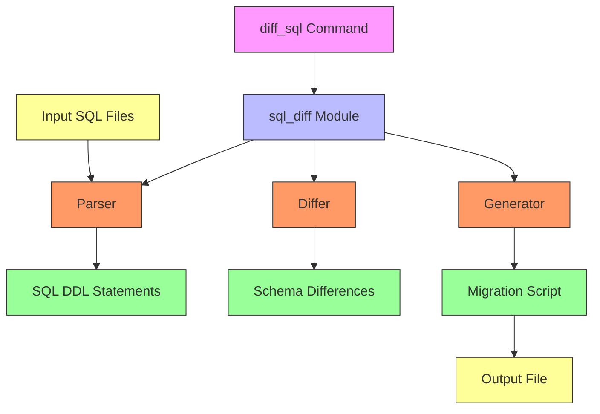
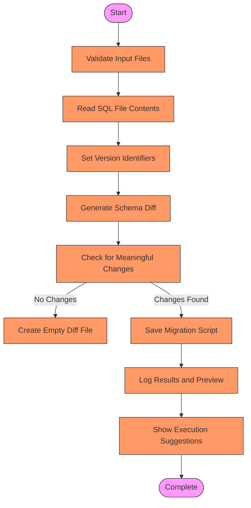
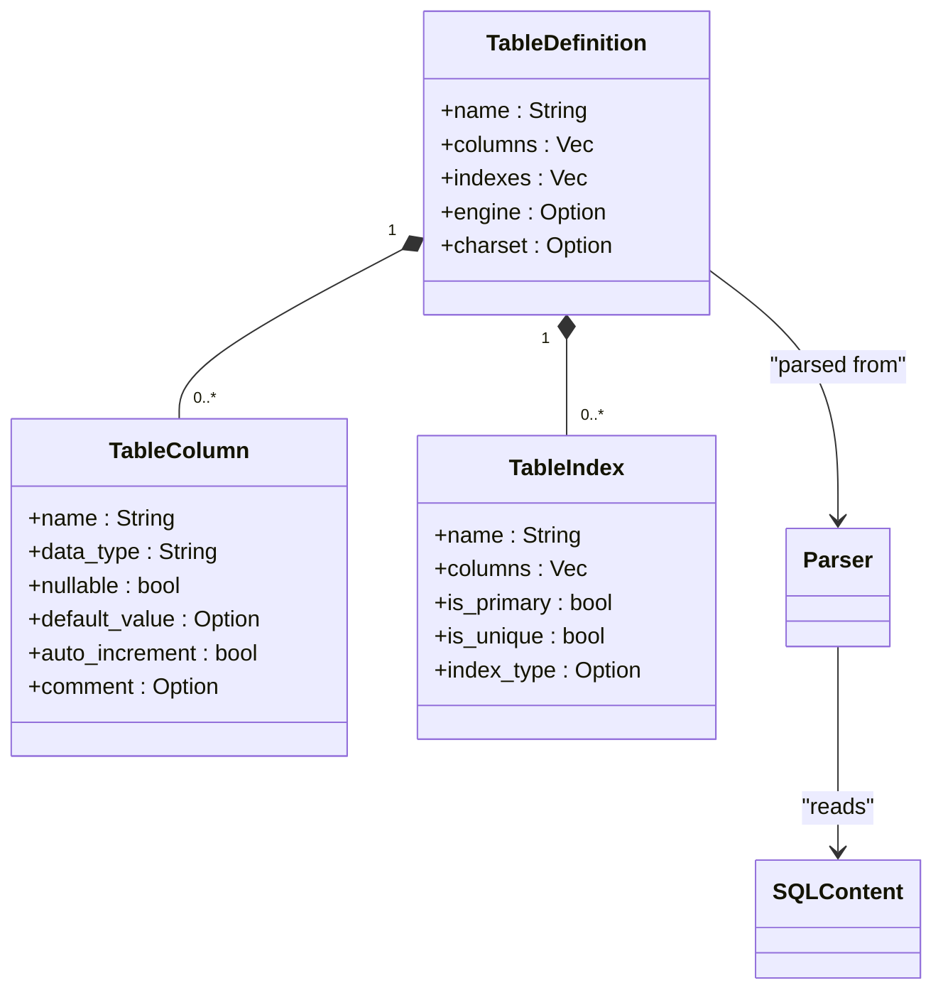
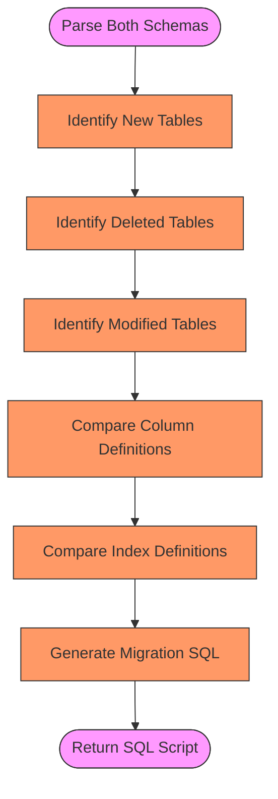
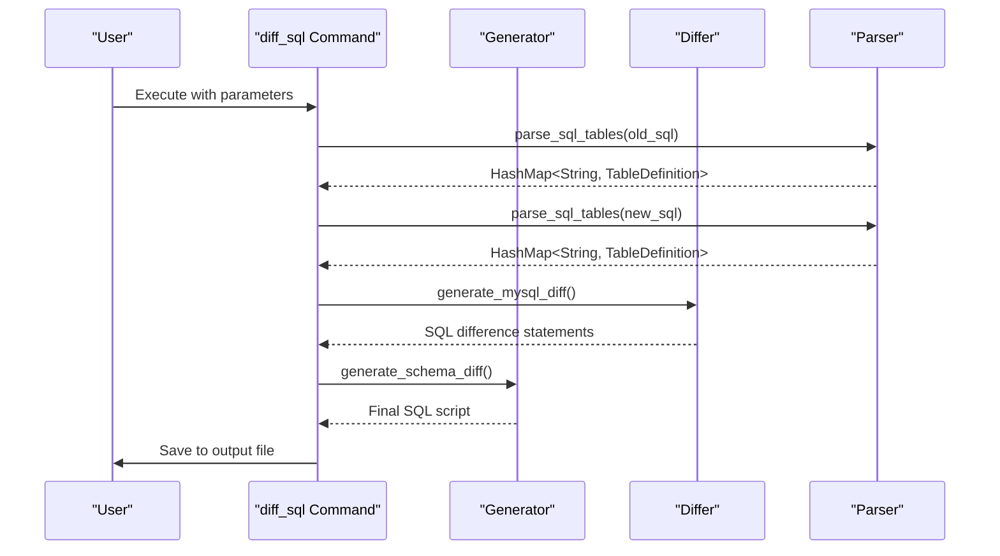
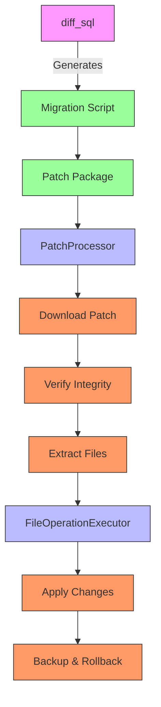

# diff_sql

<cite>
**Referenced Files in This Document**   
- [diff_sql.rs](file://nuwax-cli/src/commands/diff_sql.rs)
- [mod.rs](file://client-core/src/sql_diff/mod.rs)
- [generator.rs](file://client-core/src/sql_diff/generator.rs)
- [parser.rs](file://client-core/src/sql_diff/parser.rs)
- [differ.rs](file://client-core/src/sql_diff/differ.rs)
- [types.rs](file://client-core/src/sql_diff/types.rs)
- [patch_executor.rs](file://client-core/src/patch_executor/patch_processor.rs)
- [file_operations.rs](file://client-core/src/patch_executor/file_operations.rs)
- [error.rs](file://client-core/src/patch_executor/error.rs)
</cite>

## Table of Contents
1. [Introduction](#introduction)
2. [Core Functionality](#core-functionality)
3. [Input Parameters](#input-parameters)
4. [Architecture Overview](#architecture-overview)
5. [Detailed Component Analysis](#detailed-component-analysis)
6. [SQL Parsing Process](#sql-parsing-process)
7. [Schema Difference Generation](#schema-difference-generation)
8. [Migration Script Generation](#migration-script-generation)
9. [Configuration and Output Options](#configuration-and-output-options)
10. [Integration with Patch Executor](#integration-with-patch-executor)
11. [Limitations and Workarounds](#limitations-and-workarounds)
12. [Performance Tips](#performance-tips)
13. [Practical Examples](#practical-examples)
14. [Error Handling](#error-handling)

## Introduction
The **diff_sql** command is a database schema migration tool designed to generate executable SQL migration scripts by analyzing differences between two database states. It enables developers and database administrators to safely evolve database schemas by automatically detecting structural changes and producing the necessary ALTER, CREATE, and DROP statements. The tool operates primarily on SQL dump files, comparing the DDL (Data Definition Language) statements to identify schema modifications. This documentation provides a comprehensive analysis of the diff_sql command's architecture, functionality, and usage patterns, making it accessible to both technical and non-technical users.

## Core Functionality
The diff_sql command serves as a critical component in database version control and schema migration workflows. Its primary purpose is to generate schema migration scripts by performing SQL difference analysis between two database states. The tool takes two SQL dump files as input—one representing the source (old) schema state and another representing the target (new) schema state—and produces an executable SQL script that transforms the source schema into the target schema.

The command is particularly useful in development workflows where database schemas evolve over time. It enables teams to maintain version-controlled database changes, facilitates safe deployment of schema modifications to production environments, and reduces the risk of human error in manual migration script creation. The generated migration scripts are designed to be idempotent and include comprehensive logging and validation to ensure reliability.

The diff_sql command focuses specifically on structural database changes, including table creation and deletion, column modifications, and index changes. It does not handle data migration or transformation logic, which must be addressed separately. The tool generates MySQL-compatible SQL statements and includes detailed metadata about the changes, such as version information and change descriptions.

**Section sources**
- [diff_sql.rs](file://nuwax-cli/src/commands/diff_sql.rs#L1-L114)

## Input Parameters
The diff_sql command accepts several input parameters that define the source and target database states, version information, and output configuration:

- **old_sql_path**: Path to the SQL file representing the source (old) database schema. This parameter is required and must point to an existing file.
- **new_sql_path**: Path to the SQL file representing the target (new) database schema. This parameter is required and must point to an existing file.
- **old_version**: Optional parameter specifying the version identifier for the source schema. If not provided, defaults to "unknown".
- **new_version**: Optional parameter specifying the version identifier for the target schema. If not provided, defaults to "latest".
- **output_file**: String specifying the path where the generated migration script will be saved.

The command performs validation on all input parameters, checking for file existence before proceeding with the analysis. It uses these parameters to configure the schema comparison process and to generate appropriate metadata in the output migration script. The version parameters are particularly important for documentation and audit purposes, as they are included in the generated script's comments and logging output.

The input files are expected to contain valid MySQL DDL statements, typically generated by database dump tools. The command reads the entire content of both files into memory for analysis, so very large dump files may impact performance.

**Section sources**
- [diff_sql.rs](file://nuwax-cli/src/commands/diff_sql.rs#L8-L23)

## Architecture Overview
The diff_sql command follows a modular architecture with clear separation of concerns between components. The system is organized into several key modules that work together to parse SQL files, analyze schema differences, and generate migration scripts.



**Diagram sources**
- [diff_sql.rs](file://nuwax-cli/src/commands/diff_sql.rs#L1-L114)
- [mod.rs](file://client-core/src/sql_diff/mod.rs#L1-L11)

The architecture follows a pipeline pattern where SQL files are first parsed into structured data models, then compared to identify differences, and finally transformed into executable migration scripts. The command interface (diff_sql.rs) serves as the entry point, coordinating the workflow and handling input/output operations. The core logic is encapsulated in the sql_diff module, which exposes a clean API for schema difference generation.

This modular design enables independent development and testing of each component. The parser handles SQL syntax analysis, the differ implements the comparison algorithm, and the generator produces the final SQL output. This separation of concerns makes the system maintainable and extensible, allowing for future enhancements such as support for additional database dialects or more sophisticated difference analysis algorithms.

## Detailed Component Analysis

### diff_sql Command Implementation
The diff_sql command implementation is located in the `run_diff_sql` function, which orchestrates the entire schema comparison process. The function follows a sequential workflow that begins with input validation and ends with output generation.



**Diagram sources**
- [diff_sql.rs](file://nuwax-cli/src/commands/diff_sql.rs#L25-L114)

The command begins by validating that both input SQL files exist, returning appropriate error messages if either file is missing. It then reads the complete content of both files into memory using standard file I/O operations. After setting default version identifiers, it invokes the `generate_schema_diff` function from the sql_diff module to perform the actual difference analysis.

A key feature of the implementation is its handling of empty diffs. When no meaningful SQL changes are detected (only comments or whitespace differences), the command creates a special empty migration script with explanatory comments rather than failing or producing no output. This behavior provides clear audit trails and prevents confusion in automated deployment pipelines.

The command also includes user-friendly features such as a preview of the first 10 lines of the generated migration script and execution suggestions that guide users on how to apply the changes safely. These suggestions emphasize best practices like database backups and testing in non-production environments before deployment.

**Section sources**
- [diff_sql.rs](file://nuwax-cli/src/commands/diff_sql.rs#L1-L114)

## SQL Parsing Process
The SQL parsing process is implemented in the `parser.rs` module and is responsible for converting raw SQL DDL statements into structured data models that can be compared. The parser uses a combination of regular expressions and a formal SQL parser (sqlparser) to extract and analyze CREATE TABLE statements from the input SQL files.



**Diagram sources**
- [parser.rs](file://client-core/src/sql_diff/parser.rs#L1-L381)
- [types.rs](file://client-core/src/sql_diff/types.rs#L1-L31)

The parsing process begins with the `parse_sql_tables` function, which first uses regular expressions to locate CREATE TABLE statements within the SQL content. This approach allows the parser to handle SQL files that contain multiple statements, comments, and other SQL commands beyond just table definitions.

For each identified CREATE TABLE statement, the parser uses the sqlparser library to perform formal SQL syntax analysis. This two-step approach—first using regex to extract statements, then using a proper SQL parser to analyze them—provides both efficiency and accuracy. The regex step quickly filters out irrelevant content, while the formal parser ensures correct interpretation of SQL syntax and semantics.

The parser extracts comprehensive information about each table, including column definitions with data types, nullability constraints, default values, auto-increment settings, and comments. It also captures index information, distinguishing between primary keys, unique constraints, and regular indexes. This structured representation enables precise comparison of schema elements.

**Section sources**
- [parser.rs](file://client-core/src/sql_diff/parser.rs#L1-L381)
- [types.rs](file://client-core/src/sql_diff/types.rs#L1-L31)

## Schema Difference Generation
The schema difference generation process is implemented in the `differ.rs` module and represents the core algorithmic component of the diff_sql functionality. This process compares two sets of parsed table definitions and generates the necessary SQL statements to transform the source schema into the target schema.



**Diagram sources**
- [differ.rs](file://client-core/src/sql_diff/differ.rs#L1-L266)

The difference algorithm follows a systematic approach to identify three categories of changes: new tables, deleted tables, and modified tables. For new tables, it generates CREATE TABLE statements using the target schema's table definitions. For deleted tables, it generates DROP TABLE statements to remove tables that exist in the source but not in the target.

For modified tables, the algorithm performs a detailed comparison of column and index definitions. Column differences are identified by comparing column names, data types, nullability, default values, and other attributes. The algorithm detects three types of column changes: additions (new columns), deletions (removed columns), and modifications (changed column properties).

Similarly, index differences are identified by comparing index names, column compositions, and index types (primary, unique, regular). When an index definition changes, the algorithm generates SQL statements that first drop the old index and then create the new one, as MySQL does not support direct index modification.

The difference generation process is designed to be deterministic and idempotent, ensuring consistent results across multiple executions with the same input. It also includes comprehensive logging to provide visibility into the comparison process.

**Section sources**
- [differ.rs](file://client-core/src/sql_diff/differ.rs#L1-L266)

## Migration Script Generation
The migration script generation process is implemented in the `generator.rs` module and is responsible for transforming schema differences into executable SQL statements. This process builds upon the difference analysis performed by the differ module and produces a complete, ready-to-execute migration script.



**Diagram sources**
- [generator.rs](file://client-core/src/sql_diff/generator.rs#L1-L195)
- [differ.rs](file://client-core/src/sql_diff/differ.rs#L1-L266)

The generation process begins with the `generate_schema_diff` function, which serves as the main entry point for the sql_diff module. This function handles several scenarios: initial version generation (when no source schema is provided), identical schema detection, and actual difference generation.

When generating the migration script, the system includes comprehensive metadata such as generation timestamp and version information. The output script is formatted with comments that describe each change, making it easier to understand and audit. The script follows MySQL syntax and includes appropriate semicolons and formatting for readability.

A key feature of the generation process is its ability to detect when no meaningful changes exist between schemas. In such cases, instead of producing an empty file, it generates a script with explanatory comments indicating that no changes were necessary. This behavior provides valuable documentation and prevents confusion in automated deployment systems.

The generator also analyzes the types of changes present in the diff and includes a summary in the output, such as "新增列、修改列" (new columns, modified columns). This summary helps users quickly understand the nature of the schema changes without examining the entire script.

**Section sources**
- [generator.rs](file://client-core/src/sql_diff/generator.rs#L1-L195)

## Configuration and Output Options
The diff_sql command provides several configuration options that control the granularity of the difference analysis and the format of the output. While the command line interface exposes basic parameters, additional configuration is available through the underlying API.

The primary configuration options include:
- **Version identifiers**: Optional parameters that specify the source and target version numbers, which are included in the generated script's metadata.
- **Output file path**: Specifies where the migration script will be saved, allowing users to control the destination.
- **Change detection sensitivity**: The system distinguishes between meaningful SQL changes and insignificant differences like comments or whitespace.

The output format is standardized as MySQL-compatible SQL with comprehensive comments and metadata. The generated script includes:
- A header with generation timestamp and version information
- Descriptive comments for each change (e.g., "-- 新增表: users")
- Properly formatted SQL statements with appropriate indentation
- A summary of the changes at the beginning of the script

The command also provides runtime feedback through logging, showing progress and key information such as the number of executable SQL statements detected. When no changes are found, it creates a special empty diff file with explanatory comments rather than producing no output.

Future enhancements could include additional configuration options such as:
- Ignoring specific database objects (tables, indexes)
- Controlling the level of detail in the output
- Customizing the output format (e.g., JSON, plain text)
- Filtering specific types of changes

**Section sources**
- [diff_sql.rs](file://nuwax-cli/src/commands/diff_sql.rs#L8-L114)
- [generator.rs](file://client-core/src/sql_diff/generator.rs#L1-L195)

## Integration with Patch Executor
The diff_sql command integrates with the patch_executor module to enable automated application of generated migration scripts. While diff_sql focuses on generating the SQL differences, the patch_executor handles the safe application of these changes to target databases.



**Diagram sources**
- [patch_processor.rs](file://client-core/src/patch_executor/patch_processor.rs#L1-L455)
- [file_operations.rs](file://client-core/src/patch_executor/file_operations.rs#L1-L524)

The integration workflow begins with diff_sql generating a migration script, which is then packaged as part of a patch package. The PatchProcessor downloads and verifies the patch integrity using hash checks and digital signatures. After successful verification, it extracts the patch contents to a temporary directory.

The FileOperationExecutor then applies the changes in a controlled manner, with support for backups and rollback operations. When enabled, the backup mode creates snapshots of files before modification, allowing for recovery if the patch application fails. The executor handles various operations including file replacement, directory replacement, and file deletion.

The PatchExecutor coordinates the entire process and includes error handling with automatic rollback capabilities. If an error occurs during patch application and backup mode is enabled, the system automatically reverts to the previous state, minimizing downtime and data loss risk.

This integration enables a complete migration workflow from difference analysis to safe deployment, providing enterprises with a reliable mechanism for database schema evolution.

**Section sources**
- [patch_processor.rs](file://client-core/src/patch_executor/patch_processor.rs#L1-L455)
- [file_operations.rs](file://client-core/src/patch_executor/file_operations.rs#L1-L524)
- [error.rs](file://client-core/src/patch_executor/error.rs#L1-L223)

## Limitations and Workarounds
The diff_sql command has several important limitations that users should be aware of when planning database migrations:

**Data Transformation Limitations**: The tool only analyzes structural changes and cannot handle data migration or transformation logic. For example, if a column is renamed, diff_sql will generate a DROP COLUMN and ADD COLUMN sequence, resulting in data loss. Workaround: Manually add data migration statements (e.g., INSERT INTO ... SELECT) before structural changes.

**Complex Constraint Handling**: The current implementation may not properly handle complex foreign key dependencies or cascading constraints. When tables with relationships are modified, the generated script might violate referential integrity. Workaround: Temporarily disable foreign key checks (SET FOREIGN_KEY_CHECKS=0) during migration, then re-enable them afterward.

**Partial Schema Support**: The parser focuses on CREATE TABLE statements and may not fully support other schema elements like views, stored procedures, or triggers. Workaround: Handle these elements separately and combine their migration scripts manually.

**MySQL-Specific Syntax**: The generated SQL is optimized for MySQL and may not be compatible with other database systems. Workaround: For multi-database environments, use the diff_sql output as a template and adapt the syntax as needed.

**Large Schema Performance**: Very large SQL dump files may cause memory pressure since the entire content is loaded into memory. Workaround: Process schemas in smaller chunks or use database-specific tools for initial analysis.

**No Dry-Run Capability**: The tool generates scripts but doesn't provide a way to preview the actual impact on a database without execution. Workaround: Always test migration scripts on a copy of the production database before applying to live systems.

Understanding these limitations helps users plan more robust migration strategies and supplement the automated tooling with appropriate manual interventions.

## Performance Tips
To optimize the performance of the diff_sql command, especially when working with large databases, consider the following tips:

**Process Schemas in Modules**: Instead of analyzing entire database dumps, break schemas into logical modules or domains and process them separately. This reduces memory usage and makes the output more manageable.

**Use Minimal SQL Dumps**: When generating input files, include only the necessary DDL statements rather than full database dumps with data. This significantly reduces file size and processing time.

**Pre-filter Relevant Tables**: If only specific tables have changed, create SQL files containing only those tables rather than processing the entire schema.

**Monitor Memory Usage**: Since the tool loads entire SQL files into memory, be aware of system memory constraints when working with very large schemas. Consider using machines with sufficient RAM for large-scale migrations.

**Leverage Caching**: For repeated analyses of similar schemas, implement external caching of parsed schema representations to avoid re-parsing unchanged files.

**Optimize Disk I/O**: Ensure that input and output files are stored on fast storage devices, as file reading and writing can become bottlenecks with large files.

**Parallel Processing**: When multiple independent schema comparisons are needed, run them in parallel processes to utilize multiple CPU cores effectively.

**Regular Maintenance**: Keep the tool and its dependencies updated, as performance improvements may be included in newer versions.

Following these performance tips can significantly reduce processing time and resource consumption, making the diff_sql command more efficient for large-scale database migration projects.

## Practical Examples
Here are practical examples demonstrating the use of the diff_sql command in common scenarios:

**Basic Schema Comparison**:
```bash
diff_sql \
  --old-sql-path ./schema/v1.sql \
  --new-sql-path ./schema/v2.sql \
  --old-version "1.0.0" \
  --new-version "2.0.0" \
  --output-file ./migrations/upgrade_1.0.0_to_2.0.0.sql
```

**Development to Production Sync**:
```bash
# Compare development schema with production backup
diff_sql \
  ./backups/prod_schema_2023.sql \
  ./current_schema.sql \
  "production" \
  "development" \
  ./migrations/to_development.sql
```

**Empty Diff Scenario**:
When comparing identical schemas, the command generates:
```sql
-- SQL差异分析结果
-- 版本 unknown 到 latest: 无变化
-- 无需执行任何SQL语句，数据库架构无变化
```

**Complex Schema Change**:
For a schema with multiple changes, the output includes:
```sql
-- 数据库架构差异SQL
-- 生成时间: 2023-12-07 10:30:45 UTC

-- 新增表: user_profiles
CREATE TABLE `user_profiles` (
  `id` INT NOT NULL AUTO_INCREMENT,
  `user_id` INT NOT NULL,
  `bio` TEXT,
  PRIMARY KEY (`id`),
  UNIQUE KEY `unique_user` (`user_id`)
) ENGINE=InnoDB DEFAULT CHARSET=utf8mb4;

-- 修改表: users
ALTER TABLE `users` ADD COLUMN `email_verified` BOOLEAN DEFAULT FALSE;
ALTER TABLE `users` MODIFY COLUMN `status` VARCHAR(20);
ALTER TABLE `users` ADD KEY `idx_status` (`status`);
```

These examples illustrate typical usage patterns and demonstrate the command's output format and capabilities.

## Error Handling
The diff_sql command implements comprehensive error handling to ensure reliability and provide meaningful feedback to users. Errors are categorized and handled at multiple levels throughout the execution pipeline.

**Input Validation Errors**: The command validates input parameters before processing, returning specific error messages for missing files or invalid paths. For example, attempting to use a non-existent SQL file results in a clear error message identifying the problematic file.

**File I/O Errors**: All file operations are wrapped in error handling that converts low-level I/O exceptions into user-friendly messages. This includes errors during file reading, writing, and permission issues.

**SQL Parsing Errors**: When the parser encounters malformed SQL, it logs warnings but attempts to continue processing other statements. This fault-tolerant approach ensures that isolated syntax issues don't prevent analysis of the entire schema.

**Difference Generation Errors**: The core difference algorithm includes validation to prevent generation of invalid SQL statements. Errors at this level typically indicate fundamental issues with the input schemas.

**Error Propagation**: Errors are propagated through the system using the anyhow and DuckError types, maintaining context and stack traces for debugging. The error handling system distinguishes between recoverable errors (like temporary network issues) and unrecoverable errors (like hash mismatches in patch verification).

The command also includes defensive programming practices such as bounds checking, null safety, and resource cleanup to prevent crashes and data corruption. Comprehensive logging at multiple verbosity levels helps diagnose issues during both development and production use.

**Section sources**
- [error.rs](file://client-core/src/patch_executor/error.rs#L1-L223)
- [diff_sql.rs](file://nuwax-cli/src/commands/diff_sql.rs#L1-L114)