# docker_service

<cite>
**Referenced Files in This Document**   
- [docker_service.rs](file://nuwax-cli/src/commands/docker_service.rs)
- [manager.rs](file://nuwax-cli/src/docker_service/manager.rs)
- [mod.rs](file://nuwax-cli/src/docker_service/mod.rs)
- [docker-task.md](file://spec/docker-task.md)
- [client_core/src/container/service.rs](file://client-core/src/container/service.rs)
</cite>

## Table of Contents
1. [Introduction](#introduction)
2. [Core Functionality](#core-functionality)
3. [Subcommands and Options](#subcommands-and-options)
4. [Architecture Detection and Integration](#architecture-detection-and-integration)
5. [Service Lifecycle Management](#service-lifecycle-management)
6. [Multi-Container Service Management](#multi-container-service-management)
7. [Health Checks and Status Monitoring](#health-checks-and-status-monitoring)
8. [Error Recovery and Restart Policies](#error-recovery-and-restart-policies)
9. [Common Issues and Troubleshooting](#common-issues-and-troubleshooting)
10. [Best Practices for Production](#best-practices-for-production)

## Introduction

The `docker_service` command provides comprehensive management of Docker services within the application ecosystem. It serves as the primary interface for controlling the lifecycle of Docker containers, handling deployment, startup, shutdown, and monitoring operations. The command integrates tightly with the underlying Docker infrastructure through the `DockerServiceManager` component, enabling robust service orchestration and error handling.

This documentation details the complete functionality of the `docker_service` command, including all available subcommands, their options, and integration points with other system components. It covers the architecture detection capabilities, health check mechanisms, and error recovery strategies that ensure reliable service operation across different environments.

**Section sources**
- [docker_service.rs](file://nuwax-cli/src/commands/docker_service.rs#L1-L536)

## Core Functionality

The `docker_service` command provides a unified interface for managing Docker services with comprehensive lifecycle control. The core functionality is implemented through the `run_docker_service_command` function, which dispatches to appropriate handlers based on the subcommand provided.

The command supports several key operations:
- **Service Deployment**: Complete deployment workflow including environment checks, directory setup, image loading, and service startup
- **Lifecycle Management**: Start, stop, and restart operations for both individual containers and entire service stacks
- **Status Monitoring**: Comprehensive health checks and status reporting with detailed container information
- **Image Management**: Loading of offline Docker images and tag management for architecture-specific deployments

The implementation follows a modular architecture, with the `DockerServiceManager` class coordinating various specialized components for different aspects of service management.

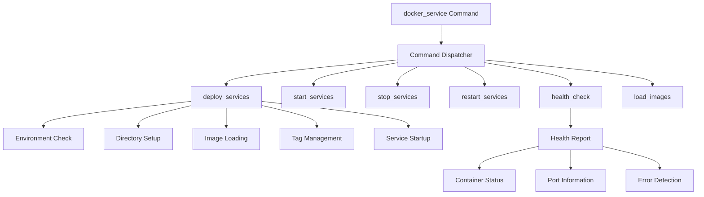

**Diagram sources**
- [docker_service.rs](file://nuwax-cli/src/commands/docker_service.rs#L1-L536)
- [manager.rs](file://nuwax-cli/src/docker_service/manager.rs#L1-L888)

**Section sources**
- [docker_service.rs](file://nuwax-cli/src/commands/docker_service.rs#L1-L536)
- [manager.rs](file://nuwax-cli/src/docker_service/manager.rs#L1-L888)

## Subcommands and Options

The `docker_service` command provides a comprehensive set of subcommands for managing Docker services, each with specific functionality and options.

### Primary Subcommands

**Start**: Initiates all Docker services defined in the configuration.
```bash
nuwax-cli docker-service start
```

**Stop**: Halts all running Docker services.
```bash
nuwax-cli docker-service stop
```

**Restart**: Performs a complete restart of all Docker services.
```bash
nuwax-cli docker-service restart
```

**Status**: Checks and reports the current status of all Docker services.
```bash
nuwax-cli docker-service status
```

### Advanced Subcommands

**RestartContainer**: Restarts a specific container by name.
```bash
nuwax-cli docker-service restart-container --container-name mysql
```

**LoadImages**: Loads Docker images from local files, particularly useful for offline deployments.
```bash
nuwax-cli docker-service load-images
```

**SetupTags**: Configures image tags based on system architecture and deployment requirements.
```bash
nuwax-cli docker-service setup-tags
```

**ArchInfo**: Displays system architecture information for deployment planning.
```bash
nuwax-cli docker-service arch-info
```

**ListImages**: Lists all Docker images available in the system.
```bash
nuwax-cli docker-service list-images
```

**CheckMountDirs**: Verifies and creates mount directories specified in docker-compose.yml.
```bash
nuwax-cli docker-service check-mount-dirs
```

Each subcommand returns appropriate status codes and detailed logging information to facilitate automation and monitoring.

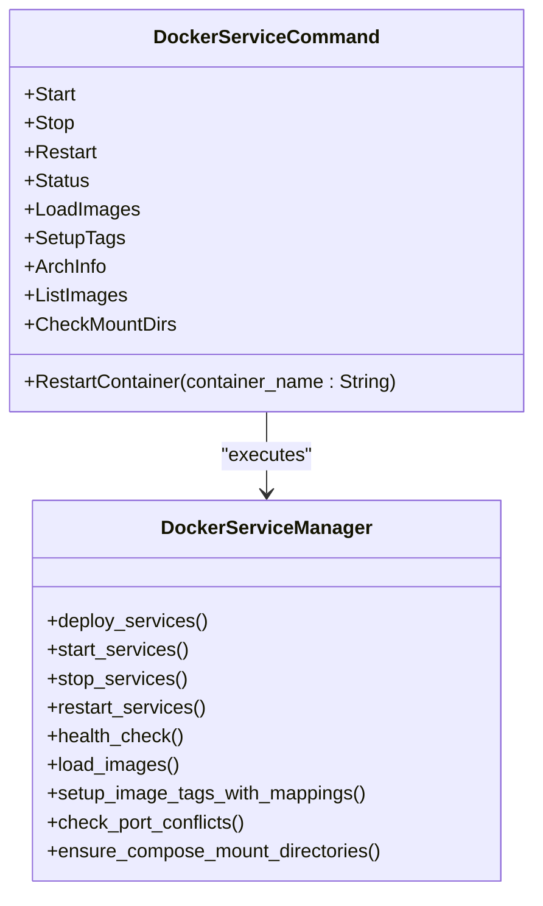

**Diagram sources**
- [docker_service.rs](file://nuwax-cli/src/commands/docker_service.rs#L1-L536)
- [manager.rs](file://nuwax-cli/src/docker_service/manager.rs#L1-L888)

**Section sources**
- [docker_service.rs](file://nuwax-cli/src/commands/docker_service.rs#L1-L536)

## Architecture Detection and Integration

The `docker_service` command includes robust architecture detection capabilities that ensure proper image loading and deployment based on the host system's architecture.

### Architecture Detection

The system automatically detects the host architecture (amd64 or arm64) and adjusts the deployment process accordingly:

```rust
pub fn get_system_architecture() -> Architecture {
    detect_architecture()
}
```

This detection is used to:
- Select appropriate image files from the deployment package
- Apply correct image tags for the detected architecture
- Provide warnings when architecture mismatches are detected

### Integration with docker_service Module

The architecture information is integrated throughout the service management process:

1. **Image Loading**: The `ImageLoader` component uses architecture information to locate and load appropriate images
2. **Tag Management**: Image tags are set with architecture-specific suffixes (e.g., `latest-amd64`, `latest-arm64`)
3. **Error Detection**: The system detects and reports architecture mismatches that could prevent container startup

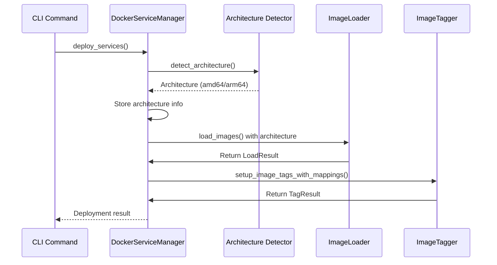

**Diagram sources**
- [mod.rs](file://nuwax-cli/src/docker_service/mod.rs#L1-L67)
- [manager.rs](file://nuwax-cli/src/docker_service/manager.rs#L1-L888)
- [docker-task.md](file://spec/docker-task.md#L1-L47)

**Section sources**
- [mod.rs](file://nuwax-cli/src/docker_service/mod.rs#L1-L67)
- [manager.rs](file://nuwax-cli/src/docker_service/manager.rs#L1-L888)

## Service Lifecycle Management

The `docker_service` command provides comprehensive control over the lifecycle of Docker services, from deployment to shutdown.

### Deployment Process

The complete deployment workflow is orchestrated through the `deploy_services` method:

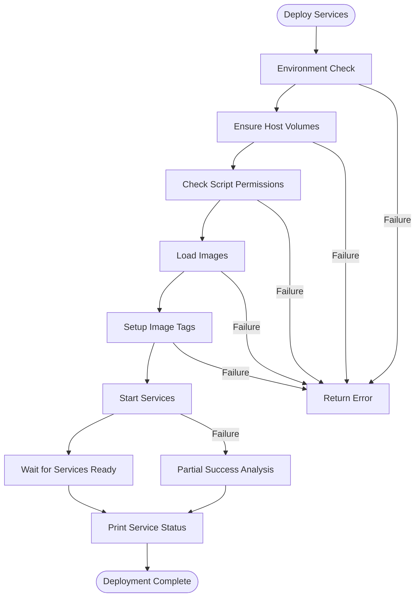

### Lifecycle Operations

#### Start Operation
The `start_services` method performs the following steps:
1. Checks and fixes script permissions
2. Verifies port availability
3. Executes Docker Compose startup
4. Waits for services to become ready
5. Reports final status

#### Stop Operation
The `stop_services` method:
1. Executes Docker Compose stop command
2. Waits for graceful shutdown
3. Reports completion status

#### Restart Operation
The `restart_services` method combines stop and start operations with a brief interval to ensure complete shutdown before restart.

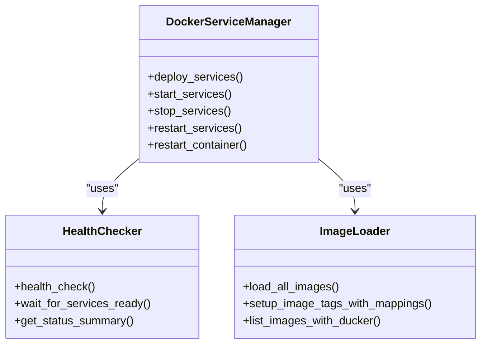

**Diagram sources**
- [manager.rs](file://nuwax-cli/src/docker_service/manager.rs#L1-L888)
- [client_core/src/container/service.rs](file://client-core/src/container/service.rs)

**Section sources**
- [manager.rs](file://nuwax-cli/src/docker_service/manager.rs#L1-L888)

## Multi-Container Service Management

The `docker_service` command is designed to manage multi-container services defined in docker-compose.yml files, providing comprehensive control over complex service stacks.

### docker-compose.yml Integration

The system reads and processes docker-compose.yml files to:
- Identify service dependencies and startup order
- Extract port mappings for conflict detection
- Determine volume mount points for directory creation
- Parse environment variables for configuration

### Dependency Management

The command handles service dependencies through Docker Compose's built-in dependency management, respecting the `depends_on` directives in the configuration file. The initialization sequence follows Docker Compose's default behavior, starting services in dependency order.

### Port Management

The `PortManager` component analyzes port mappings in docker-compose.yml and performs conflict detection:

```rust
async fn check_port_conflicts(&mut self) -> DockerServiceResult<()> {
    let compose_file = self
        .work_dir
        .join(client_core::constants::docker::COMPOSE_FILE_NAME);
    
    match self
        .port_manager
        .smart_check_compose_port_conflicts(&compose_file)
        .await
    {
        Ok(report) => {
            if report.has_conflicts {
                warn!("⚠️  Port conflicts detected");
                self.port_manager.print_smart_conflict_report(&report);
            }
        }
        Err(e) => {
            warn!("Port conflict check failed: {}", e);
        }
    }
    Ok(())
}
```

The system provides intelligent handling of port conflicts, warning users while allowing Docker's native port binding mechanisms to handle most conflicts automatically.

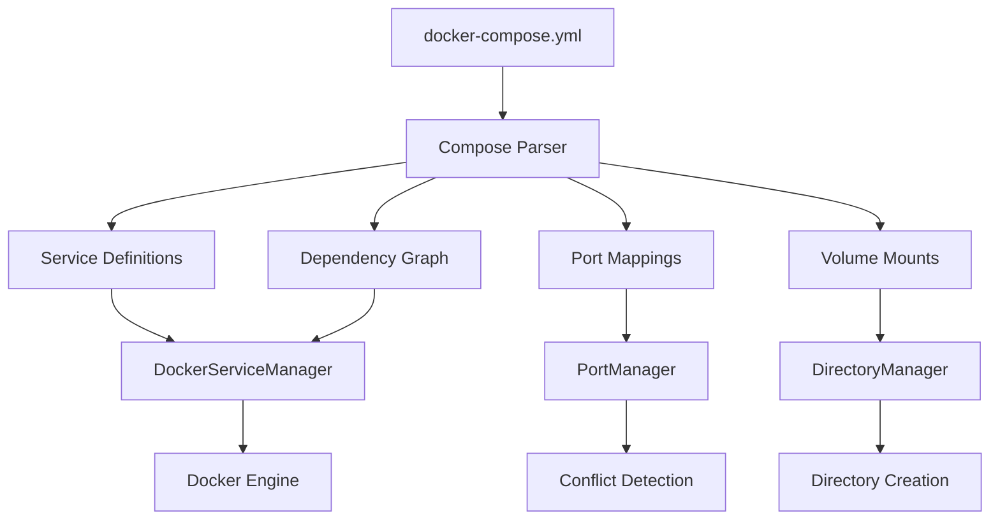

**Diagram sources**
- [manager.rs](file://nuwax-cli/src/docker_service/manager.rs#L1-L888)
- [docker-task.md](file://spec/docker-task.md#L1-L47)

**Section sources**
- [manager.rs](file://nuwax-cli/src/docker_service/manager.rs#L1-L888)

## Health Checks and Status Monitoring

The `docker_service` command includes comprehensive health checking and status monitoring capabilities to ensure service reliability.

### Health Check Implementation

The `HealthChecker` component performs regular health checks on all containers:

```rust
pub async fn health_check(&self) -> DockerServiceResult<HealthReport> {
    // Implementation details
}
```

The health check process:
1. Queries the Docker daemon for container status
2. Aggregates status information for all services
3. Identifies running, stopped, and failing containers
4. Generates a comprehensive health report

### Status Reporting

The `check_docker_services_status` command provides detailed status information:

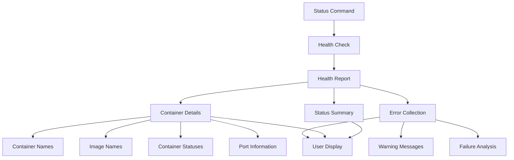

The status report includes:
- Overall system health status
- Count of running vs. total containers
- Detailed information for each container (name, image, status, ports)
- Error messages and failure analysis
- Access information for running services

### Wait for Services Ready

The `wait_for_services_ready` method implements a polling mechanism to wait for services to become fully operational:

```rust
async fn wait_for_services_ready(&self, check_interval: Duration) -> DockerServiceResult<HealthReport> {
    // Implementation details
}
```

This method continuously checks service status until all services are healthy or a timeout occurs.

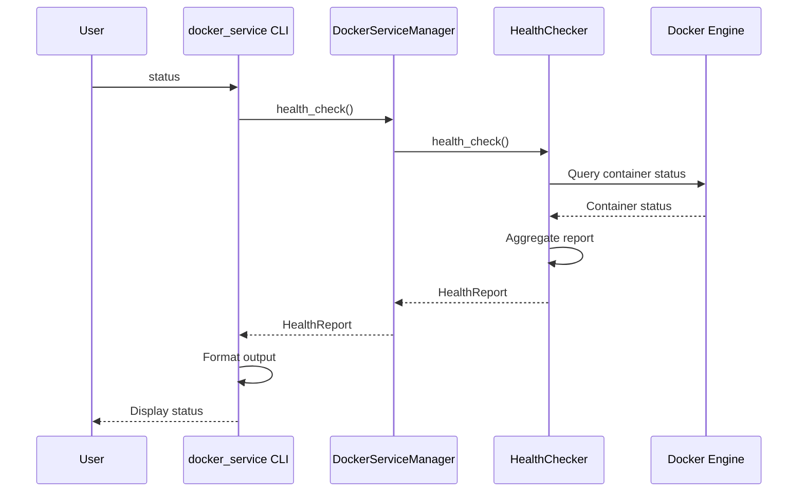

**Diagram sources**
- [manager.rs](file://nuwax-cli/src/docker_service/manager.rs#L1-L888)
- [docker_service.rs](file://nuwax-cli/src/commands/docker_service.rs#L1-L536)

**Section sources**
- [manager.rs](file://nuwax-cli/src/docker_service/manager.rs#L1-L888)

## Error Recovery and Restart Policies

The `docker_service` command implements robust error recovery mechanisms and restart policies to handle failed containers and ensure service availability.

### Error Recovery Mechanisms

The system employs several strategies for error recovery:

#### Partial Success Handling
When some containers fail to start but others succeed, the system:
1. Identifies running containers
2. Provides access information for available services
3. Offers troubleshooting suggestions for failed containers

```rust
match self
    .health_checker
    .wait_for_services_ready(check_interval)
    .await
{
    Ok(report) => {
        info!("All services started successfully!");
        self.print_service_status(&report).await;
    }
    Err(_) => {
        warn!("Service startup timed out or failed");
        if let Ok(report) = self.health_checker.health_check().await {
            self.print_service_status_with_failures(&report).await;
        }
    }
}
```

#### Automatic Permission Repair
The system automatically attempts to fix common permission issues:

```rust
async fn check_and_fix_mysql_if_failed(
    &self,
    report: &HealthReport,
) -> DockerServiceResult<()> {
    // Check for MySQL container issues
    // Attempt permission fixes
    // Return success or error
}
```

### Restart Policies

The command supports multiple restart policies:

#### Complete Restart
The `restart_services` method performs a full stop-start cycle:

```rust
pub async fn restart_services(&mut self) -> DockerServiceResult<()> {
    self.stop_services().await?;
    tokio::time::sleep(Duration::from_secs(timeout::RESTART_INTERVAL)).await;
    self.start_services().await
}
```

#### Individual Container Restart
The `restart_container` method allows restarting specific containers:

```rust
pub async fn restart_container(&self, container_name: &str) -> DockerServiceResult<()> {
    let result = self.docker_manager.restart_service(container_name).await;
    // Handle result
}
```

### Failure Analysis and Troubleshooting

The system provides detailed failure analysis with specific troubleshooting suggestions:

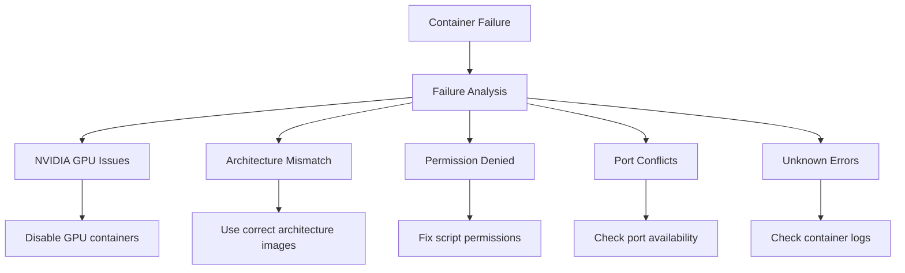

The error analysis includes specific recommendations based on the detected failure mode, helping users quickly resolve common issues.

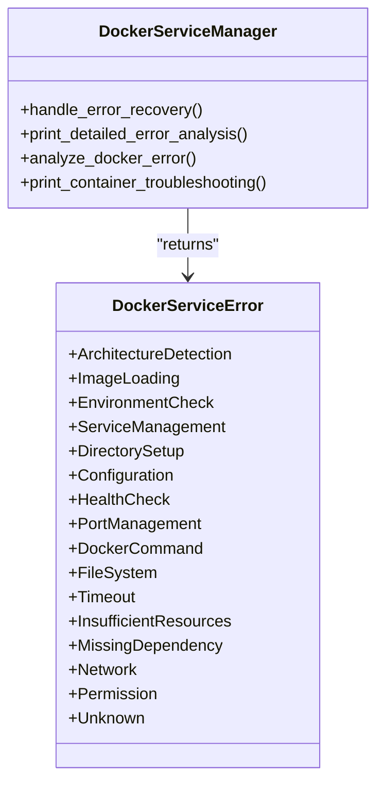

**Diagram sources**
- [manager.rs](file://nuwax-cli/src/docker_service/manager.rs#L1-L888)
- [docker_service.rs](file://nuwax-cli/src/commands/docker_service.rs#L1-L536)

**Section sources**
- [manager.rs](file://nuwax-cli/src/docker_service/manager.rs#L1-L888)

## Common Issues and Troubleshooting

The `docker_service` command addresses several common issues that may arise during Docker service management, providing built-in troubleshooting capabilities.

### Port Conflicts

**Symptoms**: Service startup fails with "port already allocated" errors.

**Detection**: The `PortManager` automatically checks for port conflicts in docker-compose.yml.

**Resolution**:
- The system provides warnings but allows Docker to handle most conflicts
- Users should check for conflicting processes on key ports (3306, 6379, etc.)
- Consider modifying port mappings in docker-compose.yml if conflicts persist

### Missing Images

**Symptoms**: Service startup fails with "image not found" errors.

**Detection**: The `ImageLoader` reports missing images during the loading phase.

**Resolution**:
- Ensure the deployment package contains the required images
- Run `nuwax-cli docker-service load-images` to load offline images
- Verify the image paths and filenames match the expected format

### Permission Denied Errors

**Symptoms**: Container startup fails with "Permission denied" errors, particularly for entrypoint scripts.

**Common Causes**:
- Missing execute permissions on startup scripts
- Directory permission issues for mounted volumes
- MySQL data directory permission problems

**Resolution**:
- Fix script permissions: `chmod +x config/docker-entrypoint.sh`
- The system automatically attempts to fix MySQL permission issues
- Ensure the user has appropriate permissions on the working directory

### Architecture Mismatch

**Symptoms**: Container fails to start with platform compatibility errors.

**Detection**: The system detects architecture mismatches (amd64 vs arm64) and provides specific warnings.

**Resolution**:
- Use architecture-appropriate images
- For arm64 systems, ensure arm64 versions of images are available
- Consider using the `--platform` flag for amd64 images on arm64 systems

### MySQL Startup Failures

**Symptoms**: MySQL container fails to start or restarts repeatedly.

**Common Causes**:
- Permission issues with data directories
- Corrupted data files
- Port conflicts on 3306

**Resolution**:
- The system automatically attempts to fix MySQL permissions on failure
- Clear corrupted data files if necessary
- Check for other MySQL instances using port 3306

```mermaid
flowchart TD
Issue[Common Issue] --> Port[Port Conflicts]
Issue --> Images[Missing Images]
Issue --> Permissions[Permission Errors]
Issue --> Architecture[Architecture Mismatch]
Issue --> MySQL[MySQL Failures]
Port --> Detection1[Automatic detection]
Port --> Resolution1[Check processes]
Port --> Resolution2[Modify port mappings]
Images --> Detection2[Image loader report]
Images --> Resolution3[Load images]
Images --> Resolution4[Verify paths]
Permissions --> Detection3[Error message analysis]
Permissions --> Resolution5[Fix script permissions]
Permissions --> Resolution6[Automatic fixes]
Architecture --> Detection4[Architecture detection]
Architecture --> Resolution7[Use correct images]
Architecture --> Resolution8[Platform flag]
MySQL --> Detection5[Container status]
MySQL --> Resolution9[Automatic permission fix]
MySQL --> Resolution10[Clear data files]
```

**Diagram sources**
- [manager.rs](file://nuwax-cli/src/docker_service/manager.rs#L1-L888)
- [docker_service.rs](file://nuwax-cli/src/commands/docker_service.rs#L1-L536)

**Section sources**
- [manager.rs](file://nuwax-cli/src/docker_service/manager.rs#L1-L888)

## Best Practices for Production

To ensure reliable and secure operation of Docker services in production environments, follow these best practices:

### Configuration Management

**Use Environment Variables**: Store configuration values in environment variables rather than hardcoding them in docker-compose.yml.

**Secure Sensitive Data**: Never store passwords or API keys in configuration files. Use Docker secrets or external configuration management systems.

**Version Control**: Keep docker-compose.yml and related configuration files under version control to track changes and enable rollback.

### Monitoring and Logging

**Enable Comprehensive Logging**: Ensure all containers have appropriate logging configured and logs are persisted to durable storage.

**Implement Health Checks**: Use Docker's health check mechanisms to monitor container health and enable automatic recovery.

**Centralized Monitoring**: Integrate with monitoring systems to track service availability, resource usage, and performance metrics.

### Security Practices

**Regular Updates**: Keep base images and application dependencies up to date to address security vulnerabilities.

**Minimal Images**: Use minimal base images to reduce the attack surface.

**User Separation**: Run containers with non-root users when possible to limit potential damage from security breaches.

### Performance Optimization

**Resource Limits**: Set appropriate CPU and memory limits for containers to prevent resource exhaustion.

**Volume Management**: Use named volumes for persistent data and avoid storing data in container layers.

**Network Optimization**: Use custom networks for inter-container communication to improve performance and security.

### Backup and Recovery

**Regular Backups**: Implement regular backup procedures for persistent data volumes.

**Disaster Recovery Plan**: Have a documented recovery plan for service outages or data loss.

**Test Restores**: Regularly test backup restoration procedures to ensure they work as expected.

### Deployment Strategies

**Blue-Green Deployments**: Use blue-green deployment patterns to minimize downtime during updates.

**Canary Releases**: Gradually roll out changes to a subset of users before full deployment.

**Rollback Procedures**: Have clear rollback procedures in place for failed deployments.

```mermaid
flowchart TD
Practices[Production Best Practices] --> Configuration[Configuration Management]
Practices --> Monitoring[Monitoring and Logging]
Practices --> Security[Security Practices]
Practices --> Performance[Performance Optimization]
Practices --> Backup[Backup and Recovery]
Practices --> Deployment[Deployment Strategies]
Configuration --> EnvVars[Use Environment Variables]
Configuration --> Secure[Secure Sensitive Data]
Configuration --> VersionControl[Version Control]
Monitoring --> Logging[Comprehensive Logging]
Monitoring --> HealthChecks[Health Checks]
Monitoring --> Centralized[Centralized Monitoring]
Security --> Updates[Regular Updates]
Security --> Minimal[Minimal Images]
Security --> UserSeparation[User Separation]
Performance --> Limits[Resource Limits]
Performance --> Volumes[Volume Management]
Performance --> Network[Network Optimization]
Backup --> Regular[Regular Backups]
Backup --> Plan[Disaster Recovery Plan]
Backup --> Test[Test Restores]
Deployment --> BlueGreen[Blue-Green Deployments]
Deployment --> Canary[Canary Releases]
Deployment --> Rollback[Rollback Procedures]
```

**Diagram sources**
- [docker-task.md](file://spec/docker-task.md#L1-L47)
- [manager.rs](file://nuwax-cli/src/docker_service/manager.rs#L1-L888)

**Section sources**
- [docker-task.md](file://spec/docker-task.md#L1-L47)
- [manager.rs](file://nuwax-cli/src/docker_service/manager.rs#L1-L888)