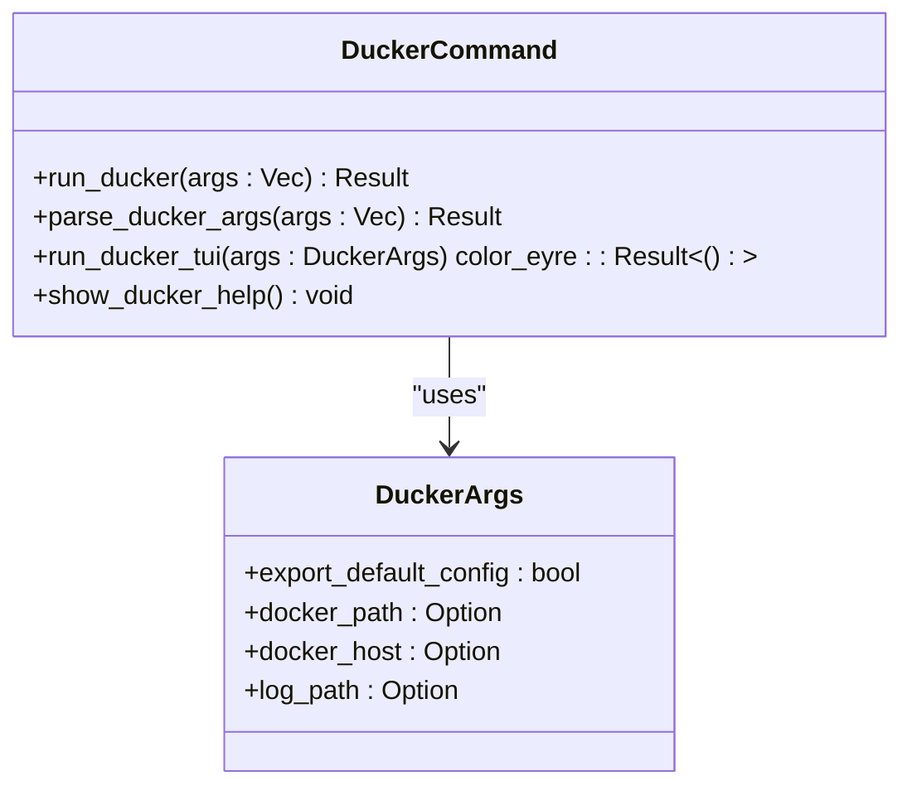
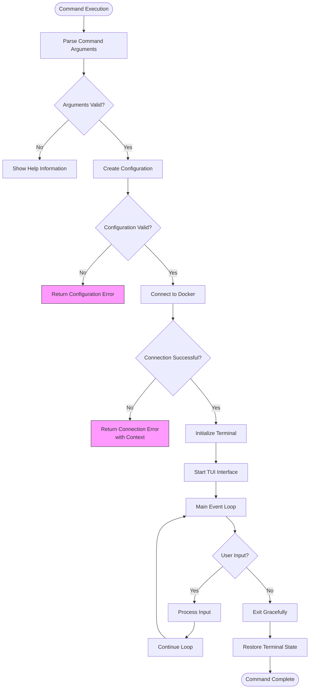

# ducker

<cite>
**Referenced Files in This Document**   
- [ducker.rs](file://nuwax-cli/src/commands/ducker.rs)
- [Cargo.toml](file://nuwax-cli/Cargo.toml)
- [client-core/Cargo.toml](file://client-core/Cargo.toml)
- [commandConfigs.ts](file://cli-ui/src/config/commandConfigs.ts)
</cite>

## Table of Contents
1. [Introduction](#introduction)
2. [Command Syntax and Options](#command-syntax-and-options)
3. [Architecture and Integration](#architecture-and-integration)
4. [Security and Isolation Features](#security-and-isolation-features)
5. [Usage Examples](#usage-examples)
6. [Troubleshooting Guide](#troubleshooting-guide)
7. [Performance Considerations](#performance-considerations)

## Introduction

The ducker command is an integrated Docker TUI (Text User Interface) tool within the Duck Client ecosystem, providing a comprehensive interface for Docker container management. Unlike direct Docker commands, ducker offers enhanced security, isolation, and user experience through its integration with the client-core's container management system. The command is directly embedded within the nuwax-cli application, eliminating the need for external installation while providing k9s-like TUI experience for Docker operations.

ducker serves as the primary interface for containerized operations, enabling users to manage containers, images, volumes, and networks through an intuitive terminal interface. It wraps Docker operations with additional validation, logging, and error handling layers, ensuring safer execution of container management tasks. The integration with the broader Duck Client system allows for consistent configuration management and enhanced security controls.

**Section sources**
- [ducker.rs](file://nuwax-cli/src/commands/ducker.rs#L1-L213)
- [commandConfigs.ts](file://cli-ui/src/config/commandConfigs.ts#L275-L320)

## Command Syntax and Options

The ducker command follows a standard CLI syntax with various options for configuring the execution environment and Docker connection parameters. The command is invoked through the nuwax-cli binary with the ducker subcommand.

### Command Syntax
```
nuwax-cli ducker [OPTIONS]
```

### Available Options

**Section sources**
- [ducker.rs](file://nuwax-cli/src/commands/ducker.rs#L168-L211)

#### Connection Configuration
- **-e, --export-default-config**: Exports default configuration to the configuration directory
- **-d, --docker-path <PATH>**: Specifies the Docker socket path for connecting to the Docker daemon
- **--docker-host <URL>**: Sets the Docker host URL (e.g., tcp://1.2.3.4:2375) for remote Docker connections
- **-l, --log-path <PATH>**: Specifies the path for log files generated during ducker operations

#### Help and Information
- **-h, --help**: Displays comprehensive help information about the ducker command and its available options

### Parameter Structure
The command options are encapsulated in the `DuckerArgs` struct, which contains the following fields:
- **export_default_config**: Boolean flag to export default configuration
- **docker_path**: Optional string specifying the Docker socket path
- **docker_host**: Optional string specifying the Docker host URL
- **log_path**: Optional PathBuf for specifying the log file path



**Diagram sources**
- [ducker.rs](file://nuwax-cli/src/commands/ducker.rs#L1-L30)

## Architecture and Integration

The ducker command is deeply integrated into the Duck Client architecture, serving as the primary interface for container management operations. It leverages the ducker crate as a dependency, which provides the core TUI functionality and Docker interaction capabilities.

### Integration Points

The ducker command integrates with multiple components of the Duck Client system:

**Section sources**
- [ducker.rs](file://nuwax-cli/src/commands/ducker.rs#L75-L115)
- [Cargo.toml](file://nuwax-cli/Cargo.toml#L50-L53)
- [client-core/Cargo.toml](file://client-core/Cargo.toml#L57-L58)

#### Core Dependencies
- **ducker crate**: The primary dependency providing TUI interface and Docker management capabilities
- **bollard**: Docker API client used alongside ducker for Docker operations
- **client-core**: Shared core library providing common utilities and configuration management

#### Container Management Integration
The ducker command is utilized by various components within the Duck Client system for container operations:

```mermaid
graph TD
DuckerCommand[ducker Command] --> DuckerCrate[ducker Crate]
DuckerCrate --> DockerAPI[Docker API via bollard]
ClientCore[client-core] --> DuckerCrate
ClientCore --> DockerManager[DockerManager]
DockerManager --> DuckerCrate : "uses for container status"
NuwaxCLI[nuwax-cli] --> DuckerCommand
NuwaxCLI --> ImageLoader[ImageLoader]
ImageLoader --> DuckerCrate : "uses for image operations"
NuwaxCLI --> PortManager[PortManager]
PortManager --> DuckerCrate : "uses for container operations"
NuwaxCLI --> DockerUtils[DockerUtils]
DockerUtils --> DuckerCrate : "uses for container operations"
CLIUI[CLI UI] --> NuwaxCLI
```

**Diagram sources**
- [ducker.rs](file://nuwax-cli/src/commands/ducker.rs#L75-L115)
- [client-core/src/container/service.rs](file://client-core/src/container/service.rs#L5)
- [nuwax-cli/src/docker_service/image_loader.rs](file://nuwax-cli/src/docker_service/image_loader.rs#L5)

### Configuration Validation
The ducker command implements a robust configuration validation process before establishing Docker connections:

1. **Parameter Parsing**: Command-line arguments are parsed into the `DuckerArgs` structure
2. **Configuration Creation**: A `Config` object is created with the parsed parameters
3. **Connection Validation**: The Docker connection is validated before TUI initialization
4. **Error Handling**: Comprehensive error handling with context for connection failures

The integration with client-core ensures consistent configuration management across the application, leveraging shared constants and utilities for Docker operations.

## Security and Isolation Features

The ducker command provides enhanced security and isolation compared to direct Docker commands through several mechanisms:

### Security Benefits

**Section sources**
- [ducker.rs](file://nuwax-cli/src/commands/ducker.rs#L75-L115)
- [client-core/Cargo.toml](file://client-core/Cargo.toml#L57-L58)

#### Isolation from Direct Docker Access
- **Wrapped Operations**: All Docker operations are wrapped with additional validation layers
- **Configuration Validation**: Parameters are validated before Docker connections are established
- **Error Context**: Enhanced error messages with context for troubleshooting

#### Enhanced Logging and Monitoring
- **Integrated Logging**: Uses the nuwax-cli logging system with structured logging
- **Operation Tracking**: All operations are logged with detailed context
- **Error Reporting**: Comprehensive error reporting with stack traces when enabled

#### Secure Connection Management
- **Socket Path Validation**: Docker socket paths are validated before use
- **Remote Connection Security**: Support for secure remote connections via Docker host URLs
- **Connection Context**: Failed connections include context for misconfiguration detection

The ducker command's integration with the client-core library ensures that security practices are consistent across the application, leveraging shared utilities for Docker operations and configuration management.

## Usage Examples

The ducker command can be used in various scenarios for container management and administrative tasks.

### Basic Usage

**Section sources**
- [ducker.rs](file://nuwax-cli/src/commands/ducker.rs#L168-L211)
- [commandConfigs.ts](file://cli-ui/src/config/commandConfigs.ts#L275-L320)

#### Launching the TUI Interface
```bash
nuwax-cli ducker
```
This command launches the ducker TUI interface with default settings, connecting to the local Docker daemon.

#### Connecting to a Remote Docker Host
```bash
nuwax-cli ducker --docker-host tcp://192.168.1.100:2375
```
This connects to a remote Docker daemon at the specified IP address and port.

#### Specifying Docker Socket Path
```bash
nuwax-cli ducker --docker-path /var/run/docker.sock
```
This explicitly sets the Docker socket path for the connection.

#### Exporting Default Configuration
```bash
nuwax-cli ducker --export-default-config
```
This exports the default configuration to the application's configuration directory.

### Interactive TUI Features

Once launched, the ducker TUI provides the following functionality:

**Keyboard Shortcuts**
- **j/↓**: Navigate down through the list
- **k/↑**: Navigate up through the list
- **Enter**: Select or view details of the current item
- **d**: Delete the selected item
- **l**: View logs for the selected container
- **q/Esc**: Exit the TUI interface
- **:**: Enter command mode

**Main Features**
- Container management (start, stop, delete, enter containers)
- Image management and cleanup
- Volume and network management
- Real-time log viewing
- Resource utilization monitoring

## Troubleshooting Guide

This section addresses common issues encountered when using the ducker command and provides solutions for container execution failures and resource allocation issues.

### Common Issues and Solutions

**Section sources**
- [ducker.rs](file://nuwax-cli/src/commands/ducker.rs#L90-L95)
- [ducker.rs](file://nuwax-cli/src/commands/ducker.rs#L100-L105)

#### Connection Failures
**Symptom**: "failed to create docker connection, potentially due to misconfiguration"
**Causes**:
- Docker daemon not running
- Incorrect Docker socket path
- Insufficient permissions to access Docker socket
- Remote Docker host unreachable

**Solutions**:
1. Verify Docker daemon is running: `systemctl status docker` (Linux) or check Docker Desktop (macOS/Windows)
2. Check Docker socket path permissions: `ls -la /var/run/docker.sock`
3. Ensure user is in the docker group: `sudo usermod -aG docker $USER`
4. For remote connections, verify network connectivity and firewall settings

#### Permission Issues
**Symptom**: "Permission denied" when accessing Docker socket
**Solution**: Add the user to the docker group and restart the session:
```bash
sudo usermod -aG docker $USER
# Then log out and log back in
```

#### Configuration Problems
**Symptom**: Unexpected behavior or connection failures
**Solution**: Export default configuration to ensure proper setup:
```bash
nuwax-cli ducker --export-default-config
```

### Error Handling Flow



**Diagram sources**
- [ducker.rs](file://nuwax-cli/src/commands/ducker.rs#L75-L115)

## Performance Considerations

When using the ducker command in CPU and memory-constrained environments, several performance considerations should be taken into account.

### Resource Usage Optimization

**Section sources**
- [ducker.rs](file://nuwax-cli/src/commands/ducker.rs#L115-L168)

#### Memory Management
- The ducker TUI loads container information on demand rather than pre-loading all data
- Terminal rendering is optimized to minimize memory usage
- Event loop efficiently manages memory for continuous operation

#### CPU Utilization
- The event loop uses non-blocking I/O operations to minimize CPU usage
- Polling intervals are optimized to balance responsiveness and resource usage
- Background operations are designed to be lightweight

### Recommendations for Constrained Environments
1. **Limit Container Information**: Use filtering options to reduce the amount of data displayed
2. **Reduce Update Frequency**: Adjust the refresh rate if the TUI supports configuration
3. **Close Unnecessary Panels**: Focus on specific container types to reduce resource usage
4. **Use Headless Operations**: For automation, consider using direct Docker commands instead of the TUI

The ducker command is designed to be efficient in resource usage, making it suitable for deployment on systems with limited computational resources while still providing a comprehensive container management interface.