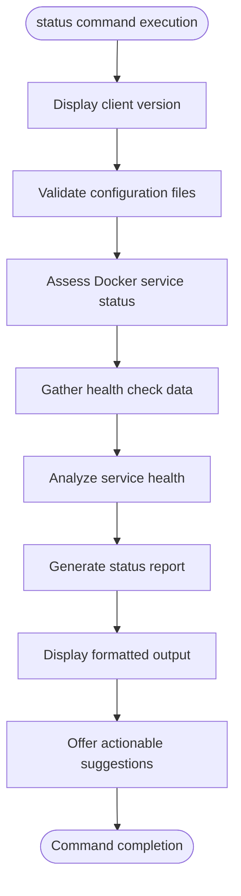
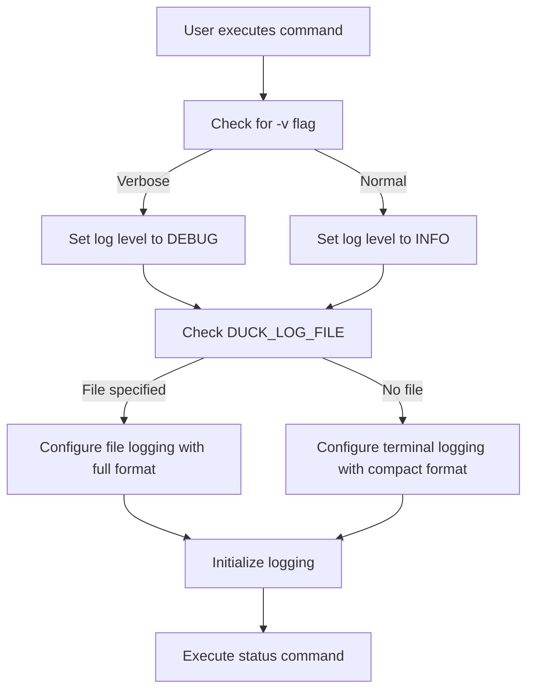
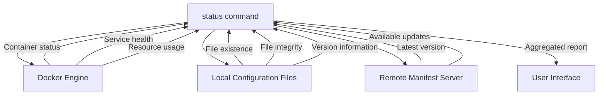
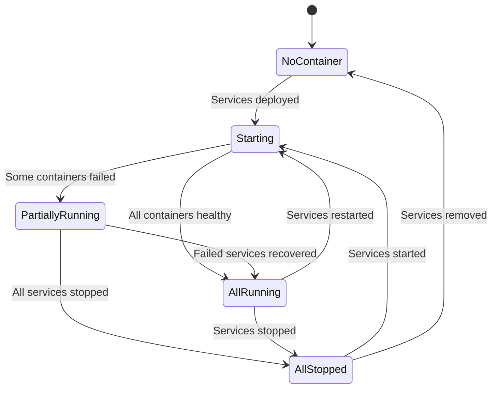
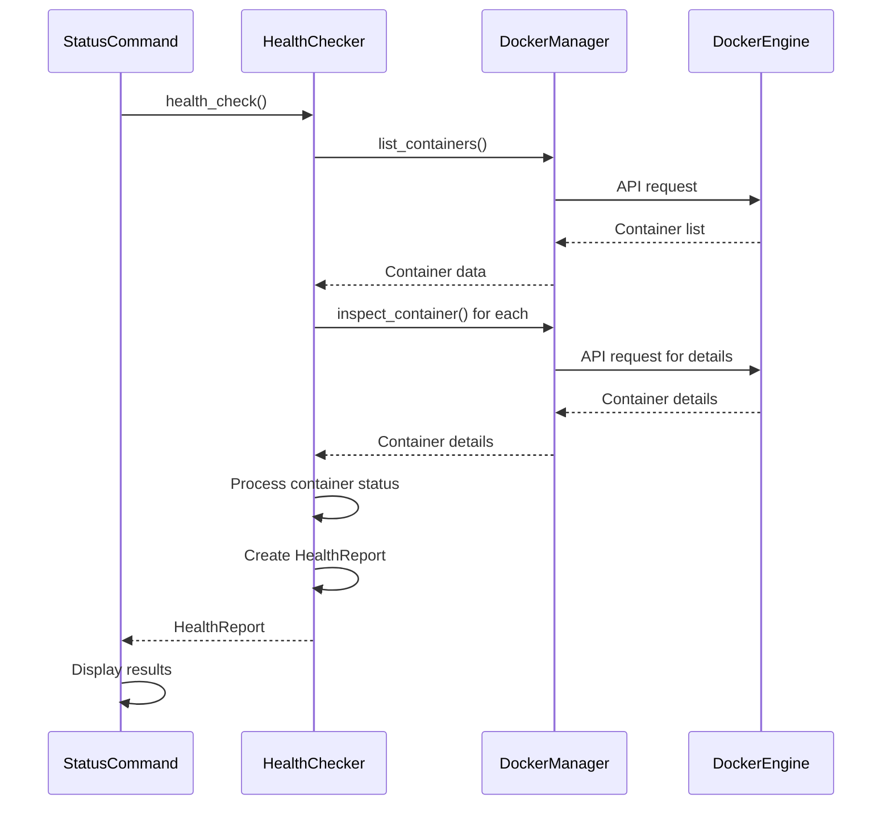
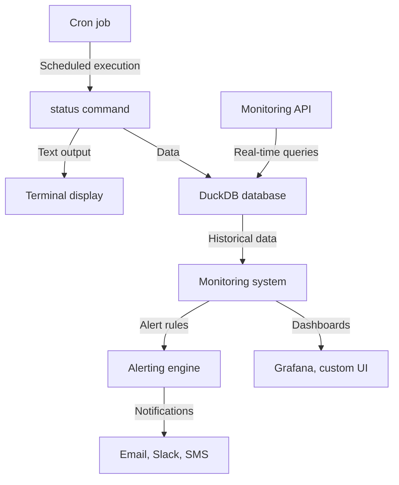
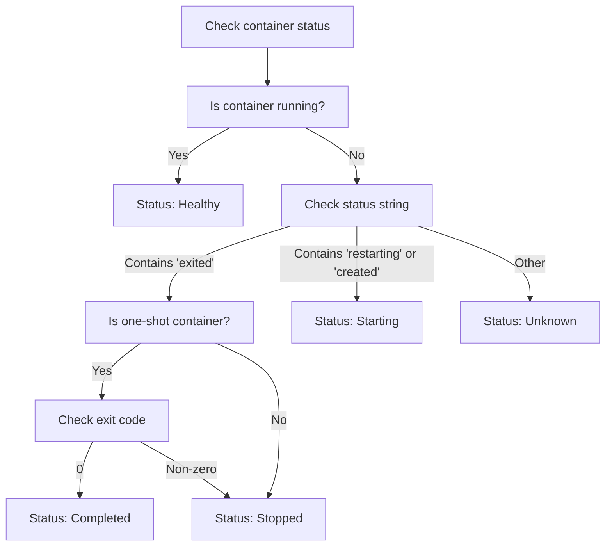

# status

<cite>
**Referenced Files in This Document**   
- [status.rs](file://nuwax-cli/src/commands/status.rs)
- [health_check.rs](file://nuwax-cli/src/docker_service/health_check.rs)
- [manager.rs](file://nuwax-cli/src/docker_service/manager.rs)
- [init_duckdb.sql](file://client-core/migrations/init_duckdb.sql)
- [docker-compose.yml](file://client-core/fixtures/docker-compose.yml)
</cite>

## Table of Contents
1. [Introduction](#introduction)
2. [Command Overview](#command-overview)
3. [Output Formats](#output-formats)
4. [Verbosity Levels](#verbosity-levels)
5. [Data Collection Sources](#data-collection-sources)
6. [Status Indicators](#status-indicators)
7. [Integration with Health Check Module](#integration-with-health-check-module)
8. [Monitoring and Alerting Integration](#monitoring-and-alerting-integration)
9. [False Positives and Mitigation](#false-positives-and-mitigation)
10. [Troubleshooting Common Issues](#troubleshooting-common-issues)

## Introduction
The **status** command provides comprehensive system and service health information for the Duck Client application. It serves as a central diagnostic tool that verifies the operational state of Docker services, checks system requirements, validates configuration files, and reports on overall system health. This documentation details the command's functionality, output formats, data sources, and integration points to enable effective system monitoring and troubleshooting.

## Command Overview
The **status** command delivers a comprehensive health assessment of the Duck Client system by collecting data from multiple sources and presenting it in a structured format. It evaluates version status, Docker connectivity, storage usage, network configuration, and service availability.

The command workflow begins with displaying client version information, followed by checking Docker service status, validating configuration files, and assessing system readiness. It then provides actionable suggestions based on the detected state, guiding users through initialization, deployment, or normal operation workflows.



**Diagram sources**
- [status.rs](file://nuwax-cli/src/commands/status.rs#L45-L138)

**Section sources**
- [status.rs](file://nuwax-cli/src/commands/status.rs#L45-L138)

## Output Formats
The **status** command supports multiple output formats to accommodate different use cases, from human-readable text to machine-parsable JSON. The primary output format is plain text, designed for direct consumption by users in terminal environments.

### Text Format
The text output is organized into logical sections with clear headings and status indicators. It includes:
- Client version information
- Docker service version
- Configuration file status
- Docker service health status
- Actionable suggestions

```text
🦆 Nuwax Client status
==================
📋 Basic Information:
   Client Version: v1.2.0
   Docker Service Version: v1.2.0
   Configuration File: config.toml
   Client UUID: 550e8400-e29b-41d4-a716-446655440000

📁 File Status:
   ✅ Docker Compose file: docker-compose.yml
   ✅ Service package file: /path/to/service-package.tar.gz

🐳 Docker Service Status:
   ✅ Services are running
```

### JSON Format Considerations
While the **status** command primarily outputs text, the codebase contains infrastructure for JSON output through the `output_backups_as_json` function in the backup module. This suggests that JSON output capability could be extended to the status command for integration with monitoring systems and GUI applications.

The JSON structure would likely include:
- Client information
- Service status details
- Container health data
- System checks
- Timestamp information

**Section sources**
- [status.rs](file://nuwax-cli/src/commands/status.rs#L45-L138)
- [backup.rs](file://nuwax-cli/src/commands/backup.rs#L951-L990)

## Verbosity Levels
The **status** command implements a verbosity system that controls the level of detail in its output. The verbosity is managed through the logging framework rather than explicit command-line flags for the status command itself.

### Logging Configuration
The verbosity is controlled by:
- **-v, --verbose flag**: Enables detailed logging mode (DEBUG level)
- **RUST_LOG environment variable**: Standard Rust logging level control
- **DUCK_LOG_FILE environment variable**: Redirects logs to a file

The logging system uses different formats based on the output destination:
- **Terminal output**: Compact format without timestamps, thread names, or line numbers
- **File output**: Full format with timestamps, thread names, and line numbers



**Diagram sources**
- [utils/mod.rs](file://nuwax-cli/src/utils/mod.rs#L68-L108)

**Section sources**
- [utils/mod.rs](file://nuwax-cli/src/utils/mod.rs#L68-L108)
- [status.rs](file://nuwax-cli/src/commands/status.rs#L45-L138)

## Data Collection Sources
The **status** command gathers information from multiple sources to provide a comprehensive system health assessment. This multi-source approach ensures accurate status reporting by cross-validating information from different system components.

### Primary Data Sources
The command collects data from three main sources:

#### 1. Docker Engine
The command interacts directly with the Docker Engine through the DockerManager to:
- List running containers
- Check container status and health
- Verify Docker service availability
- Retrieve container metadata

#### 2. Local Configuration
Local configuration files are validated to ensure system integrity:
- **docker-compose.yml**: Main service configuration
- **.env file**: Environment variables
- **config.toml**: Application configuration
- Service package files in the download directory

#### 3. Remote Manifest Server
The system checks for version consistency between:
- Client version (embedded in binary)
- Docker service version (from configuration)
- Latest available version (from remote manifest)



**Diagram sources**
- [status.rs](file://nuwax-cli/src/commands/status.rs#L45-L138)
- [health_check.rs](file://nuwax-cli/src/docker_service/health_check.rs#L1-L400)
- [init_duckdb.sql](file://client-core/migrations/init_duckdb.sql#L102-L125)

**Section sources**
- [status.rs](file://nuwax-cli/src/commands/status.rs#L45-L138)
- [health_check.rs](file://nuwax-cli/src/docker_service/health_check.rs#L1-L400)
- [init_duckdb.sql](file://client-core/migrations/init_duckdb.sql#L102-L125)

## Status Indicators
The **status** command uses a comprehensive system of status indicators to communicate the health and operational state of services and system components. These indicators provide immediate visual feedback about the system state.

### Service Status Levels
The system defines several service status levels, each with specific implications:

| Status Indicator | Meaning | Implications |
|------------------|-------|-------------|
| **OK (AllRunning)** | All services are running and healthy | System is fully operational |
| **WARNING (PartiallyRunning)** | Some services are running, others are not | Partial functionality available |
| **ERROR (AllStopped)** | No services are running | System is completely down |
| **STARTING** | Services are in the process of starting | System is initializing |
| **UNKNOWN** | Service status cannot be determined | Connectivity or permission issues |
| **NoContainer** | No containers found | Services not deployed or initialized |

### Container Status Types
Individual containers can have the following status types:

- **Running**: Container is actively running
- **Stopped**: Container has stopped (failure for persistent services)
- **Starting**: Container is in the process of starting
- **Completed**: One-time task has completed successfully
- **Unknown**: Container status cannot be determined

The health status is determined by the `is_healthy()` method, which considers both Running and Completed states as healthy for their respective service types.



**Diagram sources**
- [health_check.rs](file://nuwax-cli/src/docker_service/health_check.rs#L226-L277)
- [manager.rs](file://nuwax-cli/src/docker_service/manager.rs#L476-L519)

**Section sources**
- [health_check.rs](file://nuwax-cli/src/docker_service/health_check.rs#L226-L277)
- [manager.rs](file://nuwax-cli/src/docker_service/manager.rs#L476-L519)

## Integration with Health Check Module
The **status** command is tightly integrated with the health_check module to provide accurate service availability verification. This integration enables comprehensive health assessment by combining Docker container status with application-level health checks.

### Health Check Workflow
The health check process follows these steps:

1. **Container Discovery**: List all containers from the Docker Engine
2. **Status Assessment**: Determine the operational state of each container
3. **Health Verification**: Check application-level health endpoints when available
4. **Report Generation**: Compile results into a HealthReport object
5. **Status Finalization**: Calculate overall service status

The HealthChecker class orchestrates this process, using the DockerManager to interact with the Docker API and collect container information.



The HealthReport structure contains detailed information about each container, including name, status, image, ports, and health status. It also maintains counters for different container states and collects any errors encountered during the health check process.

**Diagram sources**
- [health_check.rs](file://nuwax-cli/src/docker_service/health_check.rs#L279-L321)
- [status.rs](file://nuwax-cli/src/commands/status.rs#L120-L138)

**Section sources**
- [health_check.rs](file://nuwax-cli/src/docker_service/health_check.rs#L279-L321)
- [status.rs](file://nuwax-cli/src/commands/status.rs#L120-L138)

## Monitoring and Alerting Integration
The **status** command output can be integrated into monitoring and alerting systems to provide continuous system health oversight. The structured output format and consistent status indicators enable reliable automation and alerting.

### Database Integration
The system stores health check results in DuckDB database tables for historical analysis and monitoring:

- **system_checks table**: Records system-level checks (storage space, Docker status, network, permissions)
- **service_status_history table**: Stores time-series data of service status
- **current_service_status table**: Maintains real-time service status for quick access

These tables allow for trend analysis, anomaly detection, and historical reporting on system health.

### Alerting Strategies
The status output can be used to implement various alerting strategies:

- **Health-based alerts**: Trigger when service status is not "AllRunning"
- **Degraded service alerts**: Notify when status is "PartiallyRunning"
- **Service down alerts**: Critical alert when status is "AllStopped"
- **Startup timeout alerts**: Warn if "Starting" status persists beyond expected time

The JSON output capability (available in related commands) suggests potential for integration with external monitoring tools like Prometheus, Grafana, or custom alerting systems.



**Diagram sources**
- [init_duckdb.sql](file://client-core/migrations/init_duckdb.sql#L102-L125)
- [status.rs](file://nuwax-cli/src/commands/status.rs#L45-L138)

**Section sources**
- [init_duckdb.sql](file://client-core/migrations/init_duckdb.sql#L102-L125)
- [status.rs](file://nuwax-cli/src/commands/status.rs#L45-L138)

## False Positives and Mitigation
The health detection system includes several mechanisms to minimize false positives and provide accurate status reporting. These mitigations address common scenarios where services might appear unhealthy during normal operations.

### Transition State Handling
The system distinguishes between transient and persistent failure states:

- **Starting state**: Containers in "created" or "restarting" state are marked as transitioning
- **Grace periods**: New containers are given time to initialize before being marked as failed
- **Retry logic**: Health checks are performed multiple times before reporting failure

The `is_transitioning()` method identifies containers that are in the process of starting, preventing premature failure reports.

### One-time Task Recognition
The system differentiates between persistent services and one-time tasks (oneshot containers):

- **Restart policy analysis**: Containers with "no" restart policy are treated as one-time tasks
- **Exit code interpretation**: One-time tasks with exit code 0 are considered successful
- **Persistent service protection**: Persistent services that stop are always considered failed

This distinction prevents false alarms when initialization containers complete their work and stop normally.

### Architecture-aware Diagnostics
The system provides specific troubleshooting advice for common issues:

- **Architecture mismatches**: Detects amd64 images on arm64 systems
- **GPU requirements**: Identifies containers requiring NVIDIA GPU support
- **Dependency issues**: Checks for required services and configurations

These diagnostics help users distinguish between actual failures and configuration issues that require manual intervention.



**Diagram sources**
- [health_check.rs](file://nuwax-cli/src/docker_service/health_check.rs#L113-L151)
- [manager.rs](file://nuwax-cli/src/docker_service/manager.rs#L625-L674)

**Section sources**
- [health_check.rs](file://nuwax-cli/src/docker_service/health_check.rs#L113-L151)
- [manager.rs](file://nuwax-cli/src/docker_service/manager.rs#L625-L674)

## Troubleshooting Common Issues
This section provides guidance for interpreting status output to diagnose and resolve common issues encountered with the Duck Client system.

### Missing Configuration Files
When the status command reports missing configuration files:

```text
❌ Docker Compose file: docker-compose.yml (does not exist)
❌ Service package file: /path/to/service-package.tar.gz (does not exist)
```

**Solution**: Execute the upgrade and deployment workflow:
```bash
nuwax-cli upgrade                  # Download Docker service package
nuwax-cli docker-service deploy    # Deploy and start services
```

### Docker Service Not Running
When Docker services are not running:

```text
❌ Services are not running
💡 Suggestions:
   - Check if Docker is installed and running
   - Verify docker-compose is available
   - Use 'docker-compose ps' to manually check status
```

**Solution**: Verify Docker installation and start the Docker service on your system.

### Partial Service Failures
When some services fail to start:

```text
❌ Failed containers:
   • video-analysis-worker - Stopped (image: registry/video-worker:latest)
💡 Troubleshooting:
   - This container requires NVIDIA GPU support
   - Architecture mismatch detected (amd64 image on arm64 system)
```

**Solution**: For ARM64 systems (like Apple Silicon Macs), either:
1. Use ARM64 versions of the images
2. Disable the video-analysis-worker service in docker-compose.yml
3. Comment out the service in the configuration file

### Storage Space Issues
The system periodically checks storage space and reports warnings when capacity is low. Monitor the system_checks table for STORAGE_SPACE entries with status WARNING or FAIL.

**Solution**: Free up disk space or configure the system to use a different storage location.

### Network Configuration Problems
Network issues are detected through the system_checks table with check_type NETWORK. Common issues include:
- Port conflicts
- Firewall restrictions
- Network connectivity problems

Check the message field in the system_checks table for specific error details and recommendations.

**Section sources**
- [status.rs](file://nuwax-cli/src/commands/status.rs#L45-L138)
- [health_check.rs](file://nuwax-cli/src/docker_service/health_check.rs#L1-L400)
- [manager.rs](file://nuwax-cli/src/docker_service/manager.rs#L476-L674)
- [init_duckdb.sql](file://client-core/migrations/init_duckdb.sql#L102-L125)
- [docker-compose.yml](file://client-core/fixtures/docker-compose.yml#L325-L347)