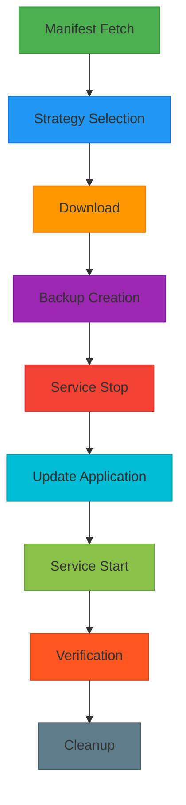
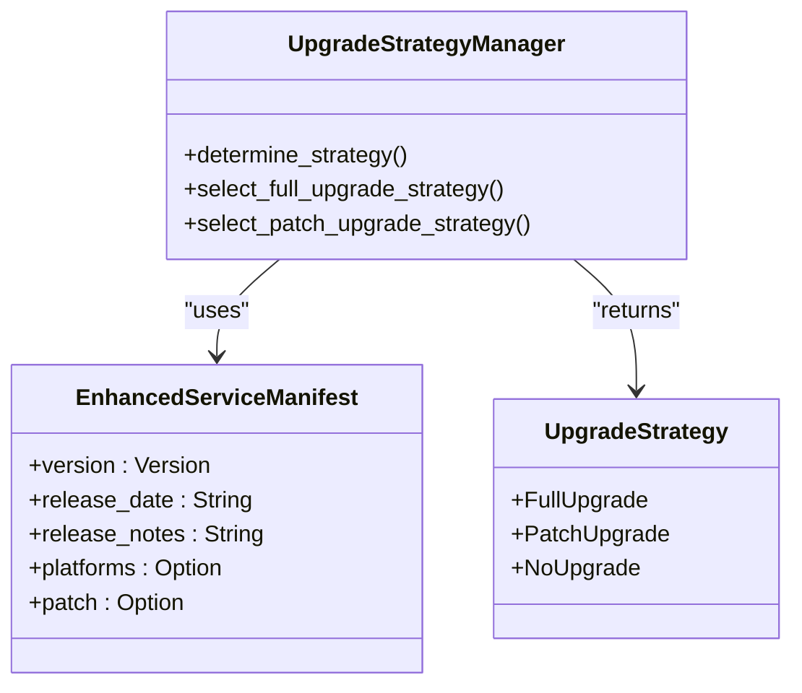
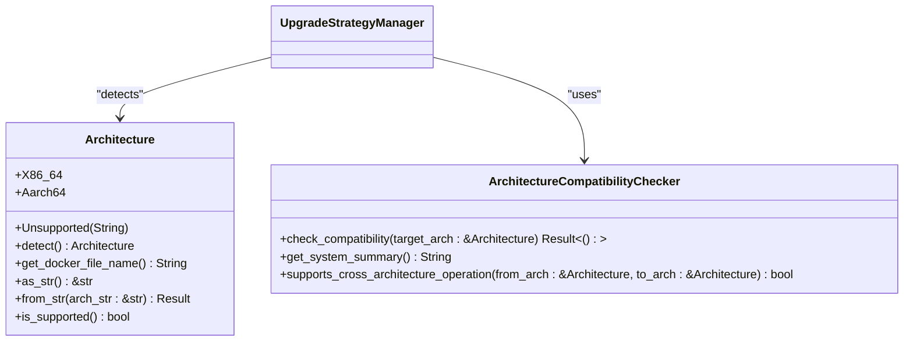
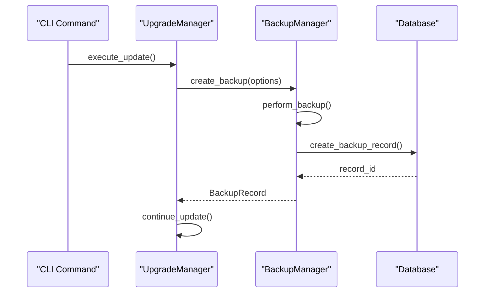
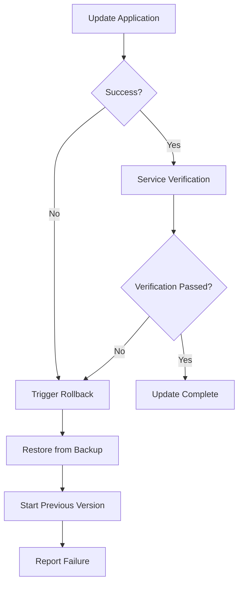

# update

<cite>
**Referenced Files in This Document**   
- [update.rs](file://nuwax-cli/src/commands/update.rs#L1-L162)
- [upgrade.rs](file://client-core/src/upgrade.rs#L1-L90)
- [upgrade_strategy.rs](file://client-core/src/upgrade_strategy.rs#L1-L462)
- [api_types.rs](file://client-core/src/api_types.rs#L1-L902)
- [architecture.rs](file://client-core/src/architecture.rs#L1-L451)
- [backup.rs](file://client-core/src/backup.rs#L1-L624)
</cite>

## Table of Contents
1. [Introduction](#introduction)
2. [Command Options](#command-options)
3. [Execution Flow](#execution-flow)
4. [Upgrade Strategies](#upgrade-strategies)
5. [Architecture Support](#architecture-support)
6. [Backup and Rollback](#backup-and-rollback)
7. [Patch Executor Integration](#patch-executor-integration)
8. [Failure Modes and Recovery](#failure-modes-and-recovery)
9. [Best Practices](#best-practices)
10. [Examples](#examples)

## Introduction
The `update` command is the central interface for executing service upgrades in the duck_client system. It supports both full and incremental update methods, enabling efficient service version upgrades while maintaining system stability. The command orchestrates a comprehensive workflow including manifest fetching, strategy selection, download, backup, application, and verification. It integrates with core modules such as upgrade_strategy and patch_executor to provide intelligent upgrade decisions and reliable patch application.

**Section sources**
- [update.rs](file://nuwax-cli/src/commands/update.rs#L1-L162)

## Command Options
The update command provides several options to control update behavior:

- `--dry-run`: Simulates the update process without making any changes, useful for testing upgrade strategies
- `--no-backup`: Skips the backup creation step, reducing downtime but increasing risk
- `--arch`: Overrides the detected system architecture to specify x86_64 or aarch64
- `--force`: Forces a full upgrade even when an incremental upgrade is available
- `--check`: Checks for available updates without downloading or applying them

These options allow administrators to customize the update process based on their specific requirements, network conditions, and risk tolerance.

**Section sources**
- [update.rs](file://nuwax-cli/src/commands/update.rs#L1-L162)
- [upgrade.rs](file://client-core/src/upgrade.rs#L1-L90)

## Execution Flow
The update command follows a structured execution flow to ensure reliable upgrades:



**Diagram sources**
- [upgrade.rs](file://client-core/src/upgrade.rs#L1-L90)
- [update.rs](file://nuwax-cli/src/commands/update.rs#L1-L162)

**Section sources**
- [upgrade.rs](file://client-core/src/upgrade.rs#L1-L90)
- [update.rs](file://nuwax-cli/src/commands/update.rs#L1-L162)

## Upgrade Strategies
The system implements intelligent upgrade strategy selection through the UpgradeStrategyManager. Two primary strategies are supported:

### Full Upgrade Strategy
The FullUpgrade strategy downloads and applies a complete service package. This is used when:
- The base version has changed (e.g., from 0.0.12 to 0.0.13)
- The `--force` flag is specified
- The target architecture lacks incremental patch support
- The docker directory or compose file is missing



**Diagram sources**
- [upgrade_strategy.rs](file://client-core/src/upgrade_strategy.rs#L1-L462)
- [api_types.rs](file://client-core/src/api_types.rs#L1-L902)

**Section sources**
- [upgrade_strategy.rs](file://client-core/src/upgrade_strategy.rs#L1-L462)

### Patch Upgrade Strategy
The PatchUpgrade strategy applies incremental updates, saving bandwidth and reducing downtime. This is selected when:
- The current version and target version share the same base version (e.g., 0.0.13 → 0.0.13.2)
- The target architecture has a patch package available
- The `--force` flag is not specified

The patch contains operations for file replacement and deletion, specified in the PatchOperations structure.

## Architecture Support
The system provides comprehensive architecture detection and support through the Architecture module. Supported architectures include:

- **X86_64**: Intel/AMD 64-bit processors
- **Aarch64**: ARM 64-bit processors



**Diagram sources**
- [architecture.rs](file://client-core/src/architecture.rs#L1-L451)

**Section sources**
- [architecture.rs](file://client-core/src/architecture.rs#L1-L451)

The Architecture::detect() method automatically identifies the current system architecture using std::env::consts::ARCH. The system supports multiple string representations for each architecture (e.g., "x86_64", "amd64", "x64" for X86_64; "aarch64", "arm64", "armv8" for Aarch64).

## Backup and Rollback
The update process integrates with the BackupManager to ensure data safety during upgrades. Before any update is applied, a backup is created containing critical service data.

### Backup Process


**Diagram sources**
- [backup.rs](file://client-core/src/backup.rs#L1-L624)
- [upgrade.rs](file://client-core/src/upgrade.rs#L1-L90)

**Section sources**
- [backup.rs](file://client-core/src/backup.rs#L1-L624)

The backup includes:
- Configuration files
- Data directories
- Service state information

### Rollback Procedure
If an update fails, the system can rollback to the previous state using the pre-update backup. The rollback process:
1. Stops the current (failed) service
2. Restores the backup using perform_restore()
3. Updates the database with the restored state
4. Starts the service with the previous version

The BackupManager provides methods like restore_data_from_backup_with_exculde() to selectively restore data while preserving certain directories.

## Patch Executor Integration
The update command integrates with the patch_executor module to apply incremental updates. When a PatchUpgrade strategy is selected, the patch_executor processes the patch operations defined in the PatchPackageInfo.

The PatchExecutor handles:
- File replacement operations
- Directory replacement operations
- File deletion operations
- Directory deletion operations

Each operation is validated for security before execution, preventing access to system-critical paths. The executor processes operations in a transactional manner, ensuring that either all operations succeed or the system remains in its original state.

**Section sources**
- [upgrade_strategy.rs](file://client-core/src/upgrade_strategy.rs#L1-L462)
- [api_types.rs](file://client-core/src/api_types.rs#L1-L902)

## Failure Modes and Recovery
The system addresses several common failure modes:

### Interrupted Downloads
The download mechanism supports resumable downloads. If a download is interrupted, subsequent update attempts will resume from the partial download rather than starting over. The FileDownloader validates the integrity of partial downloads before resuming.

### Signature Verification Failures
Before applying any update, the system verifies the digital signature of the downloaded package. If signature verification fails, the update is aborted and the system logs the security violation. This prevents the installation of tampered or corrupted packages.

### Post-Update Initialization Errors
After applying an update, the system performs verification checks. If the service fails to start or initialize properly, the system automatically triggers the rollback procedure. The UpgradeResult structure captures error details for troubleshooting.



**Diagram sources**
- [upgrade.rs](file://client-core/src/upgrade.rs#L1-L90)

**Section sources**
- [upgrade.rs](file://client-core/src/upgrade.rs#L1-L90)

## Best Practices
To ensure successful updates, follow these best practices:

1. **Schedule During Maintenance Windows**: Perform updates during periods of low activity to minimize impact on users.

2. **Verify Backup Space**: Ensure sufficient disk space is available for backups before initiating updates.

3. **Test in Staging**: Use the `--dry-run` option to test upgrade strategies in non-production environments.

4. **Monitor Network Conditions**: For large patch downloads, ensure stable network connectivity.

5. **Keep Recovery Options Available**: Maintain access to previous version packages for emergency rollback.

6. **Review Release Notes**: Examine the release_notes field in the EnhancedServiceManifest before applying updates.

## Examples
### Zero-Downtime Update
```bash
# Check for available updates
duck-cli update --check

# Download the update without applying it
duck-cli update --download-only

# Apply the update during a maintenance window
duck-cli update --no-backup
```

### Handling Large Patch Downloads
```bash
# Create a dedicated download directory with sufficient space
mkdir -p /opt/duck/downloads

# Download a large patch with progress monitoring
duck-cli update --download-dir /opt/duck/downloads
```

**Section sources**
- [update.rs](file://nuwax-cli/src/commands/update.rs#L1-L162)