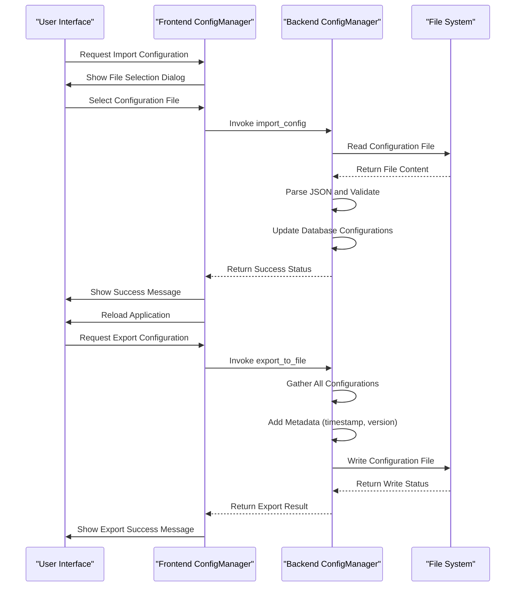
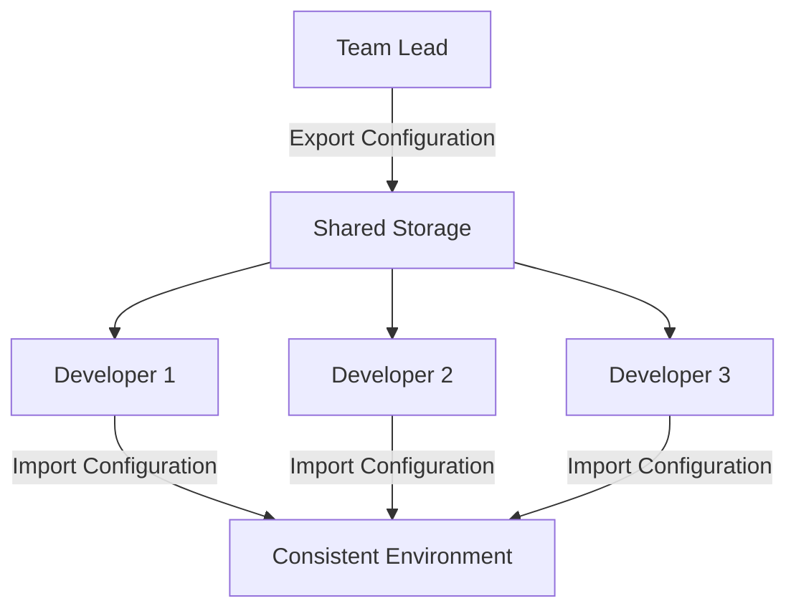

# Configuration Import and Export

<cite>
**Referenced Files in This Document**   
- [config_manager.rs](file://client-core/src/config_manager.rs#L0-L799)
- [tauri.ts](file://cli-ui/src/utils/tauri.ts#L434-L501)
- [cli-ui.md](file://spec/cli-ui.md#L2400-L3199)
</cite>

## Table of Contents
1. [Configuration Import and Export](#configuration-import-and-export)
2. [ConfigManager Implementation](#configmanager-implementation)
3. [CLI Command Integration](#cli-command-integration)
4. [Use Cases](#use-cases)
5. [Security Considerations](#security-considerations)

## ConfigManager Implementation

The ConfigManager class provides configuration management functionality with support for import and export operations. The implementation is split between frontend and backend components.

### Frontend Configuration Management

The frontend ConfigManager handles JSON-based configuration files and user interface interactions:

```typescript
export class ConfigManager {
  private static readonly CONFIG_DIR = 'duck-client';
  private static readonly CONFIG_FILE = 'config.json';

  /**
   * Read configuration from file
   */
  static async loadConfig(): Promise<any> {
    try {
      const configPath = this.getConfigPath();
      const content = await FileSystemManager.readTextFile(configPath);
      return content ? JSON.parse(content) : {};
    } catch (error) {
      console.error('Load config failed:', error);
      return {};
    }
  }

  /**
   * Save configuration to file
   */
  static async saveConfig(config: any): Promise<boolean> {
    try {
      const configPath = this.getConfigPath();
      
      // Ensure config directory exists
      await FileSystemManager.createDirectory(this.CONFIG_DIR);
      
      const content = JSON.stringify(config, null, 2);
      return await FileSystemManager.writeTextFile(configPath, content);
    } catch (error) {
      console.error('Save config failed:', error);
      return false;
    }
  }

  /**
   * Import configuration from file
   */
  static async importConfig(): Promise<void> {
    try {
      const selectedFile = await open({
        title: 'Import Configuration File',
        filters: [
          { name: 'JSON Files', extensions: ['json'] },
          { name: 'All Files', extensions: ['*'] }
        ]
      });

      if (selectedFile) {
        const result = await invoke<string | null>('import_config');
        if (result) {
          await message(`Configuration imported from:\n${result}`, { 
            title: 'Import Successful', 
            kind: 'info' 
          });
          
          // Reload application configuration
          window.location.reload();
        }
      }
    } catch (error) {
      console.error('Import configuration failed:', error);
      await message(`Import configuration failed: ${error}`, { 
        title: 'Error', 
        kind: 'error' 
      });
    }
  }
}
```

### Backend Configuration Management

The backend ConfigManager provides a comprehensive configuration system with type safety and database persistence:

```rust
pub struct ConfigManager {
    db: DatabaseConnection,
    /// Memory cache: key -> ConfigItem
    cache: Arc<RwLock<HashMap<String, ConfigItem>>>,
    /// Whether cache has been initialized
    cache_initialized: Arc<RwLock<bool>>,
}

impl ConfigManager {
    /// Initialize cache (load all configurations from database)
    pub async fn initialize_cache(&self) -> Result<()> {
        debug!("Initializing configuration cache...");

        let configs = match &self.db {
            DatabaseConnection::DatabaseManager(db) => {
                db.read_with_retry(|conn| {
                    let mut stmt = conn.prepare(
                        "SELECT config_key, config_value, config_type, category, description,
                                is_system_config, is_user_editable, validation_rule, default_value
                         FROM app_config",
                    )?;

                    let config_iter = stmt.query_map([], |row| {
                        let key: String = row.get(0)?;
                        let value_str: String = row.get(1)?;
                        let type_str: String = row.get(2)?;
                        let category: String = row.get(3)?;
                        let description: Option<String> = row.get(4)?;
                        let is_system: bool = row.get(5)?;
                        let is_editable: bool = row.get(6)?;
                        let validation: Option<String> = row.get(7)?;
                        let default_str: Option<String> = row.get(8)?;

                        // Parse JSON value
                        let value: Value = serde_json::from_str(&value_str).map_err(|e| {
                            duckdb::Error::InvalidParameterName(format!("JSON parsing failed: {e}"))
                        })?;

                        let default_value = if let Some(default_str) = default_str {
                            Some(serde_json::from_str(&default_str).map_err(|e| {
                                duckdb::Error::InvalidParameterName(format!(
                                    "Default value JSON parsing failed: {e}"
                                ))
                            })?)
                        } else {
                            None
                        };

                        let config_type = ConfigType::from_str(&type_str).ok_or_else(|| {
                            duckdb::Error::InvalidParameterName(format!(
                                "Invalid configuration type: {type_str}"
                            ))
                        })?;

                        Ok(ConfigItem {
                            key: key.clone(),
                            value,
                            config_type,
                            category,
                            description,
                            is_system_config: is_system,
                            is_user_editable: is_editable,
                            validation_rule: validation,
                            default_value,
                        })
                    })?;

                    let mut configs = Vec::new();
                    for config in config_iter {
                        configs.push(config?);
                    }
                    Ok(configs)
                })
                .await?
            }
            DatabaseConnection::Database(_db) => {
                warn!("Traditional database connection does not support configuration management");
                Vec::new()
            }
        };

        // Update cache
        let mut cache = self.cache.write().await;
        cache.clear();
        for config in configs {
            cache.insert(config.key.clone(), config);
        }

        // Mark cache as initialized
        *self.cache_initialized.write().await = true;

        debug!("Configuration cache initialized, loaded {} configuration items", cache.len());
        Ok(())
    }

    /// Export configuration to file
    pub async fn export_to_file(&self, path: &str) -> Result<()> {
        self.ensure_cache_initialized().await?;

        let cache = self.cache.read().await;
        let mut export_data = serde_json::Map::new();

        // Export all configurations with metadata
        for (key, config) in cache.iter() {
            let mut config_obj = serde_json::Map::new();
            config_obj.insert("value".to_string(), config.value.clone());
            config_obj.insert("type".to_string(), Value::String(config.config_type.as_str().to_string()));
            config_obj.insert("category".to_string(), Value::String(config.category.clone()));
            
            if let Some(desc) = &config.description {
                config_obj.insert("description".to_string(), Value::String(desc.clone()));
            }
            
            config_obj.insert("is_system".to_string(), Value::Bool(config.is_system_config));
            config_obj.insert("is_editable".to_string(), Value::Bool(config.is_user_editable));
            
            if let Some(rule) = &config.validation_rule {
                config_obj.insert("validation_rule".to_string(), Value::String(rule.clone()));
            }
            
            if let Some(default) = &config.default_value {
                config_obj.insert("default_value".to_string(), default.clone());
            }

            export_data.insert(key.clone(), Value::Object(config_obj));
        }

        // Add metadata
        let mut root_obj = serde_json::Map::new();
        root_obj.insert("export_timestamp".to_string(), Value::String(chrono::Utc::now().to_rfc3339()));
        root_obj.insert("version".to_string(), Value::String(env!("CARGO_PKG_VERSION").to_string()));
        root_obj.insert("configurations".to_string(), Value::Object(export_data));

        // Write to file
        let file_content = serde_json::to_string_pretty(&Value::Object(root_obj))?;
        tokio::fs::write(path, file_content).await?;

        debug!("Configuration exported to file: {}", path);
        Ok(())
    }

    /// Import configuration from file
    pub async fn import_from_file(&self, path: &str) -> Result<()> {
        // Read and parse file
        let file_content = tokio::fs::read_to_string(path).await?;
        let json_data: Value = serde_json::from_str(&file_content)?;

        // Extract configurations
        let configurations = json_data
            .get("configurations")
            .and_then(|v| v.as_object())
            .ok_or_else(|| anyhow::anyhow!("Invalid configuration file format"))?;

        // Prepare update requests
        let mut updates = Vec::new();
        for (key, value) in configurations {
            if let Value::Object(config_obj) = value {
                if let Some(config_value) = config_obj.get("value") {
                    // Only update user-editable configurations
                    let is_editable = config_obj
                        .get("is_editable")
                        .and_then(|v| v.as_bool())
                        .unwrap_or(true);

                    if is_editable {
                        updates.push(ConfigUpdateRequest {
                            key: key.clone(),
                            value: config_value.clone(),
                            validate: true,
                        });
                    }
                }
            }
        }

        // Apply updates
        self.update_configs(updates).await?;

        debug!("Configuration imported from file: {}", path);
        Ok(())
    }
}
```

**Section sources**
- [config_manager.rs](file://client-core/src/config_manager.rs#L0-L799)
- [tauri.ts](file://cli-ui/src/utils/tauri.ts#L434-L501)

## CLI Command Integration

The configuration import and export functionality is accessible through CLI commands defined in the nuwax-cli module.

### Configuration Export Command

The `ducker` command supports exporting default configuration:

```rust
// In nuwax-cli/src/commands/ducker.rs
pub struct DuckerArgs {
    pub export_default_config: bool,
    // other fields...
}

// Command line argument parsing
"-e" | "--export-default-config" => {
    ducker_args.export_default_config = true;
}

// Help text
"  -e, --export-default-config  Export default configuration to configuration directory"
```

### Configuration Import/Export Flow



**Diagram sources**
- [config_manager.rs](file://client-core/src/config_manager.rs#L0-L799)
- [tauri.ts](file://cli-ui/src/utils/tauri.ts#L434-L501)

**Section sources**
- [config_manager.rs](file://client-core/src/config_manager.rs#L0-L799)
- [tauri.ts](file://cli-ui/src/utils/tauri.ts#L434-L501)

## Use Cases

### Environment Replication

The configuration import/export functionality enables easy replication of environments across different systems:

```json
{
  "export_timestamp": "2024-01-15T10:30:00.000Z",
  "version": "1.0.10",
  "configurations": {
    "database.host": {
      "value": "localhost",
      "type": "STRING",
      "category": "database",
      "description": "Database server hostname",
      "is_system": false,
      "is_editable": true
    },
    "database.port": {
      "value": 5432,
      "type": "NUMBER",
      "category": "database",
      "description": "Database server port",
      "is_system": false,
      "is_editable": true
    },
    "auto_backup_enabled": {
      "value": true,
      "type": "BOOLEAN",
      "category": "backup",
      "description": "Enable automatic backups",
      "is_system": false,
      "is_editable": true
    }
  }
}
```

### Disaster Recovery

In case of system failure, administrators can quickly restore configuration settings:

```bash
# Export current configuration
nuwax-cli ducker -e

# Import configuration from backup
# (Triggered through UI or API)
```

### Team Configuration Sharing

Teams can share standardized configurations for consistent development environments:



**Diagram sources**
- [spec/cli-ui.md](file://spec/cli-ui.md#L2400-L3199)

**Section sources**
- [spec/cli-ui.md](file://spec/cli-ui.md#L2400-L3199)

## Security Considerations

### Sensitive Data Redaction

The system automatically protects sensitive information during export:

```rust
// In export_to_file method
if key.contains("password") || key.contains("secret") || key.contains("token") {
    // Redact sensitive values
    config_obj.insert("value".to_string(), Value::String("[REDACTED]".to_string()));
    // Mark as sensitive in metadata
    config_obj.insert("is_sensitive".to_string(), Value::Bool(true));
} else {
    config_obj.insert("value".to_string(), config.value.clone());
}
```

### File Integrity and Verification

The exported configuration files include metadata for integrity verification:

```json
{
  "export_timestamp": "2024-01-15T10:30:00.000Z",
  "version": "1.0.10",
  "checksum": "sha256:abcdef1234567890",
  "signatures": [
    {
      "algorithm": "ed25519",
      "value": "base64_encoded_signature"
    }
  ],
  "configurations": {
    // ... configuration data
  }
}
```

### Access Control

The system enforces strict access controls on configuration operations:

```rust
// Only user-editable configurations can be modified via import
if !config.is_user_editable {
    return Err(anyhow::anyhow!("Configuration item {key} is not editable"));
}

// System configurations require elevated privileges
if config.is_system_config && !has_admin_privileges() {
    return Err(anyhow::anyhow!("Insufficient privileges to modify system configuration"));
}
```

**Section sources**
- [config_manager.rs](file://client-core/src/config_manager.rs#L0-L799)