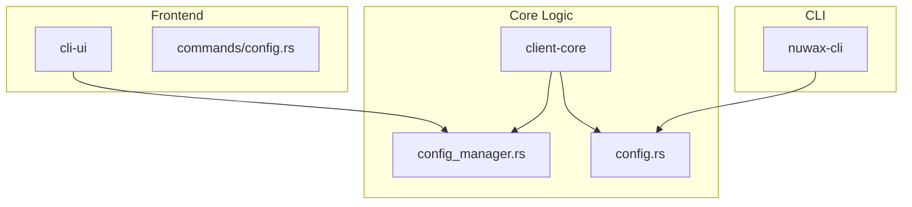
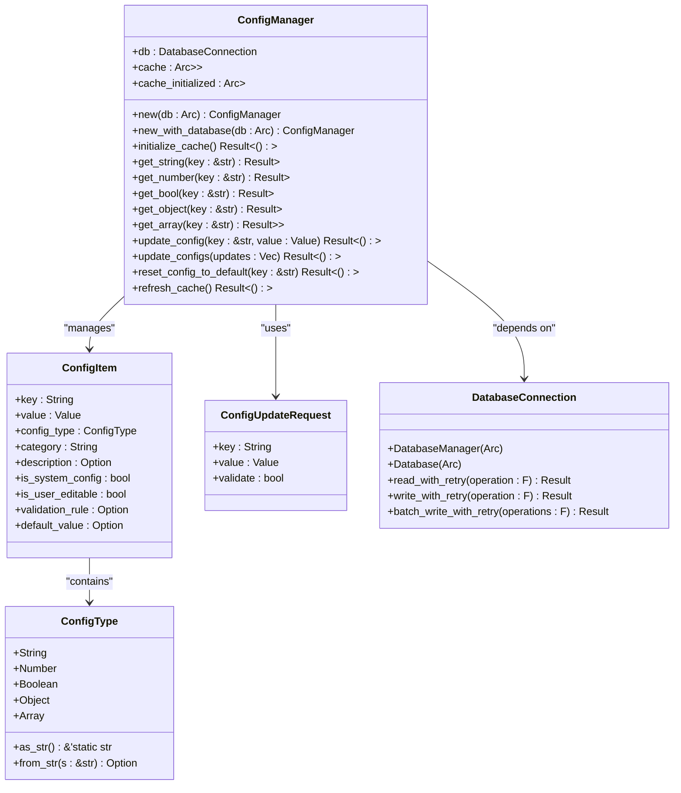
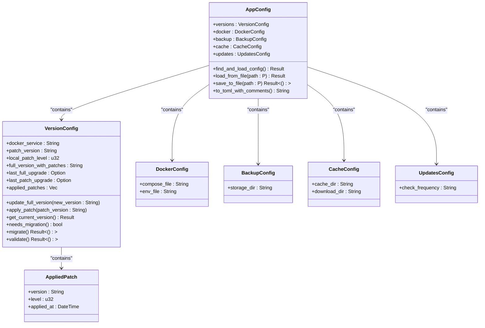
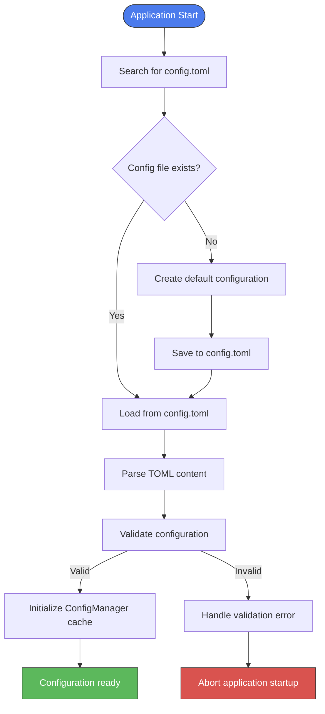
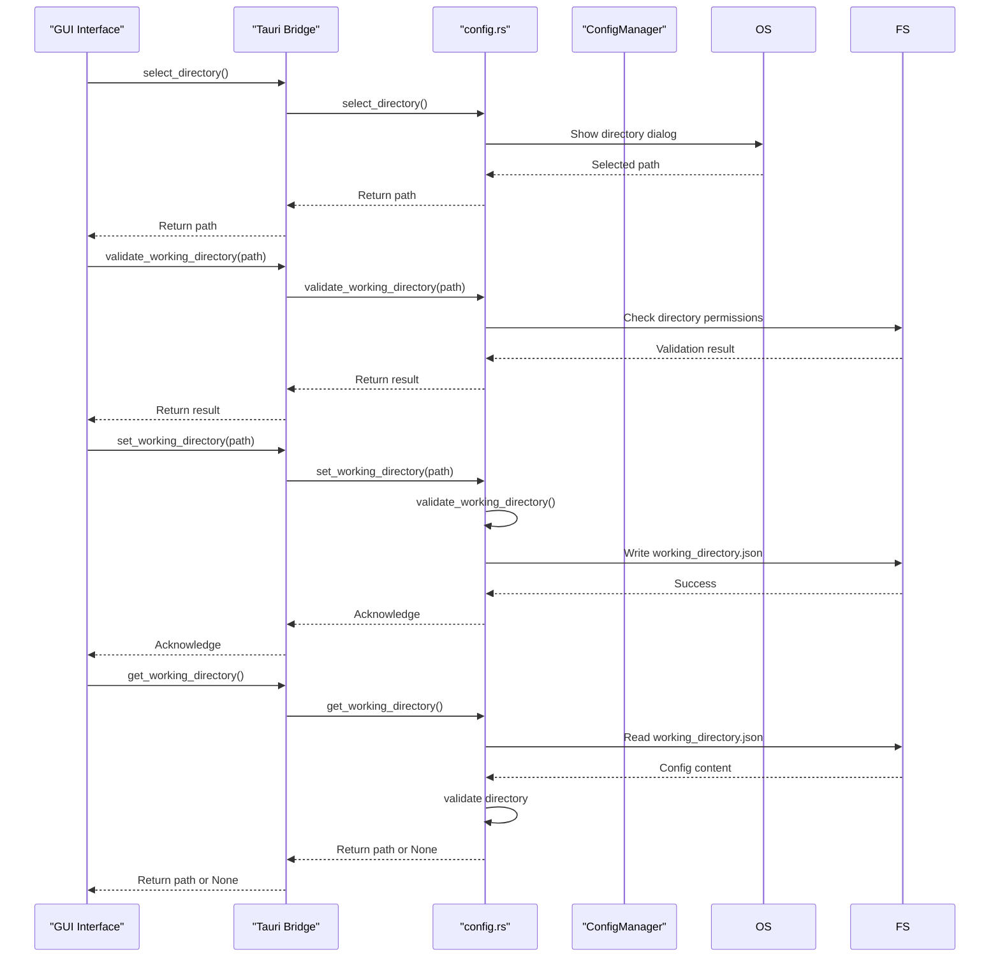
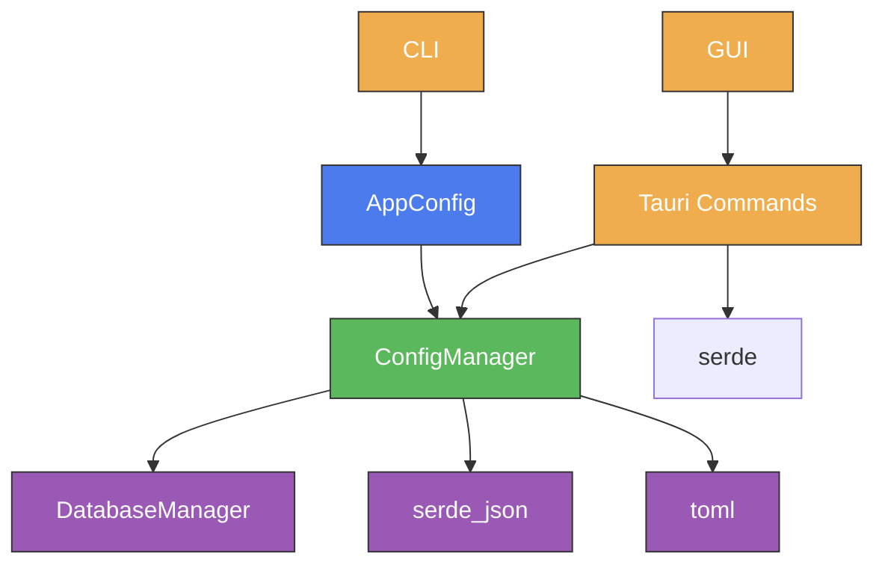

# Configuration Management

<cite>
**Referenced Files in This Document**   
- [config_manager.rs](file://client-core/src/config_manager.rs)
- [config.rs](file://client-core/src/config.rs)
- [config.rs](file://cli-ui/src-tauri/src/commands/config.rs)
</cite>

## Table of Contents
1. [Configuration Management](#configuration-management)
2. [Project Structure](#project-structure)
3. [Core Components](#core-components)
4. [Architecture Overview](#architecture-overview)
5. [Detailed Component Analysis](#detailed-component-analysis)
6. [Dependency Analysis](#dependency-analysis)
7. [Performance Considerations](#performance-considerations)
8. [Troubleshooting Guide](#troubleshooting-guide)
9. [Conclusion](#conclusion)

## Project Structure

The project structure reveals a multi-layered architecture with distinct components for configuration management. The core configuration logic resides in the `client-core` module, while UI-specific configuration handling is implemented in the `cli-ui` module. The configuration system spans both Rust backend components and Tauri-based frontend integration.



**Diagram sources**
- [config_manager.rs](file://client-core/src/config_manager.rs)
- [config.rs](file://client-core/src/config.rs)
- [config.rs](file://cli-ui/src-tauri/src/commands/config.rs)

**Section sources**
- [config_manager.rs](file://client-core/src/config_manager.rs)
- [config.rs](file://client-core/src/config.rs)

## Core Components

The configuration management system consists of two primary components: the `ConfigManager` class in `config_manager.rs` and the `AppConfig` structure in `config.rs`. These components work together to provide a comprehensive configuration management solution that supports both persistent storage and runtime configuration.

The `ConfigManager` provides a unified interface for configuration operations with features including:
- Type-safe configuration access methods
- Memory caching for improved performance
- Permission and type validation
- Batch configuration updates
- Category-based configuration queries

The `AppConfig` structure defines the application's configuration schema with specific sections for different functional areas including Docker service settings, backup policies, and update behavior.

**Section sources**
- [config_manager.rs](file://client-core/src/config_manager.rs)
- [config.rs](file://client-core/src/config.rs)

## Architecture Overview

The configuration management architecture follows a layered pattern with clear separation of concerns between configuration schema definition, persistent storage, and runtime access.

```mermaid
graph TD
A[Application] --> B[ConfigManager]
B --> C[Memory Cache]
B --> D[Database Storage]
E[CLI Interface] --> B
F[GUI Interface] --> B
G[Configuration File] --> H[AppConfig]
H --> B
D --> |app_config table| I[DuckDB Database]
classDef component fill:#4B7BEC,stroke:#333,color:#fff;
classDef storage fill:#5CB85C,stroke:#333,color:#fff;
classDef interface fill:#F0AD4E,stroke:#333,color:#fff;
class A,E,F,interface
class B,C,H component
class D,I storage
```

**Diagram sources**
- [config_manager.rs](file://client-core/src/config_manager.rs#L0-L810)
- [config.rs](file://client-core/src/config.rs#L0-L661)

## Detailed Component Analysis

### ConfigManager Implementation

The `ConfigManager` class provides a comprehensive API for configuration management with strong typing and validation capabilities.



**Diagram sources**
- [config_manager.rs](file://client-core/src/config_manager.rs#L0-L810)

**Section sources**
- [config_manager.rs](file://client-core/src/config_manager.rs#L0-L810)

### AppConfig Structure

The `AppConfig` structure defines the application's configuration schema with nested structures for different configuration domains.



**Diagram sources**
- [config.rs](file://client-core/src/config.rs#L0-L661)

**Section sources**
- [config.rs](file://client-core/src/config.rs#L0-L661)

### Configuration Loading and Validation Flow

The configuration loading process follows a well-defined sequence with fallback mechanisms and automatic configuration creation.



**Diagram sources**
- [config.rs](file://client-core/src/config.rs#L299-L313)
- [config_manager.rs](file://client-core/src/config_manager.rs#L145-L165)

**Section sources**
- [config.rs](file://client-core/src/config.rs#L299-L313)

### API Endpoints and Tauri Commands

The system exposes configuration manipulation capabilities through Tauri commands that bridge the GUI and CLI interfaces.



**Diagram sources**
- [config.rs](file://cli-ui/src-tauri/src/commands/config.rs#L0-L201)

**Section sources**
- [config.rs](file://cli-ui/src-tauri/src/commands/config.rs#L0-L201)

## Dependency Analysis

The configuration management system has well-defined dependencies between components, with clear separation between the configuration schema, storage mechanism, and access interface.



**Diagram sources**
- [config_manager.rs](file://client-core/src/config_manager.rs)
- [config.rs](file://client-core/src/config.rs)
- [config.rs](file://cli-ui/src-tauri/src/commands/config.rs)

**Section sources**
- [config_manager.rs](file://client-core/src/config_manager.rs)
- [config.rs](file://client-core/src/config.rs)
- [config.rs](file://cli-ui/src-tauri/src/commands/config.rs)

## Performance Considerations

The configuration management system implements several performance optimizations:

1. **Memory Caching**: The `ConfigManager` maintains an in-memory cache of all configuration values, eliminating the need for repeated database queries during application runtime.

2. **Lazy Initialization**: Cache initialization occurs on first access through the `ensure_cache_initialized` method, deferring the performance cost until configuration is actually needed.

3. **Batch Operations**: The `update_configs` method allows multiple configuration updates to be performed in a single database transaction, reducing I/O overhead.

4. **Read-Write Locking**: The use of `RwLock` enables concurrent read access to configuration values while ensuring thread-safe updates.

These optimizations ensure that configuration access has minimal impact on application performance, even with frequent configuration queries.

## Troubleshooting Guide

### Common Configuration Issues

**Malformed Configuration Files**
- **Symptoms**: Application fails to start with parsing errors
- **Solution**: Check TOML syntax using a validator; ensure proper quoting of strings and correct nesting of tables
- **Prevention**: Use the template-based configuration generation to ensure correct structure

**Permission Errors**
- **Symptoms**: "Directory not writable" or "Failed to save configuration" errors
- **Solution**: Verify that the application has read/write permissions to the configuration directory and files
- **Prevention**: Run the application with appropriate permissions; avoid system-protected directories

**Version Migration Issues**
- **Symptoms**: Missing configuration values after upgrade
- **Solution**: The system automatically handles backward compatibility through the `needs_migration` and `migrate` methods in `VersionConfig`
- **Prevention**: Test configuration migration thoroughly when introducing new version fields

**Cache Inconsistency**
- **Symptoms**: Configuration changes not reflected in application behavior
- **Solution**: Call `refresh_cache` to force reload from persistent storage
- **Prevention**: Use the provided update methods rather than direct database manipulation

### Error Handling Examples

The system implements comprehensive error handling throughout the configuration management process:

```rust
// In config_manager.rs - Type validation
if !self.validate_value_type(&value, &expected_type) {
    return Err(anyhow::anyhow!(
        "配置项 {key} 的值类型不匹配，期望 {expected_type:?}，实际 {value:?}"
    ));
}

// In config.rs - Configuration validation
if self.docker_service.is_empty() {
    return Err(anyhow::anyhow!("docker_service不能为空"));
}
```

These error messages provide clear guidance for diagnosing and resolving configuration issues.

**Section sources**
- [config_manager.rs](file://client-core/src/config_manager.rs)
- [config.rs](file://client-core/src/config.rs)

## Conclusion

The configuration management system provides a robust and flexible solution for managing application settings across different environments and interfaces. By combining a well-structured configuration schema with efficient storage and access patterns, the system ensures reliable configuration management throughout the application lifecycle.

Key strengths of the system include:
- Strong typing and validation to prevent configuration errors
- Memory caching for optimal performance
- Comprehensive API for both GUI and CLI access
- Automatic version migration for backward compatibility
- Clear separation of concerns between configuration domains

The system effectively addresses the requirements for Docker service settings, update behavior, backup policies, and network parameters through its modular configuration structure, while providing secure and reliable access through well-defined interfaces.