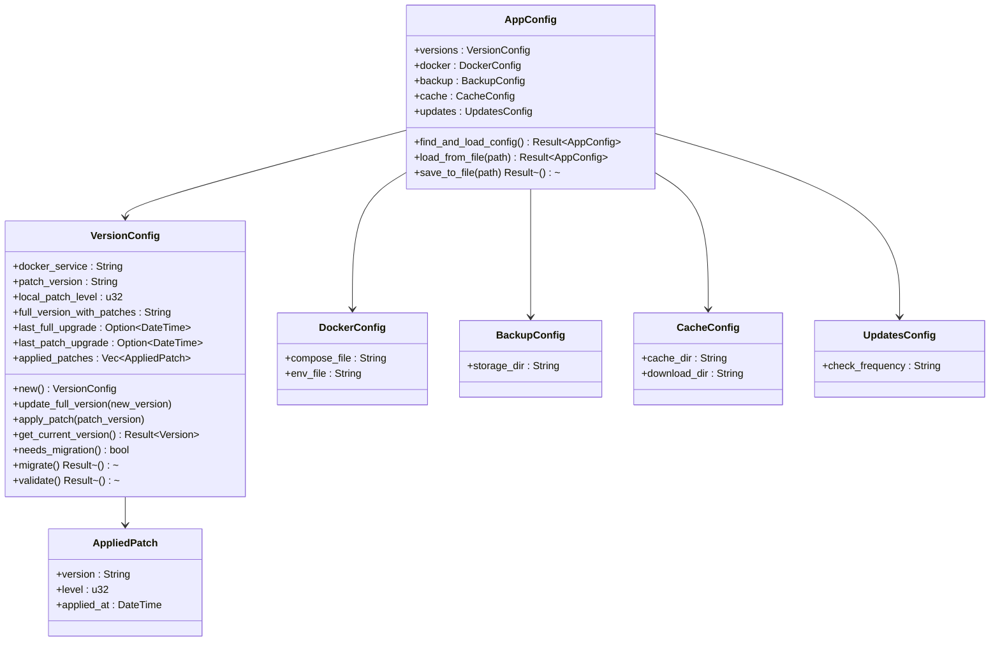
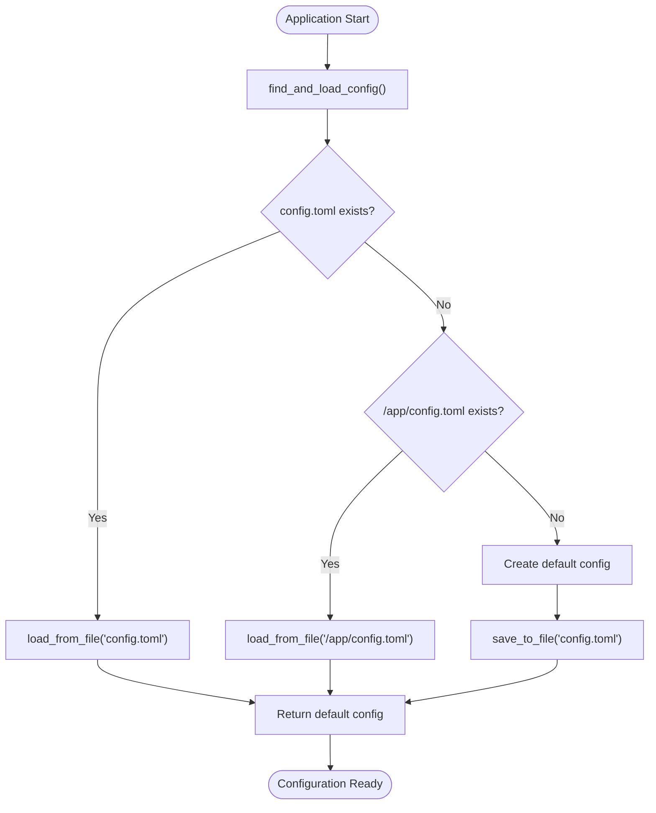
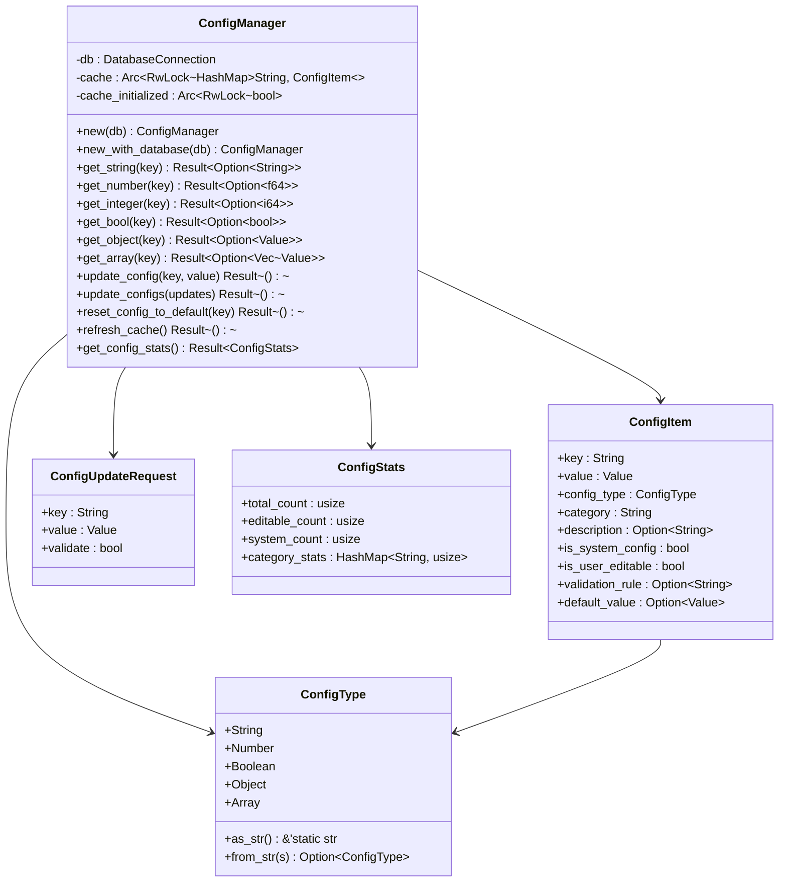
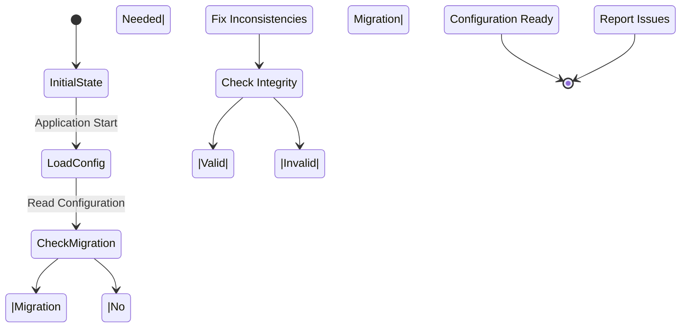
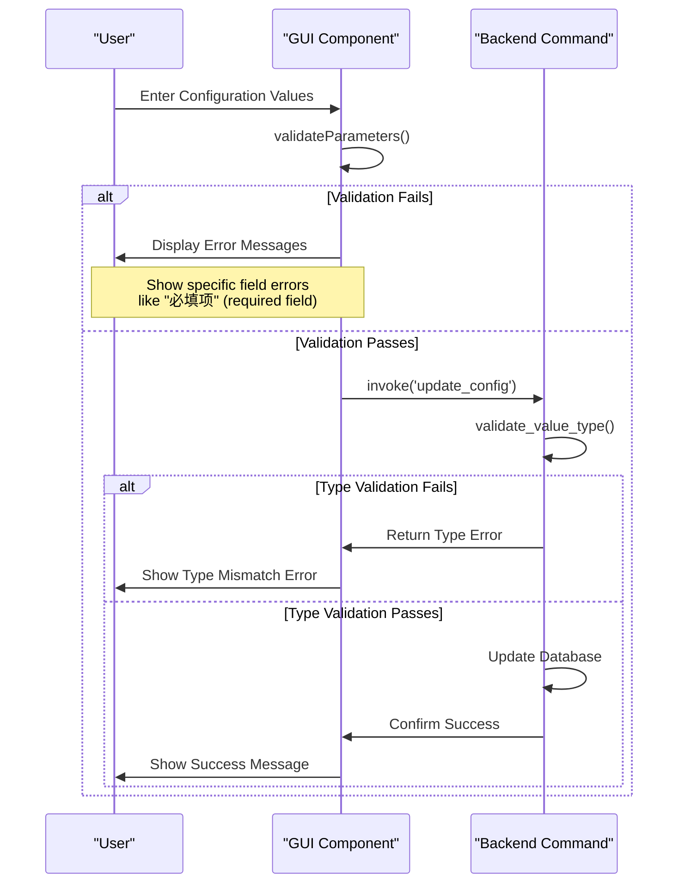

# Configuration Validation and Schema

<cite>
**Referenced Files in This Document**   
- [config.rs](file://client-core/src/config.rs)
- [config_manager.rs](file://client-core/src/config_manager.rs)
- [config.toml.template](file://client-core/templates/config.toml.template)
- [ParameterInputModal.tsx](file://cli-ui/src/components/ParameterInputModal.tsx)
- [cli-ui.md](file://spec/cli-ui.md)
</cite>

## Table of Contents
1. [Configuration Structure](#configuration-structure)
2. [Serde Deserialization and Validation](#serde-deserialization-and-validation)
3. [ConfigManager Validation and Integrity Enforcement](#configmanager-validation-and-integrity-enforcement)
4. [Schema Evolution and Backward Compatibility](#schema-evolution-and-backward-compatibility)
5. [Error Handling and User Feedback](#error-handling-and-user-feedback)
6. [Sample Configuration Files](#sample-configuration-files)

## Configuration Structure

The configuration system in the Duck Client is centered around the `AppConfig` struct defined in `client-core/src/config.rs`. This struct serves as the primary container for all application settings and is composed of several nested configuration structures that manage different aspects of the application.

The `AppConfig` struct includes the following main components:
- **versions**: Manages version information and patch history
- **docker**: Contains Docker-related configuration
- **backup**: Handles backup storage settings
- **cache**: Manages cache and download directories
- **updates**: Controls update check frequency

The `VersionConfig` struct within the versions component is particularly sophisticated, tracking not only the current Docker service version but also patch application history, upgrade timestamps, and full version information with patch levels. This structure supports both full version upgrades and incremental patch applications, providing a comprehensive version management system.



**Diagram sources**
- [config.rs](file://client-core/src/config.rs#L10-L660)

**Section sources**
- [config.rs](file://client-core/src/config.rs#L10-L660)

## Serde Deserialization and Validation

The configuration system leverages Serde for deserialization and validation of configuration data. The `AppConfig` and its component structs implement the `Serialize` and `Deserialize` traits, allowing for seamless conversion between Rust structures and TOML configuration files.

Default values are injected through several mechanisms:
1. The `Default` trait implementation for `AppConfig` provides default values for all configuration fields
2. Individual configuration structs like `VersionConfig` have their own `new()` methods that establish initial values
3. Serde's `#[serde(default)]` attribute is used for optional fields that should have default values when not specified in the configuration file

The configuration loading process follows a priority-based discovery system. The `find_and_load_config()` method searches for configuration files in the following order:
1. `config.toml` in the current directory
2. `/app/config.toml` as a fallback location

If no configuration file is found, the system creates a default configuration file using the `default()` implementation and saves it as `config.toml`. This ensures that the application always has a valid configuration to work with.

When saving configuration files, the system uses a template-based approach with `to_toml_with_comments()`. This method reads a template file (`config.toml.template`) and replaces placeholders with actual configuration values, ensuring that the saved configuration file includes helpful comments and is properly formatted.



**Diagram sources**
- [config.rs](file://client-core/src/config.rs#L295-L330)

**Section sources**
- [config.rs](file://client-core/src/config.rs#L295-L330)

## ConfigManager Validation and Integrity Enforcement

The `ConfigManager` in `client-core/src/config_manager.rs` provides a comprehensive system for configuration validation and integrity enforcement. Unlike the file-based configuration that uses Serde for basic validation, the `ConfigManager` operates on a database-backed configuration system with more sophisticated validation capabilities.

The `ConfigManager` stores configuration as key-value pairs in a database table (`app_config`) with additional metadata including:
- **config_type**: The expected type of the configuration value
- **category**: Logical grouping of configuration items
- **description**: Human-readable description of the configuration
- **is_system_config**: Whether the configuration is a system setting
- **is_user_editable**: Whether users can modify the configuration
- **validation_rule**: Optional validation rules
- **default_value**: Default value for the configuration

The validation process in `ConfigManager` is multi-layered:
1. **Existence check**: Verifies that the configuration key exists
2. **Permission check**: Ensures the configuration is user-editable if the user is attempting to modify it
3. **Type validation**: Uses the `validate_value_type()` method to ensure the provided value matches the expected type
4. **Custom validation**: Applies any defined validation rules

The `validate_value_type()` method performs strict type checking by comparing the JSON value type with the expected `ConfigType` enum value. This prevents type mismatches that could lead to runtime errors.



**Diagram sources**
- [config_manager.rs](file://client-core/src/config_manager.rs#L50-L809)

**Section sources**
- [config_manager.rs](file://client-core/src/config_manager.rs#L50-L809)

## Schema Evolution and Backward Compatibility

The configuration system implements robust mechanisms for schema evolution and backward compatibility, particularly in the `VersionConfig` structure. These mechanisms ensure that the application can handle configuration data from previous versions while supporting new features and changes.

The backward compatibility system includes several key components:

1. **Migration detection**: The `needs_migration()` method identifies configurations that require migration by checking for empty or inconsistent fields:
```rust
pub fn needs_migration(&self) -> bool {
    self.full_version_with_patches.is_empty()
        || (self.local_patch_level == 0 && !self.applied_patches.is_empty())
}
```

2. **Automatic migration**: The `migrate()` method automatically corrects configuration inconsistencies, such as constructing the full version string from component parts when it's missing.

3. **Graceful degradation**: The `get_current_version()` method provides backward compatibility by constructing a version from the `docker_service` field when the `full_version_with_patches` field is empty.

4. **Validation with warnings**: The validation system issues warnings rather than errors for certain inconsistencies (like patch level mismatches), allowing the application to continue functioning while alerting administrators to potential issues.

The system also supports schema evolution through Serde's default value mechanism. When new fields are added to configuration structs, the `#[serde(default)]` attribute ensures that older configuration files without these fields can still be loaded successfully, with the new fields receiving their default values.

This approach allows for smooth transitions between application versions, where new versions can read configuration files from older versions without requiring manual intervention from users or administrators.



**Section sources**
- [config.rs](file://client-core/src/config.rs#L148-L199)

## Error Handling and User Feedback

The configuration system implements comprehensive error handling that propagates validation errors to users through both CLI and GUI interfaces. The error handling strategy varies depending on the context and user interface.

For file-based configuration validation, errors are handled through Rust's `Result` type and logged using the `tracing` crate. When configuration validation fails, descriptive error messages are generated, such as "docker_service不能为空" (docker_service cannot be empty) or "无效的完整版本号格式" (invalid full version format).

In the GUI interface, validation occurs at multiple levels:
1. **Parameter validation**: The `ParameterInputModal` component validates user input against defined rules, including required fields, numeric ranges, and regex patterns.
2. **Directory validation**: The system validates working directory permissions by checking existence, readability, and writability.
3. **Confirmation dialogs**: Before making potentially destructive changes, the system prompts users for confirmation.

The error propagation mechanism in the GUI uses Tauri commands to communicate between the frontend and backend. When validation fails, the backend returns descriptive error messages that are displayed to users in dialog boxes. For example, when a directory lacks proper permissions, the user sees "目录权限不足，需要读写权限" (insufficient directory permissions, read and write access required).



**Diagram sources**
- [ParameterInputModal.tsx](file://cli-ui/src/components/ParameterInputModal.tsx#L49-L92)
- [cli-ui.md](file://spec/cli-ui.md#L1189-L1528)

**Section sources**
- [ParameterInputModal.tsx](file://cli-ui/src/components/ParameterInputModal.tsx#L49-L92)
- [cli-ui.md](file://spec/cli-ui.md#L1189-L1528)

## Sample Configuration Files

The system includes a template configuration file that serves as both a sample and a basis for generating new configuration files. The template, located at `client-core/templates/config.toml.template`, includes comments explaining each field and uses placeholders that are replaced with actual values when the configuration is saved.

```toml
# Duck Client Configuration File
# Local configuration file, server endpoints are built into the program

# [versions]
# Service version management (client version is built into the program)
[versions]
docker_service = "{docker_service_version}"  # Current version of the deployed Docker service

# [docker]
# Docker-related configuration
[docker]
compose_file = "{compose_file}"

# [backup]
# All backup-related configuration
[backup]
# Unified storage directory for backup files. Users can modify at any time.
storage_dir = "{backup_storage_dir}"

# [cache]
# Cache-related configuration
[cache]
# Cache root directory
cache_dir = "{cache_dir}"
# Download cache directory
download_dir = "{download_dir}"

# [updates]
# Update-related configuration
[updates]
check_frequency = "{check_frequency}" 
```

When the application generates a configuration file, it replaces the placeholders with actual values:
- `{docker_service_version}`: The current Docker service version
- `{compose_file}`: Path to the Docker compose file
- `{backup_storage_dir}`: Directory for storing backups
- `{cache_dir}`: Root directory for cache files
- `{download_dir}`: Directory for downloaded files
- `{check_frequency}`: How often to check for updates

The resulting configuration file provides a clear, well-documented starting point for users to understand and modify the application's behavior. The comments in the template explain the purpose of each setting, making it accessible even to users with limited technical knowledge.

**Section sources**
- [config.toml.template](file://client-core/templates/config.toml.template)
- [config.rs](file://client-core/src/config.rs#L350-L398)