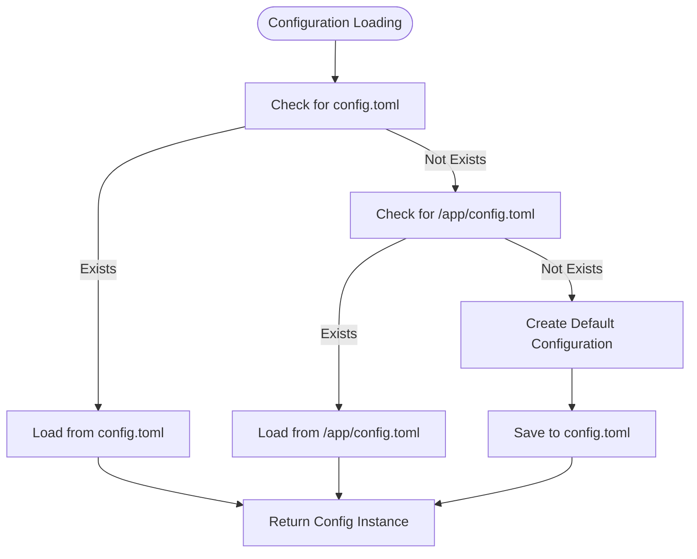
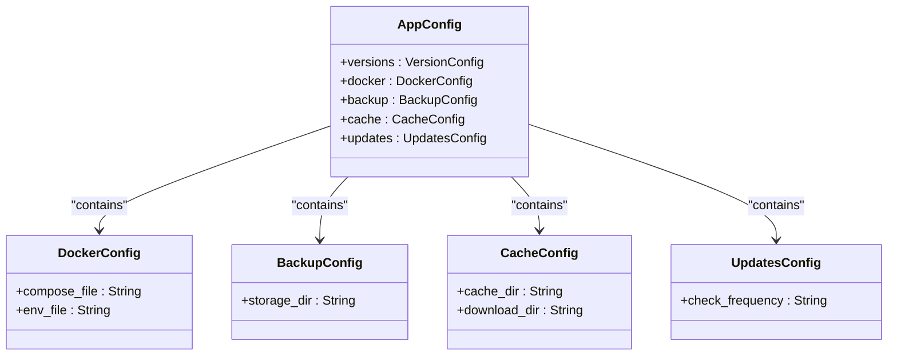
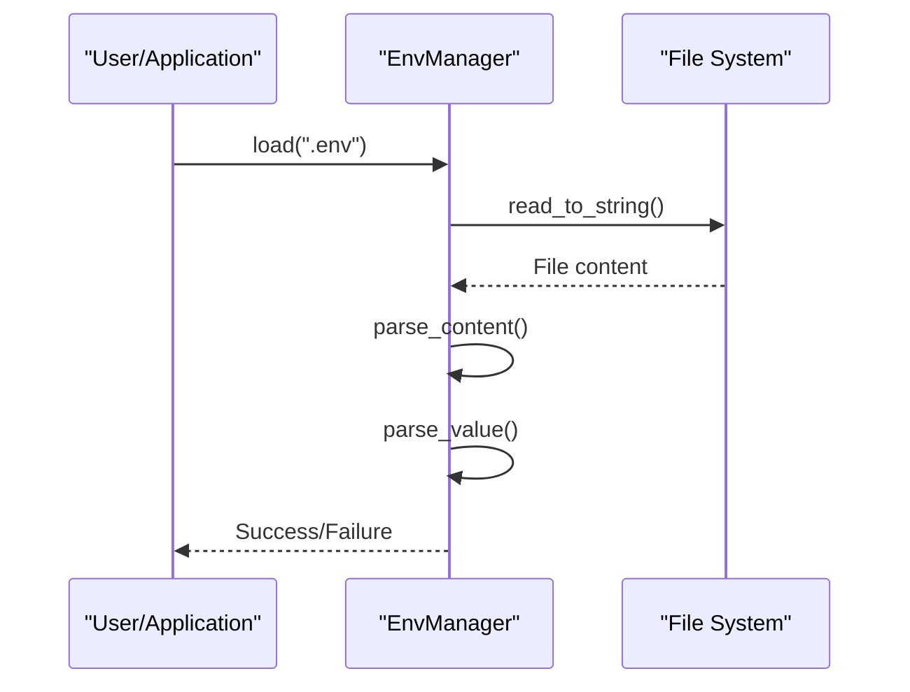
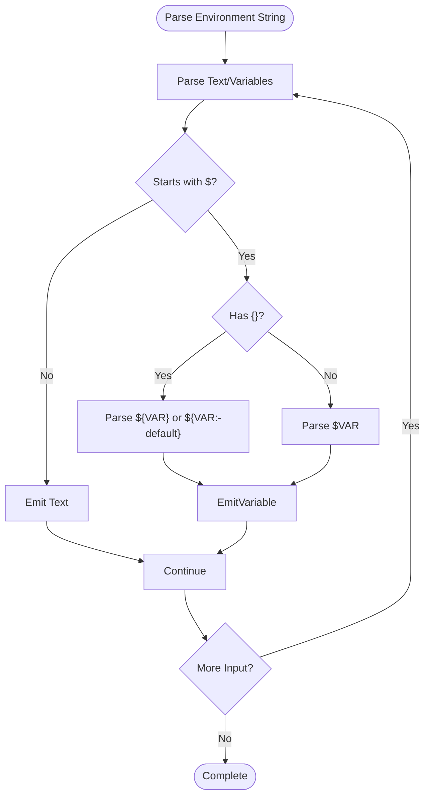
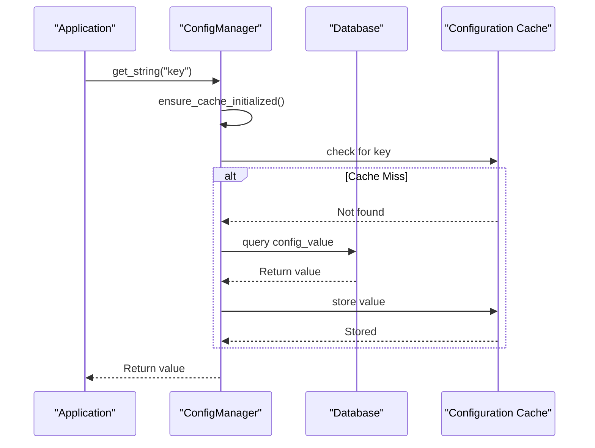

# Environment-Specific Configuration

<cite>
**Referenced Files in This Document**   
- [config.rs](file://client-core/src/config.rs)
- [config_manager.rs](file://client-core/src/config_manager.rs)
- [env_manager.rs](file://nuwax-cli/src/utils/env_manager.rs)
- [port_manager.rs](file://nuwax-cli/src/docker_service/port_manager.rs)
- [container/config.rs](file://client-core/src/container/config.rs)
- [constants.rs](file://client-core/src/constants.rs)
</cite>

## Table of Contents
1. [Introduction](#introduction)
2. [Configuration Loading Mechanism](#configuration-loading-mechanism)
3. [Profile-Based Configuration](#profile-based-configuration)
4. [Environment Variable Handling](#environment-variable-handling)
5. [Configuration Precedence Hierarchy](#configuration-precedence-hierarchy)
6. [Docker Environment Integration](#docker-environment-integration)
7. [Security Best Practices](#security-best-practices)
8. [Conclusion](#conclusion)

## Introduction
This document provides a comprehensive overview of the environment-specific configuration system in the Duck Client application. The system supports multiple environments (development, staging, production) through profile-based configuration loading, environment variables, and runtime overrides. The configuration system is designed to be flexible, secure, and easy to manage across different deployment scenarios.

**Section sources**
- [config.rs](file://client-core/src/config.rs#L1-L661)
- [config_manager.rs](file://client-core/src/config_manager.rs#L1-L810)

## Configuration Loading Mechanism

The configuration system follows a hierarchical approach to load settings from multiple sources. The primary configuration is managed through TOML files, with support for environment-specific overrides and runtime modifications.

The `AppConfig` structure serves as the central configuration container, containing nested configurations for different subsystems:

```rust
pub struct AppConfig {
    pub versions: VersionConfig,
    pub docker: DockerConfig,
    pub backup: BackupConfig,
    pub cache: CacheConfig,
    pub updates: UpdatesConfig,
}
```

Configuration loading follows a specific priority order:

1. Attempt to load from `config.toml` in the current directory
2. Fall back to `/app/config.toml` for containerized environments
3. Create default configuration if no file is found



**Diagram sources**
- [config.rs](file://client-core/src/config.rs#L200-L400)

**Section sources**
- [config.rs](file://client-core/src/config.rs#L200-L400)

## Profile-Based Configuration

The system supports environment-specific configurations through a combination of file-based profiles and environment variables. While the current implementation doesn't use explicit profile files (like `config.development.toml`), it achieves similar functionality through environment variable overrides and conditional logic.

The `DockerConfig` structure demonstrates how environment-specific settings are managed:

```rust
pub struct DockerConfig {
    #[serde(default = "default_compose_file_path")]
    pub compose_file: String,
    #[serde(default = "default_env_file_path")]
    pub env_file: String,
}
```

Default values are determined by functions that consider the execution environment:

```rust
fn default_env_file_path() -> String {
    docker::get_env_file_path_str()
}

fn default_compose_file_path() -> String {
    docker::get_compose_file_path_str()
}
```

This approach allows the system to adapt to different environments without requiring separate configuration files. For example, in a Docker container, the paths might point to `/app/config/`, while in a development environment, they point to local directories.



**Diagram sources**
- [config.rs](file://client-core/src/config.rs#L200-L400)

**Section sources**
- [config.rs](file://client-core/src/config.rs#L200-L400)

## Environment Variable Handling

The system provides comprehensive support for environment variable processing, allowing configuration values to be overridden at runtime. Environment variables are handled at multiple levels of the application stack.

### .env File Processing

The `EnvManager` component handles `.env` file parsing and management:



The `EnvManager` supports various variable formats:
- Basic: `KEY=VALUE`
- With export: `export KEY=VALUE`
- Quoted values: `KEY="VALUE"` or `KEY='VALUE'`
- Inline comments: `KEY=VALUE # comment`

**Section sources**
- [env_manager.rs](file://nuwax-cli/src/utils/env_manager.rs#L1-L199)

### Variable Expansion in Docker Compose

The system processes environment variables in Docker Compose files using the `shellexpand` crate:

```rust
pub fn load_compose_config_with_env(compose_path: &Path, env_path: &Path) -> Result<dct::Compose> {
    // Load .env file
    dotenvy::from_path_override(env_path).ok();
    
    // Read compose file
    let content = fs::read_to_string(compose_path)?;
    
    // Expand environment variables
    let context = |s: &str| Ok(std::env::var(s).ok());
    let expanded_content = shellexpand::env_with_context(&content, context)?;
    
    // Parse YAML
    let compose_config: dct::Compose = serde_yaml::from_str(&expanded_content)?;
    
    Ok(compose_config)
}
```

This allows Docker Compose files to use environment variables in various formats:
- `${VAR_NAME}`
- `$VAR_NAME`
- `${VAR_NAME:-default}`

### Port Manager Variable Processing

The `PortManager` includes sophisticated environment variable parsing capabilities:



The system supports three types of variable expansions:
1. **Text**: Plain text segments
2. **Variable**: `${VAR_NAME}` or `$VAR_NAME`
3. **VariableWithDefault**: `${VAR_NAME:-default_value}`

**Diagram sources**
- [port_manager.rs](file://nuwax-cli/src/docker_service/port_manager.rs#L50-L150)

**Section sources**
- [port_manager.rs](file://nuwax-cli/src/docker_service/port_manager.rs#L1-L199)
- [container/config.rs](file://client-core/src/container/config.rs#L40-L239)

## Configuration Precedence Hierarchy

The system implements a clear precedence hierarchy for configuration values, ensuring predictable behavior when multiple sources provide conflicting values.

### Precedence Order

The configuration precedence follows this order (highest to lowest):

1. **Runtime API calls** - Direct configuration updates via the `ConfigManager`
2. **Environment variables** - Values from `.env` files and system environment
3. **Configuration files** - Settings from `config.toml`
4. **Default values** - Hardcoded defaults in the application

### Runtime Configuration Management

The `ConfigManager` provides a database-backed configuration system that takes precedence over file-based configurations:



The `ConfigManager` enforces type safety and access control:

```rust
pub async fn update_config(&self, key: &str, value: Value) -> Result<()> {
    // Check permissions
    let is_editable = {
        let cache = self.cache.read().await;
        if let Some(config) = cache.get(key) {
            if !config.is_user_editable {
                return Err(anyhow::anyhow!("配置项 {key} 不可编辑"));
            }
            config.is_user_editable
        } else {
            return Err(anyhow::anyhow!("配置项 {key} 不存在"));
        }
    };

    // Validate type
    let expected_type = {
        let cache = self.cache.read().await;
        cache.get(key).map(|config| config.config_type.clone())
    };

    if let Some(expected_type) = expected_type {
        if !self.validate_value_type(&value, &expected_type) {
            return Err(anyhow::anyhow!(
                "配置项 {key} 的值类型不匹配，期望 {expected_type:?}，实际 {value:?}"
            ));
        }
    }

    // Update database and cache
    // ...
}
```

**Diagram sources**
- [config_manager.rs](file://client-core/src/config_manager.rs#L200-L599)

**Section sources**
- [config_manager.rs](file://client-core/src/config_manager.rs#L200-L599)

## Docker Environment Integration

The system is designed to work seamlessly in Docker environments, with special handling for container-specific configurations.

### Project Name Resolution

The Docker Compose project name is determined through a fallback mechanism:

```rust
pub fn get_compose_project_name(&self) -> String {
    // First check environment variable
    if let Ok(project_name) = std::env::var("COMPOSE_PROJECT_NAME") {
        return project_name;
    }

    // Use parent directory name of compose file
    if let Some(parent_dir) = self.compose_file.parent() {
        if let Some(dir_name) = parent_dir.file_name() {
            if let Some(name_str) = dir_name.to_str() {
                return name_str.to_string();
            }
        }
    }

    // Default project name
    "docker".to_string()
}
```

This allows users to override the project name via environment variables while providing sensible defaults.

### Container Name Patterns

The system generates multiple container name patterns to accommodate different Docker Compose naming conventions:

```rust
pub fn generate_compose_container_patterns(&self, service_name: &str) -> Vec<String> {
    let project_name = self.get_compose_project_name();

    vec![
        format!("{project_name}_{service_name}_1"),
        format!("{project_name}-{service_name}-1"),
        format!("{project_name}_{service_name}"),
        format!("{project_name}-{service_name}"),
        service_name.to_string(),
    ]
}
```

This flexibility ensures compatibility with various Docker Compose versions and configurations.

### Service Restart Policy Detection

The system can detect service restart policies from the Docker Compose configuration:

```rust
pub async fn is_oneshot_service(&self, service_name: &str) -> Result<bool> {
    let services = &self.load_compose_config()?.services;

    if let Some(service_opt) = services.0.get(service_name) {
        if let Some(service) = service_opt {
            if let Some(restart_policy) = &service.restart {
                let policy = restart_policy.to_string();
                if policy == "no" || policy == "false" {
                    return Ok(true);
                }
                if policy == "always" || policy == "unless-stopped" || policy == "on-failure" {
                    return Ok(false);
                }
            }
        }

        Ok(false)
    } else {
        Err(anyhow::anyhow!("服务: {service_name} 不存在"))
    }
}
```

This allows the application to distinguish between long-running services and one-time tasks.

**Section sources**
- [container/config.rs](file://client-core/src/container/config.rs#L40-L239)

## Security Best Practices

The configuration system incorporates several security measures to protect sensitive data and prevent accidental exposure.

### Sensitive Data Protection

The system should follow these best practices for handling sensitive configuration data:

1. **Never store secrets in configuration files**: Use environment variables for sensitive data like API keys, passwords, and tokens.

2. **Use .env files for development**: Store environment variables in `.env` files during development, but ensure these files are git-ignored.

3. **Validate input**: The `ConfigManager` validates configuration types and enforces access controls:

```rust
fn validate_value_type(&self, value: &Value, expected_type: &ConfigType) -> bool {
    match (value, expected_type) {
        (Value::String(_), ConfigType::String) => true,
        (Value::Number(_), ConfigType::Number) => true,
        (Value::Bool(_), ConfigType::Boolean) => true,
        (Value::Object(_), ConfigType::Object) => true,
        (Value::Array(_), ConfigType::Array) => true,
        _ => false,
    }
}
```

4. **Avoid logging sensitive data**: Ensure that configuration values are not accidentally logged.

### Environment Variable Security

To prevent leakage of sensitive environment variables:

1. **Use specific allowlists**: Only expose necessary environment variables to containers.

2. **Avoid default value disclosure**: Be cautious with default values in `${VAR_NAME:-default}` syntax, as they may reveal sensitive information.

3. **Secure .env files**: Set appropriate file permissions (600) on `.env` files.

4. **Use Docker secrets** for production deployments when possible.

### Configuration File Security

Additional security considerations for configuration files:

1. **Set appropriate file permissions**: Configuration files should have restrictive permissions (600 or 644).

2. **Avoid world-readable permissions**: Never set 777 or 666 permissions on configuration files.

3. **Regular security audits**: Periodically review configuration files for accidentally committed secrets.

4. **Use configuration validation**: Validate configuration files on startup to prevent misconfiguration.

**Section sources**
- [config_manager.rs](file://client-core/src/config_manager.rs#L400-L599)
- [env_manager.rs](file://nuwax-cli/src/utils/env_manager.rs#L1-L199)

## Conclusion

The Duck Client application implements a robust and flexible environment-specific configuration system that supports multiple environments through a combination of file-based configurations, environment variables, and runtime overrides. The system follows a clear precedence hierarchy, ensuring predictable behavior when configuration values conflict.

Key features of the configuration system include:

- **Profile-based configuration** through environment variable overrides
- **Comprehensive environment variable handling** with support for multiple syntaxes
- **Database-backed runtime configuration** with type safety and access control
- **Seamless Docker integration** with intelligent project name resolution
- **Security-focused design** to protect sensitive configuration data

The system balances flexibility with security, allowing users to customize their environment while protecting sensitive information from accidental exposure. By following the documented best practices, users can safely manage configuration across different environments from development to production.