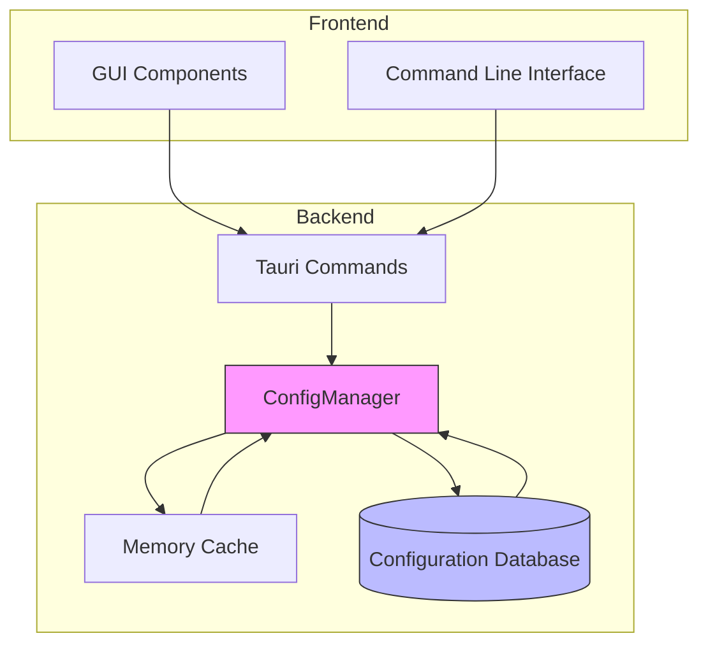
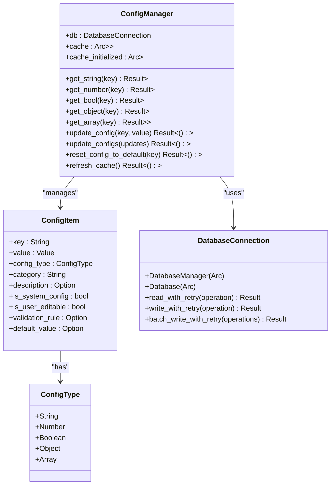
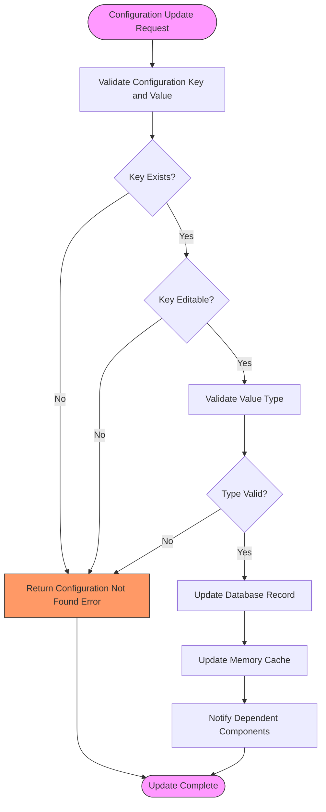
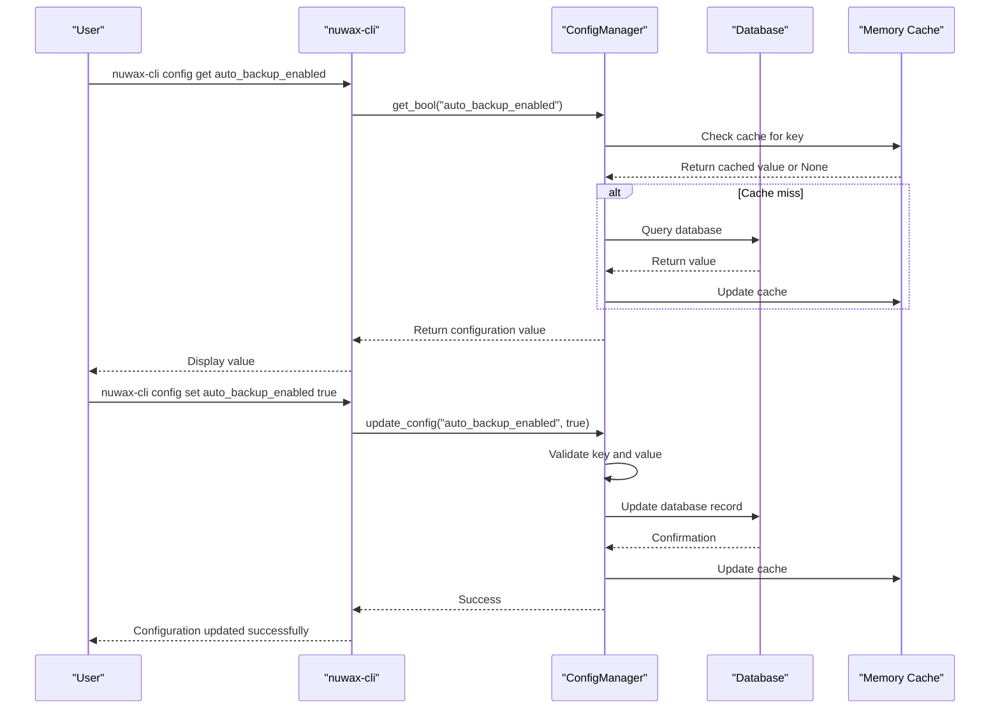
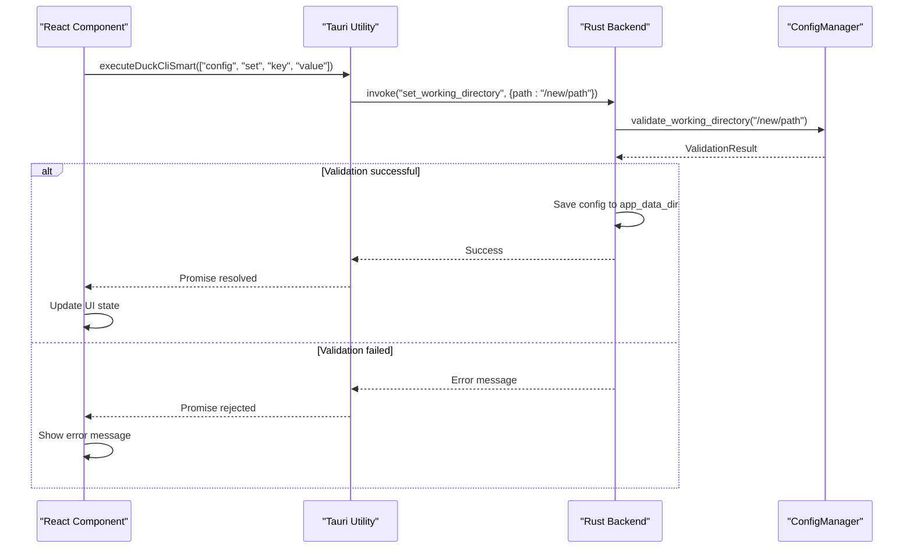
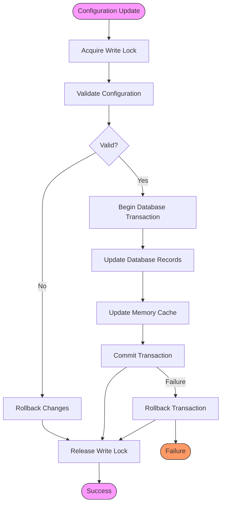

# Runtime Configuration Management

<cite>
**Referenced Files in This Document**   
- [config.rs](file://client-core/src/config.rs#L1-L661)
- [config_manager.rs](file://client-core/src/config_manager.rs#L1-L810)
- [config.rs](file://cli-ui/src-tauri/src/commands/config.rs#L1-L201)
</cite>

## Table of Contents
1. [Introduction](#introduction)
2. [Configuration Architecture Overview](#configuration-architecture-overview)
3. [Core Configuration Components](#core-configuration-components)
4. [Runtime Configuration Application](#runtime-configuration-application)
5. [Command-Line Interface](#command-line-interface)
6. [Tauri Command Interface](#tauri-command-interface)
7. [Frontend-Backend Interaction](#frontend-backend-interaction)
8. [Configuration Update Safety](#configuration-update-safety)
9. [Conclusion](#conclusion)

## Introduction
This document provides a comprehensive analysis of the runtime configuration management system in the Duck Client application. The system enables dynamic configuration changes through both command-line and GUI interfaces, with changes applied at runtime without requiring application restarts. The configuration system is built on a robust foundation of database persistence, memory caching, and type-safe operations, ensuring reliability and performance.

**Section sources**
- [config.rs](file://client-core/src/config.rs#L1-L661)
- [config_manager.rs](file://client-core/src/config_manager.rs#L1-L810)

## Configuration Architecture Overview
The configuration system follows a layered architecture with clear separation of concerns. At its core is the ConfigManager, which provides a unified interface for configuration operations. The system uses a database as the source of truth, with an in-memory cache for high-performance access. Configuration changes are validated before persistence and automatically reflected in the application state.



**Diagram sources**
- [config_manager.rs](file://client-core/src/config_manager.rs#L1-L810)
- [config.rs](file://client-core/src/config.rs#L1-L661)

**Section sources**
- [config_manager.rs](file://client-core/src/config_manager.rs#L1-L810)

## Core Configuration Components

### AppConfig Structure
The AppConfig structure defines the application's configuration schema with typed fields for different configuration domains. It includes version management, Docker settings, backup configurations, and update policies. The structure is designed for extensibility and type safety, using serde for serialization.

```rust
#[derive(Debug, Serialize, Deserialize, Clone)]
pub struct AppConfig {
    pub versions: VersionConfig,
    pub docker: DockerConfig,
    pub backup: BackupConfig,
    pub cache: CacheConfig,
    pub updates: UpdatesConfig,
}
```

### ConfigManager Implementation
The ConfigManager provides a comprehensive API for configuration operations with built-in validation and error handling. It manages an in-memory cache of configuration values for high-performance access while ensuring data consistency with the database backend.



**Diagram sources**
- [config_manager.rs](file://client-core/src/config_manager.rs#L1-L810)

**Section sources**
- [config_manager.rs](file://client-core/src/config_manager.rs#L1-L810)
- [config.rs](file://client-core/src/config.rs#L1-L661)

## Runtime Configuration Application
Configuration changes are applied at runtime through a well-defined process that ensures data consistency and application stability. When a configuration change is requested, the system validates the change, persists it to the database, and updates the in-memory cache. Components that depend on configuration values automatically receive the updated values through the ConfigManager interface.

The system uses a lazy initialization pattern for the configuration cache, loading all configuration values from the database on first access. Subsequent reads are served from memory, providing optimal performance. The cache can be manually refreshed using the refresh_cache method, which is useful after bulk configuration updates.



**Diagram sources**
- [config_manager.rs](file://client-core/src/config_manager.rs#L1-L810)

**Section sources**
- [config_manager.rs](file://client-core/src/config_manager.rs#L1-L810)

## Command-Line Interface
The command-line interface for configuration management is implemented in the nuwax-cli module. While the specific config.rs file was not found in the commands directory, the configuration functionality is accessible through the CLI's command structure. The CLI uses the ConfigManager from client-core to perform configuration operations, ensuring consistency across interfaces.

The configuration commands follow a standard pattern with get, set, and reset operations. Argument parsing is handled by the clap library, with validation performed by the ConfigManager before any changes are applied. Error handling provides clear feedback to users about the nature of any configuration issues.



**Diagram sources**
- [config_manager.rs](file://client-core/src/config_manager.rs#L1-L810)
- [config.rs](file://client-core/src/config.rs#L1-L661)

**Section sources**
- [config_manager.rs](file://client-core/src/config_manager.rs#L1-L810)

## Tauri Command Interface
The Tauri command interface enables GUI-based configuration editing through a set of asynchronous commands exposed to the frontend. These commands are implemented in cli-ui/src-tauri/src/commands/config.rs and provide a bridge between the React frontend and the Rust backend configuration system.

The interface includes commands for selecting and validating working directories, setting and retrieving configuration values, and handling configuration-related operations. Each command is annotated with #[command] to expose it to the Tauri framework and uses Result types for proper error handling.

```rust
/// 设置工作目录
#[command]
pub async fn set_working_directory(app: AppHandle, path: String) -> Result<(), String> {
    // 首先验证目录
    let validation = validate_working_directory(app.clone(), path.clone()).await?;

    if !validation.valid {
        return Err(validation.error.unwrap_or("目录无效".to_string()));
    }

    // 保存配置到应用数据目录
    let config = WorkingDirectoryConfig {
        path: path.clone(),
        last_updated: get_current_rfc3339_timestamp(),
        user_selected: true,
    };

    let config_dir = app
        .path()
        .app_data_dir()
        .map_err(|e| format!("获取应用数据目录失败: {e}"))?;

    // 确保配置目录存在
    if !config_dir.exists() {
        fs::create_dir_all(&config_dir).map_err(|e| format!("创建配置目录失败: {e}"))?;
    }

    let config_file = config_dir.join("working_directory.json");
    let config_json =
        serde_json::to_string_pretty(&config).map_err(|e| format!("序列化配置失败: {e}"))?;

    fs::write(&config_file, &config_json).map_err(|e| format!("保存配置文件失败: {e}"))?;

    println!("工作目录已设置为: {path}");
    Ok(())
}
```

**Section sources**
- [config.rs](file://cli-ui/src-tauri/src/commands/config.rs#L1-L201)

## Frontend-Backend Interaction
The interaction between frontend components and backend commands follows a well-defined pattern using Tauri's command system. Frontend components invoke backend commands through the invoke method, passing parameters and receiving promises that resolve with the command results.

The frontend uses a utility class in tauri.ts to handle command execution with fallback strategies. When a configuration change is made in the GUI, the frontend invokes the appropriate Tauri command, which in turn calls the ConfigManager to perform the actual configuration operation.



**Diagram sources**
- [config.rs](file://cli-ui/src-tauri/src/commands/config.rs#L1-L201)
- [tauri.ts](file://cli-ui/src/utils/tauri.ts#L1-L100)

**Section sources**
- [config.rs](file://cli-ui/src-tauri/src/commands/config.rs#L1-L201)
- [tauri.ts](file://cli-ui/src/utils/tauri.ts#L1-L100)

## Configuration Update Safety
The configuration system implements several safety mechanisms to prevent data corruption and ensure reliability during configuration updates. These include transactional updates, validation checks, and rollback strategies for failed operations.

### Race Condition Prevention
The system prevents race conditions through the use of database transactions and atomic operations. When multiple configuration updates are performed, they are batched into a single transaction to ensure atomicity. The ConfigManager uses RwLock for thread-safe access to the in-memory cache, preventing concurrent modification issues.

### Transactional Updates
Configuration updates are performed transactionally at the database level. The ConfigManager uses write_with_retry and batch_write_with_retry methods to ensure that updates are completed successfully or rolled back in case of failure. This prevents partial updates that could leave the configuration in an inconsistent state.

### Rollback Strategies
For failed configuration changes, the system implements several rollback strategies:
1. Database transactions are automatically rolled back on error
2. The in-memory cache is only updated after successful database persistence
3. The refresh_cache method can be used to reload the cache from the database if needed
4. Default values are available for reset operations

The system also includes comprehensive error handling with specific error types for different failure modes, allowing for appropriate recovery strategies.



**Diagram sources**
- [config_manager.rs](file://client-core/src/config_manager.rs#L1-L810)

**Section sources**
- [config_manager.rs](file://client-core/src/config_manager.rs#L1-L810)

## Conclusion
The runtime configuration management system in the Duck Client application provides a robust, type-safe, and user-friendly interface for managing application settings. By leveraging a layered architecture with database persistence and memory caching, the system ensures both data reliability and high performance. The integration between command-line and GUI interfaces through a shared configuration manager ensures consistency across all interaction methods. Safety features such as validation, transactional updates, and rollback strategies protect against configuration errors and data corruption, making the system reliable for production use.