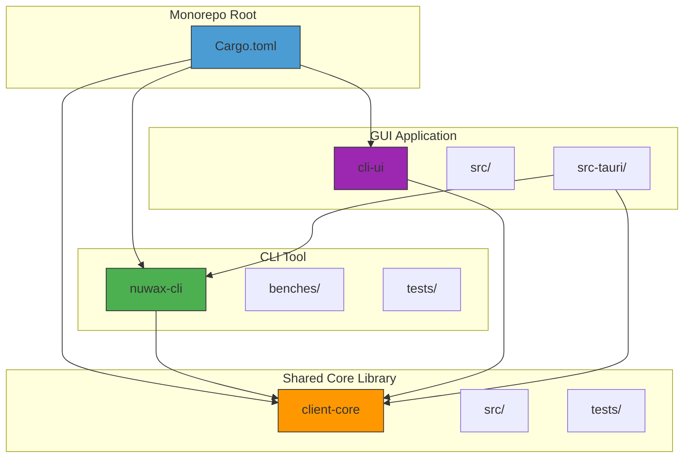
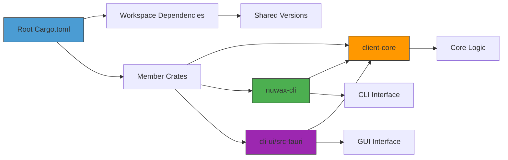
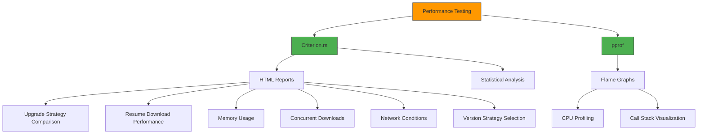

# Development Guide

<cite>
**Referenced Files in This Document**   
- [README.md](file://README.md)
- [cli-ui/README.md](file://cli-ui/README.md)
- [Cargo.toml](file://Cargo.toml)
- [nuwax-cli/Cargo.toml](file://nuwax-cli/Cargo.toml)
- [client-core/Cargo.toml](file://client-core/Cargo.toml)
- [nuwax-cli/PERFORMANCE_TESTING.md](file://nuwax-cli/PERFORMANCE_TESTING.md)
- [nuwax-cli/benches/upgrade_performance.rs](file://nuwax-cli/benches/upgrade_performance.rs)
- [cli-ui/package.json](file://cli-ui/package.json)
- [cli-ui/src-tauri/Cargo.toml](file://cli-ui/src-tauri/Cargo.toml)
- [cli-ui/src-tauri/src/main.rs](file://cli-ui/src-tauri/src/main.rs)
- [spec/cli-ui.md](file://spec/cli-ui.md)
- [spec/docker-task.md](file://spec/docker-task.md)
- [nuwax-cli/src/docker_service/script_permissions.rs](file://nuwax-cli/src/docker_service/script_permissions.rs)
</cite>

## Table of Contents
1. [Project Structure](#project-structure)
2. [Build Process](#build-process)
3. [Monorepo Management](#monorepo-management)
4. [Testing Strategy](#testing-strategy)
5. [Performance Testing](#performance-testing)
6. [Development Environment Setup](#development-environment-setup)
7. [Debugging Techniques](#debugging-techniques)
8. [Contribution Guidelines](#contribution-guidelines)
9. [Common Development Issues](#common-development-issues)

## Project Structure

The duck_client repository is a monorepo containing three main components: a CLI tool (nuwax-cli), a shared core library (client-core), and a Tauri-based GUI application (cli-ui). This structure enables code sharing and consistent development practices across components.



**Diagram sources**
- [Cargo.toml](file://Cargo.toml)
- [README.md](file://README.md)

**Section sources**
- [README.md](file://README.md)
- [Cargo.toml](file://Cargo.toml)

## Build Process

### Workspace Configuration
The project uses a Rust workspace defined in the root Cargo.toml file, which includes three member crates: client-core, nuwax-cli, and cli-ui/src-tauri. This configuration enables shared dependencies and coordinated builds across the monorepo.

```toml
[workspace]
resolver = "2"
members = ["client-core", "nuwax-cli", "cli-ui/src-tauri"]
```

The workspace also defines shared dependencies in the [workspace.dependencies] section, ensuring version consistency across all crates. This approach simplifies dependency management and reduces the risk of version conflicts.

### CLI Tool Build Process
The nuwax-cli component is built using standard Cargo commands. As a binary crate, it has a main.rs file that serves as the entry point. The build process is configured in nuwax-cli/Cargo.toml:

```toml
[[bin]]
name = "nuwax-cli"
path = "src/main.rs"
```

To build the CLI tool:
```bash
cargo build -p nuwax-cli
```

To build in release mode:
```bash
cargo build --release -p nuwax-cli
```

### Frontend Build Process with Vite and Tauri
The cli-ui component uses Vite for frontend development and Tauri for creating a desktop application. The build process is orchestrated through npm scripts defined in package.json:

```json
"scripts": {
  "dev": "vite",
  "build": "tsc && vite build",
  "preview": "vite preview",
  "tauri": "tauri"
}
```

The development workflow involves:
1. Starting the Vite development server: `npm run dev`
2. Running Tauri in development mode: `npm run tauri dev`
3. Building for production: `npm run tauri build`

Tauri integrates with the Rust backend located in cli-ui/src-tauri, which is configured in cli-ui/src-tauri/Cargo.toml. The Tauri application is launched from cli-ui/src-tauri/src/main.rs, which calls the run function from the generated lib.

### Cross-Compilation for x86_64/aarch64
The project supports cross-compilation for both x86_64 and aarch64 architectures. This is facilitated by the architecture detection capabilities in the docker_service module and the use of platform-independent Rust code in the core components. The build process automatically detects the target architecture and compiles accordingly.

To explicitly build for a specific architecture:
```bash
# For x86_64
cargo build --target x86_64-unknown-linux-gnu

# For aarch64
cargo build --target aarch64-unknown-linux-gnu
```

Tauri handles platform-specific bundling, creating appropriate installers for each platform:
- Windows: MSI installer
- macOS: DMG image
- Linux: AppImage

**Section sources**
- [Cargo.toml](file://Cargo.toml)
- [nuwax-cli/Cargo.toml](file://nuwax-cli/Cargo.toml)
- [cli-ui/package.json](file://cli-ui/package.json)
- [cli-ui/src-tauri/Cargo.toml](file://cli-ui/src-tauri/Cargo.toml)
- [cli-ui/src-tauri/src/main.rs](file://cli-ui/src-tauri/src/main.rs)

## Monorepo Management

### Dependency Sharing
The monorepo structure enables efficient dependency sharing between components through the workspace configuration. The client-core crate serves as the shared library, providing common functionality to both nuwax-cli and cli-ui.

The dependency hierarchy is as follows:
1. client-core: Contains core business logic, API clients, and database management
2. nuwax-cli: Depends on client-core for core functionality
3. cli-ui: Depends on client-core through its Tauri backend

This structure ensures that critical business logic is centralized and consistently applied across both the CLI and GUI interfaces.

### Workspace Dependencies
The root Cargo.toml defines shared dependencies in the [workspace.dependencies] section, which are then referenced by member crates using the { workspace = true } syntax. This approach provides several benefits:

- **Version consistency**: All crates use the same version of shared dependencies
- **Simplified updates**: Dependency versions are updated in a single location
- **Reduced conflicts**: Eliminates the risk of version mismatches between crates

For example, in nuwax-cli/Cargo.toml:
```toml
[dependencies]
client-core = { path = "../client-core", features = ["indicatif"] }
clap = { workspace = true, features = ["derive"] }
tokio = { workspace = true, features = ["full"] }
```

### Build Coordination
The workspace enables coordinated builds and testing across all components. Commands executed at the root level apply to all member crates:

```bash
# Build all crates
cargo build

# Run tests for all crates
cargo test

# Check all crates for errors
cargo check
```

This coordinated approach ensures that changes in one component (particularly client-core) are immediately validated against dependent components.



**Diagram sources**
- [Cargo.toml](file://Cargo.toml)
- [client-core/Cargo.toml](file://client-core/Cargo.toml)
- [nuwax-cli/Cargo.toml](file://nuwax-cli/Cargo.toml)

**Section sources**
- [Cargo.toml](file://Cargo.toml)
- [client-core/Cargo.toml](file://client-core/Cargo.toml)
- [nuwax-cli/Cargo.toml](file://nuwax-cli/Cargo.toml)

## Testing Strategy

### Unit Tests in Rust
The project employs Rust's built-in test framework for unit testing. Unit tests are located in test modules within the source files or in separate test files. The client-core crate contains comprehensive unit tests for its functionality:

- container_config_tests.rs: Tests for container configuration
- diff_sql_tests.rs: Tests for SQL difference generation
- mysql_integration_test.rs: MySQL integration tests
- sql_syntax_validation_test.rs: SQL syntax validation
- volumes_test.rs: Tests for volume management

Unit tests are executed using cargo test:
```bash
# Run all tests
cargo test

# Run tests for a specific crate
cargo test -p client-core

# Run a specific test
cargo test test_volume_creation
```

The tests use Rust's assert macros to validate expected behavior and employ the Result type for error handling in test functions.

### Integration Tests for Docker Operations
Integration tests verify the interaction between components and external systems, particularly Docker operations. The nuwax-cli crate contains integration tests in its tests directory:

- docker_upgrade_test.rs: Tests for Docker service upgrades
- health_check_test.rs: Tests for service health checks
- test_helpers.rs: Shared test utilities

These tests use the bollard Docker API client to interact with Docker and verify that operations like service startup, configuration, and health checks work correctly. The tests are designed to be idempotent and clean up after themselves to avoid side effects.

### Test Organization and Execution
Tests are organized by component and type, with unit tests typically colocated with the code they test and integration tests in a separate tests directory. The project uses the following conventions:

- Unit tests: Focus on isolated functions and modules
- Integration tests: Verify interactions between components
- Benchmarks: Measure performance characteristics

The test suite can be run at different levels:
```bash
# Run all tests in the workspace
cargo test

# Run tests for a specific package
cargo test -p nuwax-cli

# Run only integration tests
cargo test --test docker_upgrade_test
```

**Section sources**
- [client-core/tests/container_config_tests.rs](file://client-core/tests/container_config_tests.rs)
- [client-core/tests/diff_sql_tests.rs](file://client-core/tests/diff_sql_tests.rs)
- [nuwax-cli/tests/docker_upgrade_test.rs](file://nuwax-cli/tests/docker_upgrade_test.rs)
- [nuwax-cli/tests/health_check_test.rs](file://nuwax-cli/tests/health_check_test.rs)

## Performance Testing

### Performance Testing Methodology
The project uses Criterion.rs for comprehensive performance benchmarking, with tests focused on the upgrade system's performance characteristics. The benchmarks are located in nuwax-cli/benches/upgrade_performance.rs and cover multiple aspects of the upgrade process.

The performance testing framework includes:
- Upgrade strategy comparison
- Resume download performance
- Memory usage analysis
- Concurrent download performance
- Network condition impact
- Version strategy selection

Each benchmark uses realistic scenarios to measure performance under various conditions, providing insights into the system's behavior and identifying potential bottlenecks.

### Benchmark Implementation
The upgrade_performance.rs file defines a comprehensive benchmark suite using Criterion's API. Key components include:

```rust
pub struct PerformanceTestConfig {
    pub file_sizes: Vec<u64>,
    pub concurrent_downloads: Vec<usize>,
    pub network_latency_ms: u64,
    pub network_bandwidth_mbps: f64,
}
```

This configuration struct defines the parameters for performance tests, including file sizes from 1MB to 1GB, concurrent download counts from 1 to 16, and network conditions simulating various connection types.

The benchmarks use an enum to represent different upgrade scenarios:
```rust
pub enum UpgradeScenario {
    FullUpgrade { version_from: String, version_to: String, package_size: u64 },
    PatchUpgrade { version_from: String, version_to: String, patch_size: u64, base_size: u64 },
    ResumeUpgrade { version_from: String, version_to: String, total_size: u64, downloaded_size: u64 },
}
```

### Running and Interpreting Benchmarks
Performance benchmarks are executed using cargo bench:

```bash
# Run all benchmarks
cargo bench

# Run a specific benchmark
cargo bench upgrade_strategy_comparison
```

The benchmarks generate detailed HTML reports in target/criterion/ that include:
- Throughput measurements in MB/s
- Execution time distributions
- Memory usage statistics
- Performance comparisons between different scenarios

The reports automatically detect performance regressions (declines > 5%) and improvements (gains > 5%), helping maintain performance standards across code changes.

### Flame Graphs for Performance Analysis
The project integrates pprof for generating flame graphs, which provide visual representations of function call stacks and performance bottlenecks:

```bash
# Generate flame graphs
cargo bench --features=pprof
```

Flame graphs are saved as SVG files in target/criterion/*/profile/flamegraph.svg and can be used to identify hot paths in the code and optimize critical sections.



**Diagram sources**
- [nuwax-cli/PERFORMANCE_TESTING.md](file://nuwax-cli/PERFORMANCE_TESTING.md)
- [nuwax-cli/benches/upgrade_performance.rs](file://nuwax-cli/benches/upgrade_performance.rs)

**Section sources**
- [nuwax-cli/PERFORMANCE_TESTING.md](file://nuwax-cli/PERFORMANCE_TESTING.md)
- [nuwax-cli/benches/upgrade_performance.rs](file://nuwax-cli/benches/upgrade_performance.rs)

## Development Environment Setup

### Prerequisites
The development environment requires the following tools:
- Rust 1.75+
- Node.js 22+
- Docker 28.10+ with Docker Compose
- Operating System: Windows 10+, macOS 10.15+, or Linux

Rust should be installed via rustup, which manages toolchains and ensures compatibility with the project's edition (2024). Node.js should be installed with npm or yarn for package management.

### Setting Up the Development Environment
1. Clone the repository:
```bash
git clone https://github.com/soddygo/duck_client.git
cd duck_client
```

2. Install Rust dependencies:
```bash
cargo build
```

3. Install Node.js dependencies for the GUI:
```bash
cd cli-ui
npm install
```

4. Verify Docker installation:
```bash
docker --version
docker-compose --version
```

### IDE Configuration
The recommended IDE setup includes:
- VS Code with Tauri and rust-analyzer extensions
- rust-analyzer for Rust code intelligence
- Tauri VS Code extension for Tauri-specific features
- ESLint and Prettier for JavaScript/TypeScript formatting

The project uses standard Rust and JavaScript tooling, so most IDEs with Rust and React support will work effectively.

**Section sources**
- [README.md](file://README.md)
- [cli-ui/README.md](file://cli-ui/README.md)
- [spec/cli-ui.md](file://spec/cli-ui.md)

## Debugging Techniques

### Backend Debugging
The Rust backend components use the tracing crate for structured logging, which provides detailed diagnostic information. Logs can be enabled by setting the RUST_LOG environment variable:

```bash
RUST_LOG=debug cargo run --bin nuwax-cli
```

The tracing-subscriber with env-filter feature enables fine-grained control over log levels for different modules. For example:
```bash
RUST_LOG="duck_client=debug,client_core=trace" cargo run
```

### Frontend Debugging
The Tauri application provides developer tools access through the Tauri CLI. In development mode, the browser's developer tools can be opened to debug the React frontend:

```bash
npm run tauri dev
```

The Tauri application also supports remote debugging and has integration with React Developer Tools for component inspection.

### Docker Integration Debugging
The docker_service module includes diagnostic functions to check the Docker environment. These can be accessed through the CLI or GUI to verify Docker installation and configuration:

```rust
fn check_docker_environment() -> Result<String> {
    // Check Docker daemon
    // Check Docker Compose
    // Check permissions
    // Return diagnostic information
}
```

When encountering Docker-related issues, running these diagnostic checks can identify configuration problems or missing components.

### Common Debugging Commands
```bash
# Run with debug logging
RUST_LOG=debug npm run tauri dev

# Run benchmarks with verbose output
RUST_LOG=debug cargo bench -- --verbose

# Check Docker environment
nuwax-cli check-environment

# Generate flame graphs for performance analysis
cargo bench --features=pprof
```

**Section sources**
- [nuwax-cli/src/docker_service/script_permissions.rs](file://nuwax-cli/src/docker_service/script_permissions.rs)
- [cli-ui/src-tauri/src/commands/cli.rs](file://cli-ui/src-tauri/src/commands/cli.rs)

## Contribution Guidelines

### Code Style
The project follows standard Rust and JavaScript coding conventions:
- Rust code follows rustfmt formatting with default settings
- JavaScript/TypeScript code follows Prettier formatting
- Commit messages use conventional commits format
- Code should be documented with Rust doc comments

For Rust code, run rustfmt before committing:
```bash
cargo fmt
```

For JavaScript/TypeScript code, run Prettier:
```bash
npx prettier --write src/
```

### Commit Messages
Commit messages should follow the conventional commits format:
```
<type>(<scope>): <description>

[optional body]

[optional footer]
```

Common types include:
- feat: A new feature
- fix: A bug fix
- docs: Documentation changes
- style: Code formatting changes
- refactor: Code restructuring
- test: Adding or modifying tests
- chore: Maintenance tasks

### Pull Request Workflow
1. Fork the repository
2. Create a feature branch
3. Implement changes with appropriate tests
4. Ensure all tests pass
5. Submit a pull request to the main branch
6. Address review comments
7. Merge after approval

Pull requests should include:
- A clear description of the changes
- References to related issues
- Test results for new functionality
- Any necessary documentation updates

The CI/CD pipeline automatically runs tests and performance benchmarks on pull requests to ensure code quality.

**Section sources**
- [nuwax-cli/src/docker_service/script_permissions.rs](file://nuwax-cli/src/docker_service/script_permissions.rs)
- [spec/cli-ui.md](file://spec/cli-ui.md)

## Common Development Issues

### Tauri Build Errors
Tauri build errors are often related to missing dependencies or configuration issues. Common solutions include:

1. Ensure all prerequisites are installed:
```bash
# Install Tauri prerequisites
npm install -g @tauri-apps/cli
```

2. Clean and rebuild:
```bash
cd cli-ui
npm run tauri clean
npm run tauri build
```

3. Check for conflicting dependencies in package.json and Cargo.toml.

### Test Flakiness in Docker Integration Tests
Docker integration tests may be flaky due to resource constraints or timing issues. Mitigation strategies include:

1. Increase test timeouts:
```rust
#[tokio::test]
#[timeout(30000)]
async fn test_docker_upgrade() {
    // test code
}
```

2. Ensure Docker resources are properly cleaned up after tests:
```rust
#[async_trait]
impl Drop for TestEnvironment {
    async fn drop(&mut self) {
        self.cleanup().await;
    }
}
```

3. Use unique container names and ports for each test to avoid conflicts.

### Cross-Platform Compatibility Problems
Cross-platform issues often arise from differences in file paths, line endings, or system calls. The project addresses these through:

1. Using Path and PathBuf for file operations instead of string manipulation
2. Normalizing line endings in scripts:
```rust
if content.contains("\r\n") {
    suggestions.push("Script uses Windows line endings (CRLF), suggest converting to Unix (LF)");
}
```

3. Checking Git configuration for autocrlf:
```rust
if git_config == "true" {
    suggestions.push("Git config core.autocrlf=true may cause script line ending issues, suggest setting to false");
}
```

4. Using platform-specific compilation flags and dependencies when necessary.

**Section sources**
- [nuwax-cli/src/docker_service/script_permissions.rs](file://nuwax-cli/src/docker_service/script_permissions.rs)
- [spec/docker-task.md](file://spec/docker-task.md)