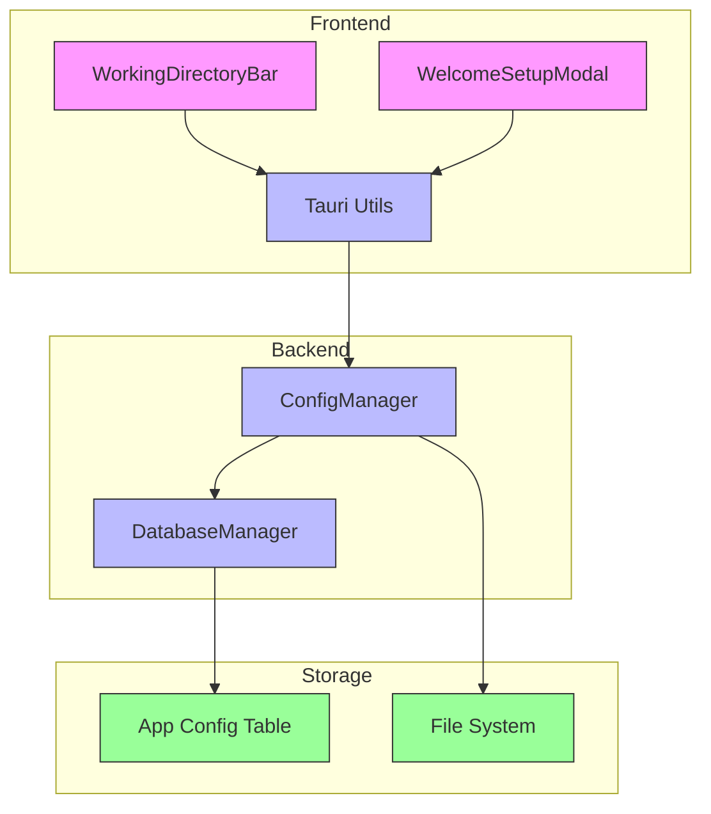
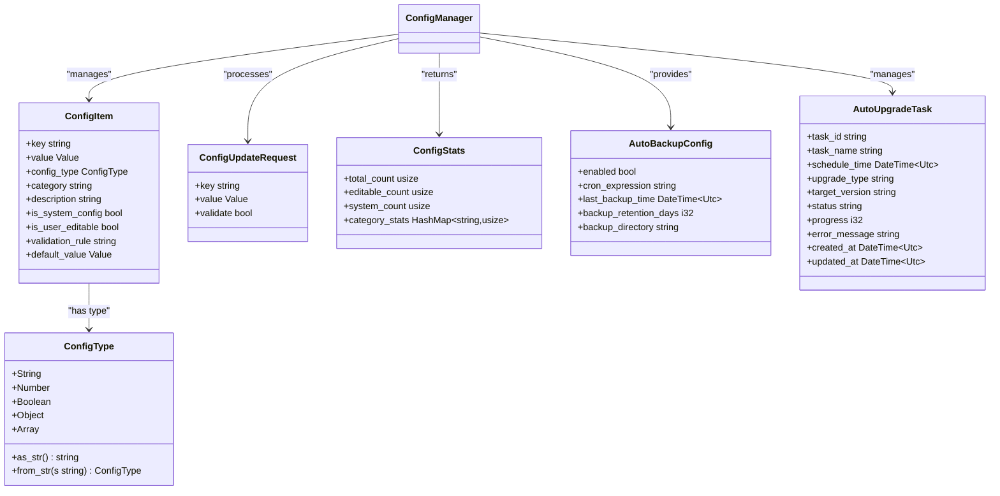
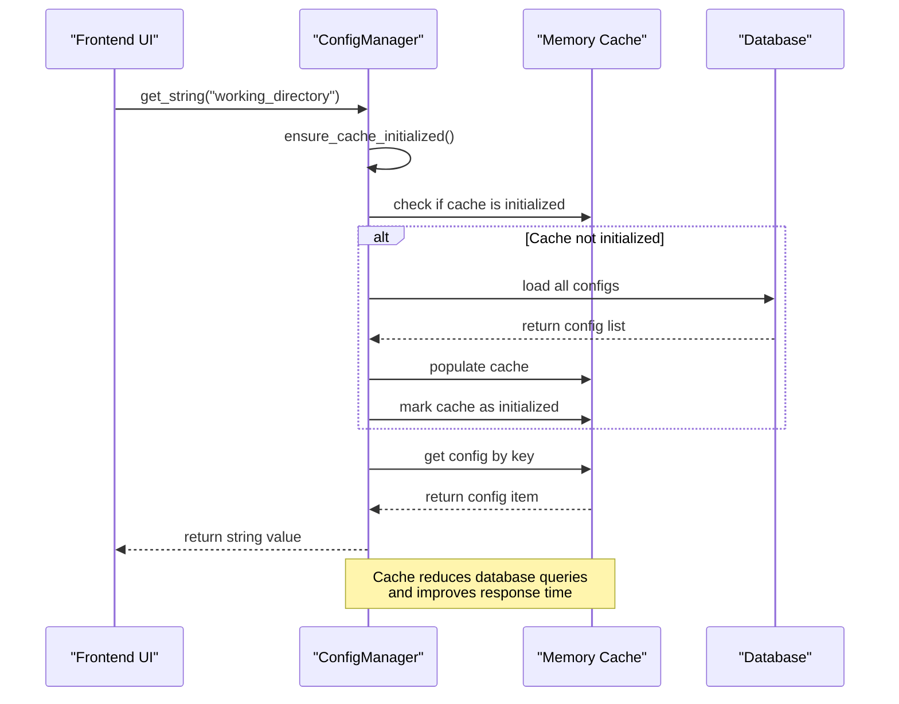
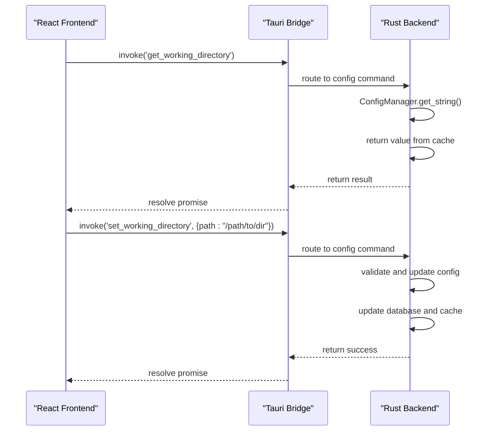
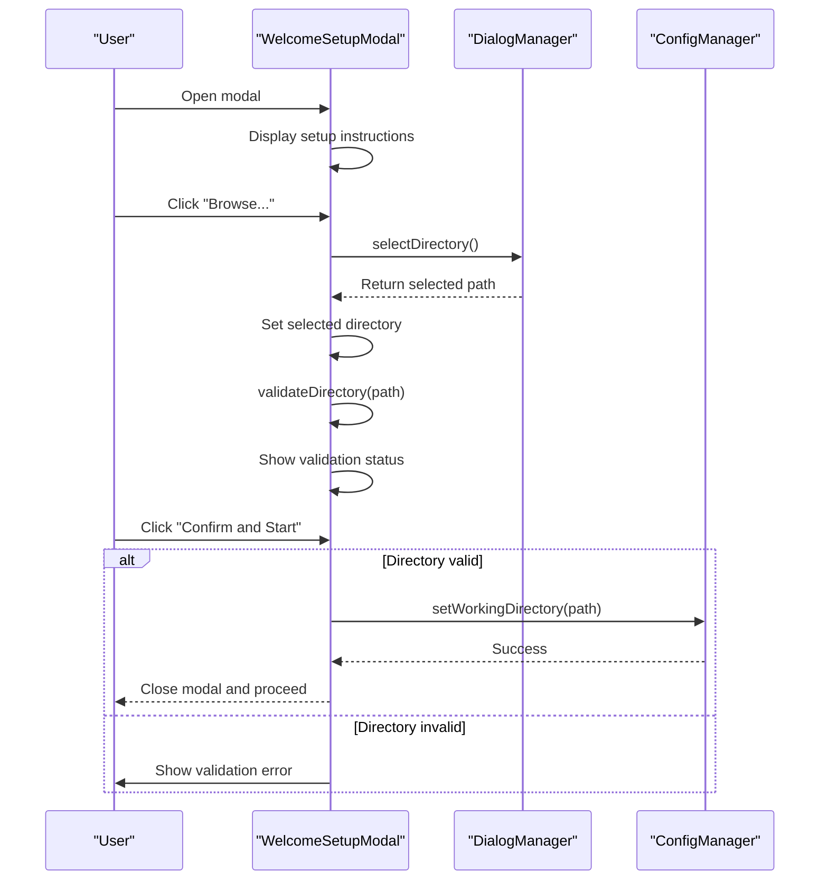

# Configuration and User Settings

<cite>
**Referenced Files in This Document**   
- [config_manager.rs](file://client-core/src/config_manager.rs#L0-L810)
- [tauri.ts](file://cli-ui/src/utils/tauri.ts#L0-L920)
- [WorkingDirectoryBar.tsx](file://cli-ui/src/components/WorkingDirectoryBar.tsx#L0-L197)
- [WelcomeSetupModal.tsx](file://cli-ui/src/components/WelcomeSetupModal.tsx#L0-L227)
</cite>

## Table of Contents
1. [Introduction](#introduction)
2. [Configuration Architecture Overview](#configuration-architecture-overview)
3. [Configuration Schema and Data Model](#configuration-schema-and-data-model)
4. [Configuration Persistence and Storage](#configuration-persistence-and-storage)
5. [Frontend-Backend Configuration Synchronization](#frontend-backend-configuration-synchronization)
6. [Working Directory Management](#working-directory-management)
7. [Initial Configuration Setup](#initial-configuration-setup)
8. [Error Handling and Recovery](#error-handling-and-recovery)
9. [Common Issues and Troubleshooting](#common-issues-and-troubleshooting)
10. [Extending the Configuration System](#extending-the-configuration-system)

## Introduction
The Duck Client application implements a robust configuration system that manages user settings across application restarts and synchronizes state between the frontend and backend components. This document details the architecture, implementation, and usage patterns of the configuration system, focusing on how user preferences such as working directory, auto-backup settings, and service endpoints are stored, retrieved, and maintained. The system leverages Tauri's filesystem and configuration APIs to provide a seamless user experience while ensuring data integrity and persistence.

## Configuration Architecture Overview

The configuration system follows a layered architecture with clear separation between frontend components, backend services, and persistent storage. The core components work together to provide a reliable configuration management solution:



**Diagram sources**
- [config_manager.rs](file://client-core/src/config_manager.rs#L0-L810)
- [tauri.ts](file://cli-ui/src/utils/tauri.ts#L0-L920)
- [WorkingDirectoryBar.tsx](file://cli-ui/src/components/WorkingDirectoryBar.tsx#L0-L197)
- [WelcomeSetupModal.tsx](file://cli-ui/src/components/WelcomeSetupModal.tsx#L0-L227)

**Section sources**
- [config_manager.rs](file://client-core/src/config_manager.rs#L0-L810)
- [tauri.ts](file://cli-ui/src/utils/tauri.ts#L0-L920)

## Configuration Schema and Data Model

The configuration system uses a structured schema to store various user settings and application preferences. The primary configuration model is implemented in the `ConfigManager` class, which defines a comprehensive set of configuration types and validation rules.

### Core Configuration Types
The system supports multiple configuration value types, each with specific validation and storage characteristics:



**Diagram sources**
- [config_manager.rs](file://client-core/src/config_manager.rs#L0-L810)

**Section sources**
- [config_manager.rs](file://client-core/src/config_manager.rs#L0-L810)

### Auto Backup Configuration Schema
The auto-backup feature uses a dedicated configuration schema that includes scheduling, retention, and directory settings:

**AutoBackupConfig Fields**
- **enabled**: boolean - Whether auto-backup is enabled
- **cron_expression**: string - Cron expression for backup schedule (default: "0 2 * * *")
- **last_backup_time**: DateTime~UTC~ - Timestamp of last backup execution
- **backup_retention_days**: i32 - Number of days to retain backup files (default: 7)
- **backup_directory**: string - Path where backups are stored (default: "./backups")

The configuration manager provides specialized methods for handling auto-backup settings:

```typescript
// Example of auto-backup configuration methods
async get_auto_backup_config(): Result<AutoBackupConfig> {
    // Retrieves complete auto-backup configuration
    // Combines multiple config values into a single object
}

async set_auto_backup_enabled(enabled: bool): Result<()> {
    // Updates the enabled state in the configuration
}

async set_auto_backup_cron(cron_expr: &str): Result<()> {
    // Updates the cron expression for backup scheduling
}

async update_last_backup_time(backup_time: DateTime<UTC>, success: bool): Result<()> {
    // Records the timestamp and status of the last backup
}
```

## Configuration Persistence and Storage

The configuration system implements a persistent storage mechanism that ensures user settings are preserved across application restarts and system crashes.

### Database Storage Structure
Configuration data is stored in a DuckDB database using the following schema:

**app_config Table Structure**
- **config_key**: VARCHAR - Unique identifier for the configuration item
- **config_value**: TEXT - JSON-serialized value of the configuration
- **config_type**: VARCHAR - Type of the configuration value (STRING, NUMBER, BOOLEAN, OBJECT, ARRAY)
- **category**: VARCHAR - Logical grouping of configuration items
- **description**: TEXT - Human-readable description of the configuration
- **is_system_config**: BOOLEAN - Whether the configuration is managed by the system
- **is_user_editable**: BOOLEAN - Whether the user can modify the configuration
- **validation_rule**: TEXT - Optional validation rule for the configuration
- **default_value**: TEXT - JSON-serialized default value
- **created_at**: TIMESTAMP - Creation timestamp
- **updated_at**: TIMESTAMP - Last update timestamp

### Memory Caching and Performance Optimization
The `ConfigManager` implements an in-memory caching layer to improve performance and reduce database access:



**Diagram sources**
- [config_manager.rs](file://client-core/src/config_manager.rs#L0-L810)

**Section sources**
- [config_manager.rs](file://client-core/src/config_manager.rs#L0-L810)

The caching mechanism provides several benefits:
- **Reduced database queries**: Configuration values are loaded once and cached in memory
- **Improved performance**: Subsequent reads are served from memory
- **Consistency**: Cache ensures consistent state across concurrent requests
- **Initialization control**: Cache initialization is synchronized to prevent race conditions

## Frontend-Backend Configuration Synchronization

The system implements a robust synchronization mechanism between the frontend and backend components using Tauri's invoke system.

### Tauri Command Bridge
The configuration system uses Tauri's command invocation pattern to bridge the frontend and backend:



**Diagram sources**
- [tauri.ts](file://cli-ui/src/utils/tauri.ts#L0-L920)
- [config_manager.rs](file://client-core/src/config_manager.rs#L0-L810)

**Section sources**
- [tauri.ts](file://cli-ui/src/utils/tauri.ts#L0-L920)
- [config_manager.rs](file://client-core/src/config_manager.rs#L0-L810)

### Configuration Manager Wrapper
The frontend uses a `ConfigManager` wrapper class that abstracts the Tauri invocation details:

```typescript
export class ConfigManager {
  private static readonly CONFIG_DIR = 'duck-client';
  private static readonly CONFIG_FILE = 'config.json';

  /**
   * Get working directory from backend
   */
  static async getWorkingDirectory(): Promise<string | null> {
    try {
      return await invoke('get_working_directory');
    } catch (error) {
      console.error('Get working directory failed:', error);
      return null;
    }
  }

  /**
   * Set working directory in backend
   */
  static async setWorkingDirectory(path: string): Promise<boolean> {
    try {
      await invoke('set_working_directory', { path });
      return true;
    } catch (error) {
      console.error('Set working directory failed:', error);
      return false;
    }
  }
}
```

This wrapper provides:
- **Error handling**: Graceful degradation when configuration operations fail
- **Type safety**: Clear method signatures with appropriate return types
- **Abstraction**: Hides the complexity of Tauri invocations from UI components
- **Consistency**: Standardized interface for all configuration operations

## Working Directory Management

The working directory is a critical configuration setting that determines the base path for all application operations.

### WorkingDirectoryBar Component
The `WorkingDirectoryBar` component provides a user interface for managing the working directory:

```mermaid
flowchart TD
A[Component Mount] --> B{Check workingDirectory prop}
B --> |Defined| C[Set current directory]
B --> |Undefined| D[Load saved directory]
D --> E[ConfigManager.getWorkingDirectory()]
E --> F{Directory exists?}
F --> |Yes| G[Validate directory]
F --> |No| H[Set to none]
G --> I[FileSystemManager.validateDirectory()]
I --> J{Valid?}
J --> |Yes| K[Set validation state to valid]
J --> |No| L[Set validation state to invalid]
M[User clicks "Select Directory"] --> N[DialogManager.selectDirectory()]
N --> O{Directory selected?}
O --> |Yes| P[Set current directory]
P --> Q[ConfigManager.setWorkingDirectory()]
Q --> R[Validate directory]
R --> S[Update UI state]
```

**Diagram sources**
- [WorkingDirectoryBar.tsx](file://cli-ui/src/components/WorkingDirectoryBar.tsx#L0-L197)

**Section sources**
- [WorkingDirectoryBar.tsx](file://cli-ui/src/components/WorkingDirectoryBar.tsx#L0-L197)

### Directory Validation Process
When a working directory is selected or changed, the system performs comprehensive validation:

1. **Existence check**: Verify the directory path exists
2. **Permission check**: Ensure the application has read/write access
3. **Content validation**: Check for required files and structure
4. **Conflict detection**: Identify potential conflicts with existing processes

The validation is performed through a Tauri command that invokes backend logic:

```typescript
static async validateDirectory(path: string): Promise<{ valid: boolean; error?: string }> {
  try {
    return await invoke('validate_working_directory', { path });
  } catch (error) {
    return { valid: false, error: `Directory validation failed: ${error}` };
  }
}
```

## Initial Configuration Setup

The application provides a guided setup experience for new users through the `WelcomeSetupModal` component.

### WelcomeSetupModal Workflow
The initial configuration setup follows a structured workflow:



**Diagram sources**
- [WelcomeSetupModal.tsx](file://cli-ui/src/components/WelcomeSetupModal.tsx#L0-L227)

**Section sources**
- [WelcomeSetupModal.tsx](file://cli-ui/src/components/WelcomeSetupModal.tsx#L0-L227)

### Setup Process Details
The initial setup process includes several key features:

**User Guidance**
- Clear instructions about the purpose of the working directory
- Recommendations for suitable directory locations
- Warnings about system directories to avoid
- Examples of recommended directory paths

**Interactive Validation**
- Real-time validation feedback as the user selects a directory
- Visual indicators for validation status (spinner, success, error)
- Detailed error messages when validation fails
- Ability to retry validation with the same or different directory

**Configuration Persistence**
- Immediate saving of the selected working directory
- Integration with the main configuration system
- Error handling for configuration save failures
- Graceful degradation when configuration operations fail

## Error Handling and Recovery

The configuration system implements comprehensive error handling and recovery mechanisms to ensure data integrity and user experience.

### Configuration Validation
The system validates configuration values before storage to prevent data corruption:

```rust
/// Validate value type against expected configuration type
fn validate_value_type(&self, value: &Value, expected_type: &ConfigType) -> bool {
    match (value, expected_type) {
        (Value::String(_), ConfigType::String) => true,
        (Value::Number(_), ConfigType::Number) => true,
        (Value::Bool(_), ConfigType::Boolean) => true,
        (Value::Object(_), ConfigType::Object) => true,
        (Value::Array(_), ConfigType::Array) => true,
        _ => false,
    }
}
```

Validation occurs during:
- Configuration updates
- Cache initialization
- Batch configuration operations
- Type-specific value retrieval

### Error Recovery Mechanisms
The system implements several recovery strategies for common failure scenarios:

**Cache Initialization Failure**
- Retry mechanism with exponential backoff
- Fallback to default values when database access fails
- User notification for persistent failures
- Graceful degradation to limited functionality

**Corrupted Configuration Files**
- Automatic detection of invalid JSON or corrupted data
- Fallback to default configuration values
- User notification and option to reset configuration
- Backup of corrupted files for diagnostic purposes

**Permission Errors**
- Detailed error messages explaining the permission issue
- Suggestions for resolving permission problems
- Alternative storage locations when primary location is inaccessible
- User guidance for adjusting file system permissions

## Common Issues and Troubleshooting

This section addresses common issues encountered with the configuration system and provides troubleshooting guidance.

### Permission Errors When Writing Config Files
**Symptoms**: Configuration changes fail to save, error messages about file access permissions.

**Causes**:
- Insufficient write permissions on the configuration directory
- File system mounted as read-only
- Antivirus or security software blocking file operations
- Running the application in a restricted environment

**Solutions**:
1. Verify the application has write permissions to the configuration directory
2. Check if the file system is mounted as read-only
3. Temporarily disable security software to test if it's interfering
4. Run the application with elevated privileges (not recommended for production)
5. Change the configuration directory to a location with appropriate permissions

### Stale Configuration State in UI
**Symptoms**: UI displays outdated configuration values, changes don't reflect immediately.

**Causes**:
- Cache synchronization issues between frontend and backend
- Race conditions in asynchronous operations
- Missing state update notifications
- Component re-rendering issues

**Solutions**:
1. Implement proper state management with React hooks
2. Ensure configuration updates trigger UI re-renders
3. Use the `refresh_cache()` method when stale data is detected
4. Implement event listeners for configuration changes
5. Add debugging logs to trace configuration flow

### Migration of Legacy Configuration Formats
**Symptoms**: Application fails to start or configuration values are missing after update.

**Causes**:
- Schema changes between application versions
- Renamed or removed configuration keys
- Changes in data types or serialization format
- Database schema evolution without migration scripts

**Solutions**:
1. Implement versioned configuration schema
2. Create migration scripts for schema changes
3. Provide backward compatibility for deprecated keys
4. Implement graceful degradation for missing configuration
5. Include configuration reset option in the UI

## Extending the Configuration System

The configuration system is designed to be extensible for new features and requirements.

### Adding New Configuration Fields
To add a new configuration field, follow these steps:

1. **Define the configuration key and type** in the database schema
2. **Add the field to the appropriate category** with proper metadata
3. **Implement getter and setter methods** in the `ConfigManager`
4. **Add type-specific convenience methods** if needed
5. **Update the frontend wrapper** to expose the new configuration
6. **Create UI components** to allow user modification

Example of adding a new configuration field:

```rust
// Add to ConfigManager
pub async fn set_service_endpoint(&self, endpoint: &str) -> Result<()> {
    let value = Value::String(endpoint.to_string());
    self.update_config("service_endpoint", value).await
}

pub async fn get_service_endpoint(&self) -> Result<Option<String>> {
    self.get_string("service_endpoint").await
}
```

### Best Practices for Configuration Extension
- **Use descriptive keys**: Follow consistent naming conventions (e.g., snake_case)
- **Provide default values**: Ensure the application works with default settings
- **Document configuration**: Include descriptions and usage guidelines
- **Consider user permissions**: Mark configuration as user-editable or system-only
- **Validate input**: Implement appropriate validation rules
- **Plan for migration**: Consider backward compatibility for future changes

The configuration system provides a solid foundation for managing user settings and application preferences, ensuring a consistent and reliable user experience across sessions and deployments.