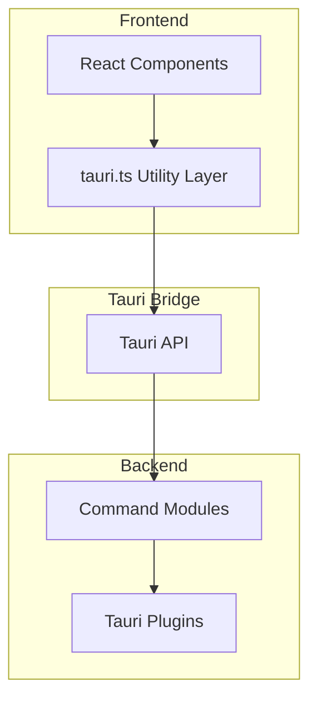
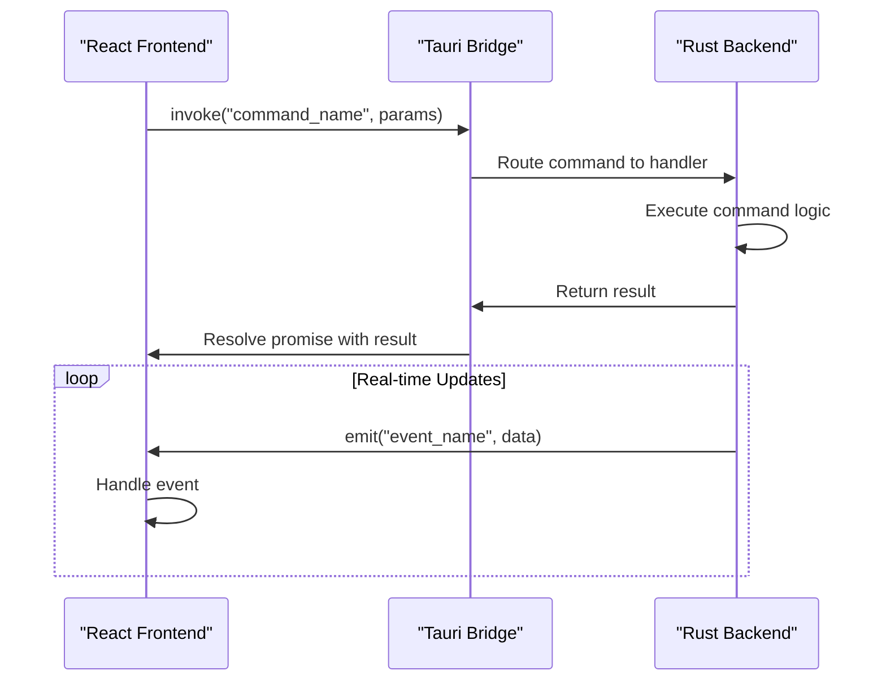
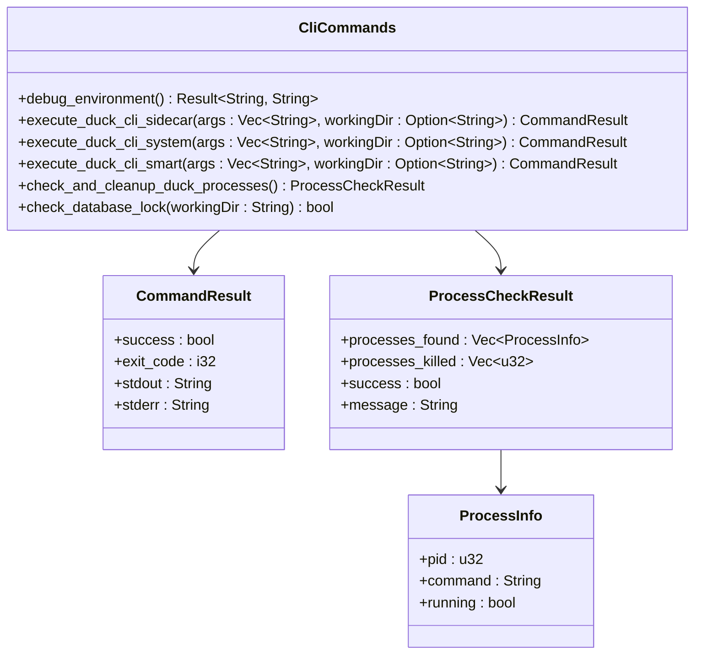
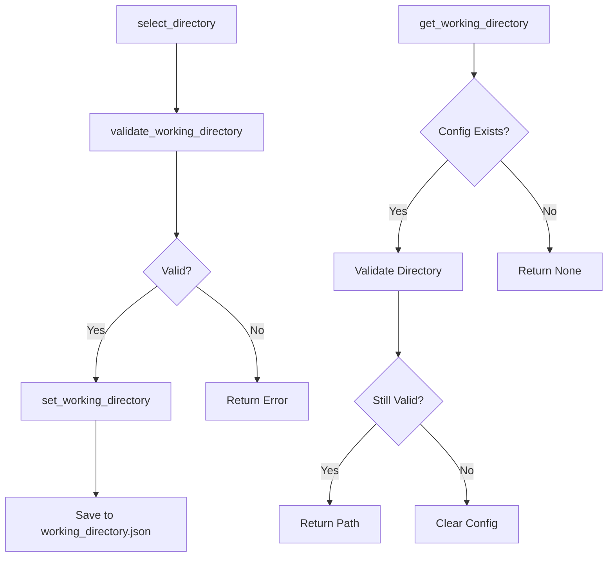
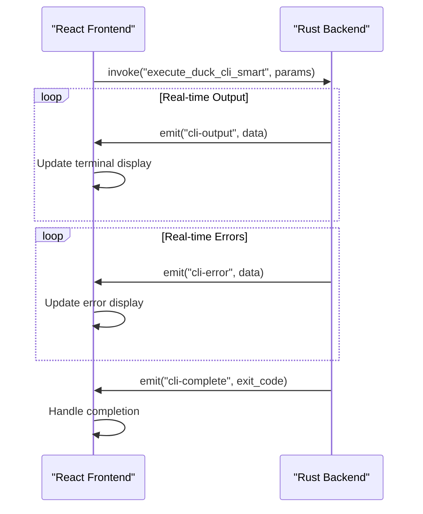

# Frontend-Backend Integration

<cite>
**Referenced Files in This Document**   
- [main.rs](file://cli-ui/src-tauri/src/main.rs)
- [lib.rs](file://cli-ui/src-tauri/src/lib.rs)
- [mod.rs](file://cli-ui/src-tauri/src/commands/mod.rs)
- [cli.rs](file://cli-ui/src-tauri/src/commands/cli.rs)
- [config.rs](file://cli-ui/src-tauri/src/commands/config.rs)
- [tauri.ts](file://cli-ui/src/utils/tauri.ts)
</cite>

## Table of Contents
1. [Project Structure](#project-structure)
2. [Architecture Overview](#architecture-overview)
3. [Command Registration and Invocation](#command-registration-and-invocation)
4. [Tauri Command Implementation](#tauri-command-implementation)
5. [Frontend Abstraction Layer](#frontend-abstraction-layer)
6. [Bidirectional Communication](#bidirectional-communication)
7. [Security Considerations](#security-considerations)
8. [Error Handling and Type Safety](#error-handling-and-type-safety)
9. [Common Integration Issues](#common-integration-issues)
10. [Best Practices](#best-practices)

## Project Structure

The project follows a Tauri-based architecture with a React frontend and Rust backend. The integration layer is primarily located in the `cli-ui` directory, which contains both the frontend components and the Tauri backend implementation.

The key directories for frontend-backend integration are:
- `cli-ui/src-tauri/src/commands`: Contains Rust command implementations exposed to the frontend
- `cli-ui/src/utils/tauri.ts`: Frontend utility layer that abstracts Tauri API calls
- `cli-ui/src-tauri/src/lib.rs`: Entry point for Tauri application with command registration



**Diagram sources**
- [tauri.ts](file://cli-ui/src/utils/tauri.ts)
- [lib.rs](file://cli-ui/src-tauri/src/lib.rs)
- [mod.rs](file://cli-ui/src-tauri/src/commands/mod.rs)

**Section sources**
- [tauri.ts](file://cli-ui/src/utils/tauri.ts)
- [lib.rs](file://cli-ui/src-tauri/src/lib.rs)

## Architecture Overview

The integration architecture follows a command-based pattern where the React frontend invokes Rust functions through Tauri's command system. The architecture consists of three main layers:

1. **Frontend Layer**: React components that use the `tauri.ts` utility classes to interact with the backend
2. **Bridge Layer**: Tauri framework that handles the communication between frontend and backend
3. **Backend Layer**: Rust command modules that perform system operations and return results

The communication flow follows a request-response pattern with additional event-based communication for real-time updates. Commands are registered in the Tauri builder and exposed to the frontend through the `invoke` API.



**Diagram sources**
- [lib.rs](file://cli-ui/src-tauri/src/lib.rs)
- [tauri.ts](file://cli-ui/src/utils/tauri.ts)
- [cli.rs](file://cli-ui/src-tauri/src/commands/cli.rs)

## Command Registration and Invocation

### Command Registration

Commands are registered in the Tauri application builder within `lib.rs`. The `invoke_handler` method uses `tauri::generate_handler!` to register all exposed commands:

```rust
// cli-ui/src-tauri/src/lib.rs
.invoke_handler(tauri::generate_handler![
    greet,
    commands::select_directory,
    commands::validate_working_directory,
    commands::set_working_directory,
    commands::get_working_directory,
    commands::execute_duck_cli_sidecar,
    commands::execute_duck_cli_system,
    commands::execute_duck_cli_smart,
    commands::get_cli_version,
    commands::check_cli_available,
    commands::check_and_cleanup_duck_processes,
    commands::check_database_lock,
    commands::debug_environment
])
```

Each command is defined with the `#[tauri::command]` attribute macro, which makes it callable from the frontend. The commands are organized in modules (`commands::cli` and `commands::config`) and re-exported through `mod.rs`.

### Command Invocation

Frontend components invoke commands using the `invoke` function from `@tauri-apps/api/core`. The `tauri.ts` utility file provides an abstraction layer that wraps these invocations with error handling and type safety.

```typescript
// Example command invocation
await invoke('get_working_directory');
await invoke('set_working_directory', { path: '/some/path' });
```

The command name in the frontend must match the function name in Rust (converted to snake_case). Parameters are passed as a single object that is deserialized by the backend.

**Section sources**
- [lib.rs](file://cli-ui/src-tauri/src/lib.rs)
- [tauri.ts](file://cli-ui/src/utils/tauri.ts)

## Tauri Command Implementation

### CLI Commands

The `cli.rs` module implements commands related to CLI operations and system interactions. Key commands include:

- `debug_environment`: Checks system environment variables and command availability
- `execute_duck_cli_sidecar`: Executes commands using Tauri's sidecar feature
- `execute_duck_cli_system`: Executes commands through the system shell
- `execute_duck_cli_smart`: Implements a fallback strategy between sidecar and system execution
- `check_and_cleanup_duck_processes`: Identifies and terminates conflicting processes
- `check_database_lock`: Checks if database files are locked



**Diagram sources**
- [cli.rs](file://cli-ui/src-tauri/src/commands/cli.rs)

### Configuration Commands

The `config.rs` module handles working directory management and configuration persistence:

- `select_directory`: Opens a dialog for directory selection
- `validate_working_directory`: Checks directory permissions and validity
- `set_working_directory`: Saves the working directory configuration
- `get_working_directory`: Retrieves the saved working directory

The configuration is stored as JSON in the application data directory, with validation performed before saving.



**Diagram sources**
- [config.rs](file://cli-ui/src-tauri/src/commands/config.rs)

## Frontend Abstraction Layer

The `tauri.ts` file provides a comprehensive abstraction layer that encapsulates Tauri API calls with improved error handling, type safety, and convenience methods.

### Class-Based Architecture

The utility is organized into several classes, each responsible for a specific domain:

```mermaid
classDiagram
class ShellManager {
+executeDuckCli(args : string[], workingDir? : string) Promise~CommandResult~
+executeSystemDuckCli(args : string[], workingDir? : string) Promise~CommandResult~
+executeDuckCliSmart(args : string[], workingDir? : string) Promise~CommandResult~
}
class DialogManager {
+selectDirectory() Promise~string | null~
+selectFile(title : string, filters? : FileFilter[]) Promise~string | null~
+saveFile(title : string, defaultPath? : string) Promise~string | null~
+showMessage(title : string, content : string, kind : DialogKind) Promise~void~
+askUser(title : string, message : string) Promise~boolean~
+confirmAction(title : string, message : string) Promise~boolean~
}
class FileSystemManager {
+pathExists(path : string) Promise~boolean~
+listDirectory(path : string) Promise~string[]~
+readTextFile(path : string) Promise~string | null~
+writeTextFile(path : string, content : string) Promise~boolean~
+createDirectory(path : string) Promise~boolean~
+remove(path : string) Promise~boolean~
+getFileInfo(path : string) Promise~FileInfo | null~
+validateDirectory(path : string) Promise~ValidationResult~
}
class UpdateManager {
+checkForUpdates() Promise~Update | null~
+downloadAndInstallUpdate(onProgress? : ProgressCallback) Promise~void~
}
class ProcessManager {
+checkAndCleanupDuckProcesses() Promise~ProcessCheckResult~
+checkDatabaseLock(workingDir : string) Promise~boolean~
+initializeProcessCheck(workingDir? : string) Promise~InitializationResult~
+restartApp() Promise~void~
+exitApp(code : number) Promise~void~
}
class ConfigManager {
+loadConfig() Promise~any~
+saveConfig(config : any) Promise~boolean~
+getWorkingDirectory() Promise~string | null~
+setWorkingDirectory(path : string) Promise~boolean~
}
class DuckCliManager {
+checkAvailable() Promise~boolean~
+getVersion() Promise~CliVersion~
+executeSidecar(args : string[], workingDir? : string) Promise~CommandResult~
+executeSystem(args : string[], workingDir? : string) Promise~CommandResult~
+executeSmart(args : string[], workingDir? : string) Promise~CommandResult~
+initialize(workingDir : string) Promise~OperationResult~
+checkStatus(workingDir : string) Promise~OperationResult~
+startService(workingDir : string) Promise~OperationResult~
+stopService(workingDir : string) Promise~OperationResult~
+restartService(workingDir : string) Promise~OperationResult~
+autoUpgradeDeploy(workingDir : string) Promise~OperationResult~
+checkCliUpdate(workingDir : string) Promise~OperationResult~
+upgradeService(workingDir : string, full : boolean) Promise~OperationResult~
+createBackup(workingDir : string) Promise~OperationResult~
+getBackupList(workingDir : string) Promise~BackupListResult~
+executeRollback(workingDir : string, backupId : number, force : boolean) Promise~OperationResult~
+clearCache(workingDir : string) Promise~OperationResult~
+clearDownloads(workingDir : string) Promise~OperationResult~
+getHelp(workingDir? : string) Promise~OperationResult~
+debugEnvironment() Promise~string~
}
ShellManager --> invoke
DialogManager --> invoke
FileSystemManager --> invoke
UpdateManager --> invoke
ProcessManager --> invoke
ConfigManager --> invoke
DuckCliManager --> invoke
```



**Diagram sources**
- [tauri.ts](file://cli-ui/src/utils/tauri.ts)

### Error Handling and Type Safety

The abstraction layer provides robust error handling with try-catch blocks around all Tauri invocations. Each method returns appropriate types with proper error fallbacks:

```typescript
static async getWorkingDirectory(): Promise<string | null> {
  try {
    return await invoke('get_working_directory');
  } catch (error) {
    console.error('Get working directory failed:', error);
    return null;
  }
}
```

TypeScript interfaces ensure type safety across the bridge:

```typescript
export interface ProcessCheckResult {
  processes_found: ProcessInfo[];
  processes_killed: number[];
  success: boolean;
  message: string;
}
```

These interfaces mirror the Rust structs defined with `#[derive(Serialize, Deserialize)]`.

**Section sources**
- [tauri.ts](file://cli-ui/src/utils/tauri.ts)

## Bidirectional Communication

### Event Emission from Rust to Frontend

In addition to request-response commands, the system uses event emission for real-time updates. The Rust backend emits events using the `Emitter` trait, which are then handled by the frontend.

Key events include:
- `cli-output`: Emitted when there is standard output from CLI commands
- `cli-error`: Emitted when there is error output from CLI commands
- `cli-complete`: Emitted when a CLI command completes

```rust
// In cli.rs
let _ = app.emit("cli-output", &output);
let _ = app.emit("cli-error", &output);
let _ = app.emit("cli-complete", exit_code);
```

### Event Handling in Frontend

The frontend sets up event listeners in `App.tsx` to handle these events and update the UI in real time:

```typescript
// In App.tsx
unlistenOutput = await listen('cli-output', (event) => {
  const output = event.payload as string;
  if (output.trim()) {
    addLogEntryRef.current('info', output.trim());
  }
});

unlistenError = await listen('cli-error', (event) => {
  const error = event.payload as string;
  if (error.trim()) {
    addLogEntryRef.current('error', error.trim());
  }
});
```

This pattern enables real-time terminal output display and progress updates without requiring polling.



**Diagram sources**
- [cli.rs](file://cli-ui/src-tauri/src/commands/cli.rs)
- [App.tsx](file://cli-ui/src/App.tsx)

## Security Considerations

### Command Exposure

The application follows the principle of least privilege by explicitly registering only the commands that are needed. All commands are defined with the `#[tauri::command]` attribute and must be manually added to the `generate_handler!` macro in `lib.rs`.

This explicit registration prevents accidental exposure of internal functions and provides a clear audit trail of all exposed functionality.

### Payload Validation

While Tauri automatically deserializes payloads using Serde, the application implements additional validation in critical commands:

- `validate_working_directory` checks directory permissions before allowing operations
- `set_working_directory` validates the directory before saving the configuration
- Path parameters are validated to prevent directory traversal attacks

The application also uses Tauri's built-in security features:
- File system access is restricted to user-selected directories
- Shell commands are limited to specific CLI operations
- Environment variables are sanitized when displayed

### Plugin Security

The application uses several Tauri plugins with appropriate security configurations:
- `tauri_plugin_fs`: Restricted to application data directory and user-selected paths
- `tauri_plugin_dialog`: Used for user interaction without direct file access
- `tauri_plugin_shell`: Used for executing specific CLI commands
- `tauri_plugin_updater`: Handles application updates securely

**Section sources**
- [lib.rs](file://cli-ui/src-tauri/src/lib.rs)
- [config.rs](file://cli-ui/src-tauri/src/commands/config.rs)
- [cli.rs](file://cli-ui/src-tauri/src/commands/cli.rs)

## Error Handling and Type Safety

### Error Handling Strategies

The integration layer implements comprehensive error handling at multiple levels:

1. **Rust Backend**: Commands return `Result<T, String>` with descriptive error messages
2. **Tauri Bridge**: Errors are serialized and transmitted to the frontend
3. **Frontend Abstraction**: Try-catch blocks wrap all invocations with error logging
4. **User Interface**: Errors are displayed in dialog boxes or terminal output

```typescript
static async setWorkingDirectory(path: string): Promise<boolean> {
  try {
    await invoke('set_working_directory', { path });
    return true;
  } catch (error) {
    console.error('Set working directory failed:', error);
    return false;
  }
}
```

### Type Safety with TypeScript

The frontend uses TypeScript interfaces that mirror the Rust structs, ensuring type consistency across the bridge:

```typescript
export interface ProcessCheckResult {
  processes_found: ProcessInfo[];
  processes_killed: number[];
  success: boolean;
  message: string;
}

export interface ProcessInfo {
  pid: number;
  command: string;
  running: boolean;
}
```

These interfaces are used in both the utility classes and React components, providing compile-time type checking and IDE support.

### Asynchronous Operation Management

All Tauri invocations are asynchronous and return Promises. The utility classes use async/await syntax for clean, readable code:

```typescript
static async executeSmart(
  args: string[], 
  workingDir?: string
): Promise<{ success: boolean; exit_code: number; stdout: string; stderr: string }> {
  try {
    return await invoke('execute_duck_cli_smart', { 
      args, 
      workingDir: workingDir || null 
    });
  } catch (error) {
    return {
      success: false,
      exit_code: -1,
      stdout: '',
      stderr: `智能执行失败: ${error}`
    };
  }
}
```

**Section sources**
- [tauri.ts](file://cli-ui/src/utils/tauri.ts)
- [cli.rs](file://cli-ui/src-tauri/src/commands/cli.rs)

## Common Integration Issues

### Unhandled Promise Rejections

When Tauri commands fail, they can cause unhandled promise rejections if not properly caught. The solution is to wrap all `invoke` calls in try-catch blocks:

```typescript
// Good: Proper error handling
try {
  await invoke('some_command');
} catch (error) {
  console.error('Command failed:', error);
}

// Bad: Unhandled rejection
await invoke('some_command'); // If this fails, it becomes an unhandled rejection
```

### Missing Command Registration

If a command is not registered in `lib.rs`, calling it from the frontend will result in an error. Always ensure commands are added to the `generate_handler!` macro:

```rust
.invoke_handler(tauri::generate_handler![
    // Make sure your command is listed here
    your_command_name,
])
```

### Type Mismatch Errors

Type mismatches between frontend and backend can cause serialization errors. Ensure that:
- TypeScript interfaces match Rust structs
- Field names use the same case (Rust snake_case maps to TypeScript camelCase)
- Optional fields are properly handled with `Option<T>` in Rust and `T | undefined` in TypeScript

### Event Listener Memory Leaks

Event listeners should be properly cleaned up to prevent memory leaks:

```typescript
useEffect(() => {
  let unlisten: any;
  
  const setup = async () => {
    unlisten = await listen('event_name', callback);
  };
  
  setup();
  
  return () => {
    if (unlisten) {
      unlisten();
    }
  };
}, []);
```

**Section sources**
- [tauri.ts](file://cli-ui/src/utils/tauri.ts)
- [lib.rs](file://cli-ui/src-tauri/src/lib.rs)

## Best Practices

### Adding New Commands

When adding new commands, follow this process:

1. **Define the command in a Rust module**:
```rust
// In cli.rs or a new module
#[tauri::command]
async fn my_new_command(param: String) -> Result<String, String> {
    // Implementation
    Ok("success".to_string())
}
```

2. **Export the command in mod.rs**:
```rust
// In commands/mod.rs
pub use my_command::*;
```

3. **Register the command in lib.rs**:
```rust
// In lib.rs
.invoke_handler(tauri::generate_handler![
    commands::my_new_command,
])
```

4. **Add a wrapper in tauri.ts**:
```typescript
// In tauri.ts
static async myNewCommand(param: string): Promise<string | null> {
  try {
    return await invoke('my_new_command', { param });
  } catch (error) {
    console.error('My command failed:', error);
    return null;
  }
}
```

### Maintaining Type Consistency

To maintain type consistency across the bridge:

1. **Use shared interfaces**: Define TypeScript interfaces that mirror Rust structs
2. **Document field mappings**: Note any case or naming conversions
3. **Use strict TypeScript settings**: Enable strict mode in tsconfig.json
4. **Test round-trip serialization**: Verify that data can be sent and received correctly

### Performance Optimization

For better performance:

1. **Batch related operations**: Combine multiple commands when possible
2. **Use appropriate command types**: Sidecar commands are more secure but system commands may be faster
3. **Implement caching**: Cache results of expensive operations
4. **Use events for real-time updates**: Avoid polling with events instead

### Testing and Debugging

For effective testing and debugging:

1. **Use the debug_environment command**: This provides valuable system information
2. **Implement comprehensive logging**: Log both frontend and backend operations
3. **Test error conditions**: Verify error handling works correctly
4. **Use Tauri development tools**: Leverage the Tauri CLI for debugging

**Section sources**
- [tauri.ts](file://cli-ui/src/utils/tauri.ts)
- [lib.rs](file://cli-ui/src-tauri/src/lib.rs)
- [cli.rs](file://cli-ui/src-tauri/src/commands/cli.rs)
- [config.rs](file://cli-ui/src-tauri/src/commands/config.rs)