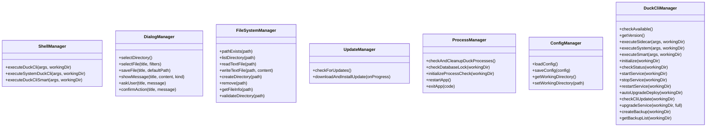

# GUI Application Guide

<cite>
**Referenced Files in This Document**   
- [App.tsx](file://cli-ui/src/App.tsx#L0-L465)
- [tauri.ts](file://cli-ui/src/utils/tauri.ts#L0-L920)
- [commandConfigs.ts](file://cli-ui/src/config/commandConfigs.ts#L0-L321)
- [index.ts](file://cli-ui/src/types/index.ts#L0-L87)
- [ParameterInputModal.tsx](file://cli-ui/src/components/ParameterInputModal.tsx#L0-L289)
- [OperationPanel.tsx](file://cli-ui/src/components/OperationPanel.tsx#L0-L506)
- [BackupSelectionModal.tsx](file://cli-ui/src/components/BackupSelectionModal.tsx#L0-L303)
- [TerminalWindow.tsx](file://cli-ui/src/components/TerminalWindow.tsx#L0-L412)
- [WorkingDirectoryBar.tsx](file://cli-ui/src/components/WorkingDirectoryBar.tsx#L0-L150)
- [WelcomeSetupModal.tsx](file://cli-ui/src/components/WelcomeSetupModal.tsx#L0-L200)
</cite>

## Table of Contents
1. [Introduction](#introduction)
2. [Project Structure](#project-structure)
3. [Core Components](#core-components)
4. [Architecture Overview](#architecture-overview)
5. [Detailed Component Analysis](#detailed-component-analysis)
6. [Integration with Tauri Backend](#integration-with-tauri-backend)
7. [Configuration System](#configuration-system)
8. [Feature Walkthroughs](#feature-walkthroughs)
9. [UI Issues and Troubleshooting](#ui-issues-and-troubleshooting)
10. [Customization and Extension](#customization-and-extension)

## Introduction
The Duck Client GUI application is a Tauri-based desktop interface for managing Docker services through the nuwax-cli command-line tool. Built with React and TypeScript, the application provides an intuitive graphical interface for performing complex operations such as service initialization, upgrades, backups, and status monitoring. The application follows a component-based architecture with clear separation of concerns between UI presentation, state management, and backend integration. This guide provides comprehensive documentation of the application's architecture, components, and functionality to enable effective use and extension of the system.

## Project Structure
The project follows a standard React application structure with clear organization of components, utilities, and configuration files. The main application code resides in the `cli-ui` directory, which contains the React frontend and Tauri integration code.


**Diagram sources**
- [App.tsx](file://cli-ui/src/App.tsx#L0-L465)
- [tauri.ts](file://cli-ui/src/utils/tauri.ts#L0-L920)

**Section sources**
- [App.tsx](file://cli-ui/src/App.tsx#L0-L465)
- [tauri.ts](file://cli-ui/src/utils/tauri.ts#L0-L920)

## Core Components
The application is built around several core components that handle different aspects of the user interface and functionality. These components work together to provide a cohesive user experience for managing Docker services.

**Section sources**
- [App.tsx](file://cli-ui/src/App.tsx#L0-L465)
- [OperationPanel.tsx](file://cli-ui/src/components/OperationPanel.tsx#L0-L506)
- [TerminalWindow.tsx](file://cli-ui/src/components/TerminalWindow.tsx#L0-L412)

## Architecture Overview
The application follows a layered architecture with clear separation between presentation, state management, and backend integration. The React frontend components communicate with the Tauri backend through a well-defined utility module that handles command execution, file system operations, and system interactions.


**Diagram sources**
- [App.tsx](file://cli-ui/src/App.tsx#L0-L465)
- [tauri.ts](file://cli-ui/src/utils/tauri.ts#L0-L920)

## Detailed Component Analysis

### App Component Analysis
The App component serves as the main container for the application, managing global state and coordinating between different UI components. It handles application initialization, event listening, and state propagation to child components.

#### For Object-Oriented Components:


**Diagram sources**
- [App.tsx](file://cli-ui/src/App.tsx#L0-L465)
- [index.ts](file://cli-ui/src/types/index.ts#L0-L87)

**Section sources**
- [App.tsx](file://cli-ui/src/App.tsx#L0-L465)
- [index.ts](file://cli-ui/src/types/index.ts#L0-L87)

### OperationPanel Component Analysis
The OperationPanel component provides the main interface for executing commands and managing Docker services. It displays a grid of action buttons that correspond to different CLI commands, with appropriate visual feedback during execution.

#### For Object-Oriented Components:


**Diagram sources**
- [OperationPanel.tsx](file://cli-ui/src/components/OperationPanel.tsx#L0-L506)
- [commandConfigs.ts](file://cli-ui/src/config/commandConfigs.ts#L0-L321)

**Section sources**
- [OperationPanel.tsx](file://cli-ui/src/components/OperationPanel.tsx#L0-L506)
- [commandConfigs.ts](file://cli-ui/src/config/commandConfigs.ts#L0-L321)

### TerminalWindow Component Analysis
The TerminalWindow component displays real-time output from executed commands, providing users with immediate feedback on their operations. It implements a circular buffer to manage large volumes of log data efficiently.

#### For Object-Oriented Components:


**Diagram sources**
- [TerminalWindow.tsx](file://cli-ui/src/components/TerminalWindow.tsx#L0-L412)
- [index.ts](file://cli-ui/src/types/index.ts#L0-L87)

**Section sources**
- [TerminalWindow.tsx](file://cli-ui/src/components/TerminalWindow.tsx#L0-L412)
- [index.ts](file://cli-ui/src/types/index.ts#L0-L87)

### ParameterInputModal Component Analysis
The ParameterInputModal component provides a dynamic interface for collecting parameters from users before executing commands that require additional input. It supports various input types and validation rules.

#### For Object-Oriented Components:
```mermaid
classDiagram
class ParameterInputModal {
+isOpen : boolean
+commandConfig : CommandConfig | null
+onConfirm : Function
+onCancel : Function
+parameters : ParameterInputResult
+errors : { [key : string] : string }
-updateParameter(name, value)
-validateParameters()
-handleConfirm()
-renderParameterInput(param)
}
class CommandConfig {
+id : string
+name : string
+description : string
+parameters : CommandParameter[]
+examples? : string[]
}
class CommandParameter {
+name : string
+label : string
+type : string
+required? : boolean
+defaultValue? : any
+placeholder? : string
+description? : string
+options? : { value : string; label : string }[]
+min? : number
+max? : number
}
class ParameterInputResult {
[key : string] : any
}
ParameterInputModal --> CommandConfig : "uses"
ParameterInputModal --> CommandParameter : "renders"
ParameterInputModal --> ParameterInputResult : "produces"
```

**Diagram sources**
- [ParameterInputModal.tsx](file://cli-ui/src/components/ParameterInputModal.tsx#L0-L289)
- [commandConfigs.ts](file://cli-ui/src/config/commandConfigs.ts#L0-L321)

**Section sources**
- [ParameterInputModal.tsx](file://cli-ui/src/components/ParameterInputModal.tsx#L0-L289)
- [commandConfigs.ts](file://cli-ui/src/config/commandConfigs.ts#L0-L321)

### BackupSelectionModal Component Analysis
The BackupSelectionModal component allows users to select from available backups when performing a rollback operation. It displays detailed information about each backup and handles the selection process.

#### For Object-Oriented Components:


**Diagram sources**
- [BackupSelectionModal.tsx](file://cli-ui/src/components/BackupSelectionModal.tsx#L0-L303)
- [index.ts](file://cli-ui/src/types/index.ts#L0-L87)

**Section sources**
- [BackupSelectionModal.tsx](file://cli-ui/src/components/BackupSelectionModal.tsx#L0-L303)
- [index.ts](file://cli-ui/src/types/index.ts#L0-L87)

## Integration with Tauri Backend
The application integrates with the Tauri backend through the `utils/tauri.ts` module, which provides a comprehensive set of classes for interacting with system commands, file system operations, and application processes.

### Tauri Integration Flow


**Diagram sources**
- [tauri.ts](file://cli-ui/src/utils/tauri.ts#L0-L920)
- [App.tsx](file://cli-ui/src/App.tsx#L0-L465)

**Section sources**
- [tauri.ts](file://cli-ui/src/utils/tauri.ts#L0-L920)
- [App.tsx](file://cli-ui/src/App.tsx#L0-L465)

### Tauri Utility Classes
The `tauri.ts` file exports several utility classes that encapsulate different aspects of Tauri functionality:

- **ShellManager**: Executes nuwax-cli commands using either Sidecar or system command execution
- **DialogManager**: Handles file dialogs, message boxes, and user confirmation dialogs
- **FileSystemManager**: Manages file system operations like reading, writing, and directory listing
- **UpdateManager**: Handles application updates and version checking
- **ProcessManager**: Manages application processes and checks for conflicts
- **ConfigManager**: Handles application configuration storage and retrieval
- **DuckCliManager**: Provides high-level methods for executing specific CLI commands



**Diagram sources**
- [tauri.ts](file://cli-ui/src/utils/tauri.ts#L0-L920)

**Section sources**
- [tauri.ts](file://cli-ui/src/utils/tauri.ts#L0-L920)

## Configuration System
The application uses a configuration system to persist user settings across sessions, including the working directory and other preferences.

### Configuration Flow


**Diagram sources**
- [tauri.ts](file://cli-ui/src/utils/tauri.ts#L0-L920)
- [App.tsx](file://cli-ui/src/App.tsx#L0-L465)

**Section sources**
- [tauri.ts](file://cli-ui/src/utils/tauri.ts#L0-L920)
- [App.tsx](file://cli-ui/src/App.tsx#L0-L465)

### Configuration Implementation
The configuration system is implemented in the `ConfigManager` class within `tauri.ts`. It stores configuration data in a JSON file within the application's data directory.


**Diagram sources**
- [tauri.ts](file://cli-ui/src/utils/tauri.ts#L0-L920)

**Section sources**
- [tauri.ts](file://cli-ui/src/utils/tauri.ts#L0-L920)

## Feature Walkthroughs

### Service Initialization
The service initialization process sets up the application environment and prepares it for use.

#### Initialization Sequence


**Diagram sources**
- [App.tsx](file://cli-ui/src/App.tsx#L0-L465)
- [tauri.ts](file://cli-ui/src/utils/tauri.ts#L0-L920)

**Section sources**
- [App.tsx](file://cli-ui/src/App.tsx#L0-L465)
- [tauri.ts](file://cli-ui/src/utils/tauri.ts#L0-L920)

### Upgrade Execution
The upgrade execution feature allows users to update their Docker services to the latest version.

#### Upgrade Sequence


**Diagram sources**
- [OperationPanel.tsx](file://cli-ui/src/components/OperationPanel.tsx#L0-L506)
- [tauri.ts](file://cli-ui/src/utils/tauri.ts#L0-L920)

**Section sources**
- [OperationPanel.tsx](file://cli-ui/src/components/OperationPanel.tsx#L0-L506)
- [tauri.ts](file://cli-ui/src/utils/tauri.ts#L0-L920)

### Backup Management
The backup management system allows users to create and restore backups of their service data.

#### Backup Creation Sequence


#### Backup Restoration Sequence


**Diagram sources**
- [OperationPanel.tsx](file://cli-ui/src/components/OperationPanel.tsx#L0-L506)
- [BackupSelectionModal.tsx](file://cli-ui/src/components/BackupSelectionModal.tsx#L0-L303)
- [tauri.ts](file://cli-ui/src/utils/tauri.ts#L0-L920)

**Section sources**
- [OperationPanel.tsx](file://cli-ui/src/components/OperationPanel.tsx#L0-L506)
- [BackupSelectionModal.tsx](file://cli-ui/src/components/BackupSelectionModal.tsx#L0-L303)
- [tauri.ts](file://cli-ui/src/utils/tauri.ts#L0-L920)

### Status Monitoring
The status monitoring feature provides real-time feedback on command execution through the terminal window.

#### Status Monitoring Flow


**Diagram sources**
- [App.tsx](file://cli-ui/src/App.tsx#L0-L465)
- [TerminalWindow.tsx](file://cli-ui/src/components/TerminalWindow.tsx#L0-L412)

**Section sources**
- [App.tsx](file://cli-ui/src/App.tsx#L0-L465)
- [TerminalWindow.tsx](file://cli-ui/src/components/TerminalWindow.tsx#L0-L412)

## UI Issues and Troubleshooting

### Modal Display Problems
Modal display issues can occur when multiple modals are opened simultaneously or when the application state is not properly synchronized.

#### Common Causes and Solutions
- **Overlapping Modals**: Ensure only one modal is open at a time by properly managing state variables
- **Z-Index Issues**: Use consistent z-index values across modals (z-50 for background, z-50 for modal container)
- **Event Listener Conflicts**: Clean up event listeners when modals are closed to prevent memory leaks


**Section sources**
- [ParameterInputModal.tsx](file://cli-ui/src/components/ParameterInputModal.tsx#L0-L289)
- [BackupSelectionModal.tsx](file://cli-ui/src/components/BackupSelectionModal.tsx#L0-L303)

### State Synchronization Errors
State synchronization errors occur when different components have inconsistent views of the application state.

#### Common Causes and Solutions
- **Stale State References**: Use useRef to maintain up-to-date references to state values
- **Asynchronous State Updates**: Use callback functions in setState to ensure latest state is used
- **Event Listener Timing**: Ensure event listeners are set up before commands are executed


**Section sources**
- [App.tsx](file://cli-ui/src/App.tsx#L0-L465)
- [OperationPanel.tsx](file://cli-ui/src/components/OperationPanel.tsx#L0-L506)

### Terminal Performance Bottlenecks
The terminal component can experience performance issues when handling large volumes of log data.

#### Optimization Strategies
- **Circular Buffer**: Implement a circular buffer to limit the number of stored log entries
- **Batch Updates**: Update the UI in batches rather than for each log entry
- **Virtual Scrolling**: Implement virtual scrolling for large log sets


**Section sources**
- [App.tsx](file://cli-ui/src/App.tsx#L0-L465)
- [TerminalWindow.tsx](file://cli-ui/src/components/TerminalWindow.tsx#L0-L412)

## Customization and Extension

### Interface Appearance Customization
The application's appearance can be customized using Tailwind CSS, which is already integrated into the project.

#### Customization Options
- **Color Scheme**: Modify the `tailwind.config.js` file to change the color palette
- **Typography**: Adjust font sizes and families in the CSS files
- **Layout**: Modify component layouts using Tailwind's grid and flexbox utilities


**Section sources**
- [tailwind.config.js](file://cli-ui/tailwind.config.js)
- [App.css](file://cli-ui/src/App.css)

### Functionality Extension
New functionality can be added by creating additional components and integrating them with the existing system.

#### Extension Process
```mermaid
flowchart TD
A[Identify New Feature] --> B[Create Component]
B --> C[Define Props and State]
C --> D[Implement Logic]
D --> E[Connect to Tauri Backend]
E --> F[Integrate with App Component]
F --> G[Test Feature]
G --> H[Deploy Extension]
```

**Section sources**
- [App.tsx](file://cli-ui/src/App.tsx#L0-L465)
- [tauri.ts](file://cli-ui/src/utils/tauri.ts#L0-L920)

### Adding New Commands
New commands can be added by extending the command configuration system.

#### Command Addition Process
1. Define the command configuration in `commandConfigs.ts`
2. Add the command to the OperationPanel's actionButtons array
3. Implement any required parameter input logic
4. Test the command integration

```typescript
// Example: Adding a new command configuration
export const commandConfigs: { [key: string]: CommandConfig } = {
  // ... existing commands
  'new-command': {
    id: 'new-command',
    name: 'New Command',
    description: 'Description of the new command',
    parameters: [
      {
        name: 'param1',
        label: 'Parameter 1',
        type: 'text',
        required: true,
        placeholder: 'Enter value',
        description: 'Description of parameter 1'
      }
    ],
    examples: [
      'duck-cli new-command --param1 value'
    ]
  }
};
```

**Section sources**
- [commandConfigs.ts](file://cli-ui/src/config/commandConfigs.ts#L0-L321)
- [OperationPanel.tsx](file://cli-ui/src/components/OperationPanel.tsx#L0-L506)