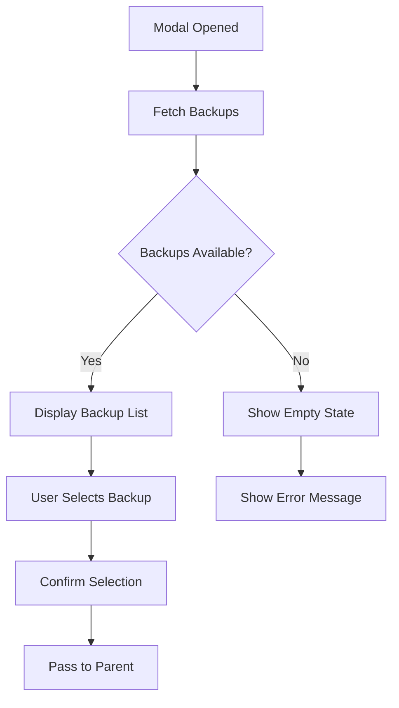
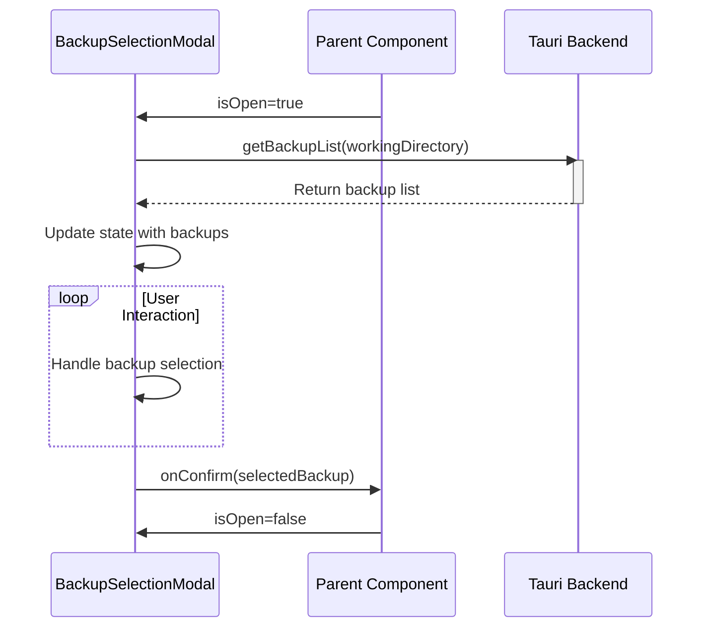
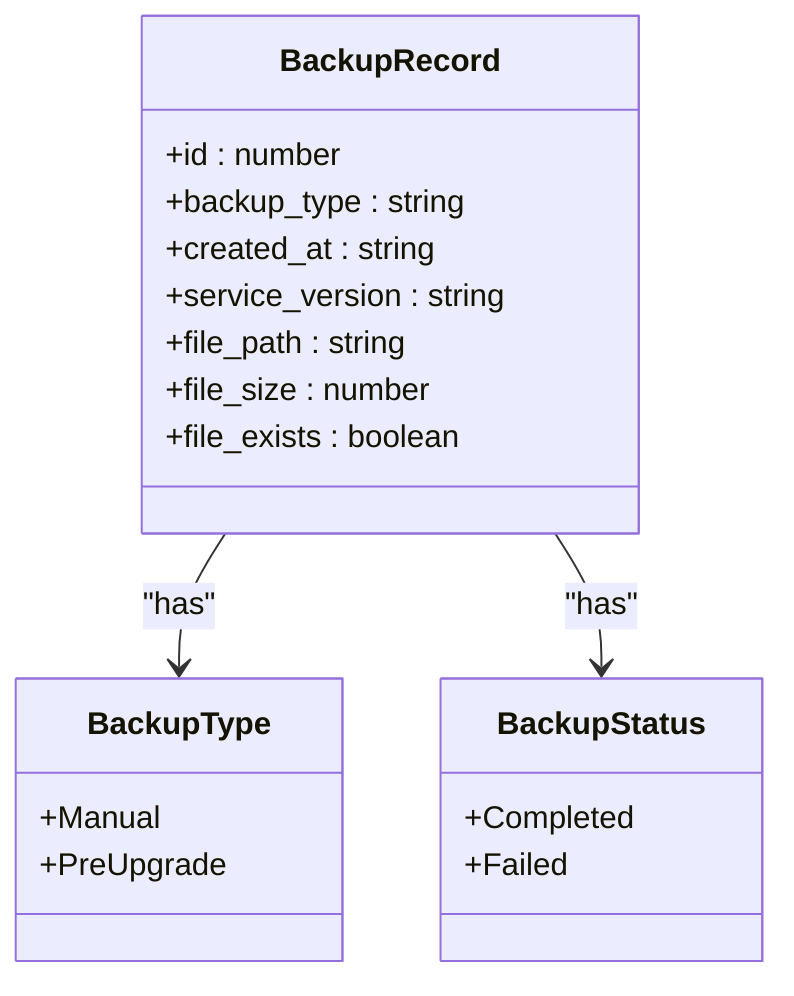
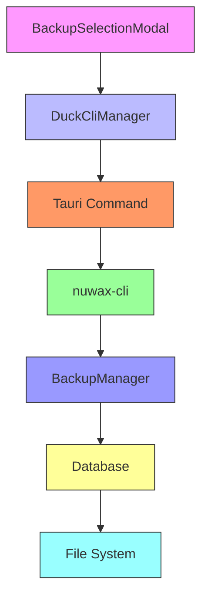
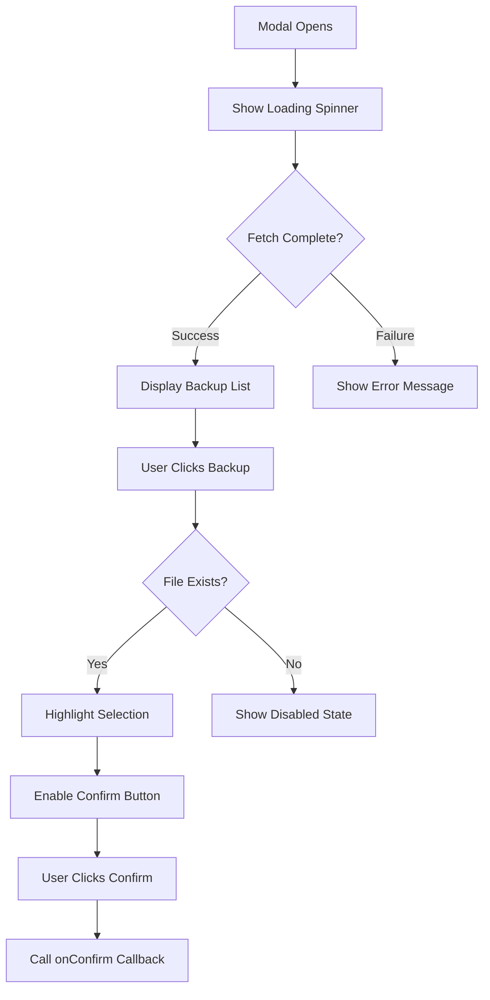
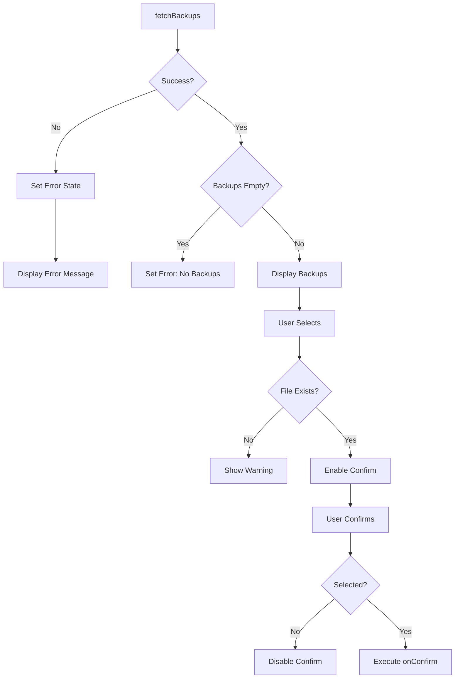

# Backup Selection Modal

<cite>
**Referenced Files in This Document**   
- [BackupSelectionModal.tsx](file://cli-ui/src/components/BackupSelectionModal.tsx)
- [tauri.ts](file://cli-ui/src/utils/tauri.ts)
- [backup.rs](file://client-core/src/backup.rs)
- [database.rs](file://client-core/src/database.rs)
- [cli.rs](file://cli-ui/src-tauri/src/commands/cli.rs)
</cite>

## Table of Contents
1. [Introduction](#introduction)
2. [Component Overview](#component-overview)
3. [Modal Lifecycle and State Management](#modal-lifecycle-and-state-management)
4. [Backup Data Structure](#backup-data-structure)
5. [Integration with Tauri Backend](#integration-with-tauri-backend)
6. [User Interface and Interaction Flow](#user-interface-and-interaction-flow)
7. [Error Handling and Validation](#error-handling-and-validation)
8. [Code Examples](#code-examples)
9. [Common Issues and Solutions](#common-issues-and-solutions)
10. [Customization and Extension](#customization-and-extension)

## Introduction
The BackupSelectionModal component provides a user interface for selecting backup files before performing critical operations such as service upgrades or data recovery. This document details the implementation, functionality, and integration points of this modal component, focusing on its role in the backup and restore workflow.

**Section sources**
- [BackupSelectionModal.tsx](file://cli-ui/src/components/BackupSelectionModal.tsx#L1-L303)

## Component Overview
The BackupSelectionModal is a React functional component that displays a list of available backups and allows users to select one for restoration. It is designed to be used as a modal dialog that appears when a user initiates a restore operation.

### Key Features
- Displays all available backups with metadata
- Shows backup type, creation time, version, and file size
- Validates file existence before selection
- Provides visual feedback for selected backup
- Integrates with Tauri backend for backup operations



**Diagram sources**
- [BackupSelectionModal.tsx](file://cli-ui/src/components/BackupSelectionModal.tsx#L1-L303)

**Section sources**
- [BackupSelectionModal.tsx](file://cli-ui/src/components/BackupSelectionModal.tsx#L1-L303)

## Modal Lifecycle and State Management
The modal manages its state through React hooks, handling the lifecycle from opening to closing.

### State Variables
- **backups**: Array of BackupRecord objects
- **selectedBackup**: Currently selected backup record
- **loading**: Boolean indicating fetch status
- **error**: Error message string

### Lifecycle Flow


**Diagram sources**
- [BackupSelectionModal.tsx](file://cli-ui/src/components/BackupSelectionModal.tsx#L1-L303)
- [tauri.ts](file://cli-ui/src/utils/tauri.ts#L720-L799)

**Section sources**
- [BackupSelectionModal.tsx](file://cli-ui/src/components/BackupSelectionModal.tsx#L1-L303)

## Backup Data Structure
The backup system uses a consistent data structure across the frontend and backend.

### BackupRecord Interface
```typescript
interface BackupRecord {
  id: number;
  backup_type: 'Manual' | 'PreUpgrade';
  created_at: string;
  service_version: string;
  file_path: string;
  file_size?: number;
  file_exists: boolean;
}
```

### Backend Implementation
The Rust backend defines the BackupRecord struct with additional metadata:

```rust
pub struct BackupRecord {
    pub id: i64,
    pub file_path: String,
    pub service_version: String,
    pub backup_type: BackupType,
    pub status: BackupStatus,
    pub created_at: DateTime<Utc>,
}
```



**Diagram sources**
- [BackupSelectionModal.tsx](file://cli-ui/src/components/BackupSelectionModal.tsx#L4-L12)
- [database.rs](file://client-core/src/database.rs#L0-L199)

**Section sources**
- [BackupSelectionModal.tsx](file://cli-ui/src/components/BackupSelectionModal.tsx#L4-L12)
- [database.rs](file://client-core/src/database.rs#L0-L199)

## Integration with Tauri Backend
The component integrates with the Tauri backend through a series of command invocations.

### Architecture Flow


### Command Chain
1. `BackupSelectionModal.fetchBackups()`
2. `DuckCliManager.getBackupList()`
3. `execute_duck_cli_smart(['rollback', '--list-json'])`
4. `nuwax-cli rollback --list-json`
5. Returns JSON response with backup list

**Diagram sources**
- [tauri.ts](file://cli-ui/src/utils/tauri.ts#L720-L799)
- [cli.rs](file://cli-ui/src-tauri/src/commands/cli.rs#L370-L450)

**Section sources**
- [tauri.ts](file://cli-ui/src/utils/tauri.ts#L720-L799)
- [cli.rs](file://cli-ui/src-tauri/src/commands/cli.rs#L370-L450)

## User Interface and Interaction Flow
The modal provides a clean interface for backup selection with visual indicators.

### UI Components
- **Header**: Title and close button
- **Content**: Scrollable backup list
- **Backup Item**: Card with metadata and selection indicator
- **Footer**: Cancel and confirm buttons

### Interaction Sequence


**Diagram sources**
- [BackupSelectionModal.tsx](file://cli-ui/src/components/BackupSelectionModal.tsx#L1-L303)

**Section sources**
- [BackupSelectionModal.tsx](file://cli-ui/src/components/BackupSelectionModal.tsx#L1-L303)

## Error Handling and Validation
The component implements comprehensive error handling for various failure scenarios.

### Error Types
- **Network/Backend Errors**: Failed to fetch backup list
- **Validation Errors**: No backups available
- **File System Errors**: Backup file missing
- **Selection Errors**: No backup selected

### Error Flow


**Diagram sources**
- [BackupSelectionModal.tsx](file://cli-ui/src/components/BackupSelectionModal.tsx#L32-L71)

**Section sources**
- [BackupSelectionModal.tsx](file://cli-ui/src/components/BackupSelectionModal.tsx#L32-L71)

## Code Examples
### Form State Synchronization
```typescript
const fetchBackups = async () => {
  if (!workingDirectory) return;
  
  setLoading(true);
  setError('');
  
  try {
    const result = await DuckCliManager.getBackupList(workingDirectory);
    
    if (result.success) {
      const backupList = result.backups.map(backup => ({
        id: backup.id,
        backup_type: backup.backup_type as 'Manual' | 'PreUpgrade',
        created_at: backup.created_at,
        service_version: backup.service_version,
        file_path: backup.file_path,
        file_size: backup.file_size,
        file_exists: backup.file_exists
      }));
      
      setBackups(backupList);
      
      if (backupList.length === 0) {
        setError('No backups available');
      }
    } else {
      setError(result.error || 'Failed to fetch backups');
    }
  } catch (err) {
    setError(`Failed to fetch backups: ${err}`);
  } finally {
    setLoading(false);
  }
};
```

### Dynamic Backup Strategy Selection
```typescript
const getBackupTypeColor = (type: string): string => {
  return type === 'Manual' 
    ? 'bg-blue-100 text-blue-800' 
    : 'bg-purple-100 text-purple-800';
};

const formatBackupType = (type: string): string => {
  return type === 'Manual' ? 'Manual Backup' : 'Pre-Upgrade Backup';
};
```

### Error Display for Failed Operations
```typescript
{error && (
  <div className="bg-red-50 border border-red-200 rounded-md p-4 mb-4">
    <div className="flex">
      <div className="ml-3">
        <h3 className="text-sm font-medium text-red-800">
          Failed to fetch backup list
        </h3>
        <div className="mt-2 text-sm text-red-700">
          {error}
        </div>
      </div>
    </div>
  </div>
)}
```

**Section sources**
- [BackupSelectionModal.tsx](file://cli-ui/src/components/BackupSelectionModal.tsx#L32-L71)

## Common Issues and Solutions
### Stale Configuration State
**Issue**: The modal shows outdated backup information.
**Solution**: Ensure `fetchBackups()` is called whenever the modal opens or when backup operations complete.

```typescript
useEffect(() => {
  if (isOpen && workingDirectory) {
    fetchBackups();
  }
}, [isOpen, workingDirectory]);
```

### Incomplete Backup Selection
**Issue**: User tries to confirm without selecting a backup.
**Solution**: Disable the confirm button when no backup is selected.

```typescript
<button
  onClick={handleConfirm}
  disabled={!selectedBackup || !selectedBackup.file_exists}
>
  Confirm Restore
</button>
```

### Race Conditions with Multiple Modals
**Issue**: Multiple modals trigger concurrent backup fetches.
**Solution**: Implement request cancellation or use a shared state management system.

```typescript
// Add request cancellation
let abortController = new AbortController();

const fetchBackups = async () => {
  // Cancel previous request
  abortController.abort();
  abortController = new AbortController();
  
  // Use signal in fetch operations if applicable
};
```

**Section sources**
- [BackupSelectionModal.tsx](file://cli-ui/src/components/BackupSelectionModal.tsx#L1-L303)

## Customization and Extension
### Adding Retention Policies
Extend the component to support retention-based filtering:

```typescript
const [retentionFilter, setRetentionFilter] = useState('all');

const filteredBackups = useMemo(() => {
  const now = new Date();
  return backups.filter(backup => {
    const backupDate = new Date(backup.created_at);
    const daysDiff = (now.getTime() - backupDate.getTime()) / (1000 * 60 * 60 * 24);
    
    switch (retentionFilter) {
      case '7d': return daysDiff <= 7;
      case '30d': return daysDiff <= 30;
      case '90d': return daysDiff <= 90;
      default: return true;
    }
  });
}, [backups, retentionFilter]);
```

### Supporting Multiple Storage Locations
Add storage location selection:

```typescript
const [storageLocation, setStorageLocation] = useState('default');

const handleLocationChange = async (location: string) => {
  setStorageLocation(location);
  await fetchBackups(location);
};
```

### Enhanced Backup Information
Extend the BackupRecord interface:

```typescript
interface ExtendedBackupRecord extends BackupRecord {
  retention_policy?: string;
  storage_location: string;
  encryption_status: 'encrypted' | 'unencrypted';
  backup_duration?: number; // in seconds
}
```

**Section sources**
- [BackupSelectionModal.tsx](file://cli-ui/src/components/BackupSelectionModal.tsx#L1-L303)