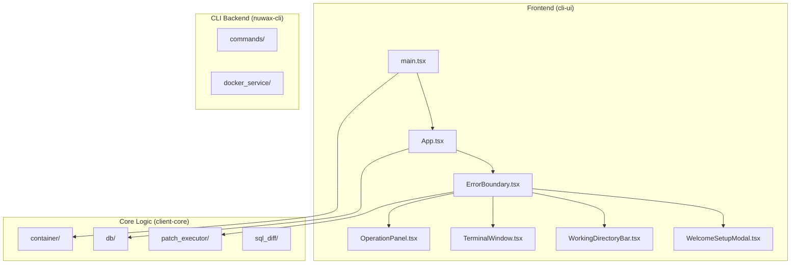
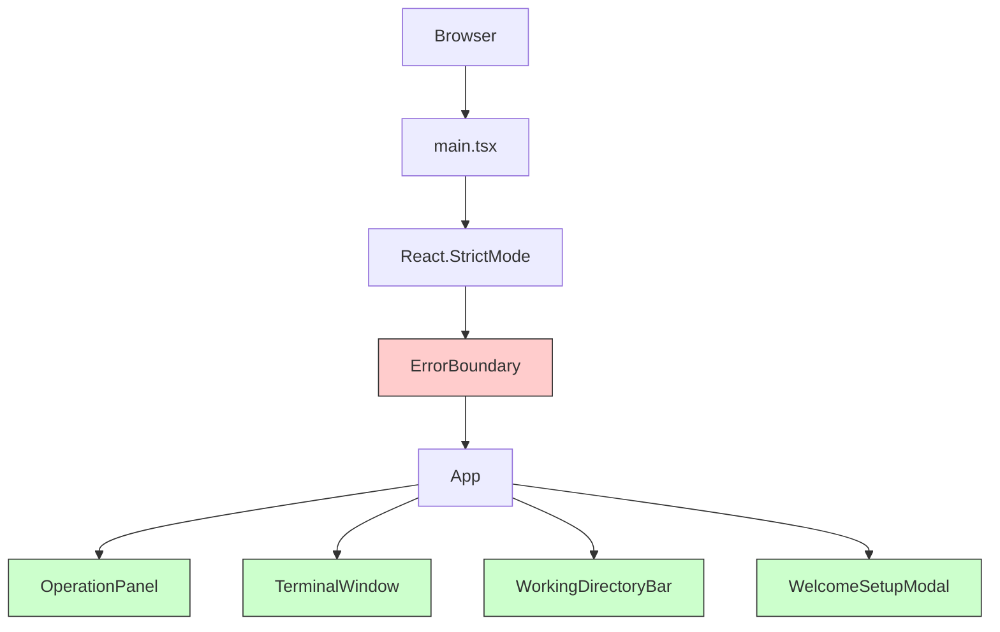
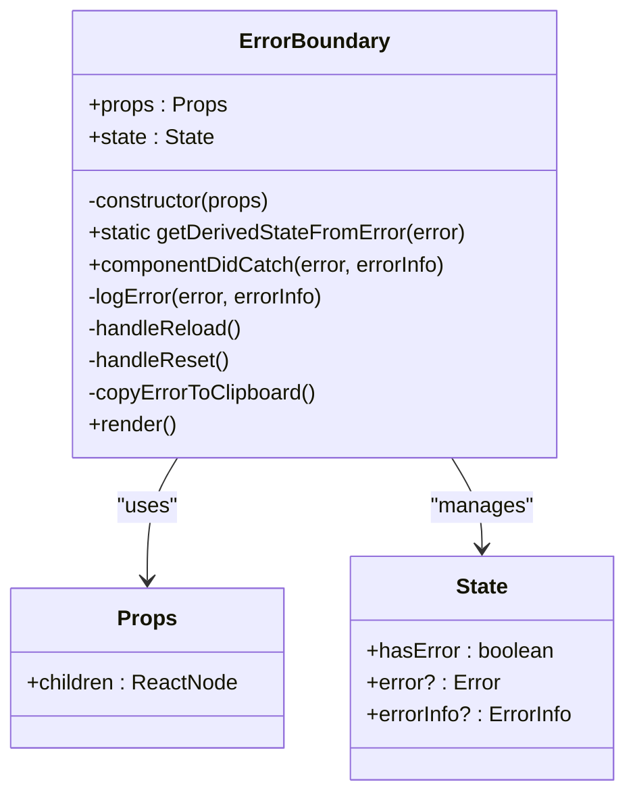
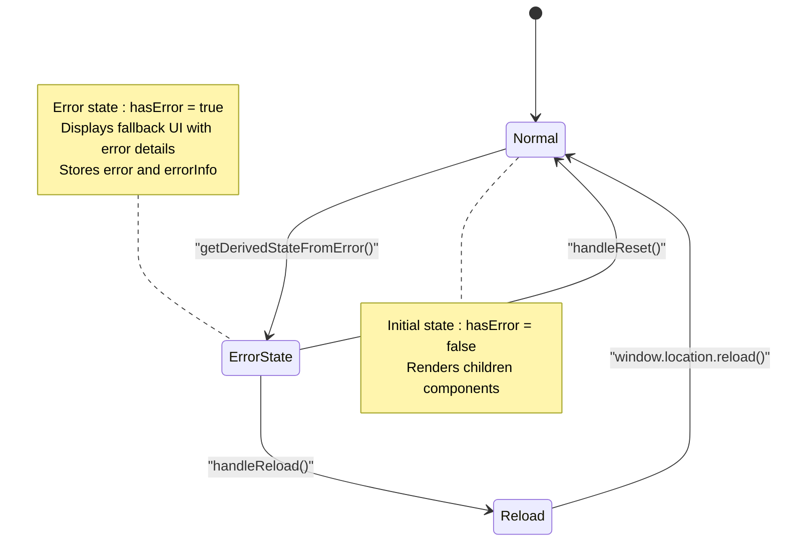
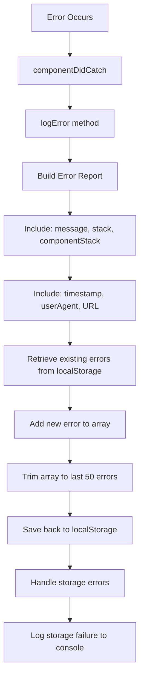
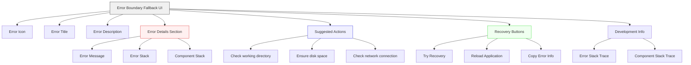
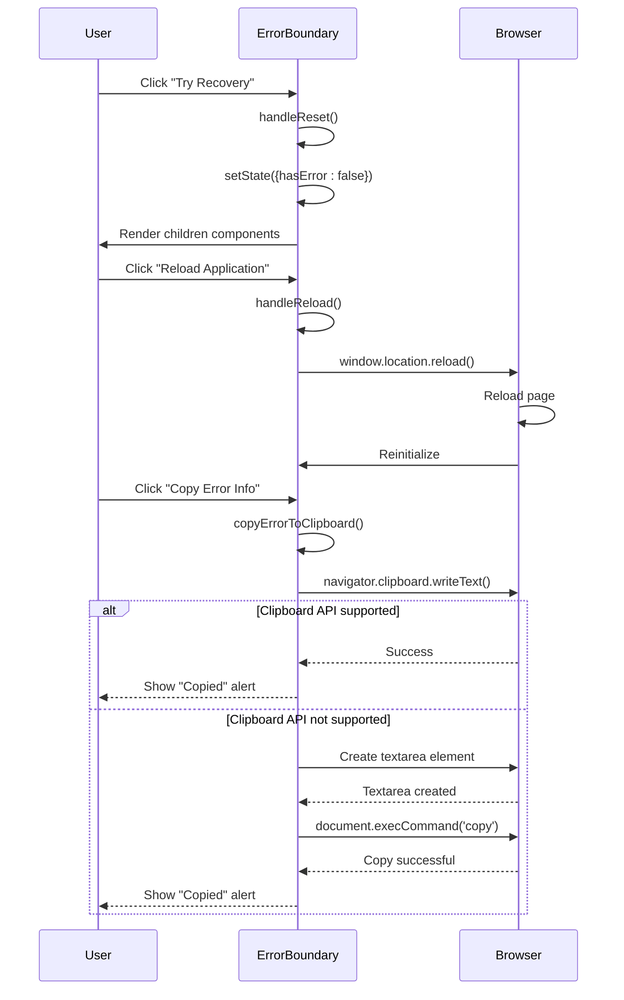
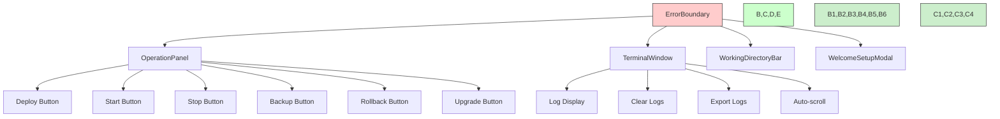
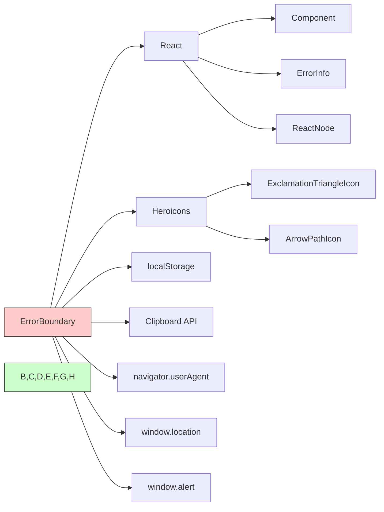

# Error Boundary

<cite>
**Referenced Files in This Document**   
- [ErrorBoundary.tsx](file://cli-ui/src/components/ErrorBoundary.tsx)
- [App.tsx](file://cli-ui/src/App.tsx)
- [main.tsx](file://cli-ui/src/main.tsx)
- [OperationPanel.tsx](file://cli-ui/src/components/OperationPanel.tsx)
- [TerminalWindow.tsx](file://cli-ui/src/components/TerminalWindow.tsx)
</cite>

## Table of Contents
1. [Introduction](#introduction)
2. [Project Structure](#project-structure)
3. [Core Components](#core-components)
4. [Architecture Overview](#architecture-overview)
5. [Detailed Component Analysis](#detailed-component-analysis)
6. [Dependency Analysis](#dependency-analysis)
7. [Performance Considerations](#performance-considerations)
8. [Troubleshooting Guide](#troubleshooting-guide)
9. [Conclusion](#conclusion)

## Introduction
The ErrorBoundary component is a critical resilience mechanism in the Duck CLI GUI application, designed to prevent runtime errors from crashing the entire React application. It implements React's error boundary pattern to gracefully handle exceptions thrown by child components such as OperationPanel and TerminalWindow. When an error occurs, the ErrorBoundary captures it, displays a user-friendly error interface, logs diagnostic information, and provides recovery options. This documentation provides a comprehensive analysis of its implementation, error handling lifecycle, state management, and integration within the application architecture.

## Project Structure
The ErrorBoundary component is located in the `cli-ui` module of the Duck client repository, specifically at `cli-ui/src/components/ErrorBoundary.tsx`. It is part of the React frontend application that provides a graphical interface for the Duck CLI tool. The component is integrated at the root level of the application's component tree, ensuring that it can catch errors from all UI components. The project follows a component-based architecture with clear separation between UI components, utility functions, and state management logic.

**Diagram sources**
- [ErrorBoundary.tsx](file://cli-ui/src/components/ErrorBoundary.tsx)
- [App.tsx](file://cli-ui/src/App.tsx)
- [main.tsx](file://cli-ui/src/main.tsx)

**Section sources**
- [ErrorBoundary.tsx](file://cli-ui/src/components/ErrorBoundary.tsx#L1-L225)
- [App.tsx](file://cli-ui/src/App.tsx#L1-L465)
- [main.tsx](file://cli-ui/src/main.tsx#L1-L13)

## Core Components
The ErrorBoundary component is implemented as a class component that extends React.Component with Props and State interfaces. It uses React's error handling lifecycle methods `getDerivedStateFromError` and `componentDidCatch` to detect and respond to errors in the component tree. The component maintains error state including the error object and error information, and provides a comprehensive fallback UI with error details, recovery options, and diagnostic tools. It is strategically placed at the root of the application to protect all child components from unhandled exceptions.

**Section sources**
- [ErrorBoundary.tsx](file://cli-ui/src/components/ErrorBoundary.tsx#L13-L224)
- [App.tsx](file://cli-ui/src/App.tsx#L457-L461)

## Architecture Overview
The ErrorBoundary serves as a protective wrapper around the entire application, implementing a fault-tolerant architecture that isolates component failures. It follows the React error boundary pattern, which requires the component to be a class component that implements the error handling lifecycle methods. The ErrorBoundary is instantiated in main.tsx as the outermost component, wrapping the App component. This ensures that any runtime errors thrown by descendant components are caught and handled gracefully, preventing the entire application from crashing.

**Diagram sources**
- [main.tsx](file://cli-ui/src/main.tsx#L7-L9)
- [App.tsx](file://cli-ui/src/App.tsx#L459-L461)
- [ErrorBoundary.tsx](file://cli-ui/src/components/ErrorBoundary.tsx#L13-L224)

## Detailed Component Analysis

### ErrorBoundary Implementation
The ErrorBoundary component implements React's error handling pattern through two key lifecycle methods: `getDerivedStateFromError` and `componentDidCatch`. The `getDerivedStateFromError` static method updates the component's state when an error is detected, setting `hasError` to true and storing the error object. The `componentDidCatch` instance method is called after an error has been thrown, allowing the component to log error information and perform side effects.

**Diagram sources**
- [ErrorBoundary.tsx](file://cli-ui/src/components/ErrorBoundary.tsx#L13-L224)

**Section sources**
- [ErrorBoundary.tsx](file://cli-ui/src/components/ErrorBoundary.tsx#L13-L224)

#### Error State Management
The ErrorBoundary manages its internal state through the State interface, which includes three properties: `hasError` (boolean flag indicating error state), `error` (the caught Error object), and `errorInfo` (React.ErrorInfo containing component stack trace). The initial state is set in the constructor with `hasError: false`. When an error occurs, `getDerivedStateFromError` updates the state to `{ hasError: true, error }`, triggering a re-render that displays the fallback UI instead of the children components.

**Diagram sources**
- [ErrorBoundary.tsx](file://cli-ui/src/components/ErrorBoundary.tsx#L19-L22)
- [ErrorBoundary.tsx](file://cli-ui/src/components/ErrorBoundary.tsx#L24-L35)

**Section sources**
- [ErrorBoundary.tsx](file://cli-ui/src/components/ErrorBoundary.tsx#L13-L35)

#### Error Logging and Diagnostics
The ErrorBoundary implements comprehensive error logging through the `logError` method, which captures detailed diagnostic information and stores it in localStorage for debugging purposes. The error report includes the error message, stack trace, component stack, timestamp, user agent, and current URL. To prevent localStorage overflow, the implementation maintains a circular buffer of the last 50 errors, automatically removing older entries when the limit is exceeded.

**Diagram sources**
- [ErrorBoundary.tsx](file://cli-ui/src/components/ErrorBoundary.tsx#L37-L97)

**Section sources**
- [ErrorBoundary.tsx](file://cli-ui/src/components/ErrorBoundary.tsx#L37-L97)

#### Fallback UI and User Experience
When an error occurs, the ErrorBoundary renders a comprehensive fallback UI that provides users with clear information about the error and actionable recovery options. The UI includes a prominent error icon, error message, suggested actions, and interactive buttons for recovery. In development mode, additional diagnostic information including the full error stack and component stack is available in a collapsible details section, aiding developers in debugging.

**Diagram sources**
- [ErrorBoundary.tsx](file://cli-ui/src/components/ErrorBoundary.tsx#L99-L222)

**Section sources**
- [ErrorBoundary.tsx](file://cli-ui/src/components/ErrorBoundary.tsx#L99-L222)

#### Error Recovery Mechanisms
The ErrorBoundary provides multiple recovery mechanisms to help users restore application functionality after an error. The `handleReset` method clears the error state without reloading the page, allowing users to continue using the application if the error was transient. The `handleReload` method performs a full page reload, which can resolve issues caused by corrupted application state. The `copyErrorToClipboard` method enables users to copy detailed error information for reporting, with a fallback mechanism for browsers that don't support the Clipboard API.

**Diagram sources**
- [ErrorBoundary.tsx](file://cli-ui/src/components/ErrorBoundary.tsx#L99-L189)

**Section sources**
- [ErrorBoundary.tsx](file://cli-ui/src/components/ErrorBoundary.tsx#L99-L189)

### Integration with Child Components
The ErrorBoundary wraps key application components including OperationPanel and TerminalWindow, protecting them from runtime errors. The OperationPanel contains action buttons for various CLI operations, while the TerminalWindow displays command output and logs. Both components interact with Tauri APIs and could potentially throw errors during execution. The ErrorBoundary ensures that any exceptions from these components are caught and handled gracefully.

**Diagram sources**
- [App.tsx](file://cli-ui/src/App.tsx#L459-L461)
- [OperationPanel.tsx](file://cli-ui/src/components/OperationPanel.tsx#L1-L506)
- [TerminalWindow.tsx](file://cli-ui/src/components/TerminalWindow.tsx#L1-L251)

**Section sources**
- [App.tsx](file://cli-ui/src/App.tsx#L459-L461)
- [OperationPanel.tsx](file://cli-ui/src/components/OperationPanel.tsx#L1-L506)
- [TerminalWindow.tsx](file://cli-ui/src/components/TerminalWindow.tsx#L1-L251)

## Dependency Analysis
The ErrorBoundary component has minimal external dependencies, relying only on React's core functionality and browser APIs. It imports Component, ErrorInfo, and ReactNode from 'react', and uses Heroicons for visual elements. The component depends on localStorage for error persistence and the Clipboard API for error reporting. It does not have direct dependencies on other application modules, maintaining a clean separation of concerns.

**Diagram sources**
- [ErrorBoundary.tsx](file://cli-ui/src/components/ErrorBoundary.tsx#L1-L11)

**Section sources**
- [ErrorBoundary.tsx](file://cli-ui/src/components/ErrorBoundary.tsx#L1-L11)

## Performance Considerations
The ErrorBoundary implementation is optimized for performance with minimal overhead in the normal (non-error) state. In the error state, the component renders a static fallback UI that does not perform expensive computations. The error logging mechanism uses synchronous localStorage operations, which could potentially block the main thread, but the impact is minimal given the infrequent nature of errors. The circular buffer implementation for error storage ensures that memory usage is bounded, preventing potential memory leaks from accumulating error reports.

## Troubleshooting Guide
When the ErrorBoundary displays the error screen, users should first try the "Try Recovery" button, which resets the error state without reloading the application. If that doesn't resolve the issue, the "Reload Application" button should be used to perform a full page refresh. Users can copy the error information using the "Copy Error Info" button and provide it to support for diagnosis. Developers can access additional diagnostic information in the "Development Info" section when running in development mode. Common issues that trigger the ErrorBoundary include network connectivity problems, invalid working directory configurations, and permission issues with file operations.

**Section sources**
- [ErrorBoundary.tsx](file://cli-ui/src/components/ErrorBoundary.tsx#L99-L222)
- [App.tsx](file://cli-ui/src/App.tsx#L362-L403)

## Conclusion
The ErrorBoundary component is a robust error handling solution that enhances the reliability and user experience of the Duck CLI GUI application. By implementing React's error boundary pattern, it effectively isolates component failures and prevents application crashes. The component provides comprehensive error logging, user-friendly error reporting, and multiple recovery options, making it easier for users to recover from unexpected errors. Its strategic placement at the root of the component tree ensures that all UI components are protected, while its clean implementation maintains separation of concerns and minimizes performance overhead.