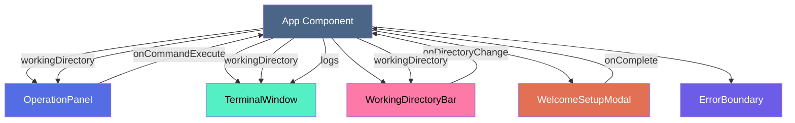
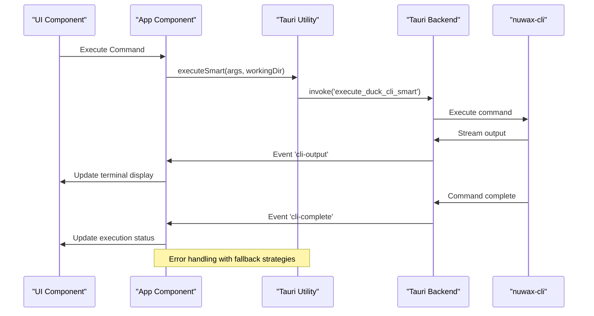
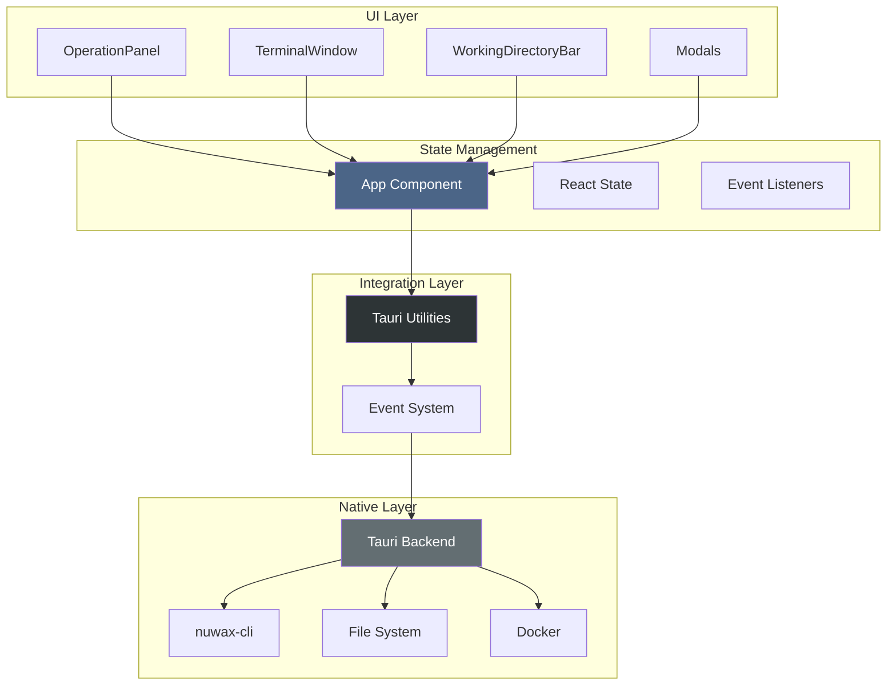
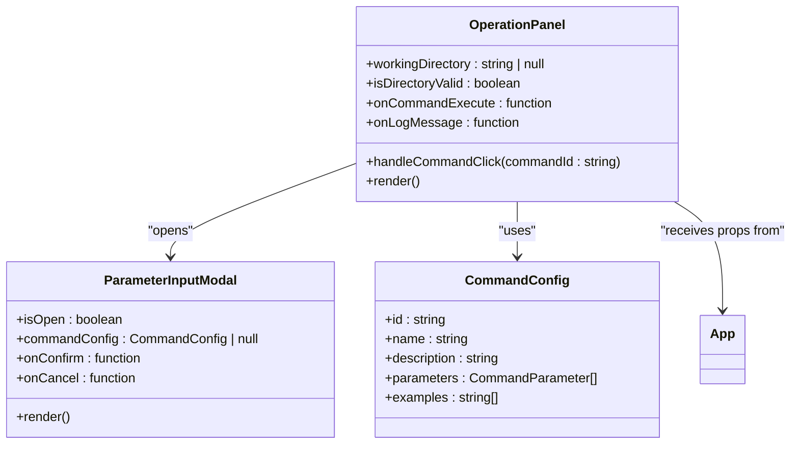
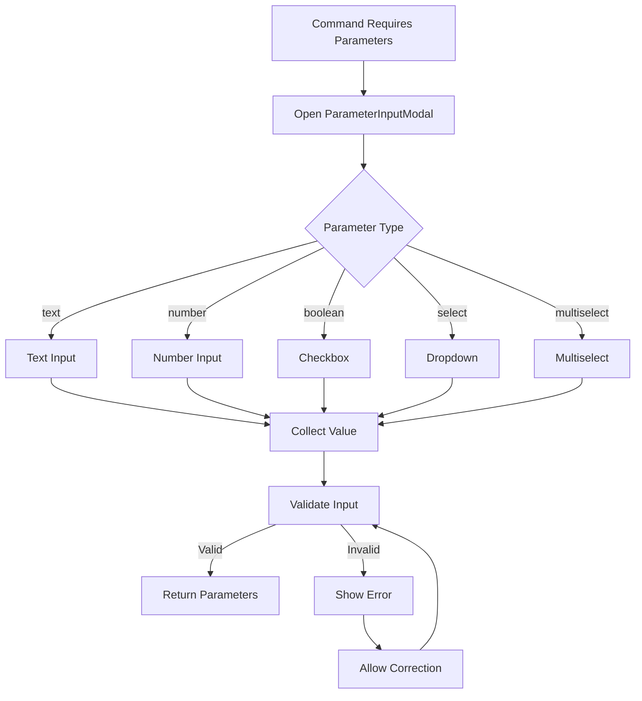
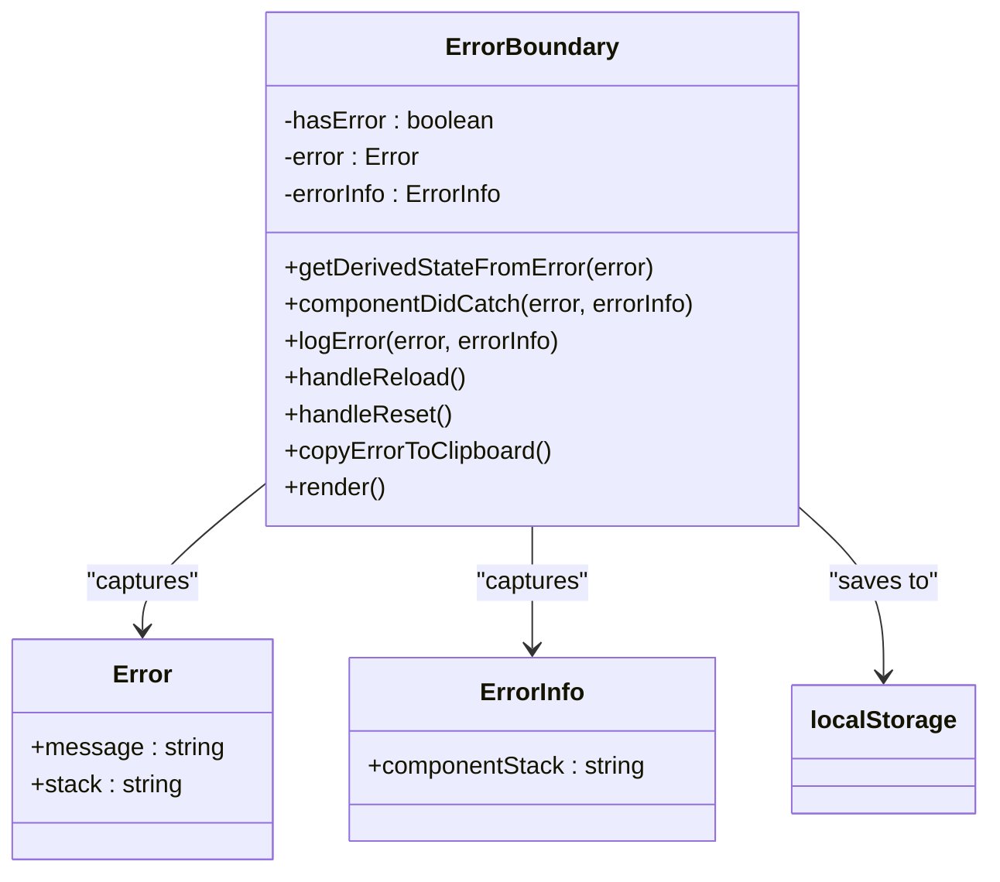

# GUI Components Overview

<cite>
**Referenced Files in This Document**   
- [ErrorBoundary.tsx](file://cli-ui/src/components/ErrorBoundary.tsx)
- [App.tsx](file://cli-ui/src/App.tsx)
- [tauri.ts](file://cli-ui/src/utils/tauri.ts)
- [commandConfigs.ts](file://cli-ui/src/config/commandConfigs.ts)
- [index.ts](file://cli-ui/src/types/index.ts)
- [main.tsx](file://cli-ui/src/main.tsx)
</cite>

## Table of Contents
1. [GUI Components Overview](#gui-components-overview)
2. [Core Components](#core-components)
3. [Component Interaction and State Management](#component-interaction-and-state-management)
4. [Tauri Integration and Backend Communication](#tauri-integration-and-backend-communication)
5. [Error Handling and Resilience](#error-handling-and-resilience)
6. [Architecture Overview](#architecture-overview)
7. [Detailed Component Analysis](#detailed-component-analysis)
8. [Common Issues and Best Practices](#common-issues-and-best-practices)

## Core Components

The Duck CLI GUI application is built using a React + TypeScript frontend integrated with a Tauri backend, providing a desktop interface for managing Docker-based services. The UI is composed of several core components that work together to provide a seamless user experience for executing CLI commands, managing configurations, and monitoring system status.

The primary components include:
- **OperationPanel**: Central control hub for executing commands
- **TerminalWindow**: Real-time log and command output display
- **WorkingDirectoryBar**: Path navigation and context indicator
- **ParameterInputModal**: Dynamic parameter collection interface
- **WelcomeSetupModal**: Initial onboarding and setup flow
- **BackupSelectionModal**: Backup configuration and management interface
- **ErrorBoundary**: Error resilience and recovery mechanism

These components are orchestrated through React's state management system and communicate with the backend via Tauri's event-driven architecture.

**Section sources**
- [App.tsx](file://cli-ui/src/App.tsx#L0-L464)

## Component Interaction and State Management

The application follows a centralized state management pattern where the main App component maintains the core application state and passes down state and callback functions to child components. This approach ensures consistent state synchronization across the UI.

Key state variables managed in the App component include:
- **workingDirectory**: Current project directory path
- **isDirectoryValid**: Validation status of the working directory
- **logs**: Collection of log entries displayed in the terminal
- **isExecuting**: Flag indicating whether a command is currently running
- **showWelcomeModal**: Controls visibility of the onboarding modal

Components interact through prop drilling and callback functions. For example, when a user selects a new working directory in the WorkingDirectoryBar, it calls the `onDirectoryChange` callback passed from the App component, which then updates the state and persists the configuration.



**Diagram sources**
- [App.tsx](file://cli-ui/src/App.tsx#L0-L464)

**Section sources**
- [App.tsx](file://cli-ui/src/App.tsx#L0-L464)

## Tauri Integration and Backend Communication

The application integrates with the backend through Tauri's plugin system and custom commands. The `tauri.ts` utility file provides a comprehensive set of classes that abstract the communication layer, making it easier for UI components to interact with the native backend.

The integration architecture includes:
- **ShellManager**: Executes CLI commands via Tauri's shell plugin
- **DialogManager**: Handles file and directory selection dialogs
- **FileSystemManager**: Manages file system operations
- **UpdateManager**: Handles application updates
- **ProcessManager**: Manages process lifecycle and conflict resolution
- **ConfigManager**: Handles configuration persistence
- **DuckCliManager**: Specialized manager for Duck CLI operations

Communication between the frontend and backend is event-driven. When a command is executed, the frontend listens for three types of events:
- **cli-output**: Real-time command output
- **cli-error**: Error messages during command execution
- **cli-complete**: Command completion with exit code



**Diagram sources**
- [tauri.ts](file://cli-ui/src/utils/tauri.ts#L0-L919)
- [App.tsx](file://cli-ui/src/App.tsx#L0-L464)

**Section sources**
- [tauri.ts](file://cli-ui/src/utils/tauri.ts#L0-L919)
- [App.tsx](file://cli-ui/src/App.tsx#L0-L464)

## Error Handling and Resilience

The application implements a comprehensive error handling strategy centered around the ErrorBoundary component, which provides both technical error recovery and user-friendly error reporting.

The ErrorBoundary component:
- Catches JavaScript errors anywhere in the component tree
- Logs detailed error information including stack traces
- Provides multiple recovery options to users
- Stores error reports in local storage for debugging
- Allows copying error details to clipboard

When an error occurs, the ErrorBoundary displays a user-friendly error page with:
- Clear error message and stack trace
- Suggested recovery actions
- Options to reset the component, reload the application, or copy error details
- Development-mode details for debugging

```mermaid
flowchart TD
A[Error Occurs] --> B{ErrorBoundary Active?}
B --> |Yes| C[Capture Error]
C --> D[Log Error Details]
D --> E[Update State: hasError=true]
E --> F[Display Error UI]
F --> G{User Action}
G --> H[Reset Component]
G --> I[Reload Application]
G --> J[Copy Error Details]
H --> K[Set hasError=false]
I --> L[window.location.reload()]
J --> M[Copy to Clipboard]
B --> |No| N[Application Crash]
style A fill:#e17055,color:white
style F fill:#fdcb6e,color:black
style H fill:#00b894,color:white
style I fill:#00b894,color:white
style J fill:#00b894,color:white
```

**Diagram sources**
- [ErrorBoundary.tsx](file://cli-ui/src/components/ErrorBoundary.tsx#L0-L224)

**Section sources**
- [ErrorBoundary.tsx](file://cli-ui/src/components/ErrorBoundary.tsx#L0-L224)
- [main.tsx](file://cli-ui/src/main.tsx#L0-L11)

## Architecture Overview

The Duck CLI GUI follows a layered architecture with clear separation of concerns between the UI, business logic, and native integration layers.



The architecture enables:
- **Reactive UI**: Components update automatically when state changes
- **Event-driven communication**: Real-time updates from backend processes
- **Resilient error handling**: Comprehensive error recovery mechanisms
- **Configurable commands**: Flexible command system with parameterized execution
- **Persistent state**: Configuration and error logs stored locally

**Diagram sources**
- [App.tsx](file://cli-ui/src/App.tsx#L0-L464)
- [tauri.ts](file://cli-ui/src/utils/tauri.ts#L0-L919)

## Detailed Component Analysis

### OperationPanel Analysis

The OperationPanel serves as the primary control hub for the application, providing access to all major functionality through a clean, organized interface. It displays available commands and allows users to execute them with appropriate parameters.

The component receives the working directory state and command execution callbacks from the parent App component. When a command requires parameters, it triggers the ParameterInputModal to collect user input before execution.



**Diagram sources**
- [App.tsx](file://cli-ui/src/App.tsx#L0-L464)

**Section sources**
- [App.tsx](file://cli-ui/src/App.tsx#L0-L464)

### TerminalWindow Analysis

The TerminalWindow component displays real-time log output and command results. It implements a circular buffer system to manage large volumes of log data efficiently, preventing memory issues while maintaining access to recent logs.

Key features include:
- Log filtering by type (info, success, error, warning, command)
- Export functionality to save logs to file
- Clear logs option
- Display of total log count and configuration limits
- Real-time updates via event listeners

The component uses a ref to avoid circular dependencies in the event callback system, ensuring that the latest log entry function is always used when processing incoming events.

**Section sources**
- [App.tsx](file://cli-ui/src/App.tsx#L0-L464)

### WorkingDirectoryBar Analysis

The WorkingDirectoryBar provides a persistent display of the current working directory and allows users to change it. It integrates with the FileSystemManager to validate directory paths and ensure they are accessible.

When a new directory is selected, the component triggers a comprehensive initialization sequence:
1. Validate the directory permissions and structure
2. Save the new directory to persistent configuration
3. Check for and clean up any conflicting processes
4. Verify database lock status
5. Update the application state accordingly

This ensures that the application always operates on a valid, accessible directory with no conflicting processes.

**Section sources**
- [App.tsx](file://cli-ui/src/App.tsx#L0-L464)
- [tauri.ts](file://cli-ui/src/utils/tauri.ts#L0-L919)

### ParameterInputModal Analysis

The ParameterInputModal dynamically generates input fields based on the command configuration. It supports multiple input types including text, number, boolean, select, and multiselect.

The modal uses the commandConfigs system to determine which parameters are required for a given command. For each parameter, it displays:
- Label and description
- Appropriate input control based on type
- Validation rules and constraints
- Default values where specified

When the user confirms the parameters, the modal returns the collected values to the calling component for command execution.



**Diagram sources**
- [commandConfigs.ts](file://cli-ui/src/config/commandConfigs.ts#L0-L320)
- [App.tsx](file://cli-ui/src/App.tsx#L0-L464)

**Section sources**
- [commandConfigs.ts](file://cli-ui/src/config/commandConfigs.ts#L0-L320)
- [App.tsx](file://cli-ui/src/App.tsx#L0-L464)

### WelcomeSetupModal Analysis

The WelcomeSetupModal provides the initial onboarding experience for new users. It guides them through setting up their working directory and initializing the application environment.

The modal is displayed when:
- No working directory is configured
- The configured directory is invalid
- The user explicitly requests setup

It integrates with the DialogManager to provide a native directory selection dialog and validates the selected directory using the FileSystemManager before proceeding with initialization.

**Section sources**
- [App.tsx](file://cli-ui/src/App.tsx#L0-L464)
- [tauri.ts](file://cli-ui/src/utils/tauri.ts#L0-L919)

### ErrorBoundary Analysis

The ErrorBoundary component implements React's error boundary pattern to catch and handle errors that occur during rendering, lifecycle methods, or event handlers.

Key functionality includes:
- **Error capture**: Uses `getDerivedStateFromError` and `componentDidCatch` lifecycle methods
- **Error logging**: Records detailed error information including component stack
- **Local storage**: Persists error reports for debugging purposes
- **User recovery**: Provides multiple options for recovering from errors
- **Clipboard integration**: Allows copying error details for support requests

The component stores up to 50 recent error reports in local storage, automatically trimming older entries to prevent storage bloat.



**Diagram sources**
- [ErrorBoundary.tsx](file://cli-ui/src/components/ErrorBoundary.tsx#L0-L224)

**Section sources**
- [ErrorBoundary.tsx](file://cli-ui/src/components/ErrorBoundary.tsx#L0-L224)

## Common Issues and Best Practices

### Modal Stacking

The application avoids modal stacking by using a single state variable (`showWelcomeModal`) to control modal visibility. Only one modal (the WelcomeSetupModal) is implemented in the current design, preventing potential stacking issues.

Best practice: Use a modal stack management system if multiple modals are needed, ensuring proper z-index ordering and focus management.

### Terminal Output Lag

The application addresses potential terminal output lag through:
- Direct event-driven updates from the backend
- Efficient state management using refs to avoid re-renders
- Circular buffer implementation for log storage
- Asynchronous processing of non-critical operations

Best practice: Implement debouncing for high-frequency log updates to prevent UI blocking during intensive operations.

### State Desynchronization

State desynchronization is prevented through:
- Centralized state management in the App component
- Consistent use of callback functions for state updates
- Event listeners that update state directly
- Validation checks before state changes

Best practice: Implement a state validation layer that verifies state consistency before applying changes, especially when dealing with asynchronous operations.

### Performance Optimization

The application includes several performance optimizations:
- **Circular buffer**: Prevents memory issues with large log volumes
- **Ref usage**: Avoids unnecessary re-renders in event callbacks
- **Async operations**: Offloads intensive tasks to prevent UI blocking
- **Conditional rendering**: Only renders components when needed
- **Efficient event handling**: Global event listeners set up once

Best practice: Monitor performance with React DevTools and implement memoization for expensive components as the application grows.