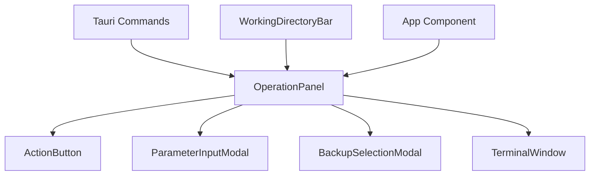
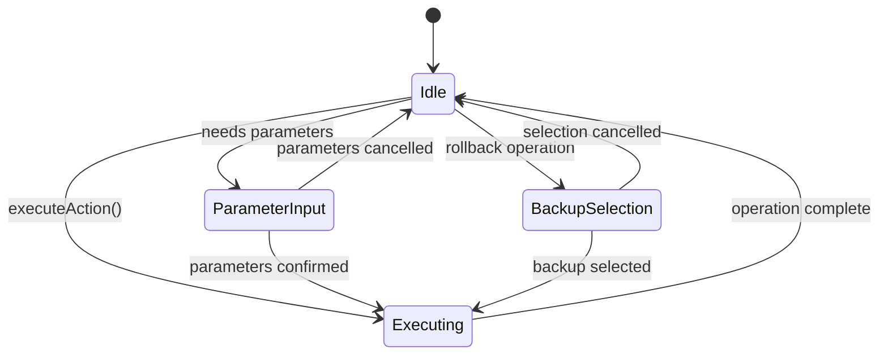
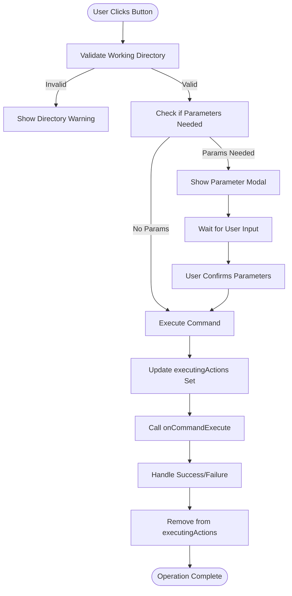
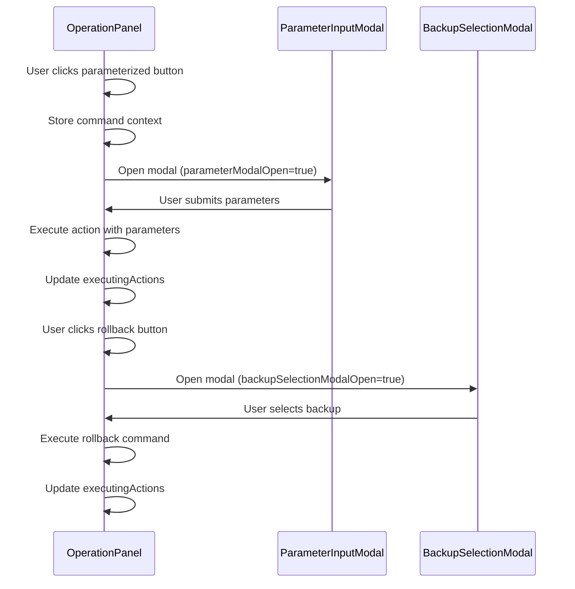

# Operation Panel

<cite>
**Referenced Files in This Document**   
- [OperationPanel.tsx](file://cli-ui/src/components/OperationPanel.tsx)
- [tauri.ts](file://cli-ui/src/utils/tauri.ts)
- [index.ts](file://cli-ui/src/types/index.ts)
- [App.tsx](file://cli-ui/src/App.tsx)
- [TerminalWindow.tsx](file://cli-ui/src/components/TerminalWindow.tsx)
</cite>

## Table of Contents
1. [Introduction](#introduction)
2. [Component Overview](#component-overview)
3. [Props Interface](#props-interface)
4. [State Management](#state-management)
5. [Operation Execution Flow](#operation-execution-flow)
6. [Integration with Tauri Commands](#integration-with-tauri-commands)
7. [Modal Integration](#modal-integration)
8. [Error Handling](#error-handling)
9. [UI Feedback and Visual States](#ui-feedback-and-visual-states)
10. [Performance Considerations](#performance-considerations)
11. [Extensibility Guidelines](#extensibility-guidelines)

## Introduction
The OperationPanel component serves as the primary control hub for the Duck CLI GUI application, providing users with a centralized interface to manage service operations. It orchestrates critical functions including service start, stop, restart, upgrade, backup, and rollback operations through integration with backend Tauri commands. The component is designed with an event-driven architecture that coordinates with other UI elements like TerminalWindow for output display and modal components for parameter collection. This documentation provides a comprehensive analysis of its implementation, covering props interface, state management, command execution patterns, error handling, and integration points.

## Component Overview
The OperationPanel is a React functional component that renders a grid of action buttons, each representing a specific operation that can be performed on the Duck CLI service. It conditionally enables or disables operations based on the validity of the working directory and provides visual feedback during operation execution. The component acts as a coordinator between user interactions and backend command execution, serving as the primary interface for all service management operations.

**Diagram sources**
- [OperationPanel.tsx](file://cli-ui/src/components/OperationPanel.tsx)
- [App.tsx](file://cli-ui/src/App.tsx)

**Section sources**
- [OperationPanel.tsx](file://cli-ui/src/components/OperationPanel.tsx#L0-L506)

## Props Interface
The OperationPanel component accepts four props that define its behavior and communication channels with the parent component:

**OperationPanelProps**
- workingDirectory: string | null - Current working directory path or null if not set
- isDirectoryValid: boolean - Flag indicating whether the current working directory is valid
- onCommandExecute: (command: string, args: string[]) => Promise<void> - Callback function to execute commands
- onLogMessage: (message: string, type: 'info' | 'success' | 'error' | 'warning') => void - Callback to log messages

These props enable the component to respond to the application's state and communicate operation requests and status updates back to the parent App component.

**Section sources**
- [OperationPanel.tsx](file://cli-ui/src/components/OperationPanel.tsx#L25-L35)

## State Management
The OperationPanel manages several internal states using React hooks to track the execution status of operations and modal visibility:

**Internal State Variables**
- executingActions: Set<string> - Tracks currently executing operations by their IDs
- parameterModalOpen: boolean - Controls visibility of the parameter input modal
- backupSelectionModalOpen: boolean - Controls visibility of the backup selection modal
- currentCommand: object | null - Stores command configuration and execution context when parameters are required

The component uses useState hooks to manage these states, with the executingActions set being particularly important for preventing race conditions by disabling buttons during execution.

**Diagram sources**
- [OperationPanel.tsx](file://cli-ui/src/components/OperationPanel.tsx#L45-L55)

**Section sources**
- [OperationPanel.tsx](file://cli-ui/src/components/OperationPanel.tsx#L45-L55)

## Operation Execution Flow
The operation execution flow in OperationPanel follows a consistent pattern across all operations, with special handling for operations requiring user input:

1. User clicks an operation button
2. executeAction function is called with operation ID, action function, and optional command ID
3. Working directory validity is checked
4. If parameters are required, ParameterInputModal is displayed
5. Operation is added to executingActions set (visual feedback)
6. Command is executed via onCommandExecute callback
7. Operation is removed from executingActions set upon completion
8. Error handling occurs in catch block

For operations requiring parameters, the flow branches to display the ParameterInputModal, which captures user input before proceeding with execution.

**Diagram sources**
- [OperationPanel.tsx](file://cli-ui/src/components/OperationPanel.tsx#L65-L125)

**Section sources**
- [OperationPanel.tsx](file://cli-ui/src/components/OperationPanel.tsx#L65-L125)

## Integration with Tauri Commands
The OperationPanel integrates with Tauri commands through a layered architecture that separates UI concerns from command execution. It does not directly invoke Tauri commands but instead uses callback functions passed from the App component:

**Command Execution Pattern**
- onCommandExecute callback triggers Tauri command execution in App.tsx
- Commands are executed via DuckCliManager's executeSmart method
- Real-time output is streamed back to the application
- Log messages are propagated through onLogMessage callback

The component defines action functions for each operation that call onCommandExecute with appropriate command arguments. For example, the "start" operation calls onCommandExecute with ['docker-service', 'start'] arguments.

**Section sources**
- [OperationPanel.tsx](file://cli-ui/src/components/OperationPanel.tsx#L200-L215)
- [App.tsx](file://cli-ui/src/App.tsx#L405-L438)

## Modal Integration
The OperationPanel integrates with two modal components to handle operations requiring additional user input:

**ParameterInputModal Integration**
- Triggered when operations require parameters (e.g., upgrade with options)
- Stores current command context in currentCommand state
- On confirmation, executes the stored action function with provided parameters
- On cancellation, closes modal and clears currentCommand state

**BackupSelectionModal Integration**
- Specifically used for the rollback operation
- Opens when user clicks the "Data Rollback" button
- Passes working directory to allow backup listing
- On backup selection, executes rollback command with selected backup ID
- Provides visual feedback during rollback execution

Both modals follow a consistent pattern of state management and callback handling to maintain a clean separation of concerns.

**Diagram sources**
- [OperationPanel.tsx](file://cli-ui/src/components/OperationPanel.tsx#L127-L195)
- [OperationPanel.tsx](file://cli-ui/src/components/OperationPanel.tsx#L480-L505)

**Section sources**
- [OperationPanel.tsx](file://cli-ui/src/components/OperationPanel.tsx#L127-L195)

## Error Handling
The OperationPanel implements comprehensive error handling at multiple levels:

**Operation-Level Error Handling**
- try-catch blocks around all asynchronous operations
- Errors logged via onLogMessage callback with 'error' type
- executingActions set properly cleaned up in finally blocks
- User-friendly error messages displayed in TerminalWindow

**Pre-Execution Validation**
- Working directory validation before operation execution
- DialogManager.showMessage for directory-related warnings
- Confirmation dialogs for destructive operations (e.g., backup)

**Specific Error Scenarios**
- Disabled operations when working directory is invalid
- Proper cleanup of executingActions set even when errors occur
- Modal state cleanup on cancellation
- Parameter validation through commandConfigs

The component relies on the ErrorBoundary component for catastrophic error handling, while managing operational errors through its callback system.

**Section sources**
- [OperationPanel.tsx](file://cli-ui/src/components/OperationPanel.tsx#L84-L125)
- [ErrorBoundary.tsx](file://cli-ui/src/components/ErrorBoundary.tsx#L48-L97)

## UI Feedback and Visual States
The OperationPanel provides clear visual feedback through multiple mechanisms:

**Button States**
- Disabled state: Grayed out when working directory is invalid or operation is executing
- Normal state: Colored based on operation type (primary, success, warning, etc.)
- Executing state: Blue highlight with spinner icon

**Visual Indicators**
- Spinner animation during operation execution
- Color-coded buttons indicating operation type
- Status messages in TerminalWindow
- Warning banner when working directory is invalid

**Responsive Design**
- Grid layout adapts to screen size (2-6 columns)
- Consistent button sizing and spacing
- Touch-friendly button dimensions
- Tooltip descriptions on hover

The getButtonStyle function determines the appropriate styling based on variant, disabled, and executing states, ensuring consistent visual feedback across all operations.

**Section sources**
- [OperationPanel.tsx](file://cli-ui/src/components/OperationPanel.tsx#L431-L466)
- [OperationPanel.tsx](file://cli-ui/src/components/OperationPanel.tsx#L468-L480)

## Performance Considerations
The OperationPanel is designed with performance and user experience in mind:

**Optimization Strategies**
- Minimal re-renders through proper state management
- Set data structure for executingActions enables O(1) lookups
- Event delegation through single onClick handlers
- Efficient conditional rendering of modals

**Potential Bottlenecks**
- Large number of simultaneous operations (mitigated by execution tracking)
- Frequent state updates during long-running operations
- Modal rendering overhead

**Best Practices Implemented**
- useCallback not needed for internal functions (component is not passed as prop)
- useMemo not needed for actionButtons array (small, static array)
- Direct state updates rather than excessive re-renders

The component maintains responsiveness even during long-running operations by offloading command execution to the backend and providing continuous feedback through the TerminalWindow.

**Section sources**
- [OperationPanel.tsx](file://cli-ui/src/components/OperationPanel.tsx#L431-L466)

## Extensibility Guidelines
The OperationPanel follows a modular design that facilitates easy extension with new operation types:

**Adding New Operations**
1. Define new ActionButton in the actionButtons array
2. Specify unique ID, title, description, icon, and variant
3. Implement action function with appropriate command execution
4. Add commandId if parameters are required
5. Ensure proper error handling and logging

**Following Existing Patterns**
- Use consistent logging format with emoji indicators
- Follow the same execution pattern with executingActions tracking
- Utilize existing callback functions (onCommandExecute, onLogMessage)
- Maintain visual consistency with button variants
- Implement proper parameter handling through ParameterInputModal

**Type Safety**
- Adhere to ActionButton interface for new operations
- Use existing CommandConfig types for parameter definitions
- Maintain TypeScript typing throughout implementation
- Follow existing error handling patterns

The component's design allows for straightforward addition of new operations while maintaining consistency in user experience and code quality.

**Section sources**
- [OperationPanel.tsx](file://cli-ui/src/components/OperationPanel.tsx#L200-L390)
- [index.ts](file://cli-ui/src/types/index.ts#L50-L65)